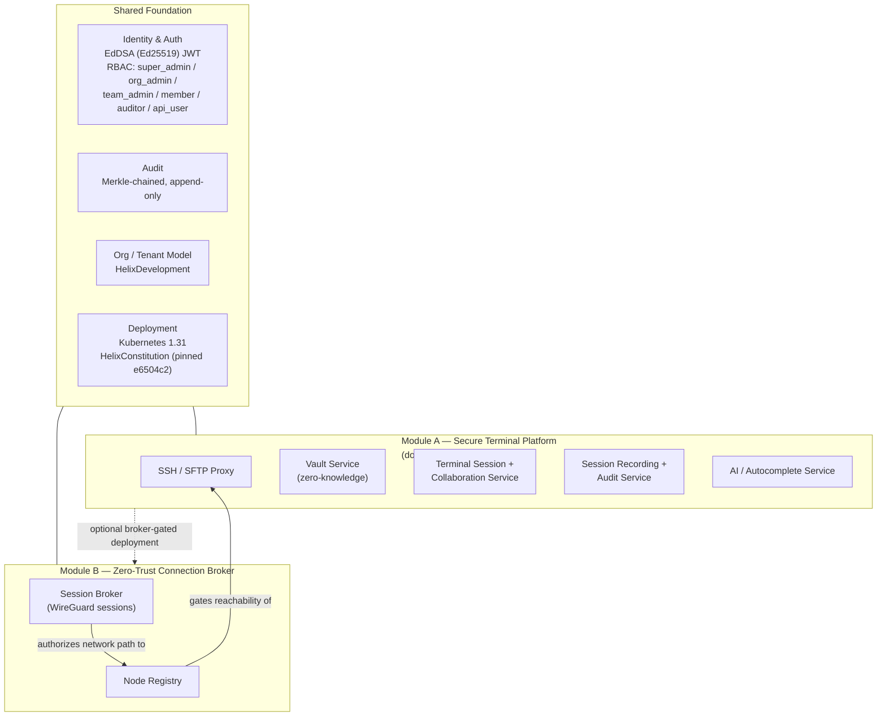

# helix_terminator — Scope & Module Boundary

**Revision:** 1 · **Last modified:** 2026-07-05T00:00:00Z
**Authority:** `docs/research/mvp/output/CANONICAL_FACTS.md` (CD-1, CD-2). Where this document
and a spec document (`docs/research/mvp/output/docs/markdown/*.md`) disagree, `CANONICAL_FACTS.md`
wins; this document exists to reconcile the DUAL-SCOPE decision recorded there so no reader treats
the two module descriptions as a contradiction.

---

## 1. Product overview

`helix_terminator` (org: **HelixDevelopment**, primary domain: **helixterminator.io**) is a
**dual-module product family**, not one product. CD-1 in `CANONICAL_FACTS.md` locked this as an
operator decision after an audit flagged the spec set as internally contradictory — Module A's docs
describe an SSH/terminal platform, Module B's doc describes a WireGuard connection broker, and on a
naive read those look like two different products competing for the name "HelixTerminator." They are
not competing descriptions of one thing; they are two related, separately shippable modules under one
product family, and this document is the reconciling boundary the audit asked for.

- **Module A — Secure Terminal Platform** (primary module): the SSH / SFTP / vault / terminal /
  real-time-collaboration product described across docs 01–10 and 12. This is the platform an
  individual developer, a platform-engineering team, or a regulated enterprise uses day to day to
  connect to hosts, manage credentials, run collaborative terminal sessions, and produce an
  auditable record of that activity.
- **Module B — Zero-Trust Connection Broker**: the WireGuard-based connection-broker /
  session-arbitration service described in doc 11. This is the component a network/security team
  uses to establish and govern the zero-trust network path (which principal may reach which node,
  over which protocol, for how long) that Module A's SSH/terminal sessions ultimately travel over
  when a deployment chooses to route through it.

Both modules ship from the same repository, the same organisation, the same constitution
inheritance, and the same identity/RBAC/audit substrate (§5). Module B does not replace Module A's
own transport security (SSH itself is still end-to-end authenticated); it adds an optional
network-admission layer in front of it for deployments that want a broker-mediated, zero-trust
network fabric rather than direct host-to-host SSH reachability.

## 2. Module A — Secure Terminal Platform

**Scope.** The enterprise SSH client platform: connection management, credential vaulting,
real-time collaborative terminal sessions, session recording, SFTP/file management, AI-assisted
terminal workflows, and the Kubernetes/container integration that lets an operator open a shell into
a pod or container through the same platform used for host SSH.

**Primary capabilities** (per doc 01 §1.2 "How HelixTerminator Surpasses Termius"):
- Zero-knowledge credential vault (client-side AES-256-GCM, Argon2id key derivation) + short-lived
  signed SSH certificates from the PKI service, so long-lived private keys never live on jump hosts.
- Real-time collaborative terminal sessions (owner / co-pilot / observer roles), CRDT-synchronized
  scrollback, broadcast sessions for training and incident response.
- Full-fidelity session recording (asciinema-format, Ed25519-signed) + Merkle-chained audit log of
  every command, transfer, auth event, and config change.
- FIDO2/WebAuthn MFA, SSO (SAML2/OIDC), device certificates, passkeys.
- AI/Autocomplete service (command suggestion, anomaly detection, runbook generation, output
  explanation) that keeps sensitive command/credential material inside the org's trust boundary.
- Kubernetes/container pod-exec and container-shell integration with the same audit and recording
  guarantees as host SSH.
- Persistent port-forwarding/tunnel management and a full SFTP file-management experience
  (multi-pane browser, directory sync, checksums, transfer queue).

**Docs covering Module A:** `01_core_architecture.md` through `10_submodule_integration.md`, and
`12_*.md` (the remaining doc in the 01–12 range not carved out as Module B). Every document in this
range that states or implies "this document covers the whole of HelixTerminator" should be read as
"the whole of Module A" — Module B is deliberately out of their scope, not omitted by oversight.

## 3. Module B — Zero-Trust Connection Broker

**Scope.** A WireGuard-centric zero-trust connection broker: it issues, arbitrates, and tears down
network-level sessions between a requesting principal and a target node, independent of what
application protocol (SSH, HTTPS, a database driver, etc.) subsequently runs over that path.

**Primary capabilities** (per doc 11's worked examples — `CreateSession`/`pb.Protocol_WIREGUARD`
domain model, `domain.ProtocolWireGuard` persistence, node/session repositories):
- Session creation and lifecycle management keyed by `UserID` / `NodeID` / `Protocol`, persisted and
  queryable (the `SessionManager` / `SessionRepository` pattern shown in doc 11's test suite).
- WireGuard as the canonical broker protocol (`Protocol_WIREGUARD` is the value exercised throughout
  doc 11's unit and integration tests), with the domain model built to admit other protocols.
- Zero-trust admission semantics: a session is only ACTIVE once the broker has authorized it — the
  broker is the arbitration point for "may this principal reach this node right now," not a passive
  VPN concentrator.
- The same constitution-compliance governance framework (package naming, AGENTS.md/CLAUDE.md
  authoring rules, `helix-deps.yaml`, CI/CD gates, anti-patterns, code-review checklist) that doc 11
  documents in depth applies to Module B's own codebase.

**Doc covering Module B:** `11_constitution_compliance.md`. That document's own scope note already
flags it as "Module B (Zero-Trust Connection Broker)" pending this reconciling document — this
document is that reconciliation landing.

> Naming note: doc 11's title is "Constitution Compliance Specification" because it was authored as
> the constitution-governance reference and happens to carry Module B's connection-broker domain
> examples as its worked test cases. The governance content in doc 11 (§1–§12 of that document)
> applies to the WHOLE product family, both Module A and Module B; only the WireGuard/session
> domain examples embedded in it are Module-B-specific. A future increment may split doc 11 into a
> pure governance document plus a dedicated Module B architecture document — DEFERRED, not required
> for this reconciliation.

## 4. Shared foundation

Both modules are independently deployable services, but they are NOT independently governed or
independently identified — they share one foundation so that "two modules" never means "two
products with divergent security postures":

- **Identity & auth:** `EdDSA` (Ed25519) JWT signing (CD-7) and the single six-role RBAC vocabulary
  `super_admin`, `org_admin`, `team_admin`, `member`, `auditor`, `api_user` (CD-8) apply to every
  service in both modules — a `member` in Module A's org is the same principal, with the same role
  vocabulary, that Module B's broker authorizes (or denies) network sessions for.
- **Audit:** both modules emit to the same Merkle-chained / append-only audit substrate; a
  Module-B-authorized network session and a Module-A-recorded terminal session are correlatable
  events in one audit trail, not two disconnected logs.
- **Org/tenant model:** one organisation namespace (`HelixDevelopment` identity, CD-2) and one
  tenant/org hierarchy — Module A hosts and Module B nodes belong to the same org/tenant records.
- **Deployment:** one Kubernetes-based deployment model (K8s 1.31, CD-4) and one constitution
  inheritance (`HelixConstitution`, pinned `e6504c2`, `helixcode-v1.1.0` line, CD-9) govern both
  modules' CI/CD gates, test-type floor, credential handling, and repository hygiene identically.
- **Versioning & governance conventions:** both modules follow the same two-axis Version/Revision
  spec-versioning convention and the same anti-bluff / four-layer test-coverage discipline described
  in doc 11 §1–§9, which is written as product-family-wide governance, not Module-B-only governance.

Because identity, RBAC, audit, org model, deployment substrate, and governance are ONE shared layer,
the two modules compose rather than compete: a reader who sees "SSH terminal platform" in docs
01–10/12 and "WireGuard connection broker" in doc 11 is looking at two capability layers of the same
governed platform, not two irreconcilable product definitions.

## 5. Boundary & integration

The modules are related, not merely co-located:

- **Module B can gate access to Module A's targets.** In a deployment that enables the broker, a
  user's path to an SSH host or Kubernetes pod (Module A) can be required to first traverse a
  Module-B-authorized WireGuard session to the target node — the broker becomes the zero-trust
  network admission control in front of Module A's application-level session. In a deployment that
  does not enable the broker, Module A's own SSH-level security (vault, certs, MFA) stands on its
  own; Module B is additive, not a hidden dependency Module A silently requires.
  (Precise wiring — which service issues the "node reachable" check into the SSH Proxy Service's
  connection path — is `DEFERRED (next increment)` per `CANONICAL_FACTS.md`'s deferred-work list;
  this document fixes the CONCEPTUAL boundary so the integration work has an unambiguous target.)
- **Module A does not require Module B.** Standalone terminal/SSH usage is a fully valid deployment
  shape with no broker in the path.
- **Module B does not require Module A.** The broker's session/node/protocol model is described
  generically enough (protocol field, not "SSH only") that it can broker access to non-terminal
  targets in principle, though HelixTerminator's shipped product surfaces it primarily to gate
  Module A.
- **Neither module's docs are errors.** Docs 01–10/12 correctly describe Module A in full; doc 11
  correctly describes Module B (plus the shared governance framework). The earlier audit finding
  ("the docs contradict on what the product is") is resolved by this document: there is no
  contradiction, there are two modules, and this section is the canonical statement of how they
  relate.

## 6. Module diagram

## 7. Summary

`helix_terminator` is one product family, governed by one constitution, one identity/RBAC/audit
substrate, and one deployment model, expressed as two modules: Module A (Secure Terminal Platform,
docs 01–10 + 12) for day-to-day SSH/terminal/collaboration use, and Module B (Zero-Trust Connection
Broker, doc 11) for WireGuard-based network-admission control that can optionally gate access to
Module A's targets. Per `CANONICAL_FACTS.md` CD-1, this reconciliation is now authored; no further
"contradiction" finding against docs 01–12 should be raised on the dual-scope basis — raise it
against this document instead if the reconciliation itself is judged incomplete.
