# HelixTerminator — Complete Mermaid Diagram Suite

> **Project:** HelixTerminator — Next-Generation Enterprise SSH Client  
> **Architecture:** 25 Go microservices + Flutter clients, Kafka + RabbitMQ, PostgreSQL + Redis, Kubernetes, Zero Trust / mTLS  
> **Generated:** 2026-06-28

---

## Table of Contents

| # | Diagram | Type |
|---|---------|------|
| 1 | High-Level System Context (C4 L1) | graph TB |
| 2 | Container Diagram (C4 L2) | graph TB |
| 3 | Microservices Architecture | graph TB |
| 4 | Kafka Topic Flow | flowchart LR |
| 5 | RabbitMQ Exchange/Queue Flow | flowchart LR |
| 6 | SSH Connection Establishment | sequenceDiagram |
| 7 | User Login with MFA | sequenceDiagram |
| 8 | Vault Sync Flow | sequenceDiagram |
| 9 | SFTP File Transfer | sequenceDiagram |
| 10 | Real-time Collaboration (Terminal Sharing) | sequenceDiagram |
| 11 | Certificate Issuance (SSH Cert CA) | sequenceDiagram |
| 12 | Vault Encryption Flow | sequenceDiagram |
| 13 | API Gateway Request Flow | sequenceDiagram |
| 14 | Zero Trust mTLS Flow | sequenceDiagram |
| 15 | Session Recording Flow | sequenceDiagram |
| 16 | SSH Connection State Machine | stateDiagram-v2 |
| 17 | Vault State Machine | stateDiagram-v2 |
| 18 | SFTP Transfer State Machine | stateDiagram-v2 |
| 19 | User Authentication State | stateDiagram-v2 |
| 20 | Service Health State | stateDiagram-v2 |
| 21 | Core Data Model ER Diagram | erDiagram |
| 22 | Auth Domain ER | erDiagram |
| 23 | SSH/Terminal Domain ER | erDiagram |
| 24 | Go Service Interface Hierarchy | classDiagram |
| 25 | Flutter BLoC Architecture | classDiagram |
| 26 | Kubernetes Cluster Layout | graph TB |
| 27 | Network Architecture | graph LR |
| 28 | Multi-Region Deployment | graph TB |
| 29 | Development Phase Plan | gantt |
| 30 | CI/CD Pipeline Flow | flowchart LR |

---

## 1. High-Level System Context (C4 Level 1)

Shows HelixTerminator as a system-in-context with all external actors and external systems it interacts with.

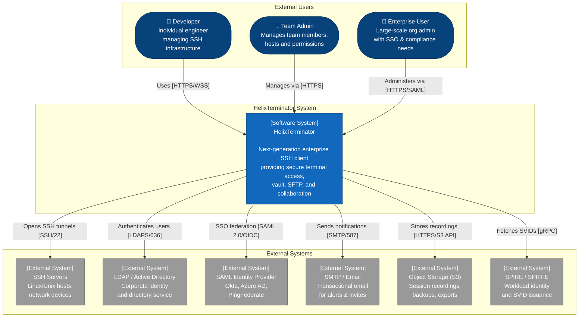
```mermaid
graph TB
    classDef person fill:#08427b,stroke:#052e56,color:#fff,rx:50
    classDef system fill:#1168bd,stroke:#0b4884,color:#fff
    classDef external fill:#999,stroke:#666,color:#fff
    classDef boundary fill:none,stroke:#1168bd,stroke-dasharray:5 5,color:#1168bd

    subgraph Users["External Users"]
        DEV["👤 Developer\nIndividual engineer\nmanaging SSH infrastructure"]
        ADMIN["👤 Team Admin\nManages team members,\nhosts and permissions"]
        ENTERPRISE["👤 Enterprise User\nLarge-scale org admin\nwith SSO & compliance needs"]
    end

    subgraph HT["HelixTerminator System"]
        CORE["[Software System]\nHelixTerminator\n\nNext-generation enterprise SSH client\nproviding secure terminal access,\nvault, SFTP, and collaboration"]
    end

    subgraph External["External Systems"]
        SSH["[External System]\nSSH Servers\nLinux/Unix hosts,\nnetwork devices"]
        LDAP["[External System]\nLDAP / Active Directory\nCorporate identity\nand directory service"]
        SAML["[External System]\nSAML Identity Provider\nOkta, Azure AD,\nPingFederate"]
        SMTP["[External System]\nSMTP / Email\nTransactional email\nfor alerts & invites"]
        S3["[External System]\nObject Storage (S3)\nSession recordings,\nbackups, exports"]
        SPIRE["[External System]\nSPIRE / SPIFFE\nWorkload identity\nand SVID issuance"]
    end

    DEV -->|"Uses [HTTPS/WSS]"| CORE
    ADMIN -->|"Manages via [HTTPS]"| CORE
    ENTERPRISE -->|"Administers via [HTTPS/SAML]"| CORE

    CORE -->|"Opens SSH tunnels [SSH/22]"| SSH
    CORE -->|"Authenticates users [LDAPS/636]"| LDAP
    CORE -->|"SSO federation [SAML 2.0/OIDC]"| SAML
    CORE -->|"Sends notifications [SMTP/587]"| SMTP
    CORE -->|"Stores recordings [HTTPS/S3 API]"| S3
    CORE -->|"Fetches SVIDs [gRPC]"| SPIRE

    class DEV,ADMIN,ENTERPRISE person
    class CORE system
    class SSH,LDAP,SAML,SMTP,S3,SPIRE external
```

---

## 2. Container Diagram (C4 Level 2)

Shows all major containers (client apps, API gateway, microservice groups, data stores, and messaging) and their primary communication channels.

```mermaid
graph TB
    classDef client fill:#08427b,stroke:#052e56,color:#fff
    classDef gateway fill:#b05a08,stroke:#7a3f06,color:#fff
    classDef service fill:#1168bd,stroke:#0b4884,color:#fff
    classDef datastore fill:#2e7d32,stroke:#1b5e20,color:#fff
    classDef messaging fill:#6a1b9a,stroke:#4a148c,color:#fff
    classDef external fill:#888,stroke:#555,color:#fff

    subgraph Clients["Client Applications"]
        FLUTTER_DESKTOP["Flutter Desktop\n(macOS/Windows/Linux)\nDart/Flutter"]
        FLUTTER_MOBILE["Flutter Mobile\n(iOS/Android)\nDart/Flutter"]
        WEB_APP["Web Application\n(Browser WASM)\nDart/Flutter Web"]
    end

    subgraph Gateway["API Gateway Layer"]
        GW["API Gateway Service\nGo + Envoy\nHTTPS/WSS :443"]
    end

    subgraph AuthDomain["Auth Domain"]
        AUTH_SVC["Auth Service\nGo :8001\nJWT/OAuth2/SAML"]
        USER_SVC["User Service\nGo :8002\nUser management"]
        PKI_SVC["PKI Service\nGo :8003\nCert CA"]
        ORG_SVC["Org Service\nGo :8004\nOrg/team RBAC"]
    end

    subgraph TerminalDomain["Terminal Domain"]
        SSH_PROXY["SSH Proxy Service\nGo :8010\nlibssh2/crypto/ssh"]
        TERMINAL_SVC["Terminal Service\nGo :8011\nWebSocket PTY"]
        SFTP_SVC["SFTP Service\nGo :8012\nFile transfer"]
        PF_SVC["Port Forward Service\nGo :8013\nTCP tunneling"]
    end

    subgraph DataDomain["Data Domain"]
        VAULT_SVC["Vault Service\nGo :8020\nE2EE secret store"]
        KEYCHAIN_SVC["Keychain Service\nGo :8021\nSSH key mgmt"]
        SNIPPET_SVC["Snippet Service\nGo :8022\nCommand library"]
        HOST_SVC["Host Service\nGo :8023\nHost inventory"]
        WS_SVC["Workspace Service\nGo :8024\nWorkspace mgmt"]
    end

    subgraph PlatformDomain["Platform Domain"]
        CONFIG_SVC["Config Service\nGo :8030\nFeature flags"]
        HEALTH_SVC["Health Service\nGo :8031\nService health"]
        NOTIF_SVC["Notification Service\nGo :8032\nAlerts/webhooks"]
        AUDIT_SVC["Audit Service\nGo :8033\nCompliance logs"]
        ANALYTICS_SVC["Analytics Service\nGo :8034\nUsage metrics"]
    end

    subgraph AIDomain["AI Domain"]
        AI_SVC["AI/Autocomplete Service\nGo :8040\nLLM integration"]
        REC_SVC["Recording Service\nGo :8041\nSession replay"]
    end

    subgraph IntegrationDomain["Integration Domain"]
        TRACK_SVC["HelixTrack Bridge\nGo :8050\nIssue tracker sync"]
        CONTAINER_SVC["Container Bridge\nGo :8051\nDocker/K8s exec"]
    end

    subgraph DataStores["Data Stores"]
        PG[("PostgreSQL 16\nPrimary DB\n:5432")]
        REDIS[("Redis Cluster\nSessions/Cache\n:6379")]
        S3_STORE[("S3 / MinIO\nRecordings/Files\n:9000")]
    end

    subgraph Messaging["Messaging Layer"]
        KAFKA["Apache Kafka\nEvent streaming\n:9092"]
        RABBIT["RabbitMQ\nCommand queues\n:5672"]
    end

    FLUTTER_DESKTOP & FLUTTER_MOBILE & WEB_APP -->|"HTTPS/WSS"| GW

    GW -->|"gRPC/HTTP2"| AUTH_SVC & USER_SVC & PKI_SVC & ORG_SVC
    GW -->|"gRPC/WSS"| SSH_PROXY & TERMINAL_SVC & SFTP_SVC & PF_SVC
    GW -->|"gRPC/HTTP2"| VAULT_SVC & KEYCHAIN_SVC & SNIPPET_SVC & HOST_SVC & WS_SVC
    GW -->|"gRPC/HTTP2"| CONFIG_SVC & HEALTH_SVC & NOTIF_SVC & AUDIT_SVC & ANALYTICS_SVC
    GW -->|"gRPC/HTTP2"| AI_SVC & REC_SVC
    GW -->|"gRPC/HTTP2"| TRACK_SVC & CONTAINER_SVC

    AUTH_SVC & USER_SVC & PKI_SVC & ORG_SVC --> PG
    VAULT_SVC & KEYCHAIN_SVC & SNIPPET_SVC & HOST_SVC & WS_SVC --> PG
    AUDIT_SVC & ANALYTICS_SVC & TRACK_SVC --> PG
    AUTH_SVC & SSH_PROXY & TERMINAL_SVC --> REDIS
    REC_SVC --> S3_STORE

    SSH_PROXY & TERMINAL_SVC & VAULT_SVC & AUDIT_SVC --> KAFKA
    NOTIF_SVC & SSH_PROXY & CONTAINER_SVC --> RABBIT

    class FLUTTER_DESKTOP,FLUTTER_MOBILE,WEB_APP client
    class GW gateway
    class AUTH_SVC,USER_SVC,PKI_SVC,ORG_SVC,SSH_PROXY,TERMINAL_SVC,SFTP_SVC,PF_SVC,VAULT_SVC,KEYCHAIN_SVC,SNIPPET_SVC,HOST_SVC,WS_SVC,CONFIG_SVC,HEALTH_SVC,NOTIF_SVC,AUDIT_SVC,ANALYTICS_SVC,AI_SVC,REC_SVC,TRACK_SVC,CONTAINER_SVC service
    class PG,REDIS,S3_STORE datastore
    class KAFKA,RABBIT messaging
```

---

## 3. Microservices Architecture — Full Domain Map

All 25 microservices grouped by domain, with inter-service gRPC/event connections labeled.

```mermaid
graph TB
    classDef authDomain fill:#1565c0,stroke:#0d47a1,color:#fff
    classDef termDomain fill:#2e7d32,stroke:#1b5e20,color:#fff
    classDef dataDomain fill:#e65100,stroke:#bf360c,color:#fff
    classDef platformDomain fill:#4a148c,stroke:#311b92,color:#fff
    classDef aiDomain fill:#880e4f,stroke:#560027,color:#fff
    classDef integDomain fill:#4e342e,stroke:#3e2723,color:#fff
    classDef infra fill:#37474f,stroke:#263238,color:#fff
    classDef client fill:#006064,stroke:#004d40,color:#fff

    CLIENT["Flutter Clients\n(Desktop/Mobile/Web)"]
    GW["API Gateway\n:443"]

    subgraph AUTH["Auth Domain"]
        A1["Auth Service\n:8001\nOAuth2 · SAML · OIDC"]
        A2["User Service\n:8002\nProfile · Preferences · MFA"]
        A3["PKI Service\n:8003\nSSH CA · TLS CA · CRL"]
        A4["Org Service\n:8004\nOrgs · Teams · RBAC · Quotas"]
    end

    subgraph TERM["Terminal Domain"]
        T1["SSH Proxy Service\n:8010\nSSH tunnels · Jump hosts · Agent fwd"]
        T2["Terminal Service\n:8011\nPTY · WebSocket · Collab"]
        T3["SFTP Service\n:8012\nUpload · Download · Sync"]
        T4["Port Forward Service\n:8013\nLocal · Remote · Dynamic"]
    end

    subgraph DATA["Data Domain"]
        D1["Vault Service\n:8020\nE2EE · Argon2id · AES-256-GCM"]
        D2["Keychain Service\n:8021\nSSH keys · Passphrases · Agent"]
        D3["Snippet Service\n:8022\nCommands · Templates · Tags"]
        D4["Host Service\n:8023\nInventory · Groups · Labels"]
        D5["Workspace Service\n:8024\nLayouts · Tabs · Sessions"]
    end

    subgraph PLATFORM["Platform Domain"]
        P1["API Gateway\n:8000\nRoute · Rate-limit · Auth MW"]
        P2["Config Service\n:8030\nFeature flags · Remote config"]
        P3["Health Service\n:8031\nLiveness · Readiness · Deps"]
        P4["Notification Service\n:8032\nEmail · Webhook · Push"]
        P5["Audit Service\n:8033\nCompliance · SIEM · Export"]
        P6["Analytics Service\n:8034\nEvents · Funnels · Reports"]
    end

    subgraph AI["AI Domain"]
        AI1["AI/Autocomplete Service\n:8040\nCommand suggest · Shell AI"]
        AI2["Recording Service\n:8041\nAsciinema · Replay · Search"]
    end

    subgraph INTEG["Integration Domain"]
        I1["HelixTrack Bridge\n:8050\nJira · GitHub · Linear"]
        I2["Container Bridge\n:8051\nDocker exec · K8s pod exec"]
    end

    CLIENT -->|"HTTPS/WSS"| GW
    GW -->|"gRPC"| A1 & A2 & A3 & A4
    GW -->|"gRPC/WSS"| T1 & T2 & T3 & T4
    GW -->|"gRPC"| D1 & D2 & D3 & D4 & D5
    GW -->|"gRPC"| P2 & P3 & P4 & P5 & P6
    GW -->|"gRPC"| AI1 & AI2
    GW -->|"gRPC"| I1 & I2

    A1 -->|"validate user"| A2
    A1 -->|"issue SSH cert"| A3
    A1 -->|"check permissions"| A4
    T1 -->|"verify cert"| A3
    T1 -->|"log session"| P5
    T2 -->|"spawn proxy"| T1
    T3 -->|"use proxy"| T1
    T4 -->|"use proxy"| T1
    D1 -->|"fetch key"| D2
    D4 -->|"check host cert"| A3
    P4 -->|"user lookup"| A2
    AI1 -->|"session context"| T2
    AI2 -->|"stream from proxy"| T1
    I2 -->|"use proxy"| T1
    P5 -->|"org context"| A4
    P6 -->|"org context"| A4

    class A1,A2,A3,A4 authDomain
    class T1,T2,T3,T4 termDomain
    class D1,D2,D3,D4,D5 dataDomain
    class P1,P2,P3,P4,P5,P6 platformDomain
    class AI1,AI2 aiDomain
    class I1,I2 integDomain
    class GW infra
    class CLIENT client
```

---

## 4. Kafka Topic Flow Diagram

Shows all Kafka producers, topics, and consumers for event-driven flows across the platform.

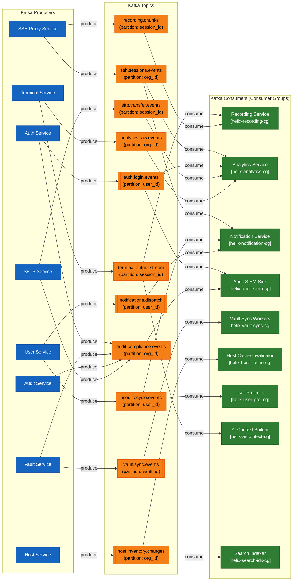
```mermaid
flowchart LR
    classDef producer fill:#1565c0,stroke:#0d47a1,color:#fff
    classDef topic fill:#f57f17,stroke:#e65100,color:#000
    classDef consumer fill:#2e7d32,stroke:#1b5e20,color:#fff

    subgraph Producers["Kafka Producers"]
        P_SSH["SSH Proxy Service"]
        P_AUTH["Auth Service"]
        P_VAULT["Vault Service"]
        P_AUDIT["Audit Service"]
        P_TERMINAL["Terminal Service"]
        P_HOST["Host Service"]
        P_USER["User Service"]
        P_SFTP["SFTP Service"]
    end

    subgraph Topics["Kafka Topics"]
        T1[["ssh.sessions.events\n(partition: org_id)"]]
        T2[["auth.login.events\n(partition: user_id)"]]
        T3[["vault.sync.events\n(partition: vault_id)"]]
        T4[["audit.compliance.events\n(partition: org_id)"]]
        T5[["terminal.output.stream\n(partition: session_id)"]]
        T6[["host.inventory.changes\n(partition: org_id)"]]
        T7[["user.lifecycle.events\n(partition: user_id)"]]
        T8[["sftp.transfer.events\n(partition: session_id)"]]
        T9[["notifications.dispatch\n(partition: user_id)"]]
        T10[["analytics.raw.events\n(partition: org_id)"]]
        T11[["recording.chunks\n(partition: session_id)"]]
    end

    subgraph Consumers["Kafka Consumers (Consumer Groups)"]
        C_REC["Recording Service\n[helix-recording-cg]"]
        C_ANALYTICS["Analytics Service\n[helix-analytics-cg]"]
        C_NOTIF["Notification Service\n[helix-notification-cg]"]
        C_AUDIT_SINK["Audit SIEM Sink\n[helix-audit-siem-cg]"]
        C_VAULT_SYNC["Vault Sync Workers\n[helix-vault-sync-cg]"]
        C_HOST_CACHE["Host Cache Invalidator\n[helix-host-cache-cg]"]
        C_USER_PROJ["User Projector\n[helix-user-proj-cg]"]
        C_AI["AI Context Builder\n[helix-ai-context-cg]"]
        C_SEARCH["Search Indexer\n[helix-search-idx-cg]"]
    end

    P_SSH -->|"produce"| T1
    P_SSH -->|"produce"| T11
    P_AUTH -->|"produce"| T2
    P_AUTH -->|"produce"| T4
    P_VAULT -->|"produce"| T3
    P_VAULT -->|"produce"| T4
    P_AUDIT -->|"produce"| T4
    P_TERMINAL -->|"produce"| T5
    P_TERMINAL -->|"produce"| T10
    P_HOST -->|"produce"| T6
    P_USER -->|"produce"| T7
    P_USER -->|"produce"| T9
    P_SFTP -->|"produce"| T8
    P_SFTP -->|"produce"| T4

    T1 -->|"consume"| C_ANALYTICS
    T1 -->|"consume"| C_NOTIF
    T2 -->|"consume"| C_ANALYTICS
    T2 -->|"consume"| C_AUDIT_SINK
    T3 -->|"consume"| C_VAULT_SYNC
    T4 -->|"consume"| C_AUDIT_SINK
    T5 -->|"consume"| C_REC
    T5 -->|"consume"| C_AI
    T6 -->|"consume"| C_HOST_CACHE
    T6 -->|"consume"| C_SEARCH
    T7 -->|"consume"| C_USER_PROJ
    T7 -->|"consume"| C_NOTIF
    T8 -->|"consume"| C_ANALYTICS
    T9 -->|"consume"| C_NOTIF
    T10 -->|"consume"| C_ANALYTICS
    T11 -->|"consume"| C_REC

    class P_SSH,P_AUTH,P_VAULT,P_AUDIT,P_TERMINAL,P_HOST,P_USER,P_SFTP producer
    class T1,T2,T3,T4,T5,T6,T7,T8,T9,T10,T11 topic
    class C_REC,C_ANALYTICS,C_NOTIF,C_AUDIT_SINK,C_VAULT_SYNC,C_HOST_CACHE,C_USER_PROJ,C_AI,C_SEARCH consumer
```

---

## 5. RabbitMQ Exchange/Queue Flow

Shows RabbitMQ exchanges, routing keys, queues, and consumers for command and notification flows.

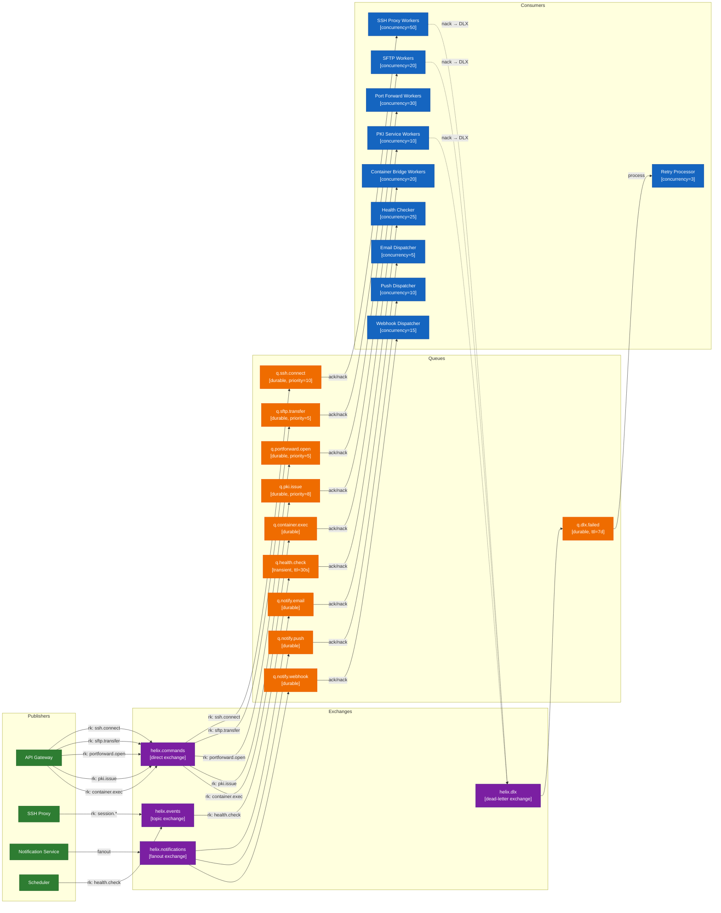
```mermaid
flowchart LR
    classDef exchange fill:#7b1fa2,stroke:#4a148c,color:#fff
    classDef queue fill:#ef6c00,stroke:#e65100,color:#fff
    classDef consumer fill:#1565c0,stroke:#0d47a1,color:#fff
    classDef producer fill:#2e7d32,stroke:#1b5e20,color:#fff

    subgraph PUBS["Publishers"]
        PUB_GW["API Gateway"]
        PUB_SSH["SSH Proxy"]
        PUB_NOTIF["Notification Service"]
        PUB_SCHED["Scheduler"]
    end

    subgraph EXCHANGES["Exchanges"]
        EX_CMD["helix.commands\n[direct exchange]"]
        EX_EVENTS["helix.events\n[topic exchange]"]
        EX_NOTIF["helix.notifications\n[fanout exchange]"]
        EX_DLX["helix.dlx\n[dead-letter exchange]"]
    end

    subgraph QUEUES["Queues"]
        Q_SSH["q.ssh.connect\n[durable, priority=10]"]
        Q_SFTP["q.sftp.transfer\n[durable, priority=5]"]
        Q_PF["q.portforward.open\n[durable, priority=5]"]
        Q_CERT["q.pki.issue\n[durable, priority=8]"]
        Q_NOTIF_EMAIL["q.notify.email\n[durable]"]
        Q_NOTIF_PUSH["q.notify.push\n[durable]"]
        Q_NOTIF_WEBHOOK["q.notify.webhook\n[durable]"]
        Q_CONTAINER["q.container.exec\n[durable]"]
        Q_DEAD["q.dlx.failed\n[durable, ttl=7d]"]
        Q_HEALTH["q.health.check\n[transient, ttl=30s]"]
    end

    subgraph CONSUMERS["Consumers"]
        CON_SSH["SSH Proxy Workers\n[concurrency=50]"]
        CON_SFTP["SFTP Workers\n[concurrency=20]"]
        CON_PF["Port Forward Workers\n[concurrency=30]"]
        CON_PKI["PKI Service Workers\n[concurrency=10]"]
        CON_EMAIL["Email Dispatcher\n[concurrency=5]"]
        CON_PUSH["Push Dispatcher\n[concurrency=10]"]
        CON_WEBHOOK["Webhook Dispatcher\n[concurrency=15]"]
        CON_CONTAINER["Container Bridge Workers\n[concurrency=20]"]
        CON_RETRY["Retry Processor\n[concurrency=3]"]
        CON_HEALTH["Health Checker\n[concurrency=25]"]
    end

    PUB_GW -->|"rk: ssh.connect"| EX_CMD
    PUB_GW -->|"rk: sftp.transfer"| EX_CMD
    PUB_GW -->|"rk: portforward.open"| EX_CMD
    PUB_GW -->|"rk: pki.issue"| EX_CMD
    PUB_GW -->|"rk: container.exec"| EX_CMD
    PUB_SSH -->|"rk: session.*"| EX_EVENTS
    PUB_NOTIF -->|"fanout"| EX_NOTIF
    PUB_SCHED -->|"rk: health.check"| EX_EVENTS

    EX_CMD -->|"rk: ssh.connect"| Q_SSH
    EX_CMD -->|"rk: sftp.transfer"| Q_SFTP
    EX_CMD -->|"rk: portforward.open"| Q_PF
    EX_CMD -->|"rk: pki.issue"| Q_CERT
    EX_CMD -->|"rk: container.exec"| Q_CONTAINER
    EX_EVENTS -->|"rk: health.check"| Q_HEALTH
    EX_NOTIF --> Q_NOTIF_EMAIL
    EX_NOTIF --> Q_NOTIF_PUSH
    EX_NOTIF --> Q_NOTIF_WEBHOOK
    EX_DLX --> Q_DEAD

    Q_SSH -->|"ack/nack"| CON_SSH
    Q_SFTP -->|"ack/nack"| CON_SFTP
    Q_PF -->|"ack/nack"| CON_PF
    Q_CERT -->|"ack/nack"| CON_PKI
    Q_NOTIF_EMAIL -->|"ack/nack"| CON_EMAIL
    Q_NOTIF_PUSH -->|"ack/nack"| CON_PUSH
    Q_NOTIF_WEBHOOK -->|"ack/nack"| CON_WEBHOOK
    Q_CONTAINER -->|"ack/nack"| CON_CONTAINER
    Q_DEAD -->|"process"| CON_RETRY
    Q_HEALTH -->|"ack/nack"| CON_HEALTH

    CON_SSH -.->|"nack → DLX"| EX_DLX
    CON_SFTP -.->|"nack → DLX"| EX_DLX
    CON_PKI -.->|"nack → DLX"| EX_DLX

    class EX_CMD,EX_EVENTS,EX_NOTIF,EX_DLX exchange
    class Q_SSH,Q_SFTP,Q_PF,Q_CERT,Q_NOTIF_EMAIL,Q_NOTIF_PUSH,Q_NOTIF_WEBHOOK,Q_CONTAINER,Q_DEAD,Q_HEALTH queue
    class CON_SSH,CON_SFTP,CON_PF,CON_PKI,CON_EMAIL,CON_PUSH,CON_WEBHOOK,CON_CONTAINER,CON_RETRY,CON_HEALTH consumer
    class PUB_GW,PUB_SSH,PUB_NOTIF,PUB_SCHED producer
```

---

## 6. SSH Connection Establishment

Full sequence from client initiating connection through authentication, jump host traversal, and active shell.

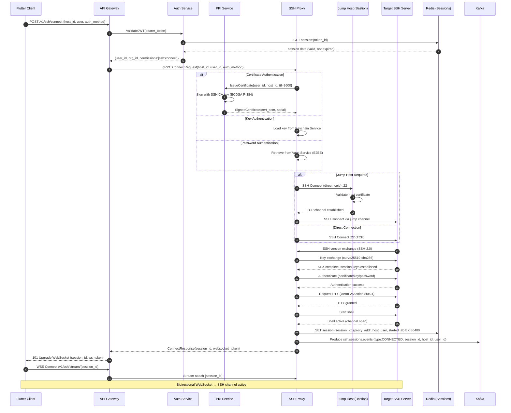
```mermaid
sequenceDiagram
    autonumber
    participant C as Flutter Client
    participant GW as API Gateway
    participant AUTH as Auth Service
    participant PKI as PKI Service
    participant PROXY as SSH Proxy
    participant JUMP as Jump Host (Bastion)
    participant TARGET as Target SSH Server
    participant REDIS as Redis (Sessions)
    participant KAFKA as Kafka

    C->>GW: POST /v1/ssh/connect {host_id, user, auth_method}
    GW->>AUTH: ValidateJWT(bearer_token)
    AUTH->>REDIS: GET session:{token_id}
    REDIS-->>AUTH: session data (valid, not expired)
    AUTH-->>GW: {user_id, org_id, permissions:[ssh:connect]}
    GW->>PROXY: gRPC ConnectRequest{host_id, user_id, auth_method}

    alt Certificate Authentication
        PROXY->>PKI: IssueCertificate{user_id, host_id, ttl=3600}
        PKI->>PKI: Sign with SSH CA key (ECDSA P-384)
        PKI-->>PROXY: SignedCertificate{cert_pem, serial}
    else Key Authentication
        PROXY->>PROXY: Load key from Keychain Service
    else Password Authentication
        PROXY->>PROXY: Retrieve from Vault Service (E2EE)
    end

    alt Jump Host Required
        PROXY->>JUMP: SSH Connect (direct-tcpip) :22
        JUMP->>JUMP: Validate host certificate
        JUMP-->>PROXY: TCP channel established
        PROXY->>TARGET: SSH Connect via jump channel
    else Direct Connection
        PROXY->>TARGET: SSH Connect :22 (TCP)
    end

    TARGET->>PROXY: SSH version exchange (SSH-2.0)
    PROXY->>TARGET: Key exchange (curve25519-sha256)
    TARGET-->>PROXY: KEX complete, session keys established
    PROXY->>TARGET: Authenticate (certificate/key/password)
    TARGET-->>PROXY: Authentication success
    PROXY->>TARGET: Request PTY (xterm-256color, 80x24)
    TARGET-->>PROXY: PTY granted
    PROXY->>TARGET: Start shell
    TARGET-->>PROXY: Shell active (channel open)

    PROXY->>REDIS: SET session:{session_id} {proxy_addr, host, user, started_at} EX 86400
    PROXY->>KAFKA: Produce ssh.sessions.events {type:CONNECTED, session_id, host_id, user_id}

    PROXY-->>GW: ConnectResponse{session_id, websocket_token}
    GW-->>C: 101 Upgrade WebSocket {session_id, ws_token}
    C->>GW: WSS Connect /v1/ssh/stream/{session_id}
    GW->>PROXY: Stream attach {session_id}
    Note over C,TARGET: Bidirectional WebSocket ↔ SSH channel active
```

---

## 7. User Login with MFA

Full authentication flow covering credential validation, TOTP/FIDO2 verification, JWT issuance, and session creation.

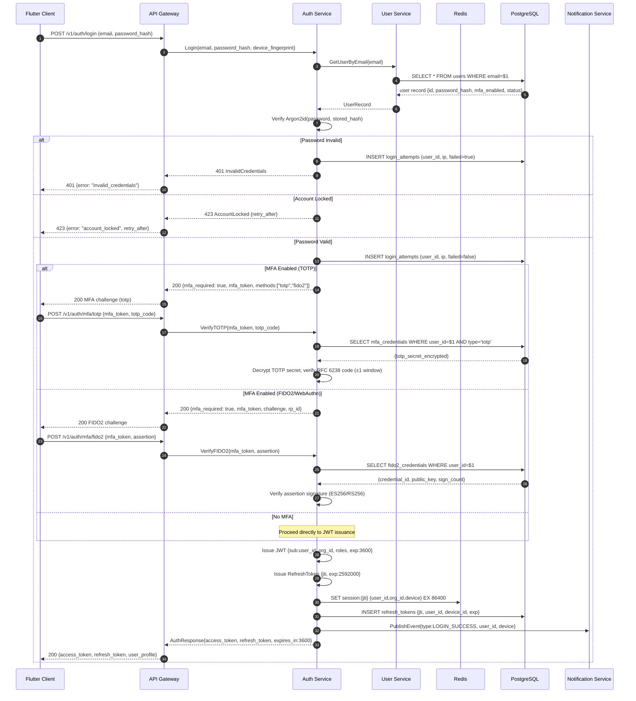
```mermaid
sequenceDiagram
    autonumber
    participant C as Flutter Client
    participant GW as API Gateway
    participant AUTH as Auth Service
    participant USER as User Service
    participant REDIS as Redis
    participant PG as PostgreSQL
    participant NOTIF as Notification Service

    C->>GW: POST /v1/auth/login {email, password_hash}
    GW->>AUTH: Login{email, password_hash, device_fingerprint}
    AUTH->>USER: GetUserByEmail{email}
    USER->>PG: SELECT * FROM users WHERE email=$1
    PG-->>USER: user record {id, password_hash, mfa_enabled, status}
    USER-->>AUTH: UserRecord

    AUTH->>AUTH: Verify Argon2id(password, stored_hash)
    alt Password Invalid
        AUTH->>PG: INSERT login_attempts (user_id, ip, failed=true)
        AUTH-->>GW: 401 InvalidCredentials
        GW-->>C: 401 {error: "invalid_credentials"}
    else Account Locked
        AUTH-->>GW: 423 AccountLocked {retry_after}
        GW-->>C: 423 {error: "account_locked", retry_after}
    else Password Valid
        AUTH->>PG: INSERT login_attempts (user_id, ip, failed=false)

        alt MFA Enabled (TOTP)
            AUTH-->>GW: 200 {mfa_required: true, mfa_token, methods:["totp","fido2"]}
            GW-->>C: 200 MFA challenge (totp)
            C->>GW: POST /v1/auth/mfa/totp {mfa_token, totp_code}
            GW->>AUTH: VerifyTOTP{mfa_token, totp_code}
            AUTH->>PG: SELECT mfa_credentials WHERE user_id=$1 AND type='totp'
            PG-->>AUTH: {totp_secret_encrypted}
            AUTH->>AUTH: Decrypt TOTP secret, verify RFC 6238 code (±1 window)
        else MFA Enabled (FIDO2/WebAuthn)
            AUTH-->>GW: 200 {mfa_required: true, mfa_token, challenge, rp_id}
            GW-->>C: 200 FIDO2 challenge
            C->>GW: POST /v1/auth/mfa/fido2 {mfa_token, assertion}
            GW->>AUTH: VerifyFIDO2{mfa_token, assertion}
            AUTH->>PG: SELECT fido2_credentials WHERE user_id=$1
            PG-->>AUTH: {credential_id, public_key, sign_count}
            AUTH->>AUTH: Verify assertion signature (ES256/RS256)
        else No MFA
            Note over AUTH: Proceed directly to JWT issuance
        end

        AUTH->>AUTH: Issue JWT {sub:user_id, org_id, roles, exp:3600}
        AUTH->>AUTH: Issue RefreshToken {jti, exp:2592000}
        AUTH->>REDIS: SET session:{jti} {user_id,org_id,device} EX 86400
        AUTH->>PG: INSERT refresh_tokens {jti, user_id, device_id, exp}
        AUTH->>NOTIF: PublishEvent{type:LOGIN_SUCCESS, user_id, device}

        AUTH-->>GW: AuthResponse{access_token, refresh_token, expires_in:3600}
        GW-->>C: 200 {access_token, refresh_token, user_profile}
    end
```

---

## 8. Vault Sync Flow

End-to-end vault synchronization from client write through encryption, persistence, Kafka event propagation, and multi-device sync.

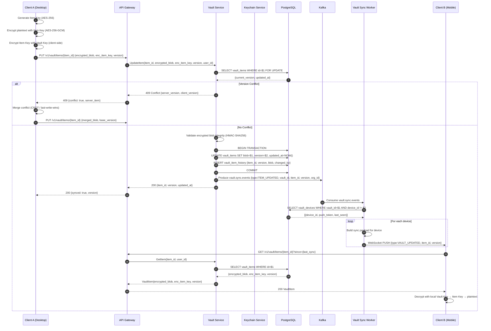
```mermaid
sequenceDiagram
    autonumber
    participant C1 as Client A (Desktop)
    participant GW as API Gateway
    participant VAULT as Vault Service
    participant KEY as Keychain Service
    participant PG as PostgreSQL
    participant KAFKA as Kafka
    participant SYNC as Vault Sync Worker
    participant C2 as Client B (Mobile)

    C1->>C1: Generate Item Key (AES-256)
    C1->>C1: Encrypt plaintext with Item Key (AES-256-GCM)
    C1->>C1: Encrypt Item Key with Vault Key (client-side)
    C1->>GW: PUT /v1/vault/items/{item_id} {encrypted_blob, enc_item_key, version}
    GW->>VAULT: UpdateItem{item_id, encrypted_blob, enc_item_key, version, user_id}

    VAULT->>PG: SELECT vault_items WHERE id=$1 FOR UPDATE
    PG-->>VAULT: {current_version, updated_at}

    alt Version Conflict
        VAULT-->>GW: 409 Conflict {server_version, client_version}
        GW-->>C1: 409 {conflict: true, server_item}
        C1->>C1: Merge conflict (CRDT / last-write-wins)
        C1->>GW: PUT /v1/vault/items/{item_id} {merged_blob, base_version}
    else No Conflict
        VAULT->>VAULT: Validate encrypted blob integrity (HMAC-SHA256)
        VAULT->>PG: BEGIN TRANSACTION
        VAULT->>PG: UPDATE vault_items SET blob=$1, version=$2, updated_at=NOW()
        VAULT->>PG: INSERT vault_item_history {item_id, version, blob, changed_by}
        VAULT->>PG: COMMIT

        VAULT->>KAFKA: Produce vault.sync.events {type:ITEM_UPDATED, vault_id, item_id, version, org_id}

        VAULT-->>GW: 200 {item_id, version, updated_at}
        GW-->>C1: 200 {synced: true, version}

        KAFKA->>SYNC: Consume vault.sync.events
        SYNC->>PG: SELECT vault_devices WHERE vault_id=$1 AND device_id != $2
        PG-->>SYNC: [{device_id, push_token, last_seen}]

        loop For each device
            SYNC->>SYNC: Build sync payload for device
            SYNC->>C2: WebSocket PUSH {type:VAULT_UPDATED, item_id, version}
        end

        C2->>GW: GET /v1/vault/items/{item_id}?since={last_sync}
        GW->>VAULT: GetItem{item_id, user_id}
        VAULT->>PG: SELECT vault_items WHERE id=$1
        PG-->>VAULT: {encrypted_blob, enc_item_key, version}
        VAULT-->>GW: VaultItem{encrypted_blob, enc_item_key, version}
        GW-->>C2: 200 VaultItem
        C2->>C2: Decrypt with local Vault Key → Item Key → plaintext
    end
```

---

## 9. SFTP File Transfer

Full SFTP upload/download flow including authentication, channel setup, progress tracking, and error handling.

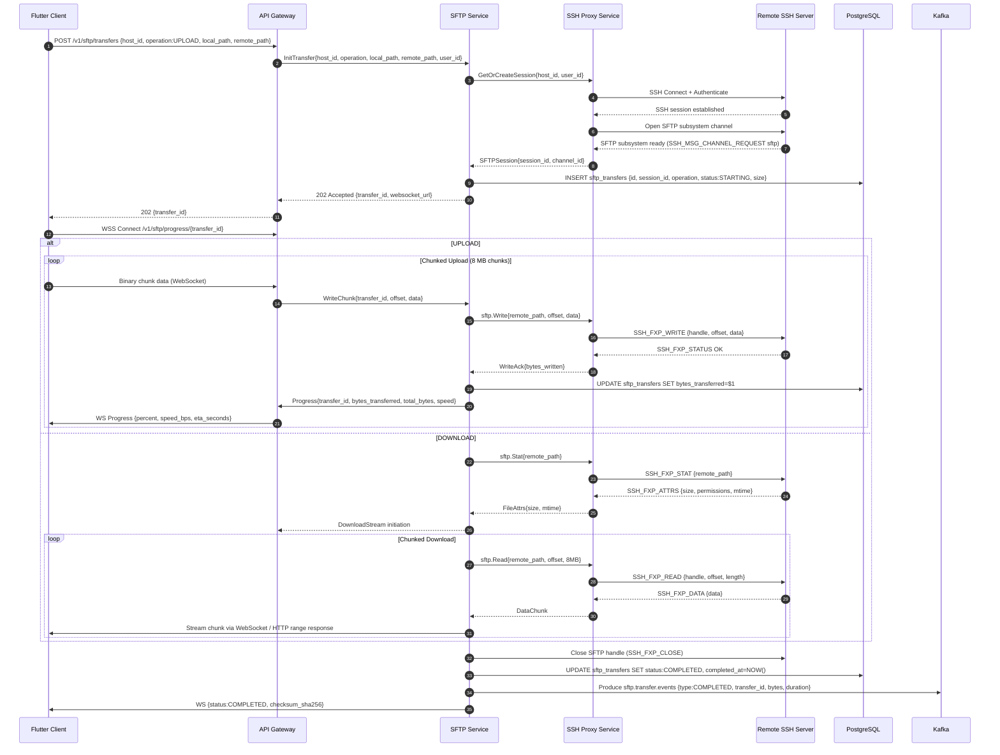
```mermaid
sequenceDiagram
    autonumber
    participant C as Flutter Client
    participant GW as API Gateway
    participant SFTP as SFTP Service
    participant PROXY as SSH Proxy Service
    participant REMOTE as Remote SSH Server
    participant PG as PostgreSQL
    participant KAFKA as Kafka

    C->>GW: POST /v1/sftp/transfers {host_id, operation:UPLOAD, local_path, remote_path}
    GW->>SFTP: InitTransfer{host_id, operation, local_path, remote_path, user_id}

    SFTP->>PROXY: GetOrCreateSession{host_id, user_id}
    PROXY->>REMOTE: SSH Connect + Authenticate
    REMOTE-->>PROXY: SSH session established
    PROXY->>REMOTE: Open SFTP subsystem channel
    REMOTE-->>PROXY: SFTP subsystem ready (SSH_MSG_CHANNEL_REQUEST sftp)
    PROXY-->>SFTP: SFTPSession{session_id, channel_id}

    SFTP->>PG: INSERT sftp_transfers {id, session_id, operation, status:STARTING, size}
    SFTP-->>GW: 202 Accepted {transfer_id, websocket_url}
    GW-->>C: 202 {transfer_id}

    C->>GW: WSS Connect /v1/sftp/progress/{transfer_id}

    alt UPLOAD
        loop Chunked Upload (8 MB chunks)
            C->>GW: Binary chunk data (WebSocket)
            GW->>SFTP: WriteChunk{transfer_id, offset, data}
            SFTP->>PROXY: sftp.Write{remote_path, offset, data}
            PROXY->>REMOTE: SSH_FXP_WRITE {handle, offset, data}
            REMOTE-->>PROXY: SSH_FXP_STATUS OK
            PROXY-->>SFTP: WriteAck{bytes_written}
            SFTP->>PG: UPDATE sftp_transfers SET bytes_transferred=$1
            SFTP->>GW: Progress{transfer_id, bytes_transferred, total_bytes, speed}
            GW->>C: WS Progress {percent, speed_bps, eta_seconds}
        end
    else DOWNLOAD
        SFTP->>PROXY: sftp.Stat{remote_path}
        PROXY->>REMOTE: SSH_FXP_STAT {remote_path}
        REMOTE-->>PROXY: SSH_FXP_ATTRS {size, permissions, mtime}
        PROXY-->>SFTP: FileAttrs{size, mtime}
        SFTP-->>GW: DownloadStream initiation
        loop Chunked Download
            SFTP->>PROXY: sftp.Read{remote_path, offset, 8MB}
            PROXY->>REMOTE: SSH_FXP_READ {handle, offset, length}
            REMOTE-->>PROXY: SSH_FXP_DATA {data}
            PROXY-->>SFTP: DataChunk
            SFTP->>C: Stream chunk via WebSocket / HTTP range response
        end
    end

    SFTP->>REMOTE: Close SFTP handle (SSH_FXP_CLOSE)
    SFTP->>PG: UPDATE sftp_transfers SET status:COMPLETED, completed_at=NOW()
    SFTP->>KAFKA: Produce sftp.transfer.events {type:COMPLETED, transfer_id, bytes, duration}
    SFTP->>C: WS {status:COMPLETED, checksum_sha256}
```

---

## 10. Real-time Collaboration (Terminal Sharing)

Sequence for initiating a collaborative terminal session, observer join flow, and data multiplexing.

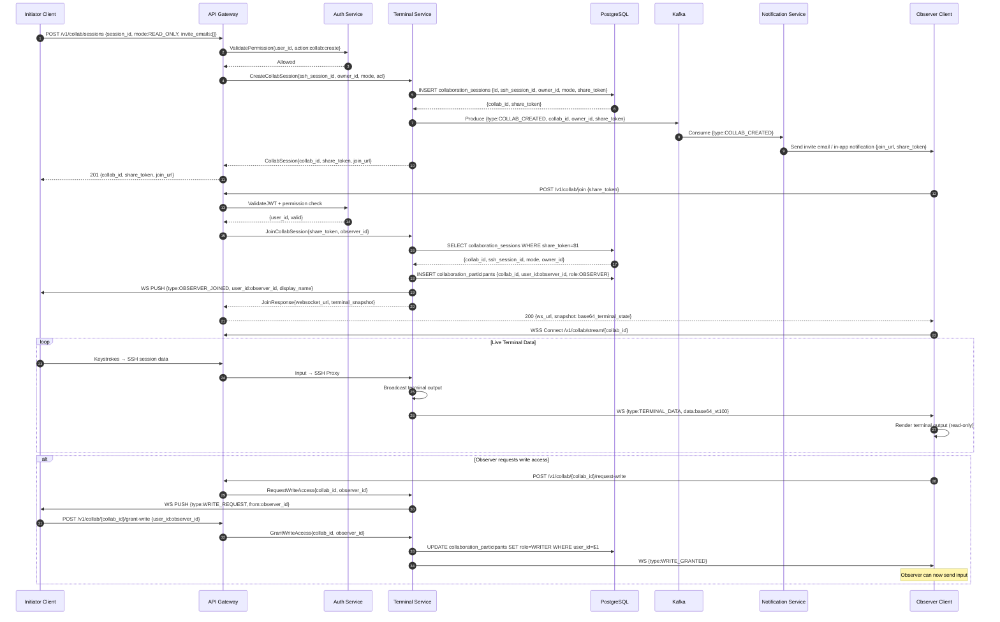
```mermaid
sequenceDiagram
    autonumber
    participant INIT as Initiator Client
    participant GW as API Gateway
    participant AUTH as Auth Service
    participant TERM as Terminal Service
    participant PG as PostgreSQL
    participant KAFKA as Kafka
    participant NOTIF as Notification Service
    participant OBS as Observer Client

    INIT->>GW: POST /v1/collab/sessions {session_id, mode:READ_ONLY, invite_emails:[]}
    GW->>AUTH: ValidatePermission{user_id, action:collab:create}
    AUTH-->>GW: Allowed

    GW->>TERM: CreateCollabSession{ssh_session_id, owner_id, mode, acl}
    TERM->>PG: INSERT collaboration_sessions {id, ssh_session_id, owner_id, mode, share_token}
    PG-->>TERM: {collab_id, share_token}

    TERM->>KAFKA: Produce {type:COLLAB_CREATED, collab_id, owner_id, share_token}
    KAFKA->>NOTIF: Consume {type:COLLAB_CREATED}
    NOTIF->>OBS: Send invite email / in-app notification {join_url, share_token}

    TERM-->>GW: CollabSession{collab_id, share_token, join_url}
    GW-->>INIT: 201 {collab_id, share_token, join_url}

    OBS->>GW: POST /v1/collab/join {share_token}
    GW->>AUTH: ValidateJWT + permission check
    AUTH-->>GW: {user_id, valid}
    GW->>TERM: JoinCollabSession{share_token, observer_id}

    TERM->>PG: SELECT collaboration_sessions WHERE share_token=$1
    PG-->>TERM: {collab_id, ssh_session_id, mode, owner_id}
    TERM->>PG: INSERT collaboration_participants {collab_id, user_id:observer_id, role:OBSERVER}

    TERM->>INIT: WS PUSH {type:OBSERVER_JOINED, user_id:observer_id, display_name}

    TERM-->>GW: JoinResponse{websocket_url, terminal_snapshot}
    GW-->>OBS: 200 {ws_url, snapshot: base64_terminal_state}
    OBS->>GW: WSS Connect /v1/collab/stream/{collab_id}

    loop Live Terminal Data
        INIT->>GW: Keystrokes → SSH session data
        GW->>TERM: Input → SSH Proxy
        TERM->>TERM: Broadcast terminal output
        TERM->>OBS: WS {type:TERMINAL_DATA, data:base64_vt100}
        OBS->>OBS: Render terminal output (read-only)
    end

    alt Observer requests write access
        OBS->>GW: POST /v1/collab/{collab_id}/request-write
        GW->>TERM: RequestWriteAccess{collab_id, observer_id}
        TERM->>INIT: WS PUSH {type:WRITE_REQUEST, from:observer_id}
        INIT->>GW: POST /v1/collab/{collab_id}/grant-write {user_id:observer_id}
        GW->>TERM: GrantWriteAccess{collab_id, observer_id}
        TERM->>PG: UPDATE collaboration_participants SET role=WRITER WHERE user_id=$1
        TERM->>OBS: WS {type:WRITE_GRANTED}
        Note over OBS: Observer can now send input
    end
```

---

## 11. Certificate Issuance (SSH Cert CA)

Flow from client requesting an SSH certificate through signing and deployment to SSH Proxy.

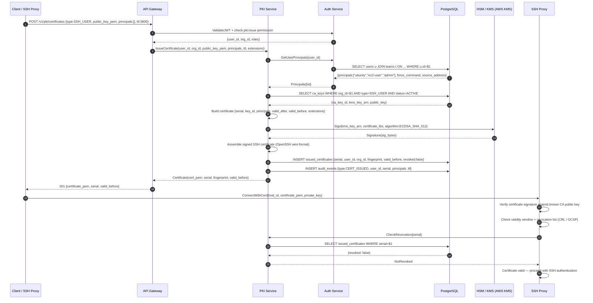
```mermaid
sequenceDiagram
    autonumber
    participant C as Client / SSH Proxy
    participant GW as API Gateway
    participant PKI as PKI Service
    participant AUTH as Auth Service
    participant PG as PostgreSQL
    participant HSM as HSM / KMS (AWS KMS)
    participant PROXY as SSH Proxy

    C->>GW: POST /v1/pki/certificates {type:SSH_USER, public_key_pem, principals:[], ttl:3600}
    GW->>AUTH: ValidateJWT + check pki:issue permission
    AUTH-->>GW: {user_id, org_id, roles}

    GW->>PKI: IssueCertificate{user_id, org_id, public_key_pem, principals, ttl, extensions}

    PKI->>AUTH: GetUserPrincipals{user_id}
    AUTH->>PG: SELECT users u JOIN teams t ON ... WHERE u.id=$1
    PG-->>AUTH: {principals:["ubuntu","ec2-user","admin"], force_command, source_address}
    AUTH-->>PKI: Principals{list}

    PKI->>PG: SELECT ca_keys WHERE org_id=$1 AND type=SSH_USER AND status=ACTIVE
    PG-->>PKI: {ca_key_id, kms_key_arn, public_key}

    PKI->>PKI: Build certificate {serial, key_id, principals, valid_after, valid_before, extensions}
    PKI->>HSM: Sign{kms_key_arn, certificate_tbs, algorithm:ECDSA_SHA_512}
    HSM-->>PKI: Signature{sig_bytes}

    PKI->>PKI: Assemble signed SSH certificate (OpenSSH wire format)
    PKI->>PG: INSERT issued_certificates {serial, user_id, org_id, fingerprint, valid_before, revoked:false}
    PKI->>PG: INSERT audit_events {type:CERT_ISSUED, user_id, serial, principals, ttl}

    PKI-->>GW: Certificate{cert_pem, serial, fingerprint, valid_before}
    GW-->>C: 201 {certificate_pem, serial, valid_before}

    C->>PROXY: ConnectWithCert{host_id, certificate_pem, private_key}
    PROXY->>PROXY: Verify certificate signature against known CA public key
    PROXY->>PROXY: Check validity window + revocation list (CRL / OCSP)
    PROXY->>PKI: CheckRevocation{serial}
    PKI->>PG: SELECT issued_certificates WHERE serial=$1
    PG-->>PKI: {revoked: false}
    PKI-->>PROXY: NotRevoked
    PROXY->>PROXY: Certificate valid — proceed with SSH authentication
```

---

## 12. Vault Encryption Flow

Detailed cryptographic flow showing how plaintext is protected through multiple layers of key hierarchy.

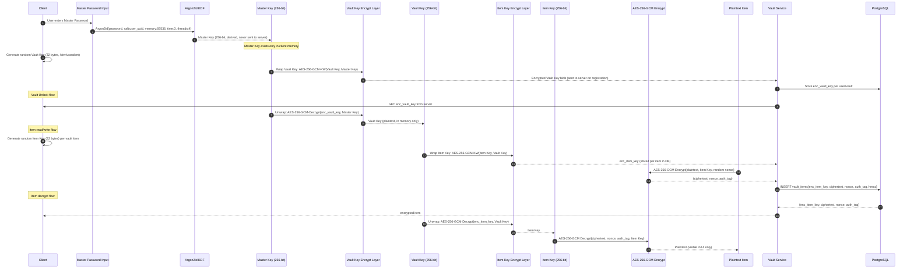
```mermaid
sequenceDiagram
    autonumber
    participant C as Client
    participant MP as Master Password Input
    participant KDF as Argon2id KDF
    participant MK as Master Key (256-bit)
    participant VKE as Vault Key Encrypt Layer
    participant VK as Vault Key (256-bit)
    participant IKE as Item Key Encrypt Layer
    participant IK as Item Key (256-bit)
    participant ENC as AES-256-GCM Encrypt
    participant PT as Plaintext Item
    participant VAULT as Vault Service
    participant PG as PostgreSQL

    C->>MP: User enters Master Password
    MP->>KDF: Argon2id{password, salt:user_uuid, memory:65536, time:3, threads:4}
    KDF-->>MK: Master Key (256-bit, derived, never sent to server)

    Note over MK: Master Key exists only in client memory

    C->>C: Generate random Vault Key (32 bytes, /dev/urandom)
    MK->>VKE: Wrap Vault Key: AES-256-GCM-KW(Vault Key, Master Key)
    VKE-->>VAULT: Encrypted Vault Key blob (sent to server on registration)
    VAULT->>PG: Store enc_vault_key per user/vault

    Note over C: Vault Unlock flow

    VAULT->>C: GET enc_vault_key from server
    MK->>VKE: Unwrap: AES-256-GCM-Decrypt(enc_vault_key, Master Key)
    VKE-->>VK: Vault Key (plaintext, in memory only)

    Note over C: Item read/write flow

    C->>C: Generate random Item Key (32 bytes) per vault item
    VK->>IKE: Wrap Item Key: AES-256-GCM-KW(Item Key, Vault Key)
    IKE-->>VAULT: enc_item_key (stored per item in DB)

    PT->>ENC: AES-256-GCM Encrypt{plaintext, Item Key, random nonce}
    ENC-->>VAULT: {ciphertext, nonce, auth_tag}
    VAULT->>PG: INSERT vault_items{enc_item_key, ciphertext, nonce, auth_tag, hmac}

    Note over C: Item decrypt flow

    PG-->>VAULT: {enc_item_key, ciphertext, nonce, auth_tag}
    VAULT-->>C: encrypted item
    VK->>IKE: Unwrap: AES-256-GCM-Decrypt(enc_item_key, Vault Key)
    IKE-->>IK: Item Key
    IK->>ENC: AES-256-GCM Decrypt{ciphertext, nonce, auth_tag, Item Key}
    ENC-->>PT: Plaintext (visible in UI only)
```

---

## 13. API Gateway Request Flow

Request lifecycle from client through rate limiting, authentication middleware, routing, and response.

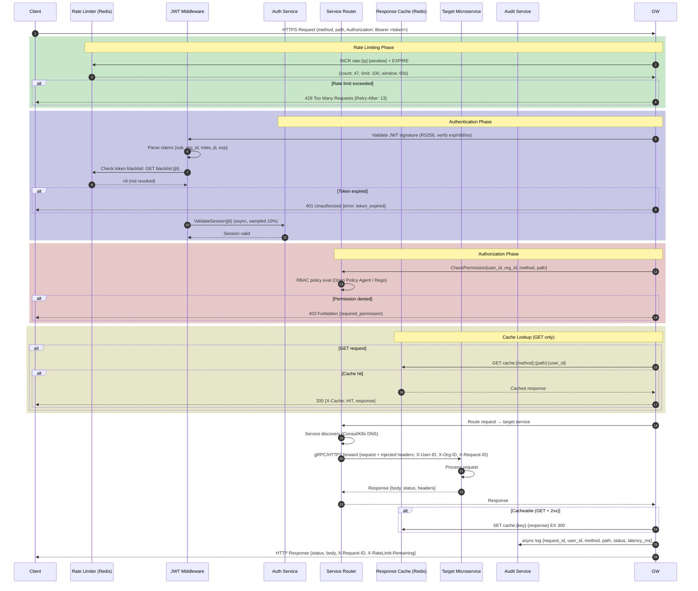
```mermaid
sequenceDiagram
    autonumber
    participant C as Client
    participant RL as Rate Limiter (Redis)
    participant JWTmw as JWT Middleware
    participant AUTH as Auth Service
    participant ROUTER as Service Router
    participant CACHE as Response Cache (Redis)
    participant SVC as Target Microservice
    participant AUDIT as Audit Service

    C->>GW: HTTPS Request {method, path, Authorization: Bearer <token>}

    rect rgb(200, 230, 200)
        Note over GW,RL: Rate Limiting Phase
        GW->>RL: INCR rate:{ip}:{window} + EXPIRE
        RL-->>GW: {count: 47, limit: 100, window: 60s}
        alt Rate limit exceeded
            GW-->>C: 429 Too Many Requests {Retry-After: 13}
        end
    end

    rect rgb(200, 200, 230)
        Note over GW,AUTH: Authentication Phase
        GW->>JWTmw: Validate JWT signature (RS256, verify exp/nbf/iss)
        JWTmw->>JWTmw: Parse claims {sub, org_id, roles, jti, exp}
        JWTmw->>RL: Check token blacklist: GET blacklist:{jti}
        RL-->>JWTmw: nil (not revoked)
        alt Token expired
            GW-->>C: 401 Unauthorized {error: token_expired}
        end
        JWTmw->>AUTH: ValidateSession{jti} (async, sampled 10%)
        AUTH-->>JWTmw: Session valid
    end

    rect rgb(230, 200, 200)
        Note over GW,ROUTER: Authorization Phase
        GW->>ROUTER: CheckPermission{user_id, org_id, method, path}
        ROUTER->>ROUTER: RBAC policy eval (Open Policy Agent / Rego)
        alt Permission denied
            GW-->>C: 403 Forbidden {required_permission}
        end
    end

    rect rgb(230, 230, 200)
        Note over GW,CACHE: Cache Lookup (GET only)
        alt GET request
            GW->>CACHE: GET cache:{method}:{path}:{user_id}
            alt Cache hit
                CACHE-->>GW: Cached response
                GW-->>C: 200 {X-Cache: HIT, response}
            end
        end
    end

    GW->>ROUTER: Route request → target service
    ROUTER->>ROUTER: Service discovery (Consul/K8s DNS)
    ROUTER->>SVC: gRPC/HTTP2 forward {request + injected headers: X-User-ID, X-Org-ID, X-Request-ID}
    SVC->>SVC: Process request
    SVC-->>ROUTER: Response {body, status, headers}
    ROUTER-->>GW: Response

    alt Cacheable (GET + 2xx)
        GW->>CACHE: SET cache:{key} {response} EX 300
    end

    GW->>AUDIT: async log {request_id, user_id, method, path, status, latency_ms}
    GW-->>C: HTTP Response {status, body, X-Request-ID, X-RateLimit-Remaining}
```

---

## 14. Zero Trust mTLS Flow

SPIRE/SPIFFE workload identity verification and mTLS establishment between two internal microservices.

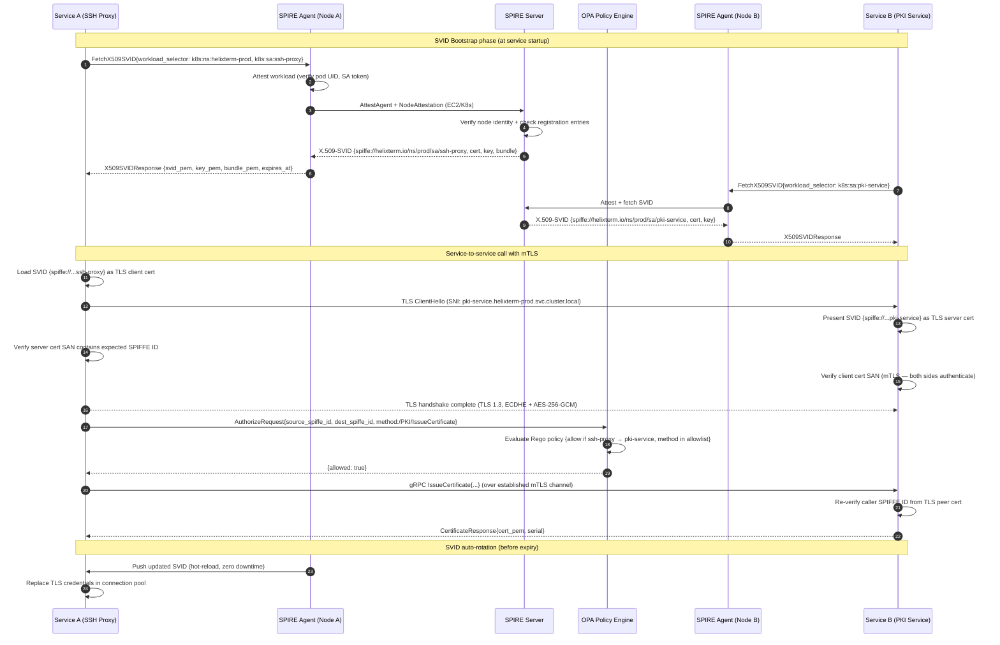
```mermaid
sequenceDiagram
    autonumber
    participant SA as Service A (SSH Proxy)
    participant SPIRE_A as SPIRE Agent (Node A)
    participant SPIRE_SRV as SPIRE Server
    participant POLICY as OPA Policy Engine
    participant SPIRE_B as SPIRE Agent (Node B)
    participant SB as Service B (PKI Service)

    Note over SA,SB: SVID Bootstrap phase (at service startup)

    SA->>SPIRE_A: FetchX509SVID{workload_selector: k8s:ns:helixterm-prod, k8s:sa:ssh-proxy}
    SPIRE_A->>SPIRE_A: Attest workload (verify pod UID, SA token)
    SPIRE_A->>SPIRE_SRV: AttestAgent + NodeAttestation (EC2/K8s)
    SPIRE_SRV->>SPIRE_SRV: Verify node identity + check registration entries
    SPIRE_SRV-->>SPIRE_A: X.509-SVID {spiffe://helixterm.io/ns/prod/sa/ssh-proxy, cert, key, bundle}
    SPIRE_A-->>SA: X509SVIDResponse {svid_pem, key_pem, bundle_pem, expires_at}

    SB->>SPIRE_B: FetchX509SVID{workload_selector: k8s:sa:pki-service}
    SPIRE_B->>SPIRE_SRV: Attest + fetch SVID
    SPIRE_SRV-->>SPIRE_B: X.509-SVID {spiffe://helixterm.io/ns/prod/sa/pki-service, cert, key}
    SPIRE_B-->>SB: X509SVIDResponse

    Note over SA,SB: Service-to-service call with mTLS

    SA->>SA: Load SVID {spiffe://...ssh-proxy} as TLS client cert
    SA->>SB: TLS ClientHello (SNI: pki-service.helixterm-prod.svc.cluster.local)
    SB->>SB: Present SVID {spiffe://...pki-service} as TLS server cert
    SA->>SA: Verify server cert SAN contains expected SPIFFE ID
    SB->>SB: Verify client cert SAN (mTLS — both sides authenticate)
    SA-->>SB: TLS handshake complete (TLS 1.3, ECDHE + AES-256-GCM)

    SA->>POLICY: AuthorizeRequest{source_spiffe_id, dest_spiffe_id, method:/PKI/IssueCertificate}
    POLICY->>POLICY: Evaluate Rego policy {allow if ssh-proxy → pki-service, method in allowlist}
    POLICY-->>SA: {allowed: true}

    SA->>SB: gRPC IssueCertificate{...} (over established mTLS channel)
    SB->>SB: Re-verify caller SPIFFE ID from TLS peer cert
    SB-->>SA: CertificateResponse{cert_pem, serial}

    Note over SA,SB: SVID auto-rotation (before expiry)
    SPIRE_A->>SA: Push updated SVID (hot-reload, zero downtime)
    SA->>SA: Replace TLS credentials in connection pool
```

---

## 15. Session Recording Flow

Full pipeline from SSH Proxy capturing terminal data through Kafka to persistent storage and replay.

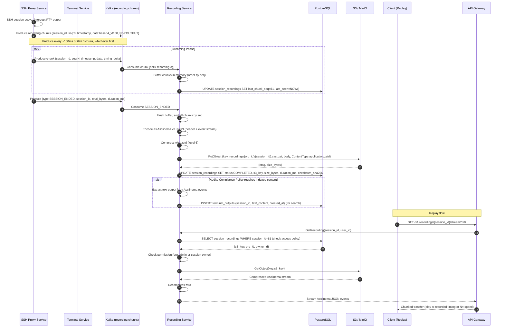
```mermaid
sequenceDiagram
    autonumber
    participant SSH as SSH Proxy Service
    participant TERM as Terminal Service
    participant KAFKA as Kafka (recording.chunks)
    participant REC as Recording Service
    participant PG as PostgreSQL
    participant S3 as S3 / MinIO
    participant C as Client (Replay)
    participant GW as API Gateway

    SSH->>SSH: SSH session active, intercept PTY output
    SSH->>KAFKA: Produce recording.chunks {session_id, seq:0, timestamp, data:base64_vt100, type:OUTPUT}
    Note over SSH,KAFKA: Produce every ~100ms or 64KB chunk, whichever first

    loop Streaming Phase
        SSH->>KAFKA: Produce chunk {session_id, seq:N, timestamp, data, timing_delta}
        KAFKA->>REC: Consume chunk [helix-recording-cg]
        REC->>REC: Buffer chunks in memory (order by seq)
        REC->>PG: UPDATE session_recordings SET last_chunk_seq=$1, last_seen=NOW()
    end

    SSH->>KAFKA: Produce {type:SESSION_ENDED, session_id, total_bytes, duration_ms}
    KAFKA->>REC: Consume SESSION_ENDED
    REC->>REC: Flush buffer, sort all chunks by seq
    REC->>REC: Encode as Asciinema v3 JSON (header + event stream)
    REC->>REC: Compress with zstd (level 6)
    REC->>S3: PutObject {key: recordings/{org_id}/{session_id}.cast.zst, body, ContentType:application/zstd}
    S3-->>REC: {etag, size_bytes}

    REC->>PG: UPDATE session_recordings SET status:COMPLETED, s3_key, size_bytes, duration_ms, checksum_sha256

    alt Audit / Compliance Policy requires indexed content
        REC->>REC: Extract text output from Asciinema events
        REC->>PG: INSERT terminal_outputs {session_id, text_content, created_at} (for search)
    end

    Note over C,GW: Replay flow

    C->>GW: GET /v1/recordings/{session_id}/stream?t=0
    GW->>REC: GetRecording{session_id, user_id}
    REC->>PG: SELECT session_recordings WHERE session_id=$1 (check access policy)
    PG-->>REC: {s3_key, org_id, owner_id}
    REC->>REC: Check permission (org admin or session owner)
    REC->>S3: GetObject{key:s3_key}
    S3-->>REC: Compressed Asciinema stream
    REC->>REC: Decompress zstd
    REC-->>GW: Stream Asciinema JSON events
    GW-->>C: Chunked transfer (play at recorded timing or N× speed)
```

---

## 16. SSH Connection State Machine

Complete state machine for an SSH connection lifecycle, including error recovery paths.

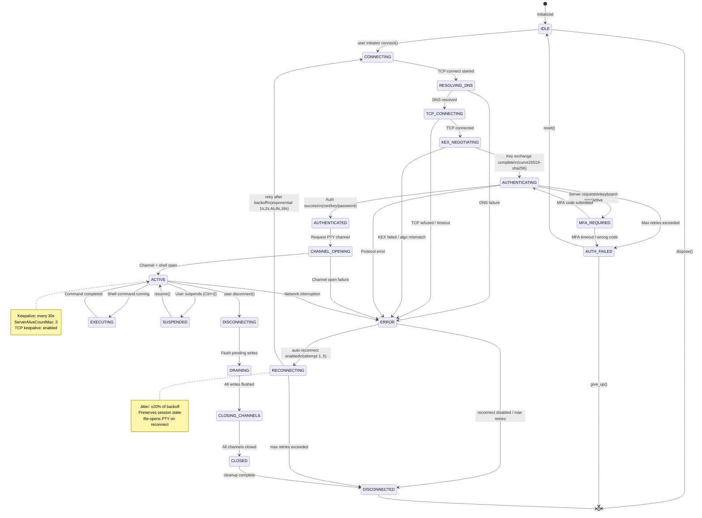
```mermaid
stateDiagram-v2
    [*] --> IDLE : initialized

    IDLE --> CONNECTING : user initiates connect()
    IDLE --> [*] : dispose()

    CONNECTING --> RESOLVING_DNS : TCP connect started
    RESOLVING_DNS --> TCP_CONNECTING : DNS resolved
    RESOLVING_DNS --> ERROR : DNS failure

    TCP_CONNECTING --> KEX_NEGOTIATING : TCP connected
    TCP_CONNECTING --> ERROR : TCP refused / timeout

    KEX_NEGOTIATING --> AUTHENTICATING : Key exchange complete\n(curve25519-sha256)
    KEX_NEGOTIATING --> ERROR : KEX failed / algo mismatch

    AUTHENTICATING --> AUTHENTICATED : Auth success\n(cert/key/password)
    AUTHENTICATING --> MFA_REQUIRED : Server requests\nkeyboard-interactive
    AUTHENTICATING --> AUTH_FAILED : Max retries exceeded
    AUTHENTICATING --> ERROR : Protocol error

    MFA_REQUIRED --> AUTHENTICATING : MFA code submitted
    MFA_REQUIRED --> AUTH_FAILED : MFA timeout / wrong code

    AUTH_FAILED --> IDLE : reset()
    AUTH_FAILED --> [*] : give_up()

    AUTHENTICATED --> CHANNEL_OPENING : Request PTY channel
    CHANNEL_OPENING --> ACTIVE : Channel + shell open
    CHANNEL_OPENING --> ERROR : Channel open failure

    ACTIVE --> EXECUTING : Shell command running
    ACTIVE --> SUSPENDED : User suspends (Ctrl+Z)
    ACTIVE --> DISCONNECTING : user disconnect()
    ACTIVE --> ERROR : Network interruption

    EXECUTING --> ACTIVE : Command completed
    SUSPENDED --> ACTIVE : resume()

    ERROR --> RECONNECTING : auto-reconnect enabled\n(attempt 1..5)
    ERROR --> DISCONNECTED : reconnect disabled / max retries
    RECONNECTING --> CONNECTING : retry after backoff\n(exponential: 1s,2s,4s,8s,16s)
    RECONNECTING --> DISCONNECTED : max retries exceeded

    DISCONNECTING --> DRAINING : Flush pending writes
    DRAINING --> CLOSING_CHANNELS : All writes flushed
    CLOSING_CHANNELS --> CLOSED : All channels closed
    CLOSED --> DISCONNECTED : cleanup complete
    DISCONNECTED --> [*]

    note right of ACTIVE
        Keepalive: every 30s
        ServerAliveCountMax: 3
        TCP keepalive: enabled
    end note

    note right of RECONNECTING
        Jitter: ±20% of backoff
        Preserves session state
        Re-opens PTY on reconnect
    end note
```

---

## 17. Vault State Machine

State machine for vault lifecycle — from locked state through unlock, sync, and conflict resolution.

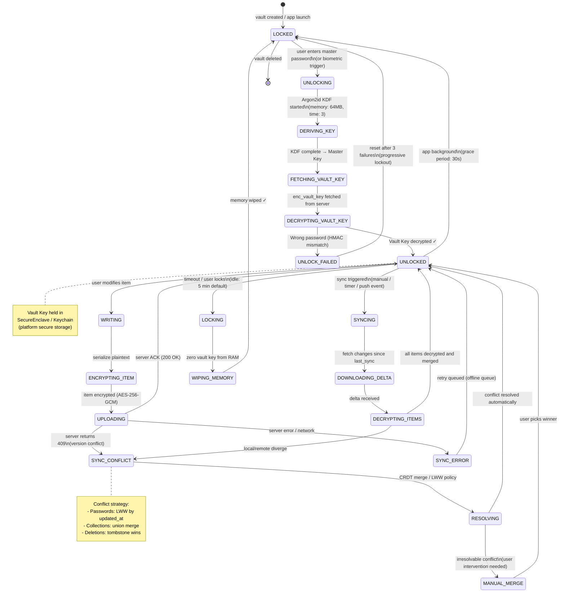
```mermaid
stateDiagram-v2
    [*] --> LOCKED : vault created / app launch

    LOCKED --> UNLOCKING : user enters master password\n(or biometric trigger)
    LOCKED --> [*] : vault deleted

    UNLOCKING --> DERIVING_KEY : Argon2id KDF started\n(memory: 64MB, time: 3)
    DERIVING_KEY --> FETCHING_VAULT_KEY : KDF complete → Master Key
    FETCHING_VAULT_KEY --> DECRYPTING_VAULT_KEY : enc_vault_key fetched from server
    DECRYPTING_VAULT_KEY --> UNLOCKED : Vault Key decrypted ✓
    DECRYPTING_VAULT_KEY --> UNLOCK_FAILED : Wrong password (HMAC mismatch)
    UNLOCK_FAILED --> LOCKED : reset after 3 failures\n(progressive lockout)

    UNLOCKED --> SYNCING : sync triggered\n(manual / timer / push event)
    UNLOCKED --> WRITING : user modifies item
    UNLOCKED --> LOCKING : timeout / user locks\n(idle: 5 min default)
    UNLOCKED --> LOCKED : app background\n(grace period: 30s)

    WRITING --> ENCRYPTING_ITEM : serialize plaintext
    ENCRYPTING_ITEM --> UPLOADING : item encrypted (AES-256-GCM)
    UPLOADING --> UNLOCKED : server ACK (200 OK)
    UPLOADING --> SYNC_CONFLICT : server returns 409\n(version conflict)
    UPLOADING --> SYNC_ERROR : server error / network

    SYNC_ERROR --> UNLOCKED : retry queued (offline queue)

    SYNCING --> DOWNLOADING_DELTA : fetch changes since last_sync
    DOWNLOADING_DELTA --> DECRYPTING_ITEMS : delta received
    DECRYPTING_ITEMS --> UNLOCKED : all items decrypted and merged
    DECRYPTING_ITEMS --> SYNC_CONFLICT : local/remote diverge

    SYNC_CONFLICT --> RESOLVING : CRDT merge / LWW policy
    RESOLVING --> UNLOCKED : conflict resolved automatically
    RESOLVING --> MANUAL_MERGE : irresolvable conflict\n(user intervention needed)
    MANUAL_MERGE --> UNLOCKED : user picks winner

    LOCKING --> WIPING_MEMORY : zero vault key from RAM
    WIPING_MEMORY --> LOCKED : memory wiped ✓

    note right of UNLOCKED
        Vault Key held in
        SecureEnclave / Keychain
        (platform secure storage)
    end note

    note right of SYNC_CONFLICT
        Conflict strategy:
        - Passwords: LWW by updated_at
        - Collections: union merge
        - Deletions: tombstone wins
    end note
```

---

## 18. SFTP Transfer State Machine

Full state machine for an SFTP file transfer including pause, resume, retry, and failure paths.

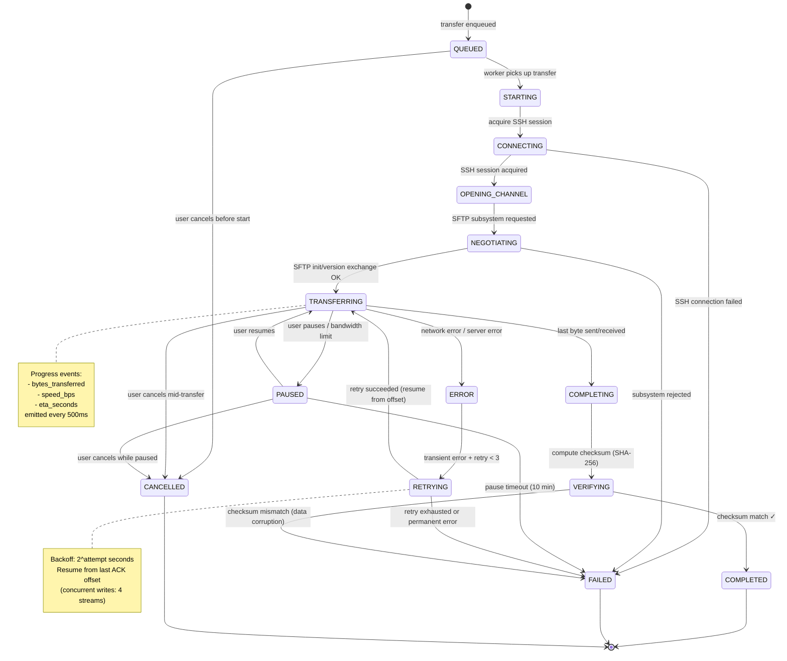
```mermaid
stateDiagram-v2
    [*] --> QUEUED : transfer enqueued

    QUEUED --> STARTING : worker picks up transfer
    QUEUED --> CANCELLED : user cancels before start

    STARTING --> CONNECTING : acquire SSH session
    CONNECTING --> OPENING_CHANNEL : SSH session acquired
    CONNECTING --> FAILED : SSH connection failed

    OPENING_CHANNEL --> NEGOTIATING : SFTP subsystem requested
    NEGOTIATING --> TRANSFERRING : SFTP init/version exchange OK
    NEGOTIATING --> FAILED : subsystem rejected

    TRANSFERRING --> PAUSED : user pauses / bandwidth limit
    TRANSFERRING --> COMPLETING : last byte sent/received
    TRANSFERRING --> ERROR : network error / server error
    TRANSFERRING --> CANCELLED : user cancels mid-transfer

    PAUSED --> TRANSFERRING : user resumes
    PAUSED --> CANCELLED : user cancels while paused
    PAUSED --> FAILED : pause timeout (10 min)

    ERROR --> RETRYING : transient error + retry < 3
    RETRYING --> TRANSFERRING : retry succeeded (resume from offset)
    RETRYING --> FAILED : retry exhausted or permanent error

    COMPLETING --> VERIFYING : compute checksum (SHA-256)
    VERIFYING --> COMPLETED : checksum match ✓
    VERIFYING --> FAILED : checksum mismatch (data corruption)

    COMPLETED --> [*]
    FAILED --> [*]
    CANCELLED --> [*]

    note right of TRANSFERRING
        Progress events:
        - bytes_transferred
        - speed_bps
        - eta_seconds
        emitted every 500ms
    end note

    note right of RETRYING
        Backoff: 2^attempt seconds
        Resume from last ACK offset
        (concurrent writes: 4 streams)
    end note
```

---

## 19. User Authentication State Machine

State machine for the full user authentication lifecycle from anonymous to authenticated session.

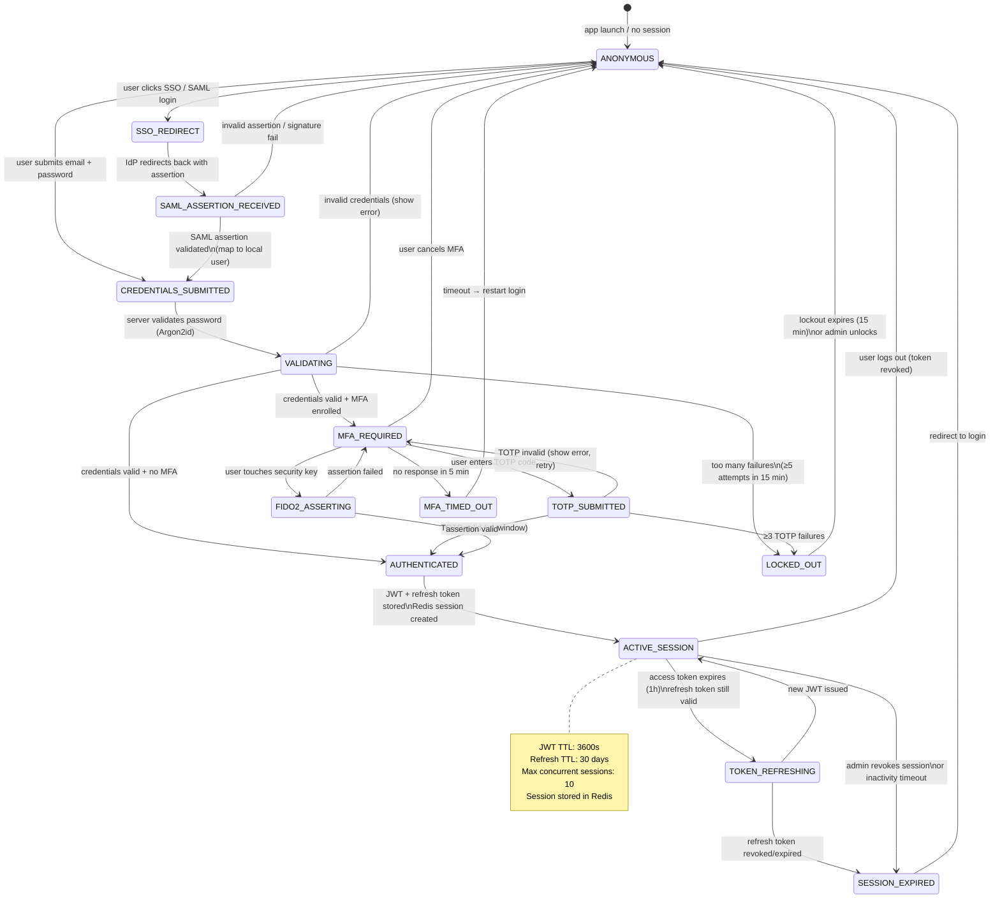
```mermaid
stateDiagram-v2
    [*] --> ANONYMOUS : app launch / no session

    ANONYMOUS --> CREDENTIALS_SUBMITTED : user submits email + password
    ANONYMOUS --> SSO_REDIRECT : user clicks SSO / SAML login

    SSO_REDIRECT --> SAML_ASSERTION_RECEIVED : IdP redirects back with assertion
    SAML_ASSERTION_RECEIVED --> CREDENTIALS_SUBMITTED : SAML assertion validated\n(map to local user)
    SAML_ASSERTION_RECEIVED --> ANONYMOUS : invalid assertion / signature fail

    CREDENTIALS_SUBMITTED --> VALIDATING : server validates password (Argon2id)
    VALIDATING --> MFA_REQUIRED : credentials valid + MFA enrolled
    VALIDATING --> AUTHENTICATED : credentials valid + no MFA
    VALIDATING --> ANONYMOUS : invalid credentials (show error)
    VALIDATING --> LOCKED_OUT : too many failures\n(≥5 attempts in 15 min)

    LOCKED_OUT --> ANONYMOUS : lockout expires (15 min)\nor admin unlocks

    MFA_REQUIRED --> TOTP_SUBMITTED : user enters TOTP code
    MFA_REQUIRED --> FIDO2_ASSERTING : user touches security key
    MFA_REQUIRED --> ANONYMOUS : user cancels MFA
    MFA_REQUIRED --> MFA_TIMED_OUT : no response in 5 min

    MFA_TIMED_OUT --> ANONYMOUS : timeout → restart login

    TOTP_SUBMITTED --> AUTHENTICATED : TOTP valid (±1 window)
    TOTP_SUBMITTED --> MFA_REQUIRED : TOTP invalid (show error, retry)
    TOTP_SUBMITTED --> LOCKED_OUT : ≥3 TOTP failures

    FIDO2_ASSERTING --> AUTHENTICATED : assertion valid
    FIDO2_ASSERTING --> MFA_REQUIRED : assertion failed

    AUTHENTICATED --> ACTIVE_SESSION : JWT + refresh token stored\nRedis session created
    ACTIVE_SESSION --> TOKEN_REFRESHING : access token expires (1h)\nrefresh token still valid
    TOKEN_REFRESHING --> ACTIVE_SESSION : new JWT issued
    TOKEN_REFRESHING --> SESSION_EXPIRED : refresh token revoked/expired

    ACTIVE_SESSION --> SESSION_EXPIRED : admin revokes session\nor inactivity timeout
    ACTIVE_SESSION --> ANONYMOUS : user logs out (token revoked)

    SESSION_EXPIRED --> ANONYMOUS : redirect to login

    note right of ACTIVE_SESSION
        JWT TTL: 3600s
        Refresh TTL: 30 days
        Max concurrent sessions: 10
        Session stored in Redis
    end note
```

---

## 20. Service Health State Machine

State machine for any HelixTerminator microservice from startup through healthy operation to failure and recovery.

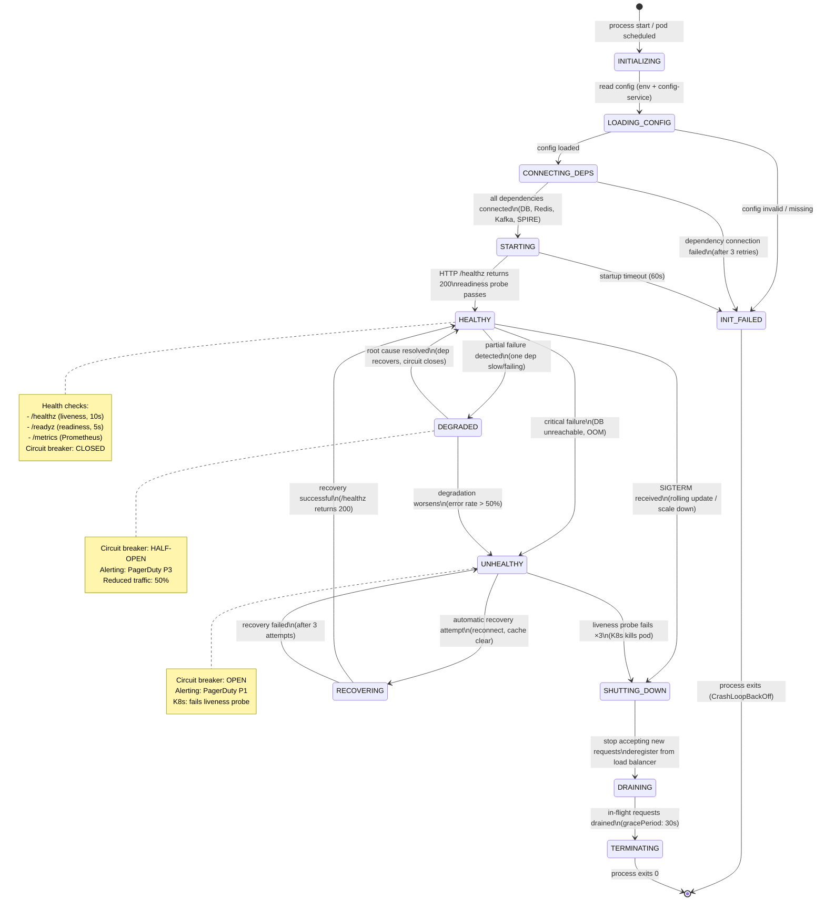
```mermaid
stateDiagram-v2
    [*] --> INITIALIZING : process start / pod scheduled

    INITIALIZING --> LOADING_CONFIG : read config (env + config-service)
    LOADING_CONFIG --> CONNECTING_DEPS : config loaded
    LOADING_CONFIG --> INIT_FAILED : config invalid / missing

    CONNECTING_DEPS --> STARTING : all dependencies connected\n(DB, Redis, Kafka, SPIRE)
    CONNECTING_DEPS --> INIT_FAILED : dependency connection failed\n(after 3 retries)

    INIT_FAILED --> [*] : process exits (CrashLoopBackOff)

    STARTING --> HEALTHY : HTTP /healthz returns 200\nreadiness probe passes
    STARTING --> INIT_FAILED : startup timeout (60s)

    HEALTHY --> DEGRADED : partial failure detected\n(one dep slow/failing)
    HEALTHY --> UNHEALTHY : critical failure\n(DB unreachable, OOM)
    HEALTHY --> SHUTTING_DOWN : SIGTERM received\n(rolling update / scale down)

    DEGRADED --> HEALTHY : root cause resolved\n(dep recovers, circuit closes)
    DEGRADED --> UNHEALTHY : degradation worsens\n(error rate > 50%)

    UNHEALTHY --> RECOVERING : automatic recovery attempt\n(reconnect, cache clear)
    UNHEALTHY --> SHUTTING_DOWN : liveness probe fails ×3\n(K8s kills pod)

    RECOVERING --> HEALTHY : recovery successful\n(/healthz returns 200)
    RECOVERING --> UNHEALTHY : recovery failed\n(after 3 attempts)

    SHUTTING_DOWN --> DRAINING : stop accepting new requests\nderegister from load balancer
    DRAINING --> TERMINATING : in-flight requests drained\n(gracePeriod: 30s)
    TERMINATING --> [*] : process exits 0

    note right of HEALTHY
        Health checks:
        - /healthz (liveness, 10s)
        - /readyz (readiness, 5s)
        - /metrics (Prometheus)
        Circuit breaker: CLOSED
    end note

    note right of DEGRADED
        Circuit breaker: HALF-OPEN
        Alerting: PagerDuty P3
        Reduced traffic: 50%
    end note

    note right of UNHEALTHY
        Circuit breaker: OPEN
        Alerting: PagerDuty P1
        K8s: fails liveness probe
    end note
```

---

## 21. Core Data Model ER Diagram

Primary entities spanning organizations, users, vaults, hosts, sessions, and workspace configuration.

```mermaid
erDiagram
    organizations {
        uuid id PK
        string name
        string slug
        string plan
        int max_users
        int max_hosts
        bool sso_enabled
        string sso_provider
        string saml_metadata_url
        string ldap_url
        timestamp created_at
        timestamp updated_at
    }

    teams {
        uuid id PK
        uuid org_id FK
        string name
        string description
        jsonb permissions
        timestamp created_at
    }

    users {
        uuid id PK
        uuid org_id FK
        string email
        string display_name
        string password_hash
        bool mfa_enabled
        string mfa_type
        string status
        timestamp last_login_at
        timestamp created_at
    }

    team_members {
        uuid team_id FK
        uuid user_id FK
        string role
        timestamp joined_at
    }

    vaults {
        uuid id PK
        uuid org_id FK
        uuid owner_id FK
        string name
        string type
        bytea enc_vault_key
        int version
        timestamp synced_at
        timestamp created_at
    }

    vault_items {
        uuid id PK
        uuid vault_id FK
        uuid created_by FK
        string type
        string name
        bytea ciphertext
        bytea nonce
        bytea auth_tag
        bytea enc_item_key
        bytea hmac
        int version
        jsonb metadata
        timestamp updated_at
        timestamp created_at
    }

    hosts {
        uuid id PK
        uuid org_id FK
        string hostname
        string ip_address
        int port
        string os_type
        string username
        string auth_method
        uuid key_id FK
        bool jump_host_required
        uuid jump_host_id FK
        jsonb labels
        timestamp last_seen_at
        timestamp created_at
    }

    host_groups {
        uuid id PK
        uuid org_id FK
        string name
        jsonb match_labels
        timestamp created_at
    }

    host_group_members {
        uuid host_group_id FK
        uuid host_id FK
    }

    ssh_keys {
        uuid id PK
        uuid org_id FK
        uuid owner_id FK
        string name
        string key_type
        string public_key_pem
        bytea private_key_enc
        string fingerprint
        timestamp created_at
        timestamp expires_at
    }

    snippets {
        uuid id PK
        uuid org_id FK
        uuid owner_id FK
        string title
        text command
        string[] tags
        bool shared
        int usage_count
        timestamp created_at
    }

    sessions {
        uuid id PK
        uuid org_id FK
        uuid user_id FK
        uuid host_id FK
        string status
        string auth_method
        string client_ip
        int duration_seconds
        bigint bytes_in
        bigint bytes_out
        timestamp started_at
        timestamp ended_at
    }

    workspaces {
        uuid id PK
        uuid org_id FK
        uuid owner_id FK
        string name
        jsonb layout
        jsonb panels
        timestamp created_at
        timestamp updated_at
    }

    port_forwardings {
        uuid id PK
        uuid session_id FK
        string type
        string local_addr
        int local_port
        string remote_addr
        int remote_port
        string status
        bigint bytes_transferred
        timestamp created_at
    }

    known_hosts {
        uuid id PK
        uuid org_id FK
        string hostname
        string key_type
        string public_key
        string fingerprint
        bool trusted
        timestamp first_seen_at
        timestamp verified_at
    }

    audit_events {
        uuid id PK
        uuid org_id FK
        uuid user_id FK
        uuid session_id FK
        string event_type
        string resource_type
        uuid resource_id
        jsonb payload
        string ip_address
        string user_agent
        timestamp occurred_at
    }

    organizations ||--o{ teams : "has"
    organizations ||--o{ users : "has"
    organizations ||--o{ vaults : "owns"
    organizations ||--o{ hosts : "manages"
    organizations ||--o{ host_groups : "has"
    organizations ||--o{ snippets : "has"
    organizations ||--o{ audit_events : "logs"
    users ||--o{ team_members : "belongs_to"
    teams ||--o{ team_members : "has"
    users ||--o{ vaults : "owns"
    vaults ||--o{ vault_items : "contains"
    users ||--o{ sessions : "initiates"
    hosts ||--o{ sessions : "receives"
    sessions ||--o{ port_forwardings : "has"
    users ||--o{ ssh_keys : "owns"
    hosts ||--o| ssh_keys : "uses"
    hosts ||--o{ host_group_members : "member_of"
    host_groups ||--o{ host_group_members : "contains"
    users ||--o{ workspaces : "owns"
    users ||--o{ audit_events : "generates"
    sessions ||--o{ audit_events : "generates"
```

---

## 22. Auth Domain ER Diagram

Authentication and identity entities covering tokens, MFA credentials, API keys, and login history.

```mermaid
erDiagram
    users {
        uuid id PK
        string email
        string password_hash
        string status
        int failed_login_count
        timestamp lockout_until
        timestamp created_at
    }

    auth_tokens {
        uuid id PK
        uuid user_id FK
        string jti
        string token_type
        string scope
        string device_id FK
        timestamp issued_at
        timestamp expires_at
        bool revoked
        string revoke_reason
    }

    refresh_tokens {
        uuid id PK
        uuid user_id FK
        string token_hash
        uuid device_id FK
        string ip_address
        bool rotated
        timestamp issued_at
        timestamp expires_at
        timestamp last_used_at
    }

    device_tokens {
        uuid id PK
        uuid user_id FK
        string device_fingerprint
        string device_name
        string platform
        string push_token
        bool trusted
        timestamp registered_at
        timestamp last_active_at
    }

    mfa_credentials {
        uuid id PK
        uuid user_id FK
        string type
        bool enabled
        bool backup_codes_generated
        timestamp enrolled_at
        timestamp last_used_at
    }

    totp_credentials {
        uuid id PK
        uuid mfa_credential_id FK
        bytea secret_encrypted
        int digits
        int period
        string algorithm
        int[] used_codes
        timestamp created_at
    }

    fido2_credentials {
        uuid id PK
        uuid mfa_credential_id FK
        string credential_id
        string public_key_cbor
        string aaguid
        bigint sign_count
        string attestation_type
        string transports
        bool resident_key
        string user_verification
        string display_name
        timestamp created_at
        timestamp last_used_at
    }

    backup_codes {
        uuid id PK
        uuid user_id FK
        string code_hash
        bool used
        timestamp created_at
        timestamp used_at
    }

    api_keys {
        uuid id PK
        uuid user_id FK
        uuid org_id FK
        string name
        string key_prefix
        string key_hash
        string[] scopes
        string[] allowed_ips
        timestamp created_at
        timestamp expires_at
        timestamp last_used_at
        bool revoked
    }

    login_attempts {
        uuid id PK
        uuid user_id FK
        string ip_address
        string user_agent
        string method
        bool success
        string failure_reason
        timestamp attempted_at
    }

    password_history {
        uuid id PK
        uuid user_id FK
        string password_hash
        timestamp created_at
    }

    saml_identities {
        uuid id PK
        uuid user_id FK
        string idp_id
        string subject_id
        string name_id_format
        jsonb attributes
        timestamp linked_at
        timestamp last_login_at
    }

    users ||--o{ auth_tokens : "has"
    users ||--o{ refresh_tokens : "has"
    users ||--o{ device_tokens : "registers"
    users ||--o{ mfa_credentials : "enrolls"
    mfa_credentials ||--o| totp_credentials : "details"
    mfa_credentials ||--o{ fido2_credentials : "details"
    users ||--o{ backup_codes : "has"
    users ||--o{ api_keys : "owns"
    users ||--o{ login_attempts : "generates"
    users ||--o{ password_history : "tracks"
    users ||--o{ saml_identities : "linked_to"
    auth_tokens }o--|| device_tokens : "issued_to"
    refresh_tokens }o--|| device_tokens : "issued_to"
```

---

## 23. SSH/Terminal Domain ER Diagram

Entities for SSH sessions, recordings, terminal output, port forwarding, SFTP, and collaboration.

```mermaid
erDiagram
    ssh_sessions {
        uuid id PK
        uuid org_id FK
        uuid user_id FK
        uuid host_id FK
        string status
        string auth_method
        string proxy_node
        string client_ip
        string client_version
        string server_version
        string terminal_type
        int cols
        int rows
        bigint bytes_in
        bigint bytes_out
        int commands_count
        timestamp started_at
        timestamp ended_at
    }

    session_recordings {
        uuid id PK
        uuid ssh_session_id FK
        string status
        string s3_key
        bigint size_bytes
        int duration_ms
        int chunk_count
        string format
        string codec
        string checksum_sha256
        timestamp started_at
        timestamp completed_at
    }

    recording_chunks {
        uuid id PK
        uuid session_recording_id FK
        int sequence
        int timing_delta_ms
        bytea data
        string event_type
        timestamp recorded_at
    }

    terminal_outputs {
        uuid id PK
        uuid ssh_session_id FK
        text content
        int offset_bytes
        string encoding
        timestamp recorded_at
    }

    port_forwards {
        uuid id PK
        uuid ssh_session_id FK
        string type
        string local_addr
        int local_port
        string remote_addr
        int remote_port
        string status
        bigint bytes_transferred
        int connections_count
        timestamp opened_at
        timestamp closed_at
    }

    sftp_transfers {
        uuid id PK
        uuid ssh_session_id FK
        uuid user_id FK
        string operation
        string local_path
        string remote_path
        bigint total_bytes
        bigint bytes_transferred
        int chunks_completed
        string status
        string checksum_sha256
        string error_message
        timestamp started_at
        timestamp completed_at
    }

    collaboration_sessions {
        uuid id PK
        uuid ssh_session_id FK
        uuid owner_id FK
        string mode
        string share_token
        string status
        int max_participants
        timestamp created_at
        timestamp ended_at
    }

    collaboration_participants {
        uuid id PK
        uuid collab_session_id FK
        uuid user_id FK
        string role
        bool can_write
        bool can_copy_paste
        string client_ip
        timestamp joined_at
        timestamp left_at
    }

    collab_input_events {
        uuid id PK
        uuid collab_session_id FK
        uuid participant_id FK
        string input_type
        bytea data
        timestamp recorded_at
    }

    ssh_sessions ||--o| session_recordings : "recorded_as"
    session_recordings ||--o{ recording_chunks : "composed_of"
    ssh_sessions ||--o{ terminal_outputs : "produces"
    ssh_sessions ||--o{ port_forwards : "has"
    ssh_sessions ||--o{ sftp_transfers : "spawns"
    ssh_sessions ||--o| collaboration_sessions : "shared_via"
    collaboration_sessions ||--o{ collaboration_participants : "has"
    collaboration_participants ||--o{ collab_input_events : "sends"
```

---

## 24. Go Service Interface Hierarchy

Class diagram showing core Go interfaces, structs, and method signatures across the HelixTerminator service layer.

```mermaid
classDiagram
    class Service {
        <<interface>>
        +Start(ctx context.Context) error
        +Stop(ctx context.Context) error
        +Health() HealthStatus
        +Name() string
    }

    class AuthService {
        <<interface>>
        +Login(ctx, req LoginRequest) LoginResponse, error
        +Logout(ctx, token string) error
        +ValidateToken(ctx, token string) Claims, error
        +RefreshToken(ctx, refreshToken string) TokenPair, error
        +IssueCertificate(ctx, req CertRequest) Certificate, error
        +VerifyMFA(ctx, req MFARequest) bool, error
        +RevokeSession(ctx, sessionID string) error
    }

    class VaultService {
        <<interface>>
        +CreateVault(ctx, req CreateVaultRequest) Vault, error
        +UnlockVault(ctx, vaultID string, masterKey []byte) error
        +LockVault(ctx, vaultID string) error
        +GetItem(ctx, vaultID, itemID string) VaultItem, error
        +PutItem(ctx, vaultID string, item VaultItem) error
        +DeleteItem(ctx, vaultID, itemID string) error
        +SyncVault(ctx, vaultID string) SyncResult, error
        +ExportVault(ctx, vaultID string, format string) []byte, error
    }

    class SSHProxyService {
        <<interface>>
        +Connect(ctx, req ConnectRequest) Session, error
        +Disconnect(ctx, sessionID string) error
        +Write(ctx, sessionID string, data []byte) int, error
        +Read(ctx, sessionID string) []byte, error
        +Resize(ctx, sessionID string, cols, rows int) error
        +GetSession(ctx, sessionID string) Session, error
        +ListSessions(ctx, orgID string) []Session, error
        +OpenPortForward(ctx, req PortForwardRequest) PortForward, error
    }

    class PKIService {
        <<interface>>
        +IssueCertificate(ctx, req IssueCertRequest) SignedCert, error
        +RevokeCertificate(ctx, serial string, reason RevocationReason) error
        +CheckRevocation(ctx, serial string) RevocationStatus, error
        +GetCRL(ctx, caID string) []byte, error
        +RotateCA(ctx, caID string) CAKeyPair, error
        +GetCAPublicKey(ctx, caID string) PublicKey, error
        +ListIssuedCerts(ctx, orgID string) []CertRecord, error
    }

    class HostService {
        <<interface>>
        +CreateHost(ctx, req CreateHostRequest) Host, error
        +GetHost(ctx, hostID string) Host, error
        +UpdateHost(ctx, hostID string, req UpdateHostRequest) Host, error
        +DeleteHost(ctx, hostID string) error
        +ListHosts(ctx, orgID string, filter HostFilter) []Host, error
        +TestConnectivity(ctx, hostID string) ConnectivityResult, error
        +SyncFromProvider(ctx, providerID string) SyncResult, error
    }

    class SFTPService {
        <<interface>>
        +InitTransfer(ctx, req TransferRequest) Transfer, error
        +UploadChunk(ctx, transferID string, offset int64, data []byte) error
        +DownloadChunk(ctx, transferID string, offset int64, size int) []byte, error
        +PauseTransfer(ctx, transferID string) error
        +ResumeTransfer(ctx, transferID string) error
        +CancelTransfer(ctx, transferID string) error
        +GetTransferStatus(ctx, transferID string) TransferStatus, error
    }

    class ContainerRuntime {
        <<interface>>
        +ListContainers(ctx, filter ContainerFilter) []Container, error
        +ExecInContainer(ctx, req ExecRequest) ExecSession, error
        +GetLogs(ctx, containerID string, opts LogOptions) io.Reader, error
        +GetPods(ctx, namespace string) []Pod, error
        +ExecInPod(ctx, req PodExecRequest) ExecSession, error
        +PortForwardPod(ctx, req PodPortForwardRequest) PortForward, error
    }

    class BaseService {
        #logger *zap.Logger
        #config *Config
        #db *pgxpool.Pool
        #redis *redis.Client
        #tracer trace.Tracer
        #metrics *prometheus.Registry
        +NewBaseService(cfg Config) BaseService
        #withSpan(ctx, name string) context.Context, trace.Span
        #handleError(err error, msg string) error
    }

    class AuthServiceImpl {
        -userRepo UserRepository
        -tokenRepo TokenRepository
        -mfaRepo MFARepository
        -jwtSigner JWTSigner
        -pkiClient PKIService
        +NewAuthService(deps AuthDeps) AuthService
    }

    class VaultServiceImpl {
        -vaultRepo VaultRepository
        -itemRepo ItemRepository
        -encryptionSvc EncryptionService
        -kafkaProducer kafka.Producer
        -syncWorker SyncWorker
        +NewVaultService(deps VaultDeps) VaultService
    }

    class EncryptionService {
        <<interface>>
        +EncryptItem(plaintext []byte, itemKey []byte) EncryptedItem, error
        +DecryptItem(item EncryptedItem, itemKey []byte) []byte, error
        +WrapKey(key []byte, wrappingKey []byte) []byte, error
        +UnwrapKey(wrapped []byte, wrappingKey []byte) []byte, error
        +DeriveKey(password []byte, salt []byte, params KDFParams) []byte, error
    }

    Service <|.. AuthServiceImpl
    Service <|.. VaultServiceImpl
    BaseService <|-- AuthServiceImpl
    BaseService <|-- VaultServiceImpl
    AuthService <|.. AuthServiceImpl
    VaultService <|.. VaultServiceImpl
    AuthServiceImpl --> PKIService : uses
    VaultServiceImpl --> EncryptionService : uses
    SSHProxyService --> PKIService : validates certs
    SSHProxyService --> AuthService : verifies sessions
    SFTPService --> SSHProxyService : uses proxy
    ContainerRuntime --> SSHProxyService : uses proxy
```

---

## 25. Flutter BLoC Architecture

BLoC (Business Logic Component) class hierarchy for the Flutter client, showing states, events, and service dependencies.

```mermaid
classDiagram
    class Bloc~Event, State~ {
        <<abstract>>
        +Stream~State~ stream
        +State state
        +add(Event event) void
        +close() Future~void~
        +on~E~(EventHandler handler) void
    }

    class AuthBloc {
        -AuthRepository authRepo
        -SecureStorage secureStorage
        -DeviceInfoPlugin deviceInfo
        +AuthBloc(authRepo, storage)
        +on~LoginRequested~()
        +on~LogoutRequested~()
        +on~TokenRefreshRequested~()
        +on~MFACodeSubmitted~()
        +on~BiometricLoginRequested~()
        +on~SessionCheckRequested~()
    }

    class AuthState {
        <<abstract>>
    }
    class AuthInitial
    class AuthLoading
    class Authenticated {
        +User user
        +String accessToken
        +DateTime expiresAt
    }
    class MFARequired {
        +String mfaToken
        +List~String~ methods
        +String challengeData
    }
    class AuthError {
        +String message
        +AuthErrorCode code
    }
    class Unauthenticated

    class VaultBloc {
        -VaultRepository vaultRepo
        -EncryptionService encryptionSvc
        -SyncService syncSvc
        +VaultBloc(vaultRepo, encSvc)
        +on~VaultUnlockRequested~()
        +on~VaultLockRequested~()
        +on~ItemCreateRequested~()
        +on~ItemUpdateRequested~()
        +on~ItemDeleteRequested~()
        +on~VaultSyncRequested~()
        +on~SearchQueryChanged~()
    }

    class VaultState {
        <<abstract>>
    }
    class VaultLocked
    class VaultUnlocking
    class VaultUnlocked {
        +List~VaultItem~ items
        +int version
        +DateTime lastSynced
    }
    class VaultSyncing {
        +double progress
    }
    class VaultConflict {
        +VaultItem localItem
        +VaultItem remoteItem
    }
    class VaultError {
        +String message
    }

    class TerminalBloc {
        -SSHProxyRepository proxyRepo
        -RecordingService recordingService
        -AIService aiService
        +TerminalBloc(proxyRepo, aiSvc)
        +on~ConnectionRequested~()
        +on~DisconnectRequested~()
        +on~InputReceived~()
        +on~ResizeRequested~()
        +on~CollabJoinRequested~()
        +on~FontSizeChanged~()
    }

    class TerminalState {
        <<abstract>>
    }
    class TerminalIdle
    class TerminalConnecting {
        +String hostName
        +int attempt
    }
    class TerminalConnected {
        +String sessionId
        +TerminalSize size
        +bool recording
        +CollabSession collab
    }
    class TerminalError {
        +String message
        +bool canRetry
    }

    class SSHSessionBloc {
        -SSHProxyRepository proxyRepo
        -PKIRepository pkiRepo
        +SSHSessionBloc(proxyRepo, pkiRepo)
        +on~SessionListRequested~()
        +on~SessionTerminateRequested~()
        +on~SessionFilterChanged~()
        +on~SessionDetailRequested~()
    }

    class HostBloc {
        -HostRepository hostRepo
        -ConnectivityService connectivitySvc
        +HostBloc(hostRepo, connSvc)
        +on~HostListRequested~()
        +on~HostCreateRequested~()
        +on~HostUpdateRequested~()
        +on~HostDeleteRequested~()
        +on~HostConnectivityTestRequested~()
        +on~HostSearchQueryChanged~()
    }

    class SFTPBloc {
        -SFTPRepository sftpRepo
        -FilePickerService filePicker
        +SFTPBloc(sftpRepo, filePicker)
        +on~DirectoryListRequested~()
        +on~UploadRequested~()
        +on~DownloadRequested~()
        +on~TransferPauseRequested~()
        +on~TransferResumeRequested~()
        +on~TransferCancelRequested~()
    }

    Bloc <|-- AuthBloc
    Bloc <|-- VaultBloc
    Bloc <|-- TerminalBloc
    Bloc <|-- SSHSessionBloc
    Bloc <|-- HostBloc
    Bloc <|-- SFTPBloc

    AuthState <|-- AuthInitial
    AuthState <|-- AuthLoading
    AuthState <|-- Authenticated
    AuthState <|-- MFARequired
    AuthState <|-- AuthError
    AuthState <|-- Unauthenticated

    VaultState <|-- VaultLocked
    VaultState <|-- VaultUnlocking
    VaultState <|-- VaultUnlocked
    VaultState <|-- VaultSyncing
    VaultState <|-- VaultConflict
    VaultState <|-- VaultError

    TerminalState <|-- TerminalIdle
    TerminalState <|-- TerminalConnecting
    TerminalState <|-- TerminalConnected
    TerminalState <|-- TerminalError

    AuthBloc --> VaultBloc : unlocks on auth
    TerminalBloc --> SSHSessionBloc : manages sessions
    TerminalBloc --> SFTPBloc : spawns SFTP
```

---

## 26. Kubernetes Cluster Layout

Full Kubernetes cluster topology showing namespaces, deployments, statefulsets, and node assignments.

```mermaid
graph TB
    classDef node fill:#1565c0,stroke:#0d47a1,color:#fff
    classDef ns fill:none,stroke:#555,stroke-dasharray:3 3
    classDef pod fill:#2e7d32,stroke:#1b5e20,color:#fff
    classDef stateful fill:#e65100,stroke:#bf360c,color:#fff
    classDef infra fill:#4a148c,stroke:#311b92,color:#fff
    classDef monitoring fill:#006064,stroke:#004d40,color:#fff

    subgraph CLUSTER["Kubernetes Cluster (EKS v1.30)"]

        subgraph INFRA_NS["Namespace: kube-system / istio-system"]
            ISTIOD["istiod\n(Deployment, 3 replicas)"]
            COREDNS["coredns\n(Deployment, 2 replicas)"]
            SPIRE_SERVER["spire-server\n(StatefulSet, 3 replicas)"]
            SPIRE_AGENT["spire-agent\n(DaemonSet, all nodes)"]
        end

        subgraph SYSTEM_NS["Namespace: helixterm-system"]
            GW_POD["api-gateway\n(Deployment, 3 replicas\nNode: gateway-pool)"]
            CONFIG_POD["config-service\n(Deployment, 2 replicas)"]
            HEALTH_POD["health-service\n(Deployment, 2 replicas)"]
        end

        subgraph PROD_NS["Namespace: helixterm-prod"]
            AUTH_POD["auth-service\n(Deployment, 3 replicas)"]
            USER_POD["user-service\n(Deployment, 3 replicas)"]
            PKI_POD["pki-service\n(Deployment, 2 replicas)"]
            ORG_POD["org-service\n(Deployment, 2 replicas)"]
            PROXY_POD["ssh-proxy\n(Deployment, 5 replicas\nHPA: 5-20)"]
            TERM_POD["terminal-service\n(Deployment, 5 replicas\nHPA: 5-20)"]
            SFTP_POD["sftp-service\n(Deployment, 3 replicas)"]
            PF_POD["portforward-service\n(Deployment, 3 replicas)"]
            VAULT_POD["vault-service\n(Deployment, 3 replicas)"]
            HOST_POD["host-service\n(Deployment, 2 replicas)"]
            AUDIT_POD["audit-service\n(Deployment, 2 replicas)"]
            AI_POD["ai-service\n(Deployment, 2 replicas\nGPU: nvidia-t4)"]
            REC_POD["recording-service\n(Deployment, 3 replicas)"]
            NOTIF_POD["notification-service\n(Deployment, 2 replicas)"]
        end

        subgraph STAGING_NS["Namespace: helixterm-staging"]
            STAGING_GW["api-gateway-stg\n(Deployment, 1 replica)"]
            STAGING_ALL["all-services-stg\n(Deployment, 1 replica each)"]
        end

        subgraph MONITORING_NS["Namespace: monitoring"]
            PROM["prometheus\n(StatefulSet, 2 replicas)"]
            GRAFANA["grafana\n(Deployment, 1 replica)"]
            LOKI["loki\n(StatefulSet, 3 replicas)"]
            JAEGER["jaeger-collector\n(Deployment, 2 replicas)"]
            ALERTMGR["alertmanager\n(StatefulSet, 3 replicas)"]
        end

        subgraph DATA_NS["Namespace: helixterm-data"]
            PG_POD["postgresql\n(StatefulSet, 3 replicas\nPatroni HA)"]
            REDIS_POD["redis-cluster\n(StatefulSet, 6 replicas\n3 primary + 3 replica)"]
            KAFKA_POD["kafka\n(StatefulSet, 3 replicas\nZookeeper: 3)"]
            RABBIT_POD["rabbitmq\n(StatefulSet, 3 replicas)"]
        end

        subgraph NODES["Node Pools"]
            GATEWAY_NODE["gateway-pool\nm5.xlarge × 3\nPublic subnet"]
            APP_NODE["app-pool\nm5.2xlarge × 10\nPrivate subnet\nHPA target"]
            DATA_NODE["data-pool\nr5.2xlarge × 3\nPrivate subnet\nSSD NVMe"]
            GPU_NODE["gpu-pool\np3.2xlarge × 2\nPrivate subnet\nnvidia-t4 GPU"]
        end
    end

    GW_POD --> AUTH_POD & USER_POD & PKI_POD & ORG_POD
    GW_POD --> PROXY_POD & TERM_POD & SFTP_POD & PF_POD
    GW_POD --> VAULT_POD & HOST_POD & AUDIT_POD & NOTIF_POD
    GW_POD --> AI_POD & REC_POD

    AUTH_POD & USER_POD & VAULT_POD & AUDIT_POD --> PG_POD
    AUTH_POD & PROXY_POD & TERM_POD --> REDIS_POD
    PROXY_POD & TERM_POD & VAULT_POD & AUDIT_POD --> KAFKA_POD
    PROXY_POD & NOTIF_POD --> RABBIT_POD

    GATEWAY_NODE -.->|hosts| GW_POD
    APP_NODE -.->|hosts| AUTH_POD & PROXY_POD & TERM_POD & VAULT_POD
    DATA_NODE -.->|hosts| PG_POD & REDIS_POD & KAFKA_POD & RABBIT_POD
    GPU_NODE -.->|hosts| AI_POD

    ISTIOD -.->|mesh| PROD_NS
    SPIRE_AGENT -.->|svid| PROD_NS

    class GW_POD,AUTH_POD,USER_POD,PKI_POD,ORG_POD,PROXY_POD,TERM_POD,SFTP_POD,PF_POD,VAULT_POD,HOST_POD,AUDIT_POD,AI_POD,REC_POD,NOTIF_POD,CONFIG_POD,HEALTH_POD pod
    class PG_POD,REDIS_POD,KAFKA_POD,RABBIT_POD,PROM,LOKI,JAEGER,ALERTMGR stateful
    class GATEWAY_NODE,APP_NODE,DATA_NODE,GPU_NODE node
    class ISTIOD,COREDNS,SPIRE_SERVER,SPIRE_AGENT infra
    class GRAFANA,PROM,LOKI,JAEGER,ALERTMGR monitoring
```

---

## 27. Network Architecture

Full network flow from internet through CDN, load balancer, ingress, service mesh, and to backing data stores.

```mermaid
graph LR
    classDef internet fill:#455a64,stroke:#263238,color:#fff
    classDef cdn fill:#1565c0,stroke:#0d47a1,color:#fff
    classDef lb fill:#6a1b9a,stroke:#4a148c,color:#fff
    classDef ingress fill:#e65100,stroke:#bf360c,color:#fff
    classDef mesh fill:#1b5e20,stroke:#0a3c00,color:#fff
    classDef service fill:#1565c0,stroke:#0b4884,color:#fff
    classDef data fill:#37474f,stroke:#263238,color:#fff
    classDef firewall fill:#b71c1c,stroke:#7f0000,color:#fff

    INTERNET["Internet\nPublic Traffic"]
    MOBILE["Mobile Clients\niOS / Android"]
    DESKTOP["Desktop Clients\nmacOS / Windows"]

    CDN["AWS CloudFront CDN\nEdge caching, TLS termination\n100+ PoPs worldwide"]

    WAF["AWS WAF\nDDoS protection\nOWASP top-10 rules\nRate limiting: 10k rps/IP"]

    ALB["AWS Application LB\nHTTPS :443 / WSS\nCross-AZ, sticky sessions\nHealth check: /healthz"]

    NLB["AWS Network LB\nSSH Direct Access :2222\nTCP pass-through\nfor enterprise users"]

    NGINX["Nginx Ingress Controller\nSSL/TLS: Let's Encrypt\nHTTP→HTTPS redirect\nHeader injection\n(X-Real-IP, X-Forwarded-For)"]

    ISTIO_GW["Istio Ingress Gateway\nService mesh entry\nmTLS termination\nTraffic policies"]

    ISTIO_MESH["Istio Service Mesh\nEnvoy sidecars on all pods\nmTLS (SPIFFE/X.509)\nTraffic mirroring\nCircuit breaking"]

    subgraph SERVICES["Microservices Layer (helixterm-prod)"]
        API_GW["API Gateway\n:8000"]
        CORE_SVCS["Core Services\nAuth/User/PKI/Org\n:8001-8004"]
        TERM_SVCS["Terminal Services\nSSH Proxy/Terminal\n:8010-8013"]
        DATA_SVCS["Data Services\nVault/Keys/Hosts\n:8020-8024"]
    end

    subgraph DATABASES["Data Layer (helixterm-data)"]
        PG["PostgreSQL\nPatroni HA\n:5432"]
        REDIS["Redis Cluster\n:6379"]
        KAFKA["Apache Kafka\n:9092"]
        RABBIT["RabbitMQ\n:5672"]
    end

    subgraph STORAGE["Persistent Storage"]
        S3["AWS S3\nRecordings + backups"]
        EFS["AWS EFS\nShared config / certs"]
        EBS["AWS EBS\nDB volumes (gp3 NVMe)"]
    end

    FW_EGRESS["AWS Security Group\nEgress firewall\nAllow: SSH:22, HTTPS:443\nDeny: all others"]

    SSH_TARGETS["SSH Target Servers\nCustomer infrastructure"]

    INTERNET --> CDN
    MOBILE --> CDN
    DESKTOP --> CDN
    CDN --> WAF
    WAF --> ALB
    WAF --> NLB
    ALB --> NGINX
    NLB --> NGINX
    NGINX --> ISTIO_GW
    ISTIO_GW --> ISTIO_MESH
    ISTIO_MESH --> API_GW
    API_GW --> CORE_SVCS
    API_GW --> TERM_SVCS
    API_GW --> DATA_SVCS

    CORE_SVCS --> PG
    CORE_SVCS --> REDIS
    DATA_SVCS --> PG
    TERM_SVCS --> REDIS
    TERM_SVCS --> KAFKA
    DATA_SVCS --> KAFKA
    CORE_SVCS --> RABBIT
    TERM_SVCS --> RABBIT

    PG --> EBS
    KAFKA --> EBS
    TERM_SVCS --> S3
    DATA_SVCS --> S3
    CORE_SVCS --> EFS

    TERM_SVCS --> FW_EGRESS
    FW_EGRESS --> SSH_TARGETS

    class INTERNET,MOBILE,DESKTOP internet
    class CDN cdn
    class WAF,FW_EGRESS firewall
    class ALB,NLB lb
    class NGINX,ISTIO_GW ingress
    class ISTIO_MESH,API_GW,CORE_SVCS,TERM_SVCS,DATA_SVCS mesh
    class PG,REDIS,KAFKA,RABBIT data
    class S3,EFS,EBS data
    class SSH_TARGETS internet
```

---

## 28. Multi-Region Deployment

Primary (eu-west-1) and disaster recovery (us-east-1) regions with replication, failover, and traffic routing.

```mermaid
graph TB
    classDef region fill:none,stroke:#1565c0,stroke-width:2px
    classDef az fill:none,stroke:#43a047,stroke-dasharray:4 2
    classDef service fill:#1565c0,stroke:#0d47a1,color:#fff
    classDef data fill:#e65100,stroke:#bf360c,color:#fff
    classDef replication fill:#6a1b9a,stroke:#4a148c,color:#fff
    classDef dns fill:#006064,stroke:#004d40,color:#fff
    classDef cdn fill:#37474f,stroke:#263238,color:#fff

    ROUTE53["AWS Route 53\nGlobal DNS\nLatency-based routing\nHealth check failover\nTTL: 30s"]

    CF["AWS CloudFront\nGlobal CDN\n250+ PoPs\nOrigin failover enabled"]

    ROUTE53 --> CF
    CF --> PRIMARY_LB
    CF -.->|"failover (RTO < 5min)"| DR_LB

    subgraph PRIMARY["Primary Region: eu-west-1 (Ireland) — ACTIVE"]
        PRIMARY_LB["ALB (eu-west-1)\nhelixterm.io → :443"]

        subgraph AZ1["AZ: eu-west-1a"]
            P_GW1["api-gateway-1\n(pod)"]
            P_APP1["app-services-1\n(3-5 pods/svc)"]
        end

        subgraph AZ2["AZ: eu-west-1b"]
            P_GW2["api-gateway-2\n(pod)"]
            P_APP2["app-services-2\n(3-5 pods/svc)"]
        end

        subgraph AZ3["AZ: eu-west-1c"]
            P_GW3["api-gateway-3\n(pod)"]
            P_APP3["app-services-3\n(3-5 pods/svc)"]
        end

        subgraph P_DATA["Primary Data Layer"]
            P_PG_PRIMARY["PostgreSQL Primary\n(Patroni leader)"]
            P_PG_REPLICA["PostgreSQL Replica × 2\n(Patroni standbys)"]
            P_REDIS["Redis Cluster\n(3 primary + 3 replica)"]
            P_KAFKA["Kafka Cluster\n(3 brokers, RF=3)"]
        end

        P_S3["S3 Bucket (eu-west-1)\nCross-region replication ON"]
    end

    subgraph DR["DR Region: us-east-1 (N. Virginia) — STANDBY"]
        DR_LB["ALB (us-east-1)\ndr.helixterm.io → :443\n(traffic off in normal operation)"]

        subgraph DR_AZ1["AZ: us-east-1a"]
            DR_GW1["api-gateway-1\n(scaled to 0 in standby)"]
            DR_APP1["app-services-1\n(scaled to 0 in standby)"]
        end

        subgraph DR_AZ2["AZ: us-east-1b"]
            DR_GW2["api-gateway-2\n(scaled to 0 in standby)"]
            DR_APP2["app-services-2\n(scaled to 0 in standby)"]
        end

        subgraph DR_DATA["DR Data Layer"]
            DR_PG["PostgreSQL Replica\n(streaming replication\nRPO < 1 min)"]
            DR_REDIS["Redis Replica Cluster\n(async replication)"]
            DR_KAFKA["Kafka MirrorMaker 2\n(topic replication)"]
        end

        DR_S3["S3 Bucket (us-east-1)\nCross-region replica\n(replication lag < 15 min)"]
    end

    subgraph SHARED["Global Shared Services"]
        GLOBAL_CF_CERTS["AWS Certificate Manager\nWildcard TLS certs\n*.helixterm.io"]
        GLOBAL_SECRETS["AWS Secrets Manager\n(cross-region replication)"]
        GLOBAL_KMS["AWS KMS\n(multi-region keys\nfor vault encryption)"]
    end

    PRIMARY_LB --> P_GW1 & P_GW2 & P_GW3
    P_GW1 & P_GW2 & P_GW3 --> P_APP1 & P_APP2 & P_APP3
    P_APP1 & P_APP2 & P_APP3 --> P_PG_PRIMARY
    P_APP1 & P_APP2 & P_APP3 --> P_REDIS
    P_APP1 & P_APP2 & P_APP3 --> P_KAFKA
    P_PG_PRIMARY --> P_PG_REPLICA

    DR_LB --> DR_GW1 & DR_GW2
    DR_GW1 & DR_GW2 --> DR_APP1 & DR_APP2
    DR_APP1 & DR_APP2 --> DR_PG
    DR_APP1 & DR_APP2 --> DR_REDIS
    DR_APP1 & DR_APP2 --> DR_KAFKA

    P_PG_REPLICA -->|"WAL streaming\n(sync replication\nlag < 100ms)"| DR_PG
    P_KAFKA -->|"MirrorMaker 2\n(async, lag < 30s)"| DR_KAFKA
    P_REDIS -->|"Redis replication\n(async, lag < 5s)"| DR_REDIS
    P_S3 -->|"S3 CRR\n(lag < 15 min)"| DR_S3

    GLOBAL_KMS -.-> P_DATA
    GLOBAL_KMS -.-> DR_DATA
    GLOBAL_SECRETS -.-> PRIMARY
    GLOBAL_SECRETS -.-> DR

    class PRIMARY_LB,DR_LB service
    class P_PG_PRIMARY,P_PG_REPLICA,P_REDIS,P_KAFKA,DR_PG,DR_REDIS,DR_KAFKA data
    class P_S3,DR_S3 data
    class ROUTE53,CF cdn
    class GLOBAL_CF_CERTS,GLOBAL_SECRETS,GLOBAL_KMS replication
```

---

## 29. Development Phase Plan (Gantt)

Full project timeline for HelixTerminator from foundation through GA release.

```mermaid
gantt
    title HelixTerminator Development Phases
    dateFormat  YYYY-MM-DD
    axisFormat  %b %Y
    excludes    weekends

    section Phase 1 — Foundation (3 months)
    Project setup & monorepo structure        :done,    p1_1,  2025-01-06, 2w
    Go microservice scaffolding (25 svcs)     :done,    p1_2,  2025-01-20, 3w
    CI/CD pipeline (GitHub Actions)           :done,    p1_3,  2025-02-03, 2w
    PostgreSQL schema & migrations            :done,    p1_4,  2025-02-03, 2w
    Redis / Kafka / RabbitMQ integration      :done,    p1_5,  2025-02-17, 2w
    mTLS / SPIRE/SPIFFE setup                 :done,    p1_6,  2025-02-17, 2w
    API Gateway (Envoy + custom middleware)   :done,    p1_7,  2025-03-03, 2w
    Flutter project scaffold (Desktop)        :done,    p1_8,  2025-03-03, 1w
    Kubernetes manifests & Helm charts        :done,    p1_9,  2025-03-10, 1w

    section Phase 2 — Core Features (4 months)
    Auth Service (JWT/OAuth2/SAML)            :done,    p2_1,  2025-04-01, 3w
    User & Org Service (RBAC)                 :done,    p2_2,  2025-04-01, 3w
    SSH Proxy Service (connect/auth/PTY)      :done,    p2_3,  2025-04-22, 4w
    Terminal Service (WebSocket/PTY)          :done,    p2_4,  2025-04-22, 4w
    Flutter Terminal UI (xterm renderer)      :done,    p2_5,  2025-05-20, 3w
    Vault Service (E2EE Argon2id)             :done,    p2_6,  2025-05-20, 4w
    Flutter Vault UI                          :done,    p2_7,  2025-06-10, 3w
    Host Service + Flutter host browser       :done,    p2_8,  2025-07-01, 2w
    SSH Key / Keychain Service                :done,    p2_9,  2025-07-01, 2w
    PKI Service (SSH CA)                      :done,    p2_10, 2025-07-15, 2w
    Basic SFTP Service + Flutter SFTP UI      :done,    p2_11, 2025-07-15, 2w

    section Phase 3 — Enterprise Features (3 months)
    LDAP/AD integration                       :active,  p3_1,  2025-08-01, 2w
    SAML/OIDC SSO                             :active,  p3_2,  2025-08-01, 3w
    FIDO2/WebAuthn MFA                        :active,  p3_3,  2025-08-15, 2w
    Port Forward Service                      :active,  p3_4,  2025-08-15, 2w
    Workspace Service + multi-tab UI          :         p3_5,  2025-09-01, 3w
    Collaboration / Terminal sharing          :         p3_6,  2025-09-01, 3w
    Audit Service + SIEM export               :         p3_7,  2025-09-22, 2w
    Snippet Service + global command library  :         p3_8,  2025-09-22, 2w
    Notification Service (email/webhook/push) :         p3_9,  2025-10-06, 2w
    HelixTrack Bridge (Jira/GitHub/Linear)    :         p3_10, 2025-10-06, 3w
    Container Bridge (Docker/K8s exec)        :         p3_11, 2025-10-20, 2w

    section Phase 4 — AI & Advanced (2 months)
    Session Recording + Asciinema playback    :         p4_1,  2025-11-03, 3w
    AI/Autocomplete Service (LLM backend)     :         p4_2,  2025-11-03, 3w
    Flutter AI command suggestions UI         :         p4_3,  2025-11-24, 2w
    Analytics Service + dashboard             :         p4_4,  2025-11-24, 2w
    Flutter Mobile (iOS/Android)              :         p4_5,  2025-12-08, 3w
    Advanced RBAC (attribute-based)           :         p4_6,  2025-12-08, 2w

    section Phase 5 — GA Release (1 month)
    End-to-end testing & QA                   :         p5_1,  2026-01-05, 2w
    Security audit & pen testing              :         p5_2,  2026-01-05, 2w
    Performance benchmarking (10k sessions)   :         p5_3,  2026-01-19, 1w
    Documentation & runbooks                  :         p5_4,  2026-01-19, 1w
    Multi-region production deploy            :         p5_5,  2026-01-26, 1w
    GA Launch                                 :milestone, p5_6, 2026-02-02, 0d
```

---

## 30. CI/CD Pipeline Flow

Full continuous integration and deployment pipeline from commit through production deployment.

```mermaid
flowchart LR
    classDef trigger fill:#1565c0,stroke:#0d47a1,color:#fff
    classDef quality fill:#e65100,stroke:#bf360c,color:#fff
    classDef build fill:#2e7d32,stroke:#1b5e20,color:#fff
    classDef security fill:#b71c1c,stroke:#7f0000,color:#fff
    classDef deploy fill:#4a148c,stroke:#311b92,color:#fff
    classDef gate fill:#f57f17,stroke:#e65100,color:#000
    classDef notify fill:#37474f,stroke:#263238,color:#fff

    subgraph SOURCE["Source Control"]
        COMMIT["Git Commit\n(feature/fix/chore)"]
        PR["Pull Request\nopened / updated"]
        MERGE["Merge to main\n(squash merge)"]
        TAG["Git Tag\nv1.x.y"]
    end

    subgraph CI["CI Pipeline (GitHub Actions)"]
        LINT["Lint\n• golangci-lint (Go)\n• dart analyze (Flutter)\n• helm lint"]
        UNIT["Unit Tests\n• go test -race ./...\n• flutter test\n• coverage > 80%"]
        INT["Integration Tests\n• testcontainers (PG/Redis)\n• Kafka integration\n• gRPC contract tests"]
        BUILD_GO["Build Go Services\n• docker buildx (multi-arch)\n• goreleaser\n• 25 service images"]
        BUILD_FLUTTER["Build Flutter\n• macOS Desktop\n• iOS/Android\n• Web (WASM)"]
        SCAN_SAST["SAST Scan\n• gosec\n• semgrep\n• CodeQL (GitHub)"]
        SCAN_DEPS["Dependency Scan\n• govulncheck\n• trivy (Go modules)\n• flutter pub audit"]
        SCAN_IMAGE["Container Image Scan\n• trivy (CVE scan)\n• docker scout\n• Block: CRITICAL CVE"]
        SIGN["Image Signing\n• cosign (keyless)\n• SBOM generation\n• Attestation push"]
    end

    subgraph STAGING["Staging Deploy"]
        PUSH_STAGING["Push to ECR\n(staging tag)"]
        DEPLOY_STAGING["Deploy to Staging\n• helm upgrade\n• helixterm-staging ns\n• Rolling update"]
        SMOKE["Smoke Tests\n• HTTP health checks\n• SSH connect test\n• Vault round-trip"]
        E2E["E2E Tests\n• Playwright (Web UI)\n• Flutter integration test\n• API contract tests\n• ~200 scenarios"]
        PERF["Performance Tests\n• k6 load test\n• 1000 concurrent SSH\n• p99 latency < 200ms"]
    end

    subgraph PROD_GATE["Production Gate"]
        APPROVE["Manual Approval\n(Tech Lead + SRE)\nor auto-approve\non schedule"]
        CANARY["Canary Release\n5% → 25% → 100%\n(10 min each step)\nAuto-rollback on errors"]
    end

    subgraph PROD["Production Deploy"]
        PUSH_PROD["Push to ECR\n(prod + semver tag)"]
        DEPLOY_PRIMARY["Deploy Primary\neu-west-1\n• helm upgrade\n• Rolling (1 pod at a time)"]
        HEALTHCHECK["Production Health\n• All /healthz 200\n• Datadog synthetic\n• Error rate < 0.1%"]
        DEPLOY_DR["Deploy DR\nus-east-1\n• 10 min after primary\n• Verify replication"]
        NOTIFY_SUCCESS["Notify Success\n• Slack #deployments\n• Jira release ticket\n• GitHub release notes"]
    end

    subgraph ROLLBACK["Rollback Path"]
        DETECT_ERROR["Error Detected\n• Error rate spike\n• Health check fail\n• Manual trigger"]
        AUTO_ROLLBACK["Auto Rollback\n• helm rollback\n• Previous image tag\n• < 2 min RTO"]
        NOTIFY_FAIL["Alert\n• PagerDuty P1\n• Slack #incidents\n• Auto-create incident"]
    end

    COMMIT -->|"push to feature branch"| PR
    PR --> LINT
    LINT -->|"pass"| UNIT
    LINT -->|"fail"| NOTIFY_FAIL
    UNIT -->|"pass + coverage OK"| INT
    UNIT -->|"fail"| NOTIFY_FAIL
    INT -->|"pass"| SCAN_SAST

    MERGE --> BUILD_GO
    MERGE --> BUILD_FLUTTER
    BUILD_GO --> SCAN_DEPS
    BUILD_GO --> SCAN_IMAGE
    SCAN_DEPS --> SCAN_SAST
    SCAN_IMAGE --> SIGN
    SCAN_SAST -->|"no HIGH/CRITICAL"| SIGN
    SCAN_SAST -->|"violations found"| NOTIFY_FAIL

    SIGN --> PUSH_STAGING
    PUSH_STAGING --> DEPLOY_STAGING
    DEPLOY_STAGING --> SMOKE
    SMOKE -->|"pass"| E2E
    SMOKE -->|"fail"| DETECT_ERROR
    E2E -->|"pass"| PERF
    E2E -->|"fail"| DETECT_ERROR
    PERF -->|"SLOs met"| APPROVE
    PERF -->|"SLOs breached"| DETECT_ERROR

    TAG --> APPROVE
    APPROVE -->|"approved"| CANARY
    CANARY -->|"canary healthy"| PUSH_PROD
    CANARY -->|"canary errors"| DETECT_ERROR

    PUSH_PROD --> DEPLOY_PRIMARY
    DEPLOY_PRIMARY --> HEALTHCHECK
    HEALTHCHECK -->|"healthy"| DEPLOY_DR
    HEALTHCHECK -->|"unhealthy"| DETECT_ERROR
    DEPLOY_DR --> NOTIFY_SUCCESS

    DETECT_ERROR --> AUTO_ROLLBACK
    AUTO_ROLLBACK --> NOTIFY_FAIL

    class COMMIT,PR,MERGE,TAG trigger
    class LINT,UNIT,INT quality
    class BUILD_GO,BUILD_FLUTTER,SIGN build
    class SCAN_SAST,SCAN_DEPS,SCAN_IMAGE security
    class PUSH_STAGING,DEPLOY_STAGING,SMOKE,E2E,PERF,PUSH_PROD,DEPLOY_PRIMARY,DEPLOY_DR deploy
    class APPROVE,CANARY,HEALTHCHECK gate
    class NOTIFY_SUCCESS,NOTIFY_FAIL,DETECT_ERROR,AUTO_ROLLBACK notify
```

---

*End of HelixTerminator Mermaid Diagram Suite — 30 diagrams total*
