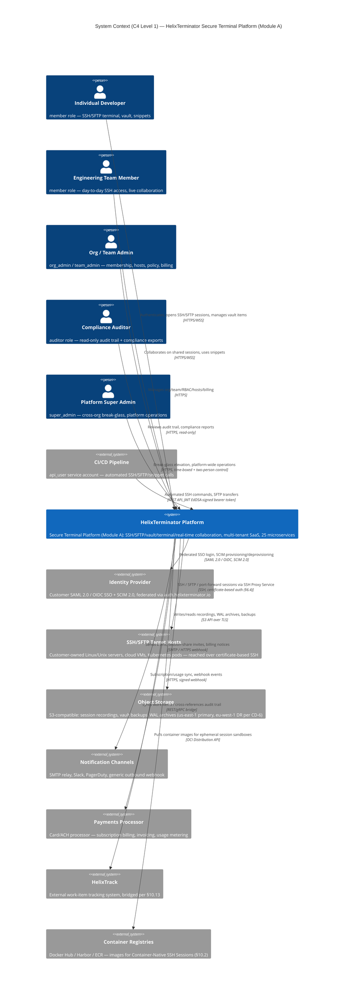

# HelixTerminator — Core Architecture Specification
**Document:** `01_core_architecture.md`
**Version:** V1 · Revision 1
**Go Module:** `helixterm.io/core`
**Spec Owner:** HelixDevelopment
**Date:** 2026-06-28
**Status:** DRAFT — Engineering Review
**Constitution Compliance:** HelixConstitution (pinned e6504c2, helixcode-v1.1.0 line) · §11.4, §11.4.73–78

> **Inheritance:** This document and the project that contains it extend the Helix Universal Constitution at `constitution/Constitution.md`. All clauses there apply unless explicitly overridden. See `constitution/CLAUDE.md` and `constitution/AGENTS.md`.

> NOTE (CD-2 — flagged, not mass-rewritten): per `CANONICAL_FACTS.md`, the primary org/domain identity going forward is `HelixDevelopment` / `helixterminator.io` (org identity above is already correct). This document's Go module namespace and every `helixterm.io` host/URL/SPIFFE-ID reference throughout §1–§10 predate that domain decision and are **not** rewritten here — a domain-wide rename is a high-churn, cross-cutting change (100+ refs) tracked as DEFERRED cross-doc work in `CANONICAL_FACTS.md`, consistent with how `10_submodule_integration.md` treats the same identity fields. Do not treat `helixterm.io` below as newly-canonical.

---

## Table of Contents

1. [Executive Summary & Vision](#1-executive-summary--vision)
2. [Complete System Architecture](#2-complete-system-architecture)
3. [Complete Microservices Catalog](#3-complete-microservices-catalog)
4. [Database Architecture](#4-database-architecture)
5. [Kafka & RabbitMQ Architecture](#5-kafka--rabbitmq-architecture)
6. [Zero Trust Security Architecture](#6-zero-trust-security-architecture)
7. [API Specification](#7-api-specification)
8. [Performance Architecture](#8-performance-architecture)
9. [Kubernetes Deployment](#9-kubernetes-deployment)
10. [Submodule Integration](#10-submodule-integration)

---

# 1. Executive Summary & Vision

## 1.1 Mission Statement

HelixTerminator is a next-generation, enterprise-grade SSH client platform designed from first principles to replace and decisively surpass Termius across every dimension: security posture, scalability, developer experience, collaboration depth, extensibility, and operational intelligence. Where Termius is a well-polished productivity tool for individual operators and small teams, HelixTerminator is a full-stack, microservices-native platform targeting hyperscale engineering organizations, regulated-industry enterprises, managed service providers, and cloud-native infrastructure teams who demand audit-trail completeness, zero-trust identity enforcement, AI-augmented workflows, and continuous compliance verification baked into every layer of the stack.

HelixTerminator ships as a unified platform — a set of independently deployable, loosely coupled Go microservices backed by Apache Kafka for event streaming, RabbitMQ for command routing, PostgreSQL for durable relational state, and Redis for high-throughput caching. All clients — Web SPA, Desktop (macOS, Windows, Linux), iOS, and Android — are built on Flutter/Dart and consume a single versioned REST/WebSocket/gRPC surface.

The platform is built around five irrevocable principles:

1. **Security is not a feature — it is the substrate.** Every connection, every byte of stored credential, every API call is cryptographically authenticated. There are no unencrypted paths.
2. **Audit completeness is non-negotiable.** Every terminal command, every file transfer, every authentication event, every configuration change is persisted as an immutable, cryptographically chained audit event, available for real-time streaming and retrospective forensic analysis.
3. **Collaboration is a first-class primitive.** Multiple operators can share a terminal session with role-differentiated capabilities (read-only observer, co-pilot, session owner) in real time, with sub-100ms propagation latency.
4. **AI augmentation is integrated, not bolted on.** The AI/Autocomplete service analyses shell history, infrastructure topology, and contextual signals to suggest commands, detect anomalies, generate runbooks, and explain terminal output — all without transmitting sensitive credential material to external model providers.
5. **HelixConstitution compliance is mechanically enforced.** Every CI/CD pipeline gate, every agent rule file, every submodule dependency graph, and every code generation pass respects the universal constitution inherited from `HelixDevelopment/HelixConstitution` (pinned e6504c2, helixcode-v1.1.0 line).

## 1.2 How HelixTerminator Surpasses Termius at Every Dimension

### 1.2.1 Credential Management

**Termius:** Credentials (passwords, private keys) are stored in a proprietary encrypted vault synced across devices. The encryption key derivation is opaque to the operator, and there is no verifiable zero-knowledge guarantee. The vault is a client-side construct with no server-side auditability.

**HelixTerminator:** The Vault Service (`helixterm.io/services/vault`) implements a verifiable zero-knowledge architecture. Vault items are encrypted client-side using AES-256-GCM with keys derived via Argon2id (time_cost=3, memory_cost=65536, parallelism=4). The server stores only ciphertext. Key material is never transmitted in plaintext. SSH private keys are additionally wrapped by the Certificate Authority Service (`helixterm.io/services/pki`) which issues short-lived signed SSH certificates (TTL=8h by default, configurable per org) so that static private keys are never stored on jump hosts. The Keychain Service (`helixterm.io/services/keychain`) provides hardware-backed key storage on platforms that support it (macOS Secure Enclave, Android Keystore, Windows DPAPI), using `digital.vasic.security` for the underlying AES and storage primitives.

### 1.2.2 Team Collaboration

**Termius:** Teams can share host configurations and credential groups, but there is no real-time collaborative terminal session. Screen sharing requires external tools.

**HelixTerminator:** The Collaboration Service (`helixterm.io/services/collab`) and Terminal Session Service (`helixterm.io/services/terminal`) jointly implement WebSocket-based real-time session sharing with the following capabilities:
- **Session owner:** Full interactive control.
- **Co-pilot:** Interactive input, must be granted by owner.
- **Observer:** Read-only streaming with zero write access enforced at the SSH Proxy level, not just the UI.
- **Synchronized scrollback buffer:** All participants see an identical terminal state, including historical output, delivered via CRDT-based buffer synchronization over Kafka event streams.
- **Broadcast sessions:** One operator can stream a terminal session to thousands of observers for training, incident response, and runbook execution demonstrations.

### 1.2.3 Session Recording and Audit

**Termius:** No built-in session recording. No audit trail. No compliance reporting.

**HelixTerminator:** The Session Recording Service (`helixterm.io/services/recording`) records every terminal session as a full-fidelity asciinema-format stream, timestamped at millisecond granularity, stored in object storage (S3-compatible), and indexed in PostgreSQL for full-text search. Recordings are cryptographically signed (Ed25519) so tampering is detectable. The Audit Service (`helixterm.io/services/audit`) maintains an append-only, Merkle-chained audit log of every authentication event, command execution, configuration change, and privilege escalation, compliant with SOC 2 Type II, ISO 27001, and FedRAMP Moderate control requirements. Audit events are emitted to Kafka topic `helix.audit.events` with retention of 365 days.

### 1.2.4 Authentication and MFA

**Termius:** Username/password + TOTP-based 2FA. No hardware key support beyond basic TOTP. No SSO for free/personal tiers. No certificate-based authentication beyond private key support.

**HelixTerminator:** Full FIDO2/WebAuthn MFA with hardware security key support (YubiKey 5, Google Titan, any CTAP2-compliant device). Biometric authentication on mobile and desktop via platform authenticator APIs. Enterprise SSO via SAML 2.0 and OIDC (Auth Service `helixterm.io/services/auth` consumes `digital.vasic.auth`). Device certificates issued at registration time, short-lived (TTL=24h renewable), providing a passwordless authentication path for CI/CD agents and automation pipelines. Passkey support (discoverable credentials) for next-generation password-free human logins.

### 1.2.5 AI and Automation

**Termius:** No AI features as of 2026. Terminal experience is purely reactive.

**HelixTerminator:** The AI/Autocomplete Service (`helixterm.io/services/ai`) provides:
- **Command autocomplete:** Trained on the operator's own shell history, infrastructure topology, and a corpus of DevOps best practices. Suggestions are generated locally (on-device model) or via a private inference endpoint — no data leaves the organization's trust boundary by default.
- **Anomaly detection:** Real-time analysis of command streams for suspicious patterns (bulk `rm -rf`, unexpected sudo escalations, data exfiltration signatures). Anomalies emit events to `helix.security.anomalies` Kafka topic, triggering immediate alerts and optionally session termination.
- **Runbook generation:** Given a description of an operational task, the AI service generates a multi-step runbook with inline shell commands, dependency checks, and rollback steps.
- **Terminal output explanation:** The operator can highlight terminal output and request an explanation, which is annotated inline in the terminal scrollback buffer.
- **Incident response assist:** During a declared incident (triggered via HelixTrack integration), the AI service surfaces relevant runbooks, recent command history across team members, and infrastructure state diffs.

### 1.2.6 Container and Kubernetes Integration

**Termius:** Basic SSH connectivity. No native container or Kubernetes awareness.

**HelixTerminator:** The Container Registry Bridge (`helixterm.io/services/container-bridge`) and SSH Proxy Service (`helixterm.io/services/ssh-proxy`) integrate with `digital.vasic.containers` to provide:
- **Pod exec:** Direct `kubectl exec`-style terminal sessions into Kubernetes pods via the platform, with full audit trail and recording.
- **Container shell:** Docker/Podman container shell sessions without requiring an SSH daemon inside the container.
- **Health dashboard:** Real-time pod health, resource utilization, and event streams sourced from the Kubernetes API, displayed in the HelixTerminator sidebar.
- **Container lifecycle management:** Start, stop, restart, and tail logs for containers managed via the platform.

### 1.2.7 Port Forwarding and Tunneling

**Termius:** Basic local/remote/dynamic port forwarding. No management plane for active tunnels.

**HelixTerminator:** The Port Forwarding Service (`helixterm.io/services/port-forward`) maintains a persistent catalog of forwarding rules (stored in PostgreSQL), manages their lifecycle (auto-reconnect with exponential backoff using `digital.vasic.recovery`), and exposes them via a management API. Local, remote, and dynamic (SOCKS5) modes. Reverse tunnels for exposing internal services to authorized external users. Tunnel metrics (bytes transferred, connection latency, error rates) streamed to `helix.metrics.tunnels` Kafka topic for Prometheus consumption.

### 1.2.8 SFTP and File Management

**Termius:** SFTP file browser with basic upload/download. No bulk operations, no directory synchronization, no diff view.

**HelixTerminator:** The SFTP Service (`helixterm.io/services/sftp`) implements a full-featured file management experience:
- **Multi-pane browser:** Two-pane local/remote file manager with drag-and-drop, bulk operations, and progress tracking.
- **Directory sync:** Rsync-style synchronization between local and remote directories with diff preview and conflict resolution.
- **File diff viewer:** Inline diff between local and remote versions of text files.
- **Transfer queue:** Persistent transfer queue with pause/resume, retry, and priority ordering.
- **Checksums:** Automatic SHA-256 checksum verification after every transfer.
- **Audit integration:** Every file transfer (upload/download/delete) emits an audit event.

## 1.3 Target Audience

### 1.3.1 Individual Developers
Individual developers gain a best-in-class SSH client with intelligent autocomplete, a beautiful cross-platform Flutter UI, zero-friction host management, and AI-powered troubleshooting — all on a free tier with no degradation of core functionality.

### 1.3.2 Engineering Teams (5–200 engineers)
Teams gain shared host inventories, shared snippet libraries, collaborative terminal sessions, and a centralized secrets vault with per-user access control. Integration with HelixTrack (`helixterm.io/services/helixtrack-bridge`) links terminal sessions to open issues and sprints, enabling traceability from deployment commands to engineering work items.

### 1.3.3 Enterprise Organizations
Enterprises gain SOC 2 Type II–aligned audit trails, SAML 2.0/OIDC SSO, SCIM directory synchronization, role-based access control at the host/group/command level, session recording with tamper-evident storage, FIDO2 MFA enforcement, and a comprehensive compliance dashboard. The Organization Service (`helixterm.io/services/org`) models multi-tenant hierarchies (Organization → Teams → Members) with fine-grained permission inheritance.

### 1.3.4 DevOps Engineers and SREs
Seamless Kubernetes and container integration, port forwarding lifecycle management, real-time infrastructure health dashboards, runbook library with execution tracking, and AI-powered anomaly detection during incident response.

### 1.3.5 Managed Service Providers (MSPs)
Multi-tenant organization management, per-customer credential isolation, white-label deployment capability, comprehensive per-customer audit reporting, and customer-specific rate limit and resource quota configuration.

## 1.4 Bleeding-Edge Innovations

1. **Cryptographically chained audit log (Merkle structure):** Each audit event references the SHA-256 hash of the previous event, making retroactive tampering computationally infeasible and detectable by any holder of the chain.
2. **Short-lived SSH certificates:** Instead of static private keys, HelixTerminator's PKI service issues X.509-compatible SSH certificates with TTLs as short as one hour, eliminating the long-lived credential risk that underlies most SSH-related breaches.
3. **CRDT-based collaborative terminal:** Using a Conflict-free Replicated Data Type for terminal buffer state ensures that multiple collaborators always see an eventually consistent, conflict-free view of terminal output, even under high-latency network conditions.
4. **Zero-knowledge vault:** The server is architecturally incapable of reading vault contents. Client-side encryption is enforced at the protocol level, not merely by policy.
5. **On-device AI inference:** Command suggestion models are small enough (< 50MB quantized) to run entirely on-device via ONNX Runtime, eliminating the need to transmit command history to external inference endpoints.
6. **`digital.vasic.docs_chain` integration:** The Salsa-inspired DAG-based document dependency engine propagates specification changes across the entire documentation corpus automatically, ensuring that changes to this core architecture document trigger validation gates on all dependent specification documents.
7. **Container-native SSH sessions via `digital.vasic.containers`:** SSH sessions can target not just traditional SSH daemons but any container runtime — Docker, Podman, or Kubernetes pod — via the containers submodule's unified ContainerRuntime abstraction, without installing an SSH server inside the container.
8. **HelixConstitution–enforced CI/CD:** Every pull request gate verifies constitution inheritance integrity (anti-bluff audit, §11.4 anchor checks), submodule catalogue consistency, and containers-submodule mandate compliance before merge.

## 1.5 Market Positioning

HelixTerminator enters a market segment currently occupied by Termius (consumer/SMB SSH client), Teleport (access management platform), and HashiCorp Boundary (zero-trust access). HelixTerminator's differentiation is the synthesis of all three into a single, developer-first platform: the polished, intuitive UX of Termius combined with the access management depth of Teleport, the zero-trust architecture of HashiCorp Boundary, and the AI-augmented developer experience that none of the incumbents currently provide, at a price point accessible to individual developers while scaling commercially to enterprise.

**Pricing Tiers:**
- **Free (Individual):** Unlimited hosts, unlimited sessions, 5 vault items, no team features, community support.
- **Pro (Individual):** Unlimited vault, AI autocomplete, session recording (30-day retention), priority support. $9/month.
- **Team (per-seat):** All Pro features + shared vaults, team host management, collaboration, HelixTrack integration. $15/seat/month.
- **Enterprise:** All Team features + SAML/SCIM, FIDO2 enforcement, unlimited recording retention, compliance dashboard, SLA, dedicated support. Custom pricing.
- **Self-hosted:** All Enterprise features, deploy in your own Kubernetes cluster, full source access for licensed modules. Custom pricing.

---
# 2. Complete System Architecture

## 2.1 Architectural Philosophy

HelixTerminator's architecture is a full microservices system with strict domain isolation, event-driven state propagation, and zero-trust security enforcement at every layer. Services communicate via three channels:

1. **Synchronous REST/gRPC** (via the API Gateway): used for request/response patterns where the caller needs an immediate result.
2. **Apache Kafka** (event streaming): used for durable, ordered, replayable event propagation — audit events, analytics, session telemetry, state change notifications.
3. **RabbitMQ** (command bus): used for work-queue patterns where a producer dispatches a command and expects exactly-once execution by a consumer — SSH connection commands, SFTP transfer commands, notification delivery.

This three-channel model provides clear semantic separation: Kafka for facts that have already happened (events), RabbitMQ for instructions that must happen exactly once (commands), REST/gRPC for interrogations (queries) and mutations requiring transactional semantics.

## 2.2 Architecture Diagrams

### 2.2.1 System Context (C4 Level 1)

The System Context diagram fixes the platform's outer trust boundary: the human personas and
automated actors that call it, and the external systems it depends on. It is the missing top
level above the container-level diagram in §2.2.2 (DEEP-WORK item, `REMEDIATION_REGISTER.md`
§4/§5 "C4 context diagram"). Module scope: this diagram depicts **Module A — Secure Terminal
Platform** (per `CANONICAL_FACTS.md` CD-1); Module B (Zero-Trust Connection Broker / WireGuard)
has its own context and is out of scope here.



**Reading the diagram:** every `Rel(platform, System_Ext, ...)` arrow crosses a zero-trust boundary
(§6) and is therefore mTLS/TLS-terminated, rate-limited at the gateway (§2.5), and covered by the
circuit-breaker + bulkhead matrix in §2.8. The five personas map 1:1 onto the six canonical RBAC
roles from `CANONICAL_FACTS.md` CD-8 (`super_admin`, `org_admin`, `team_admin` folded into "Org /
Team Admin" above, `member`, `auditor`, `api_user`).

### 2.2.2 Container-Level Architecture (C4 Level 2)

The diagram below is the container-level (C4 Level 2) decomposition — the API Gateway, the 25
services from §3, and the two messaging backbones (Kafka, RabbitMQ) that sit inside the
`platform` system box of §2.2.1.

```
┌─────────────────────────────────────────────────────────────────────────────┐
│                          CLIENT LAYER                                        │
│  Flutter Web SPA │ Flutter Desktop (macOS/Win/Linux) │ Flutter Mobile (iOS/Android) │
└─────────────────────────────────────┬───────────────────────────────────────┘
                                       │ HTTPS / WSS / gRPC-Web
┌─────────────────────────────────────▼───────────────────────────────────────┐
│                      INGRESS LAYER                                           │
│           Nginx Ingress Controller + cert-manager (TLS termination)          │
└─────────────────────────────────────┬───────────────────────────────────────┘
                                       │ mTLS (SPIFFE/SPIRE identities)
┌─────────────────────────────────────▼───────────────────────────────────────┐
│               API GATEWAY SERVICE  helixterm.io/services/gateway  :8080      │
│     Rate limiting │ Auth token validation │ Request routing │ Circuit breaker│
└──┬──────────┬──────────┬─────────┬──────────┬──────────┬───────────┬────────┘
   │          │          │         │          │          │           │
   ▼          ▼          ▼         ▼          ▼          ▼           ▼
 Auth      User       Vault     Host      Workspace  Snippet     Org/Team
:8081     :8082      :8083     :8084      :8085      :8086       :8087
   │          │          │         │          │          │           │
   └──────────┴──────────┴────┬────┴──────────┴──────────┴───────────┘
                               │ Internal gRPC / mTLS
   ┌───────────────────────────▼──────────────────────────────────────┐
   │              SSH PROXY SERVICE  helixterm.io/services/ssh-proxy  │
   │              :8090 (WebSocket → SSH tunnel)                      │
   └──────────────────────┬───────────────────────────────────────────┘
                          │
         ┌────────────────┼────────────────┐
         ▼                ▼                ▼
    Terminal          SFTP          Port Forward
    :8091            :8092            :8093
         │                │                │
         └────────────────┼────────────────┘
                          │
         ┌────────────────▼────────────────────┐
         │   Apache Kafka  (Event Streaming)    │
         │   RabbitMQ     (Command Bus)         │
         └────────────────┬────────────────────┘
                          │
     ┌────────────────────┼────────────────────────┐
     ▼                    ▼                         ▼
  Audit              Analytics               Notification
  :8094              :8095                   :8096
     │                    │                         │
     ▼                    ▼                         │
  Recording          AI Service              ────────┘
  :8097              :8098
     │
     ▼
  Collab
  :8099
     │
  Session sharing via Kafka + WebSocket fan-out

  Supporting Services:
  PKI :8100 │ Keychain :8101 │ Config :8102 │ Health :8103
  Billing :8104 │ Container Bridge :8105 │ HelixTrack Bridge :8106
```

## 2.3 Service Mesh: Istio Integration

All services run inside an Istio service mesh on Kubernetes. Every pod has an Envoy sidecar injected automatically via `istio-injection=enabled` namespace label. Key Istio configuration:

- **mTLS mode:** `STRICT` — no plaintext traffic accepted between any two services. SPIFFE SVIDs are automatically issued by SPIRE agents running as DaemonSets.
- **AuthorizationPolicy:** Default `deny-all` at namespace level, with explicit `ALLOW` rules per service pair. No implicit trust.
- **DestinationRule:** Per-service circuit breaker settings (see §8.5).
- **VirtualService:** Canary routing for zero-downtime deployments (traffic splitting 95/5 during rollout).
- **PeerAuthentication:** `STRICT` mTLS for all workloads in `helixterm-prod`, `helixterm-staging`, and `helixterm-dev` namespaces.

```yaml
# Namespace-level default deny
apiVersion: security.istio.io/v1beta1
kind: AuthorizationPolicy
metadata:
  name: default-deny-all
  namespace: helixterm-prod
spec:
  {}  # Empty spec = deny all
```

```yaml
# Gateway → Auth service allow
apiVersion: security.istio.io/v1beta1
kind: AuthorizationPolicy
metadata:
  name: gateway-to-auth
  namespace: helixterm-prod
spec:
  selector:
    matchLabels:
      app: auth-service
  rules:
  - from:
    - source:
        principals: ["cluster.local/ns/helixterm-prod/sa/gateway-service"]
    to:
    - operation:
        methods: ["GET", "POST", "PUT", "DELETE"]
        paths: ["/api/v1/auth/*"]
```

## 2.4 SPIFFE/SPIRE Workload Identity

Every service is assigned a SPIFFE SVID (SPIFFE Verifiable Identity Document) of the form:

```
spiffe://helixterm.io/ns/helixterm-prod/sa/<service-account-name>
```

SPIRE Server runs as a StatefulSet. SPIRE Agents run as DaemonSets. SVIDs are rotated every hour. X.509 SVIDs are used for mTLS (Envoy's certificate material). JWT SVIDs are used for service-to-service API calls where certificate-based auth is not available.

## 2.5 API Gateway Design

The API Gateway (`helixterm.io/services/gateway`) is built on Gin Gonic and performs:

1. **TLS termination** (delegated to Nginx Ingress + cert-manager in Kubernetes).
2. **JWT validation:** Validates access tokens signed by the Auth Service (EdDSA/Ed25519, public key fetched from JWKS endpoint with caching via `digital.vasic.cache`).
3. **Rate limiting:** Per-user, per-IP, per-endpoint rate limiting using `digital.vasic.ratelimiter` backed by Redis sliding window counters.
4. **Request routing:** Path-based routing to upstream services via registered Gin route groups.
5. **Circuit breaking:** `digital.vasic.recovery` circuit breaker wraps every upstream call; open-circuit returns 503 with `Retry-After` header.
6. **Observability:** Every request emits a trace span to OpenTelemetry collector (via `digital.vasic.observability`). Request duration, status code, and upstream service metrics are exported as Prometheus counters/histograms.
7. **Request ID propagation:** Every request receives a `X-Request-ID` (UUID v7) injected if not present, propagated in all downstream calls.

```go
// Package: helixterm.io/services/gateway
// File: internal/router/router.go

package router

import (
    "github.com/gin-gonic/gin"
    "helixterm.io/services/gateway/internal/middleware"
    "helixterm.io/services/gateway/internal/proxy"
    "digital.vasic.ratelimiter/pkg/limiter"
    "digital.vasic.recovery/pkg/circuitbreaker"
    "digital.vasic.observability/pkg/tracing"
    "digital.vasic.auth/pkg/jwt"
)

func New(
    jwtValidator jwt.Validator,
    rl limiter.RateLimiter,
    cb circuitbreaker.Factory,
    tracer tracing.Tracer,
) *gin.Engine {
    r := gin.New()
    r.Use(middleware.RequestID())
    r.Use(middleware.Logger(tracer))
    r.Use(middleware.Recovery())
    r.Use(middleware.CORS())

    // Public routes (no JWT required)
    public := r.Group("/api/v1")
    {
        public.POST("/auth/login", proxy.Auth(cb))
        public.POST("/auth/register", proxy.Auth(cb))
        public.POST("/auth/refresh", proxy.Auth(cb))
        public.GET("/auth/.well-known/jwks.json", proxy.Auth(cb))
        public.POST("/auth/webauthn/begin-registration", proxy.Auth(cb))
        public.POST("/auth/webauthn/finish-registration", proxy.Auth(cb))
        public.POST("/auth/webauthn/begin-login", proxy.Auth(cb))
        public.POST("/auth/webauthn/finish-login", proxy.Auth(cb))
    }

    // Authenticated routes
    authed := r.Group("/api/v1")
    authed.Use(middleware.JWTAuth(jwtValidator))
    authed.Use(middleware.RateLimit(rl))
    {
        authed.Any("/users/*path", proxy.User(cb))
        authed.Any("/vault/*path", proxy.Vault(cb))
        authed.Any("/hosts/*path", proxy.Host(cb))
        authed.Any("/snippets/*path", proxy.Snippet(cb))
        authed.Any("/workspaces/*path", proxy.Workspace(cb))
        authed.Any("/org/*path", proxy.Org(cb))
        authed.Any("/sessions/*path", proxy.Terminal(cb))
        authed.Any("/sftp/*path", proxy.SFTP(cb))
        authed.Any("/port-forward/*path", proxy.PortForward(cb))
        authed.Any("/collab/*path", proxy.Collab(cb))
        authed.Any("/notifications/*path", proxy.Notification(cb))
        authed.Any("/audit/*path", proxy.Audit(cb))
        authed.Any("/recordings/*path", proxy.Recording(cb))
        authed.Any("/ai/*path", proxy.AI(cb))
        authed.Any("/billing/*path", proxy.Billing(cb))
        authed.Any("/pki/*path", proxy.PKI(cb))
        authed.Any("/config/*path", proxy.Config(cb))
        authed.Any("/containers/*path", proxy.ContainerBridge(cb))
        authed.Any("/helixtrack/*path", proxy.HelixTrackBridge(cb))
    }

    // WebSocket upgrade endpoints
    ws := r.Group("/ws/v1")
    ws.Use(middleware.WSAuth(jwtValidator))
    {
        ws.GET("/terminal/:session_id", proxy.TerminalWS(cb))
        ws.GET("/collab/:session_id", proxy.CollabWS(cb))
        ws.GET("/sftp/:session_id/stream", proxy.SFTPProgressWS(cb))
        ws.GET("/notifications/stream", proxy.NotificationWS(cb))
    }

    return r
}
```

## 2.6 Inter-Service Communication Patterns

### 2.6.1 When to Use Kafka (Event Streaming)

Kafka is used for **facts** — things that have already happened and whose record must be durable, ordered, and replayable:

| Use Case | Kafka Topic |
|---|---|
| User registered | `helix.users.registered` |
| User authenticated | `helix.auth.authenticated` |
| Session started | `helix.sessions.started` |
| Session terminated | `helix.sessions.terminated` |
| Terminal command executed | `helix.terminal.commands` |
| File transferred | `helix.sftp.transfers` |
| Audit event | `helix.audit.events` |
| Anomaly detected | `helix.security.anomalies` |
| Port forward opened | `helix.portforward.opened` |
| Vault item accessed | `helix.vault.accessed` |
| Billing event | `helix.billing.events` |
| Analytics events | `helix.analytics.events` |
| Session recording segment | `helix.recordings.segments` |
| AI suggestion generated | `helix.ai.suggestions` |
| Container health change | `helix.containers.health` |

**Kafka guarantees:** at-least-once delivery (consumers deduplicate via event IDs), ordered within a partition, 7-day default retention (365 days for audit topics), Snappy compression.

### 2.6.2 When to Use RabbitMQ (Command Bus)

RabbitMQ is used for **commands** — instructions that must be executed exactly once by exactly one consumer:

| Use Case | Exchange | Queue |
|---|---|---|
| Initiate SSH connection | `helix.commands` | `helix.cmd.ssh.connect` |
| Terminate SSH connection | `helix.commands` | `helix.cmd.ssh.disconnect` |
| Start SFTP transfer | `helix.commands` | `helix.cmd.sftp.transfer` |
| Send notification (email) | `helix.notifications` | `helix.notif.email` |
| Send notification (push) | `helix.notifications` | `helix.notif.push` |
| Send notification (slack) | `helix.notifications` | `helix.notif.slack` |
| Generate session recording | `helix.commands` | `helix.cmd.recording.generate` |
| Issue SSH certificate | `helix.commands` | `helix.cmd.pki.issue` |
| Execute container action | `helix.commands` | `helix.cmd.container.exec` |
| Sync HelixTrack issue | `helix.commands` | `helix.cmd.helixtrack.sync` |

**RabbitMQ guarantees:** durable queues, persistent messages, consumer acknowledgements, dead-letter exchange (`helix.dlx`) with retry routing (3 retries with exponential backoff).

### 2.6.3 Synchronous gRPC (Internal)

Services that require low-latency request/response and benefit from strongly-typed contracts use gRPC internally:

| Caller | Callee | gRPC Method |
|---|---|---|
| SSH Proxy | Auth | `VerifySessionToken` |
| SSH Proxy | Vault | `GetDecryptedCredential` |
| SSH Proxy | Audit | `RecordSessionEvent` |
| Terminal | Collab | `BroadcastTerminalOutput` |
| Gateway | Auth | `ValidateAccessToken` |
| Vault | Keychain | `GetWrappedKey` |
| PKI | Vault | `GetSigningKey` |

## 2.7 Event Sourcing and CQRS

The following services implement full Event Sourcing + CQRS:

- **Auth Service:** Authentication commands (Login, Logout, RefreshToken) produce events written to an event store. Read models (current session state, active tokens) are rebuilt from the event stream.
- **Vault Service:** Vault mutations (CreateItem, UpdateItem, DeleteItem) are events. The current vault state is a projection of the event stream, enabling point-in-time reconstruction.
- **Audit Service:** Exclusively event-sourced. The audit log IS the event stream. No mutable state.
- **Org Service:** Organization and membership changes are events, enabling a full history of org structure changes for compliance.

Event store schema (PostgreSQL):
```sql
CREATE TABLE event_store (
    id            UUID         PRIMARY KEY DEFAULT gen_random_uuid(),
    stream_id     VARCHAR(255) NOT NULL,
    stream_type   VARCHAR(100) NOT NULL,
    sequence_num  BIGINT       NOT NULL,
    event_type    VARCHAR(100) NOT NULL,
    event_data    JSONB        NOT NULL,
    metadata      JSONB        NOT NULL DEFAULT '{}',
    occurred_at   TIMESTAMPTZ  NOT NULL DEFAULT NOW(),
    UNIQUE (stream_id, sequence_num)
);
CREATE INDEX idx_event_store_stream ON event_store (stream_id, sequence_num);
CREATE INDEX idx_event_store_type   ON event_store (event_type);
CREATE INDEX idx_event_store_time   ON event_store (occurred_at);
```

## 2.8 Circuit Breaker Strategy

All outbound calls use `digital.vasic.recovery`'s circuit breaker implementation with the following default configuration:

```go
// Package: digital.vasic.recovery/pkg/circuitbreaker
// Usage in helixterm.io/services/gateway

import "digital.vasic.recovery/pkg/circuitbreaker"

var defaultConfig = circuitbreaker.Config{
    MaxRequests:     5,                    // Half-open state: max requests to test recovery
    Interval:        10 * time.Second,     // Closed state: rolling window
    Timeout:         30 * time.Second,     // Open state: duration before half-open transition
    ReadyToTrip: func(counts circuitbreaker.Counts) bool {
        failureRatio := float64(counts.TotalFailures) / float64(counts.Requests)
        return counts.Requests >= 10 && failureRatio >= 0.6
    },
    OnStateChange: func(name string, from, to circuitbreaker.State) {
        log.Warnf("circuit breaker %s: %s → %s", name, from, to)
        metrics.CircuitBreakerStateChange.WithLabelValues(name, string(to)).Inc()
    },
}
```

Per-service thresholds:

| Service | Timeout | Trip Ratio | Max Requests (half-open) |
|---|---|---|---|
| Auth | 5s | 0.5 (50%) | 3 |
| Vault | 5s | 0.5 | 3 |
| SSH Proxy | 30s | 0.3 | 2 |
| AI | 60s | 0.7 | 5 |
| HelixTrack Bridge | 60s | 0.8 | 5 |
| Billing | 30s | 0.4 | 3 |

### Full Per-Service Failure-Mode & Resilience Matrix

The six rows above are the historical illustrative set; the table below extends the same
`digital.vasic.recovery` circuit-breaker + bulkhead discipline to **all 25 services** in §3,
closing the DEEP-WORK gap tracked in `REMEDIATION_REGISTER.md` §4/§5 ("circuit-breaker/failure-mode
coverage for all 25 services"). Upstream Dependencies are taken verbatim from the dependency graph
in §2.9. Services are grouped into three resilience classes, each with a distinct retry/backoff and
bulkhead policy appropriate to its call shape:

- **Class A — synchronous CRUD** (stateless request/response, safe to retry): bounded exponential
  backoff, moderate CB trip ratio, bulkhead sized as a per-pod concurrency semaphore via
  `digital.vasic.concurrency/pkg/workpool`.
- **Class B — long-lived stateful connections** (SSH/WebSocket tunnels): retries are **not**
  applied to an established connection (re-sending SSH input/output is not idempotent — retry
  scope is limited to the initial handshake); CB trips earlier (lower ratio, fewer probe requests)
  because a stuck downstream directly holds a scarce connection slot; bulkhead is the connection
  pool itself (§8.4 WebSocket Hub, §8.6 SSH Connection Pool).
- **Class C — asynchronous / best-effort** (Kafka-mediated, fire-and-forget or leaf): no
  synchronous circuit breaker on the calling path — backpressure and redelivery are handled by the
  Kafka consumer group + DLQ (§5.6); "CB Trip Ratio" is marked N/A and bulkhead is expressed as
  max concurrent consumer workers per pod.

| Service | Class | Upstream Dependencies | Timeout | Retry / Backoff | CB Trip Ratio (min reqs) | CB Max Half-Open | Bulkhead (max concurrent / pod) |
|---|---|---|---|---|---|---|---|
| API Gateway | — (ingress) | all 25 downstream services | N/A (enforces per-downstream config above) | N/A | N/A | N/A | 10,000 in-flight requests/pod (Nginx Ingress + Gin) |
| Auth | A | user, vault, pki, notification, audit | 5s | 3× exponential (100/200/400ms + 20% jitter) | 0.5 (min 10) | 3 | 200 |
| User | A | org, notification, audit | 5s | 3× exponential (100/200/400ms + 20% jitter) | 0.5 (min 10) | 3 | 200 |
| Vault | A | keychain, audit, pki | 5s | 3× exponential (100/200/400ms + 20% jitter) | 0.5 (min 10) | 3 | 150 |
| Host | A | vault, org, audit | 5s | 3× exponential (100/200/400ms + 20% jitter) | 0.5 (min 10) | 3 | 200 |
| SSH Proxy | B | auth, vault, host, terminal, audit, recording, pki, container-bridge | 30s (handshake) | 0 (established sessions never retried; handshake retried once) | 0.3 (min 5) | 2 | 5,000 pooled SSH conns/pod (§8.6, maxActive=20/tuple) |
| Terminal | B | ssh-proxy, collab, recording, ai, audit | 30s (handshake) | 0 (WebSocket reconnect is client-driven, not server retry) | 0.3 (min 5) | 2 | 5,000 WebSocket conns/pod (§8.4) |
| SFTP | B | ssh-proxy, vault, audit | 30s | 1 (transfer-init only; in-flight transfer not retried) | 0.3 (min 5) | 2 | 1,000 concurrent transfers/pod |
| Port Forward | B | ssh-proxy, vault, audit | 30s | 1 (tunnel-init only) | 0.3 (min 5) | 2 | 500 concurrent tunnels/pod |
| Snippet | A | audit | 5s | 3× exponential (100/200/400ms + 20% jitter) | 0.5 (min 10) | 3 | 200 |
| Keychain | A | audit | 5s | 3× exponential (100/200/400ms + 20% jitter) | 0.5 (min 10) | 3 | 150 |
| Workspace | A | user, org, audit | 5s | 3× exponential (100/200/400ms + 20% jitter) | 0.5 (min 10) | 3 | 200 |
| Collaboration | B | terminal, user, org, notification | 15s | 0 (presence/CRDT stream not retried; client resyncs) | 0.3 (min 5) | 2 | 5,000 concurrent participants/pod (shares Terminal Hub, §8.4) |
| Notification | A | user, audit | 10s (external SMTP/webhook egress) | 3× exponential (250/500/1000ms + jitter) | 0.5 (min 10) | 3 | 300 |
| Audit | C (leaf) | — (emits to Kafka only; consumes nothing synchronously) | N/A | Kafka producer `acks=all`, synchronous, fail-closed for privileged-op events (no silent drop) | N/A | N/A | 32 producer workers/pod, backed by §5.6 DLQ |
| Analytics | C | Kafka consumer only (no synchronous upstream) | N/A | Kafka consumer-group redelivery, 3 attempts before DLQ (§5.6) | N/A | N/A | 50 partition-consumer workers/pod |
| AI/Autocomplete | A | terminal, user, audit | 60s | 1 (LLM calls are not blindly retried — cost/latency) | 0.7 (min 20) | 5 | 100 (LLM-bound, lower fan-out than CRUD services) |
| Session Recording | B | terminal, audit | 30s | 1 (segment upload only; active recording stream not retried) | 0.3 (min 5) | 2 | 2,000 concurrent active recordings/pod (object-storage write bound) |
| PKI (Certificate Authority) | A | vault, audit | 5s | 3× exponential (100/200/400ms + 20% jitter) | 0.5 (min 10) | 3 | 150 |
| Organization/Team | A | user, auth, notification, audit | 5s | 3× exponential (100/200/400ms + 20% jitter) | 0.5 (min 10) | 3 | 200 |
| Billing | A | org, user, notification, audit | 30s | 0.4 (min 10) — no automatic retry against payment processor writes (avoid double-charge) | 0.4 (min 10) | 3 | 100 |
| Configuration | A | audit | 5s | 3× exponential (100/200/400ms + 20% jitter) | 0.5 (min 10) | 3 | 200 |
| Health/Monitoring | A | all services (health-check fan-out) | 2s | 0 (a slow health check is itself the signal; retrying masks it) | N/A (never trips — probes report, don't block traffic) | N/A | 500 (parallel probe fan-out) |
| Container Registry Bridge | A | vault, org, audit | 15s (external registry egress) | 3× exponential (250/500/1000ms + jitter) | 0.5 (min 10) | 3 | 150 |
| HelixTrack Bridge | A | user, org, audit | 60s | 3× exponential (500/1000/2000ms + jitter) | 0.8 (min 20) | 5 | 100 |

**Bulkhead enforcement:** every Class A/B bulkhead is implemented as a bounded semaphore from
`digital.vasic.concurrency/pkg/workpool` (mirrors the `Hub.pool` field in §8.4's `workpool.WorkPool`);
requests beyond the bulkhead limit are queued up to `queue_depth = 2 × bulkhead` and then rejected
with `503 Service Unavailable` (the same status the circuit breaker's open state returns, per §7.1),
so callers cannot distinguish "downstream unhealthy" from "this pod is saturated" without inspecting
the `Retry-After` header — both are transient-retry signals, which is the intended behaviour.

## 2.9 Full Service Dependency Graph

```
gateway → [auth, user, vault, host, snippet, workspace, org, terminal,
           sftp, port-forward, collab, notification, audit, recording,
           ai, billing, pki, config, container-bridge, helixtrack-bridge]

auth   → [user, vault, pki, notification, audit]
user   → [org, notification, audit]
vault  → [keychain, audit, pki]
host   → [vault, org, audit]
ssh-proxy → [auth, vault, host, terminal, audit, recording, pki, container-bridge]
terminal  → [ssh-proxy, collab, recording, ai, audit]
sftp      → [ssh-proxy, vault, audit]
port-forward → [ssh-proxy, vault, audit]
collab    → [terminal, user, org, notification]
recording → [terminal, audit]
audit     → [] (leaf — emits events but consumes only from Kafka)
ai        → [terminal, user, audit]
pki       → [vault, audit]
billing   → [org, user, notification, audit]
org       → [user, auth, notification, audit]
notification → [user, audit]
config    → [audit]
health    → [all services via health endpoints]
container-bridge → [vault, org, audit]
helixtrack-bridge → [user, org, audit]
```

## 2.10 Go Module Structure

```
helixterm.io/
├── core/                     # Core shared library (helixterm.io/core)
│   ├── go.mod
│   ├── pkg/
│   │   ├── domain/           # Shared domain types (User, Host, Session, etc.)
│   │   ├── errors/           # Canonical error types
│   │   ├── pagination/       # Cursor-based pagination helpers
│   │   ├── validation/       # Request validation
│   │   └── version/          # Version constants
│   └── proto/                # Protobuf definitions for gRPC
│
├── services/
│   ├── gateway/              # helixterm.io/services/gateway
│   ├── auth/                 # helixterm.io/services/auth
│   ├── user/                 # helixterm.io/services/user
│   ├── vault/                # helixterm.io/services/vault
│   ├── host/                 # helixterm.io/services/host
│   ├── ssh-proxy/            # helixterm.io/services/ssh-proxy
│   ├── terminal/             # helixterm.io/services/terminal
│   ├── sftp/                 # helixterm.io/services/sftp
│   ├── port-forward/         # helixterm.io/services/port-forward
│   ├── snippet/              # helixterm.io/services/snippet
│   ├── keychain/             # helixterm.io/services/keychain
│   ├── workspace/            # helixterm.io/services/workspace
│   ├── collab/               # helixterm.io/services/collab
│   ├── notification/         # helixterm.io/services/notification
│   ├── audit/                # helixterm.io/services/audit
│   ├── analytics/            # helixterm.io/services/analytics
│   ├── ai/                   # helixterm.io/services/ai
│   ├── recording/            # helixterm.io/services/recording
│   ├── pki/                  # helixterm.io/services/pki
│   ├── org/                  # helixterm.io/services/org
│   ├── billing/              # helixterm.io/services/billing
│   ├── config/               # helixterm.io/services/config
│   ├── health/               # helixterm.io/services/health
│   ├── container-bridge/     # helixterm.io/services/container-bridge
│   └── helixtrack-bridge/    # helixterm.io/services/helixtrack-bridge
│
├── constitution/             # git submodule: HelixDevelopment/HelixConstitution
├── submodules/
│   ├── digital.vasic.containers/
│   ├── digital.vasic.security/
│   ├── digital.vasic.auth/
│   ├── digital.vasic.cache/
│   ├── digital.vasic.database/
│   ├── digital.vasic.messaging/
│   ├── digital.vasic.middleware/
│   ├── digital.vasic.observability/
│   ├── digital.vasic.ratelimiter/
│   ├── digital.vasic.recovery/
│   ├── digital.vasic.concurrency/
│   ├── digital.vasic.docs_chain/
│   └── helixqa/
│
└── deploy/
    ├── helm/                 # Helm charts
    ├── kubernetes/           # Raw Kubernetes manifests
    └── terraform/            # Infrastructure as Code
```

Each service `go.mod` declares:
```
module helixterm.io/services/<name>

go 1.25

require (
    helixterm.io/core v0.1.0
    digital.vasic.security v0.3.2
    digital.vasic.auth v0.4.1
    digital.vasic.cache v0.2.8
    digital.vasic.database v0.5.0
    digital.vasic.messaging v0.3.1
    digital.vasic.middleware v0.2.4
    digital.vasic.observability v0.4.0
    digital.vasic.ratelimiter v0.2.1
    digital.vasic.recovery v0.3.0
    digital.vasic.concurrency v0.2.2
    github.com/gin-gonic/gin v1.10.0
    github.com/jackc/pgx/v5 v5.6.0
    github.com/redis/go-redis/v9 v9.5.1
    github.com/IBM/sarama v1.43.2
    github.com/rabbitmq/amqp091-go v1.10.0
    go.opentelemetry.io/otel v1.27.0
    go.opentelemetry.io/otel/trace v1.27.0
    google.golang.org/grpc v1.64.0
    google.golang.org/protobuf v1.34.2
)
```

---
# 3. Complete Microservices Catalog

## 3.1 Service Standard Structure

Every microservice follows this internal package layout:

```
services/<name>/
├── go.mod
├── go.sum
├── cmd/
│   └── server/
│       └── main.go          # Entrypoint: wire dependencies, start HTTP/gRPC servers
├── internal/
│   ├── domain/              # Domain entities, value objects, aggregate roots
│   ├── repository/          # DB access (implements domain Repository interfaces)
│   ├── service/             # Business logic (application services)
│   ├── handler/             # HTTP handlers (Gin) or gRPC server implementations
│   ├── middleware/          # Service-local middleware
│   ├── events/              # Kafka producer/consumer implementations
│   └── commands/            # RabbitMQ command handlers
├── pkg/                     # Exported library code (if any)
├── migrations/              # Numbered SQL migration files (00001_init.up.sql, etc.)
├── config/                  # Configuration structs and defaults
└── Dockerfile
```

---

## 3.2 Service: API Gateway

**Module:** `helixterm.io/services/gateway`
**Port:** `:8080` (HTTP), `:8443` (HTTPS — handled by Ingress)
**Replicas:** 10 (minimum in prod, HPA max 50)

### Responsibilities
- Single ingress point for all client traffic.
- JWT validation against Auth Service JWKS endpoint.
- Per-user/per-IP rate limiting (Redis-backed).
- Upstream routing to all microservices.
- Circuit breaking on all upstream calls.
- WebSocket upgrade proxy for terminal and collaboration endpoints.
- Request tracing (OpenTelemetry) and metrics (Prometheus).
- CORS enforcement.
- gzip/brotli response compression.

### External API
The Gateway is the external API — it routes every endpoint listed in Section 7.

### Events Produced
- `helix.gateway.requests` (analytics — high-volume, 7-day retention, 12 partitions)

### Events Consumed
None. The Gateway is stateless — it does not consume Kafka events.

### Dependencies
All microservices (routing targets), Redis (rate limiting + JWKS cache).

### Scalability
Stateless. Horizontal scaling via HPA (CPU threshold 60%). Connection pool to each upstream: min=10, max=100.

### Failure Modes
- **Upstream circuit open:** Return 503 with `Retry-After: 30`. Log to `helix.gateway.circuit_open` Kafka topic.
- **JWT validation failure:** 401 response.
- **Rate limit exceeded:** 429 with `X-RateLimit-Limit`, `X-RateLimit-Remaining`, `X-RateLimit-Reset` headers.

---

## 3.3 Service: Auth Service

**Module:** `helixterm.io/services/auth`
**Port:** `:8081`
**Database:** `helixterm_auth` (PostgreSQL dedicated instance)
**Cache:** `auth:` prefix in Redis cluster

### Responsibilities
- User authentication: password, FIDO2/WebAuthn, TOTP, OAuth2 (OIDC/SAML).
- Token lifecycle: issue access tokens (JWT EdDSA/Ed25519, TTL=15min), refresh tokens (opaque, TTL=30d), device tokens (JWT EdDSA/Ed25519, TTL=24h).
- Session management: track active sessions per user/device.
- FIDO2/WebAuthn credential registration and assertion.
- TOTP registration and verification.
- OAuth2 authorization server: authorization code flow with PKCE.
- SAML 2.0 IdP-initiated and SP-initiated SSO.
- SCIM directory synchronization (inbound provisioning from Okta, Azure AD, Google Workspace).

### Dependencies
- `digital.vasic.auth` — OAuth2 flows, token management
- `digital.vasic.security` — password hashing (Argon2id), token signing key storage
- `digital.vasic.cache` — JWKS caching, session token cache
- `digital.vasic.observability` — traces and metrics
- `digital.vasic.ratelimiter` — login attempt rate limiting
- PostgreSQL (`helixterm_auth`)
- Redis

### Key Go Code

```go
// Package: helixterm.io/services/auth
// File: internal/service/auth_service.go

package service

import (
    "context"
    "time"

    "digital.vasic.auth/pkg/oauth2"
    "digital.vasic.auth/pkg/jwt"
    "digital.vasic.security/pkg/argon2"
    "digital.vasic.security/pkg/storage"
    "digital.vasic.ratelimiter/pkg/limiter"
    "helixterm.io/services/auth/internal/domain"
    "helixterm.io/services/auth/internal/repository"
    "helixterm.io/services/auth/internal/events"
)

type AuthService struct {
    userRepo      repository.UserRepository
    sessionRepo   repository.SessionRepository
    tokenRepo     repository.TokenRepository
    webauthnRepo  repository.WebAuthnRepository
    passwordHasher argon2.Hasher
    tokenManager  jwt.Manager
    rateLimiter   limiter.RateLimiter
    eventProducer events.Producer
    signingKeyID  string
}

func (s *AuthService) Login(ctx context.Context, req domain.LoginRequest) (*domain.LoginResponse, error) {
    // Rate limit: 5 attempts per 15 minutes per IP
    if err := s.rateLimiter.Allow(ctx, "login:"+req.IPAddress, 5, 15*time.Minute); err != nil {
        return nil, domain.ErrRateLimitExceeded
    }

    user, err := s.userRepo.FindByEmail(ctx, req.Email)
    if err != nil {
        return nil, domain.ErrInvalidCredentials // constant-time response
    }

    if !s.passwordHasher.Verify(req.Password, user.PasswordHash) {
        s.eventProducer.Produce(ctx, events.LoginFailed{UserID: user.ID, IP: req.IPAddress})
        return nil, domain.ErrInvalidCredentials
    }

    if user.MFAEnabled {
        challenge := s.generateMFAChallenge(ctx, user.ID)
        return &domain.LoginResponse{
            RequiresMFA:  true,
            MFAChallenge: challenge,
        }, nil
    }

    return s.issueTokens(ctx, user, req.DeviceID)
}

func (s *AuthService) issueTokens(ctx context.Context, user *domain.User, deviceID string) (*domain.LoginResponse, error) {
    accessToken, err := s.tokenManager.IssueAccessToken(jwt.Claims{
        Subject:    user.ID.String(),
        OrgID:      user.OrgID.String(),
        Email:      user.Email,
        Roles:      user.Roles,
        DeviceID:   deviceID,
        ExpiresAt:  time.Now().Add(15 * time.Minute),
        IssuedAt:   time.Now(),
        Issuer:     "https://auth.helixterm.io",
        Audience:   []string{"https://api.helixterm.io"},
        KeyID:      s.signingKeyID,
    })
    if err != nil {
        return nil, err
    }

    refreshToken := s.tokenManager.IssueRefreshToken()
    if err := s.tokenRepo.Store(ctx, refreshToken, user.ID, deviceID, 30*24*time.Hour); err != nil {
        return nil, err
    }

    s.eventProducer.Produce(ctx, events.LoginSucceeded{
        UserID:    user.ID,
        DeviceID:  deviceID,
        IP:        "",
        Timestamp: time.Now(),
    })

    return &domain.LoginResponse{
        AccessToken:  accessToken,
        RefreshToken: refreshToken,
        ExpiresIn:    900,
        TokenType:    "Bearer",
    }, nil
}
```

### REST API (key endpoints)
See Section 7 for full details. Key endpoints:
- `POST /api/v1/auth/login`
- `POST /api/v1/auth/logout`
- `POST /api/v1/auth/refresh`
- `GET  /api/v1/auth/.well-known/jwks.json`
- `POST /api/v1/auth/webauthn/begin-registration`
- `POST /api/v1/auth/webauthn/finish-registration`
- `POST /api/v1/auth/webauthn/begin-login`
- `POST /api/v1/auth/webauthn/finish-login`
- `POST /api/v1/auth/totp/enable`
- `POST /api/v1/auth/totp/verify`
- `POST /api/v1/auth/saml/sso`
- `GET  /api/v1/auth/sessions`
- `DELETE /api/v1/auth/sessions/:session_id`

### Kafka Events Produced
| Topic | Event | Trigger |
|---|---|---|
| `helix.auth.authenticated` | `LoginSucceeded` | Successful login |
| `helix.auth.authenticated` | `LoginFailed` | Failed login attempt |
| `helix.auth.authenticated` | `TokenRefreshed` | Token refresh |
| `helix.auth.authenticated` | `LoggedOut` | Logout |
| `helix.audit.events` | `AuthAuditEvent` | All auth events |

### Kafka Events Consumed
- `helix.users.deleted` → purge all sessions and tokens for deleted user

---

## 3.4 Service: User Service

**Module:** `helixterm.io/services/user`
**Port:** `:8082`
**Database:** `helixterm_users` (PostgreSQL)

### Responsibilities
- User CRUD: create, read, update, delete, soft-delete.
- User profile management: avatar, display name, timezone, locale, preferences.
- User search (by email, name, org) with Postgres full-text search.
- User onboarding workflow state machine.
- SCIM user provisioning endpoint (consumed by Auth Service for inbound sync).
- User preferences storage (encrypted fields via `digital.vasic.security`).

### Key REST Endpoints
- `GET  /api/v1/users/me`
- `PUT  /api/v1/users/me`
- `GET  /api/v1/users/:user_id`
- `GET  /api/v1/users` (search, admin only)
- `DELETE /api/v1/users/:user_id` (admin only)
- `PUT  /api/v1/users/me/avatar`
- `GET  /api/v1/users/me/preferences`
- `PUT  /api/v1/users/me/preferences`

---

## 3.5 Service: Vault Service

**Module:** `helixterm.io/services/vault`
**Port:** `:8083`
**Database:** `helixterm_vault` (PostgreSQL)

### Responsibilities
- Zero-knowledge encrypted storage for: SSH private keys, passwords, API tokens, TLS certificates, secret notes.
- Client-side encryption enforced: vault items are AES-256-GCM encrypted before transmission.
- Server stores only ciphertext + encrypted metadata.
- Vault item types: `ssh_key`, `password`, `api_token`, `tls_cert`, `secret_note`, `totp_secret`.
- Vault sharing: items can be shared to teams or specific users, encrypted for each recipient's public key.
- Vault item versioning: full history of changes with the ability to restore previous versions.
- Integration with `digital.vasic.security` for key wrapping.

### Key Domain Types

```go
// Package: helixterm.io/services/vault
// File: internal/domain/vault_item.go

package domain

import (
    "time"
    "github.com/google/uuid"
)

type VaultItemType string

const (
    VaultItemTypeSSHKey     VaultItemType = "ssh_key"
    VaultItemTypePassword   VaultItemType = "password"
    VaultItemTypeAPIToken   VaultItemType = "api_token"
    VaultItemTypeTLSCert    VaultItemType = "tls_cert"
    VaultItemTypeSecretNote VaultItemType = "secret_note"
    VaultItemTypeTOTPSecret VaultItemType = "totp_secret"
)

// VaultItem represents a zero-knowledge encrypted vault entry.
// The server NEVER sees plaintext. EncryptedData is opaque ciphertext.
type VaultItem struct {
    ID            uuid.UUID     `json:"id"`
    UserID        uuid.UUID     `json:"user_id"`
    OrgID         *uuid.UUID    `json:"org_id,omitempty"`
    Type          VaultItemType `json:"type"`
    Name          string        `json:"name"`          // Plaintext label (not secret)
    EncryptedData []byte        `json:"encrypted_data"` // AES-256-GCM ciphertext
    Nonce         []byte        `json:"nonce"`          // 12-byte GCM nonce
    KeyID         string        `json:"key_id"`         // Which key encrypted this
    Tags          []string      `json:"tags"`
    FolderID      *uuid.UUID    `json:"folder_id,omitempty"`
    CreatedAt     time.Time     `json:"created_at"`
    UpdatedAt     time.Time     `json:"updated_at"`
    Version       int           `json:"version"`
}
```

### Key REST Endpoints
- `GET    /api/v1/vault/items`
- `POST   /api/v1/vault/items`
- `GET    /api/v1/vault/items/:item_id`
- `PUT    /api/v1/vault/items/:item_id`
- `DELETE /api/v1/vault/items/:item_id`
- `GET    /api/v1/vault/items/:item_id/versions`
- `POST   /api/v1/vault/items/:item_id/restore/:version`
- `POST   /api/v1/vault/items/:item_id/share`
- `GET    /api/v1/vault/folders`
- `POST   /api/v1/vault/folders`
- `PUT    /api/v1/vault/folders/:folder_id`
- `DELETE /api/v1/vault/folders/:folder_id`

---

## 3.6 Service: Host Service

**Module:** `helixterm.io/services/host`
**Port:** `:8084`
**Database:** `helixterm_hosts` (PostgreSQL)

### Responsibilities
- Host CRUD: create, read, update, delete SSH hosts and groups.
- Host connectivity: label, hostname, port, auth method, vault item reference (for credentials).
- Host groups/folders: nested hierarchy with inheritance of settings.
- Host labels, tags, notes.
- Host health ping: background goroutine pings hosts via SSH TCP connect to track availability.
- Import/export: CSV, Termius JSON, OpenSSH config formats.
- Bastion/jump host chains: multi-hop SSH chains.
- Host templates: define reusable host configuration templates.

### Key REST Endpoints
- `GET    /api/v1/hosts`
- `POST   /api/v1/hosts`
- `GET    /api/v1/hosts/:host_id`
- `PUT    /api/v1/hosts/:host_id`
- `DELETE /api/v1/hosts/:host_id`
- `POST   /api/v1/hosts/:host_id/connect` (initiates SSH session)
- `GET    /api/v1/hosts/:host_id/ping`
- `GET    /api/v1/host-groups`
- `POST   /api/v1/host-groups`
- `PUT    /api/v1/host-groups/:group_id`
- `DELETE /api/v1/host-groups/:group_id`
- `POST   /api/v1/hosts/import`
- `GET    /api/v1/hosts/export`

---

## 3.7 Service: SSH Proxy Service

**Module:** `helixterm.io/services/ssh-proxy`
**Port:** `:8090` (WebSocket/HTTP)
**Database:** `helixterm_ssh_proxy` (PostgreSQL — connection state only)
**Critical Path:** This is the highest-latency-sensitive service in the platform.

### Responsibilities
- Broker SSH connections between the client (WebSocket) and the target SSH daemon (TCP).
- Support for: password auth, public key auth, SSH certificate auth (via PKI service).
- Support for bastion/jump host chains (proxy jump).
- Multiplex multiple logical channels over a single SSH connection (per RFC 4254).
- Integrate with `digital.vasic.containers` for container-native sessions (no SSH daemon required).
- Forward all terminal I/O to the Terminal Session Service.
- Enforce session-level access controls (verify the requesting user has permission to connect to the host via the Org/RBAC model).
- Support for SSH agent forwarding (with explicit user approval per session).
- SSH known-hosts verification and TOFU (Trust On First Use) policy.
- Connection keepalive (TCP keepalive + SSH keepalive packets every 30s).

### Container-Native Session (via `digital.vasic.containers`)

```go
// Package: helixterm.io/services/ssh-proxy
// File: internal/session/container_session.go

package session

import (
    "context"
    "io"

    "digital.vasic.containers/pkg/runtime"
    "digital.vasic.containers/pkg/exec"
    "helixterm.io/services/ssh-proxy/internal/domain"
)

type ContainerSession struct {
    runtime  runtime.ContainerRuntime
    execConn exec.ExecConnection
    sessionID string
}

// NewContainerSession creates a terminal session into a container without SSH.
// Uses digital.vasic.containers ContainerRuntime abstraction.
func NewContainerSession(
    ctx context.Context,
    rt runtime.ContainerRuntime,
    req domain.ContainerConnectRequest,
) (*ContainerSession, error) {
    execReq := exec.ExecRequest{
        ContainerID: req.ContainerID,
        Command:     []string{req.Shell}, // e.g. ["/bin/bash"] or ["/bin/sh"]
        TTY:         true,
        Stdin:       true,
        Stdout:      true,
        Stderr:      true,
        Env:         req.Env,
        WorkingDir:  req.WorkingDir,
        User:        req.User,
    }

    conn, err := rt.Exec(ctx, execReq)
    if err != nil {
        return nil, fmt.Errorf("container exec: %w", err)
    }

    return &ContainerSession{
        runtime:   rt,
        execConn:  conn,
        sessionID: req.SessionID,
    }, nil
}

func (s *ContainerSession) ReadFrom(r io.Reader) (int64, error) {
    return s.execConn.Write(r)
}

func (s *ContainerSession) WriteTo(w io.Writer) (int64, error) {
    return s.execConn.Read(w)
}

func (s *ContainerSession) Resize(cols, rows uint16) error {
    return s.execConn.Resize(cols, rows)
}

func (s *ContainerSession) Close() error {
    return s.execConn.Close()
}
```

### RabbitMQ Commands Consumed
- `helix.cmd.ssh.connect` — initiate new SSH session
- `helix.cmd.ssh.disconnect` — terminate SSH session

### Kafka Events Produced
- `helix.sessions.started`
- `helix.sessions.terminated`

---

## 3.8 Service: Terminal Session Service

**Module:** `helixterm.io/services/terminal`
**Port:** `:8091` (WebSocket)
**Database:** `helixterm_terminal` (PostgreSQL)

### Responsibilities
- WebSocket server for terminal I/O proxying.
- Terminal buffer management: scrollback buffer stored in Redis (ring buffer, 10,000 lines).
- xterm.js protocol compatibility (PTY resize, cursor positioning, color codes).
- I/O multiplexing for collaborative sessions (fan-out to all session observers via Kafka).
- Command detection: parse command boundaries (PS1 prompt detection) and emit command events.
- Idle session timeout enforcement (configurable per org, default 30min).
- Integration with Recording Service: stream session output to `helix.recordings.segments` Kafka topic.
- Integration with AI Service: pipe command and output to AI for real-time analysis.

### WebSocket Message Protocol

```go
// Package: helixterm.io/services/terminal
// File: internal/protocol/message.go

package protocol

type MessageType string

const (
    MsgInput     MessageType = "input"     // Client → server: keyboard input
    MsgOutput    MessageType = "output"    // Server → client: terminal output
    MsgResize    MessageType = "resize"    // Client → server: terminal size change
    MsgPing      MessageType = "ping"      // Keepalive
    MsgPong      MessageType = "pong"      // Keepalive response
    MsgCommand   MessageType = "command"   // Server → client: detected command boundary
    MsgError     MessageType = "error"     // Server → client: error notification
    MsgClose     MessageType = "close"     // Either direction: close session
    MsgAISuggest MessageType = "ai_suggest" // Server → client: AI suggestion
)

type Message struct {
    Type    MessageType `json:"type"`
    Payload interface{} `json:"payload"`
    Seq     uint64      `json:"seq"`      // Monotonically increasing sequence number
    TS      int64       `json:"ts"`       // Unix microseconds
}

type InputPayload struct {
    Data []byte `json:"data"` // Raw bytes (may contain ANSI escape sequences)
}

type OutputPayload struct {
    Data    []byte `json:"data"`
    Session string `json:"session_id"`
}

type ResizePayload struct {
    Cols uint16 `json:"cols"`
    Rows uint16 `json:"rows"`
}
```

---

## 3.9 Service: SFTP Service

**Module:** `helixterm.io/services/sftp`
**Port:** `:8092`
**Database:** `helixterm_sftp` (PostgreSQL)

### Responsibilities
- SFTP session management: open, close, list, navigate.
- File operations: read, write, rename, delete, mkdir, symlink, stat.
- Transfer queue management: persist transfer jobs, resume interrupted transfers.
- Checksum verification: SHA-256 on transfer completion.
- Directory sync: bidirectional rsync-style sync with conflict detection.
- Large file support: chunked upload/download with resumable transfers.
- Per-transfer audit events.
- Integration with SSH Proxy for underlying SSH connection.

### Key REST Endpoints
- `POST   /api/v1/sftp/sessions`
- `DELETE /api/v1/sftp/sessions/:session_id`
- `GET    /api/v1/sftp/sessions/:session_id/list?path=/`
- `POST   /api/v1/sftp/sessions/:session_id/upload`
- `GET    /api/v1/sftp/sessions/:session_id/download?path=`
- `DELETE /api/v1/sftp/sessions/:session_id/file?path=`
- `POST   /api/v1/sftp/sessions/:session_id/mkdir`
- `POST   /api/v1/sftp/sessions/:session_id/rename`
- `GET    /api/v1/sftp/transfers`
- `DELETE /api/v1/sftp/transfers/:transfer_id`
- `POST   /api/v1/sftp/transfers/:transfer_id/pause`
- `POST   /api/v1/sftp/transfers/:transfer_id/resume`

---

## 3.10 Service: Port Forwarding Service

**Module:** `helixterm.io/services/port-forward`
**Port:** `:8093`
**Database:** `helixterm_port_forward` (PostgreSQL)

### Responsibilities
- Persist port forwarding rule catalog.
- Lifecycle management: start, stop, restart, auto-reconnect forwarding rules.
- Rule types: local, remote, dynamic (SOCKS5), reverse.
- Status tracking: active connections, bytes transferred, latency.
- Auto-reconnect with exponential backoff (via `digital.vasic.recovery`).
- Metrics emission: bytes in/out, connection latency per rule.
- Conflict detection: prevent binding the same local port twice.

### Key REST Endpoints
- `GET    /api/v1/port-forwards`
- `POST   /api/v1/port-forwards`
- `GET    /api/v1/port-forwards/:rule_id`
- `PUT    /api/v1/port-forwards/:rule_id`
- `DELETE /api/v1/port-forwards/:rule_id`
- `POST   /api/v1/port-forwards/:rule_id/start`
- `POST   /api/v1/port-forwards/:rule_id/stop`
- `GET    /api/v1/port-forwards/:rule_id/metrics`

---

## 3.11 Service: Snippet Service

**Module:** `helixterm.io/services/snippet`
**Port:** `:8086`
**Database:** `helixterm_snippets` (PostgreSQL)

### Responsibilities
- Snippet CRUD: create, edit, delete, tag, search command snippets.
- Snippet types: shell commands, scripts, SQL queries, YAML/JSON configs.
- Snippet folders and namespaces (per-user, per-team, per-org).
- Full-text search via PostgreSQL `tsvector`/`tsquery`.
- Snippet parameterization: `{{parameter_name}}` substitution at execution time.
- Snippet execution history: track when/where each snippet was used.
- Version control: git-like versioning with diff and revert.
- Import/export: JSON, shell script formats.

---

## 3.12 Service: Keychain Service

**Module:** `helixterm.io/services/keychain`
**Port:** `:8101` (gRPC only — no REST; internal use by Vault and PKI services)

### Responsibilities
- Hardware-backed key storage integration via `digital.vasic.security`.
- Wrapping and unwrapping of vault encryption keys.
- Key rotation: generate new wrapping key, re-encrypt all vault items, invalidate old key.
- Support for: macOS Secure Enclave, Android Keystore, Windows DPAPI, Linux kernel keyring.
- HSM integration (PKCS#11) for enterprise deployments.
- Key escrow for organization admins (encrypted with org admin's public key).

---

## 3.13 Service: Workspace Service

**Module:** `helixterm.io/services/workspace`
**Port:** `:8085`
**Database:** `helixterm_workspaces` (PostgreSQL)

### Responsibilities
- Workspace CRUD: named collections of hosts, snippets, vault items, and settings.
- Workspace templates: pre-configured workspaces for common environments (production, staging, dev).
- Workspace sharing within teams/orgs.
- Workspace environment variables: per-workspace environment variables injected into terminal sessions.
- Quick-launch: single-click to open all hosts in a workspace.
- Workspace activity feed: recent sessions, changes, team activity.

---

## 3.14 Service: Collaboration Service

**Module:** `helixterm.io/services/collab`
**Port:** `:8099`
**Database:** `helixterm_collab` (PostgreSQL)
**Cache:** Redis pub/sub for real-time message routing

### Responsibilities
- Session sharing: invite users to observe or co-pilot active terminal sessions.
- Role enforcement: observer (read-only), co-pilot (write with approval), owner (full control).
- Participant management: join/leave, kick, role changes.
- CRDT-based terminal buffer sync: ensure all observers have consistent view.
- Broadcast mode: stream to hundreds/thousands of observers for training/demo.
- Chat sidebar: text chat within a collaborative session.
- WebSocket fan-out: distribute terminal output to all participants.
- Emit participant events to Kafka for audit trail.

### Key WebSocket Events
```json
// Participant joined
{"type": "participant_joined", "payload": {"user_id": "...", "role": "observer", "ts": 1234567890}}

// Participant role changed
{"type": "role_changed", "payload": {"user_id": "...", "old_role": "observer", "new_role": "co_pilot"}}

// Chat message
{"type": "chat", "payload": {"user_id": "...", "message": "Looking at line 42", "ts": 1234567890}}

// Session ended by owner
{"type": "session_ended", "payload": {"reason": "owner_closed", "ts": 1234567890}}
```

---

## 3.15 Service: Notification Service

**Module:** `helixterm.io/services/notification`
**Port:** `:8096`
**Database:** `helixterm_notifications` (PostgreSQL)

### Responsibilities
- Multi-channel notification delivery: in-app, email, push (FCM/APNs), Slack, Webhooks.
- Notification templates: Mustache-based templates stored in PostgreSQL.
- User notification preferences: per-channel, per-event-type opt-in/opt-out.
- Notification deduplication (Redis-based, 5-minute window).
- Delivery tracking: sent, delivered, read status per notification.
- Batch notifications: aggregate multiple events into a single digest email.
- RabbitMQ consumer for command delivery.

### RabbitMQ Queues Consumed
- `helix.notif.email`
- `helix.notif.push`
- `helix.notif.slack`
- `helix.notif.webhook`

### Kafka Events Consumed
- `helix.sessions.started` → notify team members if configured
- `helix.security.anomalies` → immediate security alert
- `helix.auth.authenticated` → login from new device/location

---

## 3.16 Service: Audit Service

**Module:** `helixterm.io/services/audit`
**Port:** `:8094`
**Database:** `helixterm_audit` (PostgreSQL — partitioned by org + month)

### Responsibilities
- Append-only, Merkle-chained audit log.
- Consume audit events from Kafka `helix.audit.events`.
- Store events in partitioned PostgreSQL table.
- Provide query API: filter by user, org, event type, time range, resource ID.
- Export: JSON, CSV, PDF audit reports.
- Compliance dashboard: SOC 2, ISO 27001, FedRAMP control evidence generation.
- Real-time audit event streaming via WebSocket (for SIEM integration).
- Audit event integrity verification: verify the Merkle chain for any given time range.
- Retention policy enforcement: auto-delete events older than org-configured retention period (minimum 365 days for enterprise).

### Merkle Chain Implementation
```go
// Package: helixterm.io/services/audit
// File: internal/chain/merkle.go

package chain

import (
    "crypto/sha256"
    "encoding/hex"
    "encoding/json"
)

type AuditEvent struct {
    ID         string      `json:"id"`
    OrgID      string      `json:"org_id"`
    UserID     string      `json:"user_id"`
    EventType  string      `json:"event_type"`
    ResourceID string      `json:"resource_id"`
    Data       interface{} `json:"data"`
    OccurredAt int64       `json:"occurred_at"` // Unix nanoseconds
    PrevHash   string      `json:"prev_hash"`   // SHA-256 of previous event JSON
    Hash       string      `json:"hash"`        // SHA-256 of this event JSON (excluding hash field)
}

func ComputeHash(event AuditEvent) (string, error) {
    // Compute hash without the Hash field itself
    type hashable struct {
        ID         string      `json:"id"`
        OrgID      string      `json:"org_id"`
        UserID     string      `json:"user_id"`
        EventType  string      `json:"event_type"`
        ResourceID string      `json:"resource_id"`
        Data       interface{} `json:"data"`
        OccurredAt int64       `json:"occurred_at"`
        PrevHash   string      `json:"prev_hash"`
    }
    h := hashable{
        ID: event.ID, OrgID: event.OrgID, UserID: event.UserID,
        EventType: event.EventType, ResourceID: event.ResourceID,
        Data: event.Data, OccurredAt: event.OccurredAt, PrevHash: event.PrevHash,
    }
    b, err := json.Marshal(h)
    if err != nil {
        return "", err
    }
    sum := sha256.Sum256(b)
    return hex.EncodeToString(sum[:]), nil
}
```

---

## 3.17 Service: Analytics Service

**Module:** `helixterm.io/services/analytics`
**Port:** `:8095`
**Database:** `helixterm_analytics` (PostgreSQL — time-series optimized, partitioned by week)

### Responsibilities
- Consume analytics events from Kafka.
- Aggregate: session counts, command frequency, transfer volumes, login patterns.
- Dashboard data: serve pre-aggregated metrics for the UI analytics dashboard.
- Usage reporting: per-user, per-team, per-org usage breakdowns.
- Feature adoption tracking: which features are used, by how many users.
- SLO tracking: terminal latency p50/p95/p99, session establishment time.
- Export: CSV, JSON, API integration with Grafana (via Prometheus-compatible endpoint).

---

## 3.18 Service: AI/Autocomplete Service

**Module:** `helixterm.io/services/ai`
**Port:** `:8098`
**Database:** `helixterm_ai` (PostgreSQL — user preferences, history)
**Cache:** Redis — suggestion cache (TTL=300s)

### Responsibilities
- Command autocomplete: given current command prefix + shell context, return ranked completions.
- Command explanation: explain terminal output on request.
- Anomaly detection: stream analysis of command sequences for suspicious patterns.
- Runbook generation: generate multi-step runbooks from natural language descriptions.
- Incident assist: surface relevant runbooks and history during incidents.
- Model management: manage local ONNX model lifecycle (load, update, version).
- Privacy enforcement: no sensitive credential data is included in inference context; vault references are redacted before passing to any model.
- Telemetry: emit suggestion-accepted/rejected events to `helix.ai.suggestions` Kafka topic for model improvement.

### Key REST Endpoints
- `POST /api/v1/ai/complete` — command completion
- `POST /api/v1/ai/explain` — explain terminal output
- `POST /api/v1/ai/runbook` — generate runbook
- `GET  /api/v1/ai/suggestions/history`
- `POST /api/v1/ai/feedback` — accept/reject signal for a suggestion

---

## 3.19 Service: Session Recording Service

**Module:** `helixterm.io/services/recording`
**Port:** `:8097`
**Database:** `helixterm_recordings` (PostgreSQL — metadata only)
**Storage:** S3-compatible object storage (MinIO in self-hosted, AWS S3 / GCS in cloud)

### Responsibilities
- Consume recording segments from Kafka `helix.recordings.segments`.
- Assemble segments into complete asciinema v2 format recordings.
- Store recordings in object storage with pre-signed URLs for playback.
- Sign recordings with Ed25519 private key for tamper detection.
- Provide playback API: stream recording as asciinema events.
- Search: full-text search over command output (indexing via PostgreSQL + tsvector).
- Retention enforcement: auto-delete recordings older than org-configured retention period.
- Export: download raw asciinema files, export as MP4 (server-side rendering via headless xterm.js).

### Recording Signing

```go
// Package: helixterm.io/services/recording
// File: internal/signing/signer.go

package signing

import (
    "crypto/ed25519"
    "crypto/sha256"
    "encoding/base64"
    "encoding/json"
)

type RecordingManifest struct {
    RecordingID string `json:"recording_id"`
    SessionID   string `json:"session_id"`
    UserID      string `json:"user_id"`
    StartedAt   int64  `json:"started_at"`
    EndedAt     int64  `json:"ended_at"`
    Checksum    string `json:"checksum"` // SHA-256 of recording content
}

func Sign(manifest RecordingManifest, privKey ed25519.PrivateKey) (string, error) {
    data, err := json.Marshal(manifest)
    if err != nil {
        return "", err
    }
    sig := ed25519.Sign(privKey, data)
    return base64.StdEncoding.EncodeToString(sig), nil
}

func Verify(manifest RecordingManifest, sig string, pubKey ed25519.PublicKey) (bool, error) {
    data, err := json.Marshal(manifest)
    if err != nil {
        return false, err
    }
    sigBytes, err := base64.StdEncoding.DecodeString(sig)
    if err != nil {
        return false, err
    }
    return ed25519.Verify(pubKey, data, sigBytes), nil
}
```

---

## 3.20 Service: Certificate Authority Service (PKI)

**Module:** `helixterm.io/services/pki`
**Port:** `:8100`
**Database:** `helixterm_pki` (PostgreSQL)

### Responsibilities
- Issue short-lived SSH certificates signed by the organization's CA.
- CA key storage: CA private key stored in Vault Service (never in PKI service memory beyond signing operations).
- Certificate types: user certificates (for SSH login), host certificates (for server authentication).
- Certificate templates: define allowed principals, critical options, extensions per org/team/role.
- Certificate revocation: OCSP-like revocation list, checked by SSH Proxy on every connection.
- CA rotation: automated CA key rotation with overlap period.
- Certificate audit: every issued certificate is logged as an audit event.
- RabbitMQ command consumer for certificate issuance requests from SSH Proxy.

### Certificate Issuance Flow
1. Client authenticates to SSH Proxy (JWT validated).
2. SSH Proxy sends `IssueCertificate` RabbitMQ command.
3. PKI Service retrieves CA signing key from Vault Service (over gRPC, mTLS).
4. PKI signs the user's public key with the CA key.
5. PKI returns the signed certificate to SSH Proxy.
6. SSH Proxy presents the certificate to the target SSH server.
7. Target SSH server verifies the certificate against the CA public key (pre-distributed via HelixTerminator's host provisioning agent).

---

## 3.21 Service: Organization/Team Service

**Module:** `helixterm.io/services/org`
**Port:** `:8087`
**Database:** `helixterm_org` (PostgreSQL)

### Responsibilities
- Multi-tenant organization management: Org → Teams → Members hierarchy.
- Org CRUD: create, update, delete organizations.
- Team management: create teams, manage membership, set team roles.
- RBAC model: define roles, assign roles to users within orgs/teams, define resource-level permissions.
- Permission evaluation: given a user + resource + action, evaluate whether the user is allowed.
- SCIM provisioning: expose SCIM v2 API for directory sync from Okta, Azure AD, etc.
- Invitation system: invite users to orgs/teams via email.
- Seat licensing: enforce per-org seat limits (via Billing Service).

### RBAC Implementation

```go
// Package: helixterm.io/services/org
// File: internal/domain/rbac.go

package domain

type Permission string

const (
    // Host permissions
    PermHostView    Permission = "host:view"
    PermHostCreate  Permission = "host:create"
    PermHostEdit    Permission = "host:edit"
    PermHostDelete  Permission = "host:delete"
    PermHostConnect Permission = "host:connect"

    // Vault permissions
    PermVaultView   Permission = "vault:view"
    PermVaultCreate Permission = "vault:create"
    PermVaultEdit   Permission = "vault:edit"
    PermVaultDelete Permission = "vault:delete"
    PermVaultShare  Permission = "vault:share"

    // Session permissions
    PermSessionStart   Permission = "session:start"
    PermSessionRecord  Permission = "session:record"
    PermSessionShare   Permission = "session:share"
    PermSessionReplay  Permission = "session:replay"

    // Audit permissions
    PermAuditView   Permission = "audit:view"
    PermAuditExport Permission = "audit:export"

    // Admin permissions
    PermOrgAdmin    Permission = "org:admin"
    PermTeamAdmin   Permission = "team:admin"
    PermBillingView Permission = "billing:view"
)

type Role struct {
    ID          string       `json:"id"`
    Name        string       `json:"name"`
    Permissions []Permission `json:"permissions"`
    IsBuiltIn   bool         `json:"is_built_in"` // System roles can't be deleted
}

var BuiltInRoles = []Role{
    {ID: "owner",  Name: "Owner",  Permissions: []Permission{PermOrgAdmin, PermTeamAdmin, PermHostConnect, PermVaultShare, PermAuditExport}, IsBuiltIn: true},
    {ID: "admin",  Name: "Admin",  Permissions: []Permission{PermHostCreate, PermHostEdit, PermHostDelete, PermVaultCreate, PermVaultEdit, PermVaultDelete, PermTeamAdmin, PermAuditView}, IsBuiltIn: true},
    {ID: "member", Name: "Member", Permissions: []Permission{PermHostView, PermHostConnect, PermVaultView, PermSessionStart, PermSessionRecord}, IsBuiltIn: true},
    {ID: "viewer", Name: "Viewer", Permissions: []Permission{PermHostView, PermSessionReplay, PermAuditView}, IsBuiltIn: true},
    {ID: "devops", Name: "DevOps", Permissions: []Permission{PermHostConnect, PermHostCreate, PermHostEdit, PermVaultView, PermSessionStart, PermSessionRecord, PermSessionShare}, IsBuiltIn: true},
}
```

---

## 3.22 Service: Billing Service

**Module:** `helixterm.io/services/billing`
**Port:** `:8104`
**Database:** `helixterm_billing` (PostgreSQL)

### Responsibilities
- Subscription management: free, pro, team, enterprise tiers.
- Seat management: count active seats, enforce limits.
- Stripe integration: customer creation, subscription creation, payment method management, webhook handling.
- Invoice generation and retrieval.
- Usage metering: track feature usage against plan limits.
- Trial management: 14-day trial for pro/team plans.
- Dunning: handle failed payments, grace periods, seat downgrade on non-payment.

---

## 3.23 Service: Configuration Service

**Module:** `helixterm.io/services/config`
**Port:** `:8102`
**Database:** `helixterm_config` (PostgreSQL)

### Responsibilities
- Centralized configuration for all services (feature flags, operational parameters).
- Per-org configuration overrides: e.g., session idle timeout, recording retention, MFA enforcement level.
- Runtime config updates: services poll or subscribe to config updates via Kafka.
- Config schema validation: prevent invalid configurations.
- Config audit trail: every config change is an audit event.

---

## 3.24 Service: Health/Monitoring Service

**Module:** `helixterm.io/services/health`
**Port:** `:8103`

### Responsibilities
- Aggregate health status from all services (via `/health/live` and `/health/ready` endpoints).
- Expose unified health dashboard API.
- Alert routing: emit health alerts to Notification Service.
- SLO tracking: calculate error budgets for each service.
- Integration with Prometheus Alertmanager for paging.

---

## 3.25 Service: Container Registry Bridge

**Module:** `helixterm.io/services/container-bridge`
**Port:** `:8105`
**Database:** `helixterm_container_bridge` (PostgreSQL)

### Responsibilities
- Kubernetes cluster registration: manage kubeconfig references stored in Vault.
- Pod listing: list pods across registered clusters.
- Container shell sessions: initiate exec sessions into pods (via `digital.vasic.containers`).
- Container health dashboard: pod status, resource usage, events.
- Container log streaming: tail container logs in the terminal.
- Health monitoring: consume `helix.containers.health` Kafka events.
- Namespace management: list and navigate Kubernetes namespaces.
- Docker/Podman host registration and local container management.

---

## 3.26 Service: HelixTrack Integration Service

**Module:** `helixterm.io/services/helixtrack-bridge`
**Port:** `:8106`
**Database:** `helixterm_helixtrack_bridge` (PostgreSQL)

### Responsibilities
- OAuth2 integration with `helixtrack.ru/core` using `digital.vasic.auth`.
- Link terminal sessions to HelixTrack issues and sprints.
- Import host configurations from HelixTrack environments.
- Sync deployment events from HelixTerminator sessions to HelixTrack timeline.
- Surface relevant HelixTrack issues in the terminal sidebar (context-aware: based on hostname, recent commands).
- Webhook receiver: receive HelixTrack issue state changes and surface them as notifications.

---
# 4. Database Architecture

## 4.1 Database-per-Service Pattern

Each microservice owns exactly one PostgreSQL database. No service reads from or writes to another service's database. Cross-service data access is exclusively via API calls or event streaming. This enforces bounded context isolation and enables independent schema evolution.

| Service | Database Name | PostgreSQL Instance |
|---|---|---|
| Auth | `helixterm_auth` | `pg-auth.helixterm-prod.svc` |
| User | `helixterm_users` | `pg-users.helixterm-prod.svc` |
| Vault | `helixterm_vault` | `pg-vault.helixterm-prod.svc` |
| Host | `helixterm_hosts` | `pg-hosts.helixterm-prod.svc` |
| SSH Proxy | `helixterm_ssh_proxy` | `pg-ssh.helixterm-prod.svc` |
| Terminal | `helixterm_terminal` | `pg-terminal.helixterm-prod.svc` |
| SFTP | `helixterm_sftp` | `pg-sftp.helixterm-prod.svc` |
| Port Forward | `helixterm_port_forward` | `pg-portfwd.helixterm-prod.svc` |
| Snippet | `helixterm_snippets` | `pg-snippets.helixterm-prod.svc` |
| Keychain | `helixterm_keychain` | `pg-keychain.helixterm-prod.svc` |
| Workspace | `helixterm_workspaces` | `pg-workspaces.helixterm-prod.svc` |
| Collab | `helixterm_collab` | `pg-collab.helixterm-prod.svc` |
| Notification | `helixterm_notifications` | `pg-notif.helixterm-prod.svc` |
| Audit | `helixterm_audit` | `pg-audit.helixterm-prod.svc` |
| Analytics | `helixterm_analytics` | `pg-analytics.helixterm-prod.svc` |
| AI | `helixterm_ai` | `pg-ai.helixterm-prod.svc` |
| Recording | `helixterm_recordings` | `pg-recordings.helixterm-prod.svc` |
| PKI | `helixterm_pki` | `pg-pki.helixterm-prod.svc` |
| Org | `helixterm_org` | `pg-org.helixterm-prod.svc` |
| Billing | `helixterm_billing` | `pg-billing.helixterm-prod.svc` |
| Config | `helixterm_config` | `pg-config.helixterm-prod.svc` |
| Container Bridge | `helixterm_container_bridge` | `pg-containers.helixterm-prod.svc` |
| HelixTrack Bridge | `helixterm_helixtrack_bridge` | `pg-helixtrack.helixterm-prod.svc` |

All PostgreSQL instances run **PostgreSQL 17.2** (per `CANONICAL_FACTS.md` CD-4) with:
- **pgvector v0.7.0** extension (AI service similarity search)
- **pg_partman v5.0.1** (automated partition management)
- **pg_cron v1.6.2** (scheduled maintenance jobs)
- **pgaudit v16** (query-level audit logging)
- **pg_stat_statements** (query performance analysis)
- Connection pooling via **PgBouncer 1.23** (transaction-mode pooling, max_client_conn=10000)

### PostgreSQL High-Availability & Disaster-Recovery Topology

Closes part of the DEEP-WORK gap tracked in `REMEDIATION_REGISTER.md` §4/§5 ("PostgreSQL DR/HA…
absent in `01`") without re-authoring the runbook that already exists in `04_devops_infrastructure.md`.

**Canonical DR runbook.** `04_devops_infrastructure.md` §8 (Disaster Recovery) is the **single
source of truth** for DR *procedure* — RTO 30 min / RPO 5 min (§8.1), the `us-east-1` primary →
`eu-west-1` DR region topology (§8.2, per `CANONICAL_FACTS.md` CD-6), continuous WAL-G archiving
to S3 (§8.3), and the cross-region failover runbook + regular DR-exercise cadence (§8.6–§8.7).
This section adds only the missing piece: the **per-service HA topology at the architecture
level** for the 22 databases enumerated in the table above, expressed as two resilience tiers so
each database's failover characteristics are explicit rather than assumed uniform.

| Tier | Databases | Patroni Cluster Size | Synchronous Standbys | Local Async Standby | Cross-Region DR Replica | Local Failover SLA |
|---|---|---|---|---|---|---|
| **Tier 1 — Critical-path / compliance** | `helixterm_auth`, `helixterm_vault`, `helixterm_audit`, `helixterm_pki` | 5 nodes | 2 (different AZ each) | 1 | 1 async replica in `eu-west-1` | < 15s (RPO ≈ 0, synchronous quorum commit) |
| **Tier 2 — Standard service databases** | remaining 18 databases (`helixterm_users`, `helixterm_hosts`, `helixterm_ssh_proxy`, `helixterm_terminal`, `helixterm_sftp`, `helixterm_port_forward`, `helixterm_snippets`, `helixterm_keychain`, `helixterm_workspaces`, `helixterm_collab`, `helixterm_notifications`, `helixterm_analytics`, `helixterm_ai`, `helixterm_recordings`, `helixterm_org`, `helixterm_billing`, `helixterm_config`, `helixterm_container_bridge`, `helixterm_helixtrack_bridge`) | 3 nodes | 1 | 1 | 1 async replica in `eu-west-1` | < 30s (matches platform-wide RTO/RPO in doc 04 §8.1) |

Each Patroni cluster runs as a Kubernetes `StatefulSet` on Kubernetes 1.31 (per `CANONICAL_FACTS.md`
CD-4), coordinated via an `etcd` quorum for distributed-consensus leader election, and matches the
`pg-<service>.helixterm-prod.svc` in-cluster Service naming already used in the database table
above — Patroni's own health-check + automatic-promotion loop is what delivers the "Local Failover
SLA" column; the *platform-level* 30-minute RTO in doc 04 §8.1 is the outer bound that also covers
full-region loss, not just single-primary loss.

**Open cross-doc reconciliation (flagged, not silently resolved — Constitution §11.4.6).** Doc 04
§8.2 currently frames the same database estate as managed AWS RDS Multi-AZ + cross-region read
replica; this section frames it as self-hosted Patroni-on-Kubernetes. Both are internally
consistent, valid HA mechanisms and neither doc claims the other is wrong — but the two substrates
are **not yet reconciled into one explicit decision** and are tracked as an open DEEP-WORK item in
`REMEDIATION_REGISTER.md` §4 ("PostgreSQL DR + HA… → **01, 04**"). Until that decision lands, treat
the RTO/RPO targets in doc 04 §8.1 as authoritative regardless of which substrate is ultimately
chosen; the per-tier topology above is this document's architecture-level description of the
Patroni-based alternative, not a claim that the reconciliation is complete.

## 4.2 Migration Strategy

All migrations use sequentially numbered files:
```
migrations/
├── 00001_init.up.sql
├── 00001_init.down.sql
├── 00002_add_mfa.up.sql
├── 00002_add_mfa.down.sql
...
```

Migration tool: `golang-migrate/migrate v4.17.1`

Migration is run at service startup (not by CI/CD) using:
```go
import "github.com/golang-migrate/migrate/v4"
import _ "github.com/golang-migrate/migrate/v4/database/postgres"
import _ "github.com/golang-migrate/migrate/v4/source/file"

m, err := migrate.New("file://migrations", os.Getenv("DATABASE_URL"))
if err != nil {
    log.Fatal(err)
}
if err := m.Up(); err != nil && err != migrate.ErrNoChange {
    log.Fatal(err)
}
```

## 4.3 Complete Schema: Auth Service (`helixterm_auth`)

```sql
-- Migration: 00001_init_auth.up.sql

CREATE EXTENSION IF NOT EXISTS "uuid-ossp";
CREATE EXTENSION IF NOT EXISTS "pgcrypto";

CREATE TABLE users (
    id                   UUID         PRIMARY KEY DEFAULT gen_random_uuid(),
    email                VARCHAR(320) NOT NULL,
    email_verified       BOOLEAN      NOT NULL DEFAULT FALSE,
    email_verify_token   VARCHAR(255),
    email_verify_expires TIMESTAMPTZ,
    password_hash        VARCHAR(255), -- Argon2id encoded hash; NULL if SSO-only
    status               VARCHAR(32)  NOT NULL DEFAULT 'active'
                                      CHECK (status IN ('active', 'suspended', 'deleted', 'pending_verification')),
    created_at           TIMESTAMPTZ  NOT NULL DEFAULT NOW(),
    updated_at           TIMESTAMPTZ  NOT NULL DEFAULT NOW(),
    deleted_at           TIMESTAMPTZ,
    CONSTRAINT uq_users_email UNIQUE (email)
);
CREATE INDEX idx_users_email       ON users (email) WHERE deleted_at IS NULL;
CREATE INDEX idx_users_status      ON users (status);
CREATE INDEX idx_users_created_at  ON users (created_at);

CREATE TABLE sessions (
    id            UUID         PRIMARY KEY DEFAULT gen_random_uuid(),
    user_id       UUID         NOT NULL REFERENCES users(id) ON DELETE CASCADE,
    device_id     VARCHAR(255) NOT NULL,
    device_name   VARCHAR(255),
    device_os     VARCHAR(64),
    ip_address    INET,
    user_agent    TEXT,
    last_active   TIMESTAMPTZ  NOT NULL DEFAULT NOW(),
    expires_at    TIMESTAMPTZ  NOT NULL,
    revoked       BOOLEAN      NOT NULL DEFAULT FALSE,
    revoked_at    TIMESTAMPTZ,
    created_at    TIMESTAMPTZ  NOT NULL DEFAULT NOW()
);
CREATE INDEX idx_sessions_user_id    ON sessions (user_id);
CREATE INDEX idx_sessions_device_id  ON sessions (device_id);
CREATE INDEX idx_sessions_expires    ON sessions (expires_at) WHERE revoked = FALSE;

CREATE TABLE refresh_tokens (
    id           UUID         PRIMARY KEY DEFAULT gen_random_uuid(),
    token_hash   VARCHAR(64)  NOT NULL UNIQUE, -- SHA-256 hash of the opaque token
    user_id      UUID         NOT NULL REFERENCES users(id) ON DELETE CASCADE,
    session_id   UUID         NOT NULL REFERENCES sessions(id) ON DELETE CASCADE,
    device_id    VARCHAR(255) NOT NULL,
    expires_at   TIMESTAMPTZ  NOT NULL,
    used         BOOLEAN      NOT NULL DEFAULT FALSE,
    used_at      TIMESTAMPTZ,
    superseded_by UUID        REFERENCES refresh_tokens(id),
    created_at   TIMESTAMPTZ  NOT NULL DEFAULT NOW()
);
CREATE INDEX idx_refresh_tokens_hash    ON refresh_tokens (token_hash);
CREATE INDEX idx_refresh_tokens_user_id ON refresh_tokens (user_id);
CREATE INDEX idx_refresh_tokens_expires ON refresh_tokens (expires_at) WHERE used = FALSE;

CREATE TABLE webauthn_credentials (
    id                    UUID         PRIMARY KEY DEFAULT gen_random_uuid(),
    user_id               UUID         NOT NULL REFERENCES users(id) ON DELETE CASCADE,
    credential_id         BYTEA        NOT NULL UNIQUE,
    public_key            BYTEA        NOT NULL,
    attestation_type      VARCHAR(64)  NOT NULL,
    aaguid                BYTEA,
    sign_count            BIGINT       NOT NULL DEFAULT 0,
    backup_eligible       BOOLEAN      NOT NULL DEFAULT FALSE,
    backup_state          BOOLEAN      NOT NULL DEFAULT FALSE,
    device_name           VARCHAR(255),
    last_used             TIMESTAMPTZ,
    created_at            TIMESTAMPTZ  NOT NULL DEFAULT NOW()
);
CREATE INDEX idx_webauthn_user_id ON webauthn_credentials (user_id);

CREATE TABLE totp_credentials (
    id         UUID        PRIMARY KEY DEFAULT gen_random_uuid(),
    user_id    UUID        NOT NULL REFERENCES users(id) ON DELETE CASCADE UNIQUE,
    secret     BYTEA       NOT NULL, -- encrypted TOTP secret (via digital.vasic.security)
    algorithm  VARCHAR(16) NOT NULL DEFAULT 'SHA1',
    digits     SMALLINT    NOT NULL DEFAULT 6,
    period     SMALLINT    NOT NULL DEFAULT 30,
    enabled    BOOLEAN     NOT NULL DEFAULT FALSE,
    created_at TIMESTAMPTZ NOT NULL DEFAULT NOW(),
    updated_at TIMESTAMPTZ NOT NULL DEFAULT NOW()
);

CREATE TABLE oauth2_clients (
    id              UUID         PRIMARY KEY DEFAULT gen_random_uuid(),
    client_id       VARCHAR(255) NOT NULL UNIQUE,
    client_secret   VARCHAR(255) NOT NULL, -- hashed
    name            VARCHAR(255) NOT NULL,
    redirect_uris   TEXT[]       NOT NULL DEFAULT '{}',
    scopes          TEXT[]       NOT NULL DEFAULT '{}',
    grant_types     TEXT[]       NOT NULL DEFAULT '{authorization_code}',
    token_endpoint_auth_method VARCHAR(64) NOT NULL DEFAULT 'client_secret_basic',
    org_id          UUID,
    created_at      TIMESTAMPTZ  NOT NULL DEFAULT NOW(),
    updated_at      TIMESTAMPTZ  NOT NULL DEFAULT NOW()
);

CREATE TABLE oauth2_authorization_codes (
    id           UUID         PRIMARY KEY DEFAULT gen_random_uuid(),
    code         VARCHAR(255) NOT NULL UNIQUE,
    client_id    VARCHAR(255) NOT NULL,
    user_id      UUID         NOT NULL REFERENCES users(id),
    redirect_uri VARCHAR(2048) NOT NULL,
    scopes       TEXT[]       NOT NULL,
    code_challenge       VARCHAR(128),
    code_challenge_method VARCHAR(8),
    expires_at   TIMESTAMPTZ  NOT NULL,
    used         BOOLEAN      NOT NULL DEFAULT FALSE,
    created_at   TIMESTAMPTZ  NOT NULL DEFAULT NOW()
);
CREATE INDEX idx_oauth2_codes_code    ON oauth2_authorization_codes (code) WHERE used = FALSE;
CREATE INDEX idx_oauth2_codes_expires ON oauth2_authorization_codes (expires_at);

CREATE TABLE saml_providers (
    id                UUID         PRIMARY KEY DEFAULT gen_random_uuid(),
    org_id            UUID         NOT NULL,
    name              VARCHAR(255) NOT NULL,
    entity_id         VARCHAR(512) NOT NULL,
    sso_url           VARCHAR(512) NOT NULL,
    certificate       TEXT         NOT NULL,
    attribute_mapping JSONB        NOT NULL DEFAULT '{}',
    enabled           BOOLEAN      NOT NULL DEFAULT TRUE,
    created_at        TIMESTAMPTZ  NOT NULL DEFAULT NOW(),
    updated_at        TIMESTAMPTZ  NOT NULL DEFAULT NOW()
);
CREATE INDEX idx_saml_org_id ON saml_providers (org_id);

CREATE TABLE login_attempts (
    id          UUID        PRIMARY KEY DEFAULT gen_random_uuid(),
    user_id     UUID        REFERENCES users(id),
    email       VARCHAR(320),
    ip_address  INET        NOT NULL,
    user_agent  TEXT,
    success     BOOLEAN     NOT NULL,
    failure_reason VARCHAR(64),
    occurred_at TIMESTAMPTZ NOT NULL DEFAULT NOW()
);
CREATE INDEX idx_login_attempts_ip      ON login_attempts (ip_address, occurred_at);
CREATE INDEX idx_login_attempts_user    ON login_attempts (user_id, occurred_at);
CREATE INDEX idx_login_attempts_time    ON login_attempts (occurred_at);
```

## 4.4 Complete Schema: User Service (`helixterm_users`)

```sql
-- Migration: 00001_init_users.up.sql

CREATE TABLE user_profiles (
    id              UUID         PRIMARY KEY, -- same UUID as auth users.id
    email           VARCHAR(320) NOT NULL UNIQUE,
    display_name    VARCHAR(255) NOT NULL,
    username        VARCHAR(64)  UNIQUE,
    avatar_url      VARCHAR(512),
    avatar_key      VARCHAR(255), -- S3 key for avatar storage
    bio             TEXT,
    timezone        VARCHAR(64)  NOT NULL DEFAULT 'UTC',
    locale          VARCHAR(16)  NOT NULL DEFAULT 'en-US',
    theme           VARCHAR(32)  NOT NULL DEFAULT 'system',
    onboarding_step VARCHAR(64)  NOT NULL DEFAULT 'welcome',
    onboarding_done BOOLEAN      NOT NULL DEFAULT FALSE,
    created_at      TIMESTAMPTZ  NOT NULL DEFAULT NOW(),
    updated_at      TIMESTAMPTZ  NOT NULL DEFAULT NOW(),
    deleted_at      TIMESTAMPTZ
);
CREATE INDEX idx_profiles_email    ON user_profiles (email) WHERE deleted_at IS NULL;
CREATE INDEX idx_profiles_username ON user_profiles (username) WHERE deleted_at IS NULL;
CREATE INDEX idx_profiles_fts      ON user_profiles USING GIN (to_tsvector('english', display_name || ' ' || COALESCE(username, '') || ' ' || email));

CREATE TABLE user_preferences (
    user_id                  UUID         PRIMARY KEY REFERENCES user_profiles(id) ON DELETE CASCADE,
    terminal_font_family     VARCHAR(64)  NOT NULL DEFAULT 'JetBrains Mono',
    terminal_font_size       SMALLINT     NOT NULL DEFAULT 14,
    terminal_theme           VARCHAR(64)  NOT NULL DEFAULT 'dark',
    terminal_cursor_style    VARCHAR(16)  NOT NULL DEFAULT 'block',
    terminal_cursor_blink    BOOLEAN      NOT NULL DEFAULT TRUE,
    terminal_scrollback      INT          NOT NULL DEFAULT 10000,
    ssh_keepalive_interval   SMALLINT     NOT NULL DEFAULT 30,
    ssh_server_alive_count   SMALLINT     NOT NULL DEFAULT 3,
    sftp_default_local_path  TEXT,
    notify_email_login       BOOLEAN      NOT NULL DEFAULT TRUE,
    notify_email_security    BOOLEAN      NOT NULL DEFAULT TRUE,
    notify_push_session      BOOLEAN      NOT NULL DEFAULT FALSE,
    notify_push_collab       BOOLEAN      NOT NULL DEFAULT TRUE,
    ai_autocomplete_enabled  BOOLEAN      NOT NULL DEFAULT TRUE,
    ai_anomaly_detect        BOOLEAN      NOT NULL DEFAULT TRUE,
    recording_auto           BOOLEAN      NOT NULL DEFAULT FALSE,
    updated_at               TIMESTAMPTZ  NOT NULL DEFAULT NOW()
);

CREATE TABLE user_ssh_public_keys (
    id          UUID         PRIMARY KEY DEFAULT gen_random_uuid(),
    user_id     UUID         NOT NULL REFERENCES user_profiles(id) ON DELETE CASCADE,
    name        VARCHAR(255) NOT NULL,
    public_key  TEXT         NOT NULL,
    fingerprint VARCHAR(64)  NOT NULL,
    algorithm   VARCHAR(32)  NOT NULL,
    comment     TEXT,
    added_at    TIMESTAMPTZ  NOT NULL DEFAULT NOW()
);
CREATE INDEX idx_ssh_keys_user_id     ON user_ssh_public_keys (user_id);
CREATE INDEX idx_ssh_keys_fingerprint ON user_ssh_public_keys (fingerprint);

CREATE TABLE user_devices (
    id            UUID         PRIMARY KEY DEFAULT gen_random_uuid(),
    user_id       UUID         NOT NULL REFERENCES user_profiles(id) ON DELETE CASCADE,
    device_id     VARCHAR(255) NOT NULL,
    device_name   VARCHAR(255),
    platform      VARCHAR(32),  -- 'web', 'desktop_macos', 'desktop_windows', 'ios', 'android'
    device_cert   TEXT,         -- device certificate (PEM) issued by PKI service
    push_token    VARCHAR(512), -- FCM/APNs push notification token
    last_seen     TIMESTAMPTZ,
    trusted       BOOLEAN      NOT NULL DEFAULT FALSE,
    created_at    TIMESTAMPTZ  NOT NULL DEFAULT NOW(),
    UNIQUE (user_id, device_id)
);
CREATE INDEX idx_devices_user_id ON user_devices (user_id);
```

## 4.5 Complete Schema: Vault Service (`helixterm_vault`)

```sql
-- Migration: 00001_init_vault.up.sql

CREATE TABLE vault_items (
    id             UUID          PRIMARY KEY DEFAULT gen_random_uuid(),
    user_id        UUID          NOT NULL,
    org_id         UUID,
    type           VARCHAR(32)   NOT NULL CHECK (type IN ('ssh_key', 'password', 'api_token', 'tls_cert', 'secret_note', 'totp_secret')),
    name           VARCHAR(255)  NOT NULL,
    encrypted_data BYTEA         NOT NULL,   -- AES-256-GCM ciphertext
    nonce          BYTEA         NOT NULL,   -- 12-byte GCM nonce
    key_id         VARCHAR(64)   NOT NULL,   -- key derivation ID
    tags           TEXT[]        NOT NULL DEFAULT '{}',
    folder_id      UUID,
    is_favorite    BOOLEAN       NOT NULL DEFAULT FALSE,
    version        INT           NOT NULL DEFAULT 1,
    created_at     TIMESTAMPTZ   NOT NULL DEFAULT NOW(),
    updated_at     TIMESTAMPTZ   NOT NULL DEFAULT NOW(),
    deleted_at     TIMESTAMPTZ
);
CREATE INDEX idx_vault_items_user_id   ON vault_items (user_id) WHERE deleted_at IS NULL;
CREATE INDEX idx_vault_items_org_id    ON vault_items (org_id) WHERE deleted_at IS NULL;
CREATE INDEX idx_vault_items_type      ON vault_items (type) WHERE deleted_at IS NULL;
CREATE INDEX idx_vault_items_folder_id ON vault_items (folder_id) WHERE deleted_at IS NULL;
CREATE INDEX idx_vault_items_tags      ON vault_items USING GIN (tags);

CREATE TABLE vault_item_versions (
    id             UUID        PRIMARY KEY DEFAULT gen_random_uuid(),
    item_id        UUID        NOT NULL REFERENCES vault_items(id) ON DELETE CASCADE,
    version        INT         NOT NULL,
    encrypted_data BYTEA       NOT NULL,
    nonce          BYTEA       NOT NULL,
    key_id         VARCHAR(64) NOT NULL,
    changed_by     UUID        NOT NULL,
    created_at     TIMESTAMPTZ NOT NULL DEFAULT NOW(),
    UNIQUE (item_id, version)
);
CREATE INDEX idx_vault_versions_item ON vault_item_versions (item_id);

CREATE TABLE vault_folders (
    id         UUID         PRIMARY KEY DEFAULT gen_random_uuid(),
    user_id    UUID         NOT NULL,
    org_id     UUID,
    name       VARCHAR(255) NOT NULL,
    parent_id  UUID         REFERENCES vault_folders(id),
    color      VARCHAR(32),
    icon       VARCHAR(64),
    created_at TIMESTAMPTZ  NOT NULL DEFAULT NOW(),
    updated_at TIMESTAMPTZ  NOT NULL DEFAULT NOW()
);
CREATE INDEX idx_vault_folders_user_id   ON vault_folders (user_id);
CREATE INDEX idx_vault_folders_parent_id ON vault_folders (parent_id);

CREATE TABLE vault_shares (
    id           UUID        PRIMARY KEY DEFAULT gen_random_uuid(),
    item_id      UUID        NOT NULL REFERENCES vault_items(id) ON DELETE CASCADE,
    shared_by    UUID        NOT NULL,
    shared_to    UUID,        -- user_id; NULL if shared to team
    team_id      UUID,        -- team_id; NULL if shared to specific user
    encrypted_key BYTEA      NOT NULL, -- item's symmetric key encrypted with recipient's public key
    permissions  TEXT[]      NOT NULL DEFAULT '{view}',
    expires_at   TIMESTAMPTZ,
    created_at   TIMESTAMPTZ NOT NULL DEFAULT NOW()
);
CREATE INDEX idx_vault_shares_item_id    ON vault_shares (item_id);
CREATE INDEX idx_vault_shares_shared_to ON vault_shares (shared_to) WHERE shared_to IS NOT NULL;
CREATE INDEX idx_vault_shares_team_id   ON vault_shares (team_id) WHERE team_id IS NOT NULL;

CREATE TABLE vault_access_log (
    id          UUID         PRIMARY KEY DEFAULT gen_random_uuid(),
    item_id     UUID         NOT NULL,
    user_id     UUID         NOT NULL,
    action      VARCHAR(32)  NOT NULL CHECK (action IN ('view', 'copy', 'edit', 'delete', 'share', 'use_in_session')),
    ip_address  INET,
    user_agent  TEXT,
    session_id  UUID,
    occurred_at TIMESTAMPTZ  NOT NULL DEFAULT NOW()
) PARTITION BY RANGE (occurred_at);
-- Create monthly partitions via pg_partman
```

## 4.6 Complete Schema: Host Service (`helixterm_hosts`)

```sql
-- Migration: 00001_init_hosts.up.sql

CREATE TABLE hosts (
    id              UUID         PRIMARY KEY DEFAULT gen_random_uuid(),
    user_id         UUID         NOT NULL,
    org_id          UUID,
    group_id        UUID,
    label           VARCHAR(255) NOT NULL,
    hostname        VARCHAR(253) NOT NULL,
    port            SMALLINT     NOT NULL DEFAULT 22,
    username        VARCHAR(255),
    auth_method     VARCHAR(32)  NOT NULL DEFAULT 'password'
                                 CHECK (auth_method IN ('password', 'key', 'certificate', 'agent', 'keyboard_interactive')),
    vault_item_id   UUID,        -- Reference to vault item for credential
    proxy_jump_id   UUID         REFERENCES hosts(id), -- Bastion/jump host
    tags            TEXT[]       NOT NULL DEFAULT '{}',
    notes           TEXT,
    color           VARCHAR(32),
    icon            VARCHAR(64),
    last_connected  TIMESTAMPTZ,
    last_ping_ok    BOOLEAN,
    last_ping_at    TIMESTAMPTZ,
    ping_interval_s SMALLINT     NOT NULL DEFAULT 300,
    connect_timeout SMALLINT     NOT NULL DEFAULT 10,
    server_alive_interval SMALLINT NOT NULL DEFAULT 30,
    server_alive_count SMALLINT  NOT NULL DEFAULT 3,
    env_vars        JSONB        NOT NULL DEFAULT '{}',
    startup_script  TEXT,
    created_at      TIMESTAMPTZ  NOT NULL DEFAULT NOW(),
    updated_at      TIMESTAMPTZ  NOT NULL DEFAULT NOW(),
    deleted_at      TIMESTAMPTZ
);
CREATE INDEX idx_hosts_user_id    ON hosts (user_id) WHERE deleted_at IS NULL;
CREATE INDEX idx_hosts_org_id     ON hosts (org_id) WHERE deleted_at IS NULL;
CREATE INDEX idx_hosts_group_id   ON hosts (group_id) WHERE deleted_at IS NULL;
CREATE INDEX idx_hosts_tags       ON hosts USING GIN (tags);
CREATE INDEX idx_hosts_fts        ON hosts USING GIN (to_tsvector('english', label || ' ' || hostname || ' ' || COALESCE(notes, '')));

CREATE TABLE host_groups (
    id          UUID         PRIMARY KEY DEFAULT gen_random_uuid(),
    user_id     UUID         NOT NULL,
    org_id      UUID,
    parent_id   UUID         REFERENCES host_groups(id),
    name        VARCHAR(255) NOT NULL,
    color       VARCHAR(32),
    icon        VARCHAR(64),
    sort_order  INT          NOT NULL DEFAULT 0,
    created_at  TIMESTAMPTZ  NOT NULL DEFAULT NOW(),
    updated_at  TIMESTAMPTZ  NOT NULL DEFAULT NOW()
);
CREATE INDEX idx_host_groups_user_id   ON host_groups (user_id);
CREATE INDEX idx_host_groups_parent_id ON host_groups (parent_id);

CREATE TABLE host_known_keys (
    id          UUID         PRIMARY KEY DEFAULT gen_random_uuid(),
    host_id     UUID         NOT NULL REFERENCES hosts(id) ON DELETE CASCADE,
    key_type    VARCHAR(32)  NOT NULL,
    fingerprint VARCHAR(64)  NOT NULL,
    public_key  TEXT         NOT NULL,
    trusted     BOOLEAN      NOT NULL DEFAULT FALSE,
    first_seen  TIMESTAMPTZ  NOT NULL DEFAULT NOW(),
    last_seen   TIMESTAMPTZ  NOT NULL DEFAULT NOW(),
    UNIQUE (host_id, fingerprint)
);

CREATE TABLE host_access_permissions (
    id          UUID        PRIMARY KEY DEFAULT gen_random_uuid(),
    host_id     UUID        NOT NULL REFERENCES hosts(id) ON DELETE CASCADE,
    entity_type VARCHAR(16) NOT NULL CHECK (entity_type IN ('user', 'team', 'role')),
    entity_id   UUID        NOT NULL,
    permissions TEXT[]      NOT NULL DEFAULT '{connect}',
    granted_by  UUID,
    granted_at  TIMESTAMPTZ NOT NULL DEFAULT NOW(),
    expires_at  TIMESTAMPTZ
);
CREATE INDEX idx_host_perm_host_id ON host_access_permissions (host_id);
CREATE INDEX idx_host_perm_entity  ON host_access_permissions (entity_id, entity_type);
```

## 4.7 Complete Schema: SSH Proxy / Terminal Services

```sql
-- Migration: 00001_init_ssh_proxy.up.sql (helixterm_ssh_proxy)

CREATE TABLE ssh_connections (
    id              UUID         PRIMARY KEY DEFAULT gen_random_uuid(),
    session_id      UUID         NOT NULL UNIQUE,
    user_id         UUID         NOT NULL,
    host_id         UUID         NOT NULL,
    host_address    VARCHAR(253) NOT NULL,
    host_port       SMALLINT     NOT NULL,
    username        VARCHAR(255) NOT NULL,
    auth_method     VARCHAR(32)  NOT NULL,
    client_ip       INET,
    server_version  VARCHAR(255),
    ssh_server_id   VARCHAR(255),
    certificate_id  UUID,        -- PKI certificate used
    status          VARCHAR(32)  NOT NULL DEFAULT 'connecting'
                                 CHECK (status IN ('connecting', 'active', 'closing', 'closed', 'error')),
    error_message   TEXT,
    started_at      TIMESTAMPTZ  NOT NULL DEFAULT NOW(),
    established_at  TIMESTAMPTZ,
    ended_at        TIMESTAMPTZ,
    bytes_sent      BIGINT       NOT NULL DEFAULT 0,
    bytes_received  BIGINT       NOT NULL DEFAULT 0
);
CREATE INDEX idx_ssh_conn_user_id    ON ssh_connections (user_id);
CREATE INDEX idx_ssh_conn_host_id    ON ssh_connections (host_id);
CREATE INDEX idx_ssh_conn_status     ON ssh_connections (status);
CREATE INDEX idx_ssh_conn_started    ON ssh_connections (started_at);

-- Migration: 00001_init_terminal.up.sql (helixterm_terminal)

CREATE TABLE terminal_sessions (
    id               UUID         PRIMARY KEY DEFAULT gen_random_uuid(),
    user_id          UUID         NOT NULL,
    ssh_connection_id UUID        NOT NULL,
    workspace_id     UUID,
    pty_rows         SMALLINT     NOT NULL DEFAULT 24,
    pty_cols         SMALLINT     NOT NULL DEFAULT 80,
    shell            VARCHAR(64)  NOT NULL DEFAULT '/bin/bash',
    env              JSONB        NOT NULL DEFAULT '{}',
    recording_id     UUID,
    is_shared        BOOLEAN      NOT NULL DEFAULT FALSE,
    share_token      VARCHAR(64)  UNIQUE,
    status           VARCHAR(16)  NOT NULL DEFAULT 'active'
                                  CHECK (status IN ('active', 'suspended', 'terminated')),
    idle_timeout_s   INT          NOT NULL DEFAULT 1800,
    last_activity    TIMESTAMPTZ  NOT NULL DEFAULT NOW(),
    started_at       TIMESTAMPTZ  NOT NULL DEFAULT NOW(),
    ended_at         TIMESTAMPTZ,
    commands_count   INT          NOT NULL DEFAULT 0,
    bytes_input      BIGINT       NOT NULL DEFAULT 0,
    bytes_output     BIGINT       NOT NULL DEFAULT 0
);
CREATE INDEX idx_term_sess_user_id ON terminal_sessions (user_id);
CREATE INDEX idx_term_sess_status  ON terminal_sessions (status);
CREATE INDEX idx_term_sess_started ON terminal_sessions (started_at);

CREATE TABLE terminal_commands (
    id              UUID         PRIMARY KEY DEFAULT gen_random_uuid(),
    session_id      UUID         NOT NULL REFERENCES terminal_sessions(id) ON DELETE CASCADE,
    user_id         UUID         NOT NULL,
    command         TEXT         NOT NULL,
    exit_code       SMALLINT,
    duration_ms     INT,
    working_dir     TEXT,
    executed_at     TIMESTAMPTZ  NOT NULL DEFAULT NOW()
) PARTITION BY RANGE (executed_at);
CREATE INDEX idx_term_cmd_session ON terminal_commands (session_id, executed_at);
CREATE INDEX idx_term_cmd_user    ON terminal_commands (user_id, executed_at);
CREATE INDEX idx_term_cmd_fts     ON terminal_commands USING GIN (to_tsvector('simple', command));
```

## 4.8 Complete Schema: Audit Service (`helixterm_audit`)

```sql
-- Migration: 00001_init_audit.up.sql

CREATE TABLE audit_events (
    id           UUID         NOT NULL DEFAULT gen_random_uuid(),
    org_id       UUID         NOT NULL,
    user_id      UUID,
    actor_type   VARCHAR(16)  NOT NULL DEFAULT 'user'
                              CHECK (actor_type IN ('user', 'system', 'service', 'api_key')),
    event_type   VARCHAR(128) NOT NULL,
    resource_type VARCHAR(64),
    resource_id  UUID,
    resource_name VARCHAR(255),
    action       VARCHAR(64)  NOT NULL,
    outcome      VARCHAR(16)  NOT NULL CHECK (outcome IN ('success', 'failure', 'partial')),
    ip_address   INET,
    user_agent   TEXT,
    geo_country  VARCHAR(2),
    geo_city     VARCHAR(64),
    data         JSONB        NOT NULL DEFAULT '{}',
    prev_hash    VARCHAR(64)  NOT NULL, -- SHA-256 of previous event
    hash         VARCHAR(64)  NOT NULL, -- SHA-256 of this event
    occurred_at  TIMESTAMPTZ  NOT NULL DEFAULT NOW(),
    PRIMARY KEY  (id, occurred_at)
) PARTITION BY RANGE (occurred_at);

-- Create monthly partitions
SELECT partman.create_parent(
    p_parent_table    => 'public.audit_events',
    p_control         => 'occurred_at',
    p_type            => 'range',
    p_interval        => 'monthly',
    p_premake         => 3
);

CREATE INDEX idx_audit_org_time     ON audit_events (org_id, occurred_at DESC);
CREATE INDEX idx_audit_user_time    ON audit_events (user_id, occurred_at DESC);
CREATE INDEX idx_audit_event_type   ON audit_events (event_type, occurred_at DESC);
CREATE INDEX idx_audit_resource     ON audit_events (resource_type, resource_id);
CREATE INDEX idx_audit_outcome      ON audit_events (outcome, occurred_at DESC);
CREATE INDEX idx_audit_hash         ON audit_events (hash);
CREATE INDEX idx_audit_prev_hash    ON audit_events (prev_hash);
```

## 4.9 Complete Schema: Session Recording Service (`helixterm_recordings`)

```sql
-- Migration: 00001_init_recordings.up.sql

CREATE TABLE recordings (
    id             UUID         PRIMARY KEY DEFAULT gen_random_uuid(),
    session_id     UUID         NOT NULL UNIQUE,
    user_id        UUID         NOT NULL,
    org_id         UUID,
    host_id        UUID,
    host_label     VARCHAR(255),
    duration_ms    BIGINT       NOT NULL DEFAULT 0,
    bytes          BIGINT       NOT NULL DEFAULT 0,
    rows           SMALLINT     NOT NULL DEFAULT 24,
    cols           SMALLINT     NOT NULL DEFAULT 80,
    shell          VARCHAR(64),
    storage_key    VARCHAR(512) NOT NULL, -- S3 object key
    storage_bucket VARCHAR(255) NOT NULL,
    checksum       VARCHAR(64)  NOT NULL, -- SHA-256 of recording file
    signature      TEXT         NOT NULL, -- Ed25519 signature
    signer_key_id  VARCHAR(64)  NOT NULL,
    title          VARCHAR(255),
    description    TEXT,
    tags           TEXT[]       NOT NULL DEFAULT '{}',
    status         VARCHAR(16)  NOT NULL DEFAULT 'recording'
                                CHECK (status IN ('recording', 'finalizing', 'ready', 'error', 'deleted')),
    commands_count INT          NOT NULL DEFAULT 0,
    started_at     TIMESTAMPTZ  NOT NULL DEFAULT NOW(),
    ended_at       TIMESTAMPTZ,
    expires_at     TIMESTAMPTZ, -- NULL = no expiration
    created_at     TIMESTAMPTZ  NOT NULL DEFAULT NOW()
);
CREATE INDEX idx_recordings_user_id   ON recordings (user_id);
CREATE INDEX idx_recordings_org_id    ON recordings (org_id);
CREATE INDEX idx_recordings_session   ON recordings (session_id);
CREATE INDEX idx_recordings_started   ON recordings (started_at DESC);
CREATE INDEX idx_recordings_expires   ON recordings (expires_at) WHERE expires_at IS NOT NULL;
CREATE INDEX idx_recordings_tags      ON recordings USING GIN (tags);

CREATE TABLE recording_segments (
    id           UUID        PRIMARY KEY DEFAULT gen_random_uuid(),
    recording_id UUID        NOT NULL REFERENCES recordings(id) ON DELETE CASCADE,
    sequence_num INT         NOT NULL,
    storage_key  VARCHAR(512) NOT NULL,
    offset_ms    BIGINT      NOT NULL, -- milliseconds from session start
    duration_ms  INT         NOT NULL,
    bytes        INT         NOT NULL,
    received_at  TIMESTAMPTZ NOT NULL DEFAULT NOW(),
    UNIQUE (recording_id, sequence_num)
);
CREATE INDEX idx_recording_segments ON recording_segments (recording_id, sequence_num);

CREATE TABLE recording_commands (
    id           UUID        PRIMARY KEY DEFAULT gen_random_uuid(),
    recording_id UUID        NOT NULL REFERENCES recordings(id) ON DELETE CASCADE,
    offset_ms    BIGINT      NOT NULL,
    command      TEXT        NOT NULL,
    working_dir  TEXT,
    exit_code    SMALLINT,
    fts_vector   TSVECTOR    GENERATED ALWAYS AS (to_tsvector('simple', command)) STORED
);
CREATE INDEX idx_rec_commands_recording ON recording_commands (recording_id, offset_ms);
CREATE INDEX idx_rec_commands_fts       ON recording_commands USING GIN (fts_vector);
```

## 4.10 Complete Schema: Org Service (`helixterm_org`)

```sql
-- Migration: 00001_init_org.up.sql

CREATE TABLE organizations (
    id                   UUID         PRIMARY KEY DEFAULT gen_random_uuid(),
    name                 VARCHAR(255) NOT NULL,
    slug                 VARCHAR(64)  NOT NULL UNIQUE,
    domain               VARCHAR(253),
    logo_url             VARCHAR(512),
    plan                 VARCHAR(32)  NOT NULL DEFAULT 'free'
                                      CHECK (plan IN ('free', 'pro', 'team', 'enterprise', 'self_hosted')),
    seat_limit           INT,
    trial_ends_at        TIMESTAMPTZ,
    mfa_enforcement      VARCHAR(16)  NOT NULL DEFAULT 'none'
                                      CHECK (mfa_enforcement IN ('none', 'optional', 'required')),
    session_idle_timeout INT          NOT NULL DEFAULT 1800,
    recording_retention_days INT      NOT NULL DEFAULT 30,
    audit_retention_days INT          NOT NULL DEFAULT 365,
    allow_password_login BOOLEAN      NOT NULL DEFAULT TRUE,
    allowed_auth_methods TEXT[]       NOT NULL DEFAULT '{password,webauthn,totp,saml,oidc}',
    ip_allowlist         INET[],
    status               VARCHAR(16)  NOT NULL DEFAULT 'active'
                                      CHECK (status IN ('active', 'suspended', 'deleted')),
    owner_user_id        UUID         NOT NULL,
    created_at           TIMESTAMPTZ  NOT NULL DEFAULT NOW(),
    updated_at           TIMESTAMPTZ  NOT NULL DEFAULT NOW(),
    deleted_at           TIMESTAMPTZ
);
CREATE INDEX idx_orgs_slug   ON organizations (slug) WHERE deleted_at IS NULL;
CREATE INDEX idx_orgs_domain ON organizations (domain) WHERE deleted_at IS NULL;
CREATE INDEX idx_orgs_owner  ON organizations (owner_user_id);

CREATE TABLE teams (
    id          UUID         PRIMARY KEY DEFAULT gen_random_uuid(),
    org_id      UUID         NOT NULL REFERENCES organizations(id) ON DELETE CASCADE,
    name        VARCHAR(255) NOT NULL,
    slug        VARCHAR(64)  NOT NULL,
    description TEXT,
    color       VARCHAR(32),
    icon        VARCHAR(64),
    created_at  TIMESTAMPTZ  NOT NULL DEFAULT NOW(),
    updated_at  TIMESTAMPTZ  NOT NULL DEFAULT NOW(),
    deleted_at  TIMESTAMPTZ,
    UNIQUE (org_id, slug)
);
CREATE INDEX idx_teams_org_id ON teams (org_id) WHERE deleted_at IS NULL;

CREATE TABLE org_members (
    id         UUID         PRIMARY KEY DEFAULT gen_random_uuid(),
    org_id     UUID         NOT NULL REFERENCES organizations(id) ON DELETE CASCADE,
    user_id    UUID         NOT NULL,
    role_id    VARCHAR(64)  NOT NULL DEFAULT 'member',
    status     VARCHAR(16)  NOT NULL DEFAULT 'active'
                            CHECK (status IN ('active', 'pending', 'suspended', 'removed')),
    invited_by UUID,
    invited_at TIMESTAMPTZ,
    joined_at  TIMESTAMPTZ,
    created_at TIMESTAMPTZ  NOT NULL DEFAULT NOW(),
    updated_at TIMESTAMPTZ  NOT NULL DEFAULT NOW(),
    UNIQUE (org_id, user_id)
);
CREATE INDEX idx_org_members_org_id  ON org_members (org_id);
CREATE INDEX idx_org_members_user_id ON org_members (user_id);
CREATE INDEX idx_org_members_role    ON org_members (role_id);

CREATE TABLE team_members (
    id         UUID        PRIMARY KEY DEFAULT gen_random_uuid(),
    team_id    UUID        NOT NULL REFERENCES teams(id) ON DELETE CASCADE,
    user_id    UUID        NOT NULL,
    role_id    VARCHAR(64) NOT NULL DEFAULT 'member',
    added_by   UUID,
    added_at   TIMESTAMPTZ NOT NULL DEFAULT NOW(),
    UNIQUE (team_id, user_id)
);
CREATE INDEX idx_team_members_team_id ON team_members (team_id);
CREATE INDEX idx_team_members_user_id ON team_members (user_id);

CREATE TABLE roles (
    id           VARCHAR(64)  PRIMARY KEY,
    org_id       UUID, -- NULL = built-in global role
    name         VARCHAR(255) NOT NULL,
    description  TEXT,
    is_built_in  BOOLEAN      NOT NULL DEFAULT FALSE,
    created_at   TIMESTAMPTZ  NOT NULL DEFAULT NOW()
);

CREATE TABLE role_permissions (
    role_id    VARCHAR(64) NOT NULL REFERENCES roles(id) ON DELETE CASCADE,
    permission VARCHAR(64) NOT NULL,
    PRIMARY KEY (role_id, permission)
);

CREATE TABLE org_invitations (
    id            UUID         PRIMARY KEY DEFAULT gen_random_uuid(),
    org_id        UUID         NOT NULL REFERENCES organizations(id) ON DELETE CASCADE,
    email         VARCHAR(320) NOT NULL,
    role_id       VARCHAR(64)  NOT NULL DEFAULT 'member',
    token         VARCHAR(64)  NOT NULL UNIQUE,
    invited_by    UUID         NOT NULL,
    expires_at    TIMESTAMPTZ  NOT NULL,
    accepted_at   TIMESTAMPTZ,
    created_at    TIMESTAMPTZ  NOT NULL DEFAULT NOW()
);
CREATE INDEX idx_invitations_token   ON org_invitations (token) WHERE accepted_at IS NULL;
CREATE INDEX idx_invitations_email   ON org_invitations (email);
CREATE INDEX idx_invitations_org_id  ON org_invitations (org_id);
```

## 4.11 Complete Schema: PKI Service (`helixterm_pki`)

```sql
-- Migration: 00001_init_pki.up.sql

CREATE TABLE certificate_authorities (
    id              UUID         PRIMARY KEY DEFAULT gen_random_uuid(),
    org_id          UUID,        -- NULL = global HelixTerminator CA
    name            VARCHAR(255) NOT NULL,
    public_key      TEXT         NOT NULL, -- PEM-encoded CA public key
    key_type        VARCHAR(32)  NOT NULL DEFAULT 'ed25519',
    vault_item_id   UUID         NOT NULL, -- CA private key stored in Vault service
    fingerprint     VARCHAR(64)  NOT NULL,
    valid_from      TIMESTAMPTZ  NOT NULL,
    valid_until     TIMESTAMPTZ  NOT NULL,
    is_active       BOOLEAN      NOT NULL DEFAULT TRUE,
    created_at      TIMESTAMPTZ  NOT NULL DEFAULT NOW()
);
CREATE INDEX idx_ca_org_id ON certificate_authorities (org_id);

CREATE TABLE issued_certificates (
    id              UUID         PRIMARY KEY DEFAULT gen_random_uuid(),
    ca_id           UUID         NOT NULL REFERENCES certificate_authorities(id),
    user_id         UUID         NOT NULL,
    org_id          UUID,
    serial_number   VARCHAR(64)  NOT NULL UNIQUE,
    public_key      TEXT         NOT NULL,
    certificate     TEXT         NOT NULL, -- Signed SSH certificate (PEM)
    key_id          VARCHAR(255) NOT NULL, -- SSH cert key ID (typically user email)
    principals      TEXT[]       NOT NULL DEFAULT '{}',
    critical_options JSONB       NOT NULL DEFAULT '{}',
    extensions      JSONB        NOT NULL DEFAULT '{}',
    valid_from      TIMESTAMPTZ  NOT NULL,
    valid_until     TIMESTAMPTZ  NOT NULL,
    revoked         BOOLEAN      NOT NULL DEFAULT FALSE,
    revoked_at      TIMESTAMPTZ,
    revoke_reason   VARCHAR(64),
    issued_for      VARCHAR(64)  NOT NULL CHECK (issued_for IN ('user', 'host', 'device', 'ci_cd')),
    created_at      TIMESTAMPTZ  NOT NULL DEFAULT NOW()
);
CREATE INDEX idx_certs_user_id    ON issued_certificates (user_id);
CREATE INDEX idx_certs_ca_id      ON issued_certificates (ca_id);
CREATE INDEX idx_certs_valid      ON issued_certificates (valid_until) WHERE revoked = FALSE;
CREATE INDEX idx_certs_serial     ON issued_certificates (serial_number);
```

## 4.12 Complete Schema: Billing Service (`helixterm_billing`)

```sql
-- Migration: 00001_init_billing.up.sql

CREATE TABLE billing_customers (
    id                UUID         PRIMARY KEY DEFAULT gen_random_uuid(),
    org_id            UUID         NOT NULL UNIQUE,
    stripe_customer_id VARCHAR(255) UNIQUE,
    email             VARCHAR(320) NOT NULL,
    name              VARCHAR(255),
    address           JSONB,
    tax_id            VARCHAR(64),
    created_at        TIMESTAMPTZ  NOT NULL DEFAULT NOW(),
    updated_at        TIMESTAMPTZ  NOT NULL DEFAULT NOW()
);

CREATE TABLE subscriptions (
    id                    UUID         PRIMARY KEY DEFAULT gen_random_uuid(),
    customer_id           UUID         NOT NULL REFERENCES billing_customers(id),
    stripe_subscription_id VARCHAR(255) UNIQUE,
    plan                  VARCHAR(32)  NOT NULL,
    status                VARCHAR(32)  NOT NULL CHECK (status IN ('trialing', 'active', 'past_due', 'canceled', 'unpaid', 'incomplete')),
    seat_count            INT          NOT NULL DEFAULT 1,
    current_period_start  TIMESTAMPTZ  NOT NULL,
    current_period_end    TIMESTAMPTZ  NOT NULL,
    trial_start           TIMESTAMPTZ,
    trial_end             TIMESTAMPTZ,
    cancel_at_period_end  BOOLEAN      NOT NULL DEFAULT FALSE,
    canceled_at           TIMESTAMPTZ,
    created_at            TIMESTAMPTZ  NOT NULL DEFAULT NOW(),
    updated_at            TIMESTAMPTZ  NOT NULL DEFAULT NOW()
);
CREATE INDEX idx_subs_customer  ON subscriptions (customer_id);
CREATE INDEX idx_subs_status    ON subscriptions (status);
CREATE INDEX idx_subs_period_end ON subscriptions (current_period_end);

CREATE TABLE invoices (
    id                UUID         PRIMARY KEY DEFAULT gen_random_uuid(),
    customer_id       UUID         NOT NULL REFERENCES billing_customers(id),
    stripe_invoice_id VARCHAR(255) UNIQUE,
    subscription_id   UUID         REFERENCES subscriptions(id),
    amount_cents      INT          NOT NULL,
    currency          VARCHAR(3)   NOT NULL DEFAULT 'USD',
    status            VARCHAR(32)  NOT NULL,
    invoice_url       VARCHAR(512),
    pdf_url           VARCHAR(512),
    period_start      TIMESTAMPTZ  NOT NULL,
    period_end        TIMESTAMPTZ  NOT NULL,
    paid_at           TIMESTAMPTZ,
    created_at        TIMESTAMPTZ  NOT NULL DEFAULT NOW()
);
CREATE INDEX idx_invoices_customer ON invoices (customer_id);
```

## 4.13 Redis Data Structures and TTL Policies

```
# Auth Service
auth:jwks_cache                    String  TTL=300s   (JWKS public key cache)
auth:session:{session_id}          Hash    TTL=86400s (active session data)
auth:refresh_token:{token_hash}    String  TTL=2592000s (30 days — refresh token validity)
auth:login_attempts:{ip}           String  TTL=900s   (rate limiting counter)
auth:webauthn_challenge:{user_id}  String  TTL=300s   (FIDO2 challenge)
auth:totp_used:{user_id}:{code}    String  TTL=90s    (TOTP replay prevention)

# Vault Service
vault:user_items:{user_id}         String  TTL=60s    (encrypted item list cache)

# Gateway Service
gw:ratelimit:{user_id}:{endpoint}  ZSet    TTL=60s    (sliding window counter)
gw:circuit:{service}               Hash    TTL=none   (circuit breaker state)

# Terminal Service
term:buffer:{session_id}           List    TTL=86400s (scrollback buffer — 10000 entries max)
term:active_sessions               Set     TTL=none   (set of active session IDs)
term:collab:{session_id}:members   Hash    TTL=86400s (participant roles)

# Host Service
host:ping:{host_id}                String  TTL=600s   (last ping result)
host:list:{user_id}                String  TTL=30s    (host list cache)

# Notification Service
notif:dedup:{hash}                 String  TTL=300s   (deduplication key)
notif:unread:{user_id}             Counter TTL=none   (unread count)

# PKI Service
pki:revoked_serials:{ca_id}        Set     TTL=3600s  (revoked certificate serials)

# AI Service
ai:suggestions:{user_id}:{prefix_hash} String TTL=300s (cached suggestions)

# Config Service
config:{org_id}                    Hash    TTL=60s    (org configuration cache)
config:global                      Hash    TTL=60s    (global configuration cache)
```

## 4.14 Event Store Schema (CQRS Services)

The event store is shared across Auth, Vault, Org, and Audit services (each in their own database), using the canonical schema from §2.7.

```sql
-- Additional indexes for event store performance

CREATE INDEX idx_event_store_stream_range
    ON event_store (stream_id, sequence_num ASC);

CREATE INDEX idx_event_store_type_time
    ON event_store (event_type, occurred_at DESC);

-- Projections table: materialized views updated by event processors
CREATE TABLE projections (
    name          VARCHAR(255) PRIMARY KEY,
    last_sequence BIGINT       NOT NULL DEFAULT 0,
    updated_at    TIMESTAMPTZ  NOT NULL DEFAULT NOW()
);
```

## 4.15 Additional Schema: Collab Service (`helixterm_collab`)

```sql
-- Migration: 00001_init_collab.up.sql

CREATE TABLE collab_sessions (
    id               UUID         PRIMARY KEY DEFAULT gen_random_uuid(),
    terminal_session_id UUID      NOT NULL UNIQUE,
    owner_user_id    UUID         NOT NULL,
    org_id           UUID,
    share_token      VARCHAR(64)  NOT NULL UNIQUE,
    mode             VARCHAR(16)  NOT NULL DEFAULT 'observe'
                                  CHECK (mode IN ('observe', 'copilot', 'broadcast')),
    max_participants INT          NOT NULL DEFAULT 10,
    requires_approval BOOLEAN     NOT NULL DEFAULT FALSE,
    chat_enabled     BOOLEAN      NOT NULL DEFAULT TRUE,
    started_at       TIMESTAMPTZ  NOT NULL DEFAULT NOW(),
    ended_at         TIMESTAMPTZ,
    status           VARCHAR(16)  NOT NULL DEFAULT 'active'
                                  CHECK (status IN ('active', 'ended'))
);
CREATE INDEX idx_collab_sessions_terminal ON collab_sessions (terminal_session_id);
CREATE INDEX idx_collab_sessions_token    ON collab_sessions (share_token) WHERE status = 'active';

CREATE TABLE collab_participants (
    id               UUID         PRIMARY KEY DEFAULT gen_random_uuid(),
    collab_session_id UUID        NOT NULL REFERENCES collab_sessions(id) ON DELETE CASCADE,
    user_id          UUID         NOT NULL,
    role             VARCHAR(16)  NOT NULL DEFAULT 'observer'
                                  CHECK (role IN ('owner', 'co_pilot', 'observer')),
    joined_at        TIMESTAMPTZ  NOT NULL DEFAULT NOW(),
    left_at          TIMESTAMPTZ,
    kicked_by        UUID,
    UNIQUE (collab_session_id, user_id)
);
CREATE INDEX idx_collab_participants_session ON collab_participants (collab_session_id);

CREATE TABLE collab_chat_messages (
    id               UUID         PRIMARY KEY DEFAULT gen_random_uuid(),
    collab_session_id UUID        NOT NULL REFERENCES collab_sessions(id) ON DELETE CASCADE,
    user_id          UUID         NOT NULL,
    message          TEXT         NOT NULL,
    sent_at          TIMESTAMPTZ  NOT NULL DEFAULT NOW()
);
CREATE INDEX idx_collab_chat_session ON collab_chat_messages (collab_session_id, sent_at);
```

## 4.16 Additional Schema: Notification Service (`helixterm_notifications`)

```sql
-- Migration: 00001_init_notifications.up.sql

CREATE TABLE notification_templates (
    id          UUID         PRIMARY KEY DEFAULT gen_random_uuid(),
    name        VARCHAR(255) NOT NULL UNIQUE,
    channel     VARCHAR(32)  NOT NULL CHECK (channel IN ('email', 'push', 'slack', 'in_app', 'webhook')),
    event_type  VARCHAR(128) NOT NULL,
    subject     TEXT,        -- Email subject (Mustache template)
    body        TEXT         NOT NULL, -- Body (Mustache template)
    is_active   BOOLEAN      NOT NULL DEFAULT TRUE,
    created_at  TIMESTAMPTZ  NOT NULL DEFAULT NOW(),
    updated_at  TIMESTAMPTZ  NOT NULL DEFAULT NOW()
);

CREATE TABLE notifications (
    id           UUID         PRIMARY KEY DEFAULT gen_random_uuid(),
    user_id      UUID         NOT NULL,
    org_id       UUID,
    template_id  UUID         REFERENCES notification_templates(id),
    channel      VARCHAR(32)  NOT NULL,
    event_type   VARCHAR(128) NOT NULL,
    title        VARCHAR(255),
    body         TEXT         NOT NULL,
    data         JSONB        NOT NULL DEFAULT '{}',
    status       VARCHAR(16)  NOT NULL DEFAULT 'pending'
                              CHECK (status IN ('pending', 'sent', 'delivered', 'read', 'failed')),
    delivered_at TIMESTAMPTZ,
    read_at      TIMESTAMPTZ,
    error        TEXT,
    created_at   TIMESTAMPTZ  NOT NULL DEFAULT NOW()
) PARTITION BY RANGE (created_at);

CREATE INDEX idx_notif_user_unread ON notifications (user_id, created_at DESC)
    WHERE status NOT IN ('read');

CREATE TABLE notification_preferences (
    user_id    UUID         PRIMARY KEY REFERENCES notification_templates(id),
    channel    VARCHAR(32)  NOT NULL,
    event_type VARCHAR(128) NOT NULL,
    enabled    BOOLEAN      NOT NULL DEFAULT TRUE,
    PRIMARY KEY (user_id, channel, event_type)
);
```

## 4.17 Additional Schema: Config Service (`helixterm_config`)

```sql
-- Migration: 00001_init_config.up.sql

CREATE TABLE config_entries (
    id          UUID         PRIMARY KEY DEFAULT gen_random_uuid(),
    key         VARCHAR(255) NOT NULL,
    scope       VARCHAR(16)  NOT NULL DEFAULT 'global'
                             CHECK (scope IN ('global', 'org', 'team', 'user')),
    scope_id    UUID,        -- org_id / team_id / user_id; NULL for global
    value       JSONB        NOT NULL,
    value_type  VARCHAR(32)  NOT NULL DEFAULT 'json',
    description TEXT,
    is_secret   BOOLEAN      NOT NULL DEFAULT FALSE,
    created_at  TIMESTAMPTZ  NOT NULL DEFAULT NOW(),
    updated_at  TIMESTAMPTZ  NOT NULL DEFAULT NOW(),
    UNIQUE (key, scope, scope_id)
);
CREATE INDEX idx_config_scope ON config_entries (scope, scope_id);
CREATE INDEX idx_config_key   ON config_entries (key);

CREATE TABLE config_change_log (
    id         UUID         PRIMARY KEY DEFAULT gen_random_uuid(),
    entry_id   UUID         NOT NULL REFERENCES config_entries(id),
    changed_by UUID         NOT NULL,
    old_value  JSONB,
    new_value  JSONB        NOT NULL,
    changed_at TIMESTAMPTZ  NOT NULL DEFAULT NOW()
);
CREATE INDEX idx_config_change_entry ON config_change_log (entry_id, changed_at DESC);
```

## 4.18 Additional Schema: Analytics Service (`helixterm_analytics`)

```sql
-- Migration: 00001_init_analytics.up.sql

CREATE TABLE analytics_events (
    id          UUID         NOT NULL DEFAULT gen_random_uuid(),
    user_id     UUID,
    org_id      UUID,
    event_type  VARCHAR(128) NOT NULL,
    properties  JSONB        NOT NULL DEFAULT '{}',
    occurred_at TIMESTAMPTZ  NOT NULL DEFAULT NOW(),
    PRIMARY KEY (id, occurred_at)
) PARTITION BY RANGE (occurred_at);
-- Weekly partitions via pg_partman

CREATE TABLE daily_usage_summary (
    date        DATE         NOT NULL,
    org_id      UUID         NOT NULL,
    metric      VARCHAR(64)  NOT NULL,
    value       BIGINT       NOT NULL DEFAULT 0,
    PRIMARY KEY (date, org_id, metric)
);
CREATE INDEX idx_usage_org_date ON daily_usage_summary (org_id, date DESC);

CREATE TABLE feature_adoption (
    date        DATE         NOT NULL,
    org_id      UUID         NOT NULL,
    feature     VARCHAR(128) NOT NULL,
    dau         INT          NOT NULL DEFAULT 0, -- daily active users
    PRIMARY KEY (date, org_id, feature)
);

CREATE TABLE session_metrics (
    date            DATE    NOT NULL,
    org_id          UUID    NOT NULL,
    sessions_count  BIGINT  NOT NULL DEFAULT 0,
    total_duration_s BIGINT NOT NULL DEFAULT 0,
    commands_count  BIGINT  NOT NULL DEFAULT 0,
    p50_latency_ms  INT,
    p95_latency_ms  INT,
    p99_latency_ms  INT,
    PRIMARY KEY (date, org_id)
);
```

## 4.19 Additional Schema: Port Forwarding Service (`helixterm_port_forward`)

```sql
-- Migration: 00001_init_port_forward.up.sql

CREATE TABLE port_forward_rules (
    id               UUID         PRIMARY KEY DEFAULT gen_random_uuid(),
    user_id          UUID         NOT NULL,
    org_id           UUID,
    host_id          UUID         NOT NULL,
    name             VARCHAR(255) NOT NULL,
    type             VARCHAR(16)  NOT NULL CHECK (type IN ('local', 'remote', 'dynamic', 'reverse')),
    local_host       VARCHAR(253) NOT NULL DEFAULT '127.0.0.1',
    local_port       INT          NOT NULL,
    remote_host      VARCHAR(253),  -- NULL for dynamic/SOCKS5
    remote_port      INT,           -- NULL for dynamic/SOCKS5
    auto_start       BOOLEAN      NOT NULL DEFAULT FALSE,
    auto_reconnect   BOOLEAN      NOT NULL DEFAULT TRUE,
    reconnect_delay_s SMALLINT    NOT NULL DEFAULT 5,
    status           VARCHAR(16)  NOT NULL DEFAULT 'stopped'
                                  CHECK (status IN ('stopped', 'connecting', 'active', 'error')),
    error_message    TEXT,
    last_started_at  TIMESTAMPTZ,
    last_stopped_at  TIMESTAMPTZ,
    bytes_in         BIGINT       NOT NULL DEFAULT 0,
    bytes_out        BIGINT       NOT NULL DEFAULT 0,
    created_at       TIMESTAMPTZ  NOT NULL DEFAULT NOW(),
    updated_at       TIMESTAMPTZ  NOT NULL DEFAULT NOW()
);
CREATE INDEX idx_pf_user_id   ON port_forward_rules (user_id);
CREATE INDEX idx_pf_host_id   ON port_forward_rules (host_id);
CREATE INDEX idx_pf_status    ON port_forward_rules (status);
```

## 4.20 Additional Schema: SFTP Service (`helixterm_sftp`)

```sql
-- Migration: 00001_init_sftp.up.sql

CREATE TABLE sftp_transfers (
    id               UUID         PRIMARY KEY DEFAULT gen_random_uuid(),
    user_id          UUID         NOT NULL,
    host_id          UUID         NOT NULL,
    direction        VARCHAR(8)   NOT NULL CHECK (direction IN ('upload', 'download')),
    local_path       TEXT         NOT NULL,
    remote_path      TEXT         NOT NULL,
    file_name        VARCHAR(255) NOT NULL,
    file_size        BIGINT       NOT NULL DEFAULT 0,
    bytes_transferred BIGINT      NOT NULL DEFAULT 0,
    checksum_local   VARCHAR(64),
    checksum_remote  VARCHAR(64),
    checksum_match   BOOLEAN,
    priority         SMALLINT     NOT NULL DEFAULT 5,
    status           VARCHAR(16)  NOT NULL DEFAULT 'queued'
                                  CHECK (status IN ('queued', 'active', 'paused', 'completed', 'failed', 'canceled')),
    error_message    TEXT,
    started_at       TIMESTAMPTZ,
    completed_at     TIMESTAMPTZ,
    created_at       TIMESTAMPTZ  NOT NULL DEFAULT NOW()
);
CREATE INDEX idx_sftp_transfers_user   ON sftp_transfers (user_id, created_at DESC);
CREATE INDEX idx_sftp_transfers_status ON sftp_transfers (status);
```

---
# 5. Kafka & RabbitMQ Architecture

## 5.1 Messaging Technology Selection Rationale

| Criterion | Apache Kafka | RabbitMQ |
|---|---|---|
| **Delivery model** | Log-based, replayable | Queue-based, consumed-once |
| **Consumer groups** | Multiple independent consumers | Competing consumers (load balanced) |
| **Ordering** | Guaranteed within partition | Per-queue FIFO |
| **Retention** | Configurable (days/weeks) | Until acknowledged |
| **Use in HelixTerminator** | Events (facts that happened) | Commands (actions to execute) |
| **Throughput** | Millions/sec | Hundreds of thousands/sec |

**Version:** Apache Kafka 3.9 (per `CANONICAL_FACTS.md` CD-4; KRaft mode, no ZooKeeper), RabbitMQ 3.13.3.

## 5.2 Kafka Cluster Configuration

```yaml
# deploy/kubernetes/kafka-cluster.yaml (using Strimzi operator)
apiVersion: kafka.strimzi.io/v1beta2
kind: Kafka
metadata:
  name: helix-kafka
  namespace: helixterm-infra
spec:
  kafka:
    version: 3.9.0  # per CANONICAL_FACTS.md CD-4
    replicas: 9                          # 3 per AZ, 3 AZs
    listeners:
      - name: plain
        port: 9092
        type: internal
        tls: false
      - name: tls
        port: 9093
        type: internal
        tls: true
        authentication:
          type: tls                      # mTLS for all internal consumers
    config:
      offsets.topic.replication.factor: 3
      transaction.state.log.replication.factor: 3
      transaction.state.log.min.isr: 2
      default.replication.factor: 3
      min.insync.replicas: 2
      log.retention.hours: 168           # 7 days default
      log.retention.bytes: -1
      log.segment.bytes: 1073741824      # 1 GB segments
      compression.type: snappy
      auto.create.topics.enable: false   # Topics created explicitly
      num.partitions: 12
      num.recovery.threads.per.data.dir: 4
    resources:
      requests:
        memory: 8Gi
        cpu: 2
      limits:
        memory: 16Gi
        cpu: 4
    storage:
      type: jbod
      volumes:
      - id: 0
        type: persistent-claim
        size: 1Ti
        class: fast-ssd
        deleteClaim: false
  zookeeper:
    replicas: 0                          # KRaft mode
```

## 5.3 Complete Kafka Topic Catalog

All topics are created via the `digital.vasic.messaging` topic management API, which calls the Kafka Admin API. Topic definitions are also committed as YAML to `deploy/kafka/topics/`.

```yaml
# deploy/kafka/topics/helix.users.registered.yaml
name: helix.users.registered
partitions: 6
replication_factor: 3
retention_ms: 604800000   # 7 days
cleanup_policy: delete
compression_type: snappy
min_insync_replicas: 2
```

### 5.3.1 User and Auth Events

| Topic | Partitions | Retention | Key | Purpose |
|---|---|---|---|---|
| `helix.users.registered` | 6 | 7d | `user_id` | New user registrations |
| `helix.users.updated` | 6 | 7d | `user_id` | Profile updates |
| `helix.users.deleted` | 6 | 30d | `user_id` | Account deletions (cascades) |
| `helix.auth.authenticated` | 12 | 30d | `user_id` | All auth events (login, logout, refresh) |
| `helix.auth.mfa.events` | 6 | 30d | `user_id` | MFA enable/disable/verify events |
| `helix.auth.tokens.revoked` | 6 | 30d | `token_id` | Token revocation events |

### 5.3.2 Session Events

| Topic | Partitions | Retention | Key | Purpose |
|---|---|---|---|---|
| `helix.sessions.started` | 24 | 30d | `session_id` | SSH session start |
| `helix.sessions.terminated` | 24 | 30d | `session_id` | SSH session end |
| `helix.sessions.idle_timeout` | 12 | 7d | `session_id` | Session idle timeout events |
| `helix.terminal.commands` | 48 | 30d | `session_id` | Individual command executions |
| `helix.terminal.output` | 48 | 1d | `session_id` | Raw terminal output (high-volume, short retention) |
| `helix.recordings.segments` | 48 | 7d | `recording_id` | Recording segment chunks |
| `helix.recordings.completed` | 12 | 30d | `recording_id` | Recording finalization |

### 5.3.3 Vault Events

| Topic | Partitions | Retention | Key | Purpose |
|---|---|---|---|---|
| `helix.vault.accessed` | 12 | 90d | `user_id` | Vault item access |
| `helix.vault.created` | 12 | 90d | `user_id` | New vault items |
| `helix.vault.updated` | 12 | 90d | `item_id` | Vault item changes |
| `helix.vault.deleted` | 12 | 90d | `item_id` | Vault item deletions |
| `helix.vault.shared` | 6 | 90d | `item_id` | Vault sharing events |

### 5.3.4 Security Events

| Topic | Partitions | Retention | Key | Purpose |
|---|---|---|---|---|
| `helix.security.anomalies` | 12 | 90d | `user_id` | AI-detected anomalies |
| `helix.security.alerts` | 12 | 90d | `org_id` | Security alerts |
| `helix.pki.certificates.issued` | 6 | 365d | `user_id` | Certificate issuance |
| `helix.pki.certificates.revoked` | 6 | 365d | `serial` | Certificate revocation |

### 5.3.5 Audit Events

| Topic | Partitions | Retention | Key | Purpose |
|---|---|---|---|---|
| `helix.audit.events` | 48 | 365d | `org_id` | All audit events (compliance) |

### 5.3.6 Infrastructure Events

| Topic | Partitions | Retention | Key | Purpose |
|---|---|---|---|---|
| `helix.containers.health` | 12 | 7d | `cluster_id` | Container/pod health changes |
| `helix.portforward.opened` | 12 | 7d | `user_id` | Port forward opened |
| `helix.portforward.closed` | 12 | 7d | `user_id` | Port forward closed |
| `helix.sftp.transfers` | 24 | 30d | `user_id` | SFTP transfer events |

### 5.3.7 Analytics Events

| Topic | Partitions | Retention | Key | Purpose |
|---|---|---|---|---|
| `helix.analytics.events` | 48 | 7d | `user_id` | General analytics events |
| `helix.gateway.requests` | 48 | 7d | `user_id` | API gateway request events |
| `helix.ai.suggestions` | 12 | 30d | `user_id` | AI suggestion events |

### 5.3.8 Organization Events

| Topic | Partitions | Retention | Key | Purpose |
|---|---|---|---|---|
| `helix.orgs.created` | 6 | 30d | `org_id` | Org creation |
| `helix.orgs.updated` | 6 | 30d | `org_id` | Org updates |
| `helix.orgs.members.added` | 12 | 30d | `org_id` | Member addition |
| `helix.orgs.members.removed` | 12 | 30d | `org_id` | Member removal |
| `helix.teams.created` | 6 | 30d | `org_id` | Team creation |
| `helix.billing.events` | 12 | 365d | `org_id` | All billing events |

## 5.4 Kafka Message Schemas

All Kafka messages use JSON encoding with an Avro-compatible schema registered in the Confluent Schema Registry. The Go struct definitions using `digital.vasic.messaging`:

```go
// Package: helixterm.io/core
// File: pkg/events/session_events.go

package events

import "time"

// SessionStartedEvent is published to helix.sessions.started when an SSH session begins.
type SessionStartedEvent struct {
    EventID     string    `json:"event_id"`    // UUID v7
    EventType   string    `json:"event_type"`  // "session.started"
    SchemaVersion int     `json:"schema_version"` // 1
    SessionID   string    `json:"session_id"`
    UserID      string    `json:"user_id"`
    OrgID       string    `json:"org_id,omitempty"`
    HostID      string    `json:"host_id"`
    HostAddress string    `json:"host_address"`
    HostPort    int       `json:"host_port"`
    Username    string    `json:"username"`
    AuthMethod  string    `json:"auth_method"`
    ClientIP    string    `json:"client_ip"`
    DeviceID    string    `json:"device_id"`
    CertSerial  string    `json:"cert_serial,omitempty"`
    WorkspaceID string    `json:"workspace_id,omitempty"`
    OccurredAt  time.Time `json:"occurred_at"`
}

// SessionTerminatedEvent is published to helix.sessions.terminated when an SSH session ends.
type SessionTerminatedEvent struct {
    EventID       string        `json:"event_id"`
    EventType     string        `json:"event_type"`   // "session.terminated"
    SchemaVersion int           `json:"schema_version"` // 1
    SessionID     string        `json:"session_id"`
    UserID        string        `json:"user_id"`
    OrgID         string        `json:"org_id,omitempty"`
    HostID        string        `json:"host_id"`
    Duration      time.Duration `json:"duration_ms"`
    CommandsCount int           `json:"commands_count"`
    BytesSent     int64         `json:"bytes_sent"`
    BytesReceived int64         `json:"bytes_received"`
    ExitReason    string        `json:"exit_reason"` // "user_close", "idle_timeout", "error", "force_close"
    ErrorMessage  string        `json:"error_message,omitempty"`
    RecordingID   string        `json:"recording_id,omitempty"`
    OccurredAt    time.Time     `json:"occurred_at"`
}

// TerminalCommandEvent is published to helix.terminal.commands on each detected command.
type TerminalCommandEvent struct {
    EventID     string    `json:"event_id"`
    EventType   string    `json:"event_type"` // "terminal.command"
    SessionID   string    `json:"session_id"`
    UserID      string    `json:"user_id"`
    OrgID       string    `json:"org_id,omitempty"`
    HostID      string    `json:"host_id"`
    Command     string    `json:"command"`
    WorkingDir  string    `json:"working_dir,omitempty"`
    ExitCode    *int      `json:"exit_code,omitempty"`
    DurationMs  int64     `json:"duration_ms,omitempty"`
    OccurredAt  time.Time `json:"occurred_at"`
}

// AuditEvent is the canonical audit event published to helix.audit.events.
type AuditEvent struct {
    EventID      string      `json:"event_id"`
    OrgID        string      `json:"org_id"`
    UserID       string      `json:"user_id,omitempty"`
    ActorType    string      `json:"actor_type"` // "user", "system", "service"
    EventType    string      `json:"event_type"`
    ResourceType string      `json:"resource_type,omitempty"`
    ResourceID   string      `json:"resource_id,omitempty"`
    ResourceName string      `json:"resource_name,omitempty"`
    Action       string      `json:"action"`
    Outcome      string      `json:"outcome"` // "success", "failure"
    IPAddress    string      `json:"ip_address,omitempty"`
    UserAgent    string      `json:"user_agent,omitempty"`
    Data         interface{} `json:"data,omitempty"`
    PrevHash     string      `json:"prev_hash"`
    Hash         string      `json:"hash"`
    OccurredAt   time.Time   `json:"occurred_at"`
}

// SecurityAnomalyEvent is published to helix.security.anomalies by the AI service.
type SecurityAnomalyEvent struct {
    EventID     string    `json:"event_id"`
    SessionID   string    `json:"session_id"`
    UserID      string    `json:"user_id"`
    OrgID       string    `json:"org_id"`
    AnomalyType string    `json:"anomaly_type"` // "bulk_delete", "escalation", "exfiltration", "unusual_time"
    Severity    string    `json:"severity"`     // "low", "medium", "high", "critical"
    Command     string    `json:"command,omitempty"`
    Score       float64   `json:"score"`        // 0.0-1.0 anomaly confidence
    Explanation string    `json:"explanation"`
    AutoAction  string    `json:"auto_action,omitempty"` // "alert", "suspend_session", "block"
    OccurredAt  time.Time `json:"occurred_at"`
}
```

## 5.5 Kafka Consumer Groups

```go
// Package: helixterm.io/services/audit
// File: internal/events/consumer.go

package events

import (
    "context"
    "digital.vasic.messaging/pkg/kafka"
    "helixterm.io/services/audit/internal/service"
)

const (
    ConsumerGroupAudit     = "helix-audit-service"
    ConsumerGroupAnalytics = "helix-analytics-service"
    ConsumerGroupNotif     = "helix-notification-service"
    ConsumerGroupAI        = "helix-ai-service"
    ConsumerGroupRecording = "helix-recording-service"
)

func StartAuditConsumer(ctx context.Context, svc service.AuditService) {
    consumer := kafka.NewConsumer(kafka.ConsumerConfig{
        Brokers:       os.Getenv("KAFKA_BROKERS"),
        GroupID:       ConsumerGroupAudit,
        Topics:        []string{"helix.audit.events"},
        AutoCommit:    false,       // Manual offset commit after processing
        StartOffset:   kafka.OffsetNewest,
        RetryAttempts: 3,
        RetryBackoff:  kafka.ExponentialBackoff(100*time.Millisecond, 5*time.Second),
    })

    consumer.RegisterHandler("helix.audit.events", func(msg kafka.Message) error {
        var event AuditEvent
        if err := json.Unmarshal(msg.Value, &event); err != nil {
            return kafka.ErrUnmarshal // routes to DLQ
        }
        return svc.ProcessEvent(ctx, event)
    })

    consumer.Start(ctx)
}
```

### Consumer Group Assignments

| Consumer Group | Topics | Services |
|---|---|---|
| `helix-audit-service` | `helix.audit.events` | Audit Service |
| `helix-analytics-service` | `helix.analytics.events`, `helix.gateway.requests`, `helix.sessions.*`, `helix.terminal.commands` | Analytics Service |
| `helix-notification-service` | `helix.sessions.started`, `helix.security.anomalies`, `helix.auth.authenticated`, `helix.orgs.members.added` | Notification Service |
| `helix-ai-service` | `helix.terminal.commands`, `helix.terminal.output` | AI Service |
| `helix-recording-service` | `helix.recordings.segments` | Recording Service |
| `helix-user-cleanup` | `helix.users.deleted` | Auth, Vault, Host, Org Services |
| `helix-pki-audit` | `helix.pki.certificates.issued`, `helix.pki.certificates.revoked` | Audit Service (PKI events) |
| `helix-helixtrack-bridge` | `helix.sessions.started`, `helix.sessions.terminated` | HelixTrack Bridge |

## 5.6 Dead Letter Queue (DLQ) Handling

```go
// Package: digital.vasic.messaging/pkg/kafka
// Dead letter queue routing pattern used by all consumers

type DLQHandler struct {
    producer  kafka.Producer
    dlqSuffix string // ".dlq" by default
}

func (h *DLQHandler) Handle(msg kafka.Message, err error, attempt int) {
    dlqTopic := msg.Topic + h.dlqSuffix
    dlqMsg := kafka.Message{
        Topic: dlqTopic,
        Key:   msg.Key,
        Value: msg.Value,
        Headers: append(msg.Headers,
            kafka.Header{Key: "dlq-original-topic", Value: []byte(msg.Topic)},
            kafka.Header{Key: "dlq-error", Value: []byte(err.Error())},
            kafka.Header{Key: "dlq-attempt", Value: []byte(strconv.Itoa(attempt))},
            kafka.Header{Key: "dlq-timestamp", Value: []byte(time.Now().Format(time.RFC3339Nano))},
        ),
    }
    h.producer.Produce(dlqMsg)
}
```

DLQ topics (auto-created with 30-day retention):
- `helix.audit.events.dlq`
- `helix.sessions.started.dlq`
- `helix.recordings.segments.dlq`
- etc.

DLQ messages are processed by a dedicated `helix-dlq-reprocessor` service that supports manual replay via admin API.

## 5.7 RabbitMQ Configuration

```yaml
# deploy/kubernetes/rabbitmq-cluster.yaml (using RabbitMQ Operator)
apiVersion: rabbitmq.com/v1beta1
kind: RabbitmqCluster
metadata:
  name: helix-rabbitmq
  namespace: helixterm-infra
spec:
  replicas: 3
  image: rabbitmq:3.13.3-management
  resources:
    requests:
      memory: 2Gi
      cpu: 1
    limits:
      memory: 4Gi
      cpu: 2
  rabbitmq:
    additionalConfig: |
      vm_memory_high_watermark.relative = 0.7
      disk_free_limit.absolute = 5GB
      heartbeat = 30
      consumer_timeout = 300000
      default_vhost = helixterm
      loopback_users.guest = false
  tls:
    secretName: rabbitmq-tls-secret
    caSecretName: rabbitmq-ca-secret
```

## 5.8 Complete RabbitMQ Exchange and Queue Catalog

### Exchanges

```
helix.commands          (direct, durable) — Work queue commands
helix.notifications     (direct, durable) — Notification delivery
helix.events            (fanout, durable) — Internal event fanout
helix.dlx               (direct, durable) — Dead letter exchange
```

### Queue Definitions (with arguments)

```go
// Package: digital.vasic.messaging/pkg/rabbitmq
// Declares all queues at service startup

var queues = []QueueDeclaration{
    // SSH commands
    {
        Name:       "helix.cmd.ssh.connect",
        Exchange:   "helix.commands",
        RoutingKey: "ssh.connect",
        Durable:    true,
        Args: amqp.Table{
            "x-dead-letter-exchange":    "helix.dlx",
            "x-dead-letter-routing-key": "dlq.ssh.connect",
            "x-message-ttl":             int32(30000),    // 30s — SSH connect must happen quickly
            "x-max-length":              int64(10000),
        },
    },
    {
        Name:       "helix.cmd.ssh.disconnect",
        Exchange:   "helix.commands",
        RoutingKey: "ssh.disconnect",
        Durable:    true,
        Args: amqp.Table{
            "x-dead-letter-exchange":    "helix.dlx",
            "x-dead-letter-routing-key": "dlq.ssh.disconnect",
            "x-message-ttl":             int32(10000),
            "x-max-length":              int64(10000),
        },
    },
    // SFTP commands
    {
        Name:       "helix.cmd.sftp.transfer",
        Exchange:   "helix.commands",
        RoutingKey: "sftp.transfer",
        Durable:    true,
        Args: amqp.Table{
            "x-dead-letter-exchange":    "helix.dlx",
            "x-dead-letter-routing-key": "dlq.sftp.transfer",
            "x-message-ttl":             int32(3600000),  // 1 hour
            "x-max-length":              int64(100000),
            "x-max-priority":            int32(10),
        },
    },
    // Notification queues
    {Name: "helix.notif.email",   Exchange: "helix.notifications", RoutingKey: "email",   Durable: true, Args: amqp.Table{"x-message-ttl": int32(3600000), "x-dead-letter-exchange": "helix.dlx"}},
    {Name: "helix.notif.push",    Exchange: "helix.notifications", RoutingKey: "push",    Durable: true, Args: amqp.Table{"x-message-ttl": int32(60000),   "x-dead-letter-exchange": "helix.dlx"}},
    {Name: "helix.notif.slack",   Exchange: "helix.notifications", RoutingKey: "slack",   Durable: true, Args: amqp.Table{"x-message-ttl": int32(300000),  "x-dead-letter-exchange": "helix.dlx"}},
    {Name: "helix.notif.webhook", Exchange: "helix.notifications", RoutingKey: "webhook", Durable: true, Args: amqp.Table{"x-message-ttl": int32(300000),  "x-dead-letter-exchange": "helix.dlx"}},
    // PKI commands
    {Name: "helix.cmd.pki.issue",           Exchange: "helix.commands", RoutingKey: "pki.issue",           Durable: true, Args: amqp.Table{"x-message-ttl": int32(30000)}},
    // Recording commands
    {Name: "helix.cmd.recording.generate",  Exchange: "helix.commands", RoutingKey: "recording.generate",  Durable: true, Args: amqp.Table{"x-message-ttl": int32(3600000)}},
    // Container commands
    {Name: "helix.cmd.container.exec",      Exchange: "helix.commands", RoutingKey: "container.exec",      Durable: true, Args: amqp.Table{"x-message-ttl": int32(30000)}},
    // HelixTrack commands
    {Name: "helix.cmd.helixtrack.sync",     Exchange: "helix.commands", RoutingKey: "helixtrack.sync",     Durable: true, Args: amqp.Table{"x-message-ttl": int32(300000)}},
    // DLQ queues
    {Name: "helix.dlq.ssh.connect",     Exchange: "helix.dlx", RoutingKey: "dlq.ssh.connect",     Durable: true},
    {Name: "helix.dlq.sftp.transfer",   Exchange: "helix.dlx", RoutingKey: "dlq.sftp.transfer",   Durable: true},
    {Name: "helix.dlq.notifications",   Exchange: "helix.dlx", RoutingKey: "dlq.notifications",   Durable: true},
}
```

### RabbitMQ Message Schemas

```go
// SSH Connect Command
type SSHConnectCommand struct {
    CommandID    string    `json:"command_id"`
    CommandType  string    `json:"command_type"` // "ssh.connect"
    SessionID    string    `json:"session_id"`
    UserID       string    `json:"user_id"`
    HostID       string    `json:"host_id"`
    HostAddress  string    `json:"host_address"`
    HostPort     int       `json:"host_port"`
    Username     string    `json:"username"`
    AuthMethod   string    `json:"auth_method"`
    VaultItemRef string    `json:"vault_item_ref,omitempty"` // Vault item ID (not the credential itself)
    CertRequest  bool      `json:"cert_request"`             // Request PKI-signed cert
    PTYCols      int       `json:"pty_cols"`
    PTYRows      int       `json:"pty_rows"`
    Shell        string    `json:"shell"`
    Timeout      int       `json:"timeout_seconds"`
    IssuedAt     time.Time `json:"issued_at"`
}

// SFTP Transfer Command
type SFTPTransferCommand struct {
    CommandID    string    `json:"command_id"`
    CommandType  string    `json:"command_type"` // "sftp.transfer"
    TransferID   string    `json:"transfer_id"`
    SessionID    string    `json:"transfer_id"`
    UserID       string    `json:"user_id"`
    Direction    string    `json:"direction"` // "upload" or "download"
    LocalPath    string    `json:"local_path"`
    RemotePath   string    `json:"remote_path"`
    ChunkSize    int64     `json:"chunk_size"`
    Checksum     bool      `json:"checksum"`
    Priority     int       `json:"priority"`
    IssuedAt     time.Time `json:"issued_at"`
}

// Notification Command
type NotificationCommand struct {
    CommandID    string      `json:"command_id"`
    CommandType  string      `json:"command_type"` // "notification.send"
    NotifID      string      `json:"notif_id"`
    Channel      string      `json:"channel"`      // "email", "push", "slack", "webhook"
    UserID       string      `json:"user_id"`
    TemplateID   string      `json:"template_id"`
    Data         interface{} `json:"data"`
    Priority     string      `json:"priority"` // "normal", "high", "urgent"
    IssuedAt     time.Time   `json:"issued_at"`
}
```

---
# 6. Zero Trust Security Architecture

## 6.1 Zero Trust Principles

HelixTerminator's security model is built on the NIST Zero Trust Architecture (SP 800-207) guidelines:

1. **Never trust, always verify.** No implicit trust based on network location. Every request — whether from a client, an internal service, or an automated agent — must be authenticated and authorized before access is granted.
2. **Least privilege.** Every subject (user, service, agent) has only the permissions it needs for its current task, for the minimum duration necessary.
3. **Assume breach.** The system is designed to contain and detect breaches. A compromised service should not provide unrestricted lateral movement.
4. **Continuous verification.** Authentication is not a one-time event. Short token TTLs, certificate rotation, and behavioral analysis continuously re-validate trust.

## 6.2 SPIFFE/SPIRE Workload Identity

### Architecture

SPIRE (SPIFFE Runtime Environment) is deployed as:
- **SPIRE Server:** StatefulSet (3 replicas), PostgreSQL backend for registration entries.
- **SPIRE Agent:** DaemonSet on every node. Attestation via Kubernetes Service Account tokens.

Every service pod has an Envoy sidecar injected by Istio that communicates with the SPIRE Agent via Unix domain socket to obtain X.509 SVIDs.

```yaml
# SPIRE registration entry for auth-service
apiVersion: spire.spiffe.io/v1alpha1
kind: ClusterSPIFFEID
metadata:
  name: auth-service-id
spec:
  selector:
    podLabel:
      app: auth-service
  spiffeIDTemplate: "spiffe://helixterm.io/ns/{{ .PodMeta.Namespace }}/sa/{{ .PodSpec.ServiceAccountName }}"
  ttl: 1h
  admin: false
```

SVIDs are rotated 5 minutes before expiry. If rotation fails, Envoy continues using the current SVID until expiry (5-minute grace), then the pod is restarted.

### mTLS Enforcement

All inter-service communication uses mTLS with X.509 SVIDs. PeerAuthentication in `STRICT` mode ensures Envoy rejects any connection without a valid SPIFFE certificate.

```yaml
apiVersion: security.istio.io/v1beta1
kind: PeerAuthentication
metadata:
  name: default
  namespace: helixterm-prod
spec:
  mtls:
    mode: STRICT
```

## 6.3 JWT Architecture

### 6.3.1 Access Token

```json
// JWT Header
{
    "alg": "EdDSA",
    "typ": "JWT",
    "kid": "helix-2026-06-key-01"   // key ID for JWKS lookup
}

// JWT Payload
{
    "iss": "https://auth.helixterm.io",
    "sub": "usr_01JXXXXXXXXXXXXXXXXXXXXXXX",    // ULID
    "aud": ["https://api.helixterm.io"],
    "iat": 1751118000,
    "exp": 1751118900,             // iat + 900s (15 minutes)
    "jti": "01JXXXXXXXXXXXXXXXXXXXXXXX",        // JWT ID — nonce for replay prevention
    "email": "user@example.com",
    "org_id": "org_01JXXXXXXXXXXXXXXXXXXXXXXX",
    "roles": ["member", "devops"],
    "device_id": "dev_01JXXXXXXXXXXXXXXXXXXXXXXX",
    "session_id": "ses_01JXXXXXXXXXXXXXXXXXXXXXXX",
    "scope": "read write admin"
}
```

Access tokens are **EdDSA-signed** (Ed25519 key pair), per `CANONICAL_FACTS.md` CD-7. The public key is exposed at `GET /api/v1/auth/.well-known/jwks.json`. The Gateway validates tokens locally using cached JWKS (TTL=300s in Redis). Ed25519 signing keys are rotated every 90 days with a 7-day overlap period for graceful token expiry.

### 6.3.2 Refresh Token

Refresh tokens are opaque random 32-byte values, stored as SHA-256 hash in PostgreSQL. They are:
- Single-use (rotation on every use).
- Replaced with a new token on each use (refresh token rotation).
- Invalidated if a previously-used token is presented (token reuse detection → all sessions for the user revoked).
- TTL: 30 days from issuance.

### 6.3.3 Device Token

Device tokens are JWT EdDSA/Ed25519 tokens with TTL=24h, issued during device registration. They carry `device_cert` claim — the fingerprint of the device's X.509 certificate issued by the PKI service. Device tokens can be used for automation/CI pipelines where interactive MFA is not possible.

### 6.3.4 JWT Key Rotation

```go
// Package: helixterm.io/services/auth
// File: internal/keys/rotation.go

package keys

import (
    "crypto/ed25519"
    "crypto/rand"
    "encoding/json"
    "time"

    "digital.vasic.security/pkg/storage"
    "gopkg.in/square/go-jose.v2"
)

type KeyRotationManager struct {
    store      storage.SecureStore
    activeKeyID string
    keys        map[string]ed25519.PrivateKey
    mu          sync.RWMutex
}

func (m *KeyRotationManager) Rotate() error {
    // EdDSA (Ed25519) signing key, per CANONICAL_FACTS.md CD-7
    _, newKey, err := ed25519.GenerateKey(rand.Reader)
    if err != nil {
        return err
    }
    newKeyID := fmt.Sprintf("helix-%s-key-%s", time.Now().Format("2006-01"),
        time.Now().Format("02"))

    // Store encrypted in secure storage via digital.vasic.security
    if err := m.store.Store(newKeyID, newKey); err != nil {
        return err
    }

    m.mu.Lock()
    m.keys[newKeyID] = newKey
    m.activeKeyID = newKeyID
    // Keep previous key for 7 days (grace period)
    m.mu.Unlock()

    return nil
}

func (m *KeyRotationManager) JWKS() jose.JSONWebKeySet {
    m.mu.RLock()
    defer m.mu.RUnlock()
    var keys []jose.JSONWebKey
    for id, key := range m.keys {
        keys = append(keys, jose.JSONWebKey{
            Key:       key.Public(),
            KeyID:     id,
            Algorithm: "EdDSA",
            Use:       "sig",
        })
    }
    return jose.JSONWebKeySet{Keys: keys}
}
```

## 6.4 SSH Certificate Authority Architecture

### Why SSH Certificates Instead of Static Keys

Static SSH private keys are long-lived, hard to revoke, and accumulate on target hosts in `authorized_keys` files. HelixTerminator's PKI service eliminates this by:

1. Distributing only the **CA public key** to target hosts (via `TrustedUserCAKeys` in `/etc/ssh/sshd_config`).
2. Issuing **short-lived user certificates** (TTL=8h default, configurable 15min–24h) signed by the CA.
3. Storing the **CA private key** in the Vault service (zero-knowledge encrypted), retrieving it only for signing operations.
4. **Revoking** certificates via a KRL (Key Revocation List) distributed to target hosts.

### Certificate Issuance Flow (detailed)

```
Client                 SSH Proxy              PKI Service            Vault Service
  │                        │                       │                       │
  │──POST /connect────────►│                       │                       │
  │                        │── ValidateSession ───►│                       │
  │                        │                       │── GetCAPrivKey ───────►│
  │                        │                       │◄── CAPrivKey (AES) ───│
  │                        │                       │  (decrypt in memory)  │
  │                        │                       │  Sign user cert       │
  │                        │                       │── Store cert ──(DB)   │
  │                        │◄── SignedCertificate ─│                       │
  │                        │ present cert to host  │                       │
  │◄── WebSocket open ─────│                       │                       │
```

### SSH Certificate Configuration

```go
// Package: helixterm.io/services/pki
// File: internal/ca/signer.go

package ca

import (
    "crypto/ed25519"
    "crypto/rand"
    "time"

    "golang.org/x/crypto/ssh"
)

type CertificateSigner struct {
    caSigner  ssh.Signer
    keyID     string
}

func (s *CertificateSigner) IssueUserCert(
    userPublicKey ssh.PublicKey,
    userEmail     string,
    principals    []string,
    ttl           time.Duration,
    extensions    map[string]string,
) (*ssh.Certificate, error) {
    cert := &ssh.Certificate{
        Key:             userPublicKey,
        CertType:        ssh.UserCert,
        KeyId:           userEmail,
        ValidPrincipals: principals,
        ValidAfter:      uint64(time.Now().Unix()),
        ValidBefore:     uint64(time.Now().Add(ttl).Unix()),
        Permissions: ssh.Permissions{
            CriticalOptions: map[string]string{
                // "source-address": "0.0.0.0/0",  // restrict by IP if needed
            },
            Extensions: mergeExtensions(map[string]string{
                "permit-X11-forwarding":   "",
                "permit-agent-forwarding": "",
                "permit-port-forwarding":  "",
                "permit-pty":              "",
                "permit-user-rc":          "",
            }, extensions),
        },
    }
    if err := cert.SignCert(rand.Reader, s.caSigner); err != nil {
        return nil, fmt.Errorf("sign cert: %w", err)
    }
    return cert, nil
}
```

## 6.5 FIDO2/WebAuthn

HelixTerminator implements FIDO2/WebAuthn using the `go-webauthn/webauthn` library (v0.10.2).

### Supported Authenticators
- **Platform authenticators:** Touch ID (macOS), Face ID (iOS), Windows Hello, Android biometrics.
- **Roaming authenticators:** YubiKey 5 series (NFC/USB), Google Titan, any CTAP2-compliant FIDO2 key.
- **Discoverable credentials (passkeys):** Stored in platform credential manager (iCloud Keychain, Windows Credential Store, Android Credential Manager).

### Registration Flow

```go
// Package: helixterm.io/services/auth
// File: internal/handler/webauthn_handler.go

package handler

import (
    "github.com/go-webauthn/webauthn/webauthn"
    "github.com/gin-gonic/gin"
)

var WebAuthnConfig = &webauthn.Config{
    RPDisplayName: "HelixTerminator",
    RPID:          "helixterm.io",
    RPOrigins:     []string{"https://app.helixterm.io", "https://helixterm.io"},
    AttestationPreference: protocol.PreferDirectAttestation,
    AuthenticatorSelection: protocol.AuthenticatorSelection{
        AuthenticatorAttachment: protocol.CrossPlatform,
        ResidentKey:             protocol.ResidentKeyRequirementPreferred,
        UserVerification:        protocol.VerificationRequired,
    },
    Timeout: 60000, // 60 seconds
}

func (h *WebAuthnHandler) BeginRegistration(c *gin.Context) {
    user := c.MustGet("auth_user").(*domain.User)

    webauthnUser := &WebAuthnUser{
        ID:          []byte(user.ID.String()),
        Name:        user.Email,
        DisplayName: user.DisplayName,
    }

    options, session, err := h.webauthn.BeginRegistration(webauthnUser,
        webauthn.WithResidentKeyRequirement(protocol.ResidentKeyRequirementPreferred),
        webauthn.WithAuthenticatorSelection(WebAuthnConfig.AuthenticatorSelection),
    )
    if err != nil {
        c.JSON(500, gin.H{"error": err.Error()})
        return
    }

    // Store session in Redis (TTL=300s)
    h.cache.Set(c, "webauthn:reg:"+user.ID.String(), session, 300*time.Second)

    c.JSON(200, options)
}
```

### MFA Enforcement Policy

```go
// Package: helixterm.io/services/auth
// File: internal/policy/mfa_policy.go

type MFAPolicy struct {
    OrgEnforcement  string // "none", "optional", "required"
    ExemptRoles     []string
    ExemptDevices   []string // Trusted device IDs
    GracePeriodDays int     // Days after enforcement change before users must enroll
}

func (p *MFAPolicy) RequiresMFA(user *domain.User, orgPolicy string) bool {
    if orgPolicy == "required" {
        for _, role := range p.ExemptRoles {
            if slices.Contains(user.Roles, role) {
                return false
            }
        }
        return true
    }
    return user.MFAEnabled // User's own preference
}
```

## 6.6 Vault Encryption Architecture (Zero Knowledge)

```
Client Side                              Server Side
─────────────────────────────────        ──────────────────────────────
User password
    │
    ▼
Argon2id(password, salt, t=3, m=65536, p=4)
    │ → 256-bit Master Key
    │
    ▼
AES-256-GCM.Encrypt(vault_item_plaintext)
    │ → ciphertext + nonce
    │
    ▼ HTTPS POST
                                         Receive ciphertext + nonce + key_id
                                         Store in PostgreSQL (encrypted_data, nonce)
                                         NEVER has the Master Key or plaintext
```

### Key Derivation Specification

```go
// Package: helixterm.io/core
// File: pkg/crypto/vault_kdf.go

package crypto

import (
    "crypto/rand"
    "crypto/sha256"

    "golang.org/x/crypto/argon2"
)

const (
    Argon2TimeCost   = 3
    Argon2MemoryCost = 65536  // 64 MiB
    Argon2Threads    = 4
    Argon2KeyLen     = 32     // 256-bit
    SaltLen          = 32     // 256-bit salt
)

type VaultKeyDerivation struct{}

func (VaultKeyDerivation) DeriveKey(password, salt []byte) []byte {
    return argon2.IDKey(password, salt, Argon2TimeCost, Argon2MemoryCost, Argon2Threads, Argon2KeyLen)
}

func (VaultKeyDerivation) GenerateSalt() ([]byte, error) {
    salt := make([]byte, SaltLen)
    _, err := rand.Read(salt)
    return salt, err
}

// EncryptVaultItem encrypts a plaintext vault item for server storage.
// The encrypted_data field stored on the server is the result of this function.
func EncryptVaultItem(key, plaintext []byte) (ciphertext, nonce []byte, err error) {
    block, err := aes.NewCipher(key)
    if err != nil {
        return nil, nil, err
    }
    gcm, err := cipher.NewGCM(block)
    if err != nil {
        return nil, nil, err
    }
    nonce = make([]byte, gcm.NonceSize())
    if _, err = rand.Read(nonce); err != nil {
        return nil, nil, err
    }
    ciphertext = gcm.Seal(nil, nonce, plaintext, nil)
    return ciphertext, nonce, nil
}
```

### Vault Key Wrapping for Sharing

When a vault item is shared with another user or team, the symmetric item key is encrypted with the recipient's public key (X25519 ECDH key exchange + AES-256-GCM):

```go
// Package: helixterm.io/core
// File: pkg/crypto/vault_sharing.go

import "golang.org/x/crypto/nacl/box"

// WrapKeyForRecipient encrypts the item's symmetric key for a recipient.
// Uses NaCl box (Curve25519 ECDH + XSalsa20-Poly1305).
func WrapKeyForRecipient(
    senderPrivKey, recipientPubKey *[32]byte,
    itemKey []byte,
) ([]byte, error) {
    var nonce [24]byte
    if _, err := rand.Read(nonce[:]); err != nil {
        return nil, err
    }
    encrypted := box.Seal(nonce[:], itemKey, &nonce, recipientPubKey, senderPrivKey)
    return encrypted, nil
}
```

## 6.7 RBAC Implementation Details

The Org Service implements a four-level RBAC model:

```
Organization
  └─ Role (built-in or custom)
       └─ Permissions (coarse-grained capabilities)
            └─ Resource ACLs (fine-grained per-resource)
```

### Permission Evaluation

```go
// Package: helixterm.io/services/org
// File: internal/service/permission_service.go

package service

type PermissionService struct {
    roleRepo       repository.RoleRepository
    memberRepo     repository.MemberRepository
    resourceACLRepo repository.ResourceACLRepository
    cache          cache.Cache
}

func (s *PermissionService) Authorize(ctx context.Context, req AuthorizeRequest) (bool, error) {
    cacheKey := fmt.Sprintf("perm:%s:%s:%s:%s", req.UserID, req.OrgID, req.Permission, req.ResourceID)
    
    // Check cache first (TTL=60s)
    if cached, err := s.cache.Get(ctx, cacheKey); err == nil {
        return cached == "1", nil
    }

    // 1. Get user's roles in this org
    member, err := s.memberRepo.FindByUserAndOrg(ctx, req.UserID, req.OrgID)
    if err != nil {
        return false, nil // Not a member → deny
    }

    // 2. Get role permissions
    role, err := s.roleRepo.FindByID(ctx, member.RoleID)
    if err != nil {
        return false, err
    }

    // 3. Check coarse-grained permission
    hasPermission := slices.Contains(role.Permissions, string(req.Permission))

    // 4. If coarse permission exists and resource ID is specified, check resource ACL
    if hasPermission && req.ResourceID != "" {
        acl, err := s.resourceACLRepo.FindByResourceAndUser(ctx, req.ResourceID, req.UserID)
        if err != nil && req.ResourceType == "host" {
            // Host-specific ACL check
            hostPerm, err := s.resourceACLRepo.FindHostPermission(ctx, req.ResourceID, req.UserID, req.OrgID)
            if err == nil {
                hasPermission = slices.Contains(hostPerm.Permissions, string(req.Permission))
            }
        } else if err == nil {
            hasPermission = slices.Contains(acl.Permissions, string(req.Permission))
        }
    }

    // Cache the result
    val := "0"
    if hasPermission {
        val = "1"
    }
    s.cache.Set(ctx, cacheKey, val, 60*time.Second)

    return hasPermission, nil
}
```

## 6.8 SOC 2 Type II Compliance Controls

| Control Domain | Control | HelixTerminator Implementation |
|---|---|---|
| **CC6.1** | Logical access controls | RBAC + FIDO2 MFA enforcement |
| **CC6.2** | Registration/deregistration | SCIM + org member lifecycle |
| **CC6.3** | Removal of access | Session revocation, token revocation on member removal |
| **CC6.7** | Restriction of system access | Zero-trust AuthorizationPolicy, mTLS |
| **CC7.1** | Detection of unauthorized access | AI anomaly detection, login alerts |
| **CC7.2** | Monitoring | Audit log + Prometheus + OpenTelemetry |
| **CC7.3** | Evaluation of security events | Audit Service + real-time alerts |
| **CC8.1** | Change management | GitOps, PR gates, HelixConstitution CI checks |
| **A1.1** | Availability | HPA, PDB, multi-AZ, circuit breakers |
| **C1.1** | Confidentiality | AES-256-GCM vault, mTLS, zero-knowledge architecture |
| **PI1.1** | Processing integrity | Merkle-chained audit log, checksum on all transfers |

## 6.9 Network Security: Zero Trust Network Policies

```yaml
# Default deny all ingress and egress
apiVersion: networking.k8s.io/v1
kind: NetworkPolicy
metadata:
  name: default-deny-all
  namespace: helixterm-prod
spec:
  podSelector: {}
  policyTypes:
  - Ingress
  - Egress

---
# Auth service: allow ingress from gateway, egress to postgres and redis
apiVersion: networking.k8s.io/v1
kind: NetworkPolicy
metadata:
  name: auth-service-netpol
  namespace: helixterm-prod
spec:
  podSelector:
    matchLabels:
      app: auth-service
  policyTypes:
  - Ingress
  - Egress
  ingress:
  - from:
    - podSelector:
        matchLabels:
          app: gateway-service
    ports:
    - protocol: TCP
      port: 8081
  egress:
  - to:
    - namespaceSelector:
        matchLabels:
          kubernetes.io/metadata.name: helixterm-infra
    ports:
    - protocol: TCP
      port: 5432   # PostgreSQL
    - protocol: TCP
      port: 6379   # Redis
    - protocol: TCP
      port: 9093   # Kafka TLS
    - protocol: TCP
      port: 5671   # RabbitMQ TLS
  - to:
    - podSelector:
        matchLabels:
          app: spire-agent   # SPIFFE SVID socket
```

## 6.10 Biometric Authentication Flow

On Flutter mobile/desktop clients, the platform's biometric API is used as an authenticator:

```dart
// Flutter client: lib/auth/biometric_auth.dart

import 'package:local_auth/local_auth.dart';
import 'package:flutter_secure_storage/flutter_secure_storage.dart';

class BiometricAuthService {
  final LocalAuthentication _auth = LocalAuthentication();
  final FlutterSecureStorage _storage = const FlutterSecureStorage();

  Future<bool> authenticateWithBiometrics() async {
    final bool isAvailable = await _auth.canCheckBiometrics;
    if (!isAvailable) return false;

    final bool authenticated = await _auth.authenticate(
      localizedReason: 'Authenticate to access HelixTerminator',
      options: const AuthenticationOptions(
        stickyAuth: true,
        biometricOnly: false,  // Allow PIN fallback
        sensitiveTransaction: true,
      ),
    );

    if (authenticated) {
      // Retrieve device token from secure storage, unlocked by biometric
      final String? deviceToken = await _storage.read(
        key: 'helix_device_token',
        iOptions: const IOSOptions(accessibility: KeychainAccessibility.biometricCurrentSet),
        aOptions: const AndroidOptions(encryptedSharedPreferences: true),
      );
      return deviceToken != null;
    }
    return false;
  }
}
```

The device token (JWT, TTL=24h) is stored in the platform's hardware-backed secure storage (Secure Enclave on iOS/macOS, Android Keystore, Windows DPAPI on Windows), accessible only after successful biometric authentication.

---
# 7. API Specification

## 7.1 API Conventions

**Base URL:** `https://api.helixterm.io/api/v1`
**WebSocket Base:** `wss://api.helixterm.io/ws/v1`
**Content-Type:** `application/json`
**Authentication:** `Authorization: Bearer <access_token>` (all authenticated endpoints)

### Pagination

All list endpoints use cursor-based pagination:

```json
// Request: GET /api/v1/hosts?limit=50&cursor=01JXXX...
// Response:
{
    "data": [...],
    "pagination": {
        "limit": 50,
        "next_cursor": "01JYYY...",
        "prev_cursor": "01JXXX...",
        "has_next": true,
        "has_prev": true,
        "total": 234
    }
}
```

### Error Response Format

```json
{
    "error": {
        "code": "RESOURCE_NOT_FOUND",
        "message": "Host with ID 01JXXX... was not found",
        "details": {
            "resource_type": "host",
            "resource_id": "01JXXX..."
        },
        "request_id": "req_01JYYY...",
        "timestamp": "2026-06-28T17:35:00Z"
    }
}
```

### Standard HTTP Status Codes
- `200 OK` — success (GET, PUT, PATCH)
- `201 Created` — resource created (POST)
- `204 No Content` — success, no body (DELETE)
- `400 Bad Request` — validation error
- `401 Unauthorized` — missing or invalid token
- `403 Forbidden` — valid token, insufficient permissions
- `404 Not Found` — resource not found
- `409 Conflict` — duplicate resource
- `422 Unprocessable Entity` — semantic validation failure
- `429 Too Many Requests` — rate limit exceeded
- `500 Internal Server Error` — server error
- `503 Service Unavailable` — circuit breaker open

### Rate Limiting Headers
```
X-RateLimit-Limit: 1000
X-RateLimit-Remaining: 987
X-RateLimit-Reset: 1751118060
X-RateLimit-Policy: "1000;w=60"
```

### API Versioning & Deprecation Strategy

Closes the DEEP-WORK gap tracked in `REMEDIATION_REGISTER.md` §4/§5 ("API-versioning strategy" for
`01_core_architecture`).

**Versioning scheme (primary: URI; secondary: header).**
- **URI versioning is authoritative** — every REST resource is already rooted at `/api/v1/...`
  (see Base URL above); a breaking change ships as `/api/v2/...` served alongside `/api/v1/...`
  for the entire deprecation window below. WebSocket endpoints version identically
  (`wss://api.helixterm.io/ws/v1/...` → `/ws/v2/...`).
- **Header versioning is the negotiation override**, for clients that cannot change their base
  URL immediately: `Accept: application/vnd.helixterm.v1+json` (or `v2`). When both a URI version
  and an `Accept` media-type version are present and they disagree, the request is rejected with
  `400 Bad Request` (`error.code = "VERSION_CONFLICT"`) — silently preferring one is a
  no-guessing violation (Constitution §11.4.6); the client must be unambiguous.
- gRPC internal APIs (§7.17) version via the protobuf package path
  (`helixterm.services.auth.v1`, `.v2`) per standard protobuf-versioning practice, independent of
  the public REST/WS scheme above (internal-only, no external deprecation window required).

**Deprecation window + sunset headers.** A version enters `Deprecated` state the moment its
successor ships and stays fully functional for a **minimum 12-month deprecation window** before
`Sunset`. During that window every response on the deprecated version carries:

```
Deprecation: true
Sunset: Wed, 30 Jun 2027 00:00:00 GMT
Link: <https://api.helixterm.io/api/v2/hosts>; rel="successor-version"
Link: <https://docs.helixterminator.io/migration/v1-to-v2>; rel="deprecation"
```

(header names/semantics per IETF `draft-ietf-httpapi-deprecation-header` / RFC 8594 `Sunset`). At
`Sunset`, the version returns `410 Gone` with a body pointing to the successor and migration guide
— it is never silently removed (removal without warning would itself be a §11.4.6 bluff-adjacent
surprise for integrators). CI/CD (§10.14) blocks any PR that deletes a versioned route before its
recorded `Sunset` date has passed.

**Backward-compatibility policy within a major version.** Additive-only: new optional request
fields, new optional response fields, new endpoints, and new enum values are non-breaking and ship
without a version bump (clients MUST ignore unknown fields — enforced by contract tests below).
Breaking changes — field removal, type change, required-field addition, enum value removal,
semantic change to an existing field, auth-scheme change — REQUIRE a major version bump. Exactly
**two major versions are supported concurrently** (current `N` + previous `N-1`); a third
concurrent version is not permitted (forces the deprecation window above to actually be enforced
rather than accreting indefinitely).

**Contract-test tie-in.** Every version of every public endpoint carries a Pact consumer-driven
contract (see `03_testing_strategy.md`'s Pact coverage, extended per its own DEEP-WORK item to
Vault/Host-Group/Recording/SCIM-SAML) recorded in the Pact Broker with a matching
`{service}-{version}` tag. The versioning gate in CI (`helixqa` §10.12 + `constitution.yml`
§10.14) runs `pact-broker can-i-deploy` before any deploy: a service cannot ship a change that
breaks a still-supported consumer contract without either (a) bumping the major version per the
policy above, or (b) an explicit, reviewed contract-migration commit. This is the mechanical
enforcement that makes "additive-only" a verified property rather than a convention.

## 7.2 Auth Service Endpoints

| # | Method | Path | Auth | Description |
|---|---|---|---|---|
| 1 | POST | `/auth/register` | None | Register new user |
| 2 | POST | `/auth/login` | None | Login with email/password |
| 3 | POST | `/auth/logout` | Bearer | Logout, revoke session |
| 4 | POST | `/auth/refresh` | None | Refresh access token |
| 5 | GET | `/auth/.well-known/jwks.json` | None | JWKS public keys |
| 6 | GET | `/auth/.well-known/openid-configuration` | None | OIDC discovery |
| 7 | POST | `/auth/webauthn/begin-registration` | Bearer | Start FIDO2 credential registration |
| 8 | POST | `/auth/webauthn/finish-registration` | Bearer | Complete FIDO2 registration |
| 9 | POST | `/auth/webauthn/begin-login` | None | Start FIDO2 authentication |
| 10 | POST | `/auth/webauthn/finish-login` | None | Complete FIDO2 authentication |
| 11 | GET | `/auth/webauthn/credentials` | Bearer | List WebAuthn credentials |
| 12 | DELETE | `/auth/webauthn/credentials/:id` | Bearer | Remove WebAuthn credential |
| 13 | POST | `/auth/totp/enable` | Bearer | Start TOTP setup |
| 14 | POST | `/auth/totp/verify` | Bearer | Verify TOTP and enable |
| 15 | DELETE | `/auth/totp` | Bearer | Disable TOTP |
| 16 | POST | `/auth/totp/challenge` | None | Verify TOTP during login |
| 17 | GET | `/auth/sessions` | Bearer | List active sessions |
| 18 | DELETE | `/auth/sessions/:session_id` | Bearer | Revoke specific session |
| 19 | DELETE | `/auth/sessions` | Bearer | Revoke all sessions |
| 20 | POST | `/auth/password/forgot` | None | Request password reset |
| 21 | POST | `/auth/password/reset` | None | Complete password reset |
| 22 | PUT | `/auth/password` | Bearer | Change password |
| 23 | POST | `/auth/email/verify` | None | Verify email address |
| 24 | POST | `/auth/email/resend` | Bearer | Resend verification email |
| 25 | GET | `/auth/oauth2/authorize` | None | OAuth2 authorization endpoint |
| 26 | POST | `/auth/oauth2/token` | None | OAuth2 token endpoint |
| 27 | POST | `/auth/oauth2/revoke` | None | OAuth2 token revocation |
| 28 | GET | `/auth/oauth2/userinfo` | Bearer | OAuth2 userinfo |
| 29 | POST | `/auth/saml/:provider_id/init` | None | SAML SSO initiation |
| 30 | POST | `/auth/saml/:provider_id/callback` | None | SAML assertion consumer |

### POST /auth/register — Request/Response

```json
// Request
{
    "email": "user@example.com",
    "password": "correcthorsebatterystaple",
    "display_name": "Alice Smith",
    "invite_token": "inv_01JXXX..."   // Optional: org invitation token
}

// Response 201
{
    "user_id": "usr_01JXXX...",
    "email": "user@example.com",
    "email_verified": false,
    "message": "Verification email sent"
}
```

### POST /auth/login — Request/Response

```json
// Request
{
    "email": "user@example.com",
    "password": "correcthorsebatterystaple",
    "device_id": "dev_01JXXX...",
    "device_name": "MacBook Pro 16\"",
    "platform": "desktop_macos"
}

// Response 200 (no MFA)
{
    "access_token": "eyJhbGci...",
    "refresh_token": "rt_01JXXX...",
    "token_type": "Bearer",
    "expires_in": 900,
    "user_id": "usr_01JXXX...",
    "email": "user@example.com"
}

// Response 200 (MFA required)
{
    "requires_mfa": true,
    "mfa_methods": ["totp", "webauthn"],
    "mfa_challenge": "chal_01JXXX..."
}
```

## 7.3 User Service Endpoints

| # | Method | Path | Auth | Description |
|---|---|---|---|---|
| 31 | GET | `/users/me` | Bearer | Get current user profile |
| 32 | PUT | `/users/me` | Bearer | Update profile |
| 33 | PUT | `/users/me/avatar` | Bearer | Upload avatar |
| 34 | DELETE | `/users/me/avatar` | Bearer | Remove avatar |
| 35 | GET | `/users/me/preferences` | Bearer | Get preferences |
| 36 | PUT | `/users/me/preferences` | Bearer | Update preferences |
| 37 | GET | `/users/me/devices` | Bearer | List devices |
| 38 | DELETE | `/users/me/devices/:device_id` | Bearer | Remove device |
| 39 | GET | `/users/me/ssh-keys` | Bearer | List SSH public keys |
| 40 | POST | `/users/me/ssh-keys` | Bearer | Add SSH public key |
| 41 | DELETE | `/users/me/ssh-keys/:key_id` | Bearer | Remove SSH public key |
| 42 | GET | `/users/:user_id` | Bearer | Get user by ID (admin/team member) |
| 43 | GET | `/users` | Bearer+Admin | Search users |
| 44 | DELETE | `/users/:user_id` | Bearer+Admin | Delete user account |
| 45 | POST | `/users/me/close-account` | Bearer | Request account deletion |

## 7.4 Vault Service Endpoints

| # | Method | Path | Auth | Description |
|---|---|---|---|---|
| 46 | GET | `/vault/items` | Bearer | List vault items (metadata only) |
| 47 | POST | `/vault/items` | Bearer | Create vault item |
| 48 | GET | `/vault/items/:item_id` | Bearer | Get vault item (returns ciphertext) |
| 49 | PUT | `/vault/items/:item_id` | Bearer | Update vault item |
| 50 | DELETE | `/vault/items/:item_id` | Bearer | Delete vault item |
| 51 | GET | `/vault/items/:item_id/versions` | Bearer | List item versions |
| 52 | GET | `/vault/items/:item_id/versions/:version` | Bearer | Get specific version |
| 53 | POST | `/vault/items/:item_id/restore/:version` | Bearer | Restore version |
| 54 | POST | `/vault/items/:item_id/share` | Bearer | Share item with user/team |
| 55 | DELETE | `/vault/items/:item_id/share/:share_id` | Bearer | Revoke share |
| 56 | GET | `/vault/items/:item_id/shares` | Bearer | List shares |
| 57 | GET | `/vault/folders` | Bearer | List folders |
| 58 | POST | `/vault/folders` | Bearer | Create folder |
| 59 | PUT | `/vault/folders/:folder_id` | Bearer | Update folder |
| 60 | DELETE | `/vault/folders/:folder_id` | Bearer | Delete folder |
| 61 | POST | `/vault/import` | Bearer | Import vault items (JSON/CSV) |
| 62 | GET | `/vault/export` | Bearer | Export vault items |
| 63 | GET | `/vault/shared-with-me` | Bearer | Items shared with current user |
| 64 | GET | `/vault/audit-log` | Bearer | Vault access audit trail |

### POST /vault/items — Request/Response

```json
// Request
{
    "type": "ssh_key",
    "name": "Production Server Key",
    "encrypted_data": "BASE64_AES256GCM_CIPHERTEXT...",
    "nonce": "BASE64_12BYTE_NONCE...",
    "key_id": "kdf_v1_salt_BASE64...",
    "tags": ["production", "aws"],
    "folder_id": "fld_01JXXX..."
}

// Response 201
{
    "id": "vi_01JXXX...",
    "type": "ssh_key",
    "name": "Production Server Key",
    "tags": ["production", "aws"],
    "folder_id": "fld_01JXXX...",
    "version": 1,
    "created_at": "2026-06-28T17:35:00Z",
    "updated_at": "2026-06-28T17:35:00Z"
}
```

## 7.5 Host Service Endpoints

| # | Method | Path | Auth | Description |
|---|---|---|---|---|
| 65 | GET | `/hosts` | Bearer | List hosts |
| 66 | POST | `/hosts` | Bearer | Create host |
| 67 | GET | `/hosts/:host_id` | Bearer | Get host |
| 68 | PUT | `/hosts/:host_id` | Bearer | Update host |
| 69 | DELETE | `/hosts/:host_id` | Bearer | Delete host |
| 70 | POST | `/hosts/:host_id/connect` | Bearer | Initiate SSH connection |
| 71 | GET | `/hosts/:host_id/ping` | Bearer | Ping host |
| 72 | GET | `/hosts/:host_id/known-keys` | Bearer | List known host keys |
| 73 | POST | `/hosts/:host_id/known-keys/:key_id/trust` | Bearer | Trust a host key |
| 74 | DELETE | `/hosts/:host_id/known-keys/:key_id` | Bearer | Remove known key |
| 75 | GET | `/hosts/:host_id/permissions` | Bearer | List access permissions |
| 76 | POST | `/hosts/:host_id/permissions` | Bearer+Admin | Grant access |
| 77 | DELETE | `/hosts/:host_id/permissions/:perm_id` | Bearer+Admin | Revoke access |
| 78 | GET | `/hosts/:host_id/sessions` | Bearer | Recent sessions on host |
| 79 | GET | `/host-groups` | Bearer | List host groups |
| 80 | POST | `/host-groups` | Bearer | Create host group |
| 81 | PUT | `/host-groups/:group_id` | Bearer | Update host group |
| 82 | DELETE | `/host-groups/:group_id` | Bearer | Delete host group |
| 83 | POST | `/hosts/import` | Bearer | Import hosts |
| 84 | GET | `/hosts/export` | Bearer | Export hosts |
| 85 | POST | `/hosts/bulk-delete` | Bearer+Admin | Bulk delete hosts |
| 86 | GET | `/hosts/:host_id/audit-log` | Bearer | Host access audit log |

### POST /hosts — Request/Response

```json
// Request
{
    "label": "prod-web-01",
    "hostname": "10.0.1.100",
    "port": 22,
    "username": "ubuntu",
    "auth_method": "key",
    "vault_item_id": "vi_01JXXX...",
    "group_id": "hg_01JXXX...",
    "tags": ["production", "web"],
    "notes": "Primary web server, US-East",
    "color": "#4CAF50",
    "proxy_jump_id": null,
    "connect_timeout": 10,
    "server_alive_interval": 30
}

// Response 201
{
    "id": "h_01JXXX...",
    "label": "prod-web-01",
    "hostname": "10.0.1.100",
    "port": 22,
    "username": "ubuntu",
    "auth_method": "key",
    "tags": ["production", "web"],
    "status": "unknown",
    "created_at": "2026-06-28T17:35:00Z"
}
```

## 7.6 Terminal Session Endpoints

| # | Method | Path | Auth | Description |
|---|---|---|---|---|
| 87 | GET | `/sessions` | Bearer | List terminal sessions |
| 88 | GET | `/sessions/:session_id` | Bearer | Get session details |
| 89 | POST | `/sessions/:session_id/close` | Bearer | Close session |
| 90 | POST | `/sessions/:session_id/resize` | Bearer | Resize PTY |
| 91 | GET | `/sessions/:session_id/commands` | Bearer | List commands in session |
| 92 | GET | `/sessions/active` | Bearer | List active sessions |
| 93 | POST | `/sessions/bulk-close` | Bearer+Admin | Bulk close sessions |
| **WS** | GET | `/ws/v1/terminal/:session_id` | Bearer | WebSocket terminal I/O |

## 7.7 SFTP Endpoints

| # | Method | Path | Auth | Description |
|---|---|---|---|---|
| 94 | POST | `/sftp/sessions` | Bearer | Open SFTP session |
| 95 | DELETE | `/sftp/sessions/:session_id` | Bearer | Close SFTP session |
| 96 | GET | `/sftp/sessions/:session_id/list` | Bearer | List remote directory |
| 97 | POST | `/sftp/sessions/:session_id/upload` | Bearer | Upload file |
| 98 | GET | `/sftp/sessions/:session_id/download` | Bearer | Download file |
| 99 | DELETE | `/sftp/sessions/:session_id/file` | Bearer | Delete remote file |
| 100 | POST | `/sftp/sessions/:session_id/mkdir` | Bearer | Create remote directory |
| 101 | POST | `/sftp/sessions/:session_id/rename` | Bearer | Rename/move file |
| 102 | GET | `/sftp/sessions/:session_id/stat` | Bearer | Stat remote file/dir |
| 103 | POST | `/sftp/sessions/:session_id/sync` | Bearer | Start directory sync |
| 104 | GET | `/sftp/transfers` | Bearer | List transfer queue |
| 105 | GET | `/sftp/transfers/:transfer_id` | Bearer | Get transfer status |
| 106 | DELETE | `/sftp/transfers/:transfer_id` | Bearer | Cancel transfer |
| 107 | POST | `/sftp/transfers/:transfer_id/pause` | Bearer | Pause transfer |
| 108 | POST | `/sftp/transfers/:transfer_id/resume` | Bearer | Resume transfer |
| **WS** | GET | `/ws/v1/sftp/:session_id/stream` | Bearer | WebSocket transfer progress |

## 7.8 Port Forward Endpoints

| # | Method | Path | Auth | Description |
|---|---|---|---|---|
| 109 | GET | `/port-forwards` | Bearer | List port forwarding rules |
| 110 | POST | `/port-forwards` | Bearer | Create rule |
| 111 | GET | `/port-forwards/:rule_id` | Bearer | Get rule |
| 112 | PUT | `/port-forwards/:rule_id` | Bearer | Update rule |
| 113 | DELETE | `/port-forwards/:rule_id` | Bearer | Delete rule |
| 114 | POST | `/port-forwards/:rule_id/start` | Bearer | Start forwarding |
| 115 | POST | `/port-forwards/:rule_id/stop` | Bearer | Stop forwarding |
| 116 | GET | `/port-forwards/:rule_id/metrics` | Bearer | Get metrics |
| 117 | GET | `/port-forwards/active` | Bearer | List active forwardings |

### POST /port-forwards — Request/Response

```json
// Request
{
    "name": "Postgres via Bastion",
    "host_id": "h_01JXXX...",
    "type": "local",
    "local_host": "127.0.0.1",
    "local_port": 15432,
    "remote_host": "postgres.internal",
    "remote_port": 5432,
    "auto_start": true,
    "auto_reconnect": true,
    "reconnect_delay_s": 5
}

// Response 201
{
    "id": "pf_01JXXX...",
    "name": "Postgres via Bastion",
    "type": "local",
    "status": "stopped",
    "created_at": "2026-06-28T17:35:00Z"
}
```

## 7.9 Snippet Service Endpoints

| # | Method | Path | Auth | Description |
|---|---|---|---|---|
| 118 | GET | `/snippets` | Bearer | List/search snippets |
| 119 | POST | `/snippets` | Bearer | Create snippet |
| 120 | GET | `/snippets/:snippet_id` | Bearer | Get snippet |
| 121 | PUT | `/snippets/:snippet_id` | Bearer | Update snippet |
| 122 | DELETE | `/snippets/:snippet_id` | Bearer | Delete snippet |
| 123 | GET | `/snippets/:snippet_id/versions` | Bearer | Version history |
| 124 | POST | `/snippets/:snippet_id/restore/:version` | Bearer | Restore version |
| 125 | POST | `/snippets/:snippet_id/share` | Bearer | Share snippet |
| 126 | GET | `/snippets/shared-with-me` | Bearer | Shared snippets |
| 127 | GET | `/snippet-folders` | Bearer | List snippet folders |
| 128 | POST | `/snippet-folders` | Bearer | Create folder |
| 129 | PUT | `/snippet-folders/:folder_id` | Bearer | Update folder |
| 130 | DELETE | `/snippet-folders/:folder_id` | Bearer | Delete folder |
| 131 | POST | `/snippets/import` | Bearer | Import snippets |
| 132 | GET | `/snippets/export` | Bearer | Export snippets |

## 7.10 Organization Endpoints

| # | Method | Path | Auth | Description |
|---|---|---|---|---|
| 133 | GET | `/org` | Bearer | Get current org |
| 134 | PUT | `/org` | Bearer+Admin | Update org settings |
| 135 | DELETE | `/org` | Bearer+Owner | Delete org |
| 136 | GET | `/org/members` | Bearer | List org members |
| 137 | POST | `/org/members/invite` | Bearer+Admin | Invite member |
| 138 | PUT | `/org/members/:user_id` | Bearer+Admin | Update member role |
| 139 | DELETE | `/org/members/:user_id` | Bearer+Admin | Remove member |
| 140 | GET | `/org/teams` | Bearer | List teams |
| 141 | POST | `/org/teams` | Bearer+Admin | Create team |
| 142 | GET | `/org/teams/:team_id` | Bearer | Get team |
| 143 | PUT | `/org/teams/:team_id` | Bearer+Admin | Update team |
| 144 | DELETE | `/org/teams/:team_id` | Bearer+Admin | Delete team |
| 145 | GET | `/org/teams/:team_id/members` | Bearer | List team members |
| 146 | POST | `/org/teams/:team_id/members` | Bearer+Admin | Add team member |
| 147 | DELETE | `/org/teams/:team_id/members/:user_id` | Bearer+Admin | Remove team member |
| 148 | GET | `/org/roles` | Bearer | List roles |
| 149 | POST | `/org/roles` | Bearer+Admin | Create custom role |
| 150 | PUT | `/org/roles/:role_id` | Bearer+Admin | Update role |
| 151 | DELETE | `/org/roles/:role_id` | Bearer+Admin | Delete role |
| 152 | GET | `/org/invitations` | Bearer+Admin | List pending invitations |
| 153 | DELETE | `/org/invitations/:invite_id` | Bearer+Admin | Cancel invitation |
| 154 | POST | `/org/invitations/:token/accept` | Bearer | Accept invitation |
| 155 | GET | `/org/audit-log` | Bearer+Admin | Org audit log |
| 156 | POST | `/org/export-audit` | Bearer+Admin | Export audit report |
| 157 | GET | `/org/saml-providers` | Bearer+Admin | List SAML providers |
| 158 | POST | `/org/saml-providers` | Bearer+Admin | Create SAML provider |
| 159 | PUT | `/org/saml-providers/:provider_id` | Bearer+Admin | Update SAML provider |
| 160 | DELETE | `/org/saml-providers/:provider_id` | Bearer+Admin | Delete SAML provider |
| 161 | GET | `/org/scim/v2/Users` | SCIM Token | SCIM user list |
| 162 | POST | `/org/scim/v2/Users` | SCIM Token | SCIM provision user |
| 163 | PUT | `/org/scim/v2/Users/:id` | SCIM Token | SCIM update user |
| 164 | DELETE | `/org/scim/v2/Users/:id` | SCIM Token | SCIM deprovision user |

## 7.11 Collaboration Endpoints

| # | Method | Path | Auth | Description |
|---|---|---|---|---|
| 165 | POST | `/collab/sessions/:session_id/share` | Bearer | Start sharing session |
| 166 | DELETE | `/collab/sessions/:session_id/share` | Bearer | Stop sharing |
| 167 | GET | `/collab/sessions/:session_id/participants` | Bearer | List participants |
| 168 | POST | `/collab/sessions/:session_id/invite` | Bearer | Invite participant |
| 169 | DELETE | `/collab/sessions/:session_id/participants/:user_id` | Bearer | Kick participant |
| 170 | PUT | `/collab/sessions/:session_id/participants/:user_id/role` | Bearer | Change participant role |
| 171 | POST | `/collab/join/:share_token` | Bearer | Join shared session |
| **WS** | GET | `/ws/v1/collab/:session_id` | Bearer | WebSocket collab stream |

## 7.12 Audit Service Endpoints

| # | Method | Path | Auth | Description |
|---|---|---|---|---|
| 172 | GET | `/audit/events` | Bearer+Admin | Query audit events |
| 173 | GET | `/audit/events/:event_id` | Bearer+Admin | Get specific event |
| 174 | POST | `/audit/verify` | Bearer+Admin | Verify Merkle chain integrity |
| 175 | POST | `/audit/export` | Bearer+Admin | Export audit report |
| 176 | GET | `/audit/summary` | Bearer+Admin | Audit event summary |
| **WS** | GET | `/ws/v1/audit/stream` | Bearer+Admin | Real-time audit event stream |

## 7.13 Recording Service Endpoints

| # | Method | Path | Auth | Description |
|---|---|---|---|---|
| 177 | GET | `/recordings` | Bearer | List recordings |
| 178 | GET | `/recordings/:recording_id` | Bearer | Get recording metadata |
| 179 | DELETE | `/recordings/:recording_id` | Bearer | Delete recording |
| 180 | GET | `/recordings/:recording_id/playback` | Bearer | Stream asciinema events |
| 181 | GET | `/recordings/:recording_id/download` | Bearer | Download raw recording |
| 182 | POST | `/recordings/:recording_id/verify` | Bearer | Verify recording signature |
| 183 | GET | `/recordings/search` | Bearer | Full-text search recordings |

## 7.14 AI Service Endpoints

| # | Method | Path | Auth | Description |
|---|---|---|---|---|
| 184 | POST | `/ai/complete` | Bearer | Command completion |
| 185 | POST | `/ai/explain` | Bearer | Explain terminal output |
| 186 | POST | `/ai/runbook` | Bearer | Generate runbook |
| 187 | POST | `/ai/incident-assist` | Bearer | Incident response assist |
| 188 | GET | `/ai/suggestions/history` | Bearer | Suggestion history |
| 189 | POST | `/ai/feedback` | Bearer | Accept/reject suggestion |
| 190 | GET | `/ai/anomalies` | Bearer+Admin | List detected anomalies |
| 191 | PUT | `/ai/preferences` | Bearer | Update AI preferences |

## 7.15 PKI Service Endpoints

| # | Method | Path | Auth | Description |
|---|---|---|---|---|
| 192 | GET | `/pki/ca` | Bearer | Get org CA info |
| 193 | POST | `/pki/certificates/issue` | Bearer | Request SSH certificate |
| 194 | POST | `/pki/certificates/revoke` | Bearer+Admin | Revoke certificate |
| 195 | GET | `/pki/certificates` | Bearer+Admin | List issued certificates |
| 196 | GET | `/pki/ca/public-key` | None | Get CA public key (for host config) |

## 7.16 Notifications, Billing, Config, Container, HelixTrack Endpoints

| # | Method | Path | Auth | Description |
|---|---|---|---|---|
| 197 | GET | `/notifications` | Bearer | List notifications |
| 198 | POST | `/notifications/:id/read` | Bearer | Mark as read |
| 199 | POST | `/notifications/read-all` | Bearer | Mark all read |
| 200 | DELETE | `/notifications/:id` | Bearer | Delete notification |
| 201 | GET | `/notifications/preferences` | Bearer | Get notification prefs |
| 202 | PUT | `/notifications/preferences` | Bearer | Update notification prefs |
| **WS** | GET | `/ws/v1/notifications/stream` | Bearer | Real-time notification stream |
| 203 | GET | `/billing/subscription` | Bearer+Admin | Get subscription |
| 204 | POST | `/billing/subscription` | Bearer+Owner | Create/upgrade subscription |
| 205 | DELETE | `/billing/subscription` | Bearer+Owner | Cancel subscription |
| 206 | GET | `/billing/invoices` | Bearer+Admin | List invoices |
| 207 | GET | `/billing/invoices/:id` | Bearer+Admin | Get invoice |
| 208 | POST | `/billing/portal` | Bearer+Admin | Create Stripe billing portal session |
| 209 | GET | `/config` | Bearer | Get org config |
| 210 | PUT | `/config` | Bearer+Admin | Update org config |
| 211 | GET | `/config/global` | Bearer | Get global config (feature flags) |
| 212 | GET | `/containers/clusters` | Bearer | List Kubernetes clusters |
| 213 | POST | `/containers/clusters` | Bearer+Admin | Register cluster |
| 214 | DELETE | `/containers/clusters/:cluster_id` | Bearer+Admin | Remove cluster |
| 215 | GET | `/containers/clusters/:cluster_id/pods` | Bearer | List pods |
| 216 | POST | `/containers/clusters/:cluster_id/pods/:pod/exec` | Bearer | Exec into pod |
| 217 | GET | `/containers/clusters/:cluster_id/pods/:pod/logs` | Bearer | Stream pod logs |
| 218 | GET | `/helixtrack/issues` | Bearer | List linked HelixTrack issues |
| 219 | POST | `/helixtrack/sessions/:session_id/link-issue` | Bearer | Link session to issue |
| 220 | DELETE | `/helixtrack/sessions/:session_id/links/:issue_id` | Bearer | Unlink issue |
| 221 | GET | `/helixtrack/status` | Bearer | HelixTrack connection status |

## 7.17 gRPC Internal API Definitions

```protobuf
// Package: helixterm.io/core/proto
// File: proto/auth/v1/auth.proto

syntax = "proto3";
package helix.auth.v1;
option go_package = "helixterm.io/core/proto/auth/v1;authv1";

service AuthService {
    rpc ValidateAccessToken(ValidateAccessTokenRequest) returns (ValidateAccessTokenResponse);
    rpc VerifySessionToken(VerifySessionTokenRequest) returns (VerifySessionTokenResponse);
    rpc RevokeToken(RevokeTokenRequest) returns (RevokeTokenResponse);
}

message ValidateAccessTokenRequest {
    string token = 1;
    string required_scope = 2;
}

message ValidateAccessTokenResponse {
    bool valid = 1;
    string user_id = 2;
    string org_id = 3;
    string session_id = 4;
    repeated string roles = 5;
    int64 expires_at = 6;
}

// File: proto/vault/v1/vault.proto

service VaultService {
    rpc GetDecryptedCredential(GetCredentialRequest) returns (GetCredentialResponse);
    rpc StoreWrappedKey(StoreWrappedKeyRequest) returns (StoreWrappedKeyResponse);
}

message GetCredentialRequest {
    string vault_item_id = 1;
    string requesting_session_id = 2;
    string requesting_user_id = 3;
}

message GetCredentialResponse {
    bytes encrypted_data = 1;
    bytes nonce = 2;
    string key_id = 3;
    // NOTE: Returns ciphertext only — SSH Proxy decrypts with client key
}

// File: proto/pki/v1/pki.proto

service PKIService {
    rpc IssueUserCertificate(IssueUserCertRequest) returns (IssueUserCertResponse);
    rpc RevokeCertificate(RevokeCertRequest) returns (RevokeCertResponse);
    rpc GetCACertificate(GetCACertRequest) returns (GetCACertResponse);
}

message IssueUserCertRequest {
    string user_id = 1;
    string org_id = 2;
    bytes public_key = 3;          // SSH public key bytes
    repeated string principals = 4;
    int64 ttl_seconds = 5;
    map<string, string> extensions = 6;
}

message IssueUserCertResponse {
    bytes certificate = 1;         // Signed SSH certificate bytes
    string serial_number = 2;
    int64 valid_until = 3;
}
```

---
# 8. Performance Architecture

## 8.1 Performance Targets

| Metric | Target | Notes |
|---|---|---|
| API p50 latency | < 10ms | Auth, User, Host, Vault list endpoints |
| API p95 latency | < 50ms | All read endpoints |
| API p99 latency | < 200ms | Including cache misses |
| SSH session establishment | < 500ms | Including PKI cert issuance |
| Terminal keystroke → echo | < 30ms | End-to-end over WebSocket |
| WebSocket connections | 10M+ concurrent | Across all terminal and collab sessions |
| API requests per second | 5M+ rps | Across all services |
| Kafka throughput | 500M events/day | Audit + terminal events combined |
| Session recording | 100K+ concurrent | Recording segments to Kafka |
| SFTP transfer | 1 Gbps+ | Per-connection max |

## 8.2 Horizontal Scaling Strategy Per Service

Every service is stateless (state in PostgreSQL/Redis) and scales horizontally via Kubernetes HPA.

| Service | Min Replicas | Max Replicas | HPA Metric | Target |
|---|---|---|---|---|
| Gateway | 10 | 100 | CPU | 60% |
| Auth | 5 | 50 | CPU + RPS | 70% / 10K rps |
| User | 3 | 30 | CPU | 70% |
| Vault | 3 | 30 | CPU | 70% |
| Host | 3 | 30 | CPU | 70% |
| SSH Proxy | 20 | 500 | Active connections | 5000 conn/pod |
| Terminal | 50 | 2000 | Active WebSocket conn | 5000 conn/pod |
| SFTP | 5 | 100 | CPU + conn | 70% / 200 conn |
| Port Forward | 5 | 50 | Active rules | 1000 rules/pod |
| Collab | 10 | 200 | Active sessions | 2000 sessions/pod |
| Audit | 5 | 50 | Kafka lag | < 10K messages |
| Analytics | 5 | 50 | Kafka lag | < 10K messages |
| AI | 10 | 100 | CPU | 50% (model inference heavy) |
| Recording | 10 | 100 | Kafka lag | < 5K segments |
| Notification | 3 | 30 | Queue depth | < 1K messages |
| PKI | 3 | 20 | RPS | < 5K rps |
| Org | 3 | 30 | CPU | 70% |
| Billing | 2 | 10 | CPU | 60% |

## 8.3 Redis Caching Strategy (L1/L2)

```
Client → [L1: in-process memory cache (ristretto, 100MB)] → [L2: Redis Cluster] → PostgreSQL
```

### L1 Cache (in-process, using `digital.vasic.cache`)

```go
// Package: digital.vasic.cache/pkg/l1
// In-process cache using ristretto
// Used in: Auth (JWKS), Gateway (permission checks), Org (role permissions)

import "github.com/dgraph-io/ristretto"

var l1 = cache.NewL1Cache(cache.L1Config{
    MaxCost:     100 * 1024 * 1024, // 100 MB
    NumCounters: 1_000_000,
    BufferItems: 64,
})

// JWKS: L1 TTL=60s, L2 TTL=300s
// Role permissions: L1 TTL=30s, L2 TTL=60s
// Org config: L1 TTL=30s, L2 TTL=60s
// Host list: L1 TTL=10s, L2 TTL=30s
```

### L2 Cache (Redis Cluster)

Redis Cluster with 6 nodes (3 primaries, 3 replicas), deployed in 3 AZs. Total memory: 96GB.

**Connection pool configuration:**
```go
import "github.com/redis/go-redis/v9"

rdb := redis.NewClusterClient(&redis.ClusterOptions{
    Addrs:        strings.Split(os.Getenv("REDIS_ADDRS"), ","),
    Password:     os.Getenv("REDIS_PASSWORD"),
    PoolSize:     100,          // Per node
    MinIdleConns: 10,
    MaxRetries:   3,
    DialTimeout:  5 * time.Second,
    ReadTimeout:  3 * time.Second,
    WriteTimeout: 3 * time.Second,
    TLSConfig:    &tls.Config{...}, // mTLS
})
```

### Read Replica Strategy (PostgreSQL)

All `SELECT` queries that are not within a transaction use read replicas. Each service that uses `digital.vasic.database` automatically routes reads to the replica pool.

```go
// Package: digital.vasic.database/pkg/db
// Automatic read/write splitting

type DB struct {
    primary  *pgxpool.Pool
    replicas []*pgxpool.Pool
    idx      atomic.Uint64  // Round-robin replica selection
}

func (d *DB) QueryRow(ctx context.Context, sql string, args ...any) pgx.Row {
    replica := d.replicas[d.idx.Add(1)%uint64(len(d.replicas))]
    return replica.QueryRow(ctx, sql, args...)
}

func (d *DB) Exec(ctx context.Context, sql string, args ...any) (pgconn.CommandTag, error) {
    return d.primary.Exec(ctx, sql, args...)
}
```

### PostgreSQL Connection Pool Configuration

```go
// Per service primary connection pool
primary := pgxpool.New(ctx, &pgxpool.Config{
    ConnConfig:            pgxConfig,
    MaxConns:              100,
    MinConns:              10,
    MaxConnLifetime:       30 * time.Minute,
    MaxConnIdleTime:       10 * time.Minute,
    HealthCheckPeriod:     30 * time.Second,
})

// Per service replica pool (round-robin across 2 replicas)
replicaConfigs := []string{
    os.Getenv("PG_REPLICA_1_URL"),
    os.Getenv("PG_REPLICA_2_URL"),
}
// Each replica: MaxConns=200 (heavier read load)
```

## 8.4 WebSocket Connection Management at Scale

The Terminal and Collab services need to handle millions of concurrent WebSocket connections. This is achieved via:

### 1. Gorilla WebSocket Upgrade + Custom Multiplexer

Each Terminal pod handles up to 5,000 concurrent WebSocket connections via Go's efficient goroutine scheduler.

```go
// Package: helixterm.io/services/terminal
// File: internal/ws/hub.go

package ws

import (
    "digital.vasic.concurrency/pkg/workpool"
    "sync"
)

type Hub struct {
    sessions   sync.Map                  // session_id → *Session
    broadcast  chan BroadcastMsg
    register   chan *Session
    unregister chan *Session
    pool       workpool.WorkPool
}

func (h *Hub) Run(ctx context.Context) {
    for {
        select {
        case <-ctx.Done():
            return
        case session := <-h.register:
            h.sessions.Store(session.ID, session)
            metrics.ActiveSessions.Inc()
        case session := <-h.unregister:
            h.sessions.Delete(session.ID)
            close(session.send)
            metrics.ActiveSessions.Dec()
        case msg := <-h.broadcast:
            h.sessions.Range(func(key, value any) bool {
                session := value.(*Session)
                if session.CollabRoomID == msg.RoomID {
                    select {
                    case session.send <- msg.Data:
                    default:
                        // Slow consumer — drop message and close
                        h.sessions.Delete(key)
                        close(session.send)
                    }
                }
                return true
            })
        }
    }
}
```

### 2. Kafka for Cross-Pod Fan-out

When a terminal session has collaborators on different pods (because the collab fan-out needs to reach multiple pods), the Terminal Service publishes output to Kafka `helix.terminal.output`. All pods in the consumer group receive the event and forward to their local sessions. A session-to-pod routing table in Redis directs direct sends.

```
User A (Pod 1) ──input──► SSH Proxy
SSH Proxy ──output──► Terminal Pod 1 → Kafka helix.terminal.output
Kafka → Terminal Pod 1 (User B, observer) → WebSocket to User B
Kafka → Terminal Pod 2 (User C, observer) → WebSocket to User C
```

### 3. Connection Load Balancing

The Ingress uses `nginx.ingress.kubernetes.io/affinity: cookie` for WebSocket connections to ensure sticky sessions — a user's WebSocket reconnect goes to the same pod. This avoids re-establishing SSH connections.

## 8.5 Circuit Breaker Thresholds

See §2.8 for the code. Summary of production thresholds:

```yaml
# Per-service circuit breaker configuration in ConfigMap
circuit_breakers:
  auth-service:
    max_requests_half_open: 3
    interval: 10s
    timeout: 30s
    trip_failure_ratio: 0.5
    min_requests: 10
  vault-service:
    max_requests_half_open: 3
    interval: 10s
    timeout: 30s
    trip_failure_ratio: 0.5
    min_requests: 10
  ssh-proxy:
    max_requests_half_open: 2
    interval: 30s
    timeout: 60s
    trip_failure_ratio: 0.3    # Trip earlier — SSH failures are critical
    min_requests: 5
  ai-service:
    max_requests_half_open: 5
    interval: 10s
    timeout: 60s
    trip_failure_ratio: 0.7    # AI can have higher failure tolerance
    min_requests: 20
```

## 8.6 SSH Connection Pooling

The SSH Proxy maintains a connection pool of authenticated SSH connections per (user_id, host_id) tuple to avoid the overhead of re-establishing the TCP + SSH handshake for every new session:

```go
// Package: helixterm.io/services/ssh-proxy
// File: internal/pool/ssh_pool.go

package pool

import (
    "golang.org/x/crypto/ssh"
    "sync"
    "time"
)

type SSHConnectionPool struct {
    mu    sync.Mutex
    pools map[string]*HostPool // key: "user_id:host_id"
}

type HostPool struct {
    connections []*pooledConn
    maxIdle     int
    maxActive   int
    idleTimeout time.Duration
}

type pooledConn struct {
    client    *ssh.Client
    lastUsed  time.Time
    inUse     bool
}

// Get returns an existing idle connection or creates a new one.
// Connections are reused across sessions to amortize SSH handshake cost.
func (p *SSHConnectionPool) Get(userID, hostID string) (*ssh.Client, error) {
    key := userID + ":" + hostID
    p.mu.Lock()
    pool, ok := p.pools[key]
    if !ok {
        pool = &HostPool{maxIdle: 5, maxActive: 20, idleTimeout: 10 * time.Minute}
        p.pools[key] = pool
    }
    p.mu.Unlock()
    return pool.get()
}
```

## 8.7 Kafka Throughput Optimization

- **Producer batching:** `batch.size=1MB`, `linger.ms=5` — accumulate messages for 5ms before sending, enabling batches of up to 1MB.
- **Snappy compression:** reduces network bandwidth by ~60% for JSON payloads.
- **Async producer mode:** terminal output events use async fire-and-forget producers; audit events use synchronous producers with acks=all.
- **Partition key design:** session_id for terminal events ensures all events from a session land in the same partition, preserving order.

```go
// Package: digital.vasic.messaging/pkg/kafka
// Producer configuration for high-throughput event topics

var highThroughputProducerConfig = sarama.NewConfig()
func init() {
    highThroughputProducerConfig.Producer.Return.Successes = false     // Async
    highThroughputProducerConfig.Producer.Return.Errors = true
    highThroughputProducerConfig.Producer.Compression = sarama.CompressionSnappy
    highThroughputProducerConfig.Producer.Flush.Bytes = 1 * 1024 * 1024  // 1MB
    highThroughputProducerConfig.Producer.Flush.Frequency = 5 * time.Millisecond
    highThroughputProducerConfig.Producer.RequiredAcks = sarama.WaitForLocal  // acks=1
    highThroughputProducerConfig.Net.MaxOpenRequests = 10
}

// Producer configuration for audit events (durability critical)
var auditProducerConfig = sarama.NewConfig()
func init() {
    auditProducerConfig.Producer.Return.Successes = true               // Sync
    auditProducerConfig.Producer.Compression = sarama.CompressionSnappy
    auditProducerConfig.Producer.RequiredAcks = sarama.WaitForAll     // acks=all
    auditProducerConfig.Net.MaxOpenRequests = 5
    auditProducerConfig.Producer.Idempotent = true                     // Exactly-once
}
```

## 8.8 CDN Strategy

All Flutter Web SPA static assets (compiled JS, CSS, fonts, images) are served via CloudFront (AWS deployment) or Google Cloud CDN (GCP deployment) with:
- **Cache-Control:** `public, max-age=31536000, immutable` (content-addressed filenames).
- **Brotli compression** for all text assets.
- **HTTP/2 push** for critical JS chunks.
- **Edge locations:** 50+ PoPs globally.
- **API Gateway:** NOT behind CDN — all API requests go directly to the Kubernetes Ingress. CDN is for static assets only.

## 8.9 Load Balancing Algorithms

| Layer | Algorithm | Tool |
|---|---|---|
| External (Ingress) | Round-robin (NGINX default) | Nginx Ingress Controller |
| WebSocket (Ingress) | Cookie-based sticky session | NGINX `sticky` annotation |
| gRPC (internal) | Round-robin (headless service DNS) | Envoy (Istio) |
| PostgreSQL reads | Round-robin across replicas | PgBouncer + custom routing in `digital.vasic.database` |
| Redis | Consistent hashing (keyslot) | Redis Cluster |
| Kafka consumers | Partition assignment (cooperative-sticky) | Kafka consumer group protocol |

## 8.10 Observability Stack

```
Services → OpenTelemetry SDK (digital.vasic.observability)
         → OTel Collector (DaemonSet)
             ├── Traces → Jaeger (Tempo in cloud deployments)
             ├── Metrics → Prometheus → Grafana
             └── Logs → Loki → Grafana

Prometheus scrapes:
  - All service /metrics endpoints (Gin middleware injects metrics)
  - Node exporter (node CPU/mem/disk)
  - Kafka exporter (JMX metrics)
  - PostgreSQL exporter
  - Redis exporter
  - RabbitMQ management plugin

Key Dashboards (Grafana):
  - Platform Overview (RPS, error rates, p50/p95/p99 latency per service)
  - SSH Session Health (active sessions, connection establishment time, error rates)
  - Kafka Consumer Lag (per consumer group, per topic)
  - Security Dashboard (login anomalies, failed auth rates, anomaly detections)
  - SLO Dashboard (error budget burn rate per service)
```

```go
// Package: digital.vasic.observability/pkg/tracing
// Every handler automatically wraps requests with OTel spans

import (
    "go.opentelemetry.io/otel"
    "go.opentelemetry.io/otel/trace"
    "go.opentelemetry.io/otel/exporters/otlp/otlptrace/otlptracegrpc"
)

func InitTracer(serviceName, endpoint string) (trace.TracerProvider, error) {
    exporter, err := otlptracegrpc.New(context.Background(),
        otlptracegrpc.WithEndpoint(endpoint),
        otlptracegrpc.WithTLSClientConfig(&tls.Config{...}),
    )
    if err != nil {
        return nil, err
    }

    tp := sdktrace.NewTracerProvider(
        sdktrace.WithBatcher(exporter),
        sdktrace.WithResource(resource.NewWithAttributes(
            semconv.SchemaURL,
            semconv.ServiceNameKey.String(serviceName),
            attribute.String("service.version", version.Version),
            attribute.String("deployment.environment", os.Getenv("ENV")),
        )),
        sdktrace.WithSampler(sdktrace.ParentBased(sdktrace.TraceIDRatioBased(0.1))), // 10% sampling
    )
    otel.SetTracerProvider(tp)
    return tp, nil
}
```

---
# 9. Kubernetes Deployment

## 9.1 Namespace Organization

```
helixterm-prod           # Production workloads
helixterm-staging        # Staging workloads
helixterm-dev            # Development workloads
helixterm-infra          # Infrastructure: Kafka, RabbitMQ, Redis, PostgreSQL operators
helixterm-monitoring     # Prometheus, Grafana, Jaeger, Loki, Alertmanager
helixterm-security       # SPIRE, cert-manager, external-secrets-operator
helixterm-ingress        # Nginx Ingress Controller
```

## 9.2 Example Service Kubernetes Resources: Auth Service

### Deployment

```yaml
# deploy/kubernetes/helixterm-prod/auth-service/deployment.yaml
apiVersion: apps/v1
kind: Deployment
metadata:
  name: auth-service
  namespace: helixterm-prod
  labels:
    app: auth-service
    version: "1.0.0"
    app.kubernetes.io/name: auth-service
    app.kubernetes.io/part-of: helixterm
spec:
  replicas: 5
  selector:
    matchLabels:
      app: auth-service
  strategy:
    type: RollingUpdate
    rollingUpdate:
      maxSurge: 2
      maxUnavailable: 0
  template:
    metadata:
      labels:
        app: auth-service
        version: "1.0.0"
      annotations:
        prometheus.io/scrape: "true"
        prometheus.io/port: "9090"
        prometheus.io/path: "/metrics"
        sidecar.istio.io/inject: "true"
    spec:
      serviceAccountName: auth-service
      terminationGracePeriodSeconds: 30
      affinity:
        podAntiAffinity:
          preferredDuringSchedulingIgnoredDuringExecution:
          - weight: 100
            podAffinityTerm:
              labelSelector:
                matchLabels:
                  app: auth-service
              topologyKey: kubernetes.io/hostname
          - weight: 50
            podAffinityTerm:
              labelSelector:
                matchLabels:
                  app: auth-service
              topologyKey: topology.kubernetes.io/zone
      containers:
      - name: auth-service
        image: registry.helixterm.io/helixterm/auth-service:1.0.0
        ports:
        - name: http
          containerPort: 8081
          protocol: TCP
        - name: grpc
          containerPort: 9081
          protocol: TCP
        - name: metrics
          containerPort: 9090
          protocol: TCP
        env:
        - name: ENV
          value: production
        - name: PORT
          value: "8081"
        - name: GRPC_PORT
          value: "9081"
        - name: DATABASE_URL
          valueFrom:
            secretKeyRef:
              name: auth-service-secrets
              key: database_url
        - name: REDIS_ADDRS
          valueFrom:
            secretKeyRef:
              name: auth-service-secrets
              key: redis_addrs
        - name: KAFKA_BROKERS
          valueFrom:
            configMapKeyRef:
              name: kafka-config
              key: brokers
        - name: RABBITMQ_URL
          valueFrom:
            secretKeyRef:
              name: rabbitmq-secrets
              key: url
        - name: OTEL_EXPORTER_OTLP_ENDPOINT
          value: "otel-collector.helixterm-monitoring.svc:4317"
        - name: SERVICE_NAME
          value: auth-service
        resources:
          requests:
            memory: "256Mi"
            cpu: "250m"
          limits:
            memory: "512Mi"
            cpu: "1000m"
        readinessProbe:
          httpGet:
            path: /health/ready
            port: 8081
          initialDelaySeconds: 5
          periodSeconds: 10
          successThreshold: 1
          failureThreshold: 3
          timeoutSeconds: 5
        livenessProbe:
          httpGet:
            path: /health/live
            port: 8081
          initialDelaySeconds: 10
          periodSeconds: 30
          failureThreshold: 3
          timeoutSeconds: 5
        startupProbe:
          httpGet:
            path: /health/startup
            port: 8081
          failureThreshold: 30
          periodSeconds: 5
        volumeMounts:
        - name: tmp
          mountPath: /tmp
      volumes:
      - name: tmp
        emptyDir: {}
      securityContext:
        runAsNonRoot: true
        runAsUser: 65532
        runAsGroup: 65532
        fsGroup: 65532
        seccompProfile:
          type: RuntimeDefault
```

### Service

```yaml
# deploy/kubernetes/helixterm-prod/auth-service/service.yaml
apiVersion: v1
kind: Service
metadata:
  name: auth-service
  namespace: helixterm-prod
  labels:
    app: auth-service
spec:
  selector:
    app: auth-service
  ports:
  - name: http
    port: 8081
    targetPort: 8081
    protocol: TCP
  - name: grpc
    port: 9081
    targetPort: 9081
    protocol: TCP
  type: ClusterIP
```

### HPA (Horizontal Pod Autoscaler)

```yaml
# deploy/kubernetes/helixterm-prod/auth-service/hpa.yaml
apiVersion: autoscaling/v2
kind: HorizontalPodAutoscaler
metadata:
  name: auth-service
  namespace: helixterm-prod
spec:
  scaleTargetRef:
    apiVersion: apps/v1
    kind: Deployment
    name: auth-service
  minReplicas: 5
  maxReplicas: 50
  metrics:
  - type: Resource
    resource:
      name: cpu
      target:
        type: Utilization
        averageUtilization: 70
  - type: Resource
    resource:
      name: memory
      target:
        type: Utilization
        averageUtilization: 80
  - type: Pods
    pods:
      metric:
        name: http_requests_per_second
      target:
        type: AverageValue
        averageValue: "2000"
  behavior:
    scaleDown:
      stabilizationWindowSeconds: 300
      policies:
      - type: Percent
        value: 10
        periodSeconds: 60
    scaleUp:
      stabilizationWindowSeconds: 30
      policies:
      - type: Percent
        value: 100
        periodSeconds: 30
      - type: Pods
        value: 5
        periodSeconds: 30
      selectPolicy: Max
```

### PodDisruptionBudget

```yaml
# deploy/kubernetes/helixterm-prod/auth-service/pdb.yaml
apiVersion: policy/v1
kind: PodDisruptionBudget
metadata:
  name: auth-service
  namespace: helixterm-prod
spec:
  minAvailable: 3
  selector:
    matchLabels:
      app: auth-service
```

### ConfigMap

```yaml
# deploy/kubernetes/helixterm-prod/auth-service/configmap.yaml
apiVersion: v1
kind: ConfigMap
metadata:
  name: auth-service-config
  namespace: helixterm-prod
data:
  access_token_ttl: "900"
  refresh_token_ttl: "2592000"
  max_sessions_per_user: "20"
  mfa_challenge_ttl: "300"
  password_min_length: "12"
  argon2_time_cost: "3"
  argon2_memory_cost: "65536"
  argon2_parallelism: "4"
  login_rate_limit_attempts: "5"
  login_rate_limit_window_s: "900"
  jwks_cache_ttl: "300"
  log_level: "info"
  log_format: "json"
```

### ServiceAccount

```yaml
# deploy/kubernetes/helixterm-prod/auth-service/serviceaccount.yaml
apiVersion: v1
kind: ServiceAccount
metadata:
  name: auth-service
  namespace: helixterm-prod
  annotations:
    eks.amazonaws.com/role-arn: arn:aws:iam::ACCOUNT_ID:role/helixterm-auth-service
```

## 9.3 SSH Proxy Service (High-Connection-Count Specialization)

```yaml
# deploy/kubernetes/helixterm-prod/ssh-proxy/deployment.yaml
apiVersion: apps/v1
kind: Deployment
metadata:
  name: ssh-proxy
  namespace: helixterm-prod
spec:
  replicas: 20
  template:
    metadata:
      annotations:
        sidecar.istio.io/inject: "true"
        sidecar.istio.io/proxyCPU: "500m"
        sidecar.istio.io/proxyMemory: "256Mi"
    spec:
      serviceAccountName: ssh-proxy
      affinity:
        podAntiAffinity:
          requiredDuringSchedulingIgnoredDuringExecution:
          - labelSelector:
              matchLabels:
                app: ssh-proxy
            topologyKey: kubernetes.io/hostname    # Strict: one pod per node
      containers:
      - name: ssh-proxy
        image: registry.helixterm.io/helixterm/ssh-proxy:1.0.0
        ports:
        - containerPort: 8090
        resources:
          requests:
            memory: "1Gi"
            cpu: "1000m"
          limits:
            memory: "4Gi"
            cpu: "4000m"
        env:
        - name: MAX_CONNECTIONS
          value: "5000"
        - name: CONNECTION_TIMEOUT
          value: "30"
        - name: KEEPALIVE_INTERVAL
          value: "30"
        - name: POOL_MAX_IDLE
          value: "5"
        - name: POOL_IDLE_TIMEOUT
          value: "600"
        readinessProbe:
          httpGet:
            path: /health/ready
            port: 8090
          initialDelaySeconds: 5
          periodSeconds: 10
        livenessProbe:
          httpGet:
            path: /health/live
            port: 8090
          initialDelaySeconds: 10
          periodSeconds: 30
      # Increase kernel connection limits
      initContainers:
      - name: sysctls
        image: busybox:1.36
        command: ['sh', '-c', 'sysctl -w net.core.somaxconn=65535 net.ipv4.tcp_max_syn_backlog=65535']
        securityContext:
          privileged: true
      securityContext:
        sysctls:
        - name: net.ipv4.ip_local_port_range
          value: "1024 65535"
        - name: net.core.somaxconn
          value: "65535"
```

## 9.4 Terminal Service (WebSocket at Scale)

```yaml
apiVersion: apps/v1
kind: Deployment
metadata:
  name: terminal-service
  namespace: helixterm-prod
spec:
  replicas: 50
  template:
    spec:
      containers:
      - name: terminal-service
        image: registry.helixterm.io/helixterm/terminal-service:1.0.0
        resources:
          requests:
            memory: "512Mi"
            cpu: "500m"
          limits:
            memory: "2Gi"
            cpu: "2000m"
        env:
        - name: MAX_WEBSOCKET_CONNECTIONS
          value: "5000"
        - name: SCROLLBACK_LINES
          value: "10000"
        - name: IDLE_TIMEOUT_S
          value: "1800"
        - name: BUFFER_SIZE
          value: "65536"
```

## 9.5 Ingress Configuration

```yaml
# deploy/kubernetes/helixterm-prod/ingress/ingress.yaml
apiVersion: networking.k8s.io/v1
kind: Ingress
metadata:
  name: helixterm-ingress
  namespace: helixterm-prod
  annotations:
    nginx.ingress.kubernetes.io/rewrite-target: /
    nginx.ingress.kubernetes.io/proxy-body-size: 100m
    nginx.ingress.kubernetes.io/proxy-read-timeout: "3600"   # WebSocket keep-alive
    nginx.ingress.kubernetes.io/proxy-send-timeout: "3600"
    nginx.ingress.kubernetes.io/proxy-connect-timeout: "10"
    nginx.ingress.kubernetes.io/configuration-snippet: |
      more_set_headers "X-Frame-Options: DENY";
      more_set_headers "X-Content-Type-Options: nosniff";
      more_set_headers "X-XSS-Protection: 1; mode=block";
      more_set_headers "Referrer-Policy: strict-origin-when-cross-origin";
      more_set_headers "Strict-Transport-Security: max-age=31536000; includeSubDomains; preload";
      more_set_headers "Content-Security-Policy: default-src 'self'; connect-src 'self' wss://api.helixterm.io";
    nginx.ingress.kubernetes.io/use-regex: "true"
    nginx.ingress.kubernetes.io/affinity: "cookie"
    nginx.ingress.kubernetes.io/session-cookie-name: "HELIX_AFFINITY"
    nginx.ingress.kubernetes.io/session-cookie-expires: "172800"
    cert-manager.io/cluster-issuer: "letsencrypt-prod"
spec:
  ingressClassName: nginx
  tls:
  - hosts:
    - api.helixterm.io
    - app.helixterm.io
    secretName: helixterm-tls
  rules:
  - host: api.helixterm.io
    http:
      paths:
      - path: /api/v1
        pathType: Prefix
        backend:
          service:
            name: gateway-service
            port:
              number: 8080
      - path: /ws/v1
        pathType: Prefix
        backend:
          service:
            name: gateway-service
            port:
              number: 8080
  - host: app.helixterm.io
    http:
      paths:
      - path: /
        pathType: Prefix
        backend:
          service:
            name: flutter-web-spa
            port:
              number: 80
```

## 9.6 Helm Chart Structure

```
deploy/helm/helixterm/
├── Chart.yaml
├── values.yaml
├── values-prod.yaml
├── values-staging.yaml
├── values-dev.yaml
├── templates/
│   ├── _helpers.tpl
│   ├── NOTES.txt
│   ├── namespace.yaml
│   ├── serviceaccount.yaml
│   ├── configmap.yaml
│   ├── secrets.yaml              # Only schema — actual secrets from ESO
│   ├── gateway/
│   │   ├── deployment.yaml
│   │   ├── service.yaml
│   │   ├── hpa.yaml
│   │   └── pdb.yaml
│   ├── auth/
│   │   ├── deployment.yaml
│   │   ├── service.yaml
│   │   ├── hpa.yaml
│   │   └── pdb.yaml
│   ├── ... (one directory per service)
│   ├── networking/
│   │   ├── ingress.yaml
│   │   ├── network-policies.yaml
│   │   └── istio-policies.yaml
│   └── rbac/
│       ├── roles.yaml
│       └── rolebindings.yaml
└── charts/
    ├── postgresql/           # Bitnami PostgreSQL (per-service override)
    ├── redis/                # Bitnami Redis Cluster
    └── kafka/                # Strimzi Kafka operator dependency
```

```yaml
# deploy/helm/helixterm/Chart.yaml
apiVersion: v2
name: helixterm
description: HelixTerminator — Next-Generation Enterprise SSH Client Platform
type: application
version: 1.0.0
appVersion: "1.0.0"
maintainers:
- name: HelixDevelopment
  url: https://github.com/HelixDevelopment
dependencies:
- name: postgresql
  version: "~15.0"
  repository: https://charts.bitnami.com/bitnami
  condition: postgresql.enabled
- name: redis
  version: "~20.0"
  repository: https://charts.bitnami.com/bitnami
  condition: redis.enabled
```

## 9.7 Secret Management (External Secrets Operator)

```yaml
# deploy/kubernetes/helixterm-prod/secrets/external-secret-auth.yaml
apiVersion: external-secrets.io/v1beta1
kind: ExternalSecret
metadata:
  name: auth-service-secrets
  namespace: helixterm-prod
spec:
  refreshInterval: 5m
  secretStoreRef:
    name: aws-secrets-manager
    kind: ClusterSecretStore
  target:
    name: auth-service-secrets
    creationPolicy: Owner
  data:
  - secretKey: database_url
    remoteRef:
      key: helixterm/prod/auth-service
      property: database_url
  - secretKey: redis_addrs
    remoteRef:
      key: helixterm/prod/auth-service
      property: redis_addrs
  - secretKey: jwt_private_key
    remoteRef:
      key: helixterm/prod/auth-service
      property: jwt_private_key
```

## 9.8 Pod Resource Limits Summary

| Service | CPU Request | CPU Limit | Mem Request | Mem Limit |
|---|---|---|---|---|
| Gateway | 500m | 2000m | 512Mi | 1Gi |
| Auth | 250m | 1000m | 256Mi | 512Mi |
| User | 200m | 500m | 256Mi | 512Mi |
| Vault | 250m | 500m | 256Mi | 512Mi |
| Host | 200m | 500m | 256Mi | 512Mi |
| SSH Proxy | 1000m | 4000m | 1Gi | 4Gi |
| Terminal | 500m | 2000m | 512Mi | 2Gi |
| SFTP | 500m | 2000m | 512Mi | 2Gi |
| Port Forward | 250m | 1000m | 256Mi | 1Gi |
| Collab | 500m | 2000m | 512Mi | 2Gi |
| Audit | 250m | 1000m | 256Mi | 1Gi |
| Analytics | 500m | 2000m | 512Mi | 2Gi |
| AI | 1000m | 4000m | 1Gi | 8Gi |
| Recording | 500m | 2000m | 512Mi | 2Gi |
| PKI | 250m | 500m | 256Mi | 512Mi |
| Org | 200m | 500m | 256Mi | 512Mi |
| Billing | 200m | 500m | 256Mi | 512Mi |
| Notification | 200m | 500m | 256Mi | 512Mi |
| Config | 100m | 250m | 128Mi | 256Mi |
| Health | 100m | 250m | 128Mi | 256Mi |
| Container Bridge | 250m | 1000m | 256Mi | 1Gi |
| HelixTrack Bridge | 200m | 500m | 256Mi | 512Mi |

## 9.9 Rollout Strategy (Zero-Downtime Deploys)

All services use the following rollout process:

1. **Canary phase:** Argo Rollouts with 5% traffic to new version.
2. **Metrics gate:** Automatic promotion if error rate < 0.1% and p99 latency < 200ms over 10 minutes.
3. **Full rollout:** Progressive traffic increase: 5% → 25% → 50% → 100% over 30 minutes.
4. **Automatic rollback:** If metrics gate fails at any step, Argo Rollouts reverts to previous version.

```yaml
# deploy/kubernetes/helixterm-prod/auth-service/rollout.yaml
apiVersion: argoproj.io/v1alpha1
kind: Rollout
metadata:
  name: auth-service
  namespace: helixterm-prod
spec:
  replicas: 5
  strategy:
    canary:
      canaryService: auth-service-canary
      stableService: auth-service-stable
      trafficRouting:
        istio:
          virtualService:
            name: auth-service-vsvc
          destinationRule:
            name: auth-service-dstrule
            canarySubsetName: canary
            stableSubsetName: stable
      steps:
      - setWeight: 5
      - pause: {duration: 2m}
      - analysis:
          templates:
          - templateName: error-rate
          - templateName: latency-p99
      - setWeight: 25
      - pause: {duration: 5m}
      - setWeight: 50
      - pause: {duration: 5m}
      - setWeight: 100
```

---
# 10. Submodule Integration

## 10.1 Integration Philosophy (HelixConstitution §11.4.74)

Per HelixConstitution §11.4.74 (submodule-catalogue-first discovery, extend-don't-reimplement):

- **Never reimplement** functionality that exists in a submodule. If `digital.vasic.security` provides AES-256-GCM encryption, use it — do not write a new encryption package.
- **Always check** `submodules-catalogue.md` before adding a new dependency.
- **All containerized workloads** must use `digital.vasic.containers` per §11.4.76.
- **All spec documents** must be registered with `digital.vasic.docs_chain` per §11.4.73.

> **Canonical reference:** `10_submodule_integration.md` is the authoritative submodule-integration document (versions, import-path convention, service registry). §10.2–§10.13 below are this document's own architectural walkthrough of the same submodules and are kept for context, but where a version number or module-path line below conflicts with `10_submodule_integration.md`, that document — reconciled against `CANONICAL_FACTS.md` — wins. Per `CANONICAL_FACTS.md`, the Go import-path rename (dot-form `digital.vasic.*` → slash-form `digital.vasic/*`) is DEFERRED, high-churn (600+ refs), cross-document work; the `digital.vasic.*`-dotted import paths inside the code samples below are therefore left as-is and flagged rather than mass-rewritten.

## 10.2 `digital.vasic.containers`

**Version used:** see `10_submodule_integration.md` (canonical: v1.0.5) — this section's version reference is superseded per `CANONICAL_FACTS.md`.
**Module path:** `digital.vasic.containers` (dot-form; DEFERRED rename to slash-form per `CANONICAL_FACTS.md` — see `10_submodule_integration.md` for the canonical import-path convention note)
**Used by:** SSH Proxy Service, Container Bridge Service

### ContainerRuntime Abstraction

`digital.vasic.containers` provides a unified `ContainerRuntime` interface that abstracts Docker, Podman, and Kubernetes Pod exec, enabling container-native terminal sessions without an SSH daemon:

```go
// Package: digital.vasic.containers/pkg/runtime
// Interface: ContainerRuntime

package runtime

import "context"

// ContainerRuntime is the unified abstraction over Docker, Podman, and Kubernetes.
// Per HelixConstitution §11.4.76, ALL container interactions in HelixTerminator
// MUST go through this interface.
type ContainerRuntime interface {
    // Exec starts a process inside a running container.
    Exec(ctx context.Context, req ExecRequest) (ExecConnection, error)

    // ListContainers lists containers matching the filter.
    ListContainers(ctx context.Context, filter ContainerFilter) ([]Container, error)

    // InspectContainer returns detailed container/pod information.
    InspectContainer(ctx context.Context, id string) (*ContainerInfo, error)

    // Logs streams container logs.
    Logs(ctx context.Context, id string, opts LogOptions) (io.ReadCloser, error)

    // Stats streams container resource statistics.
    Stats(ctx context.Context, id string) (<-chan ContainerStats, error)

    // Start, Stop, Restart, Remove — lifecycle operations
    Start(ctx context.Context, id string) error
    Stop(ctx context.Context, id string, timeout time.Duration) error
    Restart(ctx context.Context, id string, timeout time.Duration) error
    Remove(ctx context.Context, id string, force bool) error

    // Health returns the runtime's connection health.
    Health(ctx context.Context) error
}
```

### Runtime Registration in SSH Proxy

```go
// Package: helixterm.io/services/ssh-proxy
// File: internal/runtime/registry.go

package runtime

import (
    "digital.vasic.containers/pkg/runtime"
    "digital.vasic.containers/pkg/docker"
    "digital.vasic.containers/pkg/podman"
    "digital.vasic.containers/pkg/kubernetes"
)

type RuntimeRegistry struct {
    runtimes map[string]runtime.ContainerRuntime
}

func NewRegistry(cfg Config) (*RuntimeRegistry, error) {
    reg := &RuntimeRegistry{runtimes: make(map[string]runtime.ContainerRuntime)}

    if cfg.DockerEnabled {
        dockerRT, err := docker.New(docker.Config{
            Host:    cfg.DockerHost,    // e.g., "unix:///var/run/docker.sock"
            Version: "1.47",
        })
        if err != nil {
            return nil, fmt.Errorf("docker runtime: %w", err)
        }
        reg.runtimes["docker"] = dockerRT
    }

    if cfg.PodmanEnabled {
        podmanRT, err := podman.New(podman.Config{
            Host: cfg.PodmanHost,      // e.g., "unix:///run/user/1000/podman/podman.sock"
        })
        if err != nil {
            return nil, fmt.Errorf("podman runtime: %w", err)
        }
        reg.runtimes["podman"] = podmanRT
    }

    if cfg.KubernetesEnabled {
        k8sRT, err := kubernetes.New(kubernetes.Config{
            Kubeconfig: cfg.Kubeconfig,
            InCluster:  cfg.K8sInCluster,
        })
        if err != nil {
            return nil, fmt.Errorf("kubernetes runtime: %w", err)
        }
        reg.runtimes["kubernetes"] = k8sRT
    }

    return reg, nil
}

func (r *RuntimeRegistry) Get(runtimeType string) (runtime.ContainerRuntime, bool) {
    rt, ok := r.runtimes[runtimeType]
    return rt, ok
}
```

### Health Monitoring via `digital.vasic.containers`

```go
// Package: helixterm.io/services/container-bridge
// File: internal/health/watcher.go
// Uses digital.vasic.containers health checks + lifecycle monitoring

package health

import (
    "digital.vasic.containers/pkg/runtime"
    "digital.vasic.containers/pkg/lifecycle"
    "digital.vasic.containers/pkg/monitor"
    "helixterm.io/services/container-bridge/internal/events"
)

type ContainerHealthWatcher struct {
    runtime  runtime.ContainerRuntime
    monitor  monitor.Monitor
    producer events.Producer
}

func (w *ContainerHealthWatcher) Start(ctx context.Context) {
    // Subscribe to container lifecycle events from digital.vasic.containers
    eventCh := w.monitor.Subscribe(ctx, monitor.EventFilter{
        Types: []monitor.EventType{
            monitor.EventContainerStart,
            monitor.EventContainerStop,
            monitor.EventContainerDie,
            monitor.EventContainerHealthStatus,
            monitor.EventPodPhaseChange,
        },
    })

    for {
        select {
        case <-ctx.Done():
            return
        case evt := <-eventCh:
            // Forward as Kafka helix.containers.health event
            w.producer.Produce(ctx, events.ContainerHealthEvent{
                ClusterID:     w.clusterID,
                ContainerID:   evt.ContainerID,
                ContainerName: evt.ContainerName,
                EventType:     string(evt.Type),
                Status:        evt.Status,
                OccurredAt:    evt.Timestamp,
            })
        }
    }
}
```

## 10.3 `digital.vasic.security`

**Version used:** see `10_submodule_integration.md` (canonical: v1.4.2) — this section's version reference is superseded per `CANONICAL_FACTS.md`.
**Module path:** `digital.vasic.security` (dot-form; DEFERRED rename to slash-form per `CANONICAL_FACTS.md` — see `10_submodule_integration.md` for the canonical import-path convention note)
**Used by:** Vault Service, Keychain Service, Auth Service, PKI Service

### Encryption Primitives

```go
// Package: digital.vasic.security/pkg/aes
// Provides: AES-256-GCM encryption, secure random generation, key derivation

import "digital.vasic.security/pkg/aes"

encryptor := aes.NewGCMEncryptor()
ciphertext, nonce, err := encryptor.Encrypt(plaintextBytes, keyBytes)
plaintext, err := encryptor.Decrypt(ciphertext, nonce, keyBytes)

// Package: digital.vasic.security/pkg/storage
// Provides: secure key storage (OS-level hardware-backed where available)

import "digital.vasic.security/pkg/storage"

store := storage.New(storage.Config{
    Backend:   storage.BackendSecureEnclave, // or: DPAPI, AndroidKeystore, LinuxKeyring, SoftwareKMS
    Namespace: "helixterm.vault",
})
err := store.Store("key_id_001", privateKeyBytes)
keyBytes, err := store.Load("key_id_001")
```

### Usage in Vault Service

Every call to create or update a vault item in the Vault Service passes through `digital.vasic.security`:

```go
// Package: helixterm.io/services/vault
// File: internal/service/vault_service.go

import (
    "digital.vasic.security/pkg/aes"
    "digital.vasic.security/pkg/kdf"
)

func (s *VaultService) ReEncryptForMigration(ctx context.Context, item domain.VaultItem, newKeyID string) error {
    // Existing item is already encrypted — this is used for key rotation
    // Server never has the plaintext; it only re-wraps the encryption key
    newKeyMaterial, err := s.keychain.GetWrappedKey(ctx, newKeyID)
    if err != nil {
        return err
    }
    // The re-wrapping is done client-side; server stores the new ciphertext from client
    return s.repo.UpdateKeyID(ctx, item.ID, newKeyID)
}
```

### Argon2id Password Hashing (Auth Service)

```go
// Package: digital.vasic.security/pkg/argon2

import "digital.vasic.security/pkg/argon2"

hasher := argon2.NewHasher(argon2.Config{
    TimeCost:   3,
    MemoryCost: 65536, // 64 MiB
    Parallelism: 4,
    KeyLen:     32,
    SaltLen:    16,
})

hash, err := hasher.Hash(password)
valid, err := hasher.Verify(password, hash)
```

## 10.4 `digital.vasic.auth`

**Version used:** see `10_submodule_integration.md` (canonical: v2.3.1) — this section's version reference is superseded per `CANONICAL_FACTS.md`.
**Module path:** `digital.vasic.auth` (dot-form; DEFERRED rename to slash-form per `CANONICAL_FACTS.md` — see `10_submodule_integration.md` for the canonical import-path convention note)
**Used by:** Auth Service, HelixTrack Bridge Service, Billing Service (Stripe OAuth)

### OAuth2 Flows

```go
// Package: digital.vasic.auth/pkg/oauth2
// Used in HelixTrack Bridge for OAuth2 integration with helixtrack.ru/core

import "digital.vasic.auth/pkg/oauth2"

helixtrackOAuth2 := oauth2.NewClient(oauth2.Config{
    ClientID:     os.Getenv("HELIXTRACK_CLIENT_ID"),
    ClientSecret: os.Getenv("HELIXTRACK_CLIENT_SECRET"),
    Scopes:       []string{"issues:read", "projects:read", "sprints:read"},
    AuthURL:      "https://helixtrack.ru/oauth2/authorize",
    TokenURL:     "https://helixtrack.ru/oauth2/token",
    RedirectURL:  "https://api.helixterm.io/api/v1/helixtrack/oauth/callback",
})

// Authorization code flow
authURL := helixtrackOAuth2.AuthCodeURL(state, oauth2.AccessTypeOffline)

// Exchange code for token
token, err := helixtrackOAuth2.Exchange(ctx, code)

// Token management (auto-refresh, storage)
tokenManager := oauth2.NewTokenManager(oauth2.TokenManagerConfig{
    Client:  helixtrackOAuth2,
    Storage: tokenStorage, // PostgreSQL-backed storage
})
```

### JWT Management (Auth Service)

```go
// Package: digital.vasic.auth/pkg/jwt
// Used in Auth Service for token issuance and validation

import "digital.vasic.auth/pkg/jwt"

manager := jwt.NewManager(jwt.Config{
    Algorithm:    jwt.EdDSA,
    Issuer:       "https://auth.helixterm.io",
    Audience:     []string{"https://api.helixterm.io"},
    PrivateKeyID: "helix-2026-06-key-01",
})

// Issue
token, err := manager.Issue(jwt.Claims{
    Subject:   userID,
    ExpiresAt: time.Now().Add(15 * time.Minute),
    // ... other claims
})

// Validate
claims, err := manager.Validate(tokenString)
```

## 10.5 `digital.vasic.messaging`

**Version used:** see `10_submodule_integration.md` (canonical: v1.5.3) — this section's version reference is superseded per `CANONICAL_FACTS.md`.
**Module path:** `digital.vasic.messaging` (dot-form; DEFERRED rename to slash-form per `CANONICAL_FACTS.md` — see `10_submodule_integration.md` for the canonical import-path convention note)
**Used by:** All services that produce or consume Kafka topics or RabbitMQ queues

### Kafka Producer (all services)

```go
// Package: digital.vasic.messaging/pkg/kafka

import "digital.vasic.messaging/pkg/kafka"

// High-throughput async producer (for analytics, terminal output)
asyncProducer, err := kafka.NewAsyncProducer(kafka.ProducerConfig{
    Brokers:     strings.Split(os.Getenv("KAFKA_BROKERS"), ","),
    TLSConfig:   loadTLSConfig(),
    Compression: kafka.CompressionSnappy,
    BatchSize:   1 * 1024 * 1024,
    Linger:      5 * time.Millisecond,
    Acks:        kafka.AcksLocal,
})

// Durable sync producer (for audit events)
syncProducer, err := kafka.NewSyncProducer(kafka.ProducerConfig{
    Brokers:     strings.Split(os.Getenv("KAFKA_BROKERS"), ","),
    TLSConfig:   loadTLSConfig(),
    Compression: kafka.CompressionSnappy,
    Acks:        kafka.AcksAll,
    Idempotent:  true,
})

// Produce with partition key
err = asyncProducer.Produce(kafka.Message{
    Topic:     "helix.terminal.commands",
    Key:       []byte(sessionID),   // Ensure ordering per session
    Value:     eventJSON,
    Timestamp: time.Now(),
})
```

### RabbitMQ Publisher (SSH Proxy → command queue)

```go
// Package: digital.vasic.messaging/pkg/rabbitmq

import "digital.vasic.messaging/pkg/rabbitmq"

publisher, err := rabbitmq.NewPublisher(rabbitmq.Config{
    URL:          os.Getenv("RABBITMQ_URL"),
    Exchange:     "helix.commands",
    ContentType:  "application/json",
    Mandatory:    true,
    Persistent:   true,
})

err = publisher.Publish(rabbitmq.Message{
    Exchange:   "helix.commands",
    RoutingKey: "ssh.connect",
    Body:       cmdJSON,
    Priority:   0,
    Expiration: "30000",  // 30s TTL
})
```

## 10.6 `digital.vasic.observability`

**Version used:** see `10_submodule_integration.md` (canonical: v1.3.0) — this section's version reference is superseded per `CANONICAL_FACTS.md`.
**Module path:** `digital.vasic.observability` (dot-form; DEFERRED rename to slash-form per `CANONICAL_FACTS.md` — see `10_submodule_integration.md` for the canonical import-path convention note)
**Used by:** All services

### Initialization Pattern

```go
// Package: helixterm.io/services/auth
// File: cmd/server/main.go

import (
    "digital.vasic.observability/pkg/tracing"
    "digital.vasic.observability/pkg/metrics"
    "digital.vasic.observability/pkg/logging"
)

func main() {
    // Initialize structured logging (Zap-based)
    log := logging.New(logging.Config{
        Level:  os.Getenv("LOG_LEVEL"),
        Format: "json",
        Fields: map[string]string{
            "service":     "auth-service",
            "version":     version.Version,
            "environment": os.Getenv("ENV"),
        },
    })

    // Initialize OpenTelemetry tracing
    tp, err := tracing.Init(tracing.Config{
        ServiceName:    "auth-service",
        Endpoint:       os.Getenv("OTEL_EXPORTER_OTLP_ENDPOINT"),
        SamplingRatio:  0.1,
        Propagator:     tracing.PropagatorW3C,
    })
    if err != nil {
        log.Fatal("failed to init tracing", "error", err)
    }
    defer tp.Shutdown(context.Background())

    // Initialize Prometheus metrics
    m := metrics.New(metrics.Config{
        Namespace: "helixterm",
        Subsystem: "auth",
        Port:      9090,
        Path:      "/metrics",
    })

    // Register standard Gin middleware from digital.vasic.observability
    r := gin.New()
    r.Use(tracing.GinMiddleware(tp))
    r.Use(metrics.GinMiddleware(m))
}
```

### Custom Metrics (Auth Service)

```go
// Package: helixterm.io/services/auth
// File: internal/metrics/auth_metrics.go

import "digital.vasic.observability/pkg/metrics"

var (
    LoginAttemptsTotal = metrics.NewCounter(metrics.CounterOpts{
        Name:   "login_attempts_total",
        Help:   "Total login attempts",
        Labels: []string{"outcome", "method"},
    })

    ActiveSessionsGauge = metrics.NewGauge(metrics.GaugeOpts{
        Name: "active_sessions",
        Help: "Number of active user sessions",
    })

    TokenIssuanceHistogram = metrics.NewHistogram(metrics.HistogramOpts{
        Name:    "token_issuance_duration_seconds",
        Help:    "Time to issue access tokens",
        Buckets: []float64{0.001, 0.005, 0.01, 0.025, 0.05, 0.1, 0.25, 0.5},
    })

    MFAChallengeOutcome = metrics.NewCounter(metrics.CounterOpts{
        Name:   "mfa_challenge_outcome_total",
        Help:   "MFA challenge outcomes",
        Labels: []string{"method", "outcome"},
    })
)
```

## 10.7 `digital.vasic.ratelimiter`

**Version used:** see `10_submodule_integration.md` (canonical: v1.0.9) — this section's version reference is superseded per `CANONICAL_FACTS.md`.
**Used by:** Gateway Service (per-endpoint), Auth Service (login attempts), AI Service (inference rate)

```go
// Package: digital.vasic.ratelimiter/pkg/limiter

import "digital.vasic.ratelimiter/pkg/limiter"

// Sliding window rate limiter backed by Redis
rl := limiter.New(limiter.Config{
    Redis:     redisClient,
    Algorithm: limiter.SlidingWindow,
})

// Per-endpoint rate limits
policies := map[string]limiter.Policy{
    "POST /api/v1/auth/login":              {Requests: 5,      Window: 15 * time.Minute, Scope: limiter.ScopeIP},
    "POST /api/v1/auth/register":           {Requests: 10,     Window: time.Hour,         Scope: limiter.ScopeIP},
    "POST /api/v1/auth/password/forgot":    {Requests: 3,      Window: time.Hour,         Scope: limiter.ScopeIP},
    "POST /api/v1/vault/items":             {Requests: 100,    Window: time.Minute,       Scope: limiter.ScopeUser},
    "POST /api/v1/ai/complete":             {Requests: 60,     Window: time.Minute,       Scope: limiter.ScopeUser},
    "GET /api/v1/*":                        {Requests: 1000,   Window: time.Minute,       Scope: limiter.ScopeUser},
    "POST /api/v1/*":                       {Requests: 500,    Window: time.Minute,       Scope: limiter.ScopeUser},
}
```

## 10.8 `digital.vasic.recovery`

**Version used:** see `10_submodule_integration.md` (canonical: v1.2.1) — this section's version reference is superseded per `CANONICAL_FACTS.md`.
**Used by:** Gateway Service (circuit breakers), Port Forward Service (auto-reconnect), SSH Proxy (connection retry)

```go
// Package: digital.vasic.recovery/pkg/retry
// Used in Port Forward Service for auto-reconnect

import "digital.vasic.recovery/pkg/retry"

reconnector := retry.New(retry.Config{
    MaxAttempts: 0,   // Infinite retry for port forwards
    Backoff: retry.ExponentialBackoff{
        InitialInterval: 1 * time.Second,
        MaxInterval:     60 * time.Second,
        Multiplier:      2.0,
        Jitter:          0.1,
    },
    RetryIf: func(err error) bool {
        return !errors.Is(err, context.Canceled)
    },
    OnRetry: func(attempt int, err error) {
        log.Warn("reconnecting port forward", "attempt", attempt, "error", err)
        metrics.PortForwardReconnects.Inc()
    },
})

err := reconnector.Do(ctx, func() error {
    return pf.Connect(ctx, rule)
})
```

## 10.9 `digital.vasic.cache`

**Version used:** see `10_submodule_integration.md` (canonical: v1.2.7) — this section's version reference is superseded per `CANONICAL_FACTS.md`.
**Used by:** All services for L1/L2 caching

```go
// Package: digital.vasic.cache/pkg/cache

import "digital.vasic.cache/pkg/cache"

// Two-tier cache: L1 in-process (ristretto) + L2 Redis
c := cache.NewTieredCache(cache.TieredConfig{
    L1: cache.L1Config{
        MaxCost:     50 * 1024 * 1024, // 50MB
        NumCounters: 500_000,
    },
    L2: cache.L2Config{
        Client: redisClient,
        Prefix: "auth:",
    },
})

// Set with TTL
err := c.Set(ctx, "jwks_cache", jwksJSON, 300*time.Second)

// Get (L1 hit → return; L1 miss → L2 hit → populate L1 → return; L2 miss → fetch from DB)
value, err := c.Get(ctx, "jwks_cache")

// Invalidate (removes from both tiers)
err = c.Delete(ctx, "jwks_cache")
```

## 10.10 `digital.vasic.concurrency`

**Version used:** see `10_submodule_integration.md` (canonical: v1.1.0) — this section's version reference is superseded per `CANONICAL_FACTS.md`.
**Used by:** Terminal Service (WebSocket hub), Recording Service (segment assembly), AI Service (batch inference)

```go
// Package: digital.vasic.concurrency/pkg/workpool

import "digital.vasic.concurrency/pkg/workpool"

// Bounded goroutine pool for terminal I/O processing
pool := workpool.New(workpool.Config{
    Workers:    runtime.NumCPU() * 4,
    QueueSize:  10000,
    PanicHandler: func(r interface{}) {
        log.Error("panic in worker", "panic", r)
        metrics.WorkerPanics.Inc()
    },
})

pool.Submit(func() {
    processTerminalOutput(sessionID, data)
})

// Parallel fan-out for collab broadcast
fanout := workpool.NewFanOut(workpool.FanOutConfig{
    Workers: 100,
    Timeout: 100 * time.Millisecond,
})
fanout.Do(ctx, participantIDs, func(participantID string) error {
    return sendToParticipant(participantID, outputBytes)
})
```

## 10.11 `digital.vasic.docs_chain`

**Version used:** see `10_submodule_integration.md` (canonical: v1.0.3) — this section's version reference is superseded per `CANONICAL_FACTS.md`.
**Module path:** `digital.vasic.docs_chain` (dot-form; DEFERRED rename to slash-form per `CANONICAL_FACTS.md` — see `10_submodule_integration.md` for the canonical import-path convention note)
**Used by:** CI/CD pipeline (spec document dependency validation)

`digital.vasic.docs_chain` is a Salsa-inspired DAG-based document dependency engine. In HelixTerminator, it ensures that changes to `01_core_architecture.md` (this document) automatically trigger validation and regeneration gates on all dependent specification documents.

### Document Dependency Registration

```go
// Package: helixterm.io/core
// File: docs/chain/registry.go
// Run at CI time (not at runtime)

package chain

import "digital.vasic.docs_chain/pkg/chain"

func RegisterDocChain() *chain.DocChain {
    dc := chain.New()

    // Register all spec documents
    dc.Register(chain.Doc{
        ID:   "01_core_architecture",
        Path: "docs/01_core_architecture.md",
        Type: chain.DocTypeSpec,
    })
    dc.Register(chain.Doc{
        ID:   "02_client_architecture",
        Path: "docs/02_client_architecture.md",
        Type: chain.DocTypeSpec,
        DependsOn: []string{"01_core_architecture"},
    })
    dc.Register(chain.Doc{
        ID:   "03_security_runbook",
        Path: "docs/03_security_runbook.md",
        Type: chain.DocTypeRunbook,
        DependsOn: []string{"01_core_architecture"},
    })
    dc.Register(chain.Doc{
        ID:   "04_api_reference",
        Path: "docs/04_api_reference.md",
        Type: chain.DocTypeReference,
        DependsOn: []string{"01_core_architecture"},
    })
    dc.Register(chain.Doc{
        ID:   "05_deployment_guide",
        Path: "docs/05_deployment_guide.md",
        Type: chain.DocTypeGuide,
        DependsOn: []string{"01_core_architecture", "04_api_reference"},
    })
    dc.Register(chain.Doc{
        ID:   "06_database_migrations",
        Path: "docs/06_database_migrations.md",
        Type: chain.DocTypeSpec,
        DependsOn: []string{"01_core_architecture"},
    })

    return dc
}
```

### CI/CD Integration

```yaml
# .github/workflows/docs-chain.yml
name: Docs Chain Validation
on:
  pull_request:
    paths:
    - 'docs/**'
jobs:
  validate:
    runs-on: ubuntu-latest
    steps:
    - uses: actions/checkout@v4
    - name: Install docs-chain CLI
      run: go install digital.vasic.docs_chain/cmd/docschain@v0.1.5
    - name: Validate doc dependency graph
      run: docschain validate --config docs/chain/registry.go
    - name: Check for stale dependents
      run: docschain check-stale --changed docs/01_core_architecture.md
    - name: Generate regeneration report
      run: docschain report --format markdown >> $GITHUB_STEP_SUMMARY
```

## 10.12 `helixqa` — AI-Driven QA Orchestration

**Used by:** CI/CD pipeline
**Module path:** `helixqa`

`helixqa` orchestrates automated test suites with AI-driven test case generation, flakiness detection, and coverage gap analysis.

```yaml
# .github/workflows/helixqa.yml
name: HelixQA
on: [push, pull_request]
jobs:
  qa:
    runs-on: ubuntu-latest
    steps:
    - uses: actions/checkout@v4
    - name: Run helixqa
      run: |
        helixqa run \
          --suite integration \
          --suite unit \
          --coverage-threshold 80 \
          --flakiness-threshold 0.05 \
          --ai-suggest-missing-tests \
          --report-format github
```

Integration points:
- **Unit tests:** `helixqa` discovers all `*_test.go` files, runs them, reports coverage per package.
- **Integration tests:** `helixqa` spins up a test Kubernetes namespace with all services and runs end-to-end test suites.
- **AI test suggestion:** `helixqa` analyses changed code paths and suggests test cases for uncovered paths.
- **Flakiness detection:** tracks test run history in its own database and flags tests with failure rate > 5%.

## 10.13 `helixtrack.ru/core`

**Used by:** HelixTrack Bridge Service
**Module path:** `helixtrack.ru/core`

```go
// Package: helixterm.io/services/helixtrack-bridge
// File: internal/client/helixtrack_client.go

import "helixtrack.ru/core/pkg/client"

htClient := client.New(client.Config{
    BaseURL:      "https://helixtrack.ru/api",
    OAuth2Client: helixtrackOAuth2,
    Timeout:      30 * time.Second,
    RetryAttempts: 3,
})

// List issues for a project
issues, err := htClient.Issues.List(ctx, client.IssueFilter{
    ProjectID: projectID,
    Status:    []string{"in_progress", "open"},
})

// Link a terminal session event to an issue
err = htClient.Issues.AddEvent(ctx, issueID, client.IssueEvent{
    Type:      "terminal_session",
    SessionID: sessionID,
    UserID:    userID,
    Summary:   "Deployment via HelixTerminator",
    Data:      map[string]any{"host": hostname, "commands": commandCount},
})
```

## 10.14 HelixConstitution Compliance in CI/CD

Per §11.4.75 (mechanical enforcement without exception):

```yaml
# .github/workflows/constitution.yml
name: HelixConstitution Compliance
on: [push, pull_request]
jobs:
  constitution-check:
    runs-on: ubuntu-latest
    steps:
    - uses: actions/checkout@v4
      with:
        submodules: recursive

    # Verify constitution submodule is present and at pinned revision
    - name: Verify constitution submodule
      run: bash constitution/meta_test_inheritance.sh

    # Anti-bluff audit (§11.4)
    - name: Anti-bluff audit
      run: bash constitution/scripts/audit_antibluff.sh

    # Containers mandate (§11.4.76)
    - name: Verify containers submodule usage
      run: |
        # Check that no service imports raw docker/kubernetes SDK without going through digital.vasic.containers
        grep -r "docker.NewClientWithOpts\|kubernetes.NewForConfig" --include="*.go" . \
          | grep -v "digital.vasic.containers" \
          | grep -v "_test.go" \
          && echo "ERROR: Direct Docker/K8s SDK usage without digital.vasic.containers" && exit 1 \
          || echo "OK: All container interactions use digital.vasic.containers"

    # Submodule catalogue consistency (§11.4.74)
    - name: Submodule catalogue check
      run: |
        go run helixterm.io/tools/submodule-check ./...

    # Docs chain validation (§11.4.73)
    - name: Docs chain validation
      run: docschain validate --config docs/chain/registry.go

    # Push to all four upstreams (§11.4 multi-upstream)
    - name: Verify push configuration
      run: bash constitution/install_upstreams.sh --verify-only
```

---
