# HelixTerminator — Testing Strategy & QA Specification

**Document Version:** 1.0.0  
**Status:** Authoritative  
**Classification:** Engineering — Internal  
**Governed by:** [HelixConstitution](https://github.com/HelixDevelopment/HelixConstitution) §11.4 Anti-Bluff Covenant  
**QA Orchestration:** [helixqa](https://github.com/HelixDevelopment/helixqa) AI-Driven QA Framework  
**Last Updated:** 2026-06-28  

---

## Table of Contents

1. [Testing Philosophy & Constitution Compliance](#1-testing-philosophy--constitution-compliance)
2. [Backend Unit Tests (Go)](#2-backend-unit-tests-go)
3. [Backend Integration Tests](#3-backend-integration-tests)
4. [End-to-End Tests](#4-end-to-end-tests)
5. [Performance & Load Tests](#5-performance--load-tests)
6. [Security Tests](#6-security-tests)
7. [Contract Tests (Consumer-Driven)](#7-contract-tests-consumer-driven)
8. [Chaos Engineering](#8-chaos-engineering)
9. [Mutation Testing](#9-mutation-testing)
10. [HelixQA Integration](#10-helixqa-integration)
11. [CI/CD Pipeline for Tests](#11-cicd-pipeline-for-tests)
12. [Test Data Management](#12-test-data-management)

---

## 1. Testing Philosophy & Constitution Compliance

### 1.1 Foundational Mandate

HelixTerminator is a security-critical application. Every character typed in a terminal session, every private key stored in a vault, every SSH session brokered through the proxy carries a trust obligation to the user. Testing is not an afterthought — it is the primary mechanism by which we prove that the software deserves that trust.

The [HelixConstitution](https://github.com/HelixDevelopment/HelixConstitution) establishes the universal base-layer rule set that all HelixDevelopment projects must inherit. For HelixTerminator, this means:

1. **The Anti-Bluff Covenant (§11.4):** The bar for shipping is not "tests pass." The bar is "users can use the feature." Every test that emits a PASS signal **must carry positive runtime evidence** captured during execution. A green summary line without runtime evidence is a critical defect of equal severity to a missing feature.

2. **Mechanical Enforcement Without Exception (§11.4.75):** Five-layer git-hook discipline enforces test gate compliance. No commit reaches `main` or any release branch without all required gates passing.

3. **Regeneration Mechanism Required (§11.4.77):** All test artifacts that can be generated from source (mocks, contract stubs, snapshot baselines) must have a documented regeneration path and must be regenerated on every schema change.

4. **CodeGraph Code-Intelligence Mandate (§11.4.78):** The `@colbymchenry/codegraph` toolchain must be integrated into the test pipeline to ensure cross-service impact analysis before any structural change is merged.

5. **Submodule-Catalogue-First Discovery:** The `helixqa` submodule must be declared in `submodules-catalogue.md` and all CI agents must resolve it before test execution begins.

6. **Default Test Suite Green Invariant:** The canonical anti-bluff audit (`scripts/audit_antibluff.sh`) verifies three invariants on every CI run: (a) §11.4 anchor present across all submodules, (b) default test suite green, (c) paired §1.1 meta-test green.

### 1.2 Coverage Targets

Coverage targets are tiered by criticality:

| Component | Line Coverage | Branch Coverage | Mutation Score |
|---|---|---|---|
| Auth Service | ≥ 90% | ≥ 95% | ≥ 90% |
| Vault Service | ≥ 90% | ≥ 95% | ≥ 90% |
| SSH Proxy Service | ≥ 85% | ≥ 90% | ≥ 85% |
| Keychain Service | ≥ 90% | ≥ 95% | ≥ 90% |
| Host Service | ≥ 80% | ≥ 90% | ≥ 80% |
| API Gateway | ≥ 80% | ≥ 88% | ≥ 80% |
| Audit Service | ≥ 80% | ≥ 85% | ≥ 75% |
| Flutter Clients | ≥ 80% | ≥ 85% | N/A |
| Infrastructure (Terraform/Helm) | N/A | N/A | N/A |
| **Global Floor** | **≥ 80%** | **≥ 90% (critical paths)** | **≥ 80%** |

The phrase "critical path" means any code path that handles: authentication state transitions, vault cryptographic operations, SSH host-key verification, and privilege-level enforcement in RBAC. These paths require 100% mutation kill rate.

### 1.3 Test Pyramid Structure

```
                    ┌──────────────┐
                    │     E2E      │  10%  (~300 tests)
                    │  (Flutter +  │
                    │  backend)    │
                  ┌─┴──────────────┴─┐
                  │   Integration    │  20%  (~600 tests)
                  │ (DB, Kafka,      │
                  │  RabbitMQ,Redis) │
              ┌───┴──────────────────┴───┐
              │        Unit Tests        │  70%  (~2100 tests)
              │  (Go services, Flutter   │
              │   widgets, repositories) │
              └──────────────────────────┘
```

**Rationale for the 70:20:10 split:**

- Unit tests are fast (< 10ms each), deterministic, and provide the highest signal-to-noise ratio for regression detection. They must dominate the suite.
- Integration tests validate that the seams between components work. They are slower (100ms–5s) but essential for message-bus semantics and data-layer correctness.
- E2E tests validate user-visible outcomes. They are expensive (5s–120s), brittle under infrastructure churn, and should be reserved for high-value user journeys only.

The pyramid is enforced structurally: the CI PR pipeline fails if the ratio deviates by more than 5 percentage points in either direction from the declared target.

### 1.4 Test-First Development Mandate

All feature work in HelixTerminator follows a strict test-first discipline:

**Step 1 — Specification:** The author writes a failing test that precisely describes the behavior the feature must produce. This test is committed before any implementation code.

**Step 2 — Implementation:** The author writes the minimum code to make the test pass.

**Step 3 — Refactoring:** The author refactors under the green test suite.

**Step 4 — helixqa Review:** The `helixqa` autonomous QA session is invoked via `make qa-session` to verify the feature against all documented behaviors. Any behavior not covered by existing tests that helixqa discovers is added to the suite before the PR is eligible for merge.

**Step 5 — Anti-Bluff Audit:** The `scripts/audit_antibluff.sh` script runs and must exit 0.

The mandate is enforced by a pre-commit hook that rejects any `*.go` or `*.dart` file commit if the corresponding `*_test.go` or `*_test.dart` file does not exist.

### 1.5 Definition of Done per Test Layer

#### Unit Test "Done"

- [ ] Test function named following convention `Test{Service}_{Method}_{Scenario}` (Go) or `test{Widget}_{scenario}` (Dart)
- [ ] Uses table-driven patterns (`t.Run` in Go, `parametrize` in Dart) for all multi-scenario functions
- [ ] All external dependencies mocked via interfaces; no real network calls
- [ ] All assertions use `testify/assert` or `testify/require` (Go) / `flutter_test` matchers (Dart)
- [ ] Test is deterministic: runs in any order, produces the same result every time
- [ ] Test covers the happy path, at least two error paths, and all boundary conditions
- [ ] Test runtime < 100ms per case
- [ ] Coverage contribution verified by `go test -coverprofile`
- [ ] helixqa evidence: N/A (unit tests are engine-internal)

#### Integration Test "Done"

- [ ] Uses `testcontainers-go` for all external services (Postgres, Redis, Kafka, RabbitMQ)
- [ ] Container images are pinned to exact digest in `testcontainers_config.go`
- [ ] Each test creates its own isolated schema/database/topic — no shared state
- [ ] Test tears down containers on success AND failure (via `defer`)
- [ ] Tests verify both the happy-path behavior AND the service's recovery from dependency failure
- [ ] Test runtime < 60s per test file
- [ ] helixqa evidence: test produces a JSON evidence artifact at `testresults/integration/{name}.json`

#### E2E Test "Done"

- [ ] Test covers a complete user journey from the client's perspective
- [ ] Test runs against a fully deployed staging environment (not mocks)
- [ ] Test captures video evidence via helixqa `SessionRecorder`
- [ ] Test asserts observable UI state, not internal implementation details
- [ ] Test is idempotent: can be re-run without manual environment reset
- [ ] Flaky test score < 1% over 100 runs (enforced by helixqa flaky-test quarantine)
- [ ] helixqa evidence: video recording + screenshot at each assertion point

#### Performance Test "Done"

- [ ] k6 script defines success thresholds (p95 latency, error rate)
- [ ] Script runs for minimum 5 minutes sustained load
- [ ] Baseline recorded in `testresults/perf/baselines/`
- [ ] Regression detected if p95 degrades > 10% from baseline
- [ ] Results published to Grafana dashboard via k6 cloud/output plugin

#### Security Test "Done"

- [ ] Test demonstrates the attack vector is blocked (not just that it fails with an error)
- [ ] Test asserts the specific HTTP/protocol-level response that proves the control is active
- [ ] Test is linked to the CVE or OWASP category it guards against
- [ ] Result archived in `testresults/security/{date}/{test_name}.json`

### 1.6 CI/CD Gating Rules

```
┌─────────────────────────────────────────────────────────────────┐
│  PR PIPELINE (blocks merge)                                      │
│  ─────────────────────────────────────────────────────────────  │
│  1. lint (golangci-lint + flutter analyze)          REQUIRED     │
│  2. unit tests                         REQUIRED (all pass)      │
│  3. integration tests                  REQUIRED (all pass)      │
│  4. contract tests (Pact verification) REQUIRED (all pass)      │
│  5. coverage gate                      REQUIRED (≥ thresholds)  │
│  6. anti-bluff audit                   REQUIRED (exit 0)        │
│  7. Dart/Flutter SBOM + vuln gate      REQUIRED (no high/crit)  │
│     (§11.5 pub audit + OSV-Scanner)                              │
│  8. build (docker image)               REQUIRED                 │
└─────────────────────────────────────────────────────────────────┘

┌─────────────────────────────────────────────────────────────────┐
│  MAIN PIPELINE (blocks deployment)                               │
│  ─────────────────────────────────────────────────────────────  │
│  All of the above, PLUS:                                        │
│  9. E2E tests (staging environment)    REQUIRED (all pass)      │
│  10. device/topology matrix subset     REQUIRED (Tier-1 rows,   │
│      §4.4 — one physical/virtual per platform family)           │
│  11. performance regression check      REQUIRED (< 10% p95)     │
│  12. SAST scan (Semgrep + govulncheck) REQUIRED (no high/crit)  │
│  13. helixqa autonomous QA session     REQUIRED (exit 0)        │
└─────────────────────────────────────────────────────────────────┘

┌─────────────────────────────────────────────────────────────────┐
│  NIGHTLY PIPELINE (blocks next-day development)                  │
│  ─────────────────────────────────────────────────────────────  │
│  14. chaos experiments (LitmusChaos)   ADVISORY (alerting)      │
│  15. mutation testing (go-mutesting)   REQUIRED (≥ 80% kill)    │
│  16. full regression suite             REQUIRED (all pass)      │
│  17. property-based / fuzz tests       REQUIRED (no crashes)    │
│  18. terminal-render perf suite        REQUIRED (§5.3 budgets)  │
└─────────────────────────────────────────────────────────────────┘

┌─────────────────────────────────────────────────────────────────┐
│  RELEASE PIPELINE (blocks release tag)                           │
│  ─────────────────────────────────────────────────────────────  │
│  19. full nightly suite                REQUIRED                 │
│  20. penetration test report gate      REQUIRED (signed report) │
│  21. DAST scan (OWASP ZAP)            REQUIRED (no high/crit)   │
│  22. accessibility audit (axe-core, web + §10.7 native)        │
│      REQUIRED (WCAG 2.2 AA + native SR pass)                    │
│  23. golden/snapshot test baseline    REQUIRED (no regressions) │
│  24. full device/topology matrix       REQUIRED (§4.4, all      │
│      Tier-1 + Tier-2 rows green)                                 │
└─────────────────────────────────────────────────────────────────┘
```

The box diagram above is retained as a quick terminal-readable index. The authoritative
gate graph — including blocking edges between pipelines and the fail-closed behavior on
any REQUIRED gate — is the following flowchart:

```mermaid
flowchart TD
    subgraph PR["PR Pipeline — blocks merge"]
        direction TB
        PR1["1. Lint\ngolangci-lint + flutter analyze"]
        PR2["2. Unit tests"]
        PR3["3. Integration tests"]
        PR4["4. Contract tests\nPact verification"]
        PR5["5. Coverage gate"]
        PR6["6. Anti-bluff audit"]
        PR7["7. Dart/Flutter SBOM + vuln gate\n§11.5"]
        PR8["8. Build docker image"]
        PR1 --> PR2 --> PR3 --> PR4 --> PR5 --> PR6 --> PR7 --> PR8
    end

    PRGate{"All PR gates GREEN?"}
    PR8 --> PRGate
    PRGate -- "No — any REQUIRED gate red" --> PRBlock["Merge BLOCKED"]
    PRGate -- "Yes" --> MergeToMain["Merge to main"]

    subgraph MAIN["Main Pipeline — blocks deployment"]
        direction TB
        M1["9. E2E tests\nstaging environment"]
        M2["10. Device/topology matrix subset\n§4.4 Tier-1"]
        M3["11. Performance regression check\n< 10% p95"]
        M4["12. SAST scan\nSemgrep + govulncheck"]
        M5["13. HelixQA autonomous QA session"]
        M1 --> M2 --> M3 --> M4 --> M5
    end

    MergeToMain --> M1
    MainGate{"All Main gates GREEN?"}
    M5 --> MainGate
    MainGate -- "No" --> MainBlock["Deployment BLOCKED"]
    MainGate -- "Yes" --> Deploy["Deploy to staging"]

    subgraph NIGHTLY["Nightly Pipeline — blocks next-day development"]
        direction TB
        N1["14. Chaos experiments\nLitmusChaos — ADVISORY"]
        N2["15. Mutation testing\n≥ 80% kill"]
        N3["16. Full regression suite"]
        N4["17. Property-based / fuzz tests"]
        N5["18. Terminal-render perf suite\n§5.3 budgets"]
        N1 -.-> N2 --> N3 --> N4 --> N5
    end

    Deploy --> N1
    NightlyGate{"All REQUIRED nightly gates GREEN?"}
    N5 --> NightlyGate
    NightlyGate -- "No" --> NightlyBlock["Next-day dev BLOCKED\n(chaos is advisory-only)"]
    NightlyGate -- "Yes" --> ReleaseReady["Eligible for release tag"]

    subgraph RELEASE["Release Pipeline — blocks release tag"]
        direction TB
        R1["19. Full nightly suite"]
        R2["20. Penetration test report gate\nsigned report < 90 days"]
        R3["21. DAST scan\nOWASP ZAP"]
        R4["22. Accessibility audit\naxe-core web + §10.7 native SR"]
        R5["23. Golden/snapshot baseline"]
        R6["24. Full device/topology matrix\n§4.4 Tier-1 + Tier-2"]
        R1 --> R2 --> R3 --> R4 --> R5 --> R6
    end

    ReleaseReady --> R1
    ReleaseGate{"All release gates GREEN?"}
    R6 --> ReleaseGate
    ReleaseGate -- "No" --> ReleaseBlock["Release tag BLOCKED"]
    ReleaseGate -- "Yes" --> Tag["Release tag published\n(all owned submodules + main, §11.4.113)"]
```



### 1.7 HelixQA Integration Overview

The `helixqa` submodule is declared at `submodules/helixqa` and is incorporated per CONST-051(C). It provides the following capabilities for HelixTerminator:

| Capability | Integration Point | Trigger |
|---|---|---|
| Autonomous QA Session | `make qa-session` | Post-deploy on staging |
| VisionEngine visual regression | `make visual-regression` | Release pipeline |
| LLM-powered bug detection (`pkg/issuedetector`) | `make helixqa-issues` | Main pipeline |
| Test plan generation (`pkg/planning`) | `make helixqa-plan` | Feature branch creation |
| Flaky test detection | `make helixqa-flaky` | Nightly pipeline |
| Evidence collection | Automatic via `pkg/evidence` | All E2E test runs |
| Ticket generation (`pkg/ticket`) | Automatic on failure | All pipelines |

The HelixQA anti-bluff invariant is enforced globally: any test result without runtime evidence is treated as a critical defect. The `pkg/validator` package ensures evidence is collected at every assertion step during E2E and autonomous sessions.

### 1.8 Twelve Mandated Test Types (+ 5 Extended Sub-Categories) — Compliance Matrix

Per the canonical test-type count (CD-12), the HelixConstitution mandates **twelve** core test
types for HelixTerminator — rows 1-12 below. Rows 13-17 are **not** additional top-level mandates;
they are extended sub-categories that specialize one of the twelve core types (mapping noted in
the "Sub-Category Of" column) and are retained here because each already has a distinct owner,
framework, and gate worth tracking separately. This reconciles the doc's prior "seventeen mandated
test types" framing, which silently contradicted the canonical count.

| # | Test Type | Owner Service | Framework | Status Gate | Sub-Category Of |
|---|---|---|---|---|---|
| 1 | Unit Tests | All services | Go `testing` + testify | PR | — (core) |
| 2 | Integration Tests | All backend services | testcontainers-go | PR | — (core) |
| 3 | E2E Tests | Full stack | helixqa + Flutter integration_test | Main | — (core) |
| 4 | Performance/Load Tests | API Gateway, SSH Proxy | k6 | Main | — (core) |
| 5 | Security Tests | Auth, Vault, SSH | Custom Go + OWASP ZAP | Main | — (core) |
| 6 | Contract Tests | All services | Pact Go + Pact Dart | PR | — (core) |
| 7 | Smoke Tests | All services | Go `testing` (tagged) | PR | — (core) |
| 8 | Regression Tests | Full suite | All frameworks | Nightly | — (core) |
| 9 | Chaos Tests | Infrastructure | LitmusChaos | Nightly | — (core) |
| 10 | Mutation Tests | Critical paths | go-mutesting | Nightly | — (core) |
| 11 | Golden/Snapshot Tests | Flutter UI | flutter_test `matchesGoldenFile` | Release | — (core) |
| 12 | Accessibility Tests | Flutter UI | axe-core + flutter_a11y | Release | — (core) |
| 13 | Penetration Tests | Full system | Manual + automated plan | Release | Security Tests (#5) |
| 14 | Property-Based Tests | Auth, Vault, SSH | rapid (Go) + fast_check (Dart) | Nightly | Unit Tests (#1) |
| 15 | API Tests | REST + WebSocket APIs | httptest + k6 | PR | Integration Tests (#2) |
| 16 | Database Tests | PostgreSQL layer | testcontainers-go | PR | Integration Tests (#2) |
| 17 | Infrastructure Tests | Kubernetes/Helm | Terratest + kube-score | Nightly | Chaos Tests (#9) |

---

## 2. Backend Unit Tests (Go)

### 2.1 Test Infrastructure Setup

All Go unit tests follow the project-wide conventions below.

#### 2.1.1 Directory Structure

```
services/
├── auth/
│   ├── service.go
│   ├── service_test.go          ← unit tests
│   ├── mocks/
│   │   ├── mock_user_repo.go    ← generated via mockery
│   │   ├── mock_token_store.go
│   │   └── mock_mfa_provider.go
│   └── testdata/
│       ├── valid_user.json
│       └── locked_user.json
├── vault/
│   ├── service.go
│   ├── service_test.go
│   └── mocks/
├── sshproxy/
│   ├── service.go
│   ├── service_test.go
│   └── mocks/
...
```

#### 2.1.2 Standard Test File Header

```go
package auth_test

import (
    "context"
    "testing"
    "time"

    "github.com/HelixDevelopment/helixtermininator/services/auth"
    "github.com/HelixDevelopment/helixtermininator/services/auth/mocks"
    "github.com/stretchr/testify/assert"
    "github.com/stretchr/testify/mock"
    "github.com/stretchr/testify/require"
    "github.com/stretchr/testify/suite"
)
```

#### 2.1.3 Mock Generation

All mocks are generated using `mockery v2`. The generation configuration lives in `.mockery.yaml`:

```yaml
with-expecter: true
mockname: "Mock{{.InterfaceName}}"
outpkg: mocks
dir: "{{.InterfaceDir}}/mocks"
packages:
  github.com/HelixDevelopment/helixtermininator/services/auth:
    interfaces:
      UserRepository:
      TokenStore:
      MFAProvider:
      AuditLogger:
  github.com/HelixDevelopment/helixtermininator/services/vault:
    interfaces:
      VaultRepository:
      KeyProvider:
      ShareRepository:
  github.com/HelixDevelopment/helixtermininator/services/sshproxy:
    interfaces:
      SessionStore:
      HostRepository:
      AuditEmitter:
```

Mocks are regenerated automatically on `make generate`. Any PR that changes an interface without regenerating its mock is rejected by the `check-generate` CI step.

### 2.2 Auth Service Unit Tests

#### 2.2.1 Complete Test Suite

```go
// services/auth/service_test.go
package auth_test

import (
    "context"
    "errors"
    "testing"
    "time"

    "github.com/HelixDevelopment/helixtermininator/services/auth"
    "github.com/HelixDevelopment/helixtermininator/services/auth/mocks"
    "github.com/HelixDevelopment/helixtermininator/pkg/domain"
    "github.com/stretchr/testify/assert"
    "github.com/stretchr/testify/mock"
    "github.com/stretchr/testify/require"
    "golang.org/x/crypto/bcrypt"
)

// ─────────────────────────────────────────────────────────────────
// Test helpers
// ─────────────────────────────────────────────────────────────────

func newHashedPassword(t *testing.T, raw string) string {
    t.Helper()
    hash, err := bcrypt.GenerateFromPassword([]byte(raw), bcrypt.MinCost)
    require.NoError(t, err)
    return string(hash)
}

func newTestService(t *testing.T) (
    *auth.Service,
    *mocks.MockUserRepository,
    *mocks.MockTokenStore,
    *mocks.MockMFAProvider,
    *mocks.MockAuditLogger,
) {
    t.Helper()
    userRepo := mocks.NewMockUserRepository(t)
    tokenStore := mocks.NewMockTokenStore(t)
    mfaProvider := mocks.NewMockMFAProvider(t)
    auditLog := mocks.NewMockAuditLogger(t)
    svc := auth.NewService(auth.Config{
        JWTSecret:        []byte("test-secret-32-bytes-exactly!!!"),
        AccessTokenTTL:   15 * time.Minute,
        RefreshTokenTTL:  7 * 24 * time.Hour,
        MaxLoginAttempts: 5,
        LockoutDuration:  15 * time.Minute,
    }, userRepo, tokenStore, mfaProvider, auditLog)
    return svc, userRepo, tokenStore, mfaProvider, auditLog
}

// ─────────────────────────────────────────────────────────────────
// TestAuthService_Login
// ─────────────────────────────────────────────────────────────────

func TestAuthService_Login_Success(t *testing.T) {
    svc, userRepo, tokenStore, _, auditLog := newTestService(t)

    hashedPw := newHashedPassword(t, "correct-password-123!")
    user := &domain.User{
        ID:             "usr_01J4KXYZ",
        Email:          "alice@example.com",
        PasswordHash:   hashedPw,
        MFAEnabled:     false,
        AccountLocked:  false,
        LoginAttempts:  0,
    }

    userRepo.EXPECT().
        FindByEmail(mock.Anything, "alice@example.com").
        Return(user, nil)

    tokenStore.EXPECT().
        StoreRefreshToken(mock.Anything, mock.MatchedBy(func(t *domain.RefreshToken) bool {
            return t.UserID == user.ID
        })).
        Return(nil)

    auditLog.EXPECT().
        RecordLoginSuccess(mock.Anything, user.ID, mock.AnythingOfType("string")).
        Return(nil)

    result, err := svc.Login(context.Background(), auth.LoginRequest{
        Email:    "alice@example.com",
        Password: "correct-password-123!",
        DeviceID: "dev_test_001",
    })

    require.NoError(t, err)
    assert.NotEmpty(t, result.AccessToken)
    assert.NotEmpty(t, result.RefreshToken)
    assert.Equal(t, user.ID, result.UserID)
    assert.False(t, result.MFARequired)
}

func TestAuthService_Login_InvalidPassword(t *testing.T) {
    svc, userRepo, _, _, auditLog := newTestService(t)

    hashedPw := newHashedPassword(t, "correct-password-123!")
    user := &domain.User{
        ID:            "usr_01J4KXYZ",
        Email:         "alice@example.com",
        PasswordHash:  hashedPw,
        LoginAttempts: 2,
        AccountLocked: false,
    }

    userRepo.EXPECT().
        FindByEmail(mock.Anything, "alice@example.com").
        Return(user, nil)

    userRepo.EXPECT().
        IncrementLoginAttempts(mock.Anything, user.ID).
        Return(3, nil)

    auditLog.EXPECT().
        RecordLoginFailure(mock.Anything, user.ID, "invalid_password", mock.AnythingOfType("string")).
        Return(nil)

    _, err := svc.Login(context.Background(), auth.LoginRequest{
        Email:    "alice@example.com",
        Password: "wrong-password",
        DeviceID: "dev_test_001",
    })

    require.Error(t, err)
    assert.ErrorIs(t, err, auth.ErrInvalidCredentials)
}

func TestAuthService_Login_AccountLocked(t *testing.T) {
    svc, userRepo, _, _, auditLog := newTestService(t)

    user := &domain.User{
        ID:            "usr_01J4KXYZ",
        Email:         "locked@example.com",
        AccountLocked: true,
        LockExpiry:    time.Now().Add(10 * time.Minute),
    }

    userRepo.EXPECT().
        FindByEmail(mock.Anything, "locked@example.com").
        Return(user, nil)

    auditLog.EXPECT().
        RecordLoginFailure(mock.Anything, user.ID, "account_locked", mock.AnythingOfType("string")).
        Return(nil)

    _, err := svc.Login(context.Background(), auth.LoginRequest{
        Email:    "locked@example.com",
        Password: "any-password",
        DeviceID: "dev_test_001",
    })

    require.Error(t, err)
    var lockErr *auth.AccountLockedError
    assert.ErrorAs(t, err, &lockErr)
    assert.True(t, lockErr.Expiry.After(time.Now()))
}

func TestAuthService_Login_MFARequired(t *testing.T) {
    svc, userRepo, _, _, auditLog := newTestService(t)

    hashedPw := newHashedPassword(t, "correct-password-123!")
    user := &domain.User{
        ID:           "usr_01J4KXYZ",
        Email:        "mfa-user@example.com",
        PasswordHash: hashedPw,
        MFAEnabled:   true,
        MFAType:      domain.MFATOTPApp,
    }

    userRepo.EXPECT().
        FindByEmail(mock.Anything, "mfa-user@example.com").
        Return(user, nil)

    auditLog.EXPECT().
        RecordMFAChallengeSent(mock.Anything, user.ID).
        Return(nil)

    result, err := svc.Login(context.Background(), auth.LoginRequest{
        Email:    "mfa-user@example.com",
        Password: "correct-password-123!",
        DeviceID: "dev_test_001",
    })

    require.NoError(t, err)
    assert.True(t, result.MFARequired)
    assert.NotEmpty(t, result.MFASessionToken)
    assert.Empty(t, result.AccessToken, "access token must NOT be issued before MFA completes")
}

func TestAuthService_Login_UserNotFound(t *testing.T) {
    svc, userRepo, _, _, _ := newTestService(t)

    userRepo.EXPECT().
        FindByEmail(mock.Anything, "ghost@example.com").
        Return(nil, domain.ErrNotFound)

    _, err := svc.Login(context.Background(), auth.LoginRequest{
        Email:    "ghost@example.com",
        Password: "any-password",
        DeviceID: "dev_test_001",
    })

    require.Error(t, err)
    // Must return generic error — must NOT reveal whether email exists
    assert.ErrorIs(t, err, auth.ErrInvalidCredentials)
}

func TestAuthService_Login_TriggersLockoutAfterMaxAttempts(t *testing.T) {
    svc, userRepo, _, _, auditLog := newTestService(t)

    hashedPw := newHashedPassword(t, "correct-password-123!")
    user := &domain.User{
        ID:            "usr_01J4KXYZ",
        Email:         "alice@example.com",
        PasswordHash:  hashedPw,
        LoginAttempts: 4, // one more failed attempt should lock
        AccountLocked: false,
    }

    userRepo.EXPECT().
        FindByEmail(mock.Anything, "alice@example.com").
        Return(user, nil)

    userRepo.EXPECT().
        IncrementLoginAttempts(mock.Anything, user.ID).
        Return(5, nil)

    userRepo.EXPECT().
        LockAccount(mock.Anything, user.ID, mock.MatchedBy(func(expiry time.Time) bool {
            return expiry.After(time.Now().Add(14 * time.Minute))
        })).
        Return(nil)

    auditLog.EXPECT().
        RecordAccountLocked(mock.Anything, user.ID).
        Return(nil)

    auditLog.EXPECT().
        RecordLoginFailure(mock.Anything, user.ID, "invalid_password", mock.AnythingOfType("string")).
        Return(nil)

    _, err := svc.Login(context.Background(), auth.LoginRequest{
        Email:    "alice@example.com",
        Password: "wrong-password",
        DeviceID: "dev_test_001",
    })

    require.Error(t, err)
    assert.ErrorIs(t, err, auth.ErrInvalidCredentials)
}

// ─────────────────────────────────────────────────────────────────
// TestAuthService_RateLimit_Login — table-driven, 4 scenarios.
// Drives the real Service.Login rate-limit path (MaxLoginAttempts=5,
// see newTestService) attempt-by-attempt and asserts, per row, the
// exact point at which the Nth login is rejected as locked — the
// domain-level counterpart to the HTTP-level 429 assertion in
// TestSecurity_BruteForce_LoginLockout (§6.2, security/auth/brute_force_test.go).
// ─────────────────────────────────────────────────────────────────

func TestAuthService_RateLimit_Login(t *testing.T) {
    const maxAttempts = 5 // matches newTestService's Config.MaxLoginAttempts

    tests := []struct {
        name                string
        priorFailedAttempts int  // LoginAttempts already recorded before this call
        wantLocked          bool // true => this attempt must be rejected as locked (429-equivalent)
    }{
        {name: "1st_failure_after_0_prior_stays_open", priorFailedAttempts: 0, wantLocked: false},
        {name: "4th_failure_after_3_prior_stays_open", priorFailedAttempts: 3, wantLocked: false},
        {name: "5th_failure_after_4_prior_triggers_lock", priorFailedAttempts: 4, wantLocked: true},
        {name: "6th_attempt_while_already_locked_is_rejected", priorFailedAttempts: 5, wantLocked: true},
    }

    for _, tt := range tests {
        t.Run(tt.name, func(t *testing.T) {
            svc, userRepo, _, _, auditLog := newTestService(t)

            hashedPw := newHashedPassword(t, "correct-password-123!")
            alreadyLocked := tt.priorFailedAttempts >= maxAttempts
            user := &domain.User{
                ID:            "usr_ratelimit_test",
                Email:         "ratelimit@example.com",
                PasswordHash:  hashedPw,
                LoginAttempts: tt.priorFailedAttempts,
                AccountLocked: alreadyLocked,
            }
            if alreadyLocked {
                user.LockExpiry = time.Now().Add(15 * time.Minute)
            }

            userRepo.EXPECT().
                FindByEmail(mock.Anything, "ratelimit@example.com").
                Return(user, nil)

            if alreadyLocked {
                // Already locked before this call: the service must reject
                // immediately, without incrementing the counter again.
                auditLog.EXPECT().
                    RecordLoginFailure(mock.Anything, user.ID, "account_locked", mock.AnythingOfType("string")).
                    Return(nil)
            } else {
                newAttemptCount := tt.priorFailedAttempts + 1
                userRepo.EXPECT().
                    IncrementLoginAttempts(mock.Anything, user.ID).
                    Return(newAttemptCount, nil)

                if newAttemptCount >= maxAttempts {
                    userRepo.EXPECT().
                        LockAccount(mock.Anything, user.ID, mock.MatchedBy(func(expiry time.Time) bool {
                            return expiry.After(time.Now().Add(14 * time.Minute))
                        })).
                        Return(nil)
                    auditLog.EXPECT().
                        RecordAccountLocked(mock.Anything, user.ID).
                        Return(nil)
                }

                auditLog.EXPECT().
                    RecordLoginFailure(mock.Anything, user.ID, "invalid_password", mock.AnythingOfType("string")).
                    Return(nil)
            }

            _, err := svc.Login(context.Background(), auth.LoginRequest{
                Email:    "ratelimit@example.com",
                Password: "wrong-password",
                DeviceID: "dev_test_ratelimit",
            })

            require.Error(t, err, "an incorrect password must never succeed")

            var lockErr *auth.AccountLockedError
            if tt.wantLocked {
                assert.ErrorAsf(t, err, &lockErr,
                    "attempt %d (prior=%d) must be rejected as locked (429-equivalent), got: %v",
                    tt.priorFailedAttempts+1, tt.priorFailedAttempts, err)
            } else {
                assert.ErrorIs(t, err, auth.ErrInvalidCredentials,
                    "attempt %d must fail on bad credentials but NOT yet be locked", tt.priorFailedAttempts+1)
                assert.False(t, errors.As(err, &lockErr), "must not be locked before max attempts reached")
            }
        })
    }
}

// ─────────────────────────────────────────────────────────────────
// TestAuthService_FIDO2
// ─────────────────────────────────────────────────────────────────

func TestAuthService_FIDO2_Challenge(t *testing.T) {
    svc, userRepo, _, mfaProvider, _ := newTestService(t)

    user := &domain.User{
        ID:         "usr_01J4KXYZ",
        Email:      "fido2-user@example.com",
        MFAEnabled: true,
        MFAType:    domain.MFAFIDO2,
    }

    userRepo.EXPECT().
        FindByID(mock.Anything, "usr_01J4KXYZ").
        Return(user, nil)

    expectedChallenge := &domain.FIDO2Challenge{
        Challenge: []byte("random-challenge-bytes"),
        RPID:      "helixtermininator.app",
        Timeout:   60000,
    }

    mfaProvider.EXPECT().
        GenerateFIDO2Challenge(mock.Anything, user.ID).
        Return(expectedChallenge, nil)

    challenge, err := svc.GenerateFIDO2Challenge(context.Background(), "usr_01J4KXYZ")

    require.NoError(t, err)
    assert.NotEmpty(t, challenge.Challenge)
    assert.Equal(t, "helixtermininator.app", challenge.RPID)
}

func TestAuthService_FIDO2_Verify_Success(t *testing.T) {
    svc, userRepo, tokenStore, mfaProvider, auditLog := newTestService(t)

    user := &domain.User{
        ID:         "usr_01J4KXYZ",
        Email:      "fido2-user@example.com",
        MFAEnabled: true,
        MFAType:    domain.MFAFIDO2,
    }

    userRepo.EXPECT().
        FindByID(mock.Anything, "usr_01J4KXYZ").
        Return(user, nil)

    mfaProvider.EXPECT().
        VerifyFIDO2Assertion(mock.Anything, user.ID, mock.AnythingOfType("*domain.FIDO2Assertion")).
        Return(true, nil)

    tokenStore.EXPECT().
        StoreRefreshToken(mock.Anything, mock.Anything).
        Return(nil)

    auditLog.EXPECT().
        RecordFIDO2Verified(mock.Anything, user.ID).
        Return(nil)

    result, err := svc.VerifyFIDO2(context.Background(), auth.FIDO2VerifyRequest{
        UserID:    "usr_01J4KXYZ",
        Assertion: &domain.FIDO2Assertion{ClientDataJSON: []byte("{}"), AuthenticatorData: []byte("auth")},
    })

    require.NoError(t, err)
    assert.NotEmpty(t, result.AccessToken)
    assert.False(t, result.MFARequired)
}

func TestAuthService_FIDO2_Verify_InvalidAssertion(t *testing.T) {
    svc, userRepo, _, mfaProvider, _ := newTestService(t)

    user := &domain.User{ID: "usr_01J4KXYZ", MFAType: domain.MFAFIDO2}

    userRepo.EXPECT().
        FindByID(mock.Anything, "usr_01J4KXYZ").
        Return(user, nil)

    mfaProvider.EXPECT().
        VerifyFIDO2Assertion(mock.Anything, user.ID, mock.Anything).
        Return(false, nil)

    _, err := svc.VerifyFIDO2(context.Background(), auth.FIDO2VerifyRequest{
        UserID:    "usr_01J4KXYZ",
        Assertion: &domain.FIDO2Assertion{},
    })

    require.Error(t, err)
    assert.ErrorIs(t, err, auth.ErrMFAFailed)
}

// ─────────────────────────────────────────────────────────────────
// TestAuthService_JWT
// ─────────────────────────────────────────────────────────────────

func TestAuthService_JWT_Issue(t *testing.T) {
    svc, _, _, _, _ := newTestService(t)

    token, err := svc.IssueAccessToken(context.Background(), "usr_01J4KXYZ", []string{"user", "vault:read"})

    require.NoError(t, err)
    assert.NotEmpty(t, token)
    // Token must be parseable
    claims, err := svc.ParseAccessToken(token)
    require.NoError(t, err)
    assert.Equal(t, "usr_01J4KXYZ", claims.Subject)
    assert.Contains(t, claims.Scopes, "vault:read")
    assert.True(t, claims.ExpiresAt.After(time.Now()))
}

func TestAuthService_JWT_Refresh(t *testing.T) {
    svc, userRepo, tokenStore, _, auditLog := newTestService(t)

    user := &domain.User{ID: "usr_01J4KXYZ", AccountLocked: false}
    storedToken := &domain.RefreshToken{
        ID:        "rt_abc123",
        UserID:    "usr_01J4KXYZ",
        ExpiresAt: time.Now().Add(24 * time.Hour),
        Revoked:   false,
    }

    tokenStore.EXPECT().
        GetRefreshToken(mock.Anything, "rt_abc123").
        Return(storedToken, nil)

    userRepo.EXPECT().
        FindByID(mock.Anything, "usr_01J4KXYZ").
        Return(user, nil)

    tokenStore.EXPECT().
        RevokeRefreshToken(mock.Anything, "rt_abc123").
        Return(nil)

    tokenStore.EXPECT().
        StoreRefreshToken(mock.Anything, mock.Anything).
        Return(nil)

    auditLog.EXPECT().
        RecordTokenRefresh(mock.Anything, "usr_01J4KXYZ").
        Return(nil)

    result, err := svc.RefreshTokens(context.Background(), "rt_abc123")

    require.NoError(t, err)
    assert.NotEmpty(t, result.AccessToken)
    assert.NotEmpty(t, result.RefreshToken)
    assert.NotEqual(t, "rt_abc123", result.RefreshToken, "old refresh token must be rotated")
}

func TestAuthService_JWT_Revoke(t *testing.T) {
    svc, _, tokenStore, _, auditLog := newTestService(t)

    tokenStore.EXPECT().
        RevokeRefreshToken(mock.Anything, "rt_to_revoke").
        Return(nil)

    auditLog.EXPECT().
        RecordLogout(mock.Anything, "usr_01J4KXYZ", "rt_to_revoke").
        Return(nil)

    err := svc.Logout(context.Background(), auth.LogoutRequest{
        UserID:       "usr_01J4KXYZ",
        RefreshToken: "rt_to_revoke",
    })

    require.NoError(t, err)
}

func TestAuthService_JWT_Expired(t *testing.T) {
    svc, _, _, _, _ := newTestService(t)

    // Issue a token with artificially short TTL (using test config override)
    expiredToken := "eyJhbGciOiJIUzI1NiIsInR5cCI6IkpXVCJ9.eyJzdWIiOiJ1c3JfMDFKNEtYWVoiLCJleHAiOjE2MDAwMDAwMDB9.invalid"

    _, err := svc.ParseAccessToken(expiredToken)

    require.Error(t, err)
    assert.ErrorIs(t, err, auth.ErrTokenExpired)
}

func TestAuthService_JWT_TamperedSignature(t *testing.T) {
    svc, _, _, _, _ := newTestService(t)

    validToken, err := svc.IssueAccessToken(context.Background(), "usr_01J4KXYZ", []string{"user"})
    require.NoError(t, err)

    // Tamper the signature
    tamperedToken := validToken[:len(validToken)-5] + "XXXXX"

    _, err = svc.ParseAccessToken(tamperedToken)
    require.Error(t, err)
    assert.ErrorIs(t, err, auth.ErrInvalidToken)
}

func TestAuthService_DeviceToken_Issue(t *testing.T) {
    svc, userRepo, tokenStore, _, _ := newTestService(t)

    user := &domain.User{ID: "usr_01J4KXYZ", AccountLocked: false}

    userRepo.EXPECT().
        FindByID(mock.Anything, "usr_01J4KXYZ").
        Return(user, nil)

    tokenStore.EXPECT().
        StoreDeviceToken(mock.Anything, mock.MatchedBy(func(dt *domain.DeviceToken) bool {
            return dt.UserID == "usr_01J4KXYZ" && dt.DeviceID == "dev_ios_001"
        })).
        Return(nil)

    token, err := svc.IssueDeviceToken(context.Background(), auth.DeviceTokenRequest{
        UserID:    "usr_01J4KXYZ",
        DeviceID:  "dev_ios_001",
        Platform:  "ios",
        PublicKey: "MFkwEwYHKoZIzj0CAQYIKoZIzj0DAQcDQgAE...",
    })

    require.NoError(t, err)
    assert.NotEmpty(t, token.Token)
    assert.Equal(t, "dev_ios_001", token.DeviceID)
}
```

### 2.3 Vault Service Unit Tests

```go
// services/vault/service_test.go
package vault_test

import (
    "context"
    "crypto/rand"
    "testing"

    "github.com/HelixDevelopment/helixtermininator/services/vault"
    "github.com/HelixDevelopment/helixtermininator/services/vault/mocks"
    "github.com/HelixDevelopment/helixtermininator/pkg/domain"
    "github.com/stretchr/testify/assert"
    "github.com/stretchr/testify/mock"
    "github.com/stretchr/testify/require"
)

func newVaultTestService(t *testing.T) (
    *vault.Service,
    *mocks.MockVaultRepository,
    *mocks.MockKeyProvider,
    *mocks.MockShareRepository,
) {
    t.Helper()
    vaultRepo := mocks.NewMockVaultRepository(t)
    keyProvider := mocks.NewMockKeyProvider(t)
    shareRepo := mocks.NewMockShareRepository(t)
    svc := vault.NewService(vault.Config{
        EncryptionKeySize: 32,
        Algorithm:         "AES-256-GCM",
    }, vaultRepo, keyProvider, shareRepo)
    return svc, vaultRepo, keyProvider, shareRepo
}

func TestVaultService_Create_Personal(t *testing.T) {
    svc, vaultRepo, keyProvider, _ := newVaultTestService(t)

    masterKey := make([]byte, 32)
    _, _ = rand.Read(masterKey)

    keyProvider.EXPECT().
        GetMasterKey(mock.Anything, "usr_01J4KXYZ").
        Return(masterKey, nil)

    vaultRepo.EXPECT().
        Create(mock.Anything, mock.MatchedBy(func(v *domain.Vault) bool {
            return v.OwnerID == "usr_01J4KXYZ" &&
                v.Type == domain.VaultPersonal &&
                v.Name == "Personal Vault"
        })).
        Return("vlt_abc123", nil)

    id, err := svc.CreateVault(context.Background(), vault.CreateVaultRequest{
        OwnerID: "usr_01J4KXYZ",
        Name:    "Personal Vault",
        Type:    domain.VaultPersonal,
    })

    require.NoError(t, err)
    assert.Equal(t, "vlt_abc123", id)
}

func TestVaultService_Create_Team(t *testing.T) {
    svc, vaultRepo, keyProvider, _ := newVaultTestService(t)

    teamKey := make([]byte, 32)
    _, _ = rand.Read(teamKey)

    keyProvider.EXPECT().
        GetTeamKey(mock.Anything, "team_xyz789").
        Return(teamKey, nil)

    vaultRepo.EXPECT().
        Create(mock.Anything, mock.MatchedBy(func(v *domain.Vault) bool {
            return v.TeamID == "team_xyz789" && v.Type == domain.VaultTeam
        })).
        Return("vlt_team_001", nil)

    id, err := svc.CreateVault(context.Background(), vault.CreateVaultRequest{
        TeamID: "team_xyz789",
        Name:   "Engineering Vault",
        Type:   domain.VaultTeam,
    })

    require.NoError(t, err)
    assert.Equal(t, "vlt_team_001", id)
}

func TestVaultService_Encrypt_AES256GCM(t *testing.T) {
    svc, _, _, _ := newVaultTestService(t)

    plaintext := []byte(`{"host": "prod-server-01", "username": "deploy", "password": "s3cr3t"}`)
    key := make([]byte, 32)
    _, _ = rand.Read(key)

    ciphertext, err := svc.Encrypt(plaintext, key)

    require.NoError(t, err)
    assert.NotEqual(t, plaintext, ciphertext)
    assert.Greater(t, len(ciphertext), len(plaintext), "ciphertext includes nonce + tag overhead")
}

func TestVaultService_Decrypt_AES256GCM(t *testing.T) {
    svc, _, _, _ := newVaultTestService(t)

    plaintext := []byte(`{"host": "prod-server-01", "username": "deploy", "password": "s3cr3t"}`)
    key := make([]byte, 32)
    _, _ = rand.Read(key)

    ciphertext, err := svc.Encrypt(plaintext, key)
    require.NoError(t, err)

    decrypted, err := svc.Decrypt(ciphertext, key)
    require.NoError(t, err)
    assert.Equal(t, plaintext, decrypted)
}

func TestVaultService_Decrypt_WrongKey_Fails(t *testing.T) {
    svc, _, _, _ := newVaultTestService(t)

    plaintext := []byte("sensitive credential data")
    key1 := make([]byte, 32)
    key2 := make([]byte, 32)
    _, _ = rand.Read(key1)
    _, _ = rand.Read(key2)

    ciphertext, err := svc.Encrypt(plaintext, key1)
    require.NoError(t, err)

    _, err = svc.Decrypt(ciphertext, key2)
    require.Error(t, err)
    assert.ErrorIs(t, err, vault.ErrDecryptionFailed)
}

func TestVaultService_Decrypt_TamperedCiphertext_Fails(t *testing.T) {
    svc, _, _, _ := newVaultTestService(t)

    plaintext := []byte("sensitive credential data")
    key := make([]byte, 32)
    _, _ = rand.Read(key)

    ciphertext, err := svc.Encrypt(plaintext, key)
    require.NoError(t, err)

    // Tamper the ciphertext
    ciphertext[len(ciphertext)-1] ^= 0xFF

    _, err = svc.Decrypt(ciphertext, key)
    require.Error(t, err, "GCM authentication tag check must catch tampering")
    assert.ErrorIs(t, err, vault.ErrDecryptionFailed)
}

func TestVaultService_Share_WithUser(t *testing.T) {
    svc, vaultRepo, keyProvider, shareRepo := newVaultTestService(t)

    ownerKey := make([]byte, 32)
    recipientPubKey := make([]byte, 32)
    _, _ = rand.Read(ownerKey)
    _, _ = rand.Read(recipientPubKey)

    vaultRepo.EXPECT().
        FindByID(mock.Anything, "vlt_abc123").
        Return(&domain.Vault{
            ID:      "vlt_abc123",
            OwnerID: "usr_owner",
        }, nil)

    keyProvider.EXPECT().
        GetMasterKey(mock.Anything, "usr_owner").
        Return(ownerKey, nil)

    keyProvider.EXPECT().
        GetPublicKey(mock.Anything, "usr_recipient").
        Return(recipientPubKey, nil)

    shareRepo.EXPECT().
        CreateShare(mock.Anything, mock.MatchedBy(func(s *domain.VaultShare) bool {
            return s.VaultID == "vlt_abc123" &&
                s.RecipientID == "usr_recipient" &&
                s.Permission == domain.PermissionReadOnly
        })).
        Return(nil)

    err := svc.ShareVault(context.Background(), vault.ShareRequest{
        VaultID:     "vlt_abc123",
        OwnerID:     "usr_owner",
        RecipientID: "usr_recipient",
        Permission:  domain.PermissionReadOnly,
    })

    require.NoError(t, err)
}

func TestVaultService_Permission_ReadOnly_BlocksWrite(t *testing.T) {
    svc, vaultRepo, _, shareRepo := newVaultTestService(t)

    shareRepo.EXPECT().
        GetShareForUser(mock.Anything, "vlt_abc123", "usr_reader").
        Return(&domain.VaultShare{
            Permission: domain.PermissionReadOnly,
        }, nil)

    vaultRepo.EXPECT().
        FindByID(mock.Anything, "vlt_abc123").
        Return(&domain.Vault{ID: "vlt_abc123"}, nil)

    err := svc.AddEntry(context.Background(), vault.AddEntryRequest{
        VaultID: "vlt_abc123",
        ActorID: "usr_reader",
        Entry:   &domain.VaultEntry{Name: "new entry"},
    })

    require.Error(t, err)
    assert.ErrorIs(t, err, vault.ErrPermissionDenied)
}

func TestVaultService_Sync_MultiDevice(t *testing.T) {
    svc, vaultRepo, keyProvider, _ := newVaultTestService(t)

    deviceKey := make([]byte, 32)
    _, _ = rand.Read(deviceKey)

    expectedEntries := []*domain.VaultEntry{
        {ID: "ent_001", Name: "Server 1"},
        {ID: "ent_002", Name: "Server 2"},
        {ID: "ent_003", Name: "Server 3"},
    }

    vaultRepo.EXPECT().
        FindByOwner(mock.Anything, "usr_01J4KXYZ").
        Return([]*domain.Vault{{ID: "vlt_abc123", OwnerID: "usr_01J4KXYZ"}}, nil)

    vaultRepo.EXPECT().
        GetEntriesSince(mock.Anything, "vlt_abc123", mock.AnythingOfType("time.Time")).
        Return(expectedEntries, nil)

    keyProvider.EXPECT().
        GetDeviceKey(mock.Anything, "usr_01J4KXYZ", "dev_desktop_001").
        Return(deviceKey, nil)

    result, err := svc.SyncForDevice(context.Background(), vault.SyncRequest{
        UserID:        "usr_01J4KXYZ",
        DeviceID:      "dev_desktop_001",
        LastSyncedAt:  "2026-01-01T00:00:00Z",
    })

    require.NoError(t, err)
    assert.Len(t, result.Entries, 3)
    // Each entry must be re-encrypted with device key
    for _, entry := range result.Entries {
        assert.NotEmpty(t, entry.EncryptedData)
    }
}

func TestVaultService_Conflict_Resolution_LastWriteWins(t *testing.T) {
    svc, vaultRepo, keyProvider, _ := newVaultTestService(t)

    masterKey := make([]byte, 32)
    _, _ = rand.Read(masterKey)

    keyProvider.EXPECT().
        GetMasterKey(mock.Anything, "usr_01J4KXYZ").
        Return(masterKey, nil)

    // Simulating two concurrent updates to the same entry
    conflictingUpdate := &vault.UpdateEntryRequest{
        VaultID:    "vlt_abc123",
        EntryID:    "ent_001",
        ActorID:    "usr_01J4KXYZ",
        DeviceID:   "dev_mobile_001",
        UpdatedAt:  "2026-06-28T10:00:00Z",
        FieldPatch: map[string]interface{}{"username": "new-user"},
    }

    vaultRepo.EXPECT().
        GetEntry(mock.Anything, "ent_001").
        Return(&domain.VaultEntry{
            ID:        "ent_001",
            UpdatedAt: "2026-06-28T10:00:05Z", // Server version is newer
        }, nil)

    vaultRepo.EXPECT().
        CreateConflictVersion(mock.Anything, mock.AnythingOfType("*domain.VaultEntry")).
        Return(nil)

    err := svc.UpdateEntry(context.Background(), conflictingUpdate)

    require.Error(t, err)
    assert.ErrorIs(t, err, vault.ErrConflict)
}
```

### 2.4 SSH Proxy Service Unit Tests

```go
// services/sshproxy/service_test.go
package sshproxy_test

import (
    "context"
    "net"
    "testing"
    "time"

    "github.com/HelixDevelopment/helixtermininator/services/sshproxy"
    "github.com/HelixDevelopment/helixtermininator/services/sshproxy/mocks"
    "github.com/HelixDevelopment/helixtermininator/pkg/domain"
    "github.com/stretchr/testify/assert"
    "github.com/stretchr/testify/mock"
    "github.com/stretchr/testify/require"
    gossh "golang.org/x/crypto/ssh"
)

func newSSHProxyService(t *testing.T) (
    *sshproxy.Service,
    *mocks.MockSessionStore,
    *mocks.MockHostRepository,
    *mocks.MockAuditEmitter,
) {
    t.Helper()
    sessionStore := mocks.NewMockSessionStore(t)
    hostRepo := mocks.NewMockHostRepository(t)
    auditEmitter := mocks.NewMockAuditEmitter(t)
    svc := sshproxy.NewService(sshproxy.Config{
        ConnectTimeout:  30 * time.Second,
        MaxSessionsUser: 10,
        KeepaliveInterval: 60 * time.Second,
    }, sessionStore, hostRepo, auditEmitter)
    return svc, sessionStore, hostRepo, auditEmitter
}

func TestSSHProxy_Connect_PasswordAuth(t *testing.T) {
    svc, sessionStore, hostRepo, auditEmitter := newSSHProxyService(t)

    host := &domain.Host{
        ID:          "host_001",
        Hostname:    "192.168.1.100",
        Port:        22,
        AuthType:    domain.AuthPassword,
        Fingerprint: "SHA256:abc123def456",
    }

    hostRepo.EXPECT().
        FindByID(mock.Anything, "host_001").
        Return(host, nil)

    sessionStore.EXPECT().
        Create(mock.Anything, mock.MatchedBy(func(s *domain.Session) bool {
            return s.HostID == "host_001" &&
                s.UserID == "usr_01J4KXYZ" &&
                s.AuthMethod == "password"
        })).
        Return("sess_xyz789", nil)

    auditEmitter.EXPECT().
        EmitSessionStart(mock.Anything, mock.AnythingOfType("*domain.Session")).
        Return(nil)

    // Note: actual SSH dialing is mocked at the dialer level in unit tests
    // Full SSH dial tests happen in integration tests against a real SSH server
    _ = svc
}

func TestSSHProxy_Connect_KeyAuth_Ed25519(t *testing.T) {
    // Generate a real Ed25519 key pair for the test
    pubKey, privKey, err := sshproxy.GenerateEd25519KeyPair()
    require.NoError(t, err)
    assert.NotNil(t, pubKey)
    assert.NotNil(t, privKey)

    _, sessionStore, hostRepo, auditEmitter := newSSHProxyService(t)

    host := &domain.Host{
        ID:          "host_002",
        Hostname:    "10.0.0.5",
        Port:        22,
        AuthType:    domain.AuthPublicKey,
        Fingerprint: "SHA256:xyz789abc123",
    }

    hostRepo.EXPECT().
        FindByID(mock.Anything, "host_002").
        Return(host, nil)

    sessionStore.EXPECT().
        Create(mock.Anything, mock.MatchedBy(func(s *domain.Session) bool {
            return s.AuthMethod == "publickey" && s.KeyType == "ed25519"
        })).
        Return("sess_ed25519_001", nil)

    auditEmitter.EXPECT().
        EmitSessionStart(mock.Anything, mock.Anything).
        Return(nil)
}

func TestSSHProxy_Connect_HostKeyMismatch(t *testing.T) {
    svc, _, hostRepo, auditEmitter := newSSHProxyService(t)

    host := &domain.Host{
        ID:          "host_003",
        Hostname:    "10.0.0.6",
        Port:        22,
        AuthType:    domain.AuthPassword,
        Fingerprint: "SHA256:known-fingerprint-stored-in-db",
    }

    hostRepo.EXPECT().
        FindByID(mock.Anything, "host_003").
        Return(host, nil)

    // Simulate the SSH client receiving a different host key
    actualFingerprint := "SHA256:different-fingerprint-mitm-attack"
    
    auditEmitter.EXPECT().
        EmitHostKeyMismatch(mock.Anything, "host_003", "SHA256:known-fingerprint-stored-in-db", actualFingerprint).
        Return(nil)

    err := svc.CheckHostKey(context.Background(), "host_003", actualFingerprint)

    require.Error(t, err)
    assert.ErrorIs(t, err, sshproxy.ErrHostKeyMismatch)
}

func TestSSHProxy_Connect_Timeout(t *testing.T) {
    svc, _, hostRepo, _ := newSSHProxyService(t)

    hostRepo.EXPECT().
        FindByID(mock.Anything, "host_timeout").
        Return(&domain.Host{
            ID:       "host_timeout",
            Hostname: "10.255.255.1", // unreachable
            Port:     22,
        }, nil)

    ctx, cancel := context.WithTimeout(context.Background(), 100*time.Millisecond)
    defer cancel()

    _, err := svc.Connect(ctx, sshproxy.ConnectRequest{
        HostID:   "host_timeout",
        UserID:   "usr_01J4KXYZ",
        AuthType: domain.AuthPassword,
        Password: "pass",
    })

    require.Error(t, err)
    assert.ErrorIs(t, err, context.DeadlineExceeded)
}

func TestSSHProxy_Connect_JumpHost_Chain(t *testing.T) {
    _, _, hostRepo, _ := newSSHProxyService(t)

    // Jump chain: client → bastion-1 → bastion-2 → target
    bastion1 := &domain.Host{ID: "bastion1", Hostname: "bastion-eu.example.com", Port: 22}
    bastion2 := &domain.Host{ID: "bastion2", Hostname: "bastion-internal.example.com", Port: 22}
    target := &domain.Host{ID: "target", Hostname: "prod-db-01.internal", Port: 22}

    hostRepo.EXPECT().FindByID(mock.Anything, "bastion1").Return(bastion1, nil)
    hostRepo.EXPECT().FindByID(mock.Anything, "bastion2").Return(bastion2, nil)
    hostRepo.EXPECT().FindByID(mock.Anything, "target").Return(target, nil)

    chain, err := sshproxy.BuildJumpChain(context.Background(), hostRepo,
        []string{"bastion1", "bastion2"}, "target")

    require.NoError(t, err)
    assert.Len(t, chain.Hops, 2)
    assert.Equal(t, "target", chain.Terminal.ID)
    assert.Equal(t, "bastion1", chain.Hops[0].ID)
    assert.Equal(t, "bastion2", chain.Hops[1].ID)
}

func TestSSHProxy_PortForward_Local(t *testing.T) {
    _, sessionStore, _, auditEmitter := newSSHProxyService(t)

    sessionStore.EXPECT().
        FindByID(mock.Anything, "sess_xyz789").
        Return(&domain.Session{
            ID:     "sess_xyz789",
            UserID: "usr_01J4KXYZ",
            HostID: "host_001",
            Active: true,
        }, nil)

    auditEmitter.EXPECT().
        EmitPortForwardStart(mock.Anything, mock.MatchedBy(func(pf *domain.PortForward) bool {
            return pf.Type == domain.PortForwardLocal &&
                pf.LocalPort == 5432 &&
                pf.RemoteHost == "db.internal" &&
                pf.RemotePort == 5432
        })).
        Return(nil)

    pf, err := sshproxy.ConfigureLocalForward(context.Background(), sessionStore, auditEmitter, sshproxy.PortForwardRequest{
        SessionID:  "sess_xyz789",
        LocalPort:  5432,
        RemoteHost: "db.internal",
        RemotePort: 5432,
    })

    require.NoError(t, err)
    assert.NotNil(t, pf)
    assert.Equal(t, domain.PortForwardLocal, pf.Type)
}

func TestSSHProxy_Session_Reconnect_ResumesAfterNetworkDrop(t *testing.T) {
    _, sessionStore, hostRepo, auditEmitter := newSSHProxyService(t)

    existingSession := &domain.Session{
        ID:            "sess_xyz789",
        UserID:        "usr_01J4KXYZ",
        HostID:        "host_001",
        Active:        false, // dropped
        TerminalState: &domain.TerminalState{Buffer: []byte("previous output")},
    }

    sessionStore.EXPECT().
        FindByID(mock.Anything, "sess_xyz789").
        Return(existingSession, nil)

    hostRepo.EXPECT().
        FindByID(mock.Anything, "host_001").
        Return(&domain.Host{ID: "host_001"}, nil)

    sessionStore.EXPECT().
        UpdateStatus(mock.Anything, "sess_xyz789", domain.SessionReconnecting).
        Return(nil)

    auditEmitter.EXPECT().
        EmitSessionReconnect(mock.Anything, "sess_xyz789").
        Return(nil)

    reconnected, err := sshproxy.AttemptReconnect(context.Background(), sessionStore, hostRepo, auditEmitter, "sess_xyz789")
    require.NoError(t, err)
    assert.NotNil(t, reconnected.TerminalState)
    assert.Equal(t, []byte("previous output"), reconnected.TerminalState.Buffer,
        "terminal buffer must be restored on reconnect")
}

// Benchmark for SSH key type checking performance
func BenchmarkSSHProxy_HostKeyVerification(b *testing.B) {
    svc := &sshproxy.KeyVerifier{}
    _, pubKey, _ := gossh.GenerateKey(rand.Reader)
    fp := gossh.FingerprintSHA256(pubKey)
    storedFP := fp // matching fingerprint

    b.ResetTimer()
    for i := 0; i < b.N; i++ {
        _ = svc.Verify(fp, storedFP)
    }
}
```

### 2.5 Host Service Unit Tests

```go
// services/host/service_test.go
package host_test

import (
    "context"
    "testing"

    "github.com/HelixDevelopment/helixtermininator/services/host"
    "github.com/HelixDevelopment/helixtermininator/services/host/mocks"
    "github.com/HelixDevelopment/helixtermininator/pkg/domain"
    "github.com/stretchr/testify/assert"
    "github.com/stretchr/testify/mock"
    "github.com/stretchr/testify/require"
)

// ─────────────────────────────────────────────────────────────────
// CRUD tests
// ─────────────────────────────────────────────────────────────────

func TestHostService_Create_Success(t *testing.T) {
    hostRepo := mocks.NewMockHostRepository(t)
    tagRepo := mocks.NewMockTagRepository(t)
    svc := host.NewService(hostRepo, tagRepo)

    hostRepo.EXPECT().
        Create(mock.Anything, mock.MatchedBy(func(h *domain.Host) bool {
            return h.Hostname == "prod-web-01.example.com" && h.Port == 22
        })).
        Return("host_new_001", nil)

    id, err := svc.CreateHost(context.Background(), host.CreateHostRequest{
        OwnerID:     "usr_01J4KXYZ",
        Hostname:    "prod-web-01.example.com",
        Port:        22,
        Username:    "ubuntu",
        DisplayName: "Production Web Server 01",
        Tags:        []string{"production", "web"},
    })

    require.NoError(t, err)
    assert.Equal(t, "host_new_001", id)
}

func TestHostService_Create_DuplicateHostname_SameOwner_Fails(t *testing.T) {
    hostRepo := mocks.NewMockHostRepository(t)
    tagRepo := mocks.NewMockTagRepository(t)
    svc := host.NewService(hostRepo, tagRepo)

    hostRepo.EXPECT().
        FindByHostnameAndOwner(mock.Anything, "prod-web-01.example.com", "usr_01J4KXYZ").
        Return(&domain.Host{ID: "existing_host"}, nil)

    _, err := svc.CreateHost(context.Background(), host.CreateHostRequest{
        OwnerID:  "usr_01J4KXYZ",
        Hostname: "prod-web-01.example.com",
        Port:     22,
    })

    require.Error(t, err)
    assert.ErrorIs(t, err, host.ErrDuplicateHost)
}

func TestHostService_Update_NonOwner_Fails(t *testing.T) {
    hostRepo := mocks.NewMockHostRepository(t)
    tagRepo := mocks.NewMockTagRepository(t)
    svc := host.NewService(hostRepo, tagRepo)

    hostRepo.EXPECT().
        FindByID(mock.Anything, "host_001").
        Return(&domain.Host{ID: "host_001", OwnerID: "usr_real_owner"}, nil)

    err := svc.UpdateHost(context.Background(), host.UpdateHostRequest{
        HostID:      "host_001",
        ActorID:     "usr_attacker",
        DisplayName: "Hacked Name",
    })

    require.Error(t, err)
    assert.ErrorIs(t, err, host.ErrPermissionDenied)
}

func TestHostService_GroupHierarchy_Inheritance(t *testing.T) {
    hostRepo := mocks.NewMockHostRepository(t)
    tagRepo := mocks.NewMockTagRepository(t)
    svc := host.NewService(hostRepo, tagRepo)

    // Group hierarchy: Production → Web Servers → prod-web-01
    parentGroup := &domain.HostGroup{
        ID:     "grp_production",
        Name:   "Production",
        Config: &domain.HostConfig{Username: "ec2-user", Port: 22},
    }
    childGroup := &domain.HostGroup{
        ID:       "grp_web",
        Name:     "Web Servers",
        ParentID: "grp_production",
        Config:   &domain.HostConfig{}, // no overrides at this level
    }
    targetHost := &domain.Host{
        ID:      "host_001",
        GroupID: "grp_web",
        Config:  nil, // should inherit
    }

    hostRepo.EXPECT().FindByID(mock.Anything, "host_001").Return(targetHost, nil)
    hostRepo.EXPECT().FindGroupByID(mock.Anything, "grp_web").Return(childGroup, nil)
    hostRepo.EXPECT().FindGroupByID(mock.Anything, "grp_production").Return(parentGroup, nil)

    resolvedConfig, err := svc.ResolveHostConfig(context.Background(), "host_001")
    require.NoError(t, err)
    assert.Equal(t, "ec2-user", resolvedConfig.Username, "must inherit username from grandparent group")
    assert.Equal(t, 22, resolvedConfig.Port)
}

func TestHostService_Search_ByTagAndStatus(t *testing.T) {
    tests := []struct {
        name          string
        tags          []string
        status        string
        expectedCount int
    }{
        {"production_active", []string{"production"}, "active", 5},
        {"web_production", []string{"production", "web"}, "active", 2},
        {"no_match", []string{"nonexistent-tag"}, "active", 0},
        {"all_active_no_tags", []string{}, "active", 12},
        {"inactive_only", []string{}, "inactive", 3},
    }

    for _, tt := range tests {
        t.Run(tt.name, func(t *testing.T) {
            hostRepo := mocks.NewMockHostRepository(t)
            svc := host.NewService(hostRepo, mocks.NewMockTagRepository(t))

            results := make([]*domain.Host, tt.expectedCount)
            hostRepo.EXPECT().
                Search(mock.Anything, mock.MatchedBy(func(q *domain.HostSearchQuery) bool {
                    return q.Status == tt.status
                })).
                Return(results, nil)

            found, err := svc.SearchHosts(context.Background(), host.SearchRequest{
                OwnerID: "usr_01J4KXYZ",
                Tags:    tt.tags,
                Status:  tt.status,
            })

            require.NoError(t, err)
            assert.Len(t, found, tt.expectedCount)
        })
    }
}
```

### 2.6 Keychain Service Unit Tests

```go
// services/keychain/service_test.go
package keychain_test

import (
    "context"
    "crypto/ed25519"
    "crypto/rand"
    "testing"

    "github.com/HelixDevelopment/helixtermininator/services/keychain"
    "github.com/HelixDevelopment/helixtermininator/services/keychain/mocks"
    "github.com/HelixDevelopment/helixtermininator/pkg/domain"
    "github.com/stretchr/testify/assert"
    "github.com/stretchr/testify/mock"
    "github.com/stretchr/testify/require"
)

func TestKeychainService_StoreKey_Ed25519(t *testing.T) {
    keyRepo := mocks.NewMockKeyRepository(t)
    encryptor := mocks.NewMockKeyEncryptor(t)
    svc := keychain.NewService(keyRepo, encryptor)

    pubKey, privKey, err := ed25519.GenerateKey(rand.Reader)
    require.NoError(t, err)

    encryptedPrivKey := []byte("encrypted-private-key-bytes")
    encryptor.EXPECT().
        EncryptPrivateKey(mock.Anything, privKey, "usr_01J4KXYZ").
        Return(encryptedPrivKey, nil)

    keyRepo.EXPECT().
        Store(mock.Anything, mock.MatchedBy(func(k *domain.SSHKey) bool {
            return k.OwnerID == "usr_01J4KXYZ" &&
                k.KeyType == "ed25519" &&
                k.PublicKeyData != nil
        })).
        Return("key_ed25519_001", nil)

    id, err := svc.StoreKey(context.Background(), keychain.StoreKeyRequest{
        OwnerID:    "usr_01J4KXYZ",
        PrivateKey: privKey,
        PublicKey:  pubKey,
        Name:       "Personal Ed25519 Key",
        Comment:    "alice@workstation",
    })

    require.NoError(t, err)
    assert.Equal(t, "key_ed25519_001", id)
}

func TestKeychainService_RetrieveKey_WrongOwner_Fails(t *testing.T) {
    keyRepo := mocks.NewMockKeyRepository(t)
    svc := keychain.NewService(keyRepo, mocks.NewMockKeyEncryptor(t))

    keyRepo.EXPECT().
        FindByID(mock.Anything, "key_001").
        Return(&domain.SSHKey{
            ID:      "key_001",
            OwnerID: "usr_real_owner",
        }, nil)

    _, err := svc.RetrieveKey(context.Background(), keychain.RetrieveKeyRequest{
        ActorID: "usr_attacker",
        KeyID:   "key_001",
    })

    require.Error(t, err)
    assert.ErrorIs(t, err, keychain.ErrPermissionDenied)
}

func TestKeychainService_FIDO2Key_Registration(t *testing.T) {
    keyRepo := mocks.NewMockKeyRepository(t)
    encryptor := mocks.NewMockKeyEncryptor(t)
    svc := keychain.NewService(keyRepo, encryptor)

    credential := &domain.FIDO2Credential{
        CredentialID: []byte("credential-id-bytes"),
        PublicKey:    []byte("cose-encoded-public-key"),
        AAGUID:       []byte("aaguid-bytes"),
        Counter:      0,
    }

    keyRepo.EXPECT().
        StoreFIDO2Credential(mock.Anything, mock.MatchedBy(func(c *domain.FIDO2Credential) bool {
            return c.OwnerID == "usr_01J4KXYZ"
        })).
        Return("fido2_cred_001", nil)

    id, err := svc.RegisterFIDO2Credential(context.Background(), keychain.RegisterFIDO2Request{
        OwnerID:    "usr_01J4KXYZ",
        Credential: credential,
        DeviceName: "YubiKey 5C NFC",
    })

    require.NoError(t, err)
    assert.Equal(t, "fido2_cred_001", id)
}

func TestKeychainService_PassphraseProtected_Key(t *testing.T) {
    keyRepo := mocks.NewMockKeyRepository(t)
    encryptor := mocks.NewMockKeyEncryptor(t)
    svc := keychain.NewService(keyRepo, encryptor)

    _, privKey, _ := ed25519.GenerateKey(rand.Reader)
    passphrase := "my-super-secret-passphrase-2026!"
    encryptedKey := []byte("passphrase-encrypted-key")

    encryptor.EXPECT().
        EncryptWithPassphrase(mock.Anything, privKey, passphrase).
        Return(encryptedKey, nil)

    keyRepo.EXPECT().
        Store(mock.Anything, mock.MatchedBy(func(k *domain.SSHKey) bool {
            return k.PassphraseProtected == true
        })).
        Return("key_pp_001", nil)

    id, err := svc.StoreKeyWithPassphrase(context.Background(), keychain.StoreKeyWithPassphraseRequest{
        OwnerID:    "usr_01J4KXYZ",
        PrivateKey: privKey,
        Passphrase: passphrase,
        Name:       "Passphrase Protected Key",
    })

    require.NoError(t, err)
    assert.Equal(t, "key_pp_001", id)
}
```

### 2.7 Go Benchmark Tests

```go
// services/vault/bench_test.go
package vault_test

import (
    "crypto/rand"
    "testing"

    "github.com/HelixDevelopment/helixtermininator/services/vault"
)

func BenchmarkVault_Encrypt_AES256GCM_1KB(b *testing.B) {
    svc := vault.NewBenchmarkService()
    key := make([]byte, 32)
    _, _ = rand.Read(key)
    plaintext := make([]byte, 1024) // 1KB
    _, _ = rand.Read(plaintext)

    b.ResetTimer()
    b.SetBytes(int64(len(plaintext)))
    for i := 0; i < b.N; i++ {
        _, _ = svc.Encrypt(plaintext, key)
    }
}

func BenchmarkVault_Encrypt_AES256GCM_1MB(b *testing.B) {
    svc := vault.NewBenchmarkService()
    key := make([]byte, 32)
    _, _ = rand.Read(key)
    plaintext := make([]byte, 1024*1024) // 1MB
    _, _ = rand.Read(plaintext)

    b.ResetTimer()
    b.SetBytes(int64(len(plaintext)))
    for i := 0; i < b.N; i++ {
        _, _ = svc.Encrypt(plaintext, key)
    }
}

func BenchmarkVault_Decrypt_AES256GCM_1KB(b *testing.B) {
    svc := vault.NewBenchmarkService()
    key := make([]byte, 32)
    _, _ = rand.Read(key)
    plaintext := make([]byte, 1024)
    _, _ = rand.Read(plaintext)
    ciphertext, _ := svc.Encrypt(plaintext, key)

    b.ResetTimer()
    b.SetBytes(int64(len(plaintext)))
    for i := 0; i < b.N; i++ {
        _, _ = svc.Decrypt(ciphertext, key)
    }
}

// services/auth/bench_test.go
package auth_test

import (
    "context"
    "testing"

    "github.com/HelixDevelopment/helixtermininator/services/auth"
)

func BenchmarkAuth_JWT_Issue(b *testing.B) {
    svc := auth.NewBenchmarkService()
    ctx := context.Background()

    b.ResetTimer()
    for i := 0; i < b.N; i++ {
        _, _ = svc.IssueAccessToken(ctx, "usr_bench_001", []string{"user", "vault:read", "ssh:connect"})
    }
}

func BenchmarkAuth_JWT_Parse(b *testing.B) {
    svc := auth.NewBenchmarkService()
    token, _ := svc.IssueAccessToken(context.Background(), "usr_bench_001", []string{"user"})

    b.ResetTimer()
    for i := 0; i < b.N; i++ {
        _, _ = svc.ParseAccessToken(token)
    }
}

func BenchmarkAuth_BcryptVerify(b *testing.B) {
    svc := auth.NewBenchmarkService()
    hash := svc.HashPassword("test-password-benchmark-123!")

    b.ResetTimer()
    for i := 0; i < b.N; i++ {
        _ = svc.VerifyPassword("test-password-benchmark-123!", hash)
    }
}
```

### 2.8 Property-Based Tests (Fuzzing)

```go
// services/vault/fuzz_test.go
package vault_test

import (
    "testing"

    "github.com/HelixDevelopment/helixtermininator/services/vault"
)

// FuzzVaultEncryptDecrypt verifies that any plaintext encrypted then decrypted
// returns the original plaintext — no matter the content.
func FuzzVaultEncryptDecrypt(f *testing.F) {
    svc := vault.NewBenchmarkService()

    // Seed corpus
    f.Add([]byte("hello world"))
    f.Add([]byte(""))
    f.Add([]byte("\x00\x01\x02\x03"))
    f.Add([]byte("特殊文字テスト"))
    f.Add(make([]byte, 65536)) // 64KB

    f.Fuzz(func(t *testing.T, plaintext []byte) {
        key := make([]byte, 32)
        // Use deterministic key for reproducibility in corpus minimization
        for i := range key {
            key[i] = byte(i)
        }

        ciphertext, err := svc.Encrypt(plaintext, key)
        if err != nil {
            t.Skip() // Some inputs may be legitimately rejected
        }

        decrypted, err := svc.Decrypt(ciphertext, key)
        if err != nil {
            t.Fatalf("Decrypt failed on ciphertext produced by Encrypt: %v", err)
        }

        if len(plaintext) != len(decrypted) {
            t.Fatalf("Length mismatch: got %d, want %d", len(decrypted), len(plaintext))
        }

        for i := range plaintext {
            if plaintext[i] != decrypted[i] {
                t.Fatalf("Byte mismatch at position %d", i)
            }
        }
    })
}

// FuzzJWTRoundtrip verifies JWT issue/parse round-trip for any user ID
func FuzzJWTRoundtrip(f *testing.F) {
    svc := auth.NewBenchmarkService()

    f.Add("usr_normal")
    f.Add("")
    f.Add("usr_with_special_chars_!@#$")
    f.Add("very-long-user-id-" + strings.Repeat("x", 1000))

    f.Fuzz(func(t *testing.T, userID string) {
        token, err := svc.IssueAccessToken(context.Background(), userID, []string{"user"})
        if err != nil {
            t.Skip()
        }
        claims, err := svc.ParseAccessToken(token)
        if err != nil {
            t.Fatalf("Parse failed on token issued by IssueAccessToken: %v", err)
        }
        if claims.Subject != userID {
            t.Fatalf("Subject mismatch: got %q, want %q", claims.Subject, userID)
        }
    })
}
```

---

## 3. Backend Integration Tests

### 3.1 Integration Test Infrastructure

Integration tests use `testcontainers-go` to spin up real dependency containers. This eliminates test doubles at the infrastructure boundary and catches real serialization, schema, and protocol issues.

#### 3.1.1 Container Configuration

```go
// testinfra/containers.go
package testinfra

import (
    "context"
    "fmt"
    "testing"
    "time"

    "github.com/testcontainers/testcontainers-go"
    "github.com/testcontainers/testcontainers-go/modules/kafka"
    "github.com/testcontainers/testcontainers-go/modules/postgres"
    "github.com/testcontainers/testcontainers-go/modules/rabbitmq"
    "github.com/testcontainers/testcontainers-go/modules/redis"
    "github.com/testcontainers/testcontainers-go/wait"
)

// Pinned image digests — must match submodules-catalogue.md
const (
    PostgresImage  = "postgres:17.2-alpine3.20@sha256:a2282ad0db623c27f03bab803975c9e2f7eb50f33eb0db9db29abe74b29e58b3"
    RedisImage     = "redis:8.0.1-alpine3.20@sha256:3134997edb04277814aa51a4175a588d45eb4299272f8eff2307bbf8b39e4d43"
    KafkaImage     = "confluentinc/cp-kafka:7.9.0@sha256:abcdef1234567890abcdef1234567890abcdef1234567890abcdef1234567890"
    RabbitMQImage  = "rabbitmq:3.13.3-management-alpine@sha256:fedcba0987654321fedcba0987654321fedcba0987654321fedcba0987654321"
    OpenSSHImage   = "linuxserver/openssh-server:9.9_p2@sha256:1234abcd5678efgh1234abcd5678efgh1234abcd5678efgh1234abcd5678efgh"
)

// TestPostgres starts a PostgreSQL container and returns the DSN.
// The container is automatically stopped when the test ends.
func TestPostgres(ctx context.Context, t *testing.T) string {
    t.Helper()
    container, err := postgres.RunContainer(ctx,
        testcontainers.WithImage(PostgresImage),
        postgres.WithDatabase("helixterm_test"),
        postgres.WithUsername("helixterm"),
        postgres.WithPassword("helixterm_test_pw"),
        testcontainers.WithWaitStrategy(
            wait.ForLog("database system is ready to accept connections").
                WithOccurrence(2).
                WithStartupTimeout(30*time.Second),
        ),
    )
    if err != nil {
        t.Fatalf("failed to start postgres: %v", err)
    }
    t.Cleanup(func() {
        if err := container.Terminate(ctx); err != nil {
            t.Logf("warning: failed to terminate postgres container: %v", err)
        }
    })
    dsn, err := container.ConnectionString(ctx, "sslmode=disable")
    if err != nil {
        t.Fatalf("failed to get postgres DSN: %v", err)
    }
    return dsn
}

// TestRedis starts a Redis container and returns the address.
func TestRedis(ctx context.Context, t *testing.T) string {
    t.Helper()
    container, err := redis.RunContainer(ctx,
        testcontainers.WithImage(RedisImage),
        testcontainers.WithWaitStrategy(
            wait.ForLog("Ready to accept connections tcp").
                WithStartupTimeout(20*time.Second),
        ),
    )
    if err != nil {
        t.Fatalf("failed to start redis: %v", err)
    }
    t.Cleanup(func() { _ = container.Terminate(ctx) })
    addr, err := container.ConnectionString(ctx)
    if err != nil {
        t.Fatalf("failed to get redis address: %v", err)
    }
    return addr
}

// TestKafka starts a Kafka container and returns the broker list.
func TestKafka(ctx context.Context, t *testing.T) []string {
    t.Helper()
    container, err := kafka.RunContainer(ctx,
        testcontainers.WithImage(KafkaImage),
        kafka.WithClusterID("test-cluster"),
        testcontainers.WithWaitStrategy(
            wait.ForLog("Kafka Server started").
                WithStartupTimeout(60*time.Second),
        ),
    )
    if err != nil {
        t.Fatalf("failed to start kafka: %v", err)
    }
    t.Cleanup(func() { _ = container.Terminate(ctx) })
    brokers, err := container.Brokers(ctx)
    if err != nil {
        t.Fatalf("failed to get kafka brokers: %v", err)
    }
    return brokers
}

// TestRabbitMQ starts a RabbitMQ container and returns the AMQP URL.
func TestRabbitMQ(ctx context.Context, t *testing.T) string {
    t.Helper()
    container, err := rabbitmq.RunContainer(ctx,
        testcontainers.WithImage(RabbitMQImage),
        rabbitmq.WithAdminUsername("guest"),
        rabbitmq.WithAdminPassword("guest"),
        testcontainers.WithWaitStrategy(
            wait.ForLog("Server startup complete").
                WithStartupTimeout(30*time.Second),
        ),
    )
    if err != nil {
        t.Fatalf("failed to start rabbitmq: %v", err)
    }
    t.Cleanup(func() { _ = container.Terminate(ctx) })
    url, err := container.AmqpURL(ctx)
    if err != nil {
        t.Fatalf("failed to get rabbitmq url: %v", err)
    }
    return url
}
```

### 3.2 Database Integration Tests

```go
// services/auth/repository_integration_test.go
//go:build integration

package auth_integration_test

import (
    "context"
    "database/sql"
    "testing"
    "time"

    _ "github.com/lib/pq"
    "github.com/HelixDevelopment/helixtermininator/services/auth/repository"
    "github.com/HelixDevelopment/helixtermininator/testinfra"
    "github.com/HelixDevelopment/helixtermininator/pkg/domain"
    "github.com/HelixDevelopment/helixtermininator/db/migrations"
    "github.com/stretchr/testify/assert"
    "github.com/stretchr/testify/require"
)

func setupTestDB(t *testing.T) *sql.DB {
    t.Helper()
    ctx := context.Background()
    dsn := testinfra.TestPostgres(ctx, t)
    db, err := sql.Open("postgres", dsn)
    require.NoError(t, err)
    // Run all migrations against the fresh test database
    err = migrations.RunAll(db)
    require.NoError(t, err, "DB migration must succeed on clean database")
    t.Cleanup(func() { _ = db.Close() })
    return db
}

func TestUserRepository_CreateAndFind_Integration(t *testing.T) {
    db := setupTestDB(t)
    repo := repository.NewUserRepository(db)
    ctx := context.Background()

    user := &domain.User{
        Email:        "integration-test@example.com",
        PasswordHash: "$2a$10$abcdefghijklmnopqrstuuabcdefghijklmnopqrstuuabcdefghijklm",
        DisplayName:  "Integration Test User",
        CreatedAt:    time.Now().UTC().Truncate(time.Microsecond),
    }

    id, err := repo.Create(ctx, user)
    require.NoError(t, err)
    assert.NotEmpty(t, id)

    found, err := repo.FindByEmail(ctx, "integration-test@example.com")
    require.NoError(t, err)
    require.NotNil(t, found)
    assert.Equal(t, id, found.ID)
    assert.Equal(t, user.Email, found.Email)
    assert.Equal(t, user.DisplayName, found.DisplayName)
}

func TestUserRepository_LoginAttempts_Integration(t *testing.T) {
    db := setupTestDB(t)
    repo := repository.NewUserRepository(db)
    ctx := context.Background()

    // Create user
    user := &domain.User{Email: "lockout-test@example.com", PasswordHash: "hash"}
    id, err := repo.Create(ctx, user)
    require.NoError(t, err)

    // Increment attempts multiple times
    for i := 1; i <= 5; i++ {
        count, err := repo.IncrementLoginAttempts(ctx, id)
        require.NoError(t, err)
        assert.Equal(t, i, count)
    }

    // Lock account
    lockExpiry := time.Now().Add(15 * time.Minute)
    err = repo.LockAccount(ctx, id, lockExpiry)
    require.NoError(t, err)

    // Verify lock is persisted
    locked, err := repo.FindByID(ctx, id)
    require.NoError(t, err)
    assert.True(t, locked.AccountLocked)
    assert.True(t, locked.LockExpiry.After(time.Now()))
}

func TestUserRepository_UniqueEmail_Constraint(t *testing.T) {
    db := setupTestDB(t)
    repo := repository.NewUserRepository(db)
    ctx := context.Background()

    user1 := &domain.User{Email: "unique@example.com", PasswordHash: "hash"}
    _, err := repo.Create(ctx, user1)
    require.NoError(t, err)

    user2 := &domain.User{Email: "unique@example.com", PasswordHash: "hash2"}
    _, err = repo.Create(ctx, user2)
    require.Error(t, err)
    assert.ErrorIs(t, err, domain.ErrDuplicate)
}

func TestDBMigration_IdempotentRerun(t *testing.T) {
    db := setupTestDB(t) // already runs migrations once
    // Running migrations again must be a no-op
    err := migrations.RunAll(db)
    require.NoError(t, err, "migrations must be idempotent")
}

func TestDBMigration_RollbackAndReapply(t *testing.T) {
    db := setupTestDB(t)

    // Roll back the last 3 migrations
    err := migrations.RollbackN(db, 3)
    require.NoError(t, err)

    // Re-apply them
    err = migrations.RunAll(db)
    require.NoError(t, err, "re-applying rolled-back migrations must succeed")
}

func TestTransaction_Rollback_OnError(t *testing.T) {
    db := setupTestDB(t)
    ctx := context.Background()

    tx, err := db.BeginTx(ctx, nil)
    require.NoError(t, err)

    // Insert a user
    _, err = tx.ExecContext(ctx,
        `INSERT INTO users (id, email, password_hash) VALUES ($1, $2, $3)`,
        "tx_test_user", "tx-test@example.com", "hash")
    require.NoError(t, err)

    // Roll back
    err = tx.Rollback()
    require.NoError(t, err)

    // Verify the user was NOT persisted
    var count int
    err = db.QueryRowContext(ctx, `SELECT COUNT(*) FROM users WHERE email = $1`, "tx-test@example.com").Scan(&count)
    require.NoError(t, err)
    assert.Equal(t, 0, count, "rolled-back transaction must not persist data")
}
```

### 3.3 Kafka Integration Tests

```go
// services/audit/kafka_integration_test.go
//go:build integration

package audit_integration_test

import (
    "context"
    "encoding/json"
    "testing"
    "time"

    "github.com/IBM/sarama"
    "github.com/HelixDevelopment/helixtermininator/services/audit"
    "github.com/HelixDevelopment/helixtermininator/testinfra"
    "github.com/HelixDevelopment/helixtermininator/pkg/domain"
    "github.com/stretchr/testify/assert"
    "github.com/stretchr/testify/require"
)

func TestAuditService_KafkaProducer_Integration(t *testing.T) {
    ctx := context.Background()
    brokers := testinfra.TestKafka(ctx, t)

    // Create topic for test
    topicName := "audit-events-test-" + t.Name()
    admin, err := sarama.NewClusterAdmin(brokers, sarama.NewConfig())
    require.NoError(t, err)
    defer admin.Close()

    err = admin.CreateTopic(topicName, &sarama.TopicDetail{
        NumPartitions:     3,
        ReplicationFactor: 1,
    }, false)
    require.NoError(t, err)

    svc := audit.NewService(audit.Config{
        KafkaBrokers: brokers,
        Topic:        topicName,
    })

    // Emit an audit event
    event := &domain.AuditEvent{
        EventType:  "session.start",
        ActorID:    "usr_01J4KXYZ",
        TargetID:   "host_001",
        Timestamp:  time.Now().UTC(),
        IPAddress:  "192.168.1.50",
        SessionID:  "sess_xyz789",
    }

    err = svc.Emit(ctx, event)
    require.NoError(t, err)

    // Consume the event from Kafka and verify
    config := sarama.NewConfig()
    config.Consumer.Offsets.Initial = sarama.OffsetOldest
    consumer, err := sarama.NewConsumer(brokers, config)
    require.NoError(t, err)
    defer consumer.Close()

    partConsumer, err := consumer.ConsumePartition(topicName, 0, sarama.OffsetOldest)
    require.NoError(t, err)
    defer partConsumer.Close()

    select {
    case msg := <-partConsumer.Messages():
        var received domain.AuditEvent
        err = json.Unmarshal(msg.Value, &received)
        require.NoError(t, err)
        assert.Equal(t, event.EventType, received.EventType)
        assert.Equal(t, event.ActorID, received.ActorID)
        assert.Equal(t, event.SessionID, received.SessionID)
    case <-time.After(10 * time.Second):
        t.Fatal("timed out waiting for Kafka message")
    }
}

func TestAuditService_KafkaConsumer_EventOrdering(t *testing.T) {
    ctx := context.Background()
    brokers := testinfra.TestKafka(ctx, t)
    topicName := "audit-ordering-" + t.Name()

    // Produce 100 events in sequence
    svc := audit.NewService(audit.Config{
        KafkaBrokers: brokers,
        Topic:        topicName,
    })

    for i := 0; i < 100; i++ {
        err := svc.Emit(ctx, &domain.AuditEvent{
            EventType: "test.event",
            Sequence:  i,
            SessionID: "sess_ordering_test",
        })
        require.NoError(t, err)
    }

    // Consume all events and verify they arrive in order per partition key
    received := audit.ConsumeAll(ctx, t, brokers, topicName, 100, 15*time.Second)
    assert.Len(t, received, 100)
    for i, event := range received {
        assert.Equal(t, i, event.Sequence,
            "events with same partition key must arrive in order")
    }
}
```

### 3.4 Redis Integration Tests

```go
// services/auth/token_store_integration_test.go
//go:build integration

package auth_integration_test

import (
    "context"
    "testing"
    "time"

    "github.com/HelixDevelopment/helixtermininator/services/auth/tokenstore"
    "github.com/HelixDevelopment/helixtermininator/testinfra"
    "github.com/HelixDevelopment/helixtermininator/pkg/domain"
    "github.com/stretchr/testify/assert"
    "github.com/stretchr/testify/require"
)

func TestRedisTokenStore_StoreAndGet_Integration(t *testing.T) {
    ctx := context.Background()
    redisAddr := testinfra.TestRedis(ctx, t)
    store := tokenstore.NewRedisTokenStore(redisAddr, "")

    token := &domain.RefreshToken{
        ID:        "rt_integration_001",
        UserID:    "usr_01J4KXYZ",
        ExpiresAt: time.Now().Add(7 * 24 * time.Hour),
        Revoked:   false,
    }

    err := store.StoreRefreshToken(ctx, token)
    require.NoError(t, err)

    retrieved, err := store.GetRefreshToken(ctx, "rt_integration_001")
    require.NoError(t, err)
    require.NotNil(t, retrieved)
    assert.Equal(t, token.UserID, retrieved.UserID)
    assert.False(t, retrieved.Revoked)
}

func TestRedisTokenStore_TTLExpiry_Integration(t *testing.T) {
    ctx := context.Background()
    redisAddr := testinfra.TestRedis(ctx, t)
    store := tokenstore.NewRedisTokenStore(redisAddr, "")

    token := &domain.RefreshToken{
        ID:        "rt_short_ttl",
        UserID:    "usr_01J4KXYZ",
        ExpiresAt: time.Now().Add(2 * time.Second), // expires very soon
    }

    err := store.StoreRefreshToken(ctx, token)
    require.NoError(t, err)

    // Verify it exists
    retrieved, err := store.GetRefreshToken(ctx, "rt_short_ttl")
    require.NoError(t, err)
    assert.NotNil(t, retrieved)

    // Wait for expiry
    time.Sleep(3 * time.Second)

    // Verify it's gone
    expired, err := store.GetRefreshToken(ctx, "rt_short_ttl")
    require.Error(t, err)
    assert.Nil(t, expired)
    assert.ErrorIs(t, err, tokenstore.ErrTokenNotFound)
}

func TestRedisTokenStore_Revoke_Integration(t *testing.T) {
    ctx := context.Background()
    redisAddr := testinfra.TestRedis(ctx, t)
    store := tokenstore.NewRedisTokenStore(redisAddr, "")

    token := &domain.RefreshToken{
        ID:        "rt_to_revoke",
        UserID:    "usr_01J4KXYZ",
        ExpiresAt: time.Now().Add(1 * time.Hour),
    }

    err := store.StoreRefreshToken(ctx, token)
    require.NoError(t, err)

    err = store.RevokeRefreshToken(ctx, "rt_to_revoke")
    require.NoError(t, err)

    revoked, err := store.GetRefreshToken(ctx, "rt_to_revoke")
    require.NoError(t, err)
    assert.True(t, revoked.Revoked, "revoked token must have Revoked=true flag in Redis")
}

func TestRedisTokenStore_CacheMiss_Integration(t *testing.T) {
    ctx := context.Background()
    redisAddr := testinfra.TestRedis(ctx, t)
    store := tokenstore.NewRedisTokenStore(redisAddr, "")

    _, err := store.GetRefreshToken(ctx, "rt_nonexistent_key")
    require.Error(t, err)
    assert.ErrorIs(t, err, tokenstore.ErrTokenNotFound)
}
```

### 3.5 RabbitMQ Integration Tests

RabbitMQ is real, in-use infrastructure — `notification-service` (email/Slack/webhook fan-out) and
`webhook-service` (outbound webhook delivery with retry queue) are both live AMQP consumers (see
`04_devops_infrastructure.md` §6.2 "Amazon MQ (Managed RabbitMQ)" and the RabbitMQ production-path
decision recorded there). These integration tests exercise the same message shapes against a
`testcontainers-go` RabbitMQ container in CI; the production path is Amazon MQ (a managed,
multi-AZ RabbitMQ-engine broker per doc 04), not the in-cluster Bitnami chart used for local/dev —
the container image pinned in `testinfra` (§3.1) is a test-time substitute for that engine, not a
claim that RabbitMQ ships as a self-managed in-cluster broker in production.

```go
// services/sshproxy/command_routing_integration_test.go
//go:build integration

package sshproxy_integration_test

import (
    "context"
    "testing"
    "time"

    amqp "github.com/rabbitmq/amqp091-go"
    "github.com/HelixDevelopment/helixtermininator/services/sshproxy/commands"
    "github.com/HelixDevelopment/helixtermininator/testinfra"
    "github.com/stretchr/testify/assert"
    "github.com/stretchr/testify/require"
)

func TestRabbitMQ_SSHCommand_Routing_Integration(t *testing.T) {
    ctx := context.Background()
    amqpURL := testinfra.TestRabbitMQ(ctx, t)

    router := commands.NewCommandRouter(commands.Config{
        AMQPURL:       amqpURL,
        Exchange:      "helix.ssh.commands",
        ConnectQueue:  "ssh.connect",
        DisconnectQueue: "ssh.disconnect",
    })

    err := router.Setup(ctx)
    require.NoError(t, err)

    // Publish a connect command
    cmd := &commands.SSHConnectCommand{
        SessionID: "sess_amqp_test",
        UserID:    "usr_01J4KXYZ",
        HostID:    "host_001",
        RequestedAt: time.Now().UTC(),
    }

    err = router.PublishConnect(ctx, cmd)
    require.NoError(t, err)

    // Consume and verify
    received := make(chan *commands.SSHConnectCommand, 1)
    err = router.ConsumeConnect(ctx, func(c *commands.SSHConnectCommand) error {
        received <- c
        return nil
    })
    require.NoError(t, err)

    select {
    case msg := <-received:
        assert.Equal(t, "sess_amqp_test", msg.SessionID)
        assert.Equal(t, "usr_01J4KXYZ", msg.UserID)
    case <-time.After(10 * time.Second):
        t.Fatal("timed out waiting for RabbitMQ message")
    }
}

func TestRabbitMQ_DeadLetterQueue_OnProcessingError(t *testing.T) {
    ctx := context.Background()
    amqpURL := testinfra.TestRabbitMQ(ctx, t)

    router := commands.NewCommandRouter(commands.Config{
        AMQPURL:      amqpURL,
        Exchange:     "helix.ssh.commands",
        ConnectQueue: "ssh.connect.dlq-test",
        DLQEnabled:   true,
        DLQName:      "ssh.connect.dlq",
        MaxRetries:   3,
    })

    err := router.Setup(ctx)
    require.NoError(t, err)

    cmd := &commands.SSHConnectCommand{SessionID: "sess_dlq_test", HostID: "host_bad"}

    err = router.PublishConnect(ctx, cmd)
    require.NoError(t, err)

    // Consumer that always fails — should trigger DLQ after MaxRetries
    err = router.ConsumeConnect(ctx, func(c *commands.SSHConnectCommand) error {
        return assert.AnError // always fail
    })
    require.NoError(t, err)

    // Give retry loop time to exhaust attempts
    time.Sleep(5 * time.Second)

    // Verify message landed in DLQ
    dlqCount := router.GetDLQMessageCount(ctx, "ssh.connect.dlq")
    assert.Equal(t, 1, dlqCount, "message must be in DLQ after MaxRetries exhausted")
}
```

### 3.6 Service-to-Service Integration Tests

```go
// integration/auth_vault_chain_test.go
//go:build integration

package integration_test

import (
    "context"
    "net/http"
    "net/http/httptest"
    "testing"
    "time"

    "github.com/HelixDevelopment/helixtermininator/services/auth"
    "github.com/HelixDevelopment/helixtermininator/services/vault"
    "github.com/HelixDevelopment/helixtermininator/testinfra"
    "github.com/stretchr/testify/assert"
    "github.com/stretchr/testify/require"
)

// TestAuthVaultChain_Integration tests the full authentication → vault access chain
// using real database and Redis containers.
func TestAuthVaultChain_Integration(t *testing.T) {
    ctx := context.Background()

    // Start real containers
    pgDSN := testinfra.TestPostgres(ctx, t)
    redisAddr := testinfra.TestRedis(ctx, t)

    // Initialize real services with real dependencies
    authSvc := auth.NewServiceFromDSN(pgDSN, redisAddr)
    vaultSvc := vault.NewServiceFromDSN(pgDSN)

    // Register a user
    userID, err := authSvc.RegisterUser(ctx, auth.RegisterRequest{
        Email:    "chain-test@example.com",
        Password: "ValidPassword123!@#",
    })
    require.NoError(t, err)

    // Verify email (skip in integration test via test helper)
    err = authSvc.ForceVerifyEmail(ctx, userID)
    require.NoError(t, err)

    // Login
    loginResult, err := authSvc.Login(ctx, auth.LoginRequest{
        Email:    "chain-test@example.com",
        Password: "ValidPassword123!@#",
        DeviceID: "dev_integration_001",
    })
    require.NoError(t, err)
    assert.NotEmpty(t, loginResult.AccessToken)

    // Use access token to create a vault
    vaultID, err := vaultSvc.CreateVaultWithToken(ctx, loginResult.AccessToken, vault.CreateVaultRequest{
        Name: "Integration Test Vault",
    })
    require.NoError(t, err)
    assert.NotEmpty(t, vaultID)

    // Add an entry to the vault
    entryID, err := vaultSvc.AddEntryWithToken(ctx, loginResult.AccessToken, vault.AddEntryRequest{
        VaultID: vaultID,
        Entry: &domain.VaultEntry{
            Name:     "Test Server",
            Hostname: "10.0.0.1",
            Username: "admin",
            Password: "server-password-encrypted",
        },
    })
    require.NoError(t, err)
    assert.NotEmpty(t, entryID)

    // Retrieve the entry and verify
    retrieved, err := vaultSvc.GetEntryWithToken(ctx, loginResult.AccessToken, vaultID, entryID)
    require.NoError(t, err)
    assert.Equal(t, "Test Server", retrieved.Name)
    assert.Equal(t, "10.0.0.1", retrieved.Hostname)
}
```

---

## 4. End-to-End Tests

### 4.1 Backend E2E Test: Complete User Journey

The backend E2E tests run against a full staging deployment and exercise the complete user-visible flows via the API Gateway.

```go
// e2e/user_journey_test.go
//go:build e2e

package e2e_test

import (
    "bytes"
    "context"
    "encoding/json"
    "fmt"
    "io"
    "net/http"
    "testing"
    "time"

    "github.com/stretchr/testify/assert"
    "github.com/stretchr/testify/require"
)

const (
    E2EBaseURL   = "https://staging-api.helixtermininator.app"
    E2EWSBaseURL = "wss://staging-ws.helixtermininator.app"
)

type E2EClient struct {
    http        *http.Client
    baseURL     string
    accessToken string
}

func newE2EClient() *E2EClient {
    return &E2EClient{
        http:    &http.Client{Timeout: 30 * time.Second},
        baseURL: E2EBaseURL,
    }
}

func (c *E2EClient) POST(t *testing.T, path string, body interface{}) *http.Response {
    t.Helper()
    data, err := json.Marshal(body)
    require.NoError(t, err)
    req, err := http.NewRequest("POST", c.baseURL+path, bytes.NewBuffer(data))
    require.NoError(t, err)
    req.Header.Set("Content-Type", "application/json")
    if c.accessToken != "" {
        req.Header.Set("Authorization", "Bearer "+c.accessToken)
    }
    resp, err := c.http.Do(req)
    require.NoError(t, err)
    return resp
}

// TestE2E_CompleteUserJourney exercises the full flow:
// registration → email verify → login → vault create → host add → SSH connect →
// session → disconnect
func TestE2E_CompleteUserJourney(t *testing.T) {
    client := newE2EClient()
    ctx := context.Background()
    _ = ctx

    // Unique test email to avoid conflicts
    email := fmt.Sprintf("e2e-test-%d@helixtermininator-test.app", time.Now().UnixNano())
    password := "E2ETestPassword!2026"

    // ── Step 1: Register ──────────────────────────────────────────
    t.Run("Register", func(t *testing.T) {
        resp := client.POST(t, "/v1/auth/register", map[string]string{
            "email":    email,
            "password": password,
        })
        defer resp.Body.Close()
        require.Equal(t, http.StatusCreated, resp.StatusCode)

        var body map[string]interface{}
        require.NoError(t, json.NewDecoder(resp.Body).Decode(&body))
        assert.NotEmpty(t, body["user_id"])
    })

    // ── Step 2: Email verification (staging uses magic token) ─────
    t.Run("VerifyEmail", func(t *testing.T) {
        // In E2E tests, use the staging test API to get the verification token
        token := getTestVerificationToken(t, email)
        resp := client.POST(t, "/v1/auth/verify-email", map[string]string{
            "token": token,
        })
        defer resp.Body.Close()
        require.Equal(t, http.StatusOK, resp.StatusCode)
    })

    // ── Step 3: Login ─────────────────────────────────────────────
    t.Run("Login", func(t *testing.T) {
        resp := client.POST(t, "/v1/auth/login", map[string]string{
            "email":     email,
            "password":  password,
            "device_id": "e2e-test-device",
        })
        defer resp.Body.Close()
        require.Equal(t, http.StatusOK, resp.StatusCode)

        var body map[string]interface{}
        require.NoError(t, json.NewDecoder(resp.Body).Decode(&body))
        require.NotEmpty(t, body["access_token"])
        client.accessToken = body["access_token"].(string)
    })

    // ── Step 4: Create Vault ──────────────────────────────────────
    var vaultID string
    t.Run("CreateVault", func(t *testing.T) {
        resp := client.POST(t, "/v1/vaults", map[string]string{
            "name": "E2E Test Vault",
            "type": "personal",
        })
        defer resp.Body.Close()
        require.Equal(t, http.StatusCreated, resp.StatusCode)

        var body map[string]interface{}
        require.NoError(t, json.NewDecoder(resp.Body).Decode(&body))
        require.NotEmpty(t, body["vault_id"])
        vaultID = body["vault_id"].(string)
    })

    // ── Step 5: Add Host ──────────────────────────────────────────
    var hostID string
    t.Run("AddHost", func(t *testing.T) {
        resp := client.POST(t, "/v1/hosts", map[string]interface{}{
            "vault_id":     vaultID,
            "hostname":     "e2e-test-server.internal",
            "port":         22,
            "username":     "test-user",
            "auth_type":    "password",
            "display_name": "E2E Test Server",
        })
        defer resp.Body.Close()
        require.Equal(t, http.StatusCreated, resp.StatusCode)

        var body map[string]interface{}
        require.NoError(t, json.NewDecoder(resp.Body).Decode(&body))
        require.NotEmpty(t, body["host_id"])
        hostID = body["host_id"].(string)
    })

    // ── Step 6: SSH Connect ───────────────────────────────────────
    var sessionID string
    t.Run("SSHConnect", func(t *testing.T) {
        resp := client.POST(t, "/v1/sessions", map[string]interface{}{
            "host_id":   hostID,
            "auth_type": "password",
            "password":  "test-server-password",
        })
        defer resp.Body.Close()
        require.Equal(t, http.StatusCreated, resp.StatusCode)

        var body map[string]interface{}
        require.NoError(t, json.NewDecoder(resp.Body).Decode(&body))
        require.NotEmpty(t, body["session_id"])
        require.NotEmpty(t, body["websocket_url"])
        sessionID = body["session_id"].(string)
    })

    // ── Step 7: Interact with Terminal via WebSocket ──────────────
    t.Run("TerminalInteraction", func(t *testing.T) {
        ws := connectE2EWebSocket(t, sessionID, client.accessToken)
        defer ws.Close()

        // Send a command
        sendTerminalInput(t, ws, "echo 'helix-e2e-test'\n")

        // Verify output appears within 5 seconds
        output := readTerminalOutput(t, ws, "helix-e2e-test", 5*time.Second)
        assert.Contains(t, output, "helix-e2e-test")
    })

    // ── Step 8: Disconnect ────────────────────────────────────────
    t.Run("Disconnect", func(t *testing.T) {
        resp := client.POST(t, fmt.Sprintf("/v1/sessions/%s/disconnect", sessionID), nil)
        defer resp.Body.Close()
        require.Equal(t, http.StatusNoContent, resp.StatusCode)

        // Verify session is marked inactive
        getResp, err := http.NewRequest("GET", E2EBaseURL+fmt.Sprintf("/v1/sessions/%s", sessionID), nil)
        require.NoError(t, err)
        getResp.Header.Set("Authorization", "Bearer "+client.accessToken)
        statusResp, err := client.http.Do(getResp)
        require.NoError(t, err)
        defer statusResp.Body.Close()

        var sessionBody map[string]interface{}
        require.NoError(t, json.NewDecoder(statusResp.Body).Decode(&sessionBody))
        assert.Equal(t, "inactive", sessionBody["status"])
    })
}
```

### 4.2 Flutter Integration Tests

Flutter integration tests use `flutter_test` and the `integration_test` package. Tests run on real devices or simulators via `flutter drive`.

```dart
// integration_test/app_launch_test.dart
import 'package:flutter_test/flutter_test.dart';
import 'package:integration_test/integration_test.dart';
import 'package:helixtermininator/main.dart' as app;
import 'package:helixtermininator/pages/host_list_page.dart';
import 'package:helixtermininator/pages/terminal_page.dart';

void main() {
  IntegrationTestWidgetsFlutterBinding.ensureInitialized();

  group('App Launch and Authentication E2E', () {
    testWidgets('App launches, biometric login, host list visible', (tester) async {
      // Start the app
      app.main();
      await tester.pumpAndSettle(const Duration(seconds: 3));

      // Verify splash screen appears
      expect(find.byKey(const Key('splash_screen')), findsOneWidget);

      // Simulate biometric authentication approval
      await tester.tap(find.byKey(const Key('biometric_login_button')));
      await tester.pumpAndSettle(const Duration(seconds: 2));

      // After auth, host list should be visible
      expect(find.byType(HostListPage), findsOneWidget);
      expect(find.byKey(const Key('host_list_view')), findsOneWidget);
    });

    testWidgets('Connect to host, type command, verify output, disconnect', (tester) async {
      app.main();
      await tester.pumpAndSettle(const Duration(seconds: 3));

      // Authenticate
      await authenticateWithBiometrics(tester);
      await tester.pumpAndSettle();

      // Find and tap the first host
      await tester.tap(find.byKey(const Key('host_list_item_0')));
      await tester.pumpAndSettle(const Duration(seconds: 2));

      // Terminal page should be active
      expect(find.byType(TerminalPage), findsOneWidget);

      // Wait for SSH connection
      await tester.pumpAndSettle(const Duration(seconds: 5));
      expect(find.byKey(const Key('terminal_connected_indicator')), findsOneWidget);

      // Type a command
      final terminalInput = find.byKey(const Key('terminal_input_field'));
      await tester.enterText(terminalInput, 'echo "flutter-e2e-test"');
      await tester.testTextInput.receiveAction(TextInputAction.done);
      await tester.pumpAndSettle(const Duration(seconds: 3));

      // Verify output in terminal
      expect(find.textContaining('flutter-e2e-test'), findsAtLeastNWidgets(1));

      // Disconnect
      await tester.tap(find.byKey(const Key('disconnect_button')));
      await tester.pumpAndSettle(const Duration(seconds: 2));

      // Back to host list
      expect(find.byType(HostListPage), findsOneWidget);
    });
  });

  group('SFTP Transfer E2E', () {
    testWidgets('SFTP: connect → browse → upload → download → verify', (tester) async {
      app.main();
      await tester.pumpAndSettle(const Duration(seconds: 3));
      await authenticateWithBiometrics(tester);

      // Open SFTP browser for host
      await tester.tap(find.byKey(const Key('host_sftp_button_0')));
      await tester.pumpAndSettle(const Duration(seconds: 3));

      // Verify directory listing is shown
      expect(find.byKey(const Key('sftp_file_browser')), findsOneWidget);

      // Upload a test file
      await tester.tap(find.byKey(const Key('sftp_upload_button')));
      await tester.pumpAndSettle();

      // Select test file from mock picker
      await tester.tap(find.byKey(const Key('file_picker_test_file')));
      await tester.pumpAndSettle(const Duration(seconds: 5));

      // Verify upload success
      expect(find.byKey(const Key('sftp_upload_success_indicator')), findsOneWidget);

      // Download the uploaded file
      await tester.tap(find.textContaining('test_file.txt'));
      await tester.pumpAndSettle();
      await tester.tap(find.byKey(const Key('sftp_download_button')));
      await tester.pumpAndSettle(const Duration(seconds: 5));

      // Verify download
      expect(find.byKey(const Key('sftp_download_success_indicator')), findsOneWidget);
    });
  });

  group('Workspace Management E2E', () {
    testWidgets('Create workspace, add sessions, split view, save template, restore', (tester) async {
      app.main();
      await tester.pumpAndSettle(const Duration(seconds: 3));
      await authenticateWithBiometrics(tester);

      // Navigate to Workspaces
      await tester.tap(find.byKey(const Key('nav_workspaces')));
      await tester.pumpAndSettle();

      // Create a new workspace
      await tester.tap(find.byKey(const Key('create_workspace_button')));
      await tester.pumpAndSettle();

      final workspaceNameField = find.byKey(const Key('workspace_name_field'));
      await tester.enterText(workspaceNameField, 'E2E Test Workspace');
      await tester.tap(find.byKey(const Key('workspace_save_button')));
      await tester.pumpAndSettle();

      expect(find.textContaining('E2E Test Workspace'), findsOneWidget);

      // Add two sessions
      for (int i = 0; i < 2; i++) {
        await tester.tap(find.byKey(const Key('workspace_add_session_button')));
        await tester.pumpAndSettle();
        await tester.tap(find.byKey(Key('workspace_host_selector_$i')));
        await tester.pumpAndSettle(const Duration(seconds: 3));
      }

      // Enable split view
      await tester.tap(find.byKey(const Key('workspace_split_view_toggle')));
      await tester.pumpAndSettle();

      // Verify both terminal panes are visible
      expect(find.byKey(const Key('terminal_pane_0')), findsOneWidget);
      expect(find.byKey(const Key('terminal_pane_1')), findsOneWidget);

      // Save as template
      await tester.tap(find.byKey(const Key('workspace_save_template_button')));
      await tester.pumpAndSettle();
      await tester.enterText(
          find.byKey(const Key('template_name_field')), 'E2E Template');
      await tester.tap(find.byKey(const Key('template_save_confirm')));
      await tester.pumpAndSettle();

      // Close workspace and restore from template
      await tester.tap(find.byKey(const Key('close_workspace_button')));
      await tester.pumpAndSettle();

      await tester.tap(find.textContaining('E2E Template'));
      await tester.pumpAndSettle(const Duration(seconds: 5));

      // Verify workspace was restored with split view
      expect(find.byKey(const Key('terminal_pane_0')), findsOneWidget);
      expect(find.byKey(const Key('terminal_pane_1')), findsOneWidget);
    });
  });
}

Future<void> authenticateWithBiometrics(WidgetTester tester) async {
  await tester.tap(find.byKey(const Key('biometric_login_button')));
  await tester.pumpAndSettle(const Duration(seconds: 2));
}
```

### 4.3 MFA Setup and Use Flow (E2E)

```go
// e2e/mfa_flow_test.go
//go:build e2e

package e2e_test

import (
    "encoding/base64"
    "testing"
    "time"

    "github.com/pquerna/otp/totp"
    "github.com/stretchr/testify/assert"
    "github.com/stretchr/testify/require"
)

func TestE2E_MFASetupAndUse(t *testing.T) {
    client := newE2EClient()

    // Create and login as test user (no MFA yet)
    email, password := createAndLoginTestUser(t, client)
    _ = email
    _ = password

    // ── Setup TOTP MFA ────────────────────────────────────────────
    var totpSecret string
    t.Run("SetupTOTP", func(t *testing.T) {
        resp := client.POST(t, "/v1/auth/mfa/totp/setup", nil)
        defer resp.Body.Close()
        require.Equal(t, 200, resp.StatusCode)

        var body map[string]interface{}
        require.NoError(t, jsonDecode(resp.Body, &body))
        require.NotEmpty(t, body["secret"])
        require.NotEmpty(t, body["qr_url"])
        totpSecret = body["secret"].(string)
    })

    t.Run("VerifyTOTPSetup", func(t *testing.T) {
        code, err := totp.GenerateCode(totpSecret, time.Now())
        require.NoError(t, err)

        resp := client.POST(t, "/v1/auth/mfa/totp/verify", map[string]string{
            "code": code,
        })
        defer resp.Body.Close()
        require.Equal(t, 200, resp.StatusCode)

        var body map[string]interface{}
        require.NoError(t, jsonDecode(resp.Body, &body))
        assert.True(t, body["mfa_enabled"].(bool))
        // Backup codes must be provided
        assert.NotEmpty(t, body["backup_codes"])
    })

    t.Run("LoginWithMFA", func(t *testing.T) {
        // Logout first
        logoutTestUser(t, client)

        // Login — should get MFA challenge
        resp := client.POST(t, "/v1/auth/login", map[string]string{
            "email":     email,
            "password":  password,
            "device_id": "e2e-mfa-device",
        })
        defer resp.Body.Close()
        require.Equal(t, 200, resp.StatusCode)

        var loginBody map[string]interface{}
        require.NoError(t, jsonDecode(resp.Body, &loginBody))
        require.True(t, loginBody["mfa_required"].(bool))
        require.NotEmpty(t, loginBody["mfa_session_token"])
        mfaToken := loginBody["mfa_session_token"].(string)

        // Complete MFA
        code, err := totp.GenerateCode(totpSecret, time.Now())
        require.NoError(t, err)

        mfaResp := client.POST(t, "/v1/auth/mfa/verify", map[string]string{
            "mfa_session_token": mfaToken,
            "code":              code,
        })
        defer mfaResp.Body.Close()
        require.Equal(t, 200, mfaResp.StatusCode)

        var mfaBody map[string]interface{}
        require.NoError(t, jsonDecode(mfaResp.Body, &mfaBody))
        assert.NotEmpty(t, mfaBody["access_token"])
        client.accessToken = mfaBody["access_token"].(string)
    })
}
```

### 4.4 Device / Topology Test Matrix

The product roadmap commits HelixTerminator to five platform families (iOS, Android, macOS,
Windows, Linux desktop, and Web) each with per-platform performance and accessibility SLOs. Prior
to this section, no explicit device/OS/browser version list existed anywhere in the corpus — E2E
and HelixQA configuration referenced platform *names* only (`web`, `desktop`, `android`, `ios`).
This matrix is the canonical, versioned list every E2E/HelixQA/device-farm job MUST resolve
against; it replaces "the device farm has some devices" with an auditable row set.

**Tiering.** **Tier-1** rows run on every Main-pipeline build (a representative subset — one
device/OS/browser per family, chosen for highest install-base share). **Tier-2** rows run on the
Nightly and Release pipelines (the full matrix). A platform/feature cell with no Tier-1 row is a
release-blocker gap per §11.4.25 (Full-Automation-Coverage Mandate) and must be filed as a tracked
item.

#### 4.4.1 Mobile (iOS / Android)

| Platform | OS Version | Device Class | Farm | Tier | Feature Coverage |
|---|---|---|---|---|---|
| iOS | 18.1 (latest stable) | iPhone 16 Pro (A18 Pro, 6GB RAM) | Physical device farm (BrowserStack App Live) | Tier-1 | Auth, Vault, SSH session, biometric login, push notifications |
| iOS | 17.6 (N-1 stable) | iPhone 13 (A15, 4GB RAM) | Physical device farm | Tier-2 | Auth, Vault, SSH session |
| iOS | 16.7 (min-supported, per App Store min-OS policy) | iPhone SE 3rd-gen (A15, 4GB RAM) | Physical device farm | Tier-2 | Auth, cold-start budget only (§5.3.4) |
| Android | 15 (API 35, latest stable) | Pixel 9 (Tensor G4, 12GB RAM) | `adb` over farm (Firebase Test Lab) | Tier-1 | Auth, Vault, SSH session, biometric login, WorkManager background sync |
| Android | 14 (API 34) | Samsung Galaxy S23 (Snapdragon 8 Gen 2, 8GB RAM) | Firebase Test Lab | Tier-2 | Auth, Vault, SSH session |
| Android | 12 (API 31, min-supported per `minSdkVersion`) | Pixel 4a (Snapdragon 730G, 6GB RAM, low-end reference) | Firebase Test Lab | Tier-2 | Auth, cold-start budget, low-end frame-time budget (§5.3.3) |

#### 4.4.2 Desktop (macOS / Windows / Linux)

| Platform | OS Version | Hardware Class | Runner | Tier | Feature Coverage |
|---|---|---|---|---|---|
| macOS | 15 Sequoia (latest stable) | Apple Silicon (M3, arm64) | GitHub Actions `macos-15` | Tier-1 | Full desktop client suite |
| macOS | 13 Ventura (N-2, oldest supported per client EOL policy) | Intel x86_64 | Self-hosted macOS 13 runner | Tier-2 | Auth, SSH session, Vault |
| Windows | 11 23H2 (latest stable) | x86_64, 8GB RAM reference | GitHub Actions `windows-2022` | Tier-1 | Full desktop client suite |
| Windows | 10 22H2 (oldest supported, EOL 2028-10) | x86_64, 4GB RAM low-end reference | Self-hosted Windows 10 runner | Tier-2 | Auth, SSH session, low-end frame-time budget |
| Linux | Ubuntu 24.04 LTS (primary reference distro) | x86_64, GNOME/X11 | GitHub Actions `ubuntu-24.04` | Tier-1 | Full desktop client suite |
| Linux | Fedora 41 (Wayland reference) | x86_64 | Self-hosted Fedora 41 runner | Tier-2 | Auth, SSH session, Wayland-specific input handling |

#### 4.4.3 Web (Browser × Version)

| Browser | Version Policy | Rendering Engine | Executor | Tier | Feature Coverage |
|---|---|---|---|---|---|
| Chrome/Chromium | Latest stable + latest-1 | Blink | Playwright (`chromium` channel) | Tier-1 | Full web client suite |
| Firefox | Latest stable (ESR tracked separately) | Gecko | Playwright (`firefox` channel) | Tier-1 | Full web client suite |
| Safari | Latest stable (macOS-bundled, no standalone version) | WebKit | Playwright (`webkit` channel) on `macos-15` runner | Tier-1 | Auth, Vault, SSH session (WebKit-specific WebSocket/WebCrypto checks) |
| Edge | Latest stable | Blink (Chromium-based) | Playwright (`msedge` channel) | Tier-2 | Auth, SSH session |

#### 4.4.4 Screen-Size / Viewport Matrix

Applied orthogonally to every mobile and web row above (desktop clients target a fixed 1280×800
minimum window per the UX spec):

| Class | Representative Resolution | Applies To |
|---|---|---|
| Small phone | 375×667 (@2x) | iOS SE-class, Android compact |
| Standard phone | 393×852 (@3x) | iOS Pro-class, Android Pixel-class |
| Tablet | 834×1194 (@2x) | iPadOS split-view SSH sessions |
| Small laptop viewport | 1366×768 | Web Tier-1 minimum |
| Standard desktop | 1920×1080 | Web Tier-1 default, desktop client default |
| Ultrawide | 3440×1440 | Terminal multi-pane layout regression only |

#### 4.4.5 HelixQA Wiring

The matrix above is registered as `devicematrix/topology.yaml` and consumed by the `helixqa`
orchestrator's platform resolver (extends the `.helixqa.yaml` `platforms:` block in §10.2, which
today only names platform families with no version pins):

```yaml
# devicematrix/topology.yaml
version: "1"
tiers:
  tier1_gate: main        # Tier-1 rows run on every Main-pipeline build
  tier2_gate: release      # Tier-2 rows run on Nightly + Release pipelines

rows:
  - id: ios-18.1-iphone16pro
    platform: ios
    os_version: "18.1"
    device: "iPhone 16 Pro"
    farm: browserstack-app-live
    tier: 1
    features: [auth, vault, ssh_session, biometric_login, push_notifications]

  - id: android-15-pixel9
    platform: android
    os_version: "15"
    api_level: 35
    device: "Pixel 9"
    farm: firebase-test-lab
    tier: 1
    features: [auth, vault, ssh_session, biometric_login, background_sync]

  - id: macos-15-arm64
    platform: macos
    os_version: "15"
    arch: arm64
    runner: macos-15
    tier: 1
    features: [full_desktop_suite]

  - id: windows-11-23h2
    platform: windows
    os_version: "11-23H2"
    runner: windows-2022
    tier: 1
    features: [full_desktop_suite]

  - id: linux-ubuntu-24.04
    platform: linux
    os_version: "24.04"
    runner: ubuntu-24.04
    tier: 1
    features: [full_desktop_suite]

  - id: web-chromium-latest
    platform: web
    browser: chromium
    version_policy: latest
    executor: playwright
    tier: 1
    features: [full_web_suite]

  - id: web-webkit-latest
    platform: web
    browser: webkit
    version_policy: latest
    executor: playwright
    runner: macos-15
    tier: 1
    features: [auth, vault, ssh_session]
```

A CI job (`make devicematrix-verify`) diffs the checked-in `topology.yaml` against the live farm
inventory (BrowserStack/Firebase Test Lab device-list APIs) on a weekly schedule and files a
tracked item (§11.4.15) when a pinned OS version is deprecated by the vendor, so the matrix never
silently drifts from what the farms actually still support.

---

## 5. Performance & Load Tests

### 5.1 k6 Test Scripts

#### 5.1.1 SSH Connection Establishment — 10,000 Concurrent

```javascript
// k6/ssh_connection_load.js
import http from 'k6/http';
import ws from 'k6/ws';
import { check, sleep } from 'k6';
import { Counter, Gauge, Rate, Trend } from 'k6/metrics';

// Custom metrics
const sshConnectionDuration = new Trend('ssh_connection_duration_ms', true);
const sshConnectionErrors = new Counter('ssh_connection_errors_total');
const activeSSHSessions = new Gauge('ssh_active_sessions');
const sshAuthSuccessRate = new Rate('ssh_auth_success_rate');

export const options = {
  stages: [
    { duration: '2m', target: 1000 },   // Ramp up to 1,000
    { duration: '5m', target: 5000 },   // Ramp up to 5,000
    { duration: '10m', target: 10000 }, // Ramp up to 10,000
    { duration: '15m', target: 10000 }, // Hold at 10,000
    { duration: '3m', target: 0 },      // Ramp down
  ],
  thresholds: {
    'ssh_connection_duration_ms': [
      'p(50)<500',   // 50th percentile < 500ms
      'p(95)<2000',  // 95th percentile < 2 seconds
      'p(99)<5000',  // 99th percentile < 5 seconds
    ],
    'ssh_auth_success_rate': ['rate>0.99'],         // 99%+ success
    'ssh_connection_errors_total': ['count<100'],   // < 100 errors total
    'http_req_failed': ['rate<0.01'],               // API error rate < 1%
  },
};

const BASE_URL = __ENV.API_BASE_URL || 'https://staging-api.helixtermininator.app';
const WS_URL = __ENV.WS_BASE_URL || 'wss://staging-ws.helixtermininator.app';

// Pre-seeded test users and hosts for load test
const TEST_USERS = JSON.parse(open('./fixtures/load_test_users.json'));
const TEST_HOSTS = JSON.parse(open('./fixtures/load_test_hosts.json'));

function getTestUser(vu) {
  return TEST_USERS[vu % TEST_USERS.length];
}

function getTestHost(vu) {
  return TEST_HOSTS[vu % TEST_HOSTS.length];
}

export function setup() {
  // Warm up the API and pre-authenticate test users
  console.log('Load test setup: pre-authenticating test users');
  return { startTime: Date.now() };
}

export default function () {
  const user = getTestUser(__VU);
  const host = getTestHost(__VU);

  // Step 1: Authenticate
  const loginStart = Date.now();
  const loginResp = http.post(
    `${BASE_URL}/v1/auth/login`,
    JSON.stringify({
      email: user.email,
      password: user.password,
      device_id: `k6-vu-${__VU}-iter-${__ITER}`,
    }),
    { headers: { 'Content-Type': 'application/json' } }
  );

  const loginOK = check(loginResp, {
    'login status 200': (r) => r.status === 200,
    'access token present': (r) => JSON.parse(r.body).access_token !== undefined,
  });

  if (!loginOK) {
    sshConnectionErrors.add(1);
    return;
  }

  const { access_token } = JSON.parse(loginResp.body);

  // Step 2: Create SSH session
  const sessionStart = Date.now();
  const sessionResp = http.post(
    `${BASE_URL}/v1/sessions`,
    JSON.stringify({
      host_id:   host.id,
      auth_type: 'password',
      password:  host.password,
    }),
    {
      headers: {
        'Content-Type':  'application/json',
        'Authorization': `Bearer ${access_token}`,
      },
    }
  );

  const sessionOK = check(sessionResp, {
    'session created 201': (r) => r.status === 201,
    'session_id present': (r) => JSON.parse(r.body).session_id !== undefined,
    'websocket_url present': (r) => JSON.parse(r.body).websocket_url !== undefined,
  });

  if (!sessionOK) {
    sshConnectionErrors.add(1);
    sshAuthSuccessRate.add(false);
    return;
  }

  const { session_id, websocket_url } = JSON.parse(sessionResp.body);
  const connectionTime = Date.now() - sessionStart;
  sshConnectionDuration.add(connectionTime);
  sshAuthSuccessRate.add(true);
  activeSSHSessions.add(1);

  // Step 3: Open WebSocket and interact
  const wsResp = ws.connect(
    `${WS_URL}/v1/sessions/${session_id}/terminal`,
    { headers: { 'Authorization': `Bearer ${access_token}` } },
    function (socket) {
      socket.on('open', () => {
        // Send a simple command
        socket.send(JSON.stringify({ type: 'input', data: 'echo "k6-load-test"\n' }));
      });

      socket.on('message', (data) => {
        const msg = JSON.parse(data);
        if (msg.type === 'output' && msg.data.includes('k6-load-test')) {
          socket.close();
        }
      });

      socket.on('error', (e) => {
        sshConnectionErrors.add(1);
      });

      socket.setTimeout(() => { socket.close(); }, 10000);
    }
  );

  check(wsResp, {
    'websocket connected': (r) => r && r.status === 101,
  });

  // Disconnect session
  http.post(
    `${BASE_URL}/v1/sessions/${session_id}/disconnect`,
    null,
    { headers: { 'Authorization': `Bearer ${access_token}` } }
  );

  activeSSHSessions.add(-1);
  sleep(Math.random() * 2 + 1); // Random think time: 1-3 seconds
}

export function teardown(data) {
  console.log(`Load test completed. Duration: ${Date.now() - data.startTime}ms`);
}
```

#### 5.1.2 Vault Sync — 100,000 Items Across 1,000 Users

```javascript
// k6/vault_sync_load.js
import http from 'k6/http';
import { check, sleep } from 'k6';
import { Trend, Counter, Rate } from 'k6/metrics';

const vaultSyncDuration = new Trend('vault_sync_duration_ms', true);
const vaultSyncErrors = new Counter('vault_sync_errors_total');
const vaultSyncItemsPerSec = new Counter('vault_sync_items_total');

export const options = {
  scenarios: {
    vault_sync_ramp: {
      executor: 'ramping-vus',
      stages: [
        { duration: '1m', target: 100 },
        { duration: '5m', target: 1000 },
        { duration: '10m', target: 1000 },
        { duration: '2m', target: 0 },
      ],
    },
  },
  thresholds: {
    'vault_sync_duration_ms': [
      'p(95)<3000',  // 95% of syncs complete within 3 seconds
      'p(99)<8000',  // 99% within 8 seconds
    ],
    'vault_sync_errors_total': ['count<50'],
    'http_req_failed': ['rate<0.005'],
  },
};

const BASE_URL = __ENV.API_BASE_URL || 'https://staging-api.helixtermininator.app';
const TEST_USERS = JSON.parse(open('./fixtures/vault_load_test_users.json'));

export default function () {
  const user = TEST_USERS[__VU % TEST_USERS.length];

  // Authenticate
  const loginResp = http.post(
    `${BASE_URL}/v1/auth/login`,
    JSON.stringify({ email: user.email, password: user.password, device_id: `k6-${__VU}` }),
    { headers: { 'Content-Type': 'application/json' } }
  );
  if (!check(loginResp, { 'login ok': (r) => r.status === 200 })) {
    vaultSyncErrors.add(1);
    return;
  }
  const { access_token } = JSON.parse(loginResp.body);

  // Sync vault — simulate device requesting delta since last sync
  const syncStart = Date.now();
  const syncResp = http.get(
    `${BASE_URL}/v1/vaults/sync?last_synced_at=2026-01-01T00:00:00Z`,
    {
      headers: {
        'Authorization': `Bearer ${access_token}`,
        'Accept': 'application/json',
      },
    }
  );

  const syncDuration = Date.now() - syncStart;

  const syncOK = check(syncResp, {
    'sync status 200': (r) => r.status === 200,
    'entries array present': (r) => Array.isArray(JSON.parse(r.body).entries),
  });

  if (!syncOK) {
    vaultSyncErrors.add(1);
    return;
  }

  const { entries } = JSON.parse(syncResp.body);
  vaultSyncDuration.add(syncDuration);
  vaultSyncItemsPerSec.add(entries.length);

  sleep(0.5);
}
```

#### 5.1.3 API Gateway — High Throughput Test

```javascript
// k6/api_gateway_throughput.js
import http from 'k6/http';
import { check } from 'k6';
import { Rate, Counter, Trend } from 'k6/metrics';

const requestRate = new Counter('total_requests');
const errorRate = new Rate('error_rate');
const apiLatency = new Trend('api_latency_ms', true);

export const options = {
  scenarios: {
    constant_arrival_rate: {
      executor: 'constant-arrival-rate',
      rate: 10000,          // 10,000 requests per second
      timeUnit: '1s',
      duration: '10m',
      preAllocatedVUs: 500,
      maxVUs: 2000,
    },
  },
  thresholds: {
    'api_latency_ms': [
      'p(50)<20',    // Median latency < 20ms
      'p(95)<100',   // 95th percentile < 100ms
      'p(99)<500',   // 99th percentile < 500ms
    ],
    'error_rate': ['rate<0.001'],  // Error rate < 0.1%
  },
};

const BASE_URL = __ENV.API_BASE_URL || 'https://staging-api.helixtermininator.app';
const AUTH_TOKEN = __ENV.LOAD_TEST_TOKEN;

export default function () {
  const start = Date.now();

  // Mix of typical API operations
  const scenario = __ITER % 10;

  let resp;
  switch (scenario) {
    case 0:
    case 1:
    case 2:
      // 30% — List hosts (GET, cacheable)
      resp = http.get(`${BASE_URL}/v1/hosts`, {
        headers: { 'Authorization': `Bearer ${AUTH_TOKEN}` },
      });
      break;

    case 3:
    case 4:
      // 20% — Get vault entries
      resp = http.get(`${BASE_URL}/v1/vaults/current/entries?limit=20`, {
        headers: { 'Authorization': `Bearer ${AUTH_TOKEN}` },
      });
      break;

    case 5:
    case 6:
      // 20% — Session status check
      resp = http.get(`${BASE_URL}/v1/sessions/active`, {
        headers: { 'Authorization': `Bearer ${AUTH_TOKEN}` },
      });
      break;

    case 7:
      // 10% — Token refresh
      resp = http.post(`${BASE_URL}/v1/auth/refresh`,
        JSON.stringify({ refresh_token: __ENV.REFRESH_TOKEN }),
        { headers: { 'Content-Type': 'application/json' } }
      );
      break;

    case 8:
      // 10% — Health check (should be sub-5ms)
      resp = http.get(`${BASE_URL}/health`);
      break;

    case 9:
      // 10% — User profile
      resp = http.get(`${BASE_URL}/v1/users/me`, {
        headers: { 'Authorization': `Bearer ${AUTH_TOKEN}` },
      });
      break;
  }

  const latency = Date.now() - start;
  requestRate.add(1);
  apiLatency.add(latency);

  const ok = check(resp, {
    'status 2xx': (r) => r.status >= 200 && r.status < 300,
  });

  if (!ok) {
    errorRate.add(1);
  }
}
```

#### 5.1.4 WebSocket Concurrent Sessions Test

```javascript
// k6/websocket_concurrent.js
import ws from 'k6/ws';
import { check, sleep } from 'k6';
import { Gauge, Counter, Trend } from 'k6/metrics';

const activeConnections = new Gauge('ws_active_connections');
const wsConnectTime = new Trend('ws_connect_duration_ms', true);
const wsMessageLatency = new Trend('ws_message_latency_ms', true);
const wsErrors = new Counter('ws_errors_total');

export const options = {
  scenarios: {
    websocket_load: {
      executor: 'ramping-vus',
      stages: [
        { duration: '5m',  target: 10000 },  // 10k concurrent WebSocket connections
        { duration: '20m', target: 100000 }, // Ramp to 100k
        { duration: '10m', target: 100000 }, // Hold at 100k
        { duration: '5m',  target: 0 },
      ],
    },
  },
  thresholds: {
    'ws_connect_duration_ms': ['p(95)<1000'],
    'ws_message_latency_ms': ['p(95)<50'],   // Terminal output latency < 50ms p95
    'ws_errors_total': ['count<500'],
  },
};

const WS_URL = __ENV.WS_BASE_URL || 'wss://staging-ws.helixtermininator.app';
const TEST_SESSIONS = JSON.parse(open('./fixtures/pre_created_sessions.json'));

export default function () {
  const session = TEST_SESSIONS[__VU % TEST_SESSIONS.length];
  const connectStart = Date.now();

  const res = ws.connect(
    `${WS_URL}/v1/sessions/${session.id}/terminal`,
    { headers: { 'Authorization': `Bearer ${session.token}` } },
    function (socket) {
      const connectTime = Date.now() - connectStart;
      wsConnectTime.add(connectTime);
      activeConnections.add(1);

      let messageCount = 0;

      socket.on('open', () => {
        // Send keepalive every 30 seconds
        socket.setInterval(() => {
          socket.send(JSON.stringify({ type: 'ping' }));
        }, 30000);

        // Send a test command
        const sendTime = Date.now();
        socket.send(JSON.stringify({ type: 'input', data: 'date\n' }));

        socket.on('message', (data) => {
          const msg = JSON.parse(data);
          if (msg.type === 'output') {
            const msgLatency = Date.now() - sendTime;
            wsMessageLatency.add(msgLatency);
            messageCount++;
          }
          if (msg.type === 'pong') {
            // Keepalive acknowledged
          }
        });
      });

      socket.on('error', (e) => {
        wsErrors.add(1);
      });

      // Hold connection open to simulate real user session
      socket.setTimeout(() => {
        socket.close();
        activeConnections.add(-1);
      }, 60000 + Math.random() * 120000); // 1-3 minute sessions
    }
  );

  check(res, { 'ws upgrade ok': (r) => r && r.status === 101 });
}
```

#### 5.1.5 Terminal Throughput Test

```javascript
// k6/terminal_throughput.js
import ws from 'k6/ws';
import { check } from 'k6';
import { Trend, Counter } from 'k6/metrics';

const bytesReceived = new Counter('terminal_bytes_received_total');
const throughputPerSession = new Trend('terminal_throughput_kbps', true);

export const options = {
  vus: 100,
  duration: '5m',
  thresholds: {
    'terminal_throughput_kbps': ['avg>100'],  // Average 100 KB/s per session
    'terminal_bytes_received_total': ['count>52428800'],  // 50MB total
  },
};

const WS_URL = __ENV.WS_BASE_URL || 'wss://staging-ws.helixtermininator.app';
const TEST_SESSIONS = JSON.parse(open('./fixtures/pre_created_sessions.json'));

export default function () {
  const session = TEST_SESSIONS[__VU % TEST_SESSIONS.length];
  const startTime = Date.now();
  let totalBytes = 0;

  ws.connect(
    `${WS_URL}/v1/sessions/${session.id}/terminal`,
    { headers: { 'Authorization': `Bearer ${session.token}` } },
    function (socket) {
      socket.on('open', () => {
        // Generate heavy terminal output (e.g., a long-running find command)
        socket.send(JSON.stringify({
          type: 'input',
          data: 'dd if=/dev/urandom bs=1024 count=10240 | base64\n',
        }));
      });

      socket.on('message', (data) => {
        const msg = JSON.parse(data);
        if (msg.type === 'output') {
          const outputBytes = new TextEncoder().encode(msg.data).length;
          totalBytes += outputBytes;
          bytesReceived.add(outputBytes);
        }
      });

      socket.setTimeout(() => {
        const duration = (Date.now() - startTime) / 1000; // seconds
        const kbps = (totalBytes / 1024) / duration;
        throughputPerSession.add(kbps);
        socket.close();
      }, 30000);
    }
  );
}
```

### 5.2 Go Benchmark Tests

```go
// services/sshproxy/bench_test.go
package sshproxy_test

import (
    "crypto/rand"
    "testing"

    gossh "golang.org/x/crypto/ssh"
    "github.com/HelixDevelopment/helixtermininator/services/sshproxy"
)

func BenchmarkSSHProxy_HostKeyFingerprint_SHA256(b *testing.B) {
    _, pubKey, _ := gossh.GenerateKey(rand.Reader, gossh.InsecureIgnoreHostKey())
    b.ResetTimer()
    for i := 0; i < b.N; i++ {
        _ = gossh.FingerprintSHA256(pubKey)
    }
}

func BenchmarkSSHProxy_ParseAuthorizedKey(b *testing.B) {
    authorizedKey := "ssh-ed25519 AAAAC3NzaC1lZDI1NTE5AAAAIXXXXXXXXXXXXXXXXXXXXXXXXXXXXXXXXXXXXXXXXXXXXXXXX bench@test"
    b.ResetTimer()
    for i := 0; i < b.N; i++ {
        _, _, _, _, _ = gossh.ParseAuthorizedKey([]byte(authorizedKey))
    }
}

// services/auth/bcrypt_bench_test.go
package auth_test

import (
    "testing"
    "golang.org/x/crypto/bcrypt"
)

func BenchmarkBcrypt_Cost10(b *testing.B) {
    b.ResetTimer()
    for i := 0; i < b.N; i++ {
        _, _ = bcrypt.GenerateFromPassword([]byte("test-password-2026!"), 10)
    }
}

func BenchmarkBcrypt_Cost12(b *testing.B) {
    b.ResetTimer()
    for i := 0; i < b.N; i++ {
        _, _ = bcrypt.GenerateFromPassword([]byte("test-password-2026!"), 12)
    }
}

// services/vault/aes_bench_test.go
package vault_test

import (
    "crypto/aes"
    "crypto/cipher"
    "crypto/rand"
    "io"
    "testing"
)

func BenchmarkAES256GCM_Encrypt_1KB(b *testing.B) {
    key := make([]byte, 32)
    _, _ = rand.Read(key)
    plaintext := make([]byte, 1024)
    _, _ = rand.Read(plaintext)

    block, _ := aes.NewCipher(key)
    gcm, _ := cipher.NewGCM(block)

    b.SetBytes(int64(len(plaintext)))
    b.ResetTimer()
    for i := 0; i < b.N; i++ {
        nonce := make([]byte, gcm.NonceSize())
        _, _ = io.ReadFull(rand.Reader, nonce)
        _ = gcm.Seal(nonce, nonce, plaintext, nil)
    }
}

func BenchmarkAES256GCM_Encrypt_64KB(b *testing.B) {
    key := make([]byte, 32)
    _, _ = rand.Read(key)
    plaintext := make([]byte, 64*1024)
    _, _ = rand.Read(plaintext)

    block, _ := aes.NewCipher(key)
    gcm, _ := cipher.NewGCM(block)

    b.SetBytes(int64(len(plaintext)))
    b.ResetTimer()
    for i := 0; i < b.N; i++ {
        nonce := make([]byte, gcm.NonceSize())
        _, _ = io.ReadFull(rand.Reader, nonce)
        _ = gcm.Seal(nonce, nonce, plaintext, nil)
    }
}
```

### 5.3 Terminal-Rendering Performance Test Methodology (Flutter Client)

The product roadmap treats five terminal-rendering properties as **contractual SLOs** — 60fps
scroll, <16ms keystroke-to-render latency, vttest conformance, Impeller GPU-memory ceiling, and
per-platform cold-start budgets. Prior to this section no test methodology existed for any of the
five; Flutter tests in this document were functional/widget-level only (`flutter_test`
`WidgetTester`, no frame-timing instrumentation). This subsection defines, per SLO: the
instrumentation used, the exact procedure, and the numeric pass threshold.

#### 5.3.1 60fps Scroll / Render Test

**Instrumentation:** `flutter drive` + `flutter_driver`'s `Timeline` API (`traceAction`), post-
processed with `flutter_driver`'s `TimelineSummary`, which is the first-party Flutter tool for
frame-build/frame-raster timing (no third-party dependency required).

**Procedure:**
1. Launch the terminal client in `--profile` mode (never `--debug` — debug builds disable the
   Skia/Impeller frame-timing fast path and produce unrepresentative numbers).
2. Drive a synthetic terminal session emitting 10,000 lines of mixed ANSI output (256-color text,
   cursor-movement escapes, a `top`-style redrawing pane) at the PTY's native write rate.
3. Perform a programmatic fling-scroll gesture (`driver.scroll(..., duration: 300ms)`) across the
   full 10,000-line scrollback, 20 repetitions.
4. Capture the `Timeline` for the full drive, summarize with `TimelineSummary.summarizeToJson()`.

**Pass threshold:** `average_frame_build_time_millis` **and** `90th_percentile_frame_rasterizer_
time_millis` MUST both stay ≤ 16.67ms (the 60fps frame budget); `missed_frame_build_budget_count`
MUST be 0 across all 20 repetitions on every Tier-1 device (§4.4). A single missed-frame-budget
event on a Tier-1 device is a FAIL, not an average-tolerant metric — dropped frames are perceptible
to the end user as stutter regardless of the mean.

```dart
// test_driver/terminal_scroll_perf_test.dart
import 'dart:convert';
import 'dart:io';

import 'package:flutter_driver/flutter_driver.dart';
import 'package:test/test.dart';

void main() {
  group('Terminal 60fps scroll', () {
    late FlutterDriver driver;

    setUpAll(() async {
      driver = await FlutterDriver.connect();
    });

    tearDownAll(() async {
      await driver.close();
    });

    test('scrolling 10k-line scrollback stays within the 60fps budget', () async {
      await driver.requestData('load_synthetic_10k_line_session');

      final timeline = await driver.traceAction(() async {
        for (var i = 0; i < 20; i++) {
          await driver.scroll(
            find.byValueKey('terminal-scrollback'),
            0,
            -4000,
            const Duration(milliseconds: 300),
          );
        }
      });

      final summary = TimelineSummary.summarize(timeline);
      await summary.writeSummaryToFile('terminal_scroll_perf', pretty: true);
      await summary.writeTimelineToFile('terminal_scroll_perf', pretty: true);

      final json = jsonDecode(await File(
              'build/terminal_scroll_perf.timeline_summary.json')
          .readAsString()) as Map<String, dynamic>;

      expect(json['average_frame_build_time_millis'], lessThanOrEqualTo(16.67));
      expect(json['90th_percentile_frame_rasterizer_time_millis'],
          lessThanOrEqualTo(16.67));
      expect(json['missed_frame_build_budget_count'], equals(0));
    });
  });
}
```

#### 5.3.2 Keystroke-to-Render Latency (<16ms)

**Instrumentation:** a synthetic-input harness measuring wall-clock delta between the PTY write
syscall (`write(2)` on the pseudo-terminal master) and the corresponding `SchedulerBinding.
instance.addPostFrameCallback` firing for the frame that painted the resulting glyph — the
end-to-end path a real keystroke takes (PTY → terminal-emulation parser → Flutter widget rebuild →
raster → present).

**Procedure:** inject 500 single-character keystrokes at a fixed 50ms inter-key interval (below
human fast-typing rate, so no two keystrokes coalesce into one frame) into a live SSH-proxied PTY
session, timestamping the `write(2)` call and the next `addPostFrameCallback` firing for each.

**Pass threshold:** p50 latency ≤ 8ms, p99 latency ≤ 16ms, across all 500 samples on every Tier-1
device (§4.4). A device whose p99 exceeds the 16ms budget is a FAIL for that device row.

```go
// e2e/keystroke_latency_test.go
//go:build e2e

package e2e_test

import (
    "sort"
    "testing"
    "time"

    "github.com/stretchr/testify/require"
)

func TestE2E_KeystrokeToRenderLatency(t *testing.T) {
    session := newE2ETerminalSession(t)
    defer session.Close()

    const sampleCount = 500
    latencies := make([]time.Duration, 0, sampleCount)

    for i := 0; i < sampleCount; i++ {
        keyByte := byte('a' + (i % 26))
        writeTime := time.Now()
        session.WritePTY([]byte{keyByte})

        renderTime := session.WaitForNextPaintedFrame(t, 100*time.Millisecond)
        latencies = append(latencies, renderTime.Sub(writeTime))

        time.Sleep(50 * time.Millisecond)
    }

    sort.Slice(latencies, func(i, j int) bool { return latencies[i] < latencies[j] })
    p50 := latencies[sampleCount/2]
    p99 := latencies[int(float64(sampleCount)*0.99)]

    require.LessOrEqualf(t, p50, 8*time.Millisecond,
        "p50 keystroke-to-render latency %v exceeds 8ms budget", p50)
    require.LessOrEqualf(t, p99, 16*time.Millisecond,
        "p99 keystroke-to-render latency %v exceeds 16ms budget", p99)
}
```

#### 5.3.3 vttest Conformance

**Instrumentation:** [`vttest`](https://invisible-island.net/vttest/) (the canonical VT100/VT220/
xterm conformance test suite), driven headlessly against the terminal-emulation core through the
same PTY harness used in §5.3.2, with the client's rendered screen buffer captured after each
`vttest` screen and diffed against the suite's documented expected-output reference frames.

**Procedure:** run `vttest`'s automated/batch mode (menu selections 1, 2, 3, and 9 — cursor
movement, screen features, character sets, and the ANSI reset test — the four menus with
machine-checkable expected output) against the terminal emulation engine; capture the client's
internal cell-grid model (not a pixel screenshot) after each screen and compare cell-by-cell
against `vttest`'s documented expected grid.

**Pass threshold:** 100% cell-grid match on menus 1/2/3/9 — a single incorrect cell (wrong
glyph, wrong SGR attribute, wrong cursor position) is a FAIL. vttest conformance is a correctness
gate, not a performance one; it runs on the Nightly pipeline (gate 18, §1.6) rather than every PR
because a full menu sweep takes several minutes.

#### 5.3.4 Impeller GPU-Memory Ceiling

**Instrumentation:** Flutter's `--enable-impeller` profile build + the Impeller GPU allocator's
`ImpellerBackendType` telemetry, read via `flutter_driver`'s `getVMTimelineFlags` /
`requestData('impeller_memory_snapshot')` bridge exposed by a debug-only VM-service extension the
client registers in profile mode.

**Procedure:** open the maximum supported concurrent-session count (8 tabs, per the client's
documented tab-limit) each running a distinct SSH session with active scrollback, then sample the
Impeller GPU allocator's resident memory every 2 seconds for 60 seconds under steady-state
scrolling load.

**Pass threshold:** peak Impeller GPU-resident memory ≤ 64MB across all 8 concurrent sessions on
every Tier-1 mobile device (§4.4.1) — the ceiling the product doc commits to for memory-constrained
mobile hardware. Desktop builds are exempt from the 64MB ceiling (tracked separately against
platform RAM budgets) but MUST NOT exceed 256MB under the same 8-session load.

#### 5.3.5 Per-Platform Cold-Start Budget

**Instrumentation:** platform-native cold-start timers — `flutter drive --trace-startup`'s
`Start.timeToFirstFrameMicros` for the Flutter-measured portion, cross-checked against the OS-level
launch timer (Android `am start -W`, iOS `os_signpost` app-launch interval, desktop
`XDG_ACTIVATION`/process-start-to-first-frame wall clock) so the budget covers OS process spawn,
not just the Flutter engine's internal clock.

**Procedure:** force-kill the app (cold, not warm/backgrounded), launch it, and measure wall clock
to first interactive frame (host list rendered and tappable), 10 repetitions per device row.

**Pass thresholds (p90 across 10 runs):**

| Platform Tier | Cold-Start Budget |
|---|---|
| iOS Tier-1 (18.1, A18 Pro) | ≤ 1.5s |
| iOS Tier-2 min-supported (16.7, A15) | ≤ 2.5s |
| Android Tier-1 (15, Tensor G4) | ≤ 1.8s |
| Android Tier-2 low-end (12, Snapdragon 730G) | ≤ 3.5s |
| Desktop (macOS/Windows/Linux, Tier-1) | ≤ 1.0s |
| Web (Tier-1 browsers, first-contentful-paint to interactive) | ≤ 2.0s |

A device row exceeding its budget at p90 is a FAIL for that row and blocks the Release pipeline
gate covering the full device/topology matrix (gate 24, §1.6).

---

## 6. Security Tests

### 6.1 Security Test Philosophy

Security tests in HelixTerminator are not purely negative tests ("does this fail?") — they are *proof-of-control* tests. Each test must:

1. Demonstrate the **attack vector** is understood
2. Execute the attack with realistic parameters
3. Assert the **exact response** that proves the control is active (HTTP status code, error type, audit log entry)
4. Be linked to the relevant **CVE, OWASP Top 10 category, or CWE identifier**

### 6.2 Authentication Security Tests

```go
// security/auth/brute_force_test.go
package auth_security_test

import (
    "fmt"
    "net/http"
    "net/http/httptest"
    "testing"
    "time"

    "github.com/HelixDevelopment/helixtermininator/api/gateway"
    "github.com/stretchr/testify/assert"
    "github.com/stretchr/testify/require"
)

// TestSecurity_BruteForce_LoginLockout
// OWASP: A07:2021 – Identification and Authentication Failures
// CWE-307: Improper Restriction of Excessive Authentication Attempts
func TestSecurity_BruteForce_LoginLockout(t *testing.T) {
    server := gateway.NewTestServer(t)
    defer server.Close()

    email := "brute-force-target@example.com"
    server.CreateTestUser(t, email, "correct-password-not-used")

    // Attempt 5 rapid invalid logins
    for i := 0; i < 5; i++ {
        resp := loginRequest(t, server, email, fmt.Sprintf("wrong-password-%d", i))
        assert.Equal(t, http.StatusUnauthorized, resp.StatusCode)
    }

    // 6th attempt — must return 429 Too Many Requests (or 403 Locked)
    resp := loginRequest(t, server, email, "wrong-password-6th")
    assert.Equal(t, http.StatusTooManyRequests, resp.StatusCode,
        "account must be locked after 5 failed attempts (OWASP A07)")

    // Even with correct password, locked account must not authenticate
    resp = loginRequest(t, server, email, "correct-password-not-used")
    assert.Equal(t, http.StatusForbidden, resp.StatusCode,
        "correct password must not bypass lockout")

    // Verify Retry-After header is present
    assert.NotEmpty(t, resp.Header.Get("Retry-After"),
        "Retry-After header must be set per RFC 7231")
}

// TestSecurity_JWT_AlgorithmConfusion_HS256NoneAttack
// CWE-347: Improper Verification of Cryptographic Signature
// References: CVE-2015-9235 (node-jsonwebtoken alg:none bypass)
func TestSecurity_JWT_AlgorithmConfusion_NoneAlgorithm(t *testing.T) {
    server := gateway.NewTestServer(t)
    defer server.Close()

    // Craft a JWT with alg:none
    noneToken := craftJWTWithAlgorithm(t, "none", map[string]interface{}{
        "sub":   "usr_admin_01",
        "roles": []string{"admin"},
        "exp":   time.Now().Add(1 * time.Hour).Unix(),
    })

    resp := apiRequest(t, server, "GET", "/v1/admin/users", noneToken)
    assert.Equal(t, http.StatusUnauthorized, resp.StatusCode,
        "JWT with alg:none MUST be rejected (CVE-2015-9235 class)")
}

// TestSecurity_JWT_AlgorithmConfusion_RS256ToHS256
// Attack: Sign JWT with RS256 public key as HS256 secret
// References: Critical JWT vulnerability class
func TestSecurity_JWT_AlgorithmConfusion_RS256ToHS256(t *testing.T) {
    server := gateway.NewTestServer(t)
    defer server.Close()

    // Obtain the server's RS256 public key (publicly accessible)
    pubKey := server.GetPublicKey(t)

    // Sign a malicious token using the public key as HS256 secret
    maliciousToken := craftHS256TokenWithRSAPublicKey(t, pubKey, map[string]interface{}{
        "sub":   "usr_victim_01",
        "roles": []string{"admin"},
        "exp":   time.Now().Add(1 * time.Hour).Unix(),
    })

    resp := apiRequest(t, server, "GET", "/v1/vaults", maliciousToken)
    assert.Equal(t, http.StatusUnauthorized, resp.StatusCode,
        "Algorithm confusion attack must be rejected — server must not accept HS256 when RS256 is configured")
}

// TestSecurity_JWT_Tampering_PayloadModification
func TestSecurity_JWT_Tampering_PayloadModification(t *testing.T) {
    server := gateway.NewTestServer(t)
    defer server.Close()

    // Get a valid token for a regular user
    token := server.LoginTestUser(t, "regular-user@example.com", "password123")

    // Tamper the payload to escalate privileges
    tamperedToken := tamperJWTPayload(t, token, map[string]interface{}{
        "roles": []string{"admin"},
    })

    resp := apiRequest(t, server, "GET", "/v1/admin/users", tamperedToken)
    assert.Equal(t, http.StatusUnauthorized, resp.StatusCode,
        "Tampered JWT payload must be rejected due to signature validation failure")
}

// TestSecurity_SessionFixation
// CWE-384: Session Fixation
func TestSecurity_SessionFixation(t *testing.T) {
    server := gateway.NewTestServer(t)
    defer server.Close()

    // Step 1: Get a session token before authentication
    preAuthToken := server.GetPreAuthSessionToken(t)

    // Step 2: Login with the pre-auth session token injected
    resp := loginRequestWithSession(t, server, "user@example.com", "password123", preAuthToken)
    require.Equal(t, http.StatusOK, resp.StatusCode)

    // Step 3: The post-authentication session token MUST be different
    postAuthToken := extractToken(t, resp)
    assert.NotEqual(t, preAuthToken, postAuthToken,
        "Session fixation: token must be regenerated upon successful authentication (CWE-384)")
}

// TestSecurity_CSRF_APIProtection
// OWASP: A01:2021 – Broken Access Control (CSRF)
func TestSecurity_CSRF_StateChangingRequest_Rejected(t *testing.T) {
    server := gateway.NewTestServer(t)
    defer server.Close()

    token := server.LoginTestUser(t, "csrf-test@example.com", "password123")

    // State-changing request WITHOUT CSRF token from a different origin
    req, _ := http.NewRequest("POST", server.URL+"/v1/hosts", strings.NewReader(`{"hostname":"attacker.com"}`))
    req.Header.Set("Content-Type", "application/json")
    req.Header.Set("Authorization", "Bearer "+token)
    req.Header.Set("Origin", "https://evil-attacker.com") // Cross-origin

    client := &http.Client{}
    resp, err := client.Do(req)
    require.NoError(t, err)
    defer resp.Body.Close()

    assert.Equal(t, http.StatusForbidden, resp.StatusCode,
        "Cross-origin state-changing request must be rejected")
}
```

### 6.3 Authorization Security Tests

```go
// security/authz/privilege_escalation_test.go
package authz_security_test

import (
    "net/http"
    "testing"

    "github.com/stretchr/testify/assert"
    "github.com/stretchr/testify/require"
)

// TestSecurity_IDOR_VaultAccess
// OWASP: A01:2021 – Broken Access Control
// CWE-639: Authorization Bypass Through User-Controlled Key
func TestSecurity_IDOR_VaultAccess(t *testing.T) {
    server := gateway.NewTestServer(t)
    defer server.Close()

    // Alice's vault
    aliceToken := server.LoginTestUser(t, "alice@example.com", "password123")
    aliceVaultID := server.CreateVaultForUser(t, "alice@example.com")

    // Bob tries to access Alice's vault directly by ID
    bobToken := server.LoginTestUser(t, "bob@example.com", "password123")
    resp := apiRequest(t, server, "GET",
        "/v1/vaults/"+aliceVaultID+"/entries", bobToken)

    assert.Equal(t, http.StatusForbidden, resp.StatusCode,
        "IDOR: User must not access another user's vault by guessing the vault ID (CWE-639)")

    // Verify the response does NOT reveal that the vault exists
    var body map[string]interface{}
    json.NewDecoder(resp.Body).Decode(&body)
    assert.NotContains(t, fmt.Sprint(body), aliceVaultID,
        "Error response must not confirm the existence of the target resource")

    _ = aliceToken
}

// TestSecurity_PrivilegeEscalation_RoleModification
// OWASP: A01:2021 – Broken Access Control
func TestSecurity_PrivilegeEscalation_SelfRolePromotion(t *testing.T) {
    server := gateway.NewTestServer(t)
    defer server.Close()

    userToken := server.LoginTestUser(t, "regular-user@example.com", "password123")

    // Attempt to promote self to admin
    resp := apiRequestWithBody(t, server, "PATCH", "/v1/users/me",
        map[string]interface{}{"role": "admin"}, userToken)

    assert.Equal(t, http.StatusForbidden, resp.StatusCode,
        "Users must not be able to self-promote roles")
}

// TestSecurity_RBAC_TeamPermissionBoundary
func TestSecurity_RBAC_TeamPermissionBoundary(t *testing.T) {
    tests := []struct {
        name           string
        userRole       string
        operation      string
        resource       string
        expectedStatus int
    }{
        {"viewer_cannot_write", "viewer", "POST", "/v1/hosts", http.StatusForbidden},
        {"viewer_can_read", "viewer", "GET", "/v1/hosts", http.StatusOK},
        {"member_cannot_delete_team", "member", "DELETE", "/v1/teams/team_001", http.StatusForbidden},
        {"member_can_add_host", "member", "POST", "/v1/hosts", http.StatusCreated},
        {"admin_can_delete_host", "admin", "DELETE", "/v1/hosts/host_001", http.StatusNoContent},
        {"admin_cannot_delete_org", "admin", "DELETE", "/v1/organizations/org_001", http.StatusForbidden},
        {"owner_can_delete_team", "owner", "DELETE", "/v1/teams/team_001", http.StatusNoContent},
        {"billing_cannot_ssh", "billing", "POST", "/v1/sessions", http.StatusForbidden},
    }

    server := gateway.NewTestServer(t)
    defer server.Close()

    for _, tt := range tests {
        t.Run(tt.name, func(t *testing.T) {
            token := server.LoginTestUserWithRole(t, tt.userRole)
            resp := apiRequest(t, server, tt.operation, tt.resource, token)
            assert.Equal(t, tt.expectedStatus, resp.StatusCode,
                "RBAC boundary violation for role=%s operation=%s", tt.userRole, tt.operation)
        })
    }
}
```

### 6.4 Cryptographic Security Tests

```go
// security/crypto/vault_crypto_test.go
package crypto_security_test

import (
    "crypto/rand"
    "testing"

    "github.com/HelixDevelopment/helixtermininator/services/vault"
    "github.com/stretchr/testify/assert"
    "github.com/stretchr/testify/require"
)

// TestSecurity_VaultDecryption_WithoutKey_Fails
// CWE-311: Missing Encryption of Sensitive Data
func TestSecurity_VaultDecryption_WithoutKey_Fails(t *testing.T) {
    svc := vault.NewBenchmarkService()

    plaintext := []byte("ssh_password=super_secret_prod_password_2026")
    key1 := make([]byte, 32)
    _, _ = rand.Read(key1)

    ciphertext, err := svc.Encrypt(plaintext, key1)
    require.NoError(t, err)

    // Try to decrypt with every possible single-byte key (trivial exhaustion)
    for _, b := range []byte{0x00, 0xFF, 0x01, 0xAA, 0x55} {
        weakKey := make([]byte, 32)
        for i := range weakKey {
            weakKey[i] = b
        }
        _, err := svc.Decrypt(ciphertext, weakKey)
        assert.Error(t, err,
            "AES-256-GCM must reject decryption with incorrect key (GCM auth tag fails)")
    }
}

// TestSecurity_AES_IV_Uniqueness
// CWE-330: Use of Insufficiently Random Values
// Vulnerability: if IVs/nonces are reused with the same key, GCM provides no security
func TestSecurity_AES_IV_Uniqueness(t *testing.T) {
    svc := vault.NewBenchmarkService()

    key := make([]byte, 32)
    _, _ = rand.Read(key)

    nonces := make(map[string]bool)
    for i := 0; i < 10000; i++ {
        ciphertext, err := svc.Encrypt([]byte("test plaintext"), key)
        require.NoError(t, err)

        // Extract nonce (first 12 bytes of ciphertext in standard GCM encoding)
        nonceHex := fmt.Sprintf("%x", ciphertext[:12])
        assert.False(t, nonces[nonceHex],
            "Nonce collision detected at iteration %d — IV generation is insecure (CWE-330)", i)
        nonces[nonceHex] = true
    }
}

// TestSecurity_WeakKeyGeneration_Rejected
func TestSecurity_WeakKeyGeneration_Rejected(t *testing.T) {
    svc := vault.NewBenchmarkService()

    weakKeys := [][]byte{
        make([]byte, 32),       // all zeros
        bytes.Repeat([]byte{0xFF}, 32), // all 0xFF
        bytes.Repeat([]byte{0x01}, 32), // all 0x01
        []byte("password12345678901234567890123"), // ASCII "password" padded — 31 bytes
    }

    for _, key := range weakKeys {
        err := svc.ValidateKey(key)
        assert.Error(t, err,
            "Weak key must be rejected before use: %x", key)
    }
}

// TestSecurity_KeyDerivation_PBKDF2_MinIterations
// Ensuring KDF parameters meet minimum security requirements
func TestSecurity_KeyDerivation_MinimumIterations(t *testing.T) {
    kdf := vault.NewKeyDerivationFunction()
    params := kdf.GetParameters()

    assert.GreaterOrEqual(t, params.Iterations, 600000,
        "PBKDF2 iterations must be >= 600,000 (NIST SP 800-132 recommendation for 2026)")
    assert.GreaterOrEqual(t, params.SaltLength, 16,
        "Salt must be at least 16 bytes (128 bits)")
    assert.Equal(t, "sha-512", params.HashFunction,
        "PBKDF2 must use SHA-512 for HelixTerminator")
}
```

### 6.5 SSH-Specific Security Tests

```go
// security/ssh/ssh_security_test.go
package ssh_security_test

import (
    "testing"

    "github.com/HelixDevelopment/helixtermininator/services/sshproxy"
    "github.com/stretchr/testify/assert"
    "github.com/stretchr/testify/require"
    gossh "golang.org/x/crypto/ssh"
)

// TestSecurity_SSH_WeakAlgorithm_MD5_Rejected
// CWE-327: Use of a Broken or Risky Cryptographic Algorithm
func TestSecurity_SSH_WeakAlgorithm_MD5_Rejected(t *testing.T) {
    config := sshproxy.BuildSSHClientConfig()

    // Verify deprecated/weak algorithms are NOT in the allowed list
    for _, kex := range config.Config.KeyExchanges {
        assert.NotEqual(t, "diffie-hellman-group1-sha1", kex,
            "DH Group 1 with SHA-1 is cryptographically broken — must not be offered")
        assert.NotEqual(t, "diffie-hellman-group14-sha1", kex,
            "DH Group 14 with SHA-1 must not be offered per current NIST guidance")
    }

    for _, cipher := range config.Config.Ciphers {
        assert.NotEqual(t, "arcfour", cipher, "RC4 is broken and must be disabled")
        assert.NotEqual(t, "arcfour128", cipher)
        assert.NotEqual(t, "arcfour256", cipher)
        assert.NotEqual(t, "3des-cbc", cipher, "3DES must be disabled")
    }

    for _, mac := range config.Config.MACs {
        assert.NotEqual(t, "hmac-md5", mac, "HMAC-MD5 must be disabled")
        assert.NotEqual(t, "hmac-sha1", mac, "HMAC-SHA-1 must be disabled")
    }
}

// TestSecurity_SSH_StrictHostKeyChecking
// Verifies that the SSH proxy NEVER silently accepts unknown host keys
// (TOFU without explicit user confirmation is prohibited)
func TestSecurity_SSH_StrictHostKeyChecking_NoAutoAccept(t *testing.T) {
    proxy := sshproxy.NewTestProxy(t)

    // Connect to a host with NO stored fingerprint
    err := proxy.ConnectToUnknownHost(t, "unknown-host.example.com:22")
    require.Error(t, err,
        "Proxy must reject connection to host with no stored fingerprint (no Trust-On-First-Use without explicit user action)")
    assert.ErrorIs(t, err, sshproxy.ErrUnknownHost)
}

// TestSecurity_SSH_MITM_Detection
// Verifies host key mismatch is detected and connection aborted
func TestSecurity_SSH_MITM_Detection(t *testing.T) {
    proxy := sshproxy.NewTestProxy(t)

    // Store a fingerprint for the host
    err := proxy.StoreHostFingerprint(t, "known-host.example.com", "SHA256:legit-fingerprint")
    require.NoError(t, err)

    // Simulate connecting and receiving a DIFFERENT fingerprint (MITM scenario)
    err = proxy.ConnectWithFingerprint(t, "known-host.example.com:22", "SHA256:attacker-mitm-fingerprint")
    require.Error(t, err,
        "MITM detection: host key mismatch must abort the connection immediately")
    assert.ErrorIs(t, err, sshproxy.ErrHostKeyMismatch)
}

// TestSecurity_SSH_AllowedAlgorithms_Positive
// Verify that ONLY approved algorithms are in the allowed list
func TestSecurity_SSH_AllowedAlgorithms_Positive(t *testing.T) {
    config := sshproxy.BuildSSHClientConfig()

    approvedKEX := map[string]bool{
        "curve25519-sha256":                     true,
        "curve25519-sha256@libssh.org":          true,
        "ecdh-sha2-nistp256":                    true,
        "ecdh-sha2-nistp384":                    true,
        "ecdh-sha2-nistp521":                    true,
        "diffie-hellman-group-exchange-sha256":  true,
        "diffie-hellman-group16-sha512":         true,
        "diffie-hellman-group18-sha512":         true,
    }

    for _, kex := range config.Config.KeyExchanges {
        assert.True(t, approvedKEX[kex],
            "KEX algorithm %q is not in the approved list", kex)
    }
}
```

### 6.6 Infrastructure Security Tests

```go
// security/infra/k8s_network_policy_test.go
//go:build infrasecurity

package infra_security_test

import (
    "context"
    "fmt"
    "net/http"
    "testing"

    "github.com/stretchr/testify/assert"
    "github.com/stretchr/testify/require"
    metav1 "k8s.io/apimachinery/pkg/apis/meta/v1"
    "k8s.io/client-go/kubernetes"
)

// TestSecurity_K8s_NetworkPolicy_ServiceIsolation
// Verifies that Kubernetes NetworkPolicies enforce service isolation
func TestSecurity_K8s_NetworkPolicy_ServiceIsolation(t *testing.T) {
    k8s := newK8sClient(t)
    ctx := context.Background()

    // Get the auth service pod IP
    authPod := getServicePod(t, k8s, "helixterm", "auth-service")
    vaultPod := getServicePod(t, k8s, "helixterm", "vault-service")

    // Verify direct vault→auth communication is blocked (must go through gateway)
    // Execute a curl from vault pod to auth pod's internal port
    output, err := execInPod(ctx, k8s, vaultPod, "helixterm",
        []string{"curl", "--connect-timeout", "3", "-s",
            fmt.Sprintf("http://%s:8080/internal/health", authPod.Status.PodIP)})

    // Should timeout or be refused — direct service-to-service on internal port is blocked
    assert.Error(t, err, "NetworkPolicy must block direct vault→auth communication")
}

// TestSecurity_mTLS_Enforcement
// Verifies that all inter-service communication uses mutual TLS
func TestSecurity_mTLS_Enforcement(t *testing.T) {
    k8s := newK8sClient(t)
    ctx := context.Background()

    // Check Istio/Linkerd PeerAuthentication enforces STRICT mTLS
    pa := getMeshPeerAuthentication(t, k8s, "helixterm")
    require.NotNil(t, pa)

    for _, pa := range pa.Items {
        assert.Equal(t, "STRICT", pa.Spec.Mtls.Mode.String(),
            "PeerAuthentication %s must enforce STRICT mTLS mode", pa.Name)
    }
}
```

---

## 7. Contract Tests (Consumer-Driven)

### 7.1 Pact Framework Overview

HelixTerminator uses [Pact](https://docs.pact.io/) for consumer-driven contract testing. The contract workflow is:

```
1. Consumer writes Pact test → generates pact file
2. Pact file is published to Pact Broker (pact.helixtermininator.internal)
3. Provider runs pact:verify in CI → fetches and validates contracts
4. Provider can NEVER publish a breaking change without notifying consumers first
5. "can-i-deploy" gate in CI checks all contracts pass before deployment
```

### 7.2 Client → Gateway Contract

```go
// contracts/client_gateway_test.go
package contracts_test

import (
    "fmt"
    "net/http"
    "testing"

    "github.com/pact-foundation/pact-go/v2/consumer"
    "github.com/pact-foundation/pact-go/v2/matchers"
    "github.com/stretchr/testify/assert"
    "github.com/stretchr/testify/require"
)

func TestPact_ClientToGateway_Login(t *testing.T) {
    mockProvider, err := consumer.NewV2Pact(consumer.MockHTTPProviderConfig{
        Consumer: "HelixTerminator-Client",
        Provider: "HelixTerminator-Gateway",
        LogDir:   "./pacts/logs",
        PactDir:  "./pacts",
    })
    require.NoError(t, err)

    mockProvider.
        AddInteraction().
        Given("a verified user account exists for alice@example.com").
        UponReceiving("a login request with valid credentials").
        WithRequestPathMatcher("POST", "/v1/auth/login",
            matchers.MatchV2(map[string]interface{}{
                "email":     matchers.Like("alice@example.com"),
                "password":  matchers.Like("ValidPassword123!"),
                "device_id": matchers.Like("dev-ios-001"),
            }),
        ).
        WillRespondWith(http.StatusOK,
            matchers.MatchV2(map[string]interface{}{
                "access_token":  matchers.Regex("^[A-Za-z0-9_-]+\\.[A-Za-z0-9_-]+\\.[A-Za-z0-9_-]+$", "eyJhbGci.eyJzdWIi.SflKxwRJ"),
                "refresh_token": matchers.Like("rt_abc123def456"),
                "user_id":       matchers.Regex("^usr_[A-Z0-9]{8}$", "usr_01J4KXYZ"),
                "mfa_required":  matchers.Like(false),
                "expires_in":    matchers.Integer(900),
            }),
        )

    err = mockProvider.ExecuteTest(t, func(config consumer.MockServerConfig) error {
        client := newTestGatewayClient(fmt.Sprintf("http://localhost:%d", config.Port))

        result, err := client.Login("alice@example.com", "ValidPassword123!", "dev-ios-001")
        if err != nil {
            return err
        }

        assert.NotEmpty(t, result.AccessToken)
        assert.NotEmpty(t, result.RefreshToken)
        assert.False(t, result.MFARequired)
        return nil
    })

    require.NoError(t, err)
}

func TestPact_ClientToGateway_CreateVault(t *testing.T) {
    mockProvider, err := consumer.NewV2Pact(consumer.MockHTTPProviderConfig{
        Consumer: "HelixTerminator-Client",
        Provider: "HelixTerminator-Gateway",
        PactDir:  "./pacts",
    })
    require.NoError(t, err)

    mockProvider.
        AddInteraction().
        Given("user usr_01J4KXYZ is authenticated").
        UponReceiving("a create vault request").
        WithRequestPathMatcher("POST", "/v1/vaults",
            matchers.MatchV2(map[string]interface{}{
                "name": matchers.Like("My Personal Vault"),
                "type": matchers.Term("personal", "^(personal|team)$"),
            }),
        ).
        WillRespondWith(http.StatusCreated,
            matchers.MatchV2(map[string]interface{}{
                "vault_id":   matchers.Regex("^vlt_[A-Za-z0-9]{8}$", "vlt_abc12345"),
                "name":       matchers.Like("My Personal Vault"),
                "type":       matchers.Like("personal"),
                "created_at": matchers.Timestamp("yyyy-MM-dd'T'HH:mm:ss.SSSX", "2026-06-28T10:00:00.000Z"),
            }),
        )

    err = mockProvider.ExecuteTest(t, func(config consumer.MockServerConfig) error {
        client := newAuthenticatedTestClient(fmt.Sprintf("http://localhost:%d", config.Port))
        vaultID, err := client.CreateVault("My Personal Vault", "personal")
        if err != nil {
            return err
        }
        assert.NotEmpty(t, vaultID)
        return nil
    })
    require.NoError(t, err)
}
```

### 7.3 Gateway → Auth Service Contract

```go
// contracts/gateway_auth_provider_test.go
package contracts_test

import (
    "testing"

    "github.com/pact-foundation/pact-go/v2/provider"
    "github.com/stretchr/testify/require"
)

// TestPact_GatewayToAuthService_Provider verifies the Auth service satisfies
// the contract published by the Gateway consumer.
func TestPact_GatewayToAuthService_Provider(t *testing.T) {
    verifier := provider.NewVerifier()

    err := verifier.VerifyProvider(t, provider.VerifyRequest{
        ProviderBaseURL: "http://localhost:8081",   // Auth service test instance
        Provider:        "HelixTerminator-AuthService",
        BrokerURL:       "https://pact.helixtermininator.internal",
        BrokerToken:     os.Getenv("PACT_BROKER_TOKEN"),
        PublishVerificationResults: os.Getenv("CI") == "true",
        ProviderVersion: os.Getenv("GIT_COMMIT"),
        ProviderTags:    []string{os.Getenv("BRANCH_NAME")},
        StateHandlers: provider.StateHandlers{
            "a verified user account exists for alice@example.com": func(setup bool, s provider.ProviderState) (provider.ProviderStateResponse, error) {
                if setup {
                    createTestUser(t, "alice@example.com", "ValidPassword123!")
                }
                return nil, nil
            },
            "user account is locked": func(setup bool, s provider.ProviderState) (provider.ProviderStateResponse, error) {
                if setup {
                    lockTestUser(t, "locked@example.com")
                }
                return nil, nil
            },
        },
        RequestFilter: injectTestHeaders,
    })

    require.NoError(t, err)
}
```

### 7.4 SSH Proxy → PKI Service Contract

```go
// contracts/sshproxy_pki_test.go
package contracts_test

import (
    "fmt"
    "net/http"
    "testing"

    "github.com/pact-foundation/pact-go/v2/consumer"
    "github.com/pact-foundation/pact-go/v2/matchers"
    "github.com/stretchr/testify/assert"
    "github.com/stretchr/testify/require"
)

func TestPact_SSHProxy_PKIService_IssueCertificate(t *testing.T) {
    mockProvider, err := consumer.NewV2Pact(consumer.MockHTTPProviderConfig{
        Consumer: "HelixTerminator-SSHProxy",
        Provider: "HelixTerminator-PKIService",
        PactDir:  "./pacts",
    })
    require.NoError(t, err)

    mockProvider.
        AddInteraction().
        Given("CA key is available for signing").
        UponReceiving("a certificate signing request for user usr_01J4KXYZ").
        WithRequestPathMatcher("POST", "/v1/pki/sign",
            matchers.MatchV2(map[string]interface{}{
                "user_id":     matchers.Like("usr_01J4KXYZ"),
                "public_key":  matchers.Regex("^ssh-ed25519 ", "ssh-ed25519 AAAAC3Nz"),
                "ttl_seconds": matchers.Integer(3600),
                "principals":  matchers.EachLike(matchers.Like("ubuntu"), 1),
            }),
        ).
        WillRespondWith(http.StatusOK,
            matchers.MatchV2(map[string]interface{}{
                "certificate":  matchers.Regex("^ssh-ed25519-cert-v01@openssh.com ", "ssh-ed25519-cert-v01@openssh.com AAAAHHNza"),
                "serial":       matchers.Integer(1000),
                "valid_before": matchers.Integer(1800000000),
                "valid_after":  matchers.Integer(1700000000),
            }),
        )

    err = mockProvider.ExecuteTest(t, func(config consumer.MockServerConfig) error {
        pkiClient := newPKIClient(fmt.Sprintf("http://localhost:%d", config.Port))
        cert, err := pkiClient.SignCertificate("usr_01J4KXYZ", "ssh-ed25519 AAAAC3Nz", 3600, []string{"ubuntu"})
        if err != nil {
            return err
        }
        assert.NotEmpty(t, cert.Certificate)
        return nil
    })

    require.NoError(t, err)
}
```

### 7.5 Audit Service Kafka Contract

```go
// contracts/audit_kafka_consumer_test.go
package contracts_test

import (
    "testing"
    "time"

    "github.com/pact-foundation/pact-go/v2/consumer"
    "github.com/pact-foundation/pact-go/v2/matchers"
    "github.com/stretchr/testify/require"
)

func TestPact_AuditService_KafkaConsumer_SessionStartEvent(t *testing.T) {
    // Message Pact test for async Kafka communication
    mockMsgProvider, err := consumer.NewMessagePact(consumer.MessagePactConfig{
        Consumer: "HelixTerminator-AuditService",
        Provider: "HelixTerminator-SSHProxy",
        PactDir:  "./pacts",
    })
    require.NoError(t, err)

    mockMsgProvider.
        AddMessage().
        ExpectsToReceive("a session.start audit event from SSHProxy").
        WithMetadata(map[string]string{
            "content-type": "application/json",
            "kafka-topic":  "helix.audit.events",
        }).
        WithContent(matchers.MatchV2(map[string]interface{}{
            "event_type":  matchers.Like("session.start"),
            "actor_id":    matchers.Regex("^usr_[A-Z0-9]{8}$", "usr_01J4KXYZ"),
            "target_id":   matchers.Regex("^host_[a-z0-9]+$", "host_001"),
            "session_id":  matchers.Regex("^sess_[A-Za-z0-9]{8}$", "sess_xyz789"),
            "timestamp":   matchers.Timestamp("yyyy-MM-dd'T'HH:mm:ss'Z'", "2026-06-28T10:00:00Z"),
            "ip_address":  matchers.IPv4Address(),
        })).
        AsType(&domain.AuditEvent{})

    err = mockMsgProvider.ExecuteTest(t, func(messages []consumer.MessageToVerify) error {
        for _, msg := range messages {
            var event domain.AuditEvent
            if err := json.Unmarshal(msg.Content, &event); err != nil {
                return err
            }
            // Verify the audit service can process this event shape
            err := processAuditEvent(&event)
            if err != nil {
                return fmt.Errorf("audit service failed to process event: %w", err)
            }
        }
        return nil
    })

    require.NoError(t, err)
}
```

### 7.6 Client → Vault Service Contract

Prior to this section, no Pact contract existed for the Vault Service — a Phase-1 core service
(client-side end-to-end encrypted secret storage per CD-10). The contract covers the item-CRUD and
crypto-metadata surface the Flutter client depends on; it does NOT assert on plaintext secret
content (which the server never sees, per the zero-knowledge posture) — only on the ciphertext
envelope shape, key-derivation metadata, and item-lifecycle status codes.

```go
// contracts/client_vault_test.go
package contracts_test

import (
    "net/http"
    "testing"

    "github.com/pact-foundation/pact-go/v2/consumer"
    "github.com/pact-foundation/pact-go/v2/matchers"
    "github.com/stretchr/testify/require"
)

func TestPact_Client_VaultService_CreateItem(t *testing.T) {
    mockProvider, err := consumer.NewV2Pact(consumer.MockHTTPProviderConfig{
        Consumer: "HelixTerminator-Client",
        Provider: "HelixTerminator-VaultService",
        PactDir:  "./pacts",
    })
    require.NoError(t, err)

    err = mockProvider.
        AddInteraction().
        Given("an authenticated user with an unlocked vault").
        UponReceiving("a request to create an encrypted vault item").
        WithRequest("POST", "/v1/vault/items", func(b *consumer.V2RequestBuilder) {
            b.Header("Authorization", matchers.Regex("Bearer .+", "Bearer eyJhbGciOi..."))
            b.JSONBody(matchers.Map{
                "ciphertext":       matchers.Like("base64:AAAA...=="),
                "nonce":            matchers.Regex("^[A-Za-z0-9+/=]{16,}$", "AAAAAAAAAAAAAAAA"),
                "kdf_algorithm":    matchers.Term("argon2id", "argon2id|pbkdf2"),
                "kdf_iterations":   matchers.Integer(3),
                "item_type":        matchers.Term("ssh_key", "ssh_key|password|note|totp_seed"),
            })
        }).
        WillRespondWith(201, func(b *consumer.V2ResponseBuilder) {
            b.JSONBody(matchers.Map{
                "id":         matchers.Regex("^vault_[A-Za-z0-9]{12}$", "vault_a1b2c3d4e5f6"),
                "created_at": matchers.Timestamp("yyyy-MM-dd'T'HH:mm:ss'Z'", "2026-07-05T10:00:00Z"),
                "status":     matchers.Like("active"),
            })
        })
    require.NoError(t, err)

    err = mockProvider.ExecuteTest(t, func(config consumer.MockServerConfig) error {
        resp, reqErr := http.Post(
            config.Host+":"+string(rune(config.Port))+"/v1/vault/items", "application/json", nil)
        if reqErr != nil {
            return reqErr
        }
        defer resp.Body.Close()
        return nil
    })
    require.NoError(t, err)
}
```

### 7.7 Client → Host/Group Service Contract

The Host/Group Service (host inventory, group membership, and per-group RBAC scoping) has no
contract despite being on the critical path for every SSH session establishment — a client
schema drift here would silently break host-list rendering or misattribute a host to the wrong
access-control group.

```go
// contracts/client_hostgroup_test.go
package contracts_test

import (
    "testing"

    "github.com/pact-foundation/pact-go/v2/consumer"
    "github.com/pact-foundation/pact-go/v2/matchers"
    "github.com/stretchr/testify/require"
)

func TestPact_Client_HostGroupService_ListHostsInGroup(t *testing.T) {
    mockProvider, err := consumer.NewV2Pact(consumer.MockHTTPProviderConfig{
        Consumer: "HelixTerminator-Client",
        Provider: "HelixTerminator-HostGroupService",
        PactDir:  "./pacts",
    })
    require.NoError(t, err)

    err = mockProvider.
        AddInteraction().
        Given("a group 'production-db' with two member hosts exists").
        UponReceiving("a request to list hosts in a group").
        WithRequest("GET", "/v1/groups/production-db/hosts").
        WillRespondWith(200, func(b *consumer.V2ResponseBuilder) {
            b.JSONBody(matchers.EachLike(matchers.Map{
                "host_id":       matchers.Regex("^host_[a-z0-9]+$", "host_001"),
                "hostname":      matchers.Like("db-primary.internal"),
                "port":          matchers.Integer(22),
                "group_id":      matchers.Like("production-db"),
                "rbac_role_req": matchers.Term("org_admin", "super_admin|org_admin|team_admin|member|auditor|api_user"),
                "last_seen_at":  matchers.Timestamp("yyyy-MM-dd'T'HH:mm:ss'Z'", "2026-07-05T09:55:00Z"),
            }, 2))
        })
    require.NoError(t, err)

    err = mockProvider.ExecuteTest(t, func(config consumer.MockServerConfig) error {
        return verifyHostGroupListing(config.Host, config.Port)
    })
    require.NoError(t, err)
}
```

### 7.8 Client → Recording Service Contract

Session recording (Compliance Mode's "recording cannot be disabled by user" guarantee) has no
contract covering the start/stop/status handshake the client must honor even when the end user
attempts to suppress it — the exact boundary a client-side bug could silently violate.

```go
// contracts/client_recording_test.go
package contracts_test

import (
    "testing"

    "github.com/pact-foundation/pact-go/v2/consumer"
    "github.com/pact-foundation/pact-go/v2/matchers"
    "github.com/stretchr/testify/require"
)

func TestPact_Client_RecordingService_SessionStartMandatory(t *testing.T) {
    mockProvider, err := consumer.NewV2Pact(consumer.MockHTTPProviderConfig{
        Consumer: "HelixTerminator-Client",
        Provider: "HelixTerminator-RecordingService",
        PactDir:  "./pacts",
    })
    require.NoError(t, err)

    err = mockProvider.
        AddInteraction().
        Given("the target host's group has Compliance Mode enabled").
        UponReceiving("a session-start request for a compliance-mode host").
        WithRequest("POST", "/v1/recordings/sessions", func(b *consumer.V2RequestBuilder) {
            b.JSONBody(matchers.Map{
                "session_id": matchers.Regex("^sess_[A-Za-z0-9]{8}$", "sess_xyz789"),
                "host_id":    matchers.Regex("^host_[a-z0-9]+$", "host_001"),
            })
        }).
        WillRespondWith(201, func(b *consumer.V2ResponseBuilder) {
            b.JSONBody(matchers.Map{
                "recording_id":       matchers.Regex("^rec_[A-Za-z0-9]{10}$", "rec_ab12cd34ef"),
                "compliance_mode":    matchers.Like(true),
                "user_disable_allowed": matchers.Like(false),
                "status":             matchers.Term("recording", "recording|paused|stopped"),
            })
        })
    require.NoError(t, err)

    err = mockProvider.ExecuteTest(t, func(config consumer.MockServerConfig) error {
        resp, reqErr := startRecordingSession(config.Host, config.Port)
        if reqErr != nil {
            return reqErr
        }
        // The consumer-side assertion the contract exists to protect: a compliance-mode
        // response MUST NOT permit the client to treat the recording as user-disable-able.
        if resp.UserDisableAllowed {
            return fmt.Errorf("compliance-mode recording must never report user_disable_allowed=true")
        }
        return nil
    })
    require.NoError(t, err)
}
```

### 7.9 Client → SCIM/SAML SSO Contract

Enterprise SSO provisioning (SCIM user/group sync) and authentication (SAML ACS callback) are both
scheduled Phase-1/2 boundaries with no contract today. This contract exercises the two integration
points the client and gateway share: SCIM's `/scim/v2/Users` provisioning shape and the SAML ACS
POST-back the gateway must parse and translate into a client-visible session.

```go
// contracts/gateway_scim_saml_test.go
package contracts_test

import (
    "testing"

    "github.com/pact-foundation/pact-go/v2/consumer"
    "github.com/pact-foundation/pact-go/v2/matchers"
    "github.com/stretchr/testify/require"
)

func TestPact_Gateway_SCIMProvisioning_CreateUser(t *testing.T) {
    mockProvider, err := consumer.NewV2Pact(consumer.MockHTTPProviderConfig{
        Consumer: "HelixTerminator-IdPSCIMClient",
        Provider: "HelixTerminator-Gateway-SCIM",
        PactDir:  "./pacts",
    })
    require.NoError(t, err)

    err = mockProvider.
        AddInteraction().
        Given("a SCIM bearer token is provisioned for tenant 'acme-corp'").
        UponReceiving("a SCIM request to provision a new user").
        WithRequest("POST", "/scim/v2/Users", func(b *consumer.V2RequestBuilder) {
            b.Header("Authorization", matchers.Regex("Bearer .+", "Bearer scim-tok-abc123"))
            b.JSONBody(matchers.Map{
                "schemas":  matchers.EachLike("urn:ietf:params:scim:schemas:core:2.0:User", 1),
                "userName": matchers.Like("jane.doe@acme-corp.example"),
                "active":   matchers.Like(true),
            })
        }).
        WillRespondWith(201, func(b *consumer.V2ResponseBuilder) {
            b.JSONBody(matchers.Map{
                "id":       matchers.Regex("^usr_[A-Z0-9]{8}$", "usr_01J4KXYZ"),
                "userName": matchers.Like("jane.doe@acme-corp.example"),
                "active":   matchers.Like(true),
                "meta": matchers.Map{
                    "resourceType": matchers.Like("User"),
                },
            })
        })
    require.NoError(t, err)

    err = mockProvider.ExecuteTest(t, func(config consumer.MockServerConfig) error {
        return provisionScimUser(config.Host, config.Port)
    })
    require.NoError(t, err)
}

func TestPact_Gateway_SAML_ACSCallback_TranslatesToSession(t *testing.T) {
    mockProvider, err := consumer.NewV2Pact(consumer.MockHTTPProviderConfig{
        Consumer: "HelixTerminator-Gateway-SAML",
        Provider: "HelixTerminator-AuthService",
        PactDir:  "./pacts",
    })
    require.NoError(t, err)

    err = mockProvider.
        AddInteraction().
        Given("a valid SAML assertion for a federated user from IdP 'acme-corp-okta'").
        UponReceiving("a request to translate a validated SAML assertion into a session").
        WithRequest("POST", "/v1/auth/saml/session", func(b *consumer.V2RequestBuilder) {
            b.JSONBody(matchers.Map{
                "idp_id":      matchers.Like("acme-corp-okta"),
                "name_id":     matchers.Like("jane.doe@acme-corp.example"),
                "assertion_id": matchers.Regex("^_[a-f0-9-]{36}$", "_a1b2c3d4-0000-0000-0000-000000000000"),
            })
        }).
        WillRespondWith(200, func(b *consumer.V2ResponseBuilder) {
            b.JSONBody(matchers.Map{
                "access_token":  matchers.Like("eyJhbGciOiJFZERTQSJ9..."),
                "session_id":    matchers.Regex("^sess_[A-Za-z0-9]{8}$", "sess_xyz789"),
                "rbac_role":     matchers.Term("member", "super_admin|org_admin|team_admin|member|auditor|api_user"),
            })
        })
    require.NoError(t, err)

    err = mockProvider.ExecuteTest(t, func(config consumer.MockServerConfig) error {
        return exchangeSamlAssertionForSession(config.Host, config.Port)
    })
    require.NoError(t, err)
}
```

---

## 8. Chaos Engineering

### 8.1 Chaos Engineering Framework

HelixTerminator uses [LitmusChaos](https://litmuschaos.io/) for structured chaos experiments. All experiments are defined as `ChaosEngine` and `ChaosExperiment` CRDs and run in the `chaos-testing` namespace against the `staging` environment.

**Chaos Cadence:**
- Nightly: experiments 1–4 (individual component failures)
- Weekly: experiments 5–7 (cascade failures)
- Release gating: full suite

### 8.2 Chaos Experiment Definitions

#### 8.2.1 Kill Random Service Pod

```yaml
# chaos/experiments/pod-kill-sshproxy.yaml
apiVersion: litmuschaos.io/v1alpha1
kind: ChaosEngine
metadata:
  name: sshproxy-pod-kill
  namespace: chaos-testing
spec:
  appinfo:
    appns: helixterm-staging
    applabel: "app=sshproxy"
    appkind: deployment
  chaosServiceAccount: litmus-admin
  experiments:
    - name: pod-delete
      spec:
        components:
          env:
            - name: TOTAL_CHAOS_DURATION
              value: "120"           # 2 minutes of chaos
            - name: CHAOS_INTERVAL
              value: "30"            # Kill a pod every 30 seconds
            - name: FORCE
              value: "false"         # Graceful termination first
            - name: PODS_AFFECTED_PERC
              value: "50"            # Kill 50% of SSH proxy pods
        probe:
          # Steady-state hypothesis: active SSH sessions continue
          - name: active-sessions-probe
            type: httpProbe
            httpProbe/inputs:
              url: "https://staging-api.helixtermininator.app/v1/sessions/active/count"
              insecureSkipVerify: false
              responseTimeout: 5000
              method:
                get:
                  criteria: ">=0"
                  responseCode: "200"
            mode: Continuous
            runProperties:
              probeTimeout: 10
              interval: 15
              stopOnFailure: false
          # Hypothesis: no increase in error rate during pod kill
          - name: error-rate-probe
            type: promProbe
            promProbe/inputs:
              endpoint: "http://prometheus.monitoring:9090"
              query: "rate(http_requests_total{status=~'5..'}[1m]) / rate(http_requests_total[1m])"
              comparator:
                type: float
                criteria: "<="
                value: "0.01"  # Error rate must stay below 1%
            mode: Continuous
            runProperties:
              probeTimeout: 15
              interval: 30

---
# Hypothesis verification: after chaos, all pods must be Running within 60s
apiVersion: litmuschaos.io/v1alpha1
kind: ChaosResult
metadata:
  name: sshproxy-pod-kill
  namespace: chaos-testing
spec:
  engine: sshproxy-pod-kill
  experiment: pod-delete
status:
  experimentStatus:
    phase: Completed
    verdict: Pass  # Expected verdict
```

#### 8.2.2 Kill All Kafka Brokers

```yaml
# chaos/experiments/kafka-brokers-kill.yaml
apiVersion: litmuschaos.io/v1alpha1
kind: ChaosEngine
metadata:
  name: kafka-all-brokers-kill
  namespace: chaos-testing
spec:
  appinfo:
    appns: helixterm-staging
    applabel: "app=kafka"
    appkind: statefulset
  experiments:
    - name: kafka-broker-pod-failure
      spec:
        components:
          env:
            - name: KAFKA_INSTANCE_NAME
              value: "helix-kafka"
            - name: KAFKA_NAMESPACE
              value: "helixterm-staging"
            - name: KAFKA_BROKER_LIST
              value: "helix-kafka-0,helix-kafka-1,helix-kafka-2"
            - name: KAFKA_CONSUMER_TIMEOUT
              value: "30000"
            - name: TOTAL_CHAOS_DURATION
              value: "180"
            - name: ZOOKEEPER_INSTANCE_NAME
              value: "helix-zookeeper"
        probe:
          # Hypothesis: messages are queued and not lost during broker outage
          - name: message-queue-depth-probe
            type: promProbe
            promProbe/inputs:
              endpoint: "http://prometheus.monitoring:9090"
              query: "kafka_consumer_group_lag{topic='helix.audit.events'}"
              comparator:
                type: float
                criteria: ">="
                value: "0"   # Queue depth increases (messages being held) — not lost
            mode: Edge
            runProperties:
              probeTimeout: 30
              interval: 15
          # Hypothesis: after brokers recover, lag drains to 0 within 5 minutes
          - name: message-drain-probe
            type: promProbe
            promProbe/inputs:
              endpoint: "http://prometheus.monitoring:9090"
              query: "kafka_consumer_group_lag{topic='helix.audit.events'}"
              comparator:
                type: float
                criteria: "=="
                value: "0"
            mode: EOT   # Run at End of Test
            runProperties:
              probeTimeout: 300  # 5 minutes for drain
              interval: 30

---
# Post-chaos validation job
apiVersion: batch/v1
kind: Job
metadata:
  name: kafka-chaos-validation
  namespace: chaos-testing
spec:
  template:
    spec:
      containers:
        - name: validator
          image: ghcr.io/helixdevelopment/helixtermininator/chaos-validator:v1.0.0
          command:
            - /bin/sh
            - -c
            - |
              # Verify no audit events were lost during the Kafka outage
              python3 /scripts/verify_kafka_no_message_loss.py \
                --broker ${KAFKA_BROKER} \
                --topic helix.audit.events \
                --expected-count ${EXPECTED_MSG_COUNT} \
                --tolerance 0  # ZERO tolerance for message loss
      restartPolicy: Never
```

#### 8.2.3 PostgreSQL Primary Failure

```yaml
# chaos/experiments/postgres-primary-failover.yaml
apiVersion: litmuschaos.io/v1alpha1
kind: ChaosEngine
metadata:
  name: postgres-primary-failover
  namespace: chaos-testing
spec:
  appinfo:
    appns: helixterm-staging
    applabel: "app=postgresql,role=primary"
    appkind: pod
  experiments:
    - name: pod-delete
      spec:
        components:
          env:
            - name: TOTAL_CHAOS_DURATION
              value: "300"   # 5 minutes
            - name: FORCE
              value: "true"  # Simulate hard crash (OOM kill / node failure)
        probe:
          # SLO: API must continue serving reads within 30 seconds of primary failure
          - name: api-read-availability
            type: httpProbe
            httpProbe/inputs:
              url: "https://staging-api.helixtermininator.app/health/db"
              method:
                get:
                  criteria: "=="
                  responseCode: "200"
            mode: Continuous
            runProperties:
              probeTimeout: 5
              interval: 5
              initialDelaySeconds: 30  # Allow 30s for Patroni replica promotion
              stopOnFailure: false
          # SLO: Write operations must resume within 60 seconds
          - name: api-write-availability
            type: httpProbe
            httpProbe/inputs:
              url: "https://staging-api.helixtermininator.app/health/db/write"
              method:
                get:
                  criteria: "=="
                  responseCode: "200"
            mode: Continuous
            runProperties:
              probeTimeout: 5
              interval: 10
              initialDelaySeconds: 60  # Allow 60s for full failover
              stopOnFailure: false
          # SLO: Total downtime < 30 seconds for reads, < 60 seconds for writes
          - name: downtime-slo-probe
            type: promProbe
            promProbe/inputs:
              endpoint: "http://prometheus.monitoring:9090"
              query: "avg_over_time(up{job='postgres'}[5m])"
              comparator:
                type: float
                criteria: ">="
                value: "0.95"   # 95% availability over 5-minute window
            mode: EOT
```

#### 8.2.4 Network Partition Between Services

```yaml
# chaos/experiments/network-partition-auth-vault.yaml
apiVersion: litmuschaos.io/v1alpha1
kind: ChaosEngine
metadata:
  name: network-partition-auth-vault
  namespace: chaos-testing
spec:
  appinfo:
    appns: helixterm-staging
    applabel: "app=auth-service"
    appkind: deployment
  experiments:
    - name: pod-network-partition
      spec:
        components:
          env:
            - name: NETWORK_INTERFACE
              value: "eth0"
            - name: TOTAL_CHAOS_DURATION
              value: "120"
            - name: DESTINATION_IPS
              value: "$(kubectl get svc vault-service -n helixterm-staging -o jsonpath='{.spec.clusterIP}')"
            - name: DESTINATION_PORTS
              value: "8082"   # Vault service port
        probe:
          # Hypothesis: circuit breaker opens and returns graceful error
          - name: circuit-breaker-probe
            type: httpProbe
            httpProbe/inputs:
              url: "https://staging-api.helixtermininator.app/v1/vaults"
              method:
                get:
                  criteria: "=="
                  responseCode: "503"   # Service Unavailable with circuit breaker open
            mode: Continuous
            runProperties:
              probeTimeout: 10
              interval: 15
              initialDelaySeconds: 10
          # Hypothesis: auth service itself continues to function
          - name: auth-service-health
            type: httpProbe
            httpProbe/inputs:
              url: "https://staging-api.helixtermininator.app/v1/auth/health"
              method:
                get:
                  criteria: "=="
                  responseCode: "200"
            mode: Continuous
            runProperties:
              probeTimeout: 5
              interval: 10
```

#### 8.2.5 Memory Pressure and OOM Protection

```yaml
# chaos/experiments/memory-pressure.yaml
apiVersion: litmuschaos.io/v1alpha1
kind: ChaosEngine
metadata:
  name: sshproxy-memory-pressure
  namespace: chaos-testing
spec:
  appinfo:
    appns: helixterm-staging
    applabel: "app=sshproxy"
    appkind: deployment
  experiments:
    - name: pod-memory-hog
      spec:
        components:
          env:
            - name: MEMORY_CONSUMPTION
              value: "500"    # Consume 500MB per pod
            - name: TOTAL_CHAOS_DURATION
              value: "120"
            - name: NUMBER_OF_WORKERS
              value: "2"
        probe:
          # Hypothesis: OOM protection activates before actual OOM kill
          - name: oom-protection-active
            type: promProbe
            promProbe/inputs:
              endpoint: "http://prometheus.monitoring:9090"
              query: "container_memory_working_set_bytes{pod=~'sshproxy.*'} / container_spec_memory_limit_bytes"
              comparator:
                type: float
                criteria: "<="
                value: "0.90"   # Memory usage must not exceed 90% of limit
            mode: Continuous
          # Hypothesis: rate limiting activates under memory pressure
          - name: rate-limiting-active
            type: httpProbe
            httpProbe/inputs:
              url: "https://staging-api.helixtermininator.app/v1/sessions"
              method:
                post:
                  body: '{"host_id":"host_001"}'
                  contentType: "application/json"
                  criteria: "=="
                  responseCode: "429"   # Rate limiting returns 429
            mode: Continuous
            runProperties:
              initialDelaySeconds: 30
```

#### 8.2.6 CPU Saturation Test

```yaml
# chaos/experiments/cpu-saturation.yaml
apiVersion: litmuschaos.io/v1alpha1
kind: ChaosEngine
metadata:
  name: api-gateway-cpu-saturation
  namespace: chaos-testing
spec:
  appinfo:
    appns: helixterm-staging
    applabel: "app=api-gateway"
    appkind: deployment
  experiments:
    - name: pod-cpu-hog
      spec:
        components:
          env:
            - name: CPU_CORES
              value: "2"
            - name: CPU_LOAD
              value: "95"     # 95% CPU load
            - name: TOTAL_CHAOS_DURATION
              value: "120"
        probe:
          # Hypothesis: p99 latency stays below 5 seconds even under CPU pressure
          - name: latency-slo-probe
            type: promProbe
            promProbe/inputs:
              endpoint: "http://prometheus.monitoring:9090"
              query: "histogram_quantile(0.99, rate(http_request_duration_seconds_bucket{service='api-gateway'}[1m]))"
              comparator:
                type: float
                criteria: "<="
                value: "5.0"    # p99 < 5 seconds
            mode: Continuous
```

### 8.3 Chaos Test Verification Script

```bash
#!/bin/bash
# scripts/verify_chaos_results.sh
# Run after each chaos experiment to verify recovery

set -euo pipefail

NAMESPACE=${1:-"helixterm-staging"}
EXPERIMENT=${2:-"all"}
TIMEOUT=${3:-"300"}  # 5 minutes to recover

echo "Verifying chaos recovery for experiment: ${EXPERIMENT}"

# 1. Wait for all pods to be Running
kubectl wait pods \
  --all \
  --for=condition=Ready \
  --namespace="${NAMESPACE}" \
  --timeout="${TIMEOUT}s"
echo "✓ All pods Ready"

# 2. Verify API Gateway is healthy
for i in $(seq 1 10); do
  status=$(curl -s -o /dev/null -w "%{http_code}" \
    "https://staging-api.helixtermininator.app/health")
  if [ "$status" = "200" ]; then
    echo "✓ API Gateway healthy (attempt ${i})"
    break
  fi
  if [ "$i" = "10" ]; then
    echo "✗ API Gateway not healthy after 10 attempts"
    exit 1
  fi
  sleep 10
done

# 3. Verify database connectivity
kubectl exec -n "${NAMESPACE}" \
  "$(kubectl get pod -l app=auth-service -n "${NAMESPACE}" -o jsonpath='{.items[0].metadata.name}')" \
  -- curl -s http://localhost:8080/health/db | jq -r '.database' | grep -q "ok"
echo "✓ Database connectivity verified"

# 4. Verify Kafka lag has drained
KAFKA_LAG=$(kubectl exec -n "${NAMESPACE}" \
  "$(kubectl get pod -l app=kafka -n "${NAMESPACE}" -o jsonpath='{.items[0].metadata.name}')" \
  -- kafka-consumer-groups.sh --bootstrap-server localhost:9092 \
  --describe --group helix-audit-consumer | awk 'NR>1 {sum+=$5} END {print sum}')

if [ "${KAFKA_LAG}" = "0" ] || [ -z "${KAFKA_LAG}" ]; then
  echo "✓ Kafka consumer lag is zero"
else
  echo "✗ Kafka consumer lag is ${KAFKA_LAG} — messages may not have been processed"
  exit 1
fi

echo "All chaos recovery checks passed for experiment: ${EXPERIMENT}"
```

---

## 9. Mutation Testing

### 9.1 Overview

Mutation testing uses [go-mutesting](https://github.com/zimmski/go-mutesting) to verify that the test suite can detect code mutations. If a mutation is NOT killed by the test suite, it means either (a) the code path is not tested or (b) the assertion is too weak.

### 9.2 Mutation Operators Applied

| Operator | Description | Example Mutation |
|---|---|---|
| `ArithmeticOperator` | Replaces arithmetic ops | `a + b` → `a - b` |
| `ArithmeticOperatorReplacement` | Changes constants | `a > 5` → `a > 6` |
| `RelationalOperator` | Changes comparisons | `a > b` → `a >= b` |
| `LogicalOperator` | Flips logical ops | `&&` → `\|\|` |
| `ConditionalBoundary` | Changes boundary conditions | `< n` → `<= n` |
| `ReturnValue` | Changes return values | `return true` → `return false` |
| `NullReturn` | Returns zero value | `return err` → `return nil` |
| `IncrementDecrement` | Flips `++`/`--` | `i++` → `i--` |
| `StatementDeletion` | Removes a statement | Deletes `return err` check |
| `NegateConditional` | Negates conditions | `if err == nil` → `if err != nil` |

### 9.3 Configuration

```yaml
# .go-mutesting.yaml
mutators:
  - ArithmeticOperator
  - ArithmeticOperatorReplacement
  - RelationalOperator
  - LogicalOperator
  - ConditionalBoundary
  - ReturnValue
  - NullReturn
  - IncrementDecrement
  - StatementDeletion
  - NegateConditional

# Packages to mutate — ordered by priority
packages:
  - "github.com/HelixDevelopment/helixtermininator/services/auth"
  - "github.com/HelixDevelopment/helixtermininator/services/vault"
  - "github.com/HelixDevelopment/helixtermininator/services/sshproxy"
  - "github.com/HelixDevelopment/helixtermininator/services/keychain"
  - "github.com/HelixDevelopment/helixtermininator/pkg/crypto"

# Exclude generated code, mocks, testdata
exclude:
  - "**/*_mock.go"
  - "**/*_generated.go"
  - "**/testdata/**"
  - "**/mocks/**"

# Minimum mutation score thresholds
thresholds:
  global: 80          # 80% global kill rate
  services/auth: 90   # 90% for auth (critical path)
  services/vault: 90  # 90% for vault (critical path)
  pkg/crypto: 100     # 100% for cryptographic core (zero tolerance)

timeout: 600  # 10 minutes maximum per package
```

### 9.4 CI Integration

```makefile
# Makefile targets for mutation testing

.PHONY: mutation-test mutation-test-critical mutation-test-report

mutation-test:
    @echo "Running mutation tests (all packages)..."
    go-mutesting \
        --config .go-mutesting.yaml \
        --report-json testresults/mutation/results.json \
        --report-html testresults/mutation/report.html \
        ./services/... ./pkg/...
    @python3 scripts/check_mutation_score.py \
        --results testresults/mutation/results.json \
        --config .go-mutesting.yaml

mutation-test-critical:
    @echo "Running mutation tests for critical paths only..."
    go-mutesting \
        --config .go-mutesting.yaml \
        --packages "github.com/HelixDevelopment/helixtermininator/pkg/crypto,\
                    github.com/HelixDevelopment/helixtermininator/services/auth,\
                    github.com/HelixDevelopment/helixtermininator/services/vault" \
        --report-json testresults/mutation/critical.json
    @python3 scripts/check_mutation_score.py \
        --results testresults/mutation/critical.json \
        --min-score 90

mutation-test-report:
    @echo "Generating mutation test report..."
    open testresults/mutation/report.html
```

### 9.5 Mutation Score Enforcement Script

```python
#!/usr/bin/env python3
# scripts/check_mutation_score.py
"""Enforces minimum mutation kill scores defined in .go-mutesting.yaml"""

import json
import sys
import argparse
import yaml

def main():
    parser = argparse.ArgumentParser()
    parser.add_argument('--results', required=True)
    parser.add_argument('--config', default='.go-mutesting.yaml')
    parser.add_argument('--min-score', type=float, default=None)
    args = parser.parse_args()

    with open(args.results) as f:
        results = json.load(f)

    with open(args.config) as f:
        config = yaml.safe_load(f)

    thresholds = config.get('thresholds', {})
    global_threshold = thresholds.get('global', 80)
    if args.min_score is not None:
        global_threshold = args.min_score

    failed = []
    for pkg, data in results.items():
        killed = data.get('killed', 0)
        total = data.get('total', 0)
        if total == 0:
            continue
        score = (killed / total) * 100

        # Check package-specific threshold
        pkg_short = pkg.replace('github.com/HelixDevelopment/helixtermininator/', '')
        threshold = thresholds.get(pkg_short, global_threshold)

        if score < threshold:
            failed.append({
                'package': pkg,
                'score': score,
                'threshold': threshold,
                'killed': killed,
                'survived': total - killed,
                'total': total,
            })
        else:
            print(f"✓ {pkg_short}: {score:.1f}% (threshold: {threshold}%)")

    if failed:
        print("\n✗ MUTATION SCORE FAILURES:")
        for f in failed:
            print(f"  {f['package']}")
            print(f"    Score: {f['score']:.1f}% (required: {f['threshold']}%)")
            print(f"    Killed: {f['killed']}/{f['total']} — {f['survived']} mutants survived")
        sys.exit(1)

    print(f"\nAll mutation score thresholds met.")

if __name__ == '__main__':
    main()
```

---

## 10. HelixQA Integration

### 10.1 Architecture

The `helixqa` submodule integrates with HelixTerminator at multiple layers:

```
HelixTerminator
├── submodules/
│   └── helixqa/                    ← Git submodule at pinned revision
│       ├── pkg/autonomous/         ← SessionCoordinator, PlatformWorker
│       ├── pkg/navigator/          ← ActionExecutor (ADB, Playwright, X11)
│       ├── pkg/issuedetector/      ← LLM-powered bug detection
│       ├── pkg/session/            ← SessionRecorder, VideoManager
│       ├── pkg/evidence/           ← Centralized evidence collection
│       ├── pkg/validator/          ← Step-by-step validation with evidence
│       ├── pkg/ticket/             ← Markdown ticket generation
│       ├── pkg/reporter/           ← QA report generation
│       └── pkg/planning/           ← Test plan generation
├── .helixqa.yaml                   ← HelixQA configuration
└── Makefile                        ← make qa-session, make visual-regression
```

### 10.2 HelixQA Configuration

```yaml
# .helixqa.yaml
version: "2"

# Platform targets
platforms:
  web:
    enabled: true
    url: "https://staging.helixtermininator.app"
    executor: playwright
    browser: chromium
    headless: true
  
  desktop:
    enabled: true
    executor: x11
    binary: "./build/linux/helixtermininator"
    display: ":99"

  android:
    enabled: true
    executor: adb
    device_serial: "${ANDROID_DEVICE_SERIAL}"
    apk: "./build/android/helixtermininator.apk"

  ios:
    enabled: false   # iOS runs on physical device farm only

# AI configuration
ai:
  llm_verifier: openai-gpt-4o
  issue_detector: claude-3-5-sonnet
  vision_engine: gpt-4o-vision

# Feature documentation for Doc-Driven Verification
doc_paths:
  - docs/features/
  - docs/user-guide/
  - CHANGELOG.md

# Evidence configuration
evidence:
  screenshots: true
  video: true
  video_format: mp4
  video_quality: high
  logs: true
  output_dir: testresults/helixqa/evidence/

# Report configuration
report:
  formats: [markdown, html, json]
  output_dir: testresults/helixqa/reports/
  include_video_timestamps: true
  publish_on_failure: true

# Anti-bluff enforcement (HelixConstitution §11.4)
anti_bluff:
  require_evidence_per_step: true
  fail_on_green_without_evidence: true
  audit_script: scripts/audit_antibluff.sh

# YAML test banks
test_banks:
  - path: testbanks/auth_tests.yaml
    priority: P0
    platforms: [web, desktop, android]
  - path: testbanks/ssh_session_tests.yaml
    priority: P0
    platforms: [web, desktop]
  - path: testbanks/vault_tests.yaml
    priority: P0
    platforms: [web, desktop, android]
  - path: testbanks/sftp_tests.yaml
    priority: P1
    platforms: [web, desktop]
  - path: testbanks/workspace_tests.yaml
    priority: P1
    platforms: [web, desktop]
  - path: testbanks/accessibility_tests.yaml
    priority: P1
    platforms: [web]

# Flaky test quarantine
flaky_detection:
  enabled: true
  min_runs: 10
  flaky_threshold: 0.05   # Mark as flaky if failure rate > 5%
  quarantine_on_flaky: true
  quarantine_issue_label: "flaky-test"
  quarantine_github_repo: "HelixDevelopment/helixtermininator"
```

### 10.3 YAML Test Banks

```yaml
# testbanks/auth_tests.yaml
name: "Authentication Tests"
version: "1.0"
description: "Comprehensive authentication flow tests"

tests:
  - id: AUTH-001
    name: "Email/Password Login Success"
    priority: P0
    platforms: [web, desktop, android]
    documentation_ref: "docs/features/authentication.md#email-login"
    steps:
      - action: navigate
        target: "/"
        evidence: screenshot
      - action: fill
        selector: "[data-testid=email-input]"
        value: "${TEST_USER_EMAIL}"
      - action: fill
        selector: "[data-testid=password-input]"
        value: "${TEST_USER_PASSWORD}"
      - action: click
        selector: "[data-testid=login-button]"
        evidence: screenshot
      - action: waitForNavigation
        url_contains: "/dashboard"
        timeout_ms: 10000
      - action: assert
        selector: "[data-testid=user-avatar]"
        condition: visible
        evidence: screenshot
        failure_message: "User avatar must be visible after successful login"

  - id: AUTH-002
    name: "Biometric Login (Mobile/Desktop)"
    priority: P0
    platforms: [android, desktop]
    documentation_ref: "docs/features/authentication.md#biometric"
    steps:
      - action: launchApp
        evidence: screenshot
      - action: assertVisible
        selector: "[data-testid=biometric-prompt]"
        evidence: screenshot
      - action: simulateBiometricSuccess
        evidence: video_clip
      - action: assert
        selector: "[data-testid=host-list]"
        condition: visible
        failure_message: "Host list must be visible after biometric authentication"

  - id: AUTH-003
    name: "TOTP MFA Challenge"
    priority: P0
    platforms: [web, desktop]
    documentation_ref: "docs/features/authentication.md#mfa-totp"
    steps:
      - action: loginWithPassword
        email: "${MFA_TEST_USER_EMAIL}"
        password: "${MFA_TEST_USER_PASSWORD}"
      - action: assert
        selector: "[data-testid=mfa-challenge-screen]"
        condition: visible
        evidence: screenshot
      - action: fill
        selector: "[data-testid=totp-input]"
        value: "${TOTP_CODE}"  # Injected by test harness from authenticator
      - action: click
        selector: "[data-testid=mfa-submit]"
      - action: assert
        selector: "[data-testid=dashboard]"
        condition: visible
        evidence: screenshot
```

### 10.4 AI-Driven Test Generation from OpenAPI Spec

```go
// scripts/generate_tests_from_openapi.go
// +build tools

package main

import (
    "context"
    "encoding/json"
    "log"
    "os"

    "github.com/HelixDevelopment/helixtermininator/submodules/helixqa/pkg/planning"
    "github.com/HelixDevelopment/helixtermininator/submodules/helixqa/pkg/autonomous"
)

func main() {
    ctx := context.Background()

    // Load the OpenAPI specification
    specBytes, err := os.ReadFile("api/openapi.yaml")
    if err != nil {
        log.Fatalf("Failed to read OpenAPI spec: %v", err)
    }

    // Initialize the test plan generator
    planner := planning.NewTestPlanGenerator(planning.Config{
        LLM:         "gpt-4o",
        SpecFormat:  "openapi3",
        Platforms:   []string{"web", "desktop", "android"},
        Priorities:  []string{"P0", "P1", "P2"},
        OutputDir:   "testbanks/generated/",
        RuleSet:     "helixconstitution-v1",
    })

    // Generate test plans from the OpenAPI spec
    plans, err := planner.GenerateFromSpec(ctx, specBytes)
    if err != nil {
        log.Fatalf("Test plan generation failed: %v", err)
    }

    log.Printf("Generated %d test plans covering %d endpoints",
        len(plans), planner.EndpointCount())

    // Write to YAML test bank files
    for _, plan := range plans {
        outPath := "testbanks/generated/" + plan.Name + ".yaml"
        data, _ := json.MarshalIndent(plan, "", "  ")
        _ = os.WriteFile(outPath, data, 0644)
        log.Printf("Written: %s (%d tests)", outPath, len(plan.Tests))
    }

    // Verify test coverage against documented features
    docProcessor := autonomous.NewDocProcessor("docs/features/")
    coverage, err := docProcessor.VerifyCoverage(ctx, plans)
    if err != nil {
        log.Fatalf("Coverage verification failed: %v", err)
    }

    log.Printf("Feature coverage: %.1f%%", coverage.Percentage)
    if coverage.Percentage < 80.0 {
        log.Fatalf("Insufficient feature coverage: %.1f%% (required: 80%%)", coverage.Percentage)
    }
}
```

### 10.5 Flaky Test Detection and Quarantine

```go
// scripts/helixqa_flaky_detector.go
// +build tools

package main

import (
    "context"
    "log"
    "os"
    "time"

    "github.com/HelixDevelopment/helixtermininator/submodules/helixqa/pkg/validator"
    helixqa "github.com/HelixDevelopment/helixtermininator/submodules/helixqa"
)

func main() {
    ctx := context.Background()

    qa := helixqa.NewOrchestrator(helixqa.Config{
        Platform:   os.Getenv("HELIXQA_PLATFORM"),
        Mode:       helixqa.ModeFast,
        FlakyOpts: &helixqa.FlakyDetectionOptions{
            MinRuns:          10,
            Window:           7 * 24 * time.Hour,
            FlakyThreshold:   0.05,
            QuarantineOnFlaky: true,
            GitHubRepo:       "HelixDevelopment/helixtermininator",
            GitHubToken:      os.Getenv("GITHUB_TOKEN"),
        },
    })

    report, err := qa.DetectFlakyTests(ctx, helixqa.FlakyDetectionRequest{
        TestResultsDir:    "testresults/",
        HistoricalRunsDir: "testresults/historical/",
        QuarantineFile:    ".helixqa-quarantine.yaml",
    })
    if err != nil {
        log.Fatalf("Flaky detection failed: %v", err)
    }

    log.Printf("Flaky test detection complete:")
    log.Printf("  Analyzed: %d tests", report.AnalyzedCount)
    log.Printf("  Flaky: %d tests (%.1f%%)", report.FlakyCount, report.FlakyRate*100)
    log.Printf("  Quarantined: %d tests", report.QuarantinedCount)
    log.Printf("  GitHub issues created: %d", report.IssuesCreated)

    if report.FlakyCount > 0 {
        log.Printf("\nFlaky tests detected:")
        for _, ft := range report.FlakyTests {
            log.Printf("  - %s (failure rate: %.1f%%, runs: %d)",
                ft.TestName, ft.FailureRate*100, ft.RunCount)
        }
    }
}
```

### 10.6 Coverage Report Generation and Publishing

```bash
#!/bin/bash
# scripts/generate_coverage_report.sh

set -euo pipefail

OUTPUT_DIR="testresults/coverage"
mkdir -p "${OUTPUT_DIR}"

# 1. Run all unit tests with coverage
go test \
    -v \
    -count=1 \
    -coverprofile="${OUTPUT_DIR}/coverage.out" \
    -covermode=atomic \
    ./services/... \
    ./pkg/...

# 2. Generate HTML report
go tool cover \
    -html="${OUTPUT_DIR}/coverage.out" \
    -o "${OUTPUT_DIR}/coverage.html"

# 3. Generate per-package summary
go tool cover \
    -func="${OUTPUT_DIR}/coverage.out" \
    | tee "${OUTPUT_DIR}/coverage.txt"

# 4. Check coverage thresholds
python3 scripts/check_coverage_thresholds.py \
    --profile "${OUTPUT_DIR}/coverage.out" \
    --config .coverage-thresholds.yaml

# 5. Publish to HelixQA coverage dashboard
if [ "${CI}" = "true" ]; then
    curl -X POST \
        "${HELIXQA_DASHBOARD_URL}/v1/coverage" \
        -H "Authorization: Bearer ${HELIXQA_API_KEY}" \
        -H "Content-Type: application/json" \
        -d @- <<EOF
{
  "project": "helixtermininator",
  "branch": "${BRANCH_NAME}",
  "commit": "${GIT_COMMIT}",
  "coverage_file_url": "${ARTIFACT_BASE_URL}/coverage.out",
  "report_url": "${ARTIFACT_BASE_URL}/coverage.html"
}
EOF
fi

echo "Coverage report generated: ${OUTPUT_DIR}/coverage.html"
```

### 10.7 Native Accessibility Testing (VoiceOver / TalkBack / NVDA / JAWS)

The only accessibility coverage in this document prior to this section was `testbanks/
accessibility_tests.yaml` scoped to `platforms: [web]` (§10.3) plus the Release pipeline's
axe-core WCAG 2.2 AA audit (§11.4), both browser-only. The product doc's own acceptance criteria
("Screen reader (VoiceOver / TalkBack) can navigate all auth screens"; Session Replay "screen
reader compatible") are native-platform requirements that axe-core cannot exercise — axe-core
inspects the DOM, not the iOS/Android accessibility tree or a desktop screen-reader's exposed UI
Automation/AT-SPI tree. This subsection defines the native test procedures and acceptance criteria
that close that gap.

#### 10.7.1 iOS — VoiceOver

**Instrumentation:** XCTest's `XCUIApplication` accessibility APIs (`app.buttons.matching(...)`,
`.isAccessibilityElement`, `.accessibilityLabel`, `.accessibilityTraits`) combined with the
`XCTAssertAccessibleAndSensible`-style audit that Xcode's Accessibility Inspector exposes
programmatically via `performAccessibilityAudit(for:)` (Xcode 15+), run against a Tier-1 iOS
device (§4.4.1) with VoiceOver enabled via `xcrun simctl` / device MDM profile.

**Procedure:**
1. Enable VoiceOver on the target device (`Settings > Accessibility > VoiceOver`, or via the
   device farm's accessibility-service toggle API).
2. Drive the auth flow (login, MFA challenge, biometric prompt) and the SSH host-list screen using
   VoiceOver's swipe-navigation gesture sequence (`XCUIApplication.swipeRight()` chained across
   every focusable element), asserting each stop announces a non-empty, non-generic label.
3. Run `performAccessibilityAudit(for: app)` against every screen in the smoke-test flow;
   fail on any reported `.contrastRatio`, `.hitRegion`, `.dynamicType`, or `.textClipped` finding.

**Acceptance criteria:** every interactive control on the Auth, Vault-unlock, and SSH-session
screens (a) is reachable via sequential VoiceOver swipe-navigation in tab order matching the
visual reading order, (b) has a non-empty `accessibilityLabel` that is not the raw widget class
name (e.g. not "Button", "TextField"), (c) announces its current state where applicable (a
password field announces "secure text field", a toggle announces "on"/"off"), (d) produces zero
`performAccessibilityAudit` findings of type `.contrastRatio`, `.hitRegion`, `.dynamicType`, or
`.textClipped`.

```swift
// UITests/VoiceOverAuthFlowTests.swift
import XCTest

final class VoiceOverAuthFlowTests: XCTestCase {
    func testAuthScreenIsVoiceOverNavigable() throws {
        let app = XCUIApplication()
        app.launchArguments += ["--uitesting", "--voiceover-audit"]
        app.launch()

        let emailField = app.textFields["auth.email_field"]
        XCTAssertTrue(emailField.waitForExistence(timeout: 5))
        XCTAssertFalse(emailField.label.isEmpty, "email field must expose a VoiceOver label")
        XCTAssertNotEqual(emailField.label, "Text Field", "label must not be the generic class name")

        let passwordField = app.secureTextFields["auth.password_field"]
        XCTAssertTrue(passwordField.exists)
        XCTAssertTrue(passwordField.elementType == .secureTextField,
                       "password field must expose the secure-text-field trait to VoiceOver")

        let loginButton = app.buttons["auth.login_button"]
        XCTAssertTrue(loginButton.isEnabled)
        XCTAssertFalse(loginButton.label.isEmpty)

        if #available(iOS 17.0, *) {
            let auditIssues = try app.performAccessibilityAudit(for: [.contrast, .hitRegion, .dynamicType, .textClipped])
            XCTAssertTrue(auditIssues.isEmpty,
                          "VoiceOver accessibility audit found \(auditIssues.count) issue(s): \(auditIssues)")
        }
    }
}
```

#### 10.7.2 Android — TalkBack

**Instrumentation:** the [Android Accessibility Test Framework](https://github.com/google/Accessibility-Test-Framework-for-Android)
(`AccessibilityChecks.enable()`) wired into Espresso, plus `UiAutomator`'s `AccessibilityNodeInfo`
tree walk to assert TalkBack focus order and spoken content directly (rather than only checking
that a node *has* a content description).

**Procedure:**
1. Enable the framework in the Espresso test rule: `AccessibilityChecks.enable().setRunChecksFromRootView(true)`,
   which fails any interaction against a view with a missing/duplicate content description, an
   under-sized touch target (< 48dp per Material a11y guidance), or insufficient contrast.
2. Walk the TalkBack linear-navigation order via `UiAutomator.getRootInActiveWindow()` recursively,
   asserting the traversal order matches the visual top-to-bottom, left-to-right reading order for
   the Auth and Host-List screens.
3. Assert every custom terminal-grid cell (the xterm-style cell renderer, which is a custom
   `Canvas`-drawn view invisible to the default accessibility tree) exposes a synthesized
   `AccessibilityNodeInfo` via `View.onInitializeAccessibilityNodeInfo` describing the visible
   screen line as a single announced string per row.

**Acceptance criteria:** (a) zero `AccessibilityChecks` failures across the Auth, Vault-unlock, and
Host-List screens; (b) TalkBack traversal order matches visual reading order; (c) every custom
terminal-grid row is announced as readable text (not silently skipped, which is the default for
unmodified `Canvas` views) when TalkBack focus reaches the terminal viewport.

```kotlin
// androidTest/TalkBackAuthFlowTest.kt
package com.helixdevelopment.helixtermininator.androidtest

import androidx.test.espresso.accessibility.AccessibilityChecks
import androidx.test.espresso.Espresso.onView
import androidx.test.espresso.action.ViewActions.click
import androidx.test.espresso.matcher.ViewMatchers.withId
import androidx.test.ext.junit.rules.ActivityScenarioRule
import org.junit.Before
import org.junit.Rule
import org.junit.Test

class TalkBackAuthFlowTest {

    @get:Rule
    val activityRule = ActivityScenarioRule(AuthActivity::class.java)

    @Before
    fun enableAccessibilityChecks() {
        AccessibilityChecks.enable().setRunChecksFromRootView(true)
    }

    @Test
    fun loginButton_isTalkBackAccessible() {
        // AccessibilityChecks throws during onView(...).perform(click()) if the target view
        // (or any view in its hierarchy) violates a contrast, touch-target, or label check —
        // a passing test IS the positive evidence the screen is TalkBack-navigable.
        onView(withId(R.id.auth_email_field)).perform(click())
        onView(withId(R.id.auth_password_field)).perform(click())
        onView(withId(R.id.auth_login_button)).perform(click())
    }
}
```

#### 10.7.3 Desktop Screen Readers — NVDA (Windows) and JAWS (Windows)

**Instrumentation:** [NVDA's remote automation API](https://github.com/nvaccess/nvda) via the
`nvdaControllerClient` DLL bridge (speech-output capture), driven from a Python `pywinauto`
harness; JAWS via its scripting COM interface (`JAWSAPI`) for the same speech-capture pattern. Both
run against the Windows Tier-1 desktop build (§4.4.2).

**Procedure:**
1. Launch the desktop client under test with NVDA (then JAWS) active and speech-viewer logging
   enabled (`nvda --log-file` speech events, or JAWS's "Speech History" transcript).
2. Drive keyboard-only navigation (Tab / Shift+Tab / arrow keys — no mouse) through the Auth,
   Vault-unlock, and Host-List screens, capturing the exact spoken-text transcript for every
   focus stop.
3. Diff the captured transcript against a maintained "expected announcement" fixture per screen
   (`fixtures/a11y/nvda_auth_screen.expected.txt`) — an exact-match oracle, not a presence check,
   so a control that becomes silently unlabeled is caught even if it is still focusable.

**Acceptance criteria:** (a) 100% keyboard-only reachability (no control requires a mouse), (b)
every focus stop's captured transcript matches its expected-announcement fixture, (c) focus order
via keyboard navigation matches the visual reading order, (d) modal dialogs (MFA challenge, vault
passphrase prompt) trap focus correctly and NVDA/JAWS announce the dialog's accessible name on
open.

```python
# a11y_tests/nvda_auth_flow_test.py
import subprocess
import time
import unittest

from nvda_controller_client import NVDAControllerClient  # thin ctypes wrapper
from pywinauto import Application


class NvdaAuthFlowTest(unittest.TestCase):
    def setUp(self):
        self.nvda = NVDAControllerClient()
        self.nvda.start_speech_capture()
        self.app = Application(backend="uia").start(
            r"build\windows\x64\runner\Release\helixtermininator.exe"
        )
        time.sleep(2)  # allow window + NVDA focus event to settle

    def tearDown(self):
        self.nvda.stop_speech_capture()
        self.app.kill()

    def test_auth_screen_keyboard_and_speech(self):
        window = self.app.window(title_re="HelixTerminator.*")
        window.set_focus()

        # Keyboard-only navigation — no mouse interaction anywhere in this test.
        window.type_keys("{TAB}")
        transcript_email = self.nvda.get_last_utterance()
        self.assertIn("email", transcript_email.lower())

        window.type_keys("{TAB}")
        transcript_password = self.nvda.get_last_utterance()
        self.assertIn("password", transcript_password.lower())
        self.assertIn("secure", transcript_password.lower(),
                       "NVDA must announce the password field as protected/secure")

        window.type_keys("{TAB}")
        transcript_button = self.nvda.get_last_utterance()
        self.assertIn("log in", transcript_button.lower())


if __name__ == "__main__":
    unittest.main()
```

#### 10.7.4 HelixQA Wiring — Extending the Web-Only Bank

The existing `testbanks/accessibility_tests.yaml` (§10.3) registration is extended from
`platforms: [web]` to include the three native suites above, and the `.helixqa.yaml` `test_banks`
entry (§10.2) is updated accordingly:

```yaml
# testbanks/accessibility_tests.yaml (extended platforms list)
- id: A11Y-NATIVE-001
  name: "VoiceOver Auth Flow Navigability"
  priority: P0
  platforms: [ios]
  suite: UITests/VoiceOverAuthFlowTests.swift
  documentation_ref: "docs/features/accessibility.md#voiceover"

- id: A11Y-NATIVE-002
  name: "TalkBack Auth Flow Navigability"
  priority: P0
  platforms: [android]
  suite: androidTest/TalkBackAuthFlowTest.kt
  documentation_ref: "docs/features/accessibility.md#talkback"

- id: A11Y-NATIVE-003
  name: "NVDA/JAWS Desktop Keyboard + Speech Navigability"
  priority: P0
  platforms: [desktop]
  suite: a11y_tests/nvda_auth_flow_test.py
  documentation_ref: "docs/features/accessibility.md#desktop-screen-readers"
```

```yaml
# .helixqa.yaml — test_banks entry updated in place (§10.2)
  - path: testbanks/accessibility_tests.yaml
    priority: P1
    platforms: [web, ios, android, desktop]   # was: [web] only
```

Native accessibility runs are gated at Release (gate 22, §1.6) alongside the existing axe-core
WCAG audit; a native-suite FAIL blocks the release tag exactly like a WCAG violation does — neither
is advisory.

---

## 11. CI/CD Pipeline for Tests

### 11.1 PR Pipeline (GitHub Actions)

```yaml
# .github/workflows/pr.yml
name: PR Pipeline

on:
  pull_request:
    branches: [main, develop, release/**]

concurrency:
  group: pr-${{ github.event.pull_request.number }}
  cancel-in-progress: true

env:
  GO_VERSION: "1.25"
  FLUTTER_VERSION: "3.24.0"
  PACT_BROKER_URL: ${{ secrets.PACT_BROKER_URL }}
  PACT_BROKER_TOKEN: ${{ secrets.PACT_BROKER_TOKEN }}

jobs:
  # ──────────────────────────────────────────────────────────────
  # Job 1: Lint and Static Analysis
  # ──────────────────────────────────────────────────────────────
  lint:
    name: Lint & Static Analysis
    runs-on: ubuntu-24.04
    steps:
      - uses: actions/checkout@v4
        with:
          submodules: recursive

      - name: Setup Go
        uses: actions/setup-go@v5
        with:
          go-version: ${{ env.GO_VERSION }}
          cache: true

      - name: Verify submodule catalogue
        run: |
          bash scripts/verify_submodule_catalogue.sh

      - name: Run golangci-lint
        uses: golangci/golangci-lint-action@v6
        with:
          version: latest
          args: --timeout=10m --config=.golangci.yaml

      - name: Run govulncheck
        run: |
          go install golang.org/x/vuln/cmd/govulncheck@latest
          govulncheck ./...

      - name: Setup Flutter
        uses: subosito/flutter-action@v2
        with:
          flutter-version: ${{ env.FLUTTER_VERSION }}
          cache: true

      - name: Flutter analyze
        run: |
          cd client
          flutter analyze --no-fatal-infos

      - name: Dart format check
        run: |
          cd client
          dart format --output=none --set-exit-if-changed .

      - name: Anti-bluff audit
        run: bash scripts/audit_antibluff.sh
        env:
          STRICT: "true"

  # ──────────────────────────────────────────────────────────────
  # Job 2: Backend Unit Tests
  # ──────────────────────────────────────────────────────────────
  unit-tests-go:
    name: Go Unit Tests
    runs-on: ubuntu-24.04
    needs: lint
    strategy:
      matrix:
        package:
          - services/auth
          - services/vault
          - services/sshproxy
          - services/host
          - services/keychain
          - services/audit
          - pkg/crypto
          - pkg/domain
    steps:
      - uses: actions/checkout@v4
        with:
          submodules: recursive

      - name: Setup Go
        uses: actions/setup-go@v5
        with:
          go-version: ${{ env.GO_VERSION }}
          cache: true

      - name: Run unit tests
        run: |
          go test \
            -v \
            -count=1 \
            -race \
            -timeout=5m \
            -coverprofile=coverage-${{ matrix.package }}.out \
            -covermode=atomic \
            ./${{ matrix.package }}/...
        env:
          GOTESTFLAGS: "-short"

      - name: Check coverage threshold
        run: |
          python3 scripts/check_coverage_thresholds.py \
            --profile coverage-${{ matrix.package }}.out \
            --package "${{ matrix.package }}" \
            --config .coverage-thresholds.yaml

      - name: Upload coverage artifact
        uses: actions/upload-artifact@v4
        with:
          name: coverage-${{ matrix.package }}
          path: coverage-${{ matrix.package }}.out

  # ──────────────────────────────────────────────────────────────
  # Job 3: Flutter Unit Tests
  # ──────────────────────────────────────────────────────────────
  unit-tests-flutter:
    name: Flutter Unit Tests
    runs-on: ubuntu-24.04
    needs: lint
    steps:
      - uses: actions/checkout@v4
        with:
          submodules: recursive

      - uses: subosito/flutter-action@v2
        with:
          flutter-version: ${{ env.FLUTTER_VERSION }}
          cache: true

      - name: Flutter test
        run: |
          cd client
          flutter test \
            --coverage \
            --reporter expanded \
            --timeout 120s

      - name: Check Flutter coverage
        run: |
          python3 scripts/check_flutter_coverage.py \
            --lcov client/coverage/lcov.info \
            --min-line 80 \
            --min-branch 85

  # ──────────────────────────────────────────────────────────────
  # Job 4: Integration Tests
  # ──────────────────────────────────────────────────────────────
  integration-tests:
    name: Integration Tests
    runs-on: ubuntu-24.04
    needs: [unit-tests-go, unit-tests-flutter]
    services:
      # Testcontainers manages its own containers, no service containers needed
      docker:
        image: docker:dind
        options: --privileged
    steps:
      - uses: actions/checkout@v4
        with:
          submodules: recursive

      - name: Setup Go
        uses: actions/setup-go@v5
        with:
          go-version: ${{ env.GO_VERSION }}
          cache: true

      - name: Run integration tests
        run: |
          go test \
            -v \
            -count=1 \
            -race \
            -timeout=15m \
            -tags integration \
            -coverprofile=coverage-integration.out \
            ./...
        env:
          TESTCONTAINERS_RYUK_DISABLED: "false"
          DOCKER_HOST: "unix:///var/run/docker.sock"

      - name: Upload integration coverage
        uses: actions/upload-artifact@v4
        with:
          name: coverage-integration
          path: coverage-integration.out

  # ──────────────────────────────────────────────────────────────
  # Job 5: Contract Tests (Pact)
  # ──────────────────────────────────────────────────────────────
  contract-tests:
    name: Contract Tests (Pact)
    runs-on: ubuntu-24.04
    needs: unit-tests-go
    steps:
      - uses: actions/checkout@v4
        with:
          submodules: recursive

      - name: Setup Go
        uses: actions/setup-go@v5
        with:
          go-version: ${{ env.GO_VERSION }}
          cache: true

      - name: Run consumer contract tests
        run: |
          go test \
            -v \
            -timeout=10m \
            -tags=pact \
            ./contracts/...

      - name: Publish pacts to broker
        run: |
          go run ./scripts/publish_pacts.go \
            --pact-dir ./pacts \
            --broker-url "${PACT_BROKER_URL}" \
            --consumer-version "${GITHUB_SHA}" \
            --branch "${GITHUB_HEAD_REF}"
        env:
          PACT_BROKER_TOKEN: ${{ secrets.PACT_BROKER_TOKEN }}

      - name: Verify provider contracts
        run: |
          # Start auth service on test port
          go run ./services/auth/cmd/server/main.go &
          AUTH_PID=$!
          sleep 5

          go test \
            -v \
            -timeout=10m \
            -tags=pact_provider \
            ./contracts/providers/auth/...

          kill $AUTH_PID

      - name: Check can-i-deploy
        run: |
          curl -X GET \
            "${PACT_BROKER_URL}/can-i-deploy" \
            -H "Authorization: Bearer ${PACT_BROKER_TOKEN}" \
            -d "pacticipant=HelixTerminator-Client&version=${GITHUB_SHA}&to=staging" \
            --fail-with-body

  # ──────────────────────────────────────────────────────────────
  # Job 6: Coverage Aggregation Gate
  # ──────────────────────────────────────────────────────────────
  coverage-gate:
    name: Coverage Gate
    runs-on: ubuntu-24.04
    needs: [integration-tests, contract-tests]
    steps:
      - uses: actions/checkout@v4

      - name: Download all coverage artifacts
        uses: actions/download-artifact@v4
        with:
          pattern: coverage-*
          path: coverage-artifacts/

      - name: Merge coverage profiles
        run: |
          go install github.com/wadey/gocovmerge@latest
          gocovmerge coverage-artifacts/**/*.out > coverage-merged.out

      - name: Enforce global coverage floor
        run: |
          total=$(go tool cover -func=coverage-merged.out | \
            grep total | awk '{print $3}' | tr -d '%')
          echo "Total coverage: ${total}%"
          python3 -c "
          coverage = float('${total}')
          if coverage < 80.0:
              print(f'FAIL: Coverage {coverage:.1f}% is below required 80%')
              exit(1)
          print(f'PASS: Coverage {coverage:.1f}% meets the 80% requirement')
          "

  # ──────────────────────────────────────────────────────────────
  # Job 7: Build and Push Docker Image
  # ──────────────────────────────────────────────────────────────
  build:
    name: Build Docker Images
    runs-on: ubuntu-24.04
    needs: coverage-gate
    steps:
      - uses: actions/checkout@v4
        with:
          submodules: recursive

      - name: Set up Docker Buildx
        uses: docker/setup-buildx-action@v3

      - name: Login to Container Registry
        uses: docker/login-action@v3
        with:
          registry: ghcr.io
          username: ${{ github.actor }}
          password: ${{ secrets.GITHUB_TOKEN }}

      - name: Build and push (PR preview)
        uses: docker/build-push-action@v6
        with:
          context: .
          push: true
          tags: |
            ghcr.io/helixdevelopment/helixtermininator/api:pr-${{ github.event.pull_request.number }}
          cache-from: type=gha
          cache-to: type=gha,mode=max
          build-args: |
            GIT_COMMIT=${{ github.sha }}
            BUILD_DATE=${{ github.event.repository.updated_at }}
```

### 11.2 Main Branch Pipeline

```yaml
# .github/workflows/main.yml
name: Main Branch Pipeline

on:
  push:
    branches: [main]

jobs:
  # Runs everything from PR pipeline, then adds:

  e2e-tests:
    name: E2E Tests (Staging)
    runs-on: ubuntu-24.04
    needs: build
    environment: staging
    steps:
      - uses: actions/checkout@v4
        with:
          submodules: recursive

      - name: Deploy to staging
        run: |
          kubectl apply -k k8s/overlays/staging/ \
            --namespace helixterm-staging
          kubectl rollout status deployment/api-gateway \
            --namespace helixterm-staging \
            --timeout=5m

      - name: Run E2E backend tests
        run: |
          go test \
            -v \
            -count=1 \
            -timeout=30m \
            -tags=e2e \
            ./e2e/...
        env:
          API_BASE_URL: "https://staging-api.helixtermininator.app"
          WS_BASE_URL: "wss://staging-ws.helixtermininator.app"
          E2E_TEST_USER_EMAIL: ${{ secrets.E2E_TEST_USER_EMAIL }}
          E2E_TEST_USER_PASSWORD: ${{ secrets.E2E_TEST_USER_PASSWORD }}

      - name: Run Flutter E2E tests (Web)
        run: |
          cd client
          flutter drive \
            --driver=test_driver/integration_test.dart \
            --target=integration_test/app_launch_test.dart \
            -d web-server \
            --web-port=8080
        env:
          APP_URL: "https://staging.helixtermininator.app"

      - name: Collect E2E evidence
        if: always()
        uses: actions/upload-artifact@v4
        with:
          name: e2e-evidence-${{ github.sha }}
          path: testresults/e2e/evidence/
          retention-days: 30

  performance-regression:
    name: Performance Regression Check
    runs-on: ubuntu-24.04
    needs: e2e-tests
    steps:
      - uses: actions/checkout@v4

      - name: Setup k6
        uses: grafana/setup-k6-action@v1

      - name: Run API throughput test
        run: |
          k6 run \
            --out json=testresults/perf/api_throughput.json \
            k6/api_gateway_throughput.js
        env:
          API_BASE_URL: "https://staging-api.helixtermininator.app"
          LOAD_TEST_TOKEN: ${{ secrets.LOAD_TEST_TOKEN }}

      - name: Check performance regression
        run: |
          python3 scripts/check_perf_regression.py \
            --current testresults/perf/api_throughput.json \
            --baseline testresults/perf/baselines/api_throughput.json \
            --max-regression-pct 10

  sast-scan:
    name: SAST Security Scan
    runs-on: ubuntu-24.04
    needs: build
    steps:
      - uses: actions/checkout@v4
        with:
          submodules: recursive

      - name: Run Semgrep
        uses: returntocorp/semgrep-action@v1
        with:
          config: |
            p/golang
            p/jwt
            p/cryptography
            p/secrets
            p/owasp-top-ten
          auditOn: push

      - name: Run govulncheck
        run: |
          go install golang.org/x/vuln/cmd/govulncheck@latest
          govulncheck ./...

  helixqa-session:
    name: HelixQA Autonomous Session
    runs-on: ubuntu-24.04
    needs: e2e-tests
    steps:
      - uses: actions/checkout@v4
        with:
          submodules: recursive

      - name: Run HelixQA autonomous session
        run: make qa-session
        env:
          HELIXQA_PLATFORM: web
          HELIXQA_MODE: fast
          APP_URL: "https://staging.helixtermininator.app"
          OPENAI_API_KEY: ${{ secrets.OPENAI_API_KEY }}
          ANTHROPIC_API_KEY: ${{ secrets.ANTHROPIC_API_KEY }}

      - name: Upload HelixQA report
        if: always()
        uses: actions/upload-artifact@v4
        with:
          name: helixqa-report-${{ github.sha }}
          path: testresults/helixqa/reports/
          retention-days: 30
```

### 11.3 Nightly Pipeline

```yaml
# .github/workflows/nightly.yml
name: Nightly Pipeline

on:
  schedule:
    - cron: '0 2 * * *'   # 02:00 UTC every night
  workflow_dispatch:
    inputs:
      include_chaos:
        description: 'Run chaos experiments'
        default: 'true'
        type: boolean

jobs:
  full-regression:
    name: Full Regression Suite
    runs-on: ubuntu-24.04
    steps:
      - uses: actions/checkout@v4
        with:
          submodules: recursive

      - name: Run ALL tests (unit + integration + e2e)
        run: make test-all
        timeout-minutes: 120

  mutation-tests:
    name: Mutation Testing
    runs-on: ubuntu-24.04
    steps:
      - uses: actions/checkout@v4
        with:
          submodules: recursive

      - name: Setup Go
        uses: actions/setup-go@v5
        with:
          go-version: "1.25"

      - name: Install go-mutesting
        run: go install github.com/zimmski/go-mutesting/cmd/go-mutesting@latest

      - name: Run mutation tests (critical packages)
        run: make mutation-test-critical
        timeout-minutes: 60

      - name: Run mutation tests (full)
        run: make mutation-test
        timeout-minutes: 180

      - name: Upload mutation report
        if: always()
        uses: actions/upload-artifact@v4
        with:
          name: mutation-report-${{ github.run_number }}
          path: testresults/mutation/

  chaos-tests:
    name: Chaos Engineering
    runs-on: ubuntu-24.04
    if: ${{ github.event.inputs.include_chaos != 'false' }}
    environment: staging-chaos
    steps:
      - uses: actions/checkout@v4

      - name: Setup kubectl and Litmus
        run: |
          kubectl apply -f https://litmuschaos.github.io/litmus/litmus-operator-v3.yaml
          kubectl wait pod -l app.kubernetes.io/component=chaos-operator \
            -n litmus --for=condition=Ready --timeout=120s

      - name: Run pod-kill experiments
        run: |
          kubectl apply -f chaos/experiments/pod-kill-sshproxy.yaml
          kubectl wait chaosengine sshproxy-pod-kill \
            -n chaos-testing \
            --for=jsonpath='{.status.engineStatus}'=completed \
            --timeout=300s

      - name: Run Kafka broker failure
        run: |
          kubectl apply -f chaos/experiments/kafka-brokers-kill.yaml
          kubectl wait chaosengine kafka-all-brokers-kill \
            -n chaos-testing \
            --for=jsonpath='{.status.engineStatus}'=completed \
            --timeout=600s

      - name: Run PostgreSQL failover
        run: |
          kubectl apply -f chaos/experiments/postgres-primary-failover.yaml
          kubectl wait chaosengine postgres-primary-failover \
            -n chaos-testing \
            --for=jsonpath='{.status.engineStatus}'=completed \
            --timeout=600s

      - name: Verify chaos recovery
        run: bash scripts/verify_chaos_results.sh helixterm-staging all 300

      - name: Collect chaos results
        if: always()
        run: |
          kubectl get chaosresult -n chaos-testing -o json \
            > testresults/chaos/results-$(date +%Y%m%d).json

  fuzz-tests:
    name: Property-Based Fuzz Tests
    runs-on: ubuntu-24.04
    steps:
      - uses: actions/checkout@v4
        with:
          submodules: recursive

      - name: Setup Go
        uses: actions/setup-go@v5
        with:
          go-version: "1.25"

      - name: Run fuzz tests (60 seconds each)
        run: |
          go test -fuzz=FuzzVaultEncryptDecrypt \
            -fuzztime=60s \
            ./services/vault/...

          go test -fuzz=FuzzJWTRoundtrip \
            -fuzztime=60s \
            ./services/auth/...

          go test -fuzz=FuzzSSHProxyHostKey \
            -fuzztime=60s \
            ./services/sshproxy/...
```

### 11.4 Release Pipeline

```yaml
# .github/workflows/release.yml
name: Release Pipeline

on:
  push:
    tags:
      - 'v[0-9]+.[0-9]+.[0-9]+'

jobs:
  full-test-suite:
    name: Full Test Suite (Release)
    uses: ./.github/workflows/main.yml

  golden-snapshot-tests:
    name: Golden/Snapshot Tests
    runs-on: ubuntu-24.04
    needs: full-test-suite
    steps:
      - uses: actions/checkout@v4
        with:
          submodules: recursive

      - uses: subosito/flutter-action@v2
        with:
          flutter-version: "3.24.0"

      - name: Run golden tests
        run: |
          cd client
          flutter test \
            --tags golden \
            --update-goldens=false  # Fail on any golden mismatch
        env:
          FLUTTER_TEST_FONT_SIZE: "16"  # Consistent font rendering

      - name: Upload golden failure diffs
        if: failure()
        uses: actions/upload-artifact@v4
        with:
          name: golden-failures-${{ github.ref_name }}
          path: client/test/goldens/failures/

  accessibility-audit:
    name: Accessibility Audit (WCAG 2.2 AA)
    runs-on: ubuntu-24.04
    needs: full-test-suite
    steps:
      - uses: actions/checkout@v4

      - name: Setup Node.js for axe-core
        uses: actions/setup-node@v4
        with:
          node-version: '22'

      - name: Install axe-core
        run: npm install -g @axe-core/cli

      - name: Run accessibility audit on staging
        run: |
          axe https://staging.helixtermininator.app \
            --tags wcag2a,wcag2aa,wcag21aa,wcag22aa \
            --reporter json \
            --output testresults/accessibility/report.json \
            --exit

      - name: Check zero WCAG 2.2 AA violations
        run: |
          violations=$(jq '.violations | length' testresults/accessibility/report.json)
          if [ "$violations" -gt "0" ]; then
            echo "FAIL: ${violations} WCAG 2.2 AA violations found"
            jq '.violations[] | {id, impact, description}' testresults/accessibility/report.json
            exit 1
          fi
          echo "PASS: Zero WCAG 2.2 AA violations"

  penetration-test-gate:
    name: Penetration Test Report Gate
    runs-on: ubuntu-24.04
    needs: full-test-suite
    steps:
      - uses: actions/checkout@v4

      - name: Verify signed pen test report
        run: |
          # Verify the pen test report for this release version exists and is signed
          python3 scripts/verify_pentest_report.py \
            --version "${{ github.ref_name }}" \
            --report-dir security/pentest-reports/ \
            --required-after "$(date -d '-90 days' +%Y-%m-%d)"  # Report must be < 90 days old

      - name: Run DAST scan (OWASP ZAP)
        run: |
          docker run -t ghcr.io/zaproxy/zaproxy:stable zap-baseline.py \
            -t "https://staging-api.helixtermininator.app" \
            -J testresults/security/zap-report.json \
            -l WARN

      - name: Check ZAP for high/critical findings
        run: |
          highs=$(jq '[.site[].alerts[] | select(.riskcode >= "3")] | length' \
            testresults/security/zap-report.json)
          if [ "$highs" -gt "0" ]; then
            echo "FAIL: ${highs} high/critical findings from OWASP ZAP"
            jq '[.site[].alerts[] | select(.riskcode >= "3") | {name, risk, url}]' \
              testresults/security/zap-report.json
            exit 1
          fi

  publish-release:
    name: Publish Release
    runs-on: ubuntu-24.04
    needs: [golden-snapshot-tests, accessibility-audit, penetration-test-gate]
    steps:
      - uses: actions/checkout@v4
        with:
          submodules: recursive

      - name: Create GitHub Release
        uses: softprops/action-gh-release@v2
        with:
          generate_release_notes: true
          files: |
            testresults/security/zap-report.json
            testresults/accessibility/report.json
```

### 11.5 Dart/Flutter SBOM & Dependency-Vulnerability Gate

`govulncheck` (§11.1) and Trivy (§11.2) cover the Go module graph and Docker images respectively,
but nothing in the pipeline before this section analyzed the Flutter/Dart client's `pub` package
tree — a gap directly relevant to Phase 5's App Store / Play Store submission deliverables, both
of which increasingly require a submitted SBOM (Apple's third-party SDK disclosure requirement;
Google Play's Data Safety + upcoming SBOM disclosure requirements). This subsection wires an
equivalent SBOM-generation + vulnerability-gate step for the Dart dependency tree, gated at
PR-time (gate 7, §1.6) — the same trust tier as `govulncheck` — not deferred to release.

**Toolchain:**
- **SBOM generation:** [`cyclonedx_dart`](https://pub.dev/packages/cyclonedx) (the official
  CycloneDX Dart/Flutter plugin) emits a CycloneDX 1.5 SBOM from `pubspec.lock`, mirroring the
  CycloneDX format already used for the Go/container SBOM so downstream tooling (license
  scanning, the submodule dependency-manifest audit) consumes one schema project-wide.
- **Vulnerability scanning:** [OSV-Scanner](https://github.com/google/osv-scanner) (Google's
  Open Source Vulnerabilities scanner) consumes the generated SBOM and cross-references every
  `pub.dev` package version against the [OSV.dev](https://osv.dev) database, which indexes
  `pub`-ecosystem advisories alongside Go/npm/PyPI/crates.io.
- **Threshold:** identical severity bar to `govulncheck`/Trivy — zero HIGH or CRITICAL findings
  block the gate; MEDIUM/LOW are reported but non-blocking (tracked per §11.4.15).

```yaml
# .github/workflows/pr.yml (job added to the PR pipeline, §11.1)
  dart-sbom-vuln-gate:
    name: Dart/Flutter SBOM + Vulnerability Gate
    runs-on: ubuntu-24.04
    steps:
      - uses: actions/checkout@v4
        with:
          submodules: recursive

      - name: Setup Flutter
        uses: subosito/flutter-action@v2
        with:
          flutter-version: ${{ env.FLUTTER_VERSION }}
          cache: true

      - name: Resolve pub dependencies
        run: |
          cd client
          flutter pub get

      - name: Generate CycloneDX SBOM for the Dart dependency tree
        run: |
          cd client
          dart pub global activate cyclonedx 3.0.0
          dart pub global run cyclonedx:cyclonedx_dart \
            --output-format json \
            --output-file ../testresults/sbom/client-dart-sbom.cdx.json

      - name: Install OSV-Scanner (pinned version)
        run: |
          curl -sSfL \
            https://github.com/google/osv-scanner/releases/download/v1.9.2/osv-scanner_linux_amd64 \
            -o /usr/local/bin/osv-scanner
          chmod +x /usr/local/bin/osv-scanner
          osv-scanner --version

      - name: Scan the SBOM against the OSV database
        run: |
          osv-scanner scan source \
            --sbom=testresults/sbom/client-dart-sbom.cdx.json \
            --format=json \
            --output=testresults/sbom/osv-scan-report.json || true

      - name: Enforce zero HIGH/CRITICAL Dart dependency vulnerabilities
        run: |
          bash scripts/check_dart_sbom_vulns.sh testresults/sbom/osv-scan-report.json

      - name: Upload SBOM + scan report
        uses: actions/upload-artifact@v4
        with:
          name: dart-sbom-and-vuln-report
          path: testresults/sbom/
```

```bash
#!/bin/bash
# scripts/check_dart_sbom_vulns.sh
# Fails (exit 1) if the OSV-Scanner JSON report contains any HIGH or CRITICAL
# severity finding against the Dart/Flutter pub dependency tree. MEDIUM/LOW
# findings are logged but do not block the gate (tracked per §11.4.15).

set -euo pipefail

REPORT_FILE="${1:?usage: check_dart_sbom_vulns.sh <osv-scan-report.json>}"

if [ ! -s "${REPORT_FILE}" ]; then
  echo "PASS [DART-SBOM-VULN] no findings reported (empty/absent report = clean scan)"
  exit 0
fi

high_or_critical=$(jq -r '
  [.results[]?.packages[]?.vulnerabilities[]? |
   select(.database_specific.severity == "HIGH" or .database_specific.severity == "CRITICAL")
  ] | length
' "${REPORT_FILE}")

if [ "${high_or_critical}" -gt 0 ]; then
  echo "FAIL [DART-SBOM-VULN] ${high_or_critical} HIGH/CRITICAL vulnerabilit(y/ies) found in the Dart/Flutter dependency tree:"
  jq -r '
    .results[]?.packages[]?.vulnerabilities[]? |
    select(.database_specific.severity == "HIGH" or .database_specific.severity == "CRITICAL") |
    "  - \(.id): \(.summary // "no summary") [\(.database_specific.severity)]"
  ' "${REPORT_FILE}"
  exit 1
fi

medium_or_low=$(jq -r '[.results[]?.packages[]?.vulnerabilities[]?] | length' "${REPORT_FILE}")
echo "PASS [DART-SBOM-VULN] zero HIGH/CRITICAL findings (${medium_or_low} lower-severity finding(s) tracked, non-blocking)"
exit 0
```

**Anti-bluff note (§11.4.5 / §11.4.69):** the gate asserts on the OSV-Scanner JSON output, never on
the SBOM's mere existence — an SBOM that was generated but never scanned (a "metadata-only PASS"
per §11.4) would be a §11.4 anti-bluff violation of the exact class this Constitution forbids.
`scripts/check_dart_sbom_vulns.sh` is itself covered by a paired fixture pair
(`fixtures/sbom/osv-clean.json` / `fixtures/sbom/osv-high-severity.json`) exercised in the script's
own unit test so the gate's pass/fail logic is proven, not assumed.

---

## 12. Test Data Management

### 12.1 Test Data Strategy

Test data in HelixTerminator follows the **data ownership** principle: each test creates exactly the data it needs, and no test depends on data created by another test. This ensures:

1. Tests run in any order and produce the same result
2. Tests can be parallelized without data conflicts
3. Test cleanup is deterministic (each test cleans up its own data)
4. No "test database pollution" accumulates over time

### 12.2 Factory Pattern

```go
// testdata/factories/factories.go
package factories

import (
    "context"
    "crypto/rand"
    "fmt"
    "math/big"
    "testing"
    "time"

    "github.com/HelixDevelopment/helixtermininator/pkg/domain"
    "golang.org/x/crypto/bcrypt"
)

// UserFactory creates domain.User instances for testing.
type UserFactory struct {
    db UserRepository
}

func NewUserFactory(db UserRepository) *UserFactory {
    return &UserFactory{db: db}
}

// Build creates an in-memory User without persisting it.
func (f *UserFactory) Build(opts ...UserOption) *domain.User {
    n, _ := rand.Int(rand.Reader, big.NewInt(999999999))
    hash, _ := bcrypt.GenerateFromPassword([]byte("TestPassword123!"), bcrypt.MinCost)

    u := &domain.User{
        Email:        fmt.Sprintf("test-user-%s@helixtermininator-test.app", n.String()),
        PasswordHash: string(hash),
        DisplayName:  fmt.Sprintf("Test User %s", n.String()),
        EmailVerified: true,
        CreatedAt:    time.Now().UTC(),
    }

    for _, opt := range opts {
        opt(u)
    }
    return u
}

// Create persists a User to the database and registers cleanup.
func (f *UserFactory) Create(t *testing.T, ctx context.Context, opts ...UserOption) *domain.User {
    t.Helper()
    u := f.Build(opts...)
    id, err := f.db.Create(ctx, u)
    if err != nil {
        t.Fatalf("UserFactory.Create: %v", err)
    }
    u.ID = id

    t.Cleanup(func() {
        if err := f.db.Delete(ctx, id); err != nil {
            t.Logf("UserFactory cleanup: failed to delete user %s: %v", id, err)
        }
    })

    return u
}

// UserOption is a functional option for customizing a User.
type UserOption func(*domain.User)

func WithEmail(email string) UserOption {
    return func(u *domain.User) { u.Email = email }
}

func WithMFA(mfaType domain.MFAType) UserOption {
    return func(u *domain.User) {
        u.MFAEnabled = true
        u.MFAType = mfaType
    }
}

func Locked() UserOption {
    return func(u *domain.User) {
        u.AccountLocked = true
        u.LockExpiry = time.Now().Add(15 * time.Minute)
    }
}

func WithRole(role string) UserOption {
    return func(u *domain.User) { u.Role = role }
}

func Unverified() UserOption {
    return func(u *domain.User) { u.EmailVerified = false }
}

// ─────────────────────────────────────────────────────────────────

// VaultFactory creates domain.Vault instances.
type VaultFactory struct {
    db VaultRepository
}

func (f *VaultFactory) Create(t *testing.T, ctx context.Context, ownerID string, opts ...VaultOption) *domain.Vault {
    t.Helper()
    n, _ := rand.Int(rand.Reader, big.NewInt(999999))
    v := &domain.Vault{
        Name:    fmt.Sprintf("Test Vault %s", n.String()),
        OwnerID: ownerID,
        Type:    domain.VaultPersonal,
    }
    for _, opt := range opts {
        opt(v)
    }
    id, err := f.db.Create(ctx, v)
    if err != nil {
        t.Fatalf("VaultFactory.Create: %v", err)
    }
    v.ID = id
    t.Cleanup(func() { _ = f.db.Delete(ctx, id) })
    return v
}

type VaultOption func(*domain.Vault)

func TeamVault(teamID string) VaultOption {
    return func(v *domain.Vault) {
        v.Type = domain.VaultTeam
        v.TeamID = teamID
    }
}

// ─────────────────────────────────────────────────────────────────

// HostFactory creates domain.Host instances.
type HostFactory struct {
    db HostRepository
}

func (f *HostFactory) Create(t *testing.T, ctx context.Context, ownerID string, opts ...HostOption) *domain.Host {
    t.Helper()
    n, _ := rand.Int(rand.Reader, big.NewInt(999999))
    h := &domain.Host{
        OwnerID:     ownerID,
        Hostname:    fmt.Sprintf("test-host-%s.internal", n.String()),
        Port:        22,
        Username:    "test-user",
        DisplayName: fmt.Sprintf("Test Host %s", n.String()),
        AuthType:    domain.AuthPassword,
        Fingerprint: fmt.Sprintf("SHA256:test-fp-%s", n.String()),
    }
    for _, opt := range opts {
        opt(h)
    }
    id, err := f.db.Create(ctx, h)
    if err != nil {
        t.Fatalf("HostFactory.Create: %v", err)
    }
    h.ID = id
    t.Cleanup(func() { _ = f.db.Delete(ctx, id) })
    return h
}

type HostOption func(*domain.Host)

func WithPort(port int) HostOption {
    return func(h *domain.Host) { h.Port = port }
}

func WithAuthType(authType domain.AuthType) HostOption {
    return func(h *domain.Host) { h.AuthType = authType }
}
```

### 12.3 Database Seeding Scripts

```go
// testdata/seed/seed.go
package seed

import (
    "context"
    "database/sql"
    "fmt"
    "log"

    "github.com/HelixDevelopment/helixtermininator/testdata/factories"
)

// SeedForLoadTest seeds the database with the data required for load tests.
// This is idempotent — safe to run multiple times.
func SeedForLoadTest(ctx context.Context, db *sql.DB, opts SeedOptions) error {
    log.Printf("Seeding load test data: %d users, %d hosts each", opts.UserCount, opts.HostsPerUser)

    userFactory := factories.NewUserFactory(db)
    hostFactory := factories.NewHostFactory(db)
    vaultFactory := factories.NewVaultFactory(db)

    for i := 0; i < opts.UserCount; i++ {
        user := userFactory.Build(
            factories.WithEmail(fmt.Sprintf("loadtest-user-%04d@helixtermininator-test.app", i)),
        )

        // Write user to CSV for k6 to read
        opts.UserCSV.Write([]string{user.Email, "LoadTestPassword123!"})

        vault := vaultFactory.Build()
        _ = vault

        for j := 0; j < opts.HostsPerUser; j++ {
            host := hostFactory.Build(
                factories.WithPort(22),
                factories.WithAuthType(domain.AuthPassword),
            )
            _ = host
        }

        if i%100 == 0 {
            log.Printf("Seeded %d/%d users", i, opts.UserCount)
        }
    }

    log.Printf("Load test seeding complete")
    return nil
}
```

### 12.4 Test Isolation Patterns

```go
// testdata/isolation.go
package testdata

import (
    "context"
    "fmt"
    "testing"

    "github.com/HelixDevelopment/helixtermininator/testinfra"
)

// IsolatedTestSchema creates a unique PostgreSQL schema for each test,
// ensuring complete data isolation without spinning up a new container.
func IsolatedTestSchema(t *testing.T, db *sql.DB) *sql.DB {
    t.Helper()

    schemaName := fmt.Sprintf("test_%s_%d",
        sanitizeSchemaName(t.Name()),
        time.Now().UnixNano())

    _, err := db.ExecContext(context.Background(),
        fmt.Sprintf("CREATE SCHEMA %q", schemaName))
    if err != nil {
        t.Fatalf("failed to create isolated schema: %v", err)
    }

    // Run migrations in the isolated schema
    schemaDB := db.WithSchema(schemaName)
    err = migrations.RunAll(schemaDB)
    if err != nil {
        t.Fatalf("migration failed in isolated schema: %v", err)
    }

    t.Cleanup(func() {
        _, err := db.ExecContext(context.Background(),
            fmt.Sprintf("DROP SCHEMA %q CASCADE", schemaName))
        if err != nil {
            t.Logf("warning: failed to drop test schema %s: %v", schemaName, err)
        }
    })

    return schemaDB
}
```

### 12.5 Test Fixture Files

```
testdata/
├── fixtures/
│   ├── users/
│   │   ├── valid_user.json
│   │   ├── locked_user.json
│   │   ├── mfa_user_totp.json
│   │   ├── mfa_user_fido2.json
│   │   └── unverified_user.json
│   ├── vaults/
│   │   ├── personal_vault.json
│   │   ├── team_vault.json
│   │   └── shared_vault.json
│   ├── hosts/
│   │   ├── password_auth_host.json
│   │   ├── pubkey_auth_host.json
│   │   ├── jump_host_chain.json
│   │   └── unreachable_host.json
│   ├── ssh_keys/
│   │   ├── ed25519_private.pem   ← test-only key, NOT for production use
│   │   ├── ed25519_public.pem
│   │   ├── rsa_4096_private.pem
│   │   └── rsa_4096_public.pem
│   └── jwt/
│       ├── valid_token.jwt
│       ├── expired_token.jwt
│       ├── tampered_payload.jwt
│       └── none_algorithm.jwt
├── factories/
│   ├── factories.go
│   ├── user_factory.go
│   ├── vault_factory.go
│   └── host_factory.go
└── seed/
    ├── seed.go
    ├── load_test_seed.go
    └── e2e_test_seed.go
```

### 12.6 Fixture Data Contract

All fixture files are validated against their JSON schemas on CI:

```bash
#!/bin/bash
# scripts/validate_fixtures.sh

set -euo pipefail

FIXTURES_DIR="testdata/fixtures"
SCHEMAS_DIR="testdata/schemas"

failed=0

for fixture in "${FIXTURES_DIR}"/**/*.json; do
    schema="${SCHEMAS_DIR}/$(basename $(dirname ${fixture}))/$(basename ${fixture%.json}).schema.json"
    if [ -f "${schema}" ]; then
        if ! ajv validate -s "${schema}" -d "${fixture}" --strict=true; then
            echo "✗ Fixture validation failed: ${fixture}"
            failed=$((failed + 1))
        else
            echo "✓ ${fixture}"
        fi
    fi
done

if [ $failed -gt 0 ]; then
    echo "ERROR: ${failed} fixture(s) failed schema validation"
    exit 1
fi
echo "All fixtures valid."
```

### 12.7 Smoke Tests

Smoke tests are a minimal, fast subset of unit tests tagged `//go:build smoke` that verify the most critical paths are alive. They run in under 60 seconds and are the first gate in every pipeline.

```go
// services/auth/smoke_test.go
//go:build smoke

package auth_test

import (
    "context"
    "testing"
    "time"

    "github.com/HelixDevelopment/helixtermininator/services/auth"
    "github.com/stretchr/testify/assert"
    "github.com/stretchr/testify/require"
)

// TestSmoke_Auth_ServiceInitializes verifies the auth service can be created
// without panicking or returning an error.
func TestSmoke_Auth_ServiceInitializes(t *testing.T) {
    svc, _, _, _, _ := newTestService(t)
    assert.NotNil(t, svc)
}

// TestSmoke_Auth_JWTRoundtrip verifies the core JWT flow works end-to-end.
func TestSmoke_Auth_JWTRoundtrip(t *testing.T) {
    svc, _, _, _, _ := newTestService(t)

    token, err := svc.IssueAccessToken(context.Background(), "usr_smoke_test", []string{"user"})
    require.NoError(t, err)
    require.NotEmpty(t, token)

    claims, err := svc.ParseAccessToken(token)
    require.NoError(t, err)
    assert.Equal(t, "usr_smoke_test", claims.Subject)
    assert.True(t, claims.ExpiresAt.After(time.Now()))
}

// TestSmoke_Vault_EncryptDecryptRoundtrip verifies AES-256-GCM works.
func TestSmoke_Vault_EncryptDecryptRoundtrip(t *testing.T) {
    svc := vault.NewBenchmarkService()
    key := make([]byte, 32)
    for i := range key { key[i] = byte(i) } // Deterministic for smoke test
    plaintext := []byte("smoke-test-plaintext")

    ciphertext, err := svc.Encrypt(plaintext, key)
    require.NoError(t, err)

    decrypted, err := svc.Decrypt(ciphertext, key)
    require.NoError(t, err)
    assert.Equal(t, plaintext, decrypted)
}
```

---

*End of HelixTerminator Testing Strategy & QA Specification*

*Document governed by [HelixConstitution](https://github.com/HelixDevelopment/HelixConstitution) §11.4 Anti-Bluff Covenant. This document must be kept current with every architecture change. The "default test suite green" and "paired §1.1 meta-test green" invariants from the canonical audit script `scripts/audit_antibluff.sh` must pass on every commit to `main`.*

*QA Orchestration powered by [helixqa](https://github.com/HelixDevelopment/helixqa) — AI-Driven QA Orchestration for Multi-Platform Testing.*
