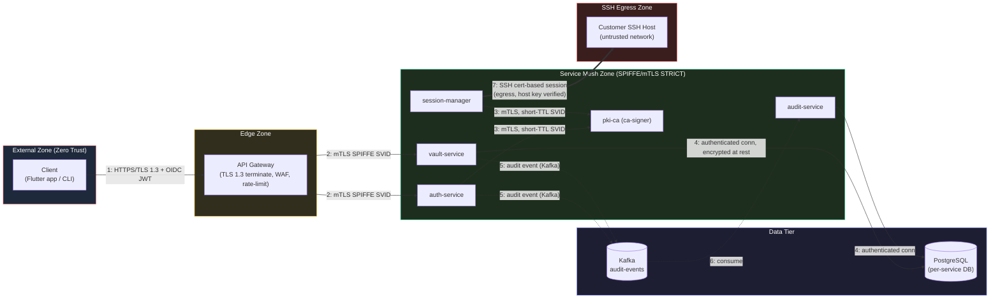
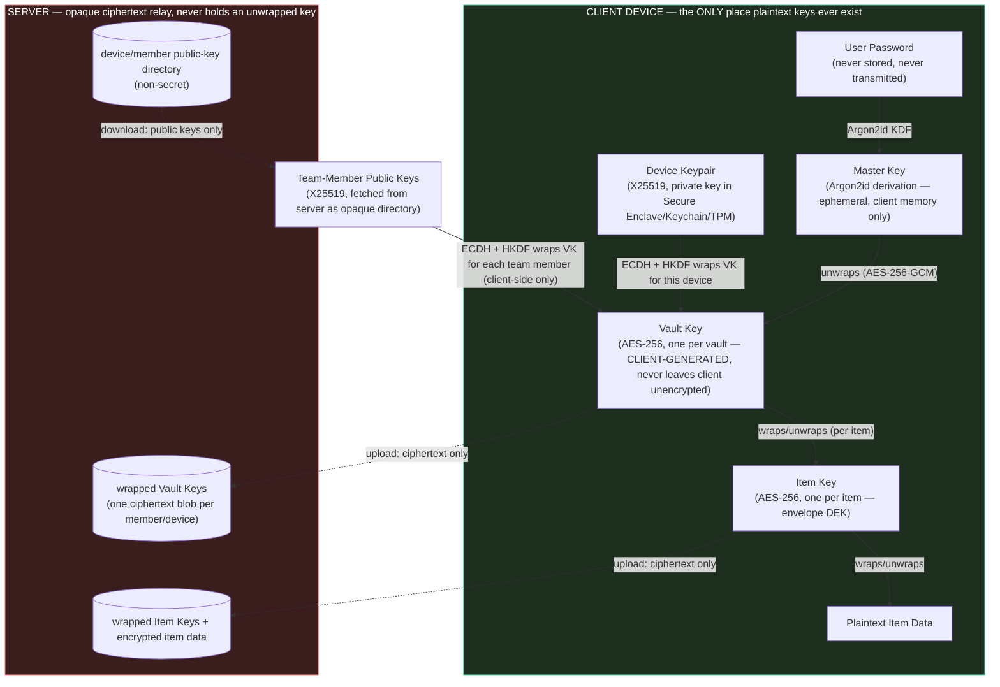

# HelixTerminator Security & Zero Trust Architecture Specification

**Document Version:** 1.0.0  
**Classification:** Internal — Engineering Confidential  
**Effective Date:** 2026-06-28  
**Owner:** Platform Security Team  
**Review Cycle:** Quarterly  
**Trust Domain:** `helixterminator.io`

---

## Table of Contents

1. [Zero Trust Architecture](#1-zero-trust-architecture)
2. [Authentication Architecture](#2-authentication-architecture)
3. [SSH Certificate Authority](#3-ssh-certificate-authority)
4. [Vault Encryption Architecture](#4-vault-encryption-architecture)
5. [SSH Key Management Security](#5-ssh-key-management-security)
6. [RBAC Model](#6-rbac-model)
7. [Audit Logging](#7-audit-logging)
8. [Network Security](#8-network-security)
9. [Compliance](#9-compliance)
10. [Incident Response](#10-incident-response)

---

## Preface

HelixTerminator is an enterprise-grade SSH client platform that processes some of the most sensitive assets in any organization: SSH private keys, server credentials, encrypted vaults containing infrastructure secrets, and live terminal sessions into production systems. A breach of HelixTerminator is not merely a data leak — it is a complete compromise of the infrastructure the product is meant to secure.

This specification establishes the non-negotiable security architecture for every component of the platform. It is designed to be implementation-ready: every architectural decision maps to code, every policy maps to enforceable configuration, every threat maps to a countermeasure.

The overarching security principle is **Zero Trust**: no actor — user, device, workload, or network — is trusted by default. Every access decision is made fresh, based on verified identity, device health, network context, and policy. Trust is never implicit, always explicitly granted, and continuously re-evaluated.

---

## 1. Zero Trust Architecture

### 1.1 Principles and Philosophy

Zero Trust is not a product or a network zone — it is a security model predicated on the assumption that the network perimeter has already been breached. Every request, regardless of origin, is treated as potentially hostile until proven otherwise. The HelixTerminator Zero Trust implementation embodies three foundational axioms:

1. **Never Trust, Always Verify.** Every service-to-service call, every user request, every device connection must present verifiable proof of identity. Network location — being "inside" the VPC — confers no implicit trust.

2. **Assume Breach.** Design all systems assuming an adversary has already established a foothold somewhere in the environment. Lateral movement must be impossible even from a compromised internal service. Each workload sees only what it needs to function.

3. **Least-Privilege Access.** Every identity — user, device, or workload — operates with the minimum permissions required. Permissions are time-bound, scoped to specific resources, and revocable without restart.

### 1.2 Trust Boundaries and Threat Model

HelixTerminator operates across four trust zones, each with strictly enforced boundaries:

| Zone | Description | Trust Level |
|------|-------------|-------------|
| **External** | Public internet, end-user clients | Zero trust — all traffic authenticated |
| **Edge** | API Gateway, CDN, load balancers | Untrusted — terminate TLS, enforce rate limits |
| **Service Mesh** | Internal microservices | mTLS-enforced trust via SPIFFE SVIDs |
| **Data Tier** | Databases, Kafka, Redis | Authenticated connections only, encrypted at rest |

Threat actors modeled in this specification:

- **External attacker**: Internet-based adversary with no credentials
- **Compromised credential**: Legitimate user credentials stolen (phishing, credential stuffing)
- **Compromised service**: An internal microservice running malicious code (supply chain attack)
- **Malicious insider**: A legitimate employee with valid credentials acting outside their authorization
- **Nation-state adversary**: Advanced persistent threat with long time horizons and sophisticated techniques

#### 1.2.1 Trust-Boundary Diagram

Every arrow below crosses a **zero-trust checkpoint** — no data crosses a boundary without independent authentication and authorization at that boundary, regardless of what happened at the previous hop.



Boundary 1 (client↔gateway) and boundary 7 (services↔SSH egress) are the two boundaries that cross an **untrusted network the platform does not control** (the public internet and the customer's infrastructure, respectively); boundaries 2–6 are internal-mesh and rely on SPIFFE/mTLS rather than network location for trust.

#### 1.2.2 STRIDE Threat Model per Trust Boundary

The table below applies the STRIDE categories (Spoofing, Tampering, Repudiation, Information Disclosure, Denial of Service, Elevation of Privilege) to each of the four real trust boundaries traversed by a request, and maps every cell to the concrete control that mitigates it. This is the canonical threat-model reference for the platform; every new service integration MUST re-run this table for its own ingress/egress edges before launch.

| Boundary | STRIDE Category | Concrete Threat | Mitigating Control |
|---|---|---|---|
| **Client ↔ Gateway** | Spoofing | Attacker replays or forges a client session without valid credentials | OIDC JWT (EdDSA/Ed25519, §2.6) + device certificate binding (§1.5.2) + FIDO2/WebAuthn phishing-resistant MFA (§2.3) |
| | Tampering | Request/response body modified in transit (MITM) | TLS 1.3 only (§8.1), HSTS, certificate pinning on mobile (§8.6) |
| | Repudiation | User denies performing an authenticated action | Append-only hash-chained audit log (§7) capturing `actor_id`, `session_id`, `access_token_jti` per event |
| | Information Disclosure | Token or vault ciphertext leaked via logs, error messages, or a misconfigured CORS policy | Structured logging with automatic secret redaction (see `07_api_and_database.md` §14 for the redaction filter), strict CORS allowlist (§8.3), CSP (§8.4) |
| | Denial of Service | Credential-stuffing or volumetric attack against `/v1/auth/login` | Login rate limiting + exponential backoff (§2.1.2), Cloudflare/WAF edge DDoS protection (§8.5) |
| | Elevation of Privilege | Client forges a role claim or replays a stale token after a role downgrade | Roles are server-computed and embedded server-side at token-issuance time (never client-supplied), continuous verification terminates sessions within 60s of a policy change (§1.6) |
| **Gateway ↔ Services** | Spoofing | A rogue pod impersonates `vault-service` inside the cluster | SPIFFE SVIDs (§1.3) — cryptographic workload identity, not IP/hostname-based |
| | Tampering | A compromised sidecar or node modifies inter-service traffic | Istio STRICT mTLS mesh-wide (§1.4.2) — payload integrity is guaranteed by the TLS record layer, not application logic |
| | Repudiation | A service denies having made a privileged call to another service | Envoy access logs carry `source_principal` (SPIFFE URI, §1.4.1) correlated with the audit event emitted by the calling service |
| | Information Disclosure | Lateral movement from a compromised low-privilege service reads data it should not see | Least-privilege `AuthorizationPolicy` per service (§1.4.3) + network micro-segmentation default-deny (§1.7) |
| | Denial of Service | A compromised or buggy service floods a peer with requests | Istio circuit breakers / outlier detection (destination rule, per-service; see `01_core_architecture.md` for the resilience baseline) |
| | Elevation of Privilege | A service calls an API path outside its declared scope (e.g., `vault-service` calling `pki-ca`'s signing endpoint) | `AuthorizationPolicy` allow-lists exact source principals + exact paths per service (§1.4.3); explicit `deny-all` default |
| **Services ↔ Vault** | Spoofing | An attacker-controlled service impersonates a legitimate vault client | Vault ciphertext is opaque to every service except the client that holds the Item/Vault Key (§4) — server-side identity spoofing cannot yield plaintext |
| | Tampering | Ciphertext or wrapped-key blob modified at rest or in transit | AES-256-GCM authenticated encryption (§4.3) — any tamper fails GCM tag verification on decrypt; TLS 1.3 in transit |
| | Repudiation | A team member denies having been granted or revoked vault access | `vault.shared` / `vault.access.revoked` / `vault.key.rotated` audit events (§7.2), each referencing the client-signed re-wrap request (§4.6) |
| | Information Disclosure | The vault-service database or backup is exfiltrated | Zero-knowledge design (§4.1): exfiltrating the server's data yields ciphertext + wrapped keys only, never plaintext or unwrapped keys |
| | Denial of Service | Bulk vault-sync requests exhaust vault-service capacity | Per-org rate limiting at the gateway (§1.4.3 AuthorizationPolicy path scoping) + Kubernetes HPA on `vault-service` |
| | Elevation of Privilege | A revoked team member continues decrypting newly-shared items after removal | Mandatory Vault Key rotation on `RevokeMember` (§4.7) — old wrapped keys are deleted and cannot unwrap post-rotation ciphertext |
| **Services ↔ SSH Egress** | Spoofing | Client connects to an attacker-controlled host impersonating the intended target | SSH host certificates signed by the platform CA (§3.6) — host identity is cryptographically verified, not TOFU |
| | Tampering | An on-path attacker modifies SSH session traffic | SSH transport-layer integrity (RFC 4253) + hardened cipher/MAC allowlist (§8.2) |
| | Repudiation | An operator denies having executed a destructive command on a production host | Full session recording + `session.command.executed` audit events (§7.2), tamper-evident via the hash chain (§7.3) and anchored externally (§7.4) |
| | Information Disclosure | SSH session output containing secrets is captured in recordings or forwarded to the AI-assist path | Secret redaction pipeline before persistence/AI-context handoff (see `07_api_and_database.md` §14) |
| | Denial of Service | A malicious or compromised host holds an SSH connection open to exhaust `session-manager` connection pools | Per-session TTL bound to the SSH certificate lifetime (§1.5.4, max 8h) + idle-session timeout (§1.6 continuous verification) |
| | Elevation of Privilege | A standard `member` obtains a certificate with elevated principals (e.g., `root`) | Certificate issuance API enforces role-to-principal mapping server-side (§3.4) — the client cannot request principals beyond its RBAC grant (§6); break-glass elevation requires two-person approval (§6.5) |

### 1.3 SPIFFE/SPIRE Workload Identity

#### 1.3.1 Overview

SPIFFE (Secure Production Identity Framework for Everyone) provides a universal workload identity standard. Every HelixTerminator workload receives a SPIFFE Verifiable Identity Document (SVID) cryptographically signed by the trust domain root. This eliminates the need for static secrets in service-to-service communication entirely.

**Trust Domain:** `helixterminator.io`

All SPIFFE IDs follow the format:
```
spiffe://helixterminator.io/<service-path>
```

Service identity examples:
```
spiffe://helixterminator.io/ns/default/sa/auth-service
spiffe://helixterminator.io/ns/default/sa/pki-service
spiffe://helixterminator.io/ns/default/sa/vault-service
spiffe://helixterminator.io/ns/default/sa/session-manager
spiffe://helixterminator.io/ns/default/sa/audit-service
spiffe://helixterminator.io/ns/vault/sa/vault-api
spiffe://helixterminator.io/ns/pki/sa/ca-signer
```

#### 1.3.2 SPIRE Server High-Availability Configuration

The SPIRE server is the root of workload identity issuance. It must be highly available, as a SPIRE server outage prevents new SVIDs from being issued and prevents existing SVIDs from rotating, eventually causing service authentication failures.

**Deployment topology:** 3-node SPIRE server cluster with external datastore (PostgreSQL) and distributed KMS (AWS KMS / HashiCorp Vault).

```yaml
# spire-server-config.hcl
server {
  bind_address    = "0.0.0.0"
  bind_port       = "8081"
  trust_domain    = "helixterminator.io"
  data_dir        = "/run/spire/data"
  log_level       = "INFO"
  log_format      = "json"
  
  # CA TTL — SVIDs issued with 24h lifetime
  # Root CA rotates every 365 days, Intermediate every 30 days
  ca_ttl          = "720h"    # 30 days — intermediate CA lifetime
  default_svid_ttl = "1h"    # default SVID TTL (overridable per entry)
  
  # Key management — AWS KMS in production
  key_manager "aws_kms" {
    plugin_data {
      region        = "us-east-1"
      key_policy_file = "/run/spire/key-policy.json"
    }
  }
  
  # External datastore for HA clustering
  data_store "sql" {
    plugin_data {
      database_type       = "postgres"
      connection_string   = "dbname=spire user=spire password=${SPIRE_DB_PASSWORD} host=spire-db.internal sslmode=require"
      max_open_conns      = 20
      max_idle_conns      = 5
      conn_max_lifetime   = "5m"
    }
  }
  
  # Node attestation — Kubernetes PSAT
  NodeAttestor "k8s_psat" {
    plugin_data {
      clusters = {
        "helixterm-prod" = {
          service_account_allow_list    = ["default:spire-agent"]
          audience                      = ["spire-server"]
          allowed_node_label_keys       = []
          allowed_pod_label_keys        = []
          kube_config_file              = ""
          token_path                    = ""
        }
      }
    }
  }

  # Workload attestation — Kubernetes
  WorkloadAttestor "k8s" {
    plugin_data {
      skip_kubelet_verification = false
      node_name_env             = "MY_NODE_NAME"
      max_poll_attempts         = 5
      poll_retry_interval       = "500ms"
    }
  }
  
  # Upstream authority — offline root CA via AWS KMS
  UpstreamAuthority "aws_pca" {
    plugin_data {
      region           = "us-east-1"
      certificate_authority_arn = "arn:aws:acm-pca:us-east-1:123456789:certificate-authority/helixterm-root"
      signing_algorithm = "SHA256WITHRSA"
      ca_signing_template_arn = "arn:aws:acm-pca:::template/SubordinateCACertificate_PathLen1/V1"
      assume_role_arn  = ""
      endpoint         = ""
      supplemental_bundle_path = "/run/spire/upstream-bundle.pem"
    }
  }
  
  # Health checks
  health_checks {
    listener_enabled = true
    bind_address     = "0.0.0.0"
    bind_port        = "8080"
    live_path        = "/live"
    ready_path       = "/ready"
  }
  
  # Federation — allows cross-domain trust (future: partner IdP)
  federation {
    bundle_endpoint {
      address = "0.0.0.0"
      port    = 8443
    }
  }
}
```

**SPIRE Server Kubernetes Deployment:**

```yaml
apiVersion: apps/v1
kind: StatefulSet
metadata:
  name: spire-server
  namespace: spire
spec:
  replicas: 3
  serviceName: spire-server
  selector:
    matchLabels:
      app: spire-server
  template:
    metadata:
      labels:
        app: spire-server
    spec:
      serviceAccountName: spire-server
      # Anti-affinity: spread across availability zones
      affinity:
        podAntiAffinity:
          requiredDuringSchedulingIgnoredDuringExecution:
          - labelSelector:
              matchExpressions:
              - key: app
                operator: In
                values: ["spire-server"]
            topologyKey: topology.kubernetes.io/zone
      containers:
      - name: spire-server
        image: ghcr.io/spiffe/spire-server:1.9.0
        args: ["-config", "/run/spire/config/server.conf"]
        ports:
        - containerPort: 8081
          name: grpc
        - containerPort: 8080
          name: health
        volumeMounts:
        - name: spire-config
          mountPath: /run/spire/config
          readOnly: true
        - name: spire-data
          mountPath: /run/spire/data
        - name: spire-bundle
          mountPath: /run/spire/bundle
        resources:
          requests:
            cpu: 200m
            memory: 256Mi
          limits:
            cpu: 1000m
            memory: 512Mi
        livenessProbe:
          httpGet:
            path: /live
            port: 8080
          initialDelaySeconds: 15
          periodSeconds: 10
        readinessProbe:
          httpGet:
            path: /ready
            port: 8080
          initialDelaySeconds: 5
          periodSeconds: 5
      volumes:
      - name: spire-config
        configMap:
          name: spire-server
      - name: spire-bundle
        emptyDir: {}
  volumeClaimTemplates:
  - metadata:
      name: spire-data
    spec:
      accessModes: ["ReadWriteOnce"]
      storageClassName: gp3-encrypted
      resources:
        requests:
          storage: 1Gi
```

#### 1.3.3 SPIRE Agent DaemonSet

A SPIRE agent runs on every node in the cluster, exposing the Workload API (Unix domain socket) to workloads on that node.

```yaml
apiVersion: apps/v1
kind: DaemonSet
metadata:
  name: spire-agent
  namespace: spire
spec:
  selector:
    matchLabels:
      app: spire-agent
  updateStrategy:
    type: RollingUpdate
    rollingUpdate:
      maxUnavailable: 1
  template:
    metadata:
      labels:
        app: spire-agent
    spec:
      hostPID: true
      hostNetwork: true
      dnsPolicy: ClusterFirstWithHostNet
      serviceAccountName: spire-agent
      initContainers:
      - name: init-wait-for-spire-server
        image: busybox:1.36
        command: ['sh', '-c', 'until nc -z spire-server.spire.svc.cluster.local 8081; do sleep 2; done']
      containers:
      - name: spire-agent
        image: ghcr.io/spiffe/spire-agent:1.9.0
        args: ["-config", "/run/spire/config/agent.conf"]
        volumeMounts:
        - name: spire-config
          mountPath: /run/spire/config
          readOnly: true
        - name: spire-bundle
          mountPath: /run/spire/bundle
          readOnly: true
        - name: spire-agent-socket
          mountPath: /run/spire/sockets
          readOnly: false
        - name: spire-agent-data
          mountPath: /run/spire/data
        - name: hostpid
          mountPath: /host/proc
          readOnly: true
        env:
        - name: MY_NODE_NAME
          valueFrom:
            fieldRef:
              fieldPath: spec.nodeName
        resources:
          requests:
            cpu: 50m
            memory: 64Mi
          limits:
            cpu: 200m
            memory: 128Mi
      volumes:
      - name: spire-config
        configMap:
          name: spire-agent
      - name: spire-bundle
        configMap:
          name: spire-bundle
      - name: spire-agent-socket
        hostPath:
          path: /run/spire/sockets
          type: DirectoryOrCreate
      - name: spire-agent-data
        hostPath:
          path: /run/spire/agent-data
          type: DirectoryOrCreate
      - name: hostpid
        hostPath:
          path: /proc
```

**SPIRE Agent Configuration:**

```hcl
# spire-agent.hcl
agent {
  data_dir       = "/run/spire/data"
  log_level      = "INFO"
  log_format     = "json"
  trust_domain   = "helixterminator.io"
  server_address = "spire-server.spire.svc.cluster.local"
  server_port    = "8081"
  socket_path    = "/run/spire/sockets/agent.sock"
  
  # Trust bundle from SPIRE server bootstrap
  trust_bundle_path  = "/run/spire/bundle/bundle.crt"
  
  insecure_bootstrap = false
  
  NodeAttestor "k8s_psat" {
    plugin_data {
      cluster        = "helixterm-prod"
      token_path     = "/var/run/secrets/tokens/spire-agent"
    }
  }
  
  WorkloadAttestor "k8s" {
    plugin_data {
      node_name_env          = "MY_NODE_NAME"
      skip_kubelet_verification = false
      max_poll_attempts      = 5
      poll_retry_interval    = "500ms"
    }
  }
  
  KeyManager "memory" {
    plugin_data {}
  }
  
  health_checks {
    listener_enabled = true
    bind_address     = "127.0.0.1"
    bind_port        = "8080"
    live_path        = "/live"
    ready_path       = "/ready"
  }
}
```

#### 1.3.4 SVID Registration Entries

Registration entries map workload attestation selectors to SPIFFE IDs:

```bash
# Register auth-service
spire-server entry create \
  -spiffeID spiffe://helixterminator.io/ns/default/sa/auth-service \
  -parentID spiffe://helixterminator.io/spire/agent/k8s_psat/helixterm-prod/NODE_ID \
  -selector k8s:ns:default \
  -selector k8s:sa:auth-service \
  -selector k8s:pod-label:app:auth-service \
  -ttl 3600

# Register vault-service
spire-server entry create \
  -spiffeID spiffe://helixterminator.io/ns/vault/sa/vault-api \
  -parentID spiffe://helixterminator.io/spire/agent/k8s_psat/helixterm-prod/NODE_ID \
  -selector k8s:ns:vault \
  -selector k8s:sa:vault-service \
  -selector k8s:pod-label:app:vault-service \
  -ttl 3600

# Register PKI CA service (higher privilege — shorter TTL)
spire-server entry create \
  -spiffeID spiffe://helixterminator.io/ns/pki/sa/ca-signer \
  -parentID spiffe://helixterminator.io/spire/agent/k8s_psat/helixterm-prod/NODE_ID \
  -selector k8s:ns:pki \
  -selector k8s:sa:pki-ca-signer \
  -selector k8s:pod-label:app:pki-ca \
  -ttl 1800
```

#### 1.3.5 SVID Rotation

SVIDs are short-lived (1 hour TTL) and rotated automatically by the SPIRE agent. The Go SDK for SVID rotation in HelixTerminator services:

```go
// pkg/identity/workload.go
package identity

import (
	"context"
	"crypto/tls"
	"crypto/x509"
	"fmt"
	"sync"

	"github.com/spiffe/go-spiffe/v2/spiffeid"
	"github.com/spiffe/go-spiffe/v2/spiffetls/tlsconfig"
	"github.com/spiffe/go-spiffe/v2/workloadapi"
)

const workloadAPISocket = "unix:///run/spire/sockets/agent.sock"

// WorkloadIdentity manages the SPIFFE workload identity for this service.
type WorkloadIdentity struct {
	mu     sync.RWMutex
	source *workloadapi.X509Source
}

// NewWorkloadIdentity creates a new workload identity manager, connecting to
// the SPIRE agent Workload API and watching for SVID rotations.
func NewWorkloadIdentity(ctx context.Context) (*WorkloadIdentity, error) {
	source, err := workloadapi.NewX509Source(
		ctx,
		workloadapi.WithClientOptions(
			workloadapi.WithAddr(workloadAPISocket),
		),
	)
	if err != nil {
		return nil, fmt.Errorf("failed to create X.509 source: %w", err)
	}
	return &WorkloadIdentity{source: source}, nil
}

// ServerTLSConfig returns a *tls.Config for use as a TLS server, enforcing
// mTLS with SPIFFE peer authentication. Only peers from the helixterminator.io
// trust domain are accepted.
func (w *WorkloadIdentity) ServerTLSConfig() *tls.Config {
	trustDomain := spiffeid.RequireTrustDomainFromString("helixterminator.io")
	return tlsconfig.MTLSServerConfig(w.source, w.source, tlsconfig.AuthorizeMemberOf(trustDomain))
}

// ClientTLSConfig returns a *tls.Config for connecting to a specific peer SPIFFE ID.
func (w *WorkloadIdentity) ClientTLSConfig(peerID spiffeid.ID) *tls.Config {
	return tlsconfig.MTLSClientConfig(w.source, w.source, tlsconfig.AuthorizeID(peerID))
}

// SVID returns the current SVID certificate and key.
func (w *WorkloadIdentity) SVID() (*tls.Certificate, error) {
	svids, err := w.source.GetX509SVIDs()
	if err != nil {
		return nil, fmt.Errorf("failed to get X.509 SVIDs: %w", err)
	}
	if len(svids) == 0 {
		return nil, fmt.Errorf("no SVIDs available")
	}
	return svids[0].Leaf, nil
}

// Close shuts down the SVID watcher.
func (w *WorkloadIdentity) Close() error {
	return w.source.Close()
}

// ValidatePeer validates that an incoming connection's peer certificate
// has the expected SPIFFE ID.
func ValidatePeer(cert *x509.Certificate, expectedID spiffeid.ID) error {
	ids, err := x509svid.IDsFromCert(cert)
	if err != nil {
		return fmt.Errorf("failed to extract SPIFFE IDs from cert: %w", err)
	}
	for _, id := range ids {
		if id == expectedID {
			return nil
		}
	}
	return fmt.Errorf("peer SPIFFE ID not authorized: expected %s", expectedID)
}
```

### 1.4 Mutual TLS (mTLS) via Istio Service Mesh

#### 1.4.1 Istio Installation and Configuration

HelixTerminator uses Istio as the service mesh layer, enforcing mTLS between all services. Istio integrates with SPIRE via the SPIFFE CSI driver for certificate provisioning.

```yaml
# istio-operator-config.yaml
apiVersion: install.istio.io/v1alpha1
kind: IstioOperator
metadata:
  name: helixterm-istio
  namespace: istio-system
spec:
  profile: production
  meshConfig:
    defaultConfig:
      proxyMetadata:
        SPIFFE_ENDPOINT_SOCKET: unix:///run/spire/sockets/agent.sock
    # Enforce mTLS mesh-wide
    enableAutoMtls: true
    # Outbound traffic policy — block any unknown host
    outboundTrafficPolicy:
      mode: REGISTRY_ONLY
    # Access logging to stdout (structured JSON)
    accessLogFile: /dev/stdout
    accessLogFormat: |
      {
        "timestamp": "%START_TIME%",
        "method": "%REQ(:METHOD)%",
        "path": "%REQ(X-ENVOY-ORIGINAL-PATH?:PATH)%",
        "protocol": "%PROTOCOL%",
        "response_code": "%RESPONSE_CODE%",
        "response_flags": "%RESPONSE_FLAGS%",
        "bytes_received": "%BYTES_RECEIVED%",
        "bytes_sent": "%BYTES_SENT%",
        "duration_ms": "%DURATION%",
        "upstream_service_time": "%RESP(X-ENVOY-UPSTREAM-SERVICE-TIME)%",
        "x_forwarded_for": "%REQ(X-FORWARDED-FOR)%",
        "user_agent": "%REQ(USER-AGENT)%",
        "request_id": "%REQ(X-REQUEST-ID)%",
        "authority": "%REQ(:AUTHORITY)%",
        "upstream_host": "%UPSTREAM_HOST%",
        "source_principal": "%CONNECTION_MTLS_PEER_SAN_URI_SANS%"
      }
    # Tracing (Jaeger)
    tracing:
      zipkin:
        address: jaeger-collector.observability:9411
      sampling: 10.0
  components:
    pilot:
      k8s:
        hpaSpec:
          minReplicas: 2
          maxReplicas: 5
    ingressGateways:
    - name: istio-ingressgateway
      enabled: true
      k8s:
        hpaSpec:
          minReplicas: 3
          maxReplicas: 10
        service:
          type: LoadBalancer
          ports:
          - port: 443
            targetPort: 8443
            name: https
          - port: 15443
            targetPort: 15443
            name: tls
```

#### 1.4.2 PeerAuthentication — STRICT mTLS

All namespaces enforce `STRICT` mTLS — no plaintext traffic is accepted:

```yaml
# Base policy — apply to the entire mesh
apiVersion: security.istio.io/v1beta1
kind: PeerAuthentication
metadata:
  name: default
  namespace: istio-system
spec:
  mtls:
    mode: STRICT
---
# Namespace-specific policies (belt and suspenders)
apiVersion: security.istio.io/v1beta1
kind: PeerAuthentication
metadata:
  name: default
  namespace: default
spec:
  mtls:
    mode: STRICT
---
apiVersion: security.istio.io/v1beta1
kind: PeerAuthentication
metadata:
  name: default
  namespace: vault
spec:
  mtls:
    mode: STRICT
---
apiVersion: security.istio.io/v1beta1
kind: PeerAuthentication
metadata:
  name: default
  namespace: pki
spec:
  mtls:
    mode: STRICT
---
apiVersion: security.istio.io/v1beta1
kind: PeerAuthentication
metadata:
  name: default
  namespace: audit
spec:
  mtls:
    mode: STRICT
```

#### 1.4.3 AuthorizationPolicy — Least-Privilege per Service

Each service declares the exact source principals allowed to call it:

```yaml
# auth-service: only the API gateway and internal services may call it
apiVersion: security.istio.io/v1beta1
kind: AuthorizationPolicy
metadata:
  name: auth-service-authz
  namespace: default
spec:
  selector:
    matchLabels:
      app: auth-service
  action: ALLOW
  rules:
  - from:
    - source:
        principals:
          - "cluster.local/ns/istio-system/sa/istio-ingressgateway-service-account"
          - "spiffe://helixterminator.io/ns/default/sa/api-gateway"
    to:
    - operation:
        methods: ["POST", "GET"]
        paths:
          - "/v1/auth/*"
          - "/v1/token/*"
          - "/health"
---
# vault-service: only auth-service, API gateway, and sync service
apiVersion: security.istio.io/v1beta1
kind: AuthorizationPolicy
metadata:
  name: vault-service-authz
  namespace: vault
spec:
  selector:
    matchLabels:
      app: vault-service
  action: ALLOW
  rules:
  - from:
    - source:
        principals:
          - "spiffe://helixterminator.io/ns/default/sa/api-gateway"
          - "spiffe://helixterminator.io/ns/default/sa/auth-service"
          - "spiffe://helixterminator.io/ns/vault/sa/sync-service"
    to:
    - operation:
        methods: ["GET", "POST", "PUT", "DELETE", "PATCH"]
        paths:
          - "/v1/vaults/*"
          - "/v1/items/*"
---
# PKI CA: only auth-service and session-manager may request certificates
apiVersion: security.istio.io/v1beta1
kind: AuthorizationPolicy
metadata:
  name: pki-ca-authz
  namespace: pki
spec:
  selector:
    matchLabels:
      app: pki-ca
  action: ALLOW
  rules:
  - from:
    - source:
        principals:
          - "spiffe://helixterminator.io/ns/default/sa/auth-service"
          - "spiffe://helixterminator.io/ns/default/sa/session-manager"
    to:
    - operation:
        methods: ["POST"]
        paths:
          - "/v1/sign/user"
          - "/v1/sign/host"
---
# Deny-all default: all namespaces have an explicit deny-all that
# the above ALLOW rules selectively override.
apiVersion: security.istio.io/v1beta1
kind: AuthorizationPolicy
metadata:
  name: deny-all
  namespace: default
spec: {}   # Empty spec = deny all traffic
```

#### 1.4.4 Certificate Rotation — 24-Hour TTL

Istio certificates (used for the sidecar proxy mTLS) are configured for 24-hour TTL with automatic rotation:

```yaml
apiVersion: v1
kind: ConfigMap
metadata:
  name: istio
  namespace: istio-system
data:
  mesh: |
    defaultConfig:
      # Certificate lifetime for workload certificates
      proxyMetadata:
        SECRET_TTL: "24h"
        SECRET_GRACE_PERIOD_RATIO: "0.5"   # Rotate at 12h (50% of TTL)
```

The SPIRE-issued SVIDs (1h TTL) rotate more aggressively than Istio's internal certificates. In production, all service-to-service TLS uses SPIRE-issued SVIDs through the SPIFFE CSI driver.

### 1.5 Identity Hierarchy

HelixTerminator recognizes four distinct identity types, each with different trust characteristics and lifecycle properties:

#### 1.5.1 User Identity (OIDC JWT)

Issued upon successful authentication. Bound to a human user.

```
Identity attributes:
  sub:     Stable user UUID (never changes, even after email change)
  email:   User email (mutable, used for display only)
  org_id:  Organization UUID
  teams:   []string — team UUIDs the user belongs to
  roles:   []string — effective roles (computed from RBAC)
  amr:     []string — authentication methods used (pwd, otp, hwk)
  acr:     string   — authentication context class reference
  device_id: UUID of the authenticated device
```

**Lifetime:** Access token 15 minutes, refresh token 30 days (rotating).

**Binding:** Tied to a device and session. Cross-device re-authentication required.

#### 1.5.2 Device Identity (Device Certificate)

Issued upon successful device enrollment. Bound to a specific device instance.

```
Device Certificate fields:
  Subject:    CN=<device-uuid>, O=HelixTerminator, OU=<org-id>
  SAN:        URI: spiffe://helixterminator.io/device/<device-uuid>
              URI: spiffe://helixterminator.io/org/<org-id>/device/<device-uuid>
  Extensions:
    DeviceOS:        macOS 14.5 / Windows 11 / Linux (kernel 6.x)
    DeviceName:      User-assigned friendly name
    EnrollmentDate:  ISO 8601 timestamp
    Compliance:      boolean (MDM-reported)
  TTL:        90 days
  Issuer:     HelixTerminator Device CA
```

Device certificates are stored in the platform's secure enclave (macOS Keychain / Windows CNG / Linux TPM) and are non-exportable. The private key never leaves the device.

#### 1.5.3 Workload Identity (SPIFFE SVID)

Issued by SPIRE to each service instance. Machine-to-machine only.

```
SVID fields:
  Subject:      SPIFFE URI SAN
  SAN:          URI: spiffe://helixterminator.io/ns/<ns>/sa/<service>
  Not Before:   issuance time
  Not After:    issuance time + TTL (1h)
  Issuer:       CN=SPIRE Intermediate CA, O=helixterminator.io
  Key Usage:    Digital Signature, Key Encipherment
  Extended KU:  TLS Web Client Authentication, TLS Web Server Authentication
```

#### 1.5.4 Session Identity (Short-Lived Session Token)

Issued when a user starts an SSH session. Ties together user, device, and target host.

```json
{
  "session_id": "sess_01HQZ7VBKF2MXKPTCG4N5Y8R3D",
  "user_id":    "usr_01HQZ7VBKF2MXKPTCG4N5Y8R00",
  "device_id":  "dev_01HQZ7VBKF2MXKPTCG4N5Y8R01",
  "host_id":    "host_01HQZ7VBKF2MXKPTCG4N5Y8R02",
  "org_id":     "org_01HQZ7VBKF2MXKPTCG4N5Y8R03",
  "issued_at":  "2026-06-28T17:00:00Z",
  "expires_at": "2026-06-29T01:00:00Z",
  "cert_serial": "7F3A9C2E1B4D5F6A8C0E",
  "recording_required": true,
  "approval_id": null,
  "ttl": 28800
}
```

**Lifetime:** Matches the SSH certificate TTL (8 hours for standard user sessions, configurable down to 30 minutes for high-privilege access).

### 1.6 Continuous Verification

Zero Trust requires that authentication is not a one-time event at login. HelixTerminator implements continuous verification across the following triggers:

| Trigger | Action |
|---------|--------|
| **Policy change** (RBAC update, org policy change) | All active sessions validated against new policy within 60 seconds; non-compliant sessions terminated |
| **Device compliance failure** (MDM reports non-compliant) | All sessions from that device invalidated immediately; refresh tokens revoked |
| **IP reputation change** (UEBA flags anomalous location) | Step-up authentication required before next action |
| **Credential compromise signal** (HaveIBeenPwned, threat intelligence) | Forced password reset; all refresh tokens revoked |
| **Inactivity timeout** | Access token re-validation required after 30 minutes of inactivity |
| **Time-based policy** (access window expires) | Session terminated; SSH certificate revoked via CRL update |
| **Failed MFA** (3 consecutive failures) | Account temporarily locked (30 minutes); admin notified |

The continuous verification subsystem is implemented as a policy evaluation service that subscribes to policy change events via Kafka and evaluates active sessions:

```go
// pkg/continuousverify/verifier.go
package continuousverify

import (
	"context"
	"sync"
	"time"

	"github.com/helixterm/platform/pkg/session"
	"github.com/helixterm/platform/pkg/policy"
	"github.com/helixterm/platform/pkg/audit"
	"go.uber.org/zap"
)

// Verifier continuously evaluates active sessions against current policy.
type Verifier struct {
	sessions   session.Store
	policies   policy.Engine
	auditor    audit.Logger
	log        *zap.Logger
	mu         sync.Mutex
}

// OnPolicyChange is called when any policy changes. It evaluates all active
// sessions against the new policy and terminates those that are no longer
// authorized.
func (v *Verifier) OnPolicyChange(ctx context.Context, event policy.ChangeEvent) error {
	sessions, err := v.sessions.ActiveSessions(ctx)
	if err != nil {
		return err
	}

	for _, sess := range sessions {
		allowed, reason, err := v.policies.Evaluate(ctx, policy.Request{
			Subject:   sess.UserID,
			Resource:  policy.Resource{Type: "session", ID: sess.SessionID},
			Action:    "maintain",
			Context: policy.Context{
				DeviceID:  sess.DeviceID,
				IPAddress: sess.RemoteAddr,
				Time:      time.Now(),
			},
		})
		if err != nil {
			v.log.Error("policy evaluation failed", zap.Error(err), zap.String("session_id", sess.SessionID))
			continue
		}
		if !allowed {
			v.log.Warn("terminating session due to policy change",
				zap.String("session_id", sess.SessionID),
				zap.String("user_id", sess.UserID),
				zap.String("reason", reason),
			)
			if err := v.sessions.Terminate(ctx, sess.SessionID, reason); err != nil {
				v.log.Error("failed to terminate session", zap.Error(err))
			}
			v.auditor.Log(ctx, audit.Event{
				Type:      audit.EventSessionTerminatedByPolicy,
				SessionID: sess.SessionID,
				UserID:    sess.UserID,
				Reason:    reason,
			})
		}
	}
	return nil
}
```

### 1.7 Network Micro-Segmentation

Every service is isolated in its own Kubernetes namespace with a default-deny NetworkPolicy. Egress is explicitly allowed only to known service endpoints.

```yaml
# Default deny all ingress and egress for all pods in a namespace
apiVersion: networking.k8s.io/v1
kind: NetworkPolicy
metadata:
  name: default-deny-all
  namespace: vault
spec:
  podSelector: {}
  policyTypes:
  - Ingress
  - Egress
---
# vault-service: allow ingress from the service mesh only (via sidecar)
# and egress to its database and the audit service
apiVersion: networking.k8s.io/v1
kind: NetworkPolicy
metadata:
  name: vault-service-netpol
  namespace: vault
spec:
  podSelector:
    matchLabels:
      app: vault-service
  policyTypes:
  - Ingress
  - Egress
  ingress:
  - from:
    - namespaceSelector:
        matchLabels:
          istio-injection: enabled
    ports:
    - protocol: TCP
      port: 8080
  egress:
  # Vault PostgreSQL
  - to:
    - namespaceSelector:
        matchLabels:
          name: data
    ports:
    - protocol: TCP
      port: 5432
  # Audit service
  - to:
    - namespaceSelector:
        matchLabels:
          name: audit
    ports:
    - protocol: TCP
      port: 9090
  # DNS
  - to:
    - namespaceSelector: {}
    ports:
    - protocol: UDP
      port: 53
  # SPIRE agent socket (localhost)
  - to:
    - podSelector:
        matchLabels:
          app: spire-agent
    ports:
    - protocol: TCP
      port: 8081
```

---

## 2. Authentication Architecture

### 2.1 Email + Password Authentication

#### 2.1.1 Password Hashing — Argon2id

All passwords are hashed using **Argon2id** (RFC 9106), the winner of the Password Hashing Competition and the current best-practice recommendation for password storage.

**Parameters:**
- Algorithm: Argon2id
- Time (iterations): 3
- Memory: 65,536 KiB (64 MB)
- Parallelism: 4 threads
- Output length: 32 bytes
- Salt: 16 bytes (crypto/rand)

These parameters meet the OWASP recommendation and are calibrated to take approximately 500ms–1s on modern server hardware, making brute-force attacks prohibitively expensive.

```go
// pkg/auth/password.go
package auth

import (
	"crypto/rand"
	"crypto/subtle"
	"encoding/base64"
	"fmt"
	"strings"

	"golang.org/x/crypto/argon2"
)

const (
	argon2Time    = 3
	argon2Memory  = 64 * 1024  // 64 MB
	argon2Threads = 4
	argon2KeyLen  = 32
	argon2SaltLen = 16
)

// HashPassword hashes the given password using Argon2id and returns a
// PHC-formatted string suitable for storage.
func HashPassword(password string) (string, error) {
	salt := make([]byte, argon2SaltLen)
	if _, err := rand.Read(salt); err != nil {
		return "", fmt.Errorf("failed to generate salt: %w", err)
	}

	hash := argon2.IDKey(
		[]byte(password),
		salt,
		argon2Time,
		argon2Memory,
		argon2Threads,
		argon2KeyLen,
	)

	// PHC format: $argon2id$v=19$m=65536,t=3,p=4$<salt>$<hash>
	return fmt.Sprintf(
		"$argon2id$v=%d$m=%d,t=%d,p=%d$%s$%s",
		argon2.Version,
		argon2Memory,
		argon2Time,
		argon2Threads,
		base64.RawStdEncoding.EncodeToString(salt),
		base64.RawStdEncoding.EncodeToString(hash),
	), nil
}

// VerifyPassword verifies a plaintext password against a PHC-formatted Argon2id hash.
// Uses constant-time comparison to prevent timing attacks.
func VerifyPassword(password, encoded string) (bool, error) {
	params, salt, hash, err := parseArgon2Hash(encoded)
	if err != nil {
		return false, err
	}

	computed := argon2.IDKey(
		[]byte(password),
		salt,
		params.time,
		params.memory,
		params.threads,
		params.keyLen,
	)

	// Constant-time comparison — prevents timing oracle attacks
	return subtle.ConstantTimeCompare(hash, computed) == 1, nil
}

type argon2Params struct {
	time, memory uint32
	threads       uint8
	keyLen        uint32
}

func parseArgon2Hash(encoded string) (*argon2Params, []byte, []byte, error) {
	parts := strings.Split(encoded, "$")
	if len(parts) != 6 {
		return nil, nil, nil, fmt.Errorf("invalid hash format: expected 6 parts, got %d", len(parts))
	}

	var version int
	if _, err := fmt.Sscanf(parts[2], "v=%d", &version); err != nil {
		return nil, nil, nil, fmt.Errorf("invalid version: %w", err)
	}
	if version != argon2.Version {
		return nil, nil, nil, fmt.Errorf("unsupported argon2 version: %d", version)
	}

	var params argon2Params
	if _, err := fmt.Sscanf(parts[3], "m=%d,t=%d,p=%d", &params.memory, &params.time, &params.threads); err != nil {
		return nil, nil, nil, fmt.Errorf("invalid parameters: %w", err)
	}

	salt, err := base64.RawStdEncoding.DecodeString(parts[4])
	if err != nil {
		return nil, nil, nil, fmt.Errorf("invalid salt: %w", err)
	}

	hash, err := base64.RawStdEncoding.DecodeString(parts[5])
	if err != nil {
		return nil, nil, nil, fmt.Errorf("invalid hash: %w", err)
	}

	params.keyLen = uint32(len(hash))
	return &params, salt, hash, nil
}
```

#### 2.1.2 Login Flow

```
Client                     API Gateway            Auth Service         Database
  |                              |                      |                  |
  |-- POST /v1/auth/login ------>|                      |                  |
  |   {email, password,          |                      |                  |
  |    device_id, client_info}   |                      |                  |
  |                              |-- mTLS + AuthN ----->|                  |
  |                              |                      |-- lookup user --->|
  |                              |                      |<-- user record ---|
  |                              |                      |                  |
  |                              |                      |-- verify Argon2id |
  |                              |                      |   hash (500ms)    |
  |                              |                      |                  |
  |                              |                      |-- check lockout --|
  |                              |                      |                  |
  |<-- 200 {mfa_required: true}--|<-- mfa_challenge ----|                  |
  |    {challenge_id, methods}   |                      |                  |
  |                              |                      |                  |
  |-- POST /v1/auth/mfa -------->|                      |                  |
  |   {challenge_id, totp_code}  |-- mTLS ------------->|                  |
  |                              |                      |-- verify TOTP ----|
  |                              |                      |                  |
  |<-- 200 {access_token,        |<-- tokens ------------|                  |
  |         refresh_token,       |                      |                  |
  |         device_token}        |                      |                  |
```

**Login rate limiting:**
- 5 failed attempts per 15 minutes per IP → temporary block
- 10 failed attempts per 24 hours per account → account lock + admin alert
- Exponential backoff response: 200ms → 400ms → 800ms → 1600ms

### 2.2 TOTP Authentication (RFC 6238)

#### 2.2.1 TOTP Implementation

```go
// pkg/auth/totp.go
package auth

import (
	"crypto/hmac"
	"crypto/rand"
	"crypto/sha1"
	"encoding/base32"
	"encoding/binary"
	"fmt"
	"math"
	"time"
)

const (
	totpWindow  = 1    // ±1 step tolerance (allows for clock drift)
	totpDigits  = 6
	totpStep    = 30   // seconds per TOTP step
	secretBytes = 20   // 160-bit TOTP secret
)

// GenerateTOTPSecret generates a new cryptographically random TOTP secret.
func GenerateTOTPSecret() (string, error) {
	secret := make([]byte, secretBytes)
	if _, err := rand.Read(secret); err != nil {
		return "", fmt.Errorf("failed to generate TOTP secret: %w", err)
	}
	return base32.StdEncoding.EncodeToString(secret), nil
}

// TOTPProvisioningURI returns the provisioning URI for authenticator apps.
func TOTPProvisioningURI(secret, account, issuer string) string {
	return fmt.Sprintf(
		"otpauth://totp/%s:%s?secret=%s&issuer=%s&algorithm=SHA1&digits=6&period=30",
		issuer, account, secret, issuer,
	)
}

// VerifyTOTP verifies a TOTP code against the given secret, allowing for
// ±1 step drift to compensate for clock skew.
func VerifyTOTP(secret, code string) (bool, error) {
	decoded, err := base32.StdEncoding.DecodeString(secret)
	if err != nil {
		return false, fmt.Errorf("invalid TOTP secret encoding: %w", err)
	}

	counter := time.Now().Unix() / int64(totpStep)

	for offset := -totpWindow; offset <= totpWindow; offset++ {
		expected := generateHOTP(decoded, uint64(counter+int64(offset)), totpDigits)
		if expected == code {
			return true, nil
		}
	}
	return false, nil
}

// generateHOTP generates an HMAC-based OTP per RFC 4226.
func generateHOTP(secret []byte, counter uint64, digits int) string {
	// Step 1: Generate HMAC-SHA1
	msg := make([]byte, 8)
	binary.BigEndian.PutUint64(msg, counter)

	mac := hmac.New(sha1.New, secret)
	mac.Write(msg)
	h := mac.Sum(nil)

	// Step 2: Dynamic truncation
	offset := h[len(h)-1] & 0x0f
	code := (uint32(h[offset]&0x7f) << 24) |
		(uint32(h[offset+1]) << 16) |
		(uint32(h[offset+2]) << 8) |
		uint32(h[offset+3])

	// Step 3: Compute OTP
	otp := code % uint32(math.Pow10(digits))
	return fmt.Sprintf("%0*d", digits, otp)
}
```

**TOTP Backup Codes:**
- 10 single-use backup codes, 10 characters each
- Stored as Argon2id hashes (same parameters as password hashing)
- Each code invalidated after single use
- User must re-generate all codes at once (regeneration invalidates remaining codes)

### 2.3 FIDO2/WebAuthn

#### 2.3.1 Architecture Overview

FIDO2 is the strongest authentication factor supported by HelixTerminator. It is:
- **Phishing-resistant**: the challenge is cryptographically bound to the origin (`app.helixterminator.io`), preventing replay across origins
- **Credential-bound**: the private key never leaves the authenticator
- **Biometric capable**: supports platform authenticators (TouchID, FaceID, Windows Hello) and roaming authenticators (YubiKey)

**Relying Party configuration:**
```json
{
  "rpId": "helixterminator.io",
  "rpName": "HelixTerminator",
  "origin": "https://app.helixterminator.io",
  "attestationConveyancePreference": "direct",
  "authenticatorSelection": {
    "authenticatorAttachment": "cross-platform",
    "requireResidentKey": true,
    "residentKey": "preferred",
    "userVerification": "required"
  },
  "timeout": 120000
}
```

#### 2.3.2 WebAuthn Registration Flow

```
Client (Browser/App)              API Backend                    Database
      |                                |                              |
      |-- POST /v1/webauthn/register   |                              |
      |   {userId, deviceName} ------->|                              |
      |                                |-- generate challenge -------->|
      |                                |<-- challenge stored ----------|
      |<-- 200 {                       |                              |
      |    challenge,                  |                              |
      |    rpId: "helixterminator.io", |                              |
      |    userId,                     |                              |
      |    excludeCredentials: [...]   |                              |
      |   } ---------------------------|                              |
      |                                |                              |
      |-- [User performs biometric     |                              |
      |    or YubiKey touch]           |                              |
      |-- Authenticator creates        |                              |
      |   key pair, signs clientData   |                              |
      |                                |                              |
      |-- POST /v1/webauthn/register/complete                         |
      |   {                            |                              |
      |    id: credentialId,           |                              |
      |    rawId: ...,                 |                              |
      |    response: {                 |                              |
      |      attestationObject,        |                              |
      |      clientDataJSON           |                              |
      |    },                          |                              |
      |    type: "public-key"          |                              |
      |   } -------------------------->|                              |
      |                                |-- verify attestation -------->|
      |                                |   1. Check challenge matches  |
      |                                |   2. Verify origin bound      |
      |                                |   3. Verify user presence     |
      |                                |   4. Verify user verification |
      |                                |   5. Parse CBOR attestation   |
      |                                |   6. Verify attestation stmt  |
      |                                |   7. Extract public key       |
      |                                |-- store credential ---------->|
      |<-- 200 {credentialId, backed   |<-- stored --------------------|
      |         up: true/false}        |                              |
```

#### 2.3.3 WebAuthn Authentication Flow

```
Client (Browser/App)              API Backend                    Database
      |                                |                              |
      |-- POST /v1/webauthn/authenticate/begin                        |
      |   {userId or null for         |                              |
      |    discoverable credential}    |                              |
      |   {userVerification: required} |                              |
      |                                |                              |
      |<-- 200 {                       |                              |
      |    challenge,                  |                              |
      |    timeout: 120000,            |                              |
      |    rpId: "helixterminator.io", |                              |
      |    allowCredentials: [...]     |                              |
      |   }                            |                              |
      |                                |                              |
      |-- [User biometric/touch]        |                              |
      |-- Authenticator signs          |                              |
      |   authenticatorData + hash(    |                              |
      |   clientDataJSON) with privkey |                              |
      |                                |                              |
      |-- POST /v1/webauthn/authenticate/complete                     |
      |   {                            |                              |
      |    id: credentialId,           |                              |
      |    response: {                 |                              |
      |      authenticatorData,        |                              |
      |      clientDataJSON,           |                              |
      |      signature,                |                              |
      |      userHandle               |                              |
      |    }                           |                              |
      |   }                            |                              |
      |                               |                              |
      |                                |-- lookup credential --------->|
      |                                |<-- credential (pubkey, cntr) -|
      |                                |-- verify:                     |
      |                                |   1. rpIdHash matches         |
      |                                |   2. UP flag set              |
      |                                |   3. UV flag set (required)   |
      |                                |   4. signCount > stored       |
      |                                |   5. signature over           |
      |                                |      authData || hash(cdj)    |
      |                                |   6. verify with stored pubkey|
      |                                |-- update signCount ---------->|
      |<-- 200 {access_token,          |                              |
      |         refresh_token}         |                              |
```

#### 2.3.4 Resident Keys (Discoverable Credentials)

HelixTerminator supports WebAuthn resident keys (FIDO2 discoverable credentials), which allow passwordless login without first entering an email address:

```go
// pkg/auth/webauthn.go
package auth

import (
	"github.com/go-webauthn/webauthn/webauthn"
)

var WebAuthnConfig = &webauthn.Config{
	RPDisplayName: "HelixTerminator",
	RPID:          "helixterminator.io",
	RPOrigins:     []string{"https://app.helixterminator.io"},
	
	// Attestation: "direct" to verify authenticator model for enterprise
	// policy enforcement (e.g., require YubiKey 5 series)
	AttestationPreference: "direct",
	
	// Timeout: 2 minutes to accommodate slow hardware tokens
	Timeouts: webauthn.TimeoutsConfig{
		Login: webauthn.TimeoutConfig{
			Enforce:   true,
			Timeout:   120000,
		},
		Registration: webauthn.TimeoutConfig{
			Enforce:   true,
			Timeout:   120000,
		},
	},
}
```

**Supported authenticators:**
- YubiKey 5 series (NFC, USB-A, USB-C, Nano)
- Apple Touch ID / Face ID (platform authenticator, macOS/iOS)
- Windows Hello (Face, Fingerprint, PIN — platform authenticator)
- Google Titan Security Keys
- Any FIDO2-compliant authenticator

### 2.4 Push Notifications (Duo Security Integration)

For organizations that have deployed Duo Security, HelixTerminator integrates the Duo Auth API for push-based MFA.

```go
// pkg/auth/duo.go
package auth

import (
	"context"
	"fmt"
	"net/http"
	"time"

	duoapi "github.com/duosecurity/duo_api_golang"
)

type DuoClient struct {
	api *duoapi.DuoApi
}

func NewDuoClient(ikey, skey, host string) *DuoClient {
	return &DuoClient{
		api: duoapi.NewDuoApi(ikey, skey, host, "HelixTerminator/1.0",
			duoapi.SetTimeout(30*time.Second),
		),
	}
}

// SendPush sends a Duo push notification and blocks until the user approves
// or denies, or until the context is cancelled.
func (d *DuoClient) SendPush(ctx context.Context, username string) (bool, error) {
	params := url.Values{
		"username": []string{username},
		"factor":   []string{"push"},
		"device":   []string{"auto"},
		"type":     []string{"HelixTerminator Login"},
		"pushinfo":  []string{fmt.Sprintf("Application=HelixTerminator&Reason=SSH+Access")},
	}
	
	_, body, err := d.api.SignedCall(http.MethodPost, "/auth/v2/auth", params, duoapi.UseTimeout)
	if err != nil {
		return false, fmt.Errorf("duo push failed: %w", err)
	}
	
	var result struct {
		Stat     string `json:"stat"`
		Response struct {
			Result string `json:"result"`
			Status string `json:"status"`
		} `json:"response"`
	}
	if err := json.Unmarshal(body, &result); err != nil {
		return false, fmt.Errorf("failed to parse Duo response: %w", err)
	}
	
	return result.Response.Result == "allow", nil
}
```

### 2.5 SSO/Federation

#### 2.5.1 SAML 2.0 Service Provider Implementation

HelixTerminator acts as a SAML 2.0 Service Provider (SP). It does not act as an IdP.

**SP Metadata endpoint:** `https://app.helixterminator.io/saml/metadata`
**ACS endpoint:** `https://app.helixterminator.io/saml/acs`
**SLO endpoint:** `https://app.helixterminator.io/saml/slo`

```go
// pkg/auth/saml.go
package auth

import (
	"crypto/rsa"
	"crypto/tls"
	"net/url"

	"github.com/crewjam/saml/samlsp"
)

func NewSAMLMiddleware(spKeyPair tls.Certificate, idpMetadataURL string) (*samlsp.Middleware, error) {
	rootURL, _ := url.Parse("https://app.helixterminator.io")
	idpMetadataURL_parsed, _ := url.Parse(idpMetadataURL)

	idpMetadata, err := samlsp.FetchMetadata(context.Background(), http.DefaultClient,
		*idpMetadataURL_parsed)
	if err != nil {
		return nil, fmt.Errorf("failed to fetch IdP metadata: %w", err)
	}

	opts := samlsp.Options{
		URL:         *rootURL,
		Key:         spKeyPair.PrivateKey.(*rsa.PrivateKey),
		Certificate: spKeyPair.Leaf,
		IDPMetadata: idpMetadata,
		// Require signed assertions AND responses
		AllowIDPInitiated: false,
		// Request AuthnContextClassRef: PasswordProtectedTransport
		// (IdP must enforce MFA for elevated contexts)
		AuthnNameIDFormat: saml.EmailAddressNameIDFormat,
	}

	return samlsp.New(opts)
}
```

**Required SAML attributes (must be asserted by IdP):**
- `email` (NameID or attribute)
- `firstName`
- `lastName`
- `groups` (for JIT group assignment)

#### 2.5.2 OIDC Service Provider

```go
// pkg/auth/oidc.go
package auth

import (
	"context"
	"github.com/coreos/go-oidc/v3/oidc"
	"golang.org/x/oauth2"
)

type OIDCProvider struct {
	provider     *oidc.Provider
	oauth2Config oauth2.Config
	verifier     *oidc.IDTokenVerifier
}

func NewOIDCProvider(ctx context.Context, issuerURL, clientID, clientSecret, redirectURL string) (*OIDCProvider, error) {
	provider, err := oidc.NewProvider(ctx, issuerURL)
	if err != nil {
		return nil, fmt.Errorf("failed to create OIDC provider for %s: %w", issuerURL, err)
	}

	config := oauth2.Config{
		ClientID:     clientID,
		ClientSecret: clientSecret,
		Endpoint:     provider.Endpoint(),
		RedirectURL:  redirectURL,
		// Request profile, email, and group claims
		Scopes: []string{
			oidc.ScopeOpenID,
			"profile",
			"email",
			"groups",          // Okta, Azure AD, Auth0
			"offline_access",  // Request refresh token
		},
	}

	verifier := provider.Verifier(&oidc.Config{
		ClientID: clientID,
		// Require issued-at and expiry to be within 5 minutes of server time
		SkewAllowance: 5 * time.Minute,
	})

	return &OIDCProvider{
		provider:     provider,
		oauth2Config: config,
		verifier:     verifier,
	}, nil
}

// VerifyIDToken validates the ID token and returns the claims.
func (o *OIDCProvider) VerifyIDToken(ctx context.Context, rawIDToken string) (*oidc.IDToken, error) {
	token, err := o.verifier.Verify(ctx, rawIDToken)
	if err != nil {
		return nil, fmt.Errorf("ID token verification failed: %w", err)
	}
	// Additional checks: nonce validation, acr claims, etc.
	return token, nil
}
```

**Supported IdPs and their OIDC discovery endpoints:**

| IdP | Discovery URL |
|-----|--------------|
| Okta | `https://{tenant}.okta.com/.well-known/openid-configuration` |
| Azure AD | `https://login.microsoftonline.com/{tenant}/v2.0/.well-known/openid-configuration` |
| Google Workspace | `https://accounts.google.com/.well-known/openid-configuration` |
| Auth0 | `https://{tenant}.auth0.com/.well-known/openid-configuration` |
| Keycloak | `https://{host}/realms/{realm}/.well-known/openid-configuration` |

#### 2.5.3 SCIM 2.0 User Provisioning

HelixTerminator exposes a SCIM 2.0 endpoint for automated user provisioning and deprovisioning from enterprise IdPs.

**SCIM base URL:** `https://api.helixterminator.io/scim/v2`

Supported operations:
- `GET /Users` — list users
- `POST /Users` — provision new user
- `GET /Users/{id}` — fetch user
- `PUT /Users/{id}` — replace user
- `PATCH /Users/{id}` — update user
- `DELETE /Users/{id}` — deprovision user
- `GET /Groups` — list groups
- `POST /Groups` — create group

**Deprovisioning triggers immediate:**
1. Session invalidation for all active sessions
2. SSH certificate revocation via CRL delta
3. Refresh token revocation
4. Audit log entry

#### 2.5.4 JIT (Just-In-Time) Provisioning

When a user authenticates via SAML or OIDC for the first time, HelixTerminator can automatically create their account based on IdP-asserted attributes:

```go
// pkg/auth/jit.go
package auth

// JITProvisionUser creates or updates a user based on IdP assertion data.
// Groups from the IdP are mapped to HelixTerminator teams based on the
// org's group-to-team mapping configuration.
func JITProvisionUser(ctx context.Context, assertion *SAMLAssertion, orgID string) (*User, error) {
	// Look up org's JIT provisioning config
	orgConfig, err := orgs.GetJITConfig(ctx, orgID)
	if err != nil {
		return nil, err
	}
	if !orgConfig.JITEnabled {
		return nil, ErrJITNotEnabled
	}

	// Check if user already exists
	existing, err := users.GetByExternalID(ctx, assertion.NameID, orgID)
	if err != nil && !errors.Is(err, ErrNotFound) {
		return nil, err
	}

	if existing != nil {
		// Update user attributes from IdP (name, groups, etc.)
		return updateUserFromAssertion(ctx, existing, assertion, orgConfig)
	}

	// Create new user
	user := &User{
		Email:      assertion.Email,
		FirstName:  assertion.FirstName,
		LastName:   assertion.LastName,
		ExternalID: assertion.NameID,
		OrgID:      orgID,
		Source:     UserSourceSAML,
		// Default role assigned by JIT config
		Role:       orgConfig.DefaultJITRole,
	}

	// Map IdP groups to HelixTerminator teams
	for _, idpGroup := range assertion.Groups {
		if teamID, ok := orgConfig.GroupMapping[idpGroup]; ok {
			user.TeamIDs = append(user.TeamIDs, teamID)
		}
	}

	return users.Create(ctx, user)
}
```

### 2.6 Token Architecture

#### 2.6.1 Access Tokens (JWT, EdDSA/Ed25519, 15-minute TTL)

Access tokens are signed JWTs using **EdDSA (Ed25519)** (RFC 8032/RFC 8037) — the canonical signing algorithm for HelixTerminator access tokens. The signing key is an Ed25519 key pair managed by the Auth service. Public keys are exposed at `https://auth.helixterminator.io/.well-known/jwks.json` for token verification by resource services. (RS256/ES256/HS256 appear elsewhere in this document only as legacy/negative examples, never as the signing choice.)

**Complete JWT payload schema:**

```json
{
  "iss": "https://auth.helixterminator.io",
  "sub": "usr_01HQZ7VBKF2MXKPTCG4N5Y8R00",
  "aud": ["https://api.helixterminator.io", "https://vault.helixterminator.io"],
  "iat": 1751124000,
  "nbf": 1751124000,
  "exp": 1751124900,
  "jti": "tok_01HQZ7VBKF2MXKPTCG4N5Y8R0A",
  
  "email": "user@example.com",
  "email_verified": true,
  "name": "Jane Smith",
  
  "org_id": "org_01HQZ7VBKF2MXKPTCG4N5Y8R03",
  "org_name": "Acme Corp",
  "org_plan": "enterprise",
  
  "teams": [
    "team_01HQZ7VBKF2MXKPTCG4N5Y8R04",
    "team_01HQZ7VBKF2MXKPTCG4N5Y8R05"
  ],
  
  "roles": ["member", "team_admin"],
  "permissions": [
    "vault:read",
    "vault:write",
    "host:connect",
    "ssh_key:use",
    "session:start"
  ],
  
  "device_id": "dev_01HQZ7VBKF2MXKPTCG4N5Y8R01",
  "device_verified": true,
  
  "session_id": "sess_01HQZ7VBKF2MXKPTCG4N5Y8R0B",
  
  "amr": ["pwd", "hwk"],
  "acr": "aal2",
  
  "scope": "openid profile email api:full",
  
  "helixterm": {
    "version": "1",
    "client_version": "3.2.1",
    "client_platform": "macos",
    "ip_at_login": "203.0.113.42",
    "country_at_login": "US",
    "mfa_verified_at": 1751123990,
    "password_changed_at": 1748531990,
    "account_locked": false,
    "requires_mfa": true,
    "vault_access_tier": "personal+team",
    "ssh_cert_ttl": 28800,
    "max_session_duration": 28800
  }
}
```

**JWT Header:**
```json
{
  "alg": "EdDSA",
  "typ": "JWT",
  "kid": "helixterm-access-2026-06-key-001"
}
```

#### 2.6.2 Refresh Token Architecture

Refresh tokens are opaque (not JWTs), stored in Redis with a reference to the token binding:

```go
// pkg/auth/refresh_token.go
package auth

import (
	"context"
	"crypto/rand"
	"encoding/base64"
	"fmt"
	"time"

	"github.com/redis/go-redis/v9"
)

const (
	RefreshTokenTTL    = 30 * 24 * time.Hour
	RefreshTokenLength = 64
)

type RefreshTokenStore struct {
	redis *redis.Client
}

type RefreshTokenRecord struct {
	UserID    string    `json:"user_id"`
	DeviceID  string    `json:"device_id"`
	OrgID     string    `json:"org_id"`
	IssuedAt  time.Time `json:"issued_at"`
	ExpiresAt time.Time `json:"expires_at"`
	// Rotation tracking: the previous token's hash, for detecting theft
	PrevTokenHash string `json:"prev_token_hash,omitempty"`
	// Family ID: if any token in this family is detected as replayed,
	// revoke the entire family (refresh token rotation theft detection)
	FamilyID string `json:"family_id"`
}

// Issue generates a new refresh token and stores it in Redis.
func (s *RefreshTokenStore) Issue(ctx context.Context, record RefreshTokenRecord) (string, error) {
	raw := make([]byte, RefreshTokenLength)
	if _, err := rand.Read(raw); err != nil {
		return "", fmt.Errorf("failed to generate refresh token: %w", err)
	}
	token := base64.URLEncoding.EncodeToString(raw)
	tokenHash := sha256Hex(token)

	key := fmt.Sprintf("rt:%s", tokenHash)
	data, _ := json.Marshal(record)
	if err := s.redis.Set(ctx, key, data, RefreshTokenTTL).Err(); err != nil {
		return "", fmt.Errorf("failed to store refresh token: %w", err)
	}

	// Also add to user's token family set for bulk revocation
	familyKey := fmt.Sprintf("rt:family:%s", record.FamilyID)
	s.redis.SAdd(ctx, familyKey, tokenHash)
	s.redis.Expire(ctx, familyKey, RefreshTokenTTL)

	return token, nil
}

// Rotate atomically replaces an old refresh token with a new one.
// If the old token has already been used (replay attack), the entire
// token family is revoked.
func (s *RefreshTokenStore) Rotate(ctx context.Context, oldToken string) (string, *RefreshTokenRecord, error) {
	oldHash := sha256Hex(oldToken)
	key := fmt.Sprintf("rt:%s", oldHash)

	// Use a Lua script for atomic get-and-delete to prevent replay
	val, err := s.redis.GetDel(ctx, key).Result()
	if err == redis.Nil {
		// Token not found — possible replay attack. Check if it was ever valid.
		// If the token hash exists in any family set, this is a replay.
		// Revoke the entire family.
		s.revokeByTokenHash(ctx, oldHash)
		return "", nil, ErrTokenReplayDetected
	}
	if err != nil {
		return "", nil, fmt.Errorf("failed to retrieve refresh token: %w", err)
	}

	var record RefreshTokenRecord
	if err := json.Unmarshal([]byte(val), &record); err != nil {
		return "", nil, fmt.Errorf("failed to parse refresh token record: %w", err)
	}

	// Issue a new token in the same family
	record.PrevTokenHash = oldHash
	record.IssuedAt = time.Now()
	record.ExpiresAt = time.Now().Add(RefreshTokenTTL)

	newToken, err := s.Issue(ctx, record)
	return newToken, &record, err
}
```

#### 2.6.3 API Keys

API keys are used for programmatic/service-to-service access where OAuth flows are impractical.

**Format:** `htk_<prefix>_<secret>`
- Prefix: 8 random alphanumeric characters (visible in UI for identification)
- Secret: 32 random bytes, base62-encoded (43 characters)
- Example: `htk_a4Bx9Km2_3vMpQrY7nZ2wXcT8dFhJ1kL9bNsE4oR5uA`

**Storage:**
- Only the SHA-256 hash of the full key is stored in the database
- The prefix is stored in plaintext for UI display
- The full key is shown to the user exactly once upon creation

```sql
CREATE TABLE api_keys (
    id            UUID PRIMARY KEY DEFAULT gen_random_uuid(),
    prefix        VARCHAR(8)   NOT NULL,
    key_hash      CHAR(64)     NOT NULL UNIQUE, -- SHA-256 hex
    user_id       UUID         REFERENCES users(id) ON DELETE CASCADE,
    org_id        UUID         REFERENCES organizations(id) ON DELETE CASCADE,
    name          TEXT         NOT NULL,
    scopes        TEXT[]       NOT NULL DEFAULT '{}',
    last_used_at  TIMESTAMPTZ,
    expires_at    TIMESTAMPTZ,
    created_at    TIMESTAMPTZ  NOT NULL DEFAULT NOW(),
    revoked_at    TIMESTAMPTZ,
    ip_allowlist  INET[],
    CONSTRAINT api_keys_user_or_org CHECK (user_id IS NOT NULL OR org_id IS NOT NULL)
);
CREATE INDEX api_keys_key_hash_idx ON api_keys (key_hash);
CREATE INDEX api_keys_user_id_idx  ON api_keys (user_id) WHERE revoked_at IS NULL;
```

---

## 3. SSH Certificate Authority

### 3.1 Architecture Overview

HelixTerminator operates its own SSH Certificate Authority (`helixterminator.io/services/pki`). SSH certificates eliminate the need to distribute public keys to every server — instead, servers trust the CA, and users present certificates signed by that CA. This enables:

- **Centralized revocation**: revoke a CA key to instantly block all associated users
- **Short-lived credentials**: 8-hour certificates expire automatically; no cleanup needed
- **Rich authorization metadata**: certificates carry extensions encoding allowed commands, source addresses, and HelixTerminator-specific policy data
- **MITM prevention**: host certificates cryptographically verify server identity

### 3.2 CA Hierarchy

```
Root CA (Offline, HSM-backed)
├── User Intermediate CA (Online, monthly rotation)
│   ├── User Signing Key (Daily rotation)
│   └── (Historical User Signing Keys, retained for verification)
└── Host Intermediate CA (Online, monthly rotation)
    ├── Host Signing Key (Weekly rotation)
    └── (Historical Host Signing Keys)
```

#### 3.2.1 Root CA

The Root CA is:
- **Offline**: the signing key is stored in an HSM (AWS CloudHSM or YubiHSM 2) and is never accessible over the network
- **Long-lived**: 10-year certificate validity
- **Ceremony-based**: any operation requiring the Root CA requires a formal key ceremony with multiple signatories (N-of-M quorum)
- **Air-gapped**: the Root CA signing machine has no network interface

```bash
# Root CA generation (performed offline, during key ceremony)
# Generate 4096-bit RSA root CA key
ssh-keygen -t rsa -b 4096 -C "HelixTerminator Root CA" \
  -f /secure/offline/helixterm_root_ca

# Generate Ed25519 root CA (preferred; smaller, faster, equally secure)
ssh-keygen -t ed25519 -C "HelixTerminator Root CA v1" \
  -f /secure/offline/helixterm_root_ca_ed25519
```

#### 3.2.2 Intermediate CA

```go
// services/pki/internal/ca/intermediate.go
package ca

import (
	"context"
	"crypto/rand"
	"crypto/x509"
	"fmt"
	"time"

	"golang.org/x/crypto/ssh"
)

// IntermediateCA manages the online intermediate certificate authority.
type IntermediateCA struct {
	signer    ssh.Signer
	serial    *SerialCounter
	notBefore time.Time
	notAfter  time.Time
}

// SignUserCertificate signs a user SSH certificate with the given parameters.
// This is the primary certificate issuance function.
func (ca *IntermediateCA) SignUserCertificate(ctx context.Context, req *UserCertRequest) (*ssh.Certificate, error) {
	if err := req.Validate(); err != nil {
		return nil, fmt.Errorf("invalid cert request: %w", err)
	}

	pubKey, err := ssh.ParsePublicKey(req.PublicKeyBytes)
	if err != nil {
		return nil, fmt.Errorf("failed to parse public key: %w", err)
	}

	serial, err := ca.serial.Next(ctx)
	if err != nil {
		return nil, fmt.Errorf("failed to get serial number: %w", err)
	}

	now := time.Now()
	cert := &ssh.Certificate{
		CertType:    ssh.UserCert,
		Key:         pubKey,
		Serial:      serial,
		KeyId:       fmt.Sprintf("user:%s:session:%s", req.UserID, req.SessionID),
		ValidPrincipals: req.Principals,
		ValidAfter:  uint64(now.Unix()),
		ValidBefore: uint64(now.Add(req.TTL).Unix()),
		Permissions: ssh.Permissions{
			CriticalOptions: buildCriticalOptions(req),
			Extensions:      buildExtensions(req),
		},
	}

	if err := cert.SignCert(rand.Reader, ca.signer); err != nil {
		return nil, fmt.Errorf("failed to sign certificate: %w", err)
	}

	return cert, nil
}

func buildCriticalOptions(req *UserCertRequest) map[string]string {
	opts := make(map[string]string)

	if req.ForceCommand != "" {
		opts["force-command"] = req.ForceCommand
	}

	if len(req.SourceAddresses) > 0 {
		opts["source-address"] = strings.Join(req.SourceAddresses, ",")
	}

	return opts
}

func buildExtensions(req *UserCertRequest) map[string]string {
	exts := map[string]string{
		"permit-pty":              "",
		"permit-user-rc":          "",
	}

	if req.AllowAgentForwarding {
		exts["permit-agent-forwarding"] = ""
	}

	if req.AllowX11Forwarding {
		exts["permit-X11-forwarding"] = ""
	}

	if req.AllowPortForwarding {
		exts["permit-port-forwarding"] = ""
	}

	// HelixTerminator custom extensions (informational, prefixed with custom@)
	exts["helixterm-user-id@helixterminator.io"]    = req.UserID
	exts["helixterm-session-id@helixterminator.io"] = req.SessionID
	exts["helixterm-org-id@helixterminator.io"]     = req.OrgID
	exts["helixterm-device-id@helixterminator.io"]  = req.DeviceID
	exts["helixterm-issued-by@helixterminator.io"]  = "pki.helixterminator.io/v1"
	exts["helixterm-policy-version@helixterminator.io"] = req.PolicyVersion

	return exts
}
```

### 3.3 OpenSSH Certificate Format

OpenSSH certificates have a specific binary wire format. Understanding this format is essential for debugging and implementing certificate parsing.

**User certificate format (RFC wire encoding):**

```
string   "ssh-rsa-cert-v01@openssh.com" (or other algorithm)
string   nonce (random, 32 bytes)
--- key-specific fields (public key blob) ---
uint64   serial
uint32   type (1 = user, 2 = host)
string   key id
string[] valid principals (comma-separated list as a string list)
uint64   valid after (Unix timestamp)
uint64   valid before (Unix timestamp)
--- critical options ---
string[] critical_options (name-value pairs encoded as string list)
--- extensions ---
string[] extensions (name-value pairs)
string   reserved (empty)
string   signature key (the CA public key)
string   signature (over all preceding bytes)
```

**Inspecting a certificate:**
```bash
# View certificate details
ssh-keygen -L -f /path/to/certificate-cert.pub

# Example output:
# /path/to/certificate-cert.pub:
#         Type: ssh-ed25519-cert-v01@openssh.com user certificate
#         Public key: ED25519-CERT SHA256:aBcDeFg...
#         Signing CA: ED25519 SHA256:xYzAbCd...
#         Key ID: "user:usr_01HQZ...:session:sess_01HQZ..."
#         Serial: 42
#         Valid: from 2026-06-28T17:00:00 to 2026-06-29T01:00:00
#         Principals:
#                 alice
#                 ubuntu
#                 ec2-user
#         Critical Options: (none)
#         Extensions:
#                 permit-pty
#                 permit-user-rc
#                 helixterm-user-id@helixterminator.io
#                 helixterm-session-id@helixterminator.io
```

### 3.4 Certificate Issuance API

```go
// services/pki/api/v1/sign.go
package v1

import (
	"context"
	"net/http"
	"time"

	"github.com/go-chi/chi/v5"
	"helixterminator.io/services/pki/internal/ca"
	"helixterminator.io/services/pki/internal/policy"
)

type SignUserCertRequest struct {
	PublicKey    string   `json:"public_key"`    // PEM or authorized_keys format
	UserID       string   `json:"user_id"`
	SessionID    string   `json:"session_id"`
	OrgID        string   `json:"org_id"`
	DeviceID     string   `json:"device_id"`
	Principals   []string `json:"principals"`    // Unix usernames allowed
	TTL          int      `json:"ttl_seconds"`   // Max 28800 (8h)
	
	// Policy-driven fields
	ForceCommand    string   `json:"force_command,omitempty"`
	SourceAddresses []string `json:"source_addresses,omitempty"`
	AllowForwarding bool     `json:"allow_forwarding"`
}

type SignUserCertResponse struct {
	Certificate string    `json:"certificate"`   // SSH certificate in authorized_keys format
	Serial      uint64    `json:"serial"`
	ValidBefore time.Time `json:"valid_before"`
	ValidAfter  time.Time `json:"valid_after"`
	KeyID       string    `json:"key_id"`
}

func (h *Handler) SignUserCert(w http.ResponseWriter, r *http.Request) {
	ctx := r.Context()

	// Caller must be auth-service or session-manager (enforced by Istio AuthorizationPolicy)
	// Verify SPIFFE identity of caller
	callerID := extractSPIFFEID(r)
	if err := h.authorizeCAClient(callerID); err != nil {
		http.Error(w, "forbidden", http.StatusForbidden)
		return
	}

	var req SignUserCertRequest
	if err := json.NewDecoder(r.Body).Decode(&req); err != nil {
		http.Error(w, "bad request", http.StatusBadRequest)
		return
	}

	// Enforce policy limits
	if req.TTL > policy.MaxUserCertTTL {
		req.TTL = policy.MaxUserCertTTL
	}
	if req.TTL <= 0 {
		req.TTL = policy.DefaultUserCertTTL
	}

	certReq := &ca.UserCertRequest{
		PublicKeyBytes:  []byte(req.PublicKey),
		UserID:          req.UserID,
		SessionID:       req.SessionID,
		OrgID:           req.OrgID,
		DeviceID:        req.DeviceID,
		Principals:      req.Principals,
		TTL:             time.Duration(req.TTL) * time.Second,
		ForceCommand:    req.ForceCommand,
		SourceAddresses: req.SourceAddresses,
		AllowAgentForwarding: req.AllowForwarding,
	}

	cert, err := h.userCA.SignUserCertificate(ctx, certReq)
	if err != nil {
		h.log.Error("failed to sign user certificate", zap.Error(err))
		http.Error(w, "internal error", http.StatusInternalServerError)
		return
	}

	// Log to audit service
	h.auditor.Log(ctx, audit.CertIssued{
		Serial:    cert.Serial,
		KeyID:     cert.KeyId,
		UserID:    req.UserID,
		OrgID:     req.OrgID,
		ExpiresAt: time.Unix(int64(cert.ValidBefore), 0),
	})

	resp := SignUserCertResponse{
		Certificate: string(ssh.MarshalAuthorizedKey(cert)),
		Serial:      cert.Serial,
		ValidBefore: time.Unix(int64(cert.ValidBefore), 0),
		ValidAfter:  time.Unix(int64(cert.ValidAfter), 0),
		KeyID:       cert.KeyId,
	}
	json.NewEncoder(w).Encode(resp)
}
```

### 3.5 Certificate Revocation

#### 3.5.1 CRL (Certificate Revocation List)

A CRL is a signed list of revoked certificate serial numbers. HelixTerminator publishes CRLs via an HTTP endpoint that SSH servers can periodically fetch.

```go
// services/pki/internal/revocation/crl.go
package revocation

// RevocationList maintains the list of revoked certificates.
type RevocationList struct {
	db     *sql.DB
	signer ssh.Signer
}

// Revoke adds a certificate to the revocation list.
func (r *RevocationList) Revoke(ctx context.Context, serial uint64, reason RevokeReason) error {
	_, err := r.db.ExecContext(ctx, `
		INSERT INTO revoked_certs (serial, revoked_at, reason)
		VALUES ($1, NOW(), $2)
		ON CONFLICT (serial) DO NOTHING`,
		serial, reason,
	)
	return err
}

// GenerateCRL generates a signed OpenSSH-format KRL (Key Revocation List).
// OpenSSH uses KRL format rather than X.509 CRL format.
func (r *RevocationList) GenerateKRL(ctx context.Context) ([]byte, error) {
	rows, err := r.db.QueryContext(ctx, `
		SELECT serial FROM revoked_certs ORDER BY serial`)
	if err != nil {
		return nil, err
	}
	defer rows.Close()

	krl := &ssh.KRL{}
	for rows.Next() {
		var serial uint64
		if err := rows.Scan(&serial); err != nil {
			return nil, err
		}
		krl.RevokeKey(serial)
	}

	return krl.Marshal(rand.Reader, r.signer)
}
```

**SSH server `sshd_config` configuration to use HelixTerminator CRL:**
```
# Trust HelixTerminator CA for user authentication
TrustedUserCAKeys /etc/ssh/helixterm_user_ca.pub

# Revocation list — fetched and updated every 5 minutes by a cron job
RevokedKeys /etc/ssh/helixterm_krl.bin

# AuthorizedPrincipalsFile — maps cert principals to Unix users
AuthorizedPrincipalsFile /etc/ssh/auth_principals/%u
```

#### 3.5.2 OCSP Stapling

For X.509 certificates used in the TLS layer, OCSP stapling is configured to eliminate the client-side OCSP lookup latency:

```nginx
# nginx.conf TLS configuration
ssl_stapling on;
ssl_stapling_verify on;
ssl_trusted_certificate /etc/nginx/ssl/chain.pem;
resolver 8.8.8.8 8.8.4.4 valid=300s;
resolver_timeout 10s;
```

### 3.6 Host Certificates

Host certificates prevent man-in-the-middle attacks by cryptographically verifying the SSH server's identity. When a user connects to a server through HelixTerminator, the client verifies the host certificate against the HelixTerminator Host CA.

```bash
# Sign a host certificate (performed by PKI service during host enrollment)
ssh-keygen -s /path/to/host_ca_signing_key \
  -I "web-01.prod.acme.helixterminator.io" \
  -h \
  -n "web-01.prod.acme.helixterminator.io,10.0.1.42" \
  -V +52w \    # 1 year validity for host certs
  /etc/ssh/ssh_host_ed25519_key.pub
```

**Client `~/.ssh/known_hosts` configuration:**
```
@cert-authority *.helixterminator.io ssh-ed25519 AAAA... HelixTerminator Host CA
```

### 3.7 Certificate Transparency Log

All issued certificates are logged to an append-only transparency log, enabling detection of unauthorized certificate issuance.

```go
// services/pki/internal/transparency/log.go
package transparency

// CTLogEntry records certificate issuance for audit and transparency purposes.
type CTLogEntry struct {
	Timestamp   time.Time `json:"timestamp"`
	Serial      uint64    `json:"serial"`
	KeyID       string    `json:"key_id"`
	UserID      string    `json:"user_id"`
	OrgID       string    `json:"org_id"`
	Principals  []string  `json:"principals"`
	ValidBefore time.Time `json:"valid_before"`
	ValidAfter  time.Time `json:"valid_after"`
	Fingerprint string    `json:"fingerprint"` // SHA-256 of the public key
	CAKeyID     string    `json:"ca_key_id"`
	PrevHash    string    `json:"prev_hash"`   // SHA-256 of previous entry (hash chain)
	Hash        string    `json:"hash"`        // SHA-256 of this entry
}

// Append adds a new entry to the CT log and updates the hash chain.
func (l *CTLogger) Append(ctx context.Context, cert *ssh.Certificate, userID, orgID string) error {
	prevHash, err := l.getLastHash(ctx)
	if err != nil {
		return err
	}

	entry := CTLogEntry{
		Timestamp:   time.Now(),
		Serial:      cert.Serial,
		KeyID:       cert.KeyId,
		UserID:      userID,
		OrgID:       orgID,
		Principals:  cert.ValidPrincipals,
		ValidBefore: time.Unix(int64(cert.ValidBefore), 0),
		ValidAfter:  time.Unix(int64(cert.ValidAfter), 0),
		Fingerprint: ssh.FingerprintSHA256(cert.Key),
		CAKeyID:     ssh.FingerprintSHA256(cert.SignatureKey),
		PrevHash:    prevHash,
	}

	data, _ := json.Marshal(entry)
	entry.Hash = sha256Hex(data)

	return l.writeEntry(ctx, entry)
}
```

---

## 4. Vault Encryption Architecture

### 4.1 Zero-Knowledge Design Principle

The HelixTerminator vault is **zero-knowledge** with respect to the server:

> The server stores only encrypted data and encrypted keys. The server **cannot** decrypt any vault content, and no HelixTerminator employee can access plaintext user data.

This is achieved through client-side encryption: all encryption and decryption operations happen on the client device. The server only stores and retrieves ciphertext.

**Scope of this guarantee (per CANONICAL_FACTS CD-10):** zero-knowledge is a **HARD** requirement for *vault items* — client-side encryption/decryption only, with the server relaying ciphertext it cannot open. This guarantee does **not** extend to SSH host credentials under password-based host authentication, nor to server-side SSH key generation (see `07_api_and_database.md` §4 and `POST /keys/generate`): those are a distinct, lower-assurance credential class that requires the server to handle plaintext at connection time. This document, and every sibling document, must stop describing password-based SSH host authentication as zero-knowledge — it explicitly is not.

**Client/server package boundary (closes the prior design gap):** §4.6–§4.7 below define the concrete `vaultclient` (client-only, plaintext-capable) / `vaultrelay` (server-only, ciphertext-only) package split that makes this guarantee a structural, CI-checkable fact rather than a narrative claim — the server module never imports a package capable of unwrapping a Vault Key or Item Key. `auth_method=password` SSH host credentials remain outside this guarantee (see previous paragraph) and are handled entirely by `07_api_and_database.md` §4/§5's server-mediated credential path, which this document does not duplicate.

### 4.2 Key Hierarchy

```
User Password (never stored)
    │
    ▼ Argon2id(password, user_salt, t=3, m=64MB, p=4) → 32 bytes
Master Key (ephemeral, exists only in memory during active session)
    │
    ▼ AES-256-GCM decrypt(Encrypted Master Key, Master Key)
Vault Key (AES-256, one per vault)
    │
    ▼ AES-256-GCM decrypt(Encrypted Item Key, Vault Key)
Item Key (AES-256, one per vault item)
    │
    ▼ AES-256-GCM decrypt(Encrypted Item Data, Item Key)
Plaintext Item Data
```



**Key storage model:**
| Key | Stored Where | Encrypted With | Notes |
|-----|-------------|---------------|-------|
| Master Key | Never stored | Derived from password | Reconstructed on each unlock |
| Vault Key | Server (encrypted) | Master Key or Device Key | Per-vault |
| Item Key | Server (encrypted) | Vault Key | Per-item |
| Item Data | Server (encrypted) | Item Key | Ciphertext only |
| Device Key | Platform Keychain/KeyStore | Biometric/PIN | For biometric unlock |

### 4.3 Complete Encryption Implementation

```go
// digital.vasic.security/vault/crypto.go
package vault

import (
	"crypto/aes"
	"crypto/cipher"
	"crypto/rand"
	"crypto/sha256"
	"crypto/subtle"
	"encoding/base64"
	"fmt"
	"io"

	"golang.org/x/crypto/argon2"
)

const (
	// Key derivation parameters
	kdTime    = 3
	kdMemory  = 64 * 1024 // 64 MB
	kdThreads = 4
	kdKeyLen  = 32 // 256-bit key
	kdSaltLen = 32 // 256-bit salt (longer than password hashing for KDF use)

	// AES-GCM parameters
	aeadKeyLen   = 32 // AES-256
	aeadNonceLen = 12 // GCM standard nonce
	aeadTagLen   = 16 // GCM authentication tag
)

// EncryptedBlob is the canonical representation of any encrypted value
// in the HelixTerminator vault. The format is:
//   version(1) || nonce(12) || ciphertext || tag(16)
// This format is opaque and self-contained — no external metadata needed.
type EncryptedBlob struct {
	Version    byte   `json:"v"`
	Nonce      []byte `json:"n"` // base64url
	Ciphertext []byte `json:"c"` // base64url (includes GCM tag)
}

// DeriveKey derives the Master Key from the user's password using Argon2id.
// The salt must be stored (it is non-secret).
func DeriveKey(password []byte, salt []byte) ([]byte, error) {
	if len(salt) != kdSaltLen {
		return nil, fmt.Errorf("invalid salt length: expected %d, got %d", kdSaltLen, len(salt))
	}
	return argon2.IDKey(password, salt, kdTime, kdMemory, kdThreads, kdKeyLen), nil
}

// GenerateSalt generates a cryptographically random salt.
func GenerateSalt() ([]byte, error) {
	salt := make([]byte, kdSaltLen)
	if _, err := rand.Read(salt); err != nil {
		return nil, fmt.Errorf("failed to generate salt: %w", err)
	}
	return salt, nil
}

// GenerateKey generates a new random AES-256 key.
func GenerateKey() ([]byte, error) {
	key := make([]byte, aeadKeyLen)
	if _, err := rand.Read(key); err != nil {
		return nil, fmt.Errorf("failed to generate key: %w", err)
	}
	return key, nil
}

// Encrypt encrypts plaintext with AES-256-GCM using the provided key.
// Returns an EncryptedBlob.
func Encrypt(key, plaintext []byte) (*EncryptedBlob, error) {
	if len(key) != aeadKeyLen {
		return nil, fmt.Errorf("invalid key length: expected %d bytes (AES-256)", aeadKeyLen)
	}

	block, err := aes.NewCipher(key)
	if err != nil {
		return nil, fmt.Errorf("failed to create AES cipher: %w", err)
	}

	gcm, err := cipher.NewGCM(block)
	if err != nil {
		return nil, fmt.Errorf("failed to create GCM: %w", err)
	}

	nonce := make([]byte, gcm.NonceSize())
	if _, err := rand.Read(nonce); err != nil {
		return nil, fmt.Errorf("failed to generate nonce: %w", err)
	}

	// Seal appends the authentication tag to the ciphertext
	ciphertext := gcm.Seal(nil, nonce, plaintext, nil)

	return &EncryptedBlob{
		Version:    1,
		Nonce:      nonce,
		Ciphertext: ciphertext,
	}, nil
}

// Decrypt decrypts an EncryptedBlob with AES-256-GCM.
func Decrypt(key []byte, blob *EncryptedBlob) ([]byte, error) {
	if len(key) != aeadKeyLen {
		return nil, fmt.Errorf("invalid key length")
	}
	if blob.Version != 1 {
		return nil, fmt.Errorf("unsupported blob version: %d", blob.Version)
	}

	block, err := aes.NewCipher(key)
	if err != nil {
		return nil, fmt.Errorf("failed to create AES cipher: %w", err)
	}

	gcm, err := cipher.NewGCM(block)
	if err != nil {
		return nil, fmt.Errorf("failed to create GCM: %w", err)
	}

	plaintext, err := gcm.Open(nil, blob.Nonce, blob.Ciphertext, nil)
	if err != nil {
		// GCM authentication failure — data tampered or wrong key
		return nil, fmt.Errorf("decryption failed (authentication error): %w", err)
	}

	return plaintext, nil
}

// WrapKey encrypts a key (e.g., Vault Key) with another key (e.g., Master Key).
func WrapKey(wrappingKey, keyToWrap []byte) (*EncryptedBlob, error) {
	return Encrypt(wrappingKey, keyToWrap)
}

// UnwrapKey decrypts a wrapped key.
func UnwrapKey(wrappingKey []byte, wrapped *EncryptedBlob) ([]byte, error) {
	return Decrypt(wrappingKey, wrapped)
}
```

### 4.4 Multi-Device Key Sharing via X25519 ECDH

When a user registers a second device, the Vault Key is re-wrapped with the new device's public key using X25519 Elliptic Curve Diffie-Hellman key exchange.

```go
// digital.vasic.security/vault/multidevice.go
package vault

import (
	"crypto/rand"
	"crypto/sha256"
	"fmt"

	"golang.org/x/crypto/curve25519"
)

// DeviceKeyPair represents an X25519 key pair used for vault key wrapping.
type DeviceKeyPair struct {
	PublicKey  [32]byte
	PrivateKey [32]byte
}

// GenerateDeviceKeyPair generates a new X25519 key pair for a device.
// The private key is stored in the platform secure enclave;
// the public key is uploaded to the server.
func GenerateDeviceKeyPair() (*DeviceKeyPair, error) {
	var privKey [32]byte
	if _, err := rand.Read(privKey[:]); err != nil {
		return nil, fmt.Errorf("failed to generate X25519 private key: %w", err)
	}

	pubKey, err := curve25519.X25519(privKey[:], curve25519.Basepoint)
	if err != nil {
		return nil, fmt.Errorf("failed to derive X25519 public key: %w", err)
	}

	kp := &DeviceKeyPair{}
	copy(kp.PrivateKey[:], privKey[:])
	copy(kp.PublicKey[:], pubKey)
	return kp, nil
}

// WrapVaultKeyForDevice encrypts a vault key for a specific device using
// X25519 ECDH + AES-256-GCM.
//
// The ephemeral ECDH key ensures forward secrecy: even if the device key
// is compromised later, past vault key ciphertexts remain secure.
func WrapVaultKeyForDevice(devicePublicKey [32]byte, vaultKey []byte) (*DeviceWrappedKey, error) {
	// Generate ephemeral sender key pair
	var ephemeralPriv [32]byte
	if _, err := rand.Read(ephemeralPriv[:]); err != nil {
		return nil, err
	}
	ephemeralPub, err := curve25519.X25519(ephemeralPriv[:], curve25519.Basepoint)
	if err != nil {
		return nil, err
	}

	// ECDH: shared_secret = X25519(ephemeral_priv, device_pub)
	sharedSecret, err := curve25519.X25519(ephemeralPriv[:], devicePublicKey[:])
	if err != nil {
		return nil, err
	}

	// Derive symmetric key from shared secret using HKDF-SHA256
	wrappingKey := hkdfDerive(sharedSecret, ephemeralPub, []byte("helixterm-vault-key-wrap-v1"))

	// Encrypt vault key
	encrypted, err := Encrypt(wrappingKey, vaultKey)
	if err != nil {
		return nil, err
	}

	return &DeviceWrappedKey{
		EphemeralPublicKey: ephemeralPub,
		EncryptedKey:       encrypted,
	}, nil
}

// UnwrapVaultKeyWithDevice decrypts a device-wrapped vault key using the
// device's private key.
func UnwrapVaultKeyWithDevice(devicePrivKey [32]byte, wrapped *DeviceWrappedKey) ([]byte, error) {
	// ECDH: shared_secret = X25519(device_priv, ephemeral_pub)
	sharedSecret, err := curve25519.X25519(devicePrivKey[:], wrapped.EphemeralPublicKey)
	if err != nil {
		return nil, err
	}

	wrappingKey := hkdfDerive(sharedSecret, wrapped.EphemeralPublicKey, []byte("helixterm-vault-key-wrap-v1"))

	return Decrypt(wrappingKey, wrapped.EncryptedKey)
}

// hkdfDerive performs HKDF-SHA256 key derivation.
func hkdfDerive(ikm, salt, info []byte) []byte {
	h := hkdf.New(sha256.New, ikm, salt, info)
	key := make([]byte, 32)
	io.ReadFull(h, key)
	return key
}

type DeviceWrappedKey struct {
	EphemeralPublicKey []byte         `json:"ephemeral_pub"` // 32 bytes, base64
	EncryptedKey       *EncryptedBlob `json:"encrypted_key"`
}
```

### 4.5 Shamir's Secret Sharing for Multi-Device Recovery

For vault recovery across devices, the Vault Key is split using Shamir's Secret Sharing with a threshold of 2-of-N devices. This means any 2 registered devices can reconstruct the Vault Key, but no single device alone can.

```go
// digital.vasic.security/vault/shamir.go
package vault

import (
	"crypto/rand"
	"fmt"

	"github.com/hashicorp/vault/shamir"
)

// SplitVaultKey splits a vault key into N shares with a threshold of T.
// At least T shares are required to reconstruct the key.
func SplitVaultKey(vaultKey []byte, threshold, shares int) ([][]byte, error) {
	if threshold < 2 {
		return nil, fmt.Errorf("threshold must be at least 2")
	}
	if shares < threshold {
		return nil, fmt.Errorf("shares (%d) must be >= threshold (%d)", shares, threshold)
	}
	return shamir.Split(vaultKey, shares, threshold)
}

// CombineShares reconstructs the vault key from at least T shares.
func CombineShares(shares [][]byte) ([]byte, error) {
	return shamir.Combine(shares)
}
```

### 4.6 Team Vault Key Sharing — Client-Side Envelope Encryption (True Zero-Knowledge)

**This section supersedes the prior server-executable design.** Per `CANONICAL_FACTS` CD-10, zero-knowledge is a **HARD** requirement for vault items: the server MUST NEVER hold, compute with, or have code-paths capable of producing an unwrapped Vault Key or Item Key. The design below removes server-side key generation and server-side re-wrap entirely and replaces them with an explicit **client ↔ server package boundary**: the `vaultclient` package (compiled into the Flutter app / CLI / desktop client only) is the *only* code in the entire system that ever holds a plaintext key; the server-side `vaultrelay` package operates exclusively on opaque byte blobs it cannot open.

**Key hierarchy recap (client-side only, per §4.2):** every vault item is protected by envelope encryption — a per-item Data Encryption Key (the "Item Key") encrypts the item's plaintext, and the Item Key is itself wrapped once per authorized principal (once for the owning user's Vault Key, and additionally once per team member when the vault is shared). The server stores the item ciphertext and every wrapped-DEK blob; it never stores or sees an unwrapped DEK.

```go
// digital.vasic.security/vaultclient/team.go
// Package vaultclient runs ONLY inside the client (Flutter/CLI/desktop).
// It is never linked into any server binary. This is enforced by the
// build system (§11.4.28 decoupling: the server module does not import
// this package) and by CI (`go list -deps ./cmd/vault-service/...` MUST
// NOT contain `vaultclient`).
package vaultclient

// TeamVaultClient is the client-side-only representation of a shared team
// vault. Unlike the prior server-executable design, VaultKey here is a
// runtime value that exists ONLY for the lifetime of an unlocked session
// in client process memory — it is never serialized, logged, or sent to
// the server in any form other than individually re-wrapped ciphertext.
type TeamVaultClient struct {
	VaultID  string
	VaultKey []byte // plaintext — client process memory ONLY, zeroed on lock/exit
}

// AddMember grants vault access to a new team member. This function runs
// ONLY on the device of an existing authorized member (owner or
// team_admin per §6.2 vault:share). It performs the ECDH wrap locally and
// uploads ONLY the resulting ciphertext; the server never receives
// tv.VaultKey.
func (tv *TeamVaultClient) AddMember(ctx context.Context, memberUserID string, memberDevicePubKey [32]byte) error {
	wrapped, err := WrapVaultKeyForDevice(memberDevicePubKey, tv.VaultKey) // client-side ECDH+AEAD, §4.4
	if err != nil {
		return fmt.Errorf("failed to wrap vault key for user %s: %w", memberUserID, err)
	}
	// uploadWrappedKey POSTs opaque ciphertext to
	// PUT /v1/vaults/{vault_id}/members/{user_id}/wrapped-key — the server
	// stores the blob verbatim and cannot decrypt it.
	return uploadWrappedKey(ctx, tv.VaultID, memberUserID, wrapped)
}

// RevokeMember removes a member's access. The re-wrap of every remaining
// member's key and the generation of the new Vault Key both happen on
// THIS client (the initiating admin's device) — see the Member-Removal
// Re-Wrap Protocol below. The server's only role is to accept the
// resulting batch of ciphertext blobs atomically and to reject any read
// of the old wrapped keys once the new ones are committed.
func (tv *TeamVaultClient) RevokeMember(ctx context.Context, revokedUserID string) error {
	// Step 1: instruct server to delete the revoked member's wrapped key
	// (immediate revocation of access to NOT-YET-ROTATED data).
	if err := requestDeleteWrappedKey(ctx, tv.VaultID, revokedUserID); err != nil {
		return err
	}

	// Step 2: perform full client-side key rotation (§4.7) — this client
	// downloads the current wrapped Item Keys, unwraps them locally with
	// the OLD Vault Key, generates a NEW Vault Key, re-wraps every Item
	// Key under the new Vault Key, re-wraps the new Vault Key for every
	// REMAINING member's device public key, and uploads the entire batch
	// as opaque ciphertext in one atomic relay transaction. The revoked
	// member is excluded from the re-wrap fan-out.
	return RotateVaultKey(ctx, tv.VaultID, KeyRotationReasonMemberRevoked)
}
```

```go
// digital.vasic.security/vaultrelay/team.go
// Package vaultrelay is the SERVER-SIDE component. It has NO function
// capable of producing plaintext key material — there is no Decrypt,
// Unwrap, or Combine call anywhere in this package. It is a pure
// authenticated blob store keyed by (vault_id, member_id) plus an
// atomic multi-row commit for rotation batches.
package vaultrelay

// WrappedKeyBlob is opaque to the server: it cannot be unwrapped without
// the recipient device's private key, which never leaves that device.
type WrappedKeyBlob struct {
	VaultID            string
	MemberUserID       string
	EphemeralPublicKey []byte // non-secret, part of the ECDH exchange
	Ciphertext         []byte // AES-256-GCM sealed Vault Key — opaque to the server
	KeyVersion         int    // monotonic; incremented by every client-driven rotation
}

// StoreWrappedKey persists a client-produced ciphertext blob verbatim.
// This is the ENTIRE server-side surface for team-vault key sharing —
// no key material is generated, combined, or unwrapped here.
func (r *Relay) StoreWrappedKey(ctx context.Context, blob WrappedKeyBlob) error {
	return r.db.UpsertWrappedKey(ctx, blob)
}

// CommitRotationBatch atomically replaces every wrapped-key row for a
// vault with the client-supplied new-key-version batch, or rejects the
// entire batch if any row is missing a required recipient (fail-closed:
// a rotation that would leave an active member unable to decrypt is
// rejected, not partially applied).
func (r *Relay) CommitRotationBatch(ctx context.Context, vaultID string, batch []WrappedKeyBlob, expectedRecipients []string) error {
	if !coversAllRecipients(batch, expectedRecipients) {
		return fmt.Errorf("rotation batch missing recipient wrapped-keys; aborting to avoid partial lockout")
	}
	return r.db.ReplaceWrappedKeysAtomic(ctx, vaultID, batch)
}
```

#### 4.6.1 Member-Add / Member-Remove Re-Wrap Protocol (Sequence)

```mermaid
sequenceDiagram
    participant Admin as Admin Client\n(vaultclient, holds VK)
    participant Server as vault-service\n(vaultrelay — opaque relay)
    participant Member as Remaining Member Client
    participant Revoked as Revoked Member Client

    Note over Admin: Admin initiates RevokeMember(revokedUserID)
    Admin->>Server: DELETE /v1/vaults/{id}/members/{revokedUserID}/wrapped-key
    Server-->>Admin: 200 OK (revoked key deleted; access to future data cut immediately)

    Note over Admin: Client-side rotation begins (§4.7)
    Admin->>Server: GET /v1/vaults/{id}/items (wrapped Item Keys, ciphertext)
    Server-->>Admin: wrapped Item Keys + ciphertext (opaque to server)
    Note over Admin: Admin unwraps Item Keys with OLD VK,\ngenerates NEW VK,\nre-wraps every Item Key under NEW VK,\nre-wraps NEW VK for every remaining member's device public key
    Admin->>Server: GET /v1/vaults/{id}/members (public keys only, non-secret)
    Server-->>Admin: member device public-key directory

    Admin->>Server: POST /v1/vaults/{id}/rotate\n(batch: re-wrapped Item Keys + re-wrapped VK per remaining member)
    Note over Server: CommitRotationBatch — atomic;\nrejects if any active member's wrap is missing
    Server-->>Admin: 200 OK (key_version incremented)

    Server-->>Member: push: vault.key.rotated (key_version)
    Member->>Server: GET /v1/vaults/{id}/members/{self}/wrapped-key
    Server-->>Member: new wrapped VK (ciphertext)
    Note over Member: Member unwraps locally with own device private key — server never involved in plaintext

    Revoked--xServer: (no wrapped key exists post-rotation — cannot decrypt any item re-wrapped after revocation)
```

**Why this closes the CD-10 gap:** in the prior design, `TeamVault.VaultKey []byte` lived in a package importable by server binaries and `AddMember`/`RevokeMember` called wrap/rotation functions with no stated execution boundary — a reviewer (or an attacker who fully compromises the server) could not distinguish this from server-executable code that handles plaintext keys. The redesign above makes the boundary a **structural, CI-enforced fact**: `vaultclient` (plaintext-capable) is never imported by any server module, and `vaultrelay` (server-side) has no function whose signature accepts or returns an unwrapped key. The `CM-VAULT-ZERO-KNOWLEDGE-BOUNDARY` gate (recommended, paired with a §1.1 mutation that adds a `vaultclient` import to a server `go.mod` and asserts the gate FAILs) makes this durable rather than a one-time review finding.

### 4.7 Key Rotation Procedure — Execution Boundary Made Explicit

Full key rotation procedure (triggered by member revocation, periodic rotation policy, or manual trigger). **Every step below runs on the initiating client** (the `vaultclient` package, §4.6); the `[CLIENT]` / `[SERVER]` tag on each step makes the execution boundary unambiguous — this is the concrete fix for the prior ambiguity where steps 2a/2b read as server-side operations on decrypted key material:

```
1. [CLIENT] Generate new Vault Key (32 random bytes, crypto/rand) — never transmitted in plaintext form.
2. [CLIENT] Fetch current wrapped Item Keys + item ciphertext from the server (GET /v1/vaults/{id}/items).
   For each vault item, ON THE CLIENT:
   a. [CLIENT] Decrypt (unwrap) Item Key with the OLD Vault Key — held only in this client's process memory.
   b. [CLIENT] Re-wrap Item Key with the NEW Vault Key.
   c. [SERVER]  Accept the re-wrapped Item Key as an opaque blob and store it
       (item DATA is not re-encrypted or re-uploaded — only the key-wrapping ciphertext changes).
3. [CLIENT] Fetch the public-key directory for every active member device (GET /v1/vaults/{id}/members — non-secret).
   For each active member device, ON THE CLIENT:
   a. [CLIENT] Wrap the new Vault Key with the member device's public key (X25519 ECDH + HKDF, §4.4).
   b. [SERVER]  Accept the new wrapped Vault Key as an opaque blob and store it.
4. [SERVER] Atomically replace the vault's wrapped-key row set with the client-submitted batch
   (`CommitRotationBatch`, §4.6) — fail-closed if any active member's wrap is missing from the batch;
   old wrapped Vault Keys are deleted only after the atomic commit succeeds.
5. [SERVER] Log the rotation event to the audit log (`vault.key.rotated`, §7.2) — the audit event
   records the actor, vault ID, and new key version; it never records key material.
6. [SERVER] Notify all active sessions of the key-version bump (triggers each client to re-fetch
   its own wrapped Vault Key and unwrap it locally, §4.6.1 sequence diagram).
```

**Server never holds an unwrapped key at any step.** Steps tagged `[SERVER]` operate exclusively on ciphertext blobs (ID + bytes) and never invoke a decrypt/unwrap/combine function — there is structurally no code path in the server binary capable of producing plaintext key material from a rotation request, satisfying CANONICAL_FACTS CD-10.

### 4.8 Recovery Code Mechanism

Recovery codes provide offline emergency access when all devices are lost:

```go
// digital.vasic.security/vault/recovery.go
package vault

// RecoveryKit is generated at account creation and contains everything
// needed to recover vault access offline.
type RecoveryKit struct {
	// 12-word BIP39 mnemonic that encodes the recovery key
	Mnemonic string

	// The vault key encrypted with the recovery key
	// AES-256-GCM, key = Argon2id(mnemonic_entropy, recovery_salt)
	EncryptedVaultKey *EncryptedBlob

	// Salt for key derivation from mnemonic
	RecoverySalt []byte

	// Verification hash: SHA-256 of the recovery key (for user to verify
	// they have the right codes without needing the vault key)
	VerificationHash string
}

func GenerateRecoveryKit(vaultKey []byte) (*RecoveryKit, error) {
	// Generate 32 bytes of entropy for the recovery key
	entropy := make([]byte, 32)
	if _, err := rand.Read(entropy); err != nil {
		return nil, err
	}

	// Convert to BIP39 mnemonic (24 words for 256-bit entropy)
	mnemonic, err := bip39.NewMnemonic(entropy)
	if err != nil {
		return nil, err
	}

	// Derive encryption key from mnemonic
	salt := make([]byte, 32)
	rand.Read(salt)
	recoveryKey := argon2.IDKey(entropy, salt, 3, 64*1024, 4, 32)

	// Encrypt vault key with recovery key
	encryptedVaultKey, err := Encrypt(recoveryKey, vaultKey)
	if err != nil {
		return nil, err
	}

	verificationHash := sha256Hex(recoveryKey)

	return &RecoveryKit{
		Mnemonic:          mnemonic,
		EncryptedVaultKey: encryptedVaultKey,
		RecoverySalt:      salt,
		VerificationHash:  verificationHash,
	}, nil
}
```

---

## 5. SSH Key Management Security

### 5.1 Supported and Rejected Key Types

**Approved key types:**

| Type | Minimum Size | Notes |
|------|-------------|-------|
| **Ed25519** | N/A (fixed 256-bit) | **Preferred.** Fastest, smallest, most secure |
| **ECDSA P-384** | 384-bit | Acceptable for FIPS 140-2 compliance |
| **ECDSA P-256** | 256-bit | Acceptable; weaker than P-384 |
| **RSA** | 4096-bit minimum | Legacy systems only; prefer Ed25519 |

**Rejected key types (will not import or generate):**

| Type | Reason |
|------|--------|
| **DSA** | Completely broken; NIST deprecated in 2013 |
| **RSA < 2048-bit** | Insufficient key length; factoring attacks practical |
| **ECDSA P-192** | Removed from NIST SP 800-186 |
| **ECDSA secp256k1** | Not approved by NIST |
| **RSA 1024-bit** | Factored in practice |

### 5.2 Key Generation

```go
// digital.vasic.security/sshkeys/generate.go
package sshkeys

import (
	"crypto/ecdsa"
	"crypto/ed25519"
	"crypto/elliptic"
	"crypto/rand"
	"crypto/rsa"
	"fmt"

	"golang.org/x/crypto/ssh"
)

type KeyType int

const (
	KeyTypeEd25519   KeyType = iota
	KeyTypeECDSAP256
	KeyTypeECDSAP384
	KeyTypeRSA4096
)

// GenerateKey generates a new SSH key pair of the specified type.
// All randomness comes from crypto/rand (CSPRNG).
func GenerateKey(keyType KeyType) (ssh.Signer, error) {
	switch keyType {
	case KeyTypeEd25519:
		_, privKey, err := ed25519.GenerateKey(rand.Reader)
		if err != nil {
			return nil, fmt.Errorf("ed25519 key generation failed: %w", err)
		}
		return ssh.NewSignerFromKey(privKey)

	case KeyTypeECDSAP256:
		privKey, err := ecdsa.GenerateKey(elliptic.P256(), rand.Reader)
		if err != nil {
			return nil, fmt.Errorf("ECDSA P-256 key generation failed: %w", err)
		}
		return ssh.NewSignerFromKey(privKey)

	case KeyTypeECDSAP384:
		privKey, err := ecdsa.GenerateKey(elliptic.P384(), rand.Reader)
		if err != nil {
			return nil, fmt.Errorf("ECDSA P-384 key generation failed: %w", err)
		}
		return ssh.NewSignerFromKey(privKey)

	case KeyTypeRSA4096:
		privKey, err := rsa.GenerateKey(rand.Reader, 4096)
		if err != nil {
			return nil, fmt.Errorf("RSA-4096 key generation failed: %w", err)
		}
		return ssh.NewSignerFromKey(privKey)

	default:
		return nil, fmt.Errorf("unsupported key type: %d", keyType)
	}
}
```

### 5.3 Passphrase Protection

Private keys are encrypted using the OpenSSH key format v2, which uses bcrypt for key derivation and AES-256-CBC + SHA-512 HMAC for encryption.

```go
// digital.vasic.security/sshkeys/protect.go
package sshkeys

import (
	"crypto/subtle"

	"golang.org/x/crypto/ssh"
)

// EncryptPrivateKey encrypts a private key with a passphrase using the
// OpenSSH private key format v2 (the modern format, not the legacy PEM format).
func EncryptPrivateKey(signer ssh.Signer, passphrase []byte) ([]byte, error) {
	privKey, ok := signer.PublicKey().(ssh.CryptoPublicKey)
	if !ok {
		return nil, fmt.Errorf("signer does not implement CryptoPublicKey")
	}

	// MarshalPrivateKeyWithPassphrase uses bcrypt (rounds=16) + AES-256-CTR
	// for the OpenSSH private key format. This is the recommended approach.
	pemBlock, err := ssh.MarshalPrivateKeyWithPassphrase(privKey.CryptoPublicKey(), "", passphrase)
	if err != nil {
		return nil, fmt.Errorf("failed to encrypt private key: %w", err)
	}

	return pem.EncodeToMemory(pemBlock), nil
}
```

### 5.4 Biometric Key Unlock via Platform Secure Enclave

On platforms that support it, SSH key material is stored in the platform's secure enclave (hardware-isolated key storage):

```go
// digital.vasic.security/platform/keychain_darwin.go
//go:build darwin

package platform

// #cgo LDFLAGS: -framework Security -framework Foundation
// #include <Security/Security.h>
import "C"
import (
	"fmt"
	"unsafe"
)

// StoreKeyInKeychain stores an SSH private key in the macOS Keychain,
// with access control requiring biometric authentication (Touch ID / Face ID).
func StoreKeyInKeychain(keyID string, keyData []byte) error {
	label := C.CString("HelixTerminator SSH Key: " + keyID)
	defer C.free(unsafe.Pointer(label))

	// Create access control requiring biometric authentication
	var cfError C.CFErrorRef
	access := C.SecAccessControlCreateWithFlags(
		C.kCFAllocatorDefault,
		C.kSecAttrAccessibleWhenUnlockedThisDeviceOnly,
		C.kSecAccessControlBiometryCurrentSet|C.kSecAccessControlPrivateKeyUsage,
		&cfError,
	)
	if access == 0 {
		return fmt.Errorf("failed to create access control")
	}
	defer C.CFRelease(C.CFTypeRef(access))

	// Store in Keychain
	// ... (Keychain API calls)
	return nil
}
```

### 5.5 SSH Agent Key Forwarding Security

Key forwarding poses significant security risks — a compromised intermediate host could use the forwarded agent to authenticate to other hosts. HelixTerminator enforces:

1. **Explicit confirmation per use**: every authentication request through the forwarded agent requires the user to confirm
2. **Forwarding lifetime limit**: forwarded keys expire after the SSH session ends (not persisted)
3. **Trusted host list**: forwarding is only permitted to hosts tagged as "trusted" in the HelixTerminator host inventory

```go
// digital.vasic.security/agent/confirming_agent.go
package agent

// ConfirmingAgent wraps an ssh.Agent and requires user confirmation
// before signing each authentication request.
type ConfirmingAgent struct {
	inner      agent.Agent
	confirmer  Confirmer
	maxSignOps int
	signOps    int
}

func (a *ConfirmingAgent) Sign(key ssh.PublicKey, data []byte) (*ssh.Signature, error) {
	if a.maxSignOps > 0 && a.signOps >= a.maxSignOps {
		return nil, fmt.Errorf("maximum sign operations (%d) reached for this session", a.maxSignOps)
	}

	// Prompt user for confirmation
	fingerprint := ssh.FingerprintSHA256(key)
	confirmed, err := a.confirmer.Confirm(fmt.Sprintf(
		"Allow SSH authentication using key %s?", fingerprint,
	))
	if err != nil || !confirmed {
		return nil, fmt.Errorf("agent authentication denied by user")
	}

	a.signOps++
	return a.inner.Sign(key, data)
}
```

### 5.6 Key Audit Trail

Every SSH key use is logged to the audit service:

```go
// digital.vasic.security/sshkeys/audit.go
package sshkeys

type KeyUseEvent struct {
	EventType   string    `json:"event_type"` // "sign", "import", "export", "generate", "delete"
	KeyID       string    `json:"key_id"`
	KeyFingerprint string `json:"key_fingerprint"` // SHA-256
	UserID      string    `json:"user_id"`
	DeviceID    string    `json:"device_id"`
	SessionID   string    `json:"session_id,omitempty"`
	TargetHost  string    `json:"target_host,omitempty"`
	TargetUser  string    `json:"target_user,omitempty"`
	Timestamp   time.Time `json:"timestamp"`
	IPAddress   string    `json:"ip_address"`
	Success     bool      `json:"success"`
	Error       string    `json:"error,omitempty"`
}
```

---

## 6. RBAC Model

### 6.1 Role Definitions

#### System-Wide Roles

| Role | Description |
|------|-------------|
| `super_admin` | Full system access; bypasses org isolation; assigned to HelixTerminator operations team only |
| `org_admin` | Full administration of a specific organization: user management, billing, SSO configuration, audit log access |
| `team_admin` | Team-scoped administration: invite/remove members, manage team vaults and hosts |
| `member` | Standard team member: use vaults, connect to hosts, manage own SSH keys |
| `auditor` | Read-only compliance/audit-log access across the organization; cannot create, modify, or delete any resource |
| `api_user` | Service account for programmatic API access; no interactive access |

> **DEFERRED (next increment):** the canonical 6-role vocabulary (`super_admin`, `org_admin`, `team_admin`, `member`, `auditor`, `api_user` — per CANONICAL_FACTS CD-8) replaces the prior `guest` role name here. This pass renames the role and grants `auditor` `audit_log` read access (§6.2); a full re-derivation of the permission matrix (removing the old `guest`'s shared-resource read/connect/start grants, which do not belong to an audit-only role) is deferred to the next increment.

#### Resource Types and Actions

| Resource | Actions |
|----------|---------|
| `vault` | `create`, `read`, `update`, `delete`, `share`, `list` |
| `host` | `create`, `read`, `update`, `delete`, `connect`, `list` |
| `group` | `create`, `read`, `update`, `delete`, `list`, `inherit` |
| `ssh_key` | `create`, `read`, `update`, `delete`, `use`, `share`, `export`, `import` |
| `snippet` | `create`, `read`, `update`, `delete`, `execute`, `share` |
| `session` | `start`, `view`, `record`, `terminate`, `replay` |
| `audit_log` | `view`, `export` |
| `organization` | `read`, `update`, `delete`, `transfer` |
| `team` | `create`, `read`, `update`, `delete`, `invite`, `remove_member` |
| `billing` | `view`, `manage`, `export` |
| `api_key` | `create`, `read`, `revoke` |
| `device` | `list`, `revoke`, `trust` |

### 6.2 Permission Matrix

| Resource | Action | `super_admin` | `org_admin` | `team_admin` | `member` | `auditor` | `api_user` |
|----------|--------|:---:|:---:|:---:|:---:|:---:|:---:|
| vault | create | ✓ | ✓ | ✓ | ✓ | ✗ | ✓ |
| vault | read | ✓ | ✓ | ✓ | ✓ (own/team) | ✓ (shared) | ✓ (scoped) |
| vault | update | ✓ | ✓ | ✓ | ✓ (own) | ✗ | ✓ (scoped) |
| vault | delete | ✓ | ✓ | ✓ (team) | ✓ (own) | ✗ | ✗ |
| vault | share | ✓ | ✓ | ✓ | ✓ (own) | ✗ | ✗ |
| host | create | ✓ | ✓ | ✓ | ✓ | ✗ | ✓ |
| host | connect | ✓ | ✓ | ✓ | ✓ | ✓ (shared) | ✓ (scoped) |
| host | delete | ✓ | ✓ | ✓ (team) | ✓ (own) | ✗ | ✗ |
| ssh_key | create | ✓ | ✓ | ✓ | ✓ | ✗ | ✓ |
| ssh_key | use | ✓ | ✓ | ✓ | ✓ | ✗ | ✓ (scoped) |
| ssh_key | export | ✓ | ✓ | ✓ | ✓ (own) | ✗ | ✗ |
| session | start | ✓ | ✓ | ✓ | ✓ | ✓ (shared) | ✓ |
| session | view | ✓ | ✓ | ✓ (team) | ✓ (own) | ✗ | ✗ |
| session | record | ✓ | ✓ | ✓ (team) | ✗ | ✗ | ✗ |
| session | terminate | ✓ | ✓ | ✓ (team) | ✓ (own) | ✗ | ✗ |
| audit_log | view | ✓ | ✓ | ✗ | ✗ | ✓ | ✗ |
| audit_log | export | ✓ | ✓ | ✗ | ✗ | ✗ | ✗ |
| organization | update | ✓ | ✓ | ✗ | ✗ | ✗ | ✗ |
| team | invite | ✓ | ✓ | ✓ | ✗ | ✗ | ✗ |
| team | remove_member | ✓ | ✓ | ✓ | ✗ | ✗ | ✗ |
| billing | view | ✓ | ✓ | ✗ | ✗ | ✗ | ✗ |
| billing | manage | ✓ | ✓ | ✗ | ✗ | ✗ | ✗ |
| device | revoke | ✓ | ✓ | ✗ | ✓ (own) | ✗ | ✗ |

### 6.3 Complete SQL Schema

```sql
-- ============================================================
-- HelixTerminator RBAC Schema
-- ============================================================

-- Roles table: system-defined + org-custom roles
CREATE TABLE roles (
    id            UUID         PRIMARY KEY DEFAULT gen_random_uuid(),
    name          VARCHAR(64)  NOT NULL,
    display_name  TEXT         NOT NULL,
    description   TEXT,
    -- NULL org_id = system role; non-NULL = org-custom role
    org_id        UUID         REFERENCES organizations(id) ON DELETE CASCADE,
    is_system     BOOLEAN      NOT NULL DEFAULT FALSE,
    is_custom     BOOLEAN      NOT NULL DEFAULT FALSE,
    parent_role_id UUID        REFERENCES roles(id),  -- role inheritance
    created_at    TIMESTAMPTZ  NOT NULL DEFAULT NOW(),
    updated_at    TIMESTAMPTZ  NOT NULL DEFAULT NOW(),
    UNIQUE (name, org_id)
);

-- Seed system roles
INSERT INTO roles (name, display_name, is_system) VALUES
    ('super_admin', 'Super Administrator', TRUE),
    ('org_admin',   'Organization Administrator', TRUE),
    ('team_admin',  'Team Administrator', TRUE),
    ('member',      'Member', TRUE),
    ('auditor',     'Auditor', TRUE),
    ('api_user',    'API User', TRUE);

-- Permissions: atomic action on a resource type
CREATE TABLE permissions (
    id              UUID        PRIMARY KEY DEFAULT gen_random_uuid(),
    resource_type   VARCHAR(64) NOT NULL,  -- e.g. 'vault', 'host', 'session'
    action          VARCHAR(64) NOT NULL,  -- e.g. 'create', 'read', 'connect'
    description     TEXT,
    UNIQUE (resource_type, action)
);

-- Role-to-permission assignments
CREATE TABLE role_permissions (
    role_id         UUID        NOT NULL REFERENCES roles(id) ON DELETE CASCADE,
    permission_id   UUID        NOT NULL REFERENCES permissions(id) ON DELETE CASCADE,
    -- Scope: 'own' (user's own resources), 'team', 'org', 'all'
    scope           VARCHAR(16) NOT NULL DEFAULT 'own',
    PRIMARY KEY (role_id, permission_id)
);

-- User role assignments: assigns a role to a user, optionally scoped to
-- an org, team, or specific resource
CREATE TABLE role_assignments (
    id              UUID        PRIMARY KEY DEFAULT gen_random_uuid(),
    user_id         UUID        NOT NULL REFERENCES users(id) ON DELETE CASCADE,
    role_id         UUID        NOT NULL REFERENCES roles(id) ON DELETE CASCADE,
    org_id          UUID        REFERENCES organizations(id) ON DELETE CASCADE,
    team_id         UUID        REFERENCES teams(id) ON DELETE CASCADE,
    -- Optional resource-level scoping
    resource_type   VARCHAR(64),
    resource_id     UUID,
    -- Grant metadata
    granted_by      UUID        REFERENCES users(id),
    granted_at      TIMESTAMPTZ NOT NULL DEFAULT NOW(),
    expires_at      TIMESTAMPTZ,
    -- Conditions (JSON policy expression)
    conditions      JSONB,
    CONSTRAINT role_assignments_org_or_team
        CHECK (org_id IS NOT NULL OR team_id IS NOT NULL)
);

CREATE INDEX role_assignments_user_idx ON role_assignments (user_id);
CREATE INDEX role_assignments_org_idx  ON role_assignments (org_id);
CREATE INDEX role_assignments_team_idx ON role_assignments (team_id);

-- Resource policies: fine-grained per-resource access control
CREATE TABLE resource_policies (
    id              UUID        PRIMARY KEY DEFAULT gen_random_uuid(),
    resource_type   VARCHAR(64) NOT NULL,
    resource_id     UUID        NOT NULL,
    -- Subject: user, team, or role
    subject_type    VARCHAR(16) NOT NULL, -- 'user', 'team', 'role'
    subject_id      UUID        NOT NULL,
    -- Effect
    effect          VARCHAR(8)  NOT NULL DEFAULT 'allow', -- 'allow' | 'deny'
    -- Actions allowed/denied (NULL = all)
    actions         TEXT[],
    -- Attribute-based conditions
    conditions      JSONB,
    -- Granting metadata
    granted_by      UUID        REFERENCES users(id),
    granted_at      TIMESTAMPTZ NOT NULL DEFAULT NOW(),
    expires_at      TIMESTAMPTZ,
    UNIQUE (resource_type, resource_id, subject_type, subject_id)
);

CREATE INDEX resource_policies_resource_idx
    ON resource_policies (resource_type, resource_id);
CREATE INDEX resource_policies_subject_idx
    ON resource_policies (subject_type, subject_id);

-- Attribute-based access control conditions (ABAC extension)
-- Stored in resource_policies.conditions and role_assignments.conditions
-- Example conditions JSONB:
-- {
--   "ip_allowlist":    ["10.0.0.0/8", "192.168.1.0/24"],
--   "time_windows": [{"days": ["mon","tue","wed","thu","fri"], "start": "09:00", "end": "17:00", "tz": "UTC"}],
--   "require_mfa":     true,
--   "require_approval": {"approvers": ["user_id_1", "user_id_2"], "min_approvals": 1},
--   "require_recording": true,
--   "max_session_duration_seconds": 3600
-- }

-- Approval requests: for privileged access requiring explicit approval
CREATE TABLE access_approvals (
    id              UUID        PRIMARY KEY DEFAULT gen_random_uuid(),
    requester_id    UUID        NOT NULL REFERENCES users(id),
    resource_type   VARCHAR(64) NOT NULL,
    resource_id     UUID        NOT NULL,
    action          VARCHAR(64) NOT NULL,
    reason          TEXT        NOT NULL,
    status          VARCHAR(16) NOT NULL DEFAULT 'pending', -- pending|approved|denied|expired
    reviewer_id     UUID        REFERENCES users(id),
    reviewed_at     TIMESTAMPTZ,
    reviewer_note   TEXT,
    expires_at      TIMESTAMPTZ NOT NULL,
    created_at      TIMESTAMPTZ NOT NULL DEFAULT NOW(),
    -- Auto-revoke: if set, access expires this many seconds after approval
    access_ttl_seconds INT
);

CREATE INDEX access_approvals_requester_idx ON access_approvals (requester_id);
CREATE INDEX access_approvals_status_idx    ON access_approvals (status) WHERE status = 'pending';

-- Session recording requirements
CREATE TABLE session_recording_policies (
    id              UUID        PRIMARY KEY DEFAULT gen_random_uuid(),
    org_id          UUID        NOT NULL REFERENCES organizations(id),
    -- Trigger conditions
    applies_to_roles TEXT[]     DEFAULT '{}',  -- Role names that trigger recording
    applies_to_hosts JSONB,                    -- Host tags that trigger recording
    -- Recording settings
    record_keystrokes BOOLEAN   NOT NULL DEFAULT TRUE,
    record_output     BOOLEAN   NOT NULL DEFAULT TRUE,
    retention_days    INT       NOT NULL DEFAULT 90,
    created_at        TIMESTAMPTZ NOT NULL DEFAULT NOW()
);

-- Effective permissions view (for API use)
CREATE OR REPLACE VIEW effective_permissions AS
SELECT
    ra.user_id,
    ra.org_id,
    ra.team_id,
    p.resource_type,
    p.action,
    rp.scope,
    ra.conditions,
    ra.expires_at
FROM role_assignments ra
JOIN role_permissions rp ON rp.role_id = ra.role_id
JOIN permissions p ON p.id = rp.permission_id
WHERE (ra.expires_at IS NULL OR ra.expires_at > NOW());
```

### 6.4 Policy Evaluation Engine

```go
// pkg/rbac/engine.go
package rbac

// Evaluate determines whether a subject can perform an action on a resource.
// It evaluates role permissions, resource policies, and ABAC conditions.
func (e *Engine) Evaluate(ctx context.Context, req EvaluationRequest) (bool, string, error) {
	// 1. Check if there's an explicit DENY policy (deny overrides allow)
	denied, reason, err := e.checkDeny(ctx, req)
	if err != nil {
		return false, "", err
	}
	if denied {
		return false, reason, nil
	}

	// 2. Check role-based permissions
	allowed, err := e.checkRolePermissions(ctx, req)
	if err != nil {
		return false, "", err
	}

	// 3. Check resource-specific policies
	if !allowed {
		allowed, err = e.checkResourcePolicies(ctx, req)
		if err != nil {
			return false, "", err
		}
	}

	if !allowed {
		return false, "no matching allow policy", nil
	}

	// 4. Evaluate ABAC conditions (IP, time, MFA requirements)
	conditionsMet, reason, err := e.evaluateConditions(ctx, req)
	if err != nil {
		return false, "", err
	}
	if !conditionsMet {
		return false, reason, nil
	}

	return true, "", nil
}

// evaluateConditions checks ABAC conditions for the request context.
func (e *Engine) evaluateConditions(ctx context.Context, req EvaluationRequest) (bool, string, error) {
	conditions := req.PolicyConditions

	// IP allowlist check
	if len(conditions.IPAllowlist) > 0 {
		if !ipInAllowlist(req.Context.IPAddress, conditions.IPAllowlist) {
			return false, fmt.Sprintf("IP %s not in allowlist", req.Context.IPAddress), nil
		}
	}

	// Time window check
	if len(conditions.TimeWindows) > 0 {
		inWindow := false
		for _, window := range conditions.TimeWindows {
			if timeInWindow(req.Context.Time, window) {
				inWindow = true
				break
			}
		}
		if !inWindow {
			return false, "access not permitted at this time", nil
		}
	}

	// MFA requirement
	if conditions.RequireMFA && !req.Context.MFAVerified {
		return false, "MFA required for this resource", nil
	}

	// Approval requirement
	if conditions.RequireApproval != nil {
		approved, err := e.checkApproval(ctx, req)
		if err != nil {
			return false, "", err
		}
		if !approved {
			return false, "approval required", nil
		}
	}

	return true, "", nil
}
```

### 6.5 Break-Glass Emergency Access, Just-in-Time Elevation, and Separation of Duties

Sections 10.2/10.5 above define the **emergency lockout** path (revoke access when something is wrong). This section defines the complementary **emergency grant** path — how an authorized responder gets *in* to a system during an incident when the normal approval chain would be too slow — together with the routine controls (JIT elevation, two-person integrity) that prevent that emergency path from becoming a standing privilege-escalation hole.

#### 6.5.1 Break-Glass Emergency Grant

Break-glass is a **time-boxed, fully-audited, self-expiring** grant of elevated access, distinct from a normal `role_assignments` row:

```sql
-- ============================================================
-- Break-glass emergency access — extends the RBAC schema (§6.3)
-- ============================================================
CREATE TABLE break_glass_grants (
    id                UUID        PRIMARY KEY DEFAULT gen_random_uuid(),
    requested_by      UUID        NOT NULL REFERENCES users(id),
    granted_role_id   UUID        NOT NULL REFERENCES roles(id),
    org_id            UUID        NOT NULL REFERENCES organizations(id),
    scope_resource_type VARCHAR(64), -- NULL = org-wide; else e.g. 'host', 'vault'
    scope_resource_id  UUID,
    justification     TEXT        NOT NULL,       -- mandatory free-text reason, ties to incident_id
    incident_id       VARCHAR(64),                -- correlates to the P0/P1 incident channel (§10.1)
    approved_by       UUID        REFERENCES users(id), -- NULL until second-person approval lands
    approved_at       TIMESTAMPTZ,
    requested_at      TIMESTAMPTZ NOT NULL DEFAULT NOW(),
    expires_at        TIMESTAMPTZ NOT NULL,       -- MUST be requested_at + <= 4 hours (enforced by CHECK)
    revoked_at        TIMESTAMPTZ,                -- explicit early revocation, if any
    CONSTRAINT break_glass_max_4h CHECK (expires_at <= requested_at + INTERVAL '4 hours')
);

-- A break-glass grant is active only while: approved, not expired, not revoked.
CREATE VIEW active_break_glass_grants AS
    SELECT * FROM break_glass_grants
    WHERE approved_by IS NOT NULL
      AND expires_at > NOW()
      AND revoked_at IS NULL;
```

```go
// pkg/rbac/breakglass.go
package rbac

// RequestBreakGlass creates a time-boxed emergency-access request. It does
// NOT grant access by itself — the grant is inert until ApproveBreakGlass
// is called by a SECOND, different principal (two-person control, §6.5.2).
// Auto-revocation is enforced by a scheduled sweep (every 60s) that checks
// active_break_glass_grants and terminates any session whose grant has
// expired — mirroring the continuous-verification sweep of §1.6.
func RequestBreakGlass(ctx context.Context, req BreakGlassRequest) (*BreakGlassGrant, error) {
	if req.RequestedDuration > 4*time.Hour {
		return nil, fmt.Errorf("break-glass duration capped at 4 hours; request a follow-on grant if needed")
	}
	if req.Justification == "" || req.IncidentID == "" {
		return nil, fmt.Errorf("break-glass requires justification and an incident_id — no anonymous emergency grants")
	}
	grant, err := store.InsertBreakGlassGrant(ctx, req)
	if err != nil {
		return nil, err
	}
	// Fires immediately — every request is visible to on-call security
	// whether or not it is ultimately approved (§10.1 P0/P1 channel).
	auditor.Log(ctx, audit.Event{Type: audit.EventBreakGlassRequested, ActorID: req.RequestedBy, Metadata: req})
	notifyOnCallSecurity(ctx, grant)
	return grant, nil
}

// ApproveBreakGlass activates a pending grant. MUST be called by a
// principal different from RequestedBy (enforced below) and MUST itself
// hold org_admin or super_admin — a break-glass grant of super_admin
// scope requires TWO super_admins.
func ApproveBreakGlass(ctx context.Context, grantID string, approverID string) error {
	grant, err := store.GetBreakGlassGrant(ctx, grantID)
	if err != nil {
		return err
	}
	if grant.RequestedBy == approverID {
		return fmt.Errorf("two-person control violation: approver must differ from requester (%s)", approverID)
	}
	if err := store.ApproveBreakGlassGrant(ctx, grantID, approverID); err != nil {
		return err
	}
	auditor.Log(ctx, audit.Event{Type: audit.EventBreakGlassApproved, ActorID: approverID, TargetID: grantID})
	return scheduleAutoRevoke(ctx, grantID, grant.ExpiresAt) // hard revoke at expiry, no extension without a new request
}
```

#### 6.5.2 Two-Person Control (Separation of Duties) for `super_admin` / `org_admin` Sensitive Operations

The following operations MUST NOT be executable by a single principal acting alone, regardless of role:

| Sensitive Operation | Rationale | Second-Approver Requirement |
|---|---|---|
| Break-glass grant approval (§6.5.1) | Prevents a single compromised/malicious admin from self-granting emergency access | A second `org_admin` (or `super_admin` for org-wide scope) — never the requester |
| CA root/intermediate key ceremony (§3.2, §10.4) | A single-operator CA ceremony is a single point of catastrophic compromise | Two named key-ceremony participants, both physically present, per §3.2 |
| Org-wide audit-log export or retention-policy change | Prevents an admin from covering their own tracks by exporting-then-purging | A second `org_admin` approval, logged as its own `admin.audit_policy.changed` event |
| `super_admin` role grant to a new principal | The highest-privilege role in the system (§6.1) | An existing `super_admin` different from the grantor, both actions independently audited |
| Vault key rotation triggered manually (outside member-revocation) for an org-wide vault | Distinguishes routine client-driven rotation (§4.7) from an admin-forced rotation that could be used to lock out legitimate members | `org_admin` request + `team_admin` (of the affected team) confirmation |

Enforcement is at the policy-evaluation layer (§6.4): `RequireApproval` conditions on the relevant `resource_policies` row require a `role_assignments` record showing the second approver is distinct from the actor, evaluated the same way `evaluateConditions` evaluates MFA and IP-allowlist conditions.

#### 6.5.3 Just-in-Time (JIT) Elevation for Routine Privileged Access

Not every privileged action rises to break-glass severity. Routine JIT elevation (e.g., a `member` temporarily needing `team_admin`-scoped `host:delete` for a scheduled decommission) follows a lighter-weight, still fully-audited path:

1. Requester submits a JIT request scoped to a specific resource + action + duration (max 8 hours, matching the standard SSH certificate TTL, §1.5.4).
2. A `team_admin` or `org_admin` approves (single-approver — JIT is not break-glass; it does not bypass two-person control for the §6.5.2 sensitive-operation list).
3. The elevation is materialized as a time-boxed `role_assignments` row with a non-NULL `expires_at`; the continuous-verification sweep (§1.6) treats expiry identically to a policy change and terminates the elevated grant's effect within 60 seconds of expiry.
4. Every JIT grant, use, and expiry is an audit event (`admin.jit.granted` / `admin.jit.used` / `admin.jit.expired`, §7.2).

JIT elevation is the routine control that keeps standing privilege low (supporting least-privilege, §1.1); break-glass (§6.5.1) is the exception path for when even the JIT approval loop is too slow for an active incident.

---

## 7. Audit Logging

### 7.1 Architecture

The audit log is the authoritative record of all security-relevant events in HelixTerminator. Its design requirements are:

- **Immutable**: events cannot be modified or deleted after writing
- **Append-only**: the log only grows; no deletions
- **Tamper-evident**: hash chain ensures that any tampering is detectable
- **Highly available**: a Kafka-backed pipeline ensures no events are lost even under high load
- **Searchable**: indexed in PostgreSQL for querying, with optional SIEM export

**Pipeline:**
```
Service → Audit SDK → Kafka (audit-events topic) → Audit Consumer → PostgreSQL
                                                  → SIEM (Splunk/Datadog)
                                                  → S3 (long-term archive)
```

### 7.2 Complete PostgreSQL Audit Schema

```sql
-- ============================================================
-- HelixTerminator Audit Log Schema
-- ============================================================

CREATE TABLE audit_events (
    -- Identity
    id              UUID         PRIMARY KEY DEFAULT gen_random_uuid(),
    event_id        VARCHAR(32)  NOT NULL UNIQUE,  -- e.g., "evt_01HQZ7..."
    
    -- Temporal
    occurred_at     TIMESTAMPTZ  NOT NULL,
    received_at     TIMESTAMPTZ  NOT NULL DEFAULT NOW(),
    
    -- Event classification
    event_type      VARCHAR(128) NOT NULL,  -- e.g., "auth.login.success"
    event_category  VARCHAR(64)  NOT NULL,  -- "auth", "vault", "session", "key", "admin"
    severity        VARCHAR(16)  NOT NULL DEFAULT 'info',  -- debug|info|warning|error|critical
    
    -- Actor (who performed the action)
    actor_type      VARCHAR(32)  NOT NULL,  -- "user", "service", "system"
    actor_id        UUID,                  -- user_id or service account ID
    actor_email     TEXT,
    actor_name      TEXT,
    actor_ip        INET,
    actor_country   CHAR(2),               -- ISO 3166-1 alpha-2
    actor_user_agent TEXT,
    actor_device_id UUID,
    
    -- Session context
    session_id      VARCHAR(32),
    access_token_jti VARCHAR(32),
    
    -- Organization context
    org_id          UUID         REFERENCES organizations(id),
    team_id         UUID         REFERENCES teams(id),
    
    -- Target (what was acted upon)
    target_type     VARCHAR(64),   -- "vault", "host", "ssh_key", "user", etc.
    target_id       UUID,
    target_name     TEXT,
    
    -- Outcome
    outcome         VARCHAR(16)  NOT NULL DEFAULT 'success',  -- "success" | "failure" | "partial"
    error_code      VARCHAR(64),
    error_message   TEXT,
    
    -- Metadata (event-type-specific details)
    metadata        JSONB        NOT NULL DEFAULT '{}',
    
    -- Tamper detection: SHA-256 hash of (prev_hash || event data)
    prev_hash       CHAR(64)     NOT NULL,   -- hash of the previous event
    event_hash      CHAR(64)     NOT NULL,   -- hash of (prev_hash || this event's data)
    
    -- Retention
    retention_class VARCHAR(32)  NOT NULL DEFAULT 'standard',  -- standard|compliance|critical
    purge_after     TIMESTAMPTZ, -- NULL = never purge (compliance events)
    
    -- Kafka provenance
    kafka_topic     VARCHAR(128),
    kafka_partition INT,
    kafka_offset    BIGINT
);

-- Partitioned by month for efficient archival and query performance
CREATE TABLE audit_events_2026_06 PARTITION OF audit_events
    FOR VALUES FROM ('2026-06-01') TO ('2026-07-01');

-- Indexes for common query patterns
CREATE INDEX audit_events_actor_idx      ON audit_events (actor_id, occurred_at DESC);
CREATE INDEX audit_events_org_idx        ON audit_events (org_id, occurred_at DESC);
CREATE INDEX audit_events_session_idx    ON audit_events (session_id) WHERE session_id IS NOT NULL;
CREATE INDEX audit_events_target_idx     ON audit_events (target_type, target_id, occurred_at DESC);
CREATE INDEX audit_events_event_type_idx ON audit_events (event_type, occurred_at DESC);
CREATE INDEX audit_events_occurred_at_idx ON audit_events (occurred_at DESC);
CREATE INDEX audit_events_severity_idx   ON audit_events (severity) WHERE severity IN ('error', 'critical');

-- Full-text search on metadata
CREATE INDEX audit_events_metadata_gin  ON audit_events USING GIN (metadata);

-- The hash chain anchor (genesis record)
INSERT INTO audit_events (
    id, event_id, occurred_at, event_type, event_category, severity,
    actor_type, actor_id, org_id, outcome, metadata, prev_hash, event_hash
) VALUES (
    gen_random_uuid(), 'evt_genesis', NOW(), 'system.log.initialized', 'system', 'info',
    'system', NULL, NULL, 'success', '{"genesis": true}',
    '0000000000000000000000000000000000000000000000000000000000000000',
    encode(sha256('genesis'), 'hex')
);

-- Immutability enforcement: prevent UPDATE and DELETE
CREATE RULE no_audit_update AS ON UPDATE TO audit_events DO INSTEAD NOTHING;
CREATE RULE no_audit_delete AS ON DELETE TO audit_events DO INSTEAD NOTHING;

-- Alternatively, use Row Level Security to enforce append-only
ALTER TABLE audit_events ENABLE ROW LEVEL SECURITY;
CREATE POLICY audit_insert_only ON audit_events FOR INSERT TO audit_writer WITH CHECK (TRUE);
CREATE POLICY audit_select ON audit_events FOR SELECT TO audit_reader USING (TRUE);
-- No UPDATE or DELETE policies = those operations are blocked

-- Event type reference table
CREATE TABLE audit_event_types (
    event_type      VARCHAR(128) PRIMARY KEY,
    description     TEXT NOT NULL,
    severity        VARCHAR(16)  NOT NULL DEFAULT 'info',
    retention_class VARCHAR(32)  NOT NULL DEFAULT 'standard',
    retention_years INT          NOT NULL DEFAULT 1
);

-- Seed event types
INSERT INTO audit_event_types (event_type, description, severity, retention_class, retention_years) VALUES
    -- Authentication events
    ('auth.login.success',          'Successful user login', 'info', 'standard', 1),
    ('auth.login.failure',          'Failed login attempt', 'warning', 'standard', 1),
    ('auth.login.blocked',          'Login blocked (rate limit/lockout)', 'warning', 'standard', 1),
    ('auth.logout',                 'User logout', 'info', 'standard', 1),
    ('auth.mfa.success',            'MFA verification successful', 'info', 'standard', 1),
    ('auth.mfa.failure',            'MFA verification failed', 'warning', 'standard', 1),
    ('auth.mfa.enrolled',           'New MFA factor enrolled', 'info', 'compliance', 7),
    ('auth.mfa.revoked',            'MFA factor removed', 'warning', 'compliance', 7),
    ('auth.token.issued',           'Access token issued', 'debug', 'standard', 1),
    ('auth.token.refreshed',        'Token refreshed', 'debug', 'standard', 1),
    ('auth.token.revoked',          'Token explicitly revoked', 'info', 'standard', 1),
    ('auth.password.changed',       'Password changed', 'info', 'compliance', 7),
    ('auth.password.reset',         'Password reset performed', 'info', 'compliance', 7),
    ('auth.device.enrolled',        'New device enrolled', 'info', 'compliance', 7),
    ('auth.device.revoked',         'Device access revoked', 'warning', 'compliance', 7),
    -- Vault events
    ('vault.created',               'Vault created', 'info', 'standard', 1),
    ('vault.deleted',               'Vault deleted', 'warning', 'compliance', 7),
    ('vault.item.accessed',         'Vault item decrypted and accessed', 'info', 'standard', 1),
    ('vault.item.created',          'New vault item created', 'info', 'standard', 1),
    ('vault.item.updated',          'Vault item modified', 'info', 'standard', 1),
    ('vault.item.deleted',          'Vault item deleted', 'warning', 'compliance', 7),
    ('vault.shared',                'Vault shared with user/team', 'info', 'compliance', 7),
    ('vault.access.revoked',        'Vault access revoked', 'info', 'compliance', 7),
    ('vault.key.rotated',           'Vault encryption key rotated', 'info', 'compliance', 7),
    -- SSH session events
    ('session.started',             'SSH session started', 'info', 'standard', 1),
    ('session.terminated',          'SSH session ended', 'info', 'standard', 1),
    ('session.terminated.policy',   'Session terminated by policy enforcement', 'warning', 'compliance', 7),
    ('session.command.executed',    'Command executed in SSH session', 'debug', 'standard', 1),
    ('session.file.transferred',    'File transferred over SFTP/SCP', 'info', 'standard', 1),
    ('session.recording.started',   'Session recording started', 'info', 'standard', 1),
    ('session.recording.stopped',   'Session recording stopped', 'info', 'standard', 1),
    -- SSH key events
    ('sshkey.generated',            'SSH key pair generated', 'info', 'compliance', 7),
    ('sshkey.imported',             'SSH public key imported', 'info', 'compliance', 7),
    ('sshkey.exported',             'SSH private key exported', 'critical', 'compliance', 7),
    ('sshkey.used',                 'SSH key used for authentication', 'debug', 'standard', 1),
    ('sshkey.deleted',              'SSH key deleted', 'info', 'compliance', 7),
    -- Certificate events
    ('cert.issued',                 'SSH certificate issued by PKI CA', 'info', 'compliance', 7),
    ('cert.revoked',                'SSH certificate revoked', 'warning', 'compliance', 7),
    -- Admin events
    ('admin.user.created',          'User account created', 'info', 'compliance', 7),
    ('admin.user.deleted',          'User account deleted', 'warning', 'compliance', 7),
    ('admin.user.role.changed',     'User role assignment changed', 'warning', 'compliance', 7),
    ('admin.org.settings.changed',  'Organization settings modified', 'warning', 'compliance', 7),
    ('admin.sso.configured',        'SSO integration configured', 'warning', 'compliance', 7),
    ('admin.scim.provisioned',      'User provisioned via SCIM', 'info', 'compliance', 7),
    ('admin.scim.deprovisioned',    'User deprovisioned via SCIM', 'warning', 'compliance', 7);
```

### 7.3 Hash Chain Implementation

```go
// pkg/audit/hashchain.go
package audit

import (
	"crypto/sha256"
	"encoding/hex"
	"encoding/json"
	"fmt"
	"time"
)

// EventRecord is the canonical audit event representation used for hashing.
// Fields are lexicographically ordered JSON keys for deterministic serialization.
type EventRecord struct {
	EventID     string          `json:"event_id"`
	EventType   string          `json:"event_type"`
	OccurredAt  time.Time       `json:"occurred_at"`
	ActorID     string          `json:"actor_id"`
	TargetType  string          `json:"target_type,omitempty"`
	TargetID    string          `json:"target_id,omitempty"`
	OrgID       string          `json:"org_id"`
	Outcome     string          `json:"outcome"`
	Metadata    json.RawMessage `json:"metadata"`
	PrevHash    string          `json:"prev_hash"`
}

// ComputeHash computes the tamper-detection hash for an audit event.
// The hash is: SHA-256(prev_hash || canonical_json(event))
func ComputeHash(event *EventRecord) (string, error) {
	// Produce a canonical (deterministic) JSON representation
	data, err := json.Marshal(event)
	if err != nil {
		return "", fmt.Errorf("failed to marshal event for hashing: %w", err)
	}

	h := sha256.New()
	h.Write([]byte(event.PrevHash))
	h.Write(data)
	return hex.EncodeToString(h.Sum(nil)), nil
}

// VerifyChain verifies the integrity of the audit log hash chain between
// startSerial and endSerial. Returns the first invalid entry if found.
func VerifyChain(ctx context.Context, db *sql.DB, startID, endID string) (*ChainVerificationResult, error) {
	rows, err := db.QueryContext(ctx, `
		SELECT event_id, prev_hash, event_hash, occurred_at,
		       event_type, actor_id, target_type, target_id,
		       org_id, outcome, metadata
		FROM audit_events
		WHERE occurred_at BETWEEN
		    (SELECT occurred_at FROM audit_events WHERE event_id = $1) AND
		    (SELECT occurred_at FROM audit_events WHERE event_id = $2)
		ORDER BY occurred_at ASC, id ASC`,
		startID, endID,
	)
	if err != nil {
		return nil, err
	}
	defer rows.Close()

	var prevHash string
	var count int
	for rows.Next() {
		var rec EventRecord
		var storedHash string
		if err := rows.Scan(
			&rec.EventID, &rec.PrevHash, &storedHash, &rec.OccurredAt,
			&rec.EventType, &rec.ActorID, &rec.TargetType, &rec.TargetID,
			&rec.OrgID, &rec.Outcome, &rec.Metadata,
		); err != nil {
			return nil, err
		}

		// Verify prev_hash linkage
		if prevHash != "" && rec.PrevHash != prevHash {
			return &ChainVerificationResult{
				Valid:           false,
				BreakAtEventID:  rec.EventID,
				ExpectedPrevHash: prevHash,
				ActualPrevHash:  rec.PrevHash,
			}, nil
		}

		// Verify event hash
		computed, err := ComputeHash(&rec)
		if err != nil {
			return nil, err
		}
		if computed != storedHash {
			return &ChainVerificationResult{
				Valid:          false,
				BreakAtEventID: rec.EventID,
				HashMismatch:   true,
			}, nil
		}

		prevHash = storedHash
		count++
	}

	return &ChainVerificationResult{Valid: true, EventsVerified: count}, nil
}
```

### 7.4 Audit WORM Anchoring — External Tamper-Evidence Beyond the Database

**The gap this closes:** the hash chain in §7.3 proves internal self-consistency of the `audit_events` table, but a `postgres` superuser (or an attacker who obtains superuser credentials) can still rewrite the entire table — including every `prev_hash`/`event_hash` value — and the chain will re-verify against itself perfectly. `CREATE RULE no_audit_update`/`no_audit_delete` (§7.2) block ordinary `UPDATE`/`DELETE` statements but do **not** block a superuser using `ALTER TABLE ... DISABLE RULE` or a direct WAL-level restore from a doctored backup. Genuine tamper-evidence requires an anchor **outside** the database that the platform operator does not control.

#### 7.4.1 Anchoring Mechanism

At a fixed cadence, the current tip of the hash chain (the `event_hash` of the most-recently-written `audit_events` row) is anchored externally using **S3 Object Lock in Compliance mode** (the AWS-native WORM primitive — Compliance mode means *no principal, including the AWS account root*, can shorten the retention period or delete the object before it expires):

```go
// pkg/audit/wormanchor/anchor.go
package wormanchor

import (
	"context"
	"crypto/sha256"
	"encoding/hex"
	"encoding/json"
	"fmt"
	"time"

	"github.com/aws/aws-sdk-go-v2/aws"
	"github.com/aws/aws-sdk-go-v2/service/s3"
	"github.com/aws/aws-sdk-go-v2/service/s3/types"
)

// AnchorRecord is the externally-anchored checkpoint. It is written once
// per anchoring interval and NEVER updated in place — each interval
// produces a new, independently-locked object.
type AnchorRecord struct {
	AnchorID       string    `json:"anchor_id"`        // e.g. "anchor_2026-07-05T00-00-00Z"
	ChainTipHash   string    `json:"chain_tip_hash"`   // event_hash of the last row covered
	ChainTipEventID string   `json:"chain_tip_event_id"`
	PrevAnchorHash string    `json:"prev_anchor_hash"` // hash of the PREVIOUS anchor object — anchors form their own chain
	EventCount     int64     `json:"event_count"`      // total events covered since genesis
	AnchoredAt     time.Time `json:"anchored_at"`
	Signature      []byte    `json:"signature"`        // Ed25519 signature over the above, signed by the audit-service SVID key
}

// AnchorCadence: the platform anchors every 15 minutes (near-real-time
// tamper detection window) AND on every P0/P1 incident declaration
// (§10.1), whichever is more frequent at the time.
const AnchorCadence = 15 * time.Minute

// PublishAnchor computes the current chain tip, signs it, and writes it
// to an Object-Lock-protected S3 bucket in Compliance mode with a
// 10-year retention (matching the `critical` retention class, §7.6).
// Compliance mode means the object cannot be deleted or shortened by
// ANY principal — including a compromised or malicious AWS root account —
// until the retain-until date, satisfying the "outside operator control"
// requirement.
func PublishAnchor(ctx context.Context, s3Client *s3.Client, bucket string, tip ChainTip, prevAnchorHash string, signer ed25519.PrivateKey) (*AnchorRecord, error) {
	rec := AnchorRecord{
		AnchorID:        fmt.Sprintf("anchor_%s", time.Now().UTC().Format("2006-01-02T15-04-05Z")),
		ChainTipHash:    tip.EventHash,
		ChainTipEventID: tip.EventID,
		PrevAnchorHash:  prevAnchorHash,
		EventCount:      tip.EventCount,
		AnchoredAt:      time.Now().UTC(),
	}
	payload, err := json.Marshal(rec)
	if err != nil {
		return nil, err
	}
	rec.Signature = ed25519.Sign(signer, payload)

	final, err := json.Marshal(rec)
	if err != nil {
		return nil, err
	}

	retainUntil := time.Now().AddDate(10, 0, 0) // 10-year retention — matches `critical` class (§7.6)
	_, err = s3Client.PutObject(ctx, &s3.PutObjectInput{
		Bucket:                    aws.String(bucket),
		Key:                       aws.String(fmt.Sprintf("audit-anchors/%s.json", rec.AnchorID)),
		Body:                      bytes.NewReader(final),
		ObjectLockMode:            types.ObjectLockModeCompliance,
		ObjectLockRetainUntilDate: aws.Time(retainUntil),
		ContentType:               aws.String("application/json"),
	})
	if err != nil {
		return nil, fmt.Errorf("failed to publish WORM anchor (fail-closed: audit pipeline alerts, does NOT silently continue): %w", err)
	}
	return &rec, nil
}
```

**Anchor-of-anchors chaining:** each `AnchorRecord.PrevAnchorHash` links to the previous anchor, forming a second, coarser-grained hash chain over the anchors themselves. This means even a full, self-consistent forged replacement of `audit_events` (with a matching internal §7.3 chain) can be detected by comparing the *anchored* chain tips against the *current* database chain — any divergence between an anchor's `chain_tip_hash` and the recomputed hash at that point in the current table is conclusive proof of tampering, because the anchor object itself cannot have been altered (S3 Object Lock Compliance mode) or backdated (the signature is over a timestamp the audit-service's own SPIFFE-bound key produced at write time).

**Alternative/complementary mechanism — external transparency log:** for organizations requiring third-party-verifiable proof (not just "the S3 bucket says so"), the same `chain_tip_hash` MAY additionally be submitted to a public RFC 6962-style Certificate-Transparency-pattern log (reusing the SSH Certificate Transparency Log infrastructure already specified in §3.7) as a generic Merkle-tree entry. This gives an externally-auditable, cryptographically-provable timestamp independent of both HelixTerminator and AWS. This is a `RECOMMENDED` enhancement, not required for MVP — the S3 Object Lock anchor alone satisfies the "external, operator-uncontrollable WORM anchor" requirement.

#### 7.4.2 Verification Procedure

```go
// VerifyAgainstAnchors re-verifies the internal hash chain (§7.3
// VerifyChain) AND cross-checks every anchor's recorded chain_tip_hash
// against the hash recomputed from the CURRENT audit_events table at
// that point in the chain. A mismatch means the database was altered
// after the anchor was published — the anchor is authoritative.
func VerifyAgainstAnchors(ctx context.Context, db *sql.DB, s3Client *s3.Client, bucket string) (*AnchorVerificationResult, error) {
	anchors, err := listAnchors(ctx, s3Client, bucket) // lists all objects under audit-anchors/, oldest first
	if err != nil {
		return nil, err
	}

	var prevAnchorHash string
	for _, anchor := range anchors {
		// 1. Verify the anchor-chain linkage itself.
		if prevAnchorHash != "" && anchor.PrevAnchorHash != prevAnchorHash {
			return &AnchorVerificationResult{Valid: false, BrokenAtAnchor: anchor.AnchorID, Reason: "anchor chain linkage broken"}, nil
		}
		// 2. Verify the anchor's own signature (proves it was produced by
		//    the audit-service's SPIFFE-bound signing key, not forged).
		if !ed25519.Verify(auditServicePublicKey, canonicalize(anchor), anchor.Signature) {
			return &AnchorVerificationResult{Valid: false, BrokenAtAnchor: anchor.AnchorID, Reason: "anchor signature invalid"}, nil
		}
		// 3. Recompute the internal chain hash UP TO this anchor's
		//    chain_tip_event_id from the CURRENT database state, and
		//    compare against what was anchored.
		recomputed, err := audit.ComputeChainTipHash(ctx, db, anchor.ChainTipEventID)
		if err != nil {
			return nil, err
		}
		if recomputed != anchor.ChainTipHash {
			return &AnchorVerificationResult{
				Valid:          false,
				BrokenAtAnchor: anchor.AnchorID,
				Reason:         "database chain tip does not match externally-anchored value — audit log has been altered since this anchor was published",
			}, nil
		}
		prevAnchorHash = anchorObjectHash(anchor)
	}
	return &AnchorVerificationResult{Valid: true, AnchorsVerified: len(anchors)}, nil
}
```

**Operational cadence:** `VerifyAgainstAnchors` runs (a) on every P0/P1 incident's evidence-preservation step (§10.2 step 3, extending "Kafka offsets frozen" to include an immediate anchor-verification run), (b) on a daily scheduled job feeding its PASS/FAIL into the SIEM pipeline (§7.5) as a `audit.anchor.verified` / `audit.anchor.verification_failed` event, and (c) on demand during SOC 2 / ISO 27001 audit evidence collection (§9.1, §9.5).

### 7.5 SIEM Integration

```go
// pkg/audit/siem/splunk.go
package siem

// SplunkForwarder forwards audit events to Splunk HEC (HTTP Event Collector).
type SplunkForwarder struct {
	hecURL   string
	token    string
	client   *http.Client
	batchSize int
	buffer   chan *audit.EventRecord
}

// SplunkHECEvent is the Splunk HEC event format.
type SplunkHECEvent struct {
	Time       float64     `json:"time"`
	Host       string      `json:"host"`
	Source     string      `json:"source"`
	Sourcetype string      `json:"sourcetype"`
	Index      string      `json:"index"`
	Event      interface{} `json:"event"`
}

func (s *SplunkForwarder) ForwardEvent(event *audit.EventRecord) {
	s.buffer <- event
}

func (s *SplunkForwarder) batchWorker(ctx context.Context) {
	ticker := time.NewTicker(5 * time.Second)
	batch := make([]*audit.EventRecord, 0, s.batchSize)

	for {
		select {
		case event := <-s.buffer:
			batch = append(batch, event)
			if len(batch) >= s.batchSize {
				s.flushBatch(ctx, batch)
				batch = batch[:0]
			}
		case <-ticker.C:
			if len(batch) > 0 {
				s.flushBatch(ctx, batch)
				batch = batch[:0]
			}
		case <-ctx.Done():
			return
		}
	}
}
```

### 7.6 Retention and Archival

| Classification | Examples | Retention | Storage |
|---------------|---------|-----------|---------|
| `debug` | Token refreshes, key uses | 90 days | Hot (PostgreSQL) |
| `standard` | Logins, sessions, vault access | 1 year | Hot → Cold (S3) |
| `compliance` | Role changes, MFA changes, key exports | 7 years | Hot (1y) + Archive (S3 Glacier) |
| `critical` | Key ceremonies, CA operations, breach events | 10 years | Permanent archive + WORM anchor (§7.4, S3 Object Lock Compliance mode, 10-year retain-until matching this class) |

---

## 8. Network Security

### 8.1 TLS Configuration

**External endpoints (API, web client, SCIM):**
- TLS 1.3 only — TLS 1.2 and below are rejected
- No cipher suite negotiation for TLS 1.3 (the protocol mandates AEAD ciphers)
- OCSP stapling enabled
- HSTS: `Strict-Transport-Security: max-age=63072000; includeSubDomains; preload`

**Internal service mesh:**
- mTLS via Istio/SPIRE (see Section 1.4)
- TLS 1.3 between all service pairs
- Certificate TTL: 24 hours

**Nginx TLS configuration for external endpoints:**
```nginx
server {
    listen 443 ssl;
    server_name api.helixterminator.io;

    ssl_certificate     /etc/nginx/ssl/api.helixterminator.io.crt;
    ssl_certificate_key /etc/nginx/ssl/api.helixterminator.io.key;

    # TLS 1.3 only
    ssl_protocols TLSv1.3;

    # TLS 1.3 cipher suites (informational — TLS 1.3 doesn't allow explicit config)
    # TLS_AES_256_GCM_SHA384
    # TLS_CHACHA20_POLY1305_SHA256
    # TLS_AES_128_GCM_SHA256 (disable for higher security)

    # HSTS — 2 years, include subdomains, preload
    add_header Strict-Transport-Security "max-age=63072000; includeSubDomains; preload" always;

    # OCSP Stapling
    ssl_stapling on;
    ssl_stapling_verify on;
    ssl_trusted_certificate /etc/nginx/ssl/chain.pem;

    # Session resumption via session tickets (disabled — impairs forward secrecy in some configs)
    ssl_session_tickets off;
    ssl_session_cache shared:SSL:10m;
    ssl_session_timeout 1d;

    # DH parameters (not used with TLS 1.3, but included for safety)
    ssl_dhparam /etc/nginx/ssl/dhparam4096.pem;
}
```

### 8.2 SSH Protocol Hardening

SSH connections managed by HelixTerminator to target servers enforce strict protocol parameters:

```go
// pkg/ssh/client_config.go
package ssh

import (
	"golang.org/x/crypto/ssh"
)

// SecureClientConfig returns a hardened ssh.ClientConfig that only accepts
// strong algorithms and enforces host certificate verification.
func SecureClientConfig(signer ssh.Signer, hostKeyCallback ssh.HostKeyCallback) *ssh.ClientConfig {
	return &ssh.ClientConfig{
		Auth: []ssh.AuthMethod{
			ssh.PublicKeys(signer),
		},
		HostKeyCallback: hostKeyCallback,
		HostKeyAlgorithms: []string{
			// Ed25519 host keys preferred
			ssh.KeyAlgoED25519,
			// ECDSA P-256 acceptable
			ssh.KeyAlgoECDSA256,
			// RSA with SHA-256 or SHA-512 signature (not SHA-1)
			ssh.KeyAlgoRSASHA256,
			ssh.KeyAlgoRSASHA512,
			// SSH certificates
			ssh.CertAlgoED25519v01,
			ssh.CertAlgoECDSA256v01,
			ssh.CertAlgoRSASHA256v01,
			ssh.CertAlgoRSASHA512v01,
		},
		// Cipher order: ChaCha20-Poly1305 preferred (more cache-attack resistant
		// than AES-GCM on systems without AES-NI hardware acceleration)
		// AES-256-GCM next (hardware-accelerated on most modern CPUs)
		// AES-128-GCM acceptable
		// NOTE: golang.org/x/crypto/ssh picks its own order; use a patched version
		// or negotiate post-connection to enforce this.
	}
}
```

**SSH server `sshd_config` hardening (applied to HelixTerminator-managed bastion hosts):**
```
# Protocol
Protocol 2

# Ciphers — ChaCha20 and AES-256-GCM only
Ciphers chacha20-poly1305@openssh.com,aes256-gcm@openssh.com

# MACs — Encrypt-then-MAC, SHA-2 family only
MACs hmac-sha2-512-etm@openssh.com,hmac-sha2-256-etm@openssh.com

# Key Exchange — curve25519 and ECDH with NIST P-256
KexAlgorithms curve25519-sha256,curve25519-sha256@libssh.org,ecdh-sha2-nistp256

# Host keys — Ed25519 preferred, ECDSA P-256 fallback
HostKey /etc/ssh/ssh_host_ed25519_key
HostKey /etc/ssh/ssh_host_ecdsa_key

# Authentication
PasswordAuthentication no
PubkeyAuthentication yes
AuthorizedKeysFile /dev/null     # Don't use static authorized_keys
TrustedUserCAKeys /etc/ssh/helixterm_user_ca.pub   # Trust HelixTerminator CA
RevokedKeys /etc/ssh/helixterm_krl.bin

# Sessions
MaxAuthTries 3
MaxSessions 10
LoginGraceTime 30

# Logging
LogLevel VERBOSE
SyslogFacility AUTH
```

### 8.3 CORS Policy

```go
// pkg/middleware/cors.go
package middleware

func CORSMiddleware() func(http.Handler) http.Handler {
	return cors.Handler(cors.Options{
		AllowedOrigins: []string{
			"https://app.helixterminator.io",
			"https://admin.helixterminator.io",
		},
		AllowedMethods: []string{
			"GET", "POST", "PUT", "PATCH", "DELETE", "OPTIONS",
		},
		AllowedHeaders: []string{
			"Authorization",
			"Content-Type",
			"X-Request-ID",
			"X-Device-ID",
		},
		ExposedHeaders: []string{
			"X-Request-ID",
			"X-RateLimit-Limit",
			"X-RateLimit-Remaining",
			"X-RateLimit-Reset",
		},
		AllowCredentials: true,
		MaxAge:           86400, // 24 hours preflight cache
	})
}
```

### 8.4 Content Security Policy

The HelixTerminator web client sends the following CSP headers:

```
Content-Security-Policy:
  default-src 'self';
  script-src 'self' 'nonce-{RANDOM_NONCE}';
  style-src 'self' 'nonce-{RANDOM_NONCE}';
  img-src 'self' data: https://secure.gravatar.com;
  font-src 'self';
  connect-src 'self' https://api.helixterminator.io https://auth.helixterminator.io wss://terminal.helixterminator.io;
  frame-src 'none';
  object-src 'none';
  base-uri 'self';
  form-action 'self';
  upgrade-insecure-requests;
  block-all-mixed-content;
  require-trusted-types-for 'script';
```

**Additional security headers:**
```
X-Content-Type-Options: nosniff
X-Frame-Options: DENY
X-XSS-Protection: 1; mode=block
Referrer-Policy: strict-origin-when-cross-origin
Permissions-Policy: camera=(), microphone=(), geolocation=()
Cross-Origin-Opener-Policy: same-origin
Cross-Origin-Embedder-Policy: require-corp
Cross-Origin-Resource-Policy: same-site
```

### 8.5 DDoS Protection

**Layer 1 — Cloudflare:**
- DDoS protection at edge (L3/L4 and L7)
- Rate limiting at CDN level
- Bot management (challenge suspicious traffic)
- IP reputation blocking

**Layer 2 — Application-level rate limiting:**

```go
// pkg/middleware/ratelimit.go
package middleware

// Rate limits by category (requests per window)
var rateLimits = map[string]RateLimit{
    "auth.login":          {Requests: 5,   Window: 15 * time.Minute, Key: "ip"},
    "auth.mfa":            {Requests: 10,  Window: 15 * time.Minute, Key: "ip"},
    "auth.password_reset": {Requests: 3,   Window: 1 * time.Hour,    Key: "email"},
    "api.general":         {Requests: 1000, Window: 1 * time.Minute,  Key: "user"},
    "api.vault.read":      {Requests: 500, Window: 1 * time.Minute,  Key: "user"},
    "cert.sign":           {Requests: 60,  Window: 1 * time.Minute,  Key: "user"},
    "websocket.terminal":  {Requests: 10,  Window: 1 * time.Minute,  Key: "user"},
}
```

### 8.6 Certificate Pinning (Mobile Apps)

Mobile applications (iOS and Android) pin to the HelixTerminator TLS certificate chain:

```swift
// iOS: HelixTerminator certificate pinning
class PinnedURLSession: NSObject, URLSessionDelegate {
    // SHA-256 hashes of the Subject Public Key Info (SPKI) of pinned certificates
    private let pinnedHashes: Set<String> = [
        "sha256/AAAA...=", // api.helixterminator.io leaf cert
        "sha256/BBBB...=", // intermediate CA
        "sha256/CCCC...=", // root CA (backup pin)
    ]

    func urlSession(_ session: URLSession,
                    didReceive challenge: URLAuthenticationChallenge,
                    completionHandler: @escaping (URLSession.AuthChallengeDisposition, URLCredential?) -> Void) {
        guard challenge.protectionSpace.authenticationMethod == NSURLAuthenticationMethodServerTrust,
              let serverTrust = challenge.protectionSpace.serverTrust else {
            completionHandler(.cancelAuthenticationChallenge, nil)
            return
        }

        guard verifyServerTrust(serverTrust, against: pinnedHashes) else {
            completionHandler(.cancelAuthenticationChallenge, nil)
            return
        }

        completionHandler(.useCredential, URLCredential(trust: serverTrust))
    }
}
```

### 8.7 Subresource Integrity

All third-party assets loaded by the web client use SRI hashes:

```html
<script
  src="https://cdn.example.com/library.js"
  integrity="sha384-oqVuAfXRKap7fdgcCY5uykM6+R9GqQ8K/ux..."
  crossorigin="anonymous">
</script>
```

---

## 9. Compliance

### 9.1 SOC 2 Type II Controls Mapping

HelixTerminator maps its controls to the AICPA Trust Services Criteria (SOC 2):

| Control Domain | SOC 2 Criterion | HelixTerminator Implementation |
|---|---|---|
| **CC6.1** — Logical access controls | Security | RBAC + ABAC (Section 6), mTLS (Section 1.4) |
| **CC6.2** — Prior to issuance of system credentials | Security | User provisioning workflow, SCIM, JIT |
| **CC6.3** — Access reviews | Security | Quarterly automated role review, SCIM deprovisioning |
| **CC6.6** — Security threats via the internet | Security | TLS 1.3, WAF, DDoS protection (Section 8) |
| **CC6.7** — Transmission of data | Security | TLS everywhere, vault E2E encryption (Section 4) |
| **CC6.8** — Unauthorized software | Security | Container image signing (cosign), SBOM generation |
| **CC7.1** — Detection of threats | Availability | SIEM integration, anomaly detection |
| **CC7.2** — Monitoring for indicators of compromise | Availability | Audit log alerts (Section 7) |
| **CC9.2** — Vendor risk management | Security | Third-party software SCA scanning, SBOM |
| **A1.2** — Environmental protections | Availability | Multi-AZ deployment, RTO < 1 hour |
| **PI1.5** — Data retention and disposal | Processing Integrity | Configurable retention, GDPR erasure |
| **C1.1** — Confidentiality of customer data | Confidentiality | Zero-knowledge vault (Section 4) |

### 9.2 GDPR Compliance

**Data minimization:**
- User profile data: name, email, organization — no tracking or behavioral analytics beyond what is necessary for the service
- IP addresses in audit logs anonymized after 90 days (last octet zeroed)
- Session recording requires explicit opt-in and is disclosed to users

**Right to erasure vs. audit-log immutability — the crypto-shredding reconciliation:**

`audit_events` (§7.2) enforces immutability with `CREATE RULE no_audit_update AS ON UPDATE TO audit_events DO INSTEAD NOTHING` — by design, **no UPDATE statement against that table ever takes effect**, including one intended to anonymize PII. A naive `AnonymizeUser` that issues `UPDATE audit_events SET actor_email = '[redacted]' WHERE actor_id = $1` therefore silently no-ops: the statement returns success, the erasure "completes," and the PII remains in every historical row untouched. This is the contradiction the Fix-Now pass in this doc's remediation register flags, and it cannot be closed by weakening the immutability rule (that would defeat §7's tamper-evidence guarantee) — it is closed by never storing directly-erasable PII in an immutable row in the first place.

**Design principle: crypto-shredding (a.k.a. cryptographic erasure).** PII fields that must appear in the audit log for operational/compliance value (`actor_email`, `actor_name`, `target_name`, and any free-text `metadata` that could contain PII) are not stored as plaintext columns on the immutable `audit_events` row. Instead, each such field is stored as a **tokenized reference** into a separate, small, *mutable* `pii_vault` table keyed by a random token; the audit event stores only the token (an opaque UUID with no PII content). Erasure becomes: destroy the one small symmetric key (or delete the one small row) that makes the token resolvable — the audit event itself, its hash chain, and its WORM anchor (§7.4) are never touched, because they never contained the plaintext PII to begin with.

```go
// pkg/gdpr/erasure.go
package gdpr

// EraseUserData implements GDPR Article 17 right to erasure, reconciled
// with the append-only audit hash chain (§7.3) via crypto-shredding:
// PII referenced by historical audit events is destroyed by revoking the
// per-user tokenization key, NEVER by mutating an audit_events row.
func EraseUserData(ctx context.Context, userID string) error {
	// 1. Revoke all active sessions immediately
	if err := sessions.RevokeAll(ctx, userID); err != nil {
		return err
	}

	// 2. Revoke all tokens (refresh tokens, device tokens, API keys)
	if err := tokens.RevokeAllForUser(ctx, userID); err != nil {
		return err
	}

	// 3. Delete personal vault items (user explicitly requested erasure).
	// Because the vault is zero-knowledge client-side envelope encryption
	// (§4), deleting the wrapped Item Keys from vaultrelay storage is
	// itself a crypto-shred: the ciphertext that remains (if any backup
	// copy exists) is permanently unrecoverable without the destroyed key.
	if err := vaults.DeletePersonalVault(ctx, userID); err != nil {
		return err
	}

	// 4. CRYPTO-SHRED the user's PII token key. This is the erasure step
	// for audit-log PII: it does NOT touch any audit_events row (which
	// would silently no-op under `no_audit_update`, §7.2). It destroys
	// the tokenization key in pii_vault, which is the ONLY place the
	// plaintext PII referenced by historical audit_events.actor_pii_token
	// values lives. After this call, every historical audit event
	// remains hash-chain-valid and WORM-anchor-valid (§7.4) — the event
	// rows are byte-for-byte unchanged — but the PII token they reference
	// resolves to nothing.
	if err := audit.CryptoShredUserPII(ctx, userID); err != nil {
		return err
	}

	// 5. Mark user as erased (for compliance log)
	return users.MarkErased(ctx, userID)
}
```

```sql
-- ============================================================
-- PII tokenization vault — MUTABLE, small, separate from audit_events.
-- This is the ONLY table that ever holds plaintext audit-log PII.
-- ============================================================
CREATE TABLE pii_vault (
    token           UUID        PRIMARY KEY DEFAULT gen_random_uuid(),
    user_id         UUID        NOT NULL REFERENCES users(id),
    field_type      VARCHAR(32) NOT NULL,  -- 'actor_email' | 'actor_name' | 'target_name'
    -- Plaintext is envelope-encrypted with a per-user tokenization key
    -- (KEK held in KMS); erasure = KMS key deletion/revocation, which is
    -- immediate and does not require a row-by-row scan.
    encrypted_value BYTEA       NOT NULL,
    created_at      TIMESTAMPTZ NOT NULL DEFAULT NOW(),
    shredded_at     TIMESTAMPTZ -- set at erasure time; encrypted_value becomes permanently unrecoverable
);
CREATE INDEX pii_vault_user_idx ON pii_vault (user_id);

-- audit_events (§7.2) stores ONLY the non-PII token reference, added as
-- an additive column (does not remove the existing schema — the direct
-- PII columns `actor_email`/`actor_name`/`target_name` become optional
-- convenience denormalizations that MAY be left NULL for new writes and
-- are what CryptoShredUserPII targets when a legacy row still has them
-- populated; new writes SHOULD populate only the token):
ALTER TABLE audit_events ADD COLUMN actor_pii_token UUID REFERENCES pii_vault(token);
```

```go
// pkg/audit/pii.go
package audit

// CryptoShredUserPII destroys the KMS data-key used to decrypt every
// pii_vault row for this user, and marks those rows shredded. This is an
// operation against the MUTABLE pii_vault table — it never issues an
// UPDATE or DELETE against the immutable audit_events table, so it is
// not blocked by `no_audit_update`/`no_audit_delete` (§7.2) and does not
// invalidate the hash chain (§7.3) or any published WORM anchor (§7.4):
// the audit_events rows referencing the now-shredded token are unchanged
// bytes, they simply resolve to no recoverable PII on lookup.
func CryptoShredUserPII(ctx context.Context, userID string) error {
	if err := kms.RevokeUserDataKey(ctx, userID); err != nil {
		return fmt.Errorf("failed to revoke PII tokenization key for user %s: %w", userID, err)
	}
	// Best-effort housekeeping: mark rows shredded and null out encrypted
	// bytes that are already unrecoverable (mutable table — safe to UPDATE).
	return store.MarkPIIVaultShredded(ctx, userID)
}
```

**Result:** GDPR Article 17 erasure and §7's append-only tamper-evidence guarantee no longer contend for the same row. The audit trail's *structure* (who did what, when, to which resource, with what outcome) is permanently preserved for compliance and forensic purposes — satisfying retention requirements (§7.6) and the immutability the hash chain (§7.3) and WORM anchor (§7.4) exist to prove — while the *directly-identifying* PII a user requested erased becomes permanently unrecoverable. This is the standard "pseudonymize now, crypto-shred later" pattern recommended for immutable/append-only logs under GDPR Recital 26 and Article 4(5) (pseudonymization).

**Data portability (GDPR Article 20):**

Users can export their data at any time via `GET /v1/me/export`. The export includes:
- Profile information
- Vault items (plaintext, after authentication)
- SSH key fingerprints (not private keys)
- Audit log of their own activities
- Connected devices list

**Data processing agreements:** Available for enterprise customers at `legal.helixterminator.io/dpa`.

**Data residency:** Customer data can be pinned to EU (Frankfurt + Dublin), US (us-east-1 + us-west-2), or APAC (ap-southeast-1 + ap-northeast-1). Data residency is enforced at the infrastructure level via AWS region selection and Kafka partition key routing.

### 9.3 HIPAA Compliance

For healthcare customers, HelixTerminator offers a HIPAA-eligible deployment configuration:

- **Business Associate Agreement (BAA)**: Available upon request
- **Encryption at rest**: All PostgreSQL data encrypted with pgcrypto + volume encryption (AES-256)
- **Encryption in transit**: TLS 1.3 required (see Section 8.1)
- **Access controls**: RBAC with time-based and IP-based restrictions
- **Audit logging**: All access to PHI-containing systems logged (Section 7)
- **Minimum necessary**: ABAC conditions enforce need-to-know access
- **Workforce training**: Required annually for all employees with system access
- **Incident response**: 60-day breach notification timeline to HHS (Section 10)

**Note:** HelixTerminator stores SSH credentials, not PHI directly. However, because HelixTerminator provides access to systems that may process PHI, the platform is classified as a HIPAA business associate when used by covered entities.

### 9.4 PCI DSS (Payment Card Industry)

HelixTerminator's payment processing is handled by Stripe (a PCI DSS Level 1 certified processor). HelixTerminator does not store card numbers. Relevant PCI DSS controls:

| Requirement | Implementation |
|------------|----------------|
| **Req 2** — Do not use vendor-supplied defaults | All default passwords changed; hardened OS configurations |
| **Req 4** — Encrypt transmission | TLS 1.3 for all data in transit |
| **Req 7** — Restrict access | RBAC (Section 6) |
| **Req 8** — Identify and authenticate users | MFA required (Section 2) |
| **Req 10** — Track and monitor access | Audit logging (Section 7) |
| **Req 11** — Regularly test security | Quarterly penetration testing |

### 9.5 ISO 27001 Alignment

HelixTerminator's security controls align with ISO/IEC 27001:2022 Annex A:

| ISO 27001 Control | HelixTerminator Control |
|---|---|
| A.5.1 — Policies for information security | This document + internal security policy |
| A.8.2 — Privileged access rights | `super_admin` and `org_admin` role governance |
| A.8.5 — Secure authentication | MFA (Section 2), FIDO2, biometric |
| A.8.7 — Protection against malware | Container scanning, SBOM, runtime security (Falco) |
| A.8.12 — Data leakage prevention | Vault E2E encryption (Section 4), DLP policies |
| A.8.15 — Logging | Audit logging (Section 7) |
| A.8.24 — Use of cryptography | Key hierarchy, AES-256-GCM, Argon2id (Sections 3, 4) |

### 9.6 Encryption at Rest

**PostgreSQL:**
```sql
-- Column-level encryption for sensitive fields using pgcrypto
-- Master key stored in AWS KMS, fetched at startup
UPDATE users SET totp_secret = pgp_sym_encrypt(
    totp_secret::text,
    current_setting('app.encryption_key')
);
```

**Volume encryption:**
- All AWS EBS volumes use AES-256 encryption with CMKs in AWS KMS
- All AWS S3 buckets use SSE-KMS with customer-managed keys
- PostgreSQL RDS instances use AES-256 encryption

---

## 10. Incident Response

### 10.1 Incident Classification

| Priority | Name | Description | Initial Response SLA |
|----------|------|-------------|---------------------|
| **P0** | Critical | Active breach, data exfiltration in progress, CA compromise | 15 minutes |
| **P1** | High | Compromised credentials in active use, unauthorized access confirmed | 1 hour |
| **P2** | Medium | Suspected account compromise, unusual access patterns detected | 4 hours |
| **P3** | Low | Failed attack attempt, vulnerability report (no active exploitation) | 24 hours |
| **P4** | Informational | Security finding with no immediate impact | 72 hours |

### 10.2 P0 — Critical Incident Response Procedure

**0–15 minutes (Detection and Initial Containment):**

1. **Alert**: PagerDuty fires; on-call security engineer and CTO paged
2. **War Room**: Incident channel `#incident-p0-YYYYMMDD-NN` created in Slack
3. **Preserve Evidence**: AWS CloudTrail logs, application logs, Kafka offsets frozen
4. **Initial Scoping**: Determine affected systems, users, data types
5. **Immediate Containment**:
   - If credential compromise: `POST /admin/v1/users/{id}/emergency-lockout`
   - If service compromise: `kubectl rollout undo deployment/{service}`
   - If CA compromise: activate CA revocation procedure (10.4)

**15–60 minutes (Containment and Eradication):**

6. **Revoke Affected Credentials**: All tokens, API keys, device certificates for affected users/services
7. **Rotate Secrets**: Rotate affected service credentials, database passwords
8. **Block Attack Vector**: Firewall rules, WAF rules, Cloudflare blocks
9. **Forensic Collection**: Memory dumps, disk images of affected nodes

**1–24 hours (Recovery):**

10. **Deploy Clean Instances**: Replace potentially compromised pods/nodes
11. **Re-validate Data Integrity**: Check audit log hash chain (Section 7.3)
12. **Controlled Service Restoration**: Bring services back online with enhanced monitoring
13. **Affected User Notification**: In-app + email notification to affected users

**24–72 hours (Post-Incident):**

14. **Root Cause Analysis**: Timeline reconstruction, attack vector identification
15. **Regulatory Notification**: If applicable (GDPR: 72 hours; HIPAA: 60 days; state breach laws vary)
16. **Remediation**: Fix the vulnerability, verify fix, deploy
17. **Post-Mortem**: Blameless post-mortem published to internal wiki within 5 business days

### 10.3 P1 — High Incident Response

```
Hour 0-1:   Security engineer paged; initial scoping
Hour 1-2:   Targeted containment (affected user/service only)
Hour 2-4:   Evidence collection; vendor notification if third-party involved
Hour 4-8:   Eradication and recovery
Hour 8-24:  Enhanced monitoring; root cause analysis begins
Day 2-5:    Post-mortem; remediation deployed
```

### 10.4 CA Compromise Emergency Procedure

A compromise of the SSH Certificate Authority is a P0-critical incident that invalidates all issued certificates. The procedure:

```
1. IMMEDIATE (within 15 minutes):
   a. Take PKI service offline (kubectl scale deployment/pki-ca --replicas=0)
   b. Activate emergency CA revocation: publish KRL with all active serials revoked
   c. Push KRL to all known SSH servers (Ansible playbook: emergency-krl-push.yml)
   d. Alert all customers via status page and email

2. SHORT-TERM (within 2 hours):
   a. Conduct key ceremony with new Root CA (pre-generated and stored offline)
   b. Issue new Intermediate CA signed by new Root CA
   c. Distribute new CA public key to all SSH servers
   d. Bring PKI service back online with new keys

3. USER RECOVERY (within 4 hours):
   a. All users must re-authenticate (existing sessions invalidated)
   b. New SSH certificates issued automatically upon next connection
   c. Communicate via in-app notification and email

4. POST-INCIDENT (within 24 hours):
   a. Full forensic analysis of how CA was compromised
   b. Revoke and rotate any credentials that had access to CA signing keys
   c. Audit all certificates issued in the 30 days prior to compromise
```

### 10.5 Account Takeover Response

```go
// pkg/incident/ato.go
package incident

// RespondToAccountTakeover handles a suspected or confirmed account takeover.
// This is the automated response; human review follows.
func RespondToAccountTakeover(ctx context.Context, userID string, confidence ATOConfidence) error {
	switch confidence {
	case ATOConfidenceHigh:
		// Full lockout: revoke everything
		if err := revokeAllSessions(ctx, userID); err != nil {
			return err
		}
		if err := revokeAllTokens(ctx, userID); err != nil {
			return err
		}
		if err := lockAccount(ctx, userID, "suspected_account_takeover"); err != nil {
			return err
		}
		if err := notifyUser(ctx, userID, "security_alert_ato_high"); err != nil {
			return err
		}
		if err := notifyOrgAdmins(ctx, userID, "ato_alert"); err != nil {
			return err
		}
		return notifySecurityTeam(ctx, userID, ATOIncidentP1)

	case ATOConfidenceMedium:
		// Step-up auth required: force MFA on next access
		if err := requireStepUpAuth(ctx, userID); err != nil {
			return err
		}
		return notifyUser(ctx, userID, "security_alert_ato_medium")

	case ATOConfidenceLow:
		// Flag for review; no immediate action
		return flagForSecurityReview(ctx, userID, "ato_signal")
	}
	return nil
}
```

### 10.6 Vulnerability Disclosure Policy

HelixTerminator operates a coordinated vulnerability disclosure program:

**Disclosure endpoint:** `security@helixterminator.io` / `https://security.helixterminator.io/report`  
**PGP Key:** Published at `https://security.helixterminator.io/pgp-key.txt`

**Response SLAs:**
- Initial acknowledgment: 24 hours
- Triage and severity assessment: 72 hours
- Remediation timeline provided: 7 days
- Fix deployed (critical): 30 days
- Fix deployed (high): 60 days
- Fix deployed (medium/low): 90 days
- Public disclosure (coordinated): 90 days from report (may be extended by mutual agreement)

**Safe Harbor:** HelixTerminator will not pursue legal action against security researchers who:
1. Report through the coordinated disclosure program
2. Do not access, exfiltrate, or modify customer data
3. Do not perform denial-of-service attacks
4. Do not disclose findings publicly before the remediation window expires

**Bug Bounty:** HelixTerminator operates a private bug bounty program through HackerOne. Payouts range from $100 (informational) to $20,000 (critical, RCE, CA compromise).

### 10.7 Breach Notification

**Regulatory requirements by jurisdiction:**

| Regulation | Notification Target | Deadline |
|------------|-------------------|----------|
| GDPR Art. 33 | Supervisory authority (DPA) | 72 hours |
| GDPR Art. 34 | Affected individuals | "Without undue delay" |
| HIPAA Breach Rule | HHS | 60 days (>500 individuals: 60 days + media) |
| CCPA | California AG (>500 CA residents) | "Expedient" (30 days practical) |
| NY SHIELD Act | NY AG | "Most expedient time possible" |

**Internal notification chain:**
```
Security Incident → CTO → CEO → Legal Counsel → Board (P0 only)
                                              → Customer Success (affected customers)
                                              → Marketing (public statement if needed)
```

**Customer notification template:**
All breach notifications include:
- What happened (factual, no speculation)
- What data was affected (specific categories)
- What HelixTerminator has done in response
- What the customer should do (action items)
- Contact information for questions
- Reference to regulatory rights (GDPR, CCPA, etc.)

---

## Appendix A: Cryptographic Algorithm Summary

| Use Case | Algorithm | Key Size | Notes |
|----------|-----------|----------|-------|
| Password hashing | Argon2id | 32-byte output | t=3, m=64MB, p=4 |
| Vault encryption | AES-256-GCM | 256-bit | Per-item keys |
| Key derivation (vault) | HKDF-SHA256 | 256-bit output | From X25519 shared secret |
| Key exchange | X25519 | 255-bit | For device key wrapping |
| SSH key generation | Ed25519 | 255-bit | Preferred |
| SSH key generation | ECDSA P-384 | 384-bit | FIPS alternative |
| SSH key generation | RSA | 4096-bit | Legacy systems only |
| JWT signing | EdDSA (Ed25519) | 256-bit | Access tokens; RFC 8037. (RS256/ES256/HS256 used only in negative/attack-test examples elsewhere in this document.) |
| TLS (external) | TLS 1.3 | N/A | AEAD ciphers mandated |
| Workload identity | ECDSA P-256 | 256-bit | SPIFFE SVIDs |
| Audit hash chain | SHA-256 | 256-bit | Tamper detection |
| TOTP | HMAC-SHA1 | 160-bit HMAC | RFC 6238 |
| API key entropy | CSPRNG | 256-bit | Via crypto/rand |

---

## Appendix B: Security Dependencies

| Package | Version | Purpose |
|---------|---------|---------|
| `golang.org/x/crypto` | latest | Argon2id, SSH, ECDH, HKDF |
| `github.com/spiffe/go-spiffe/v2` | v2.x | SPIFFE workload identity |
| `github.com/go-webauthn/webauthn` | latest | FIDO2/WebAuthn |
| `github.com/crewjam/saml` | latest | SAML 2.0 SP |
| `github.com/coreos/go-oidc/v3` | v3.x | OIDC SP |
| `github.com/hashicorp/vault/shamir` | latest | Shamir's Secret Sharing |
| `golang.org/x/crypto/hkdf` | latest | HKDF key derivation |
| `github.com/redis/go-redis/v9` | v9.x | Refresh token store |
| `github.com/twmb/franz-go` | latest | Kafka client (audit log) |

---

## Appendix C: Security Contact Information

| Role | Contact | PGP |
|------|---------|-----|
| Security Team | security@helixterminator.io | Published at security.helixterminator.io |
| Vulnerability Disclosure | security@helixterminator.io | Same |
| Data Protection Officer | dpo@helixterminator.io | Published at legal.helixterminator.io |
| Legal | legal@helixterminator.io | — |
| Status Page | status.helixterminator.io | — |

---

*Document maintained by the HelixTerminator Platform Security Team. For questions or proposed changes, open a PR against the `platform-security` repository or email security@helixterminator.io.*

*Last updated: 2026-06-28 | Next review: 2026-09-28 | Document version: 1.0.0*
