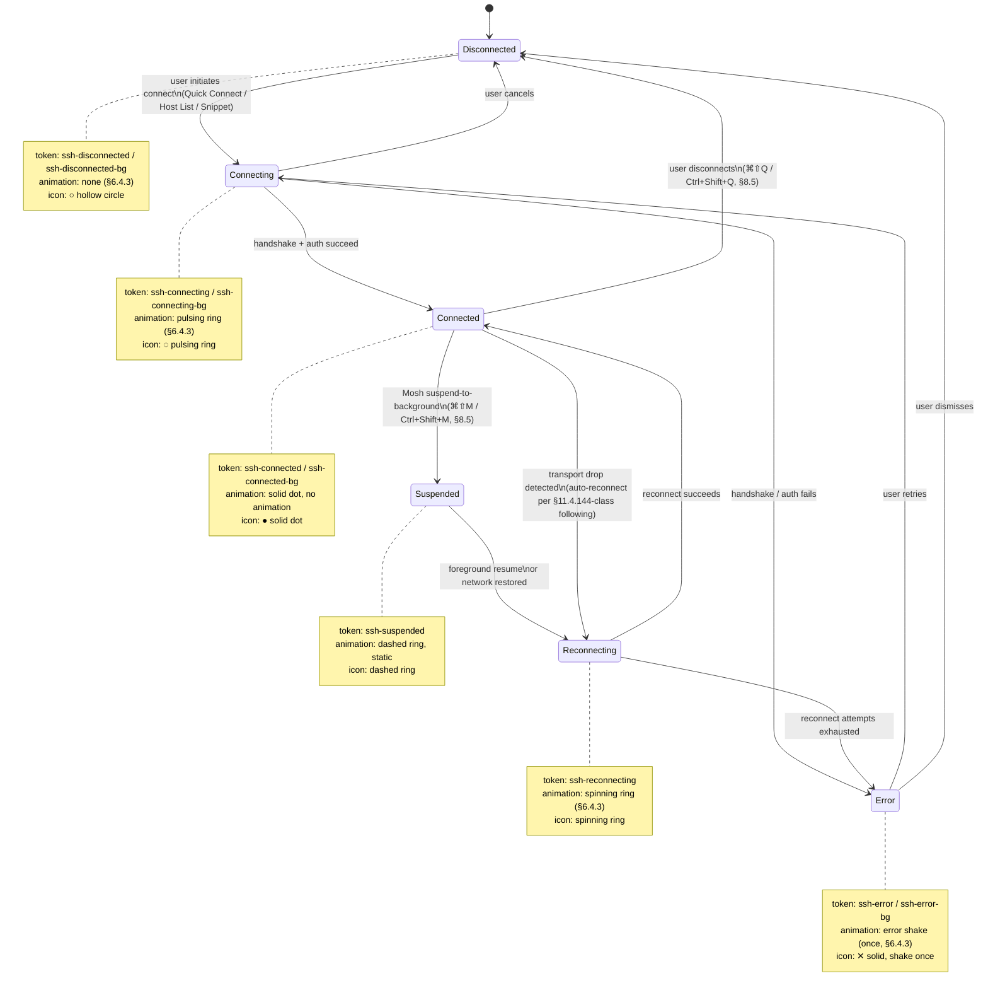
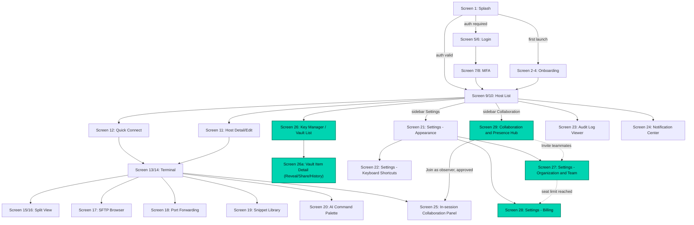
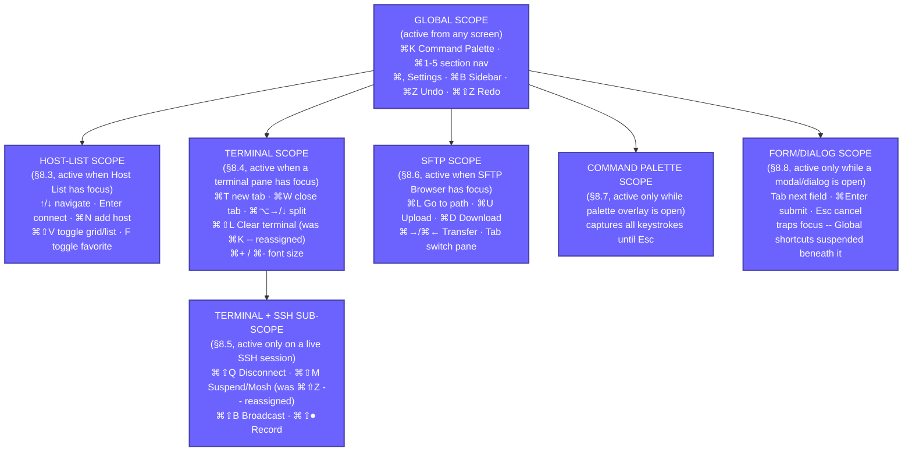
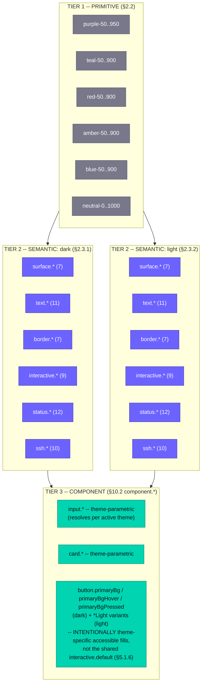

# 1. DESIGN PHILOSOPHY

## 1.1 Overview

HelixTerminator is not just another SSH client — it is the definitive professional terminal workspace for engineers, DevOps practitioners, SREs, and security researchers who demand the very best. The design system governing every pixel of HelixTerminator reflects a single governing ambition: that a tool built for mastery should itself be a masterwork.

This document encodes the visual language, interaction grammar, and experience standards that every contributor, designer, and engineer must internalize. Every decision made in this system has been weighed against four foundational principles: **Clarity**, **Power**, **Speed**, and **Trust**. These are not marketing words. They are measurable, enforceable design constraints.

---

## 1.2 Core Design Principles

### 1.2.1 Clarity

> "Every element on screen must earn its place."

**Definition:** Clarity means that a user — whether on their first session or ten-thousandth — can immediately understand what they are looking at, what they can do, and what will happen when they act. Clarity is not minimalism for its own sake; high-density interfaces can be perfectly clear. Clarity is the elimination of ambiguity and noise.

**In Practice:**
- Every icon is accompanied by a label in the primary navigation; tooltips appear within 300ms of hover elsewhere.
- Status is always visually differentiated: connected servers display in teal (`#00D4B1`), disconnected in muted gray, error states in alert red (`#FF6B6B`).
- Destructive actions require explicit confirmation dialogs. No one accidentally deletes a host group or purges an audit log.
- Empty states are never blank. Every empty container presents a clear explanation and an actionable call-to-action.
- Error messages state what went wrong, what the consequence is, and what the user can do. "Connection timed out" is insufficient. "Connection to prod-web-01 timed out after 30s — check that the host is reachable and the firewall allows port 22" is clarity.
- Hierarchy is enforced through size, weight, and contrast, never color alone.

**Violations to Avoid:**
- Tooltip-only navigation items at primary depth.
- Icons that require expert knowledge to decode (e.g., a lock icon used for both "encrypted connection" and "locked/read-only file").
- Success and failure states that differ only in label text.
- Modal dialogs with two buttons both labeled affirmatively ("OK" / "Continue").

---

### 1.2.2 Power

> "The interface must not impose a ceiling on what an expert can do."

**Definition:** Power means the interface scales from a new user making their first SSH connection to a senior SRE managing 2,000 hosts across 40 jump chains with custom port forwarding rules, live session sharing, and automated SFTP transfers. The interface must not hide capability behind progressive disclosure that experts find patronizing, nor expose every option in a way that overwhelms beginners.

**In Practice:**
- Power is unlocked through layering: basic operations are visible by default; advanced operations are one or two keystrokes away via the Command Palette (`⌘K` / `Ctrl+K`).
- Keyboard-first design: every action in the application is reachable without a mouse within two key chords from any context.
- Bulk operations are native: multi-select hosts, apply group labels, push commands to 50 sessions simultaneously via Broadcast Mode.
- The terminal itself is unconstrained: users can set custom TERM values, configure PTY dimensions, tune scrollback to millions of lines, inject environment variables, and define per-host pre-connect scripts.
- Layout is fully customizable: split views in any tiling pattern, detachable panels, floating terminal windows, configurable sidebar width.
- All configuration is available via both GUI and a structured `helixterm.yaml` config file for version-control-friendly power-user workflows.

**Violations to Avoid:**
- Hiding the "advanced" tab behind an unlabeled gear icon.
- Requiring GUI clicks for operations that power users need to script.
- Pagination that forces users to click through 20 pages to find a host when a search + keyboard navigation would be faster.

---

### 1.2.3 Speed

> "Fast is a feature. Latency is disrespect."

**Definition:** Speed is both perceived and measured. Perceived speed concerns how quickly users feel the interface responds to their intent. Measured speed concerns actual frame rates, render times, and data-loading latencies. Both are design constraints, not engineering afterthoughts.

**Perceived Speed Principles:**
- **Optimistic UI:** When a user creates a host entry, it appears in the list immediately, before the server confirms persistence.
- **Skeleton loaders** replace blank loading states; they appear within 16ms (one frame), never after a blank pause.
- **Speculative prefetch:** Hovering over a host card triggers a background DNS lookup and TCP pre-connect where possible.
- **Instant feedback:** All interactive elements respond within one frame (16ms) with a visual state change. If a background operation takes longer than 300ms, a progress indicator begins.
- **Zero jank scrolling:** The host list, terminal output, session logs, and file browser all use virtual/lazy rendering. Scrolling 100,000 terminal lines or 10,000 SFTP entries feels as smooth as scrolling 10.

**Measured Speed Targets:**
- App cold launch to interactive: < 1.5 seconds (desktop), < 2.5 seconds (mobile).
- SSH connection establishment UI feedback: < 100ms from user action.
- Command palette open: < 50ms.
- Terminal input-to-screen latency: < 16ms (local), < 5ms beyond network RTT.
- Tab switch: < 16ms (single frame).

**Animation Speed:**
- Animations are fast and purposeful. The maximum duration for a UI micro-animation is 300ms. Looping or ambient animations (e.g., connection pulse) run at 1.5–2 second periods with eased keyframes. Full-screen transitions are capped at 250ms.

---

### 1.2.4 Trust

> "This tool touches production. It must feel like it deserves that privilege."

**Definition:** Trust is earned through consistency, correctness, and restraint. Users who manage critical infrastructure need absolute confidence that the application will do exactly what it says, will not do things it didn't say, and will fail safely and visibly when something goes wrong.

**In Practice:**
- **Consistency:** A button that says "Connect" connects. A dialog that says "Delete" deletes. No action has a surprising secondary effect. All shortcuts are documented and discoverable.
- **Transparency:** Every background operation is visible in the Activity Center. When HelixTerminator syncs vault data, checks for updates, re-establishes a dropped connection, or runs a scheduled backup, the user can see it happening.
- **Safe defaults:** New hosts are not trusted until fingerprint verification. Jump chains display the complete routing path before connection. Port forwarding rules show the network exposure clearly.
- **Undo where possible:** Host edits, group changes, snippet modifications, and theme changes are undoable. Irreversible operations (session deletion, key removal) require confirmation with the exact resource name typed.
- **Visual feedback on security state:** The connection status badge in the terminal toolbar always shows the full chain: current encryption algorithm, key exchange method, and whether the host fingerprint matches the known-hosts file. Changes in security state (e.g., host key changed) are shown as blocking alerts, not silent warnings.
- **No dark patterns:** HelixTerminator will never use deceptive patterns. Subscription upsells are informational, not modal-blocked. Data export is always accessible. Account deletion is a single confirmed action.

---

## 1.3 Visual Language

### 1.3.1 Dark-First Aesthetic

HelixTerminator is designed primarily for dark environments. Developers work at all hours; dark UI reduces eye strain during extended sessions and improves terminal readability by reducing the contrast differential between the UI chrome and the terminal viewport.

The default theme is **Helix Dark**, a near-black surface system with carefully calibrated elevation layers:

| Layer              | Purpose                              | Surface Color  |
|--------------------|--------------------------------------|----------------|
| `surface-base`     | Page/app background                  | `#0E0E14`      |
| `surface-raised`   | Cards, panels, sidebar               | `#16161E`      |
| `surface-overlay`  | Modals, dropdowns, tooltips          | `#1E1E2A`      |
| `surface-sunken`   | Inputs, code blocks, terminal chrome | `#0A0A10`      |

The dark theme uses a **purple-to-teal accent spectrum** that carries brand identity without competing with terminal content. Purple (`#6C63FF`) is used for primary interactive elements, teal (`#00D4B1`) for success and connected states, and red (`#FF6B6B`) for alerts and errors.

**Light theme** is *intended* as a full-fidelity alternative for users who prefer it, and is not meant to be a "light mode afterthought" — but as specified today it is not yet at parity: the Border, Interactive, Status, and SSH-connection-status token groups have no light-theme values yet (§2.3.2 lists the specifics, each marked `> DEFERRED (next increment)`), so the "every component, every token, every ratio validated in both themes" claim does not yet hold. Closing that gap is tracked as a follow-up increment, not fabricated here.

### 1.3.2 Terminal Aesthetic Integration

The terminal is the product. All surrounding UI chrome should serve the terminal, not compete with it. Design rules:
- The terminal viewport has no border radius in focused full-screen mode.
- Toolbars collapse to icon-only width when a terminal tab is active and the user has not interacted with UI chrome for 3 seconds.
- Font choices, line heights, and spacing within the terminal area are entirely under user control.
- The ambient palette of the surrounding chrome should not clash with popular terminal color schemes. Helix's neutral dark backgrounds are specifically calibrated to not produce halo effects with Solarized, Dracula, Nord, or Gruvbox themes.

### 1.3.3 Professional, Not Corporate

HelixTerminator targets engineering professionals who have strong aesthetic opinions and will reject both bland enterprise design and garish consumer aesthetics. The visual language aims for:
- **Crafted, not designed-by-committee:** Details like tab separators, connection status ring animations, and the gradient in the primary button show intentional craft.
- **Density without clutter:** The host list can show 8+ hosts per viewport row in compact mode, but each entry is still legible and scannable.
- **Typography-forward:** Type is used to establish hierarchy and communicate information, not as decoration. Monospace elements within prose text are visually distinct but harmonious.

---

## 1.4 Accessibility-First Design

Accessibility is not a feature added at the end of the design process. In HelixTerminator, accessibility is a **first-class design constraint** applied at every stage, from color token selection to keyboard interaction model.

### 1.4.1 Commitment
- All text and interactive elements meet **WCAG 2.1 AA** contrast requirements as a minimum.
- All interactive controls are navigable via keyboard without exception.
- Screen reader support (VoiceOver on macOS/iOS, TalkBack on Android, NVDA/JAWS on Windows) is validated on every release.
- Reduced motion settings are honored at the OS level; no forced animations are applied when `prefers-reduced-motion` is active.
- The full application is usable at **200% font scale** without layout breakage.

### 1.4.2 Design Principles
- Never convey information through color alone. Every color-coded status also has an icon and/or label.
- Focus rings are always visible and use the full-focus-ring specification (see Section 9).
- Tap targets on mobile are a minimum of 44×44 points, per Apple HIG and Material Design guidelines.
- All form inputs have visible, persistent labels — not just placeholder text.
- Error messages are associated with their form fields via semantic markup / Flutter semantics tree.

---

## 1.5 Platform-Native Feel

HelixTerminator is built with Flutter, which provides a single codebase across six platforms. But users on each platform have different expectations, and the design system accounts for them.

| Platform       | Key Native Behaviors                                                                 |
|----------------|--------------------------------------------------------------------------------------|
| macOS          | Menu bar integration, ⌘ shortcuts, native window chrome, Touch Bar support, Spotlight-style Command Palette |
| Windows        | Ctrl shortcuts, system title bar, Windows 11 Mica/Acrylic material (optional), taskbar progress |
| Linux          | GTK integration hints, no window-controls chrome override, system monospace fonts honored |
| iOS            | Bottom sheet navigation, swipe gestures, Dynamic Island integration for active sessions, Share Sheet |
| Android        | Back-gesture awareness, Material 3 components, edge-to-edge content, Quick Settings tile |
| Web            | Cursor-based interactions, URL-addressable sessions, browser keyboard shortcut awareness |

Despite platform variation, the **core visual language is consistent**: the same color tokens, typography scale, spacing grid, and component shapes appear on every platform. What adapts is interaction patterns (touch vs. mouse), navigation model (bottom bar vs. sidebar), and integration with OS-level affordances.

---

## 1.6 Motion Design Principles

Motion in HelixTerminator follows five rules:

1. **Purposeful:** Every animation communicates something — a state change, a hierarchy relationship, a direction of movement. Decorative motion for its own sake is prohibited.

2. **Subtle:** Motion should be felt more than seen. A 150ms modal entrance is barely perceptible but makes the interface feel polished and alive. A 600ms bounce animation would be distracting and unprofessional.

3. **Fast:** Enter transitions are faster than exit transitions. Things appear quickly (suggesting responsiveness) and leave with a touch more grace (allowing the eye to track what left). No UI animation exceeds 300ms for standard interactions.

4. **Directional:** Elements enter from their logical origin (a host card expanding into a detail panel, a terminal tab sliding in from the direction of new tab creation). This maintains spatial model coherence.

5. **Interruptible:** Any animation can be interrupted by user input without visual artifacts. Flutter's animation framework (implicitly animated widgets + `AnimationController`) handles this correctly when implemented per spec.

---

## 1.7 Information Density

HelixTerminator ships with two density modes and a granular density slider:

| Mode      | Row Height | Font Size | Icon Size | Padding  | Use Case                          |
|-----------|------------|-----------|-----------|----------|-----------------------------------|
| Compact   | 32px       | 13px (sm) | 14px      | 4px/8px  | Power users, large host inventories |
| Default   | 40px       | 15px (base)| 16px     | 8px/12px | Daily use, balanced density        |
| Comfortable | 48px    | 15px      | 18px      | 12px/16px| Touch-first, accessibility, new users |

The density setting propagates through the design token system via a `--density` CSS custom property analog in Flutter (a `ThemeExtension<HelixDensity>` that multiplies spacing tokens). No component is hardcoded to a specific padding value; all spacing references tokens that respond to the density multiplier.
# 2. COLOR SYSTEM

## 2.1 Design Intent

HelixTerminator's color system is built on a **layered token architecture** with three tiers:

1. **Primitive tokens** — raw hex values with no semantic meaning (e.g., `purple-500: #6C63FF`)
2. **Semantic tokens** — purpose-driven references to primitives (e.g., `interactive-default: purple-500`)
3. **Component tokens** — component-specific overrides that reference semantic tokens (e.g., `button-bg-primary: interactive-default`)

This architecture ensures that a single theme change at the semantic layer cascades to all components without any component-level overrides required.

**Constitutional alignment:** This 3-tier primitive -> semantic -> component architecture is
HelixTerminator's implementation of the token-driven, light+dark, no-ad-hoc-CSS design-system
mandate in **HelixConstitution (pinned e6504c2, helixcode-v1.1.0 line) §11.4.162 ("OpenDesign")**.
Per §11.4.162, every color/spacing/typography value consumed by a component MUST resolve through a
named token (never a literal hex/px value in component code -- see §10.4 Flutter Implementation for
the enforced access pattern), and both light and dark themes MUST be first-class, fully-populated
token sets rather than one theme with the other bolted on. The component-token layer described above
is not yet fully theme-parametric: several `component.*` tokens in §10.2 resolve only against
`color.semantic.dark.*` and have no light-theme counterpart (see §2.3.2 and §10.3 for the specific
gaps, marked `> DEFERRED` below). Closing that gap is required for full §11.4.162 compliance and is
tracked as a follow-up increment, not fabricated here.

---

## 2.2 Primitive Color Palette

### 2.2.1 Purple Scale (Brand Primary)

| Token                | Hex       | Usage                                     |
|----------------------|-----------|-------------------------------------------|
| `purple-50`          | `#F0EFFF`  | Light theme hover backgrounds             |
| `purple-100`         | `#DDD9FF`  | Light theme selected backgrounds          |
| `purple-200`         | `#B9B3FF`  | Light theme accent tints                  |
| `purple-300`         | `#9590FF`  | Focus ring on dark bg                     |
| `purple-400`         | `#7D75FF`  | Interactive hover state (dark)            |
| `purple-500`         | `#6C63FF`  | **Brand Primary** — buttons, links, focus |
| `purple-600`         | `#5952D4`  | Interactive pressed state                 |
| `purple-700`         | `#4640AA`  | Dark mode text links                      |
| `purple-800`         | `#332F7F`  | Backgrounds on very dark surfaces         |
| `purple-900`         | `#201E55`  | Deep accent backgrounds                   |
| `purple-950`         | `#13122E`  | Near-black with purple undertone          |

### 2.2.2 Teal Scale (Brand Secondary)

| Token                | Hex       | Usage                                     |
|----------------------|-----------|-------------------------------------------|
| `teal-50`            | `#E6FDF9`  | Success background (light)                |
| `teal-100`           | `#CCFBF3`  | Connected state background (light)        |
| `teal-200`           | `#99F5E6`  | Success tint                              |
| `teal-300`           | `#4DECD5`  | Success icon on dark bg                   |
| `teal-400`           | `#1ADFC5`  | Connected hover state                     |
| `teal-500`           | `#00D4B1`  | **Brand Secondary** — connected, success  |
| `teal-600`           | `#00AA8D`  | Success pressed                           |
| `teal-700`           | `#008069`  | Success dark text                         |
| `teal-800`           | `#005545`  | Success background (dark)                 |
| `teal-900`           | `#002B23`  | Deep success tint                         |

### 2.2.3 Red Scale (Alert / Error)

| Token                | Hex       | Usage                                     |
|----------------------|-----------|-------------------------------------------|
| `red-50`             | `#FFF0F0`  | Error background (light)                  |
| `red-100`            | `#FFD9D9`  | Error tint (light)                        |
| `red-200`            | `#FFB3B3`  | Error border (light)                      |
| `red-300`            | `#FF8888`  | Error icon on light bg                    |
| `red-400`            | `#FF7A7A`  | Error hover (dark)                        |
| `red-500`            | `#FF6B6B`  | **Accent / Error** — alerts, destructive  |
| `red-600`            | `#D45555`  | Error pressed                             |
| `red-700`            | `#AA4040`  | Error text on light bg                    |
| `red-800`            | `#7F2B2B`  | Error background (dark)                   |
| `red-900`            | `#551616`  | Deep error bg                             |

### 2.2.4 Amber Scale (Warning)

| Token                | Hex       | Usage                                     |
|----------------------|-----------|-------------------------------------------|
| `amber-50`           | `#FFFBEB`  | Warning background (light)                |
| `amber-100`          | `#FEF3C7`  | Warning tint                              |
| `amber-200`          | `#FDE68A`  | Warning border                            |
| `amber-300`          | `#FCD34D`  | Warning icon on dark bg                   |
| `amber-400`          | `#FBBF24`  | Warning hover                             |
| `amber-500`          | `#F59E0B`  | **Warning** — caution states              |
| `amber-600`          | `#D97706`  | Warning pressed                           |
| `amber-700`          | `#B45309`  | Warning text on light                     |
| `amber-800`          | `#92400E`  | Warning bg (dark)                         |
| `amber-900`          | `#451A03`  | Deep warning bg                           |

### 2.2.5 Blue Scale (Info)

| Token                | Hex       | Usage                                     |
|----------------------|-----------|-------------------------------------------|
| `blue-50`            | `#EFF6FF`  | Info background (light)                   |
| `blue-100`           | `#DBEAFE`  | Info tint                                 |
| `blue-200`           | `#BFDBFE`  | Info border                               |
| `blue-300`           | `#93C5FD`  | Info icon on dark bg                      |
| `blue-400`           | `#60A5FA`  | Info hover                                |
| `blue-500`           | `#3B82F6`  | **Info** — informational states           |
| `blue-600`           | `#2563EB`  | Info pressed                              |
| `blue-700`           | `#1D4ED8`  | Info text on light                        |
| `blue-800`           | `#1E3A8A`  | Info bg (dark)                            |
| `blue-900`           | `#172554`  | Deep info bg                              |

### 2.2.6 Neutral Scale

| Token                | Hex       | Usage                                     |
|----------------------|-----------|-------------------------------------------|
| `neutral-0`          | `#FFFFFF`  | Pure white                                |
| `neutral-50`         | `#F8F8FA`  | Light theme page bg                       |
| `neutral-100`        | `#F0F0F4`  | Light surface raised                      |
| `neutral-200`        | `#E2E2EA`  | Light borders                             |
| `neutral-300`        | `#C8C8D8`  | Light disabled                            |
| `neutral-400`        | `#A0A0B8`  | Light muted text                          |
| `neutral-500`        | `#78788A`  | Medium gray                               |
| `neutral-600`        | `#56566A`  | Dark secondary text                       |
| `neutral-700`        | `#3A3A4A`  | Dark border strong                        |
| `neutral-750`        | `#2E2E3E`  | Dark border default                       |
| `neutral-800`        | `#242432`  | Dark border subtle                        |
| `neutral-850`        | `#1E1E2A`  | Surface overlay                           |
| `neutral-900`        | `#16161E`  | Surface raised                            |
| `neutral-950`        | `#0E0E14`  | Surface base                              |
| `neutral-1000`       | `#0A0A10`  | Surface sunken                            |

---

## 2.3 Semantic Color Tokens

### 2.3.1 Dark Theme Semantic Tokens

#### Background / Surface

| Semantic Token        | Primitive          | Hex        | Usage                                      |
|-----------------------|--------------------|------------|---------------------------------------------|
| `surface`             | `neutral-950`      | `#0E0E14`  | App background, main content area          |
| `surface-raised`      | `neutral-900`      | `#16161E`  | Cards, sidebar, panels                     |
| `surface-overlay`     | `neutral-850`      | `#1E1E2A`  | Modals, dropdowns, popovers                |
| `surface-sunken`      | `neutral-1000`     | `#0A0A10`  | Input fields, code areas, terminal         |
| `surface-interactive` | `neutral-800`      | `#242432`  | Hover background on interactive rows       |
| `surface-selected`    | `purple-900`       | `#201E55`  | Selected item background                   |
| `surface-danger`      | `red-900`          | `#551616`  | Destructive action confirmation zone       |

#### Text

| Semantic Token         | Primitive         | Hex        | Contrast vs surface |
|------------------------|-------------------|------------|----------------------|
| `text-primary`         | `neutral-0`       | `#FFFFFF`  | 17.5:1               |
| `text-secondary`       | `neutral-400`     | `#A0A0B8`  | 7.2:1                |
| `text-tertiary`        | `neutral-500`     | `#78788A`  | 4.6:1                |
| `text-disabled`        | `neutral-600`     | `#56566A`  | 3.1:1 (large only)   |
| `text-inverse`         | `neutral-950`     | `#0E0E14`  | On light backgrounds |
| `text-link`            | `purple-300`      | `#9590FF`  | 7.8:1                |
| `text-link-hover`      | `purple-200`      | `#B9B3FF`  | 10.1:1               |
| `text-success`         | `teal-300`        | `#4DECD5`  | 9.1:1                |
| `text-warning`         | `amber-300`       | `#FCD34D`  | 11.4:1               |
| `text-error`           | `red-400`         | `#FF7A7A`  | 6.3:1                |
| `text-info`            | `blue-300`        | `#93C5FD`  | 8.5:1                |

#### Border

| Semantic Token         | Hex        | Usage                                        |
|------------------------|------------|----------------------------------------------|
| `border-subtle`        | `#1E1E2A`  | Hairline dividers, card edges on dark bg     |
| `border-default`       | `#2E2E3E`  | Standard input borders, panel separators     |
| `border-strong`        | `#3A3A4A`  | Focused inputs (secondary ring), table lines |
| `border-brand`         | `#6C63FF`  | Focus rings, selected borders                |
| `border-success`       | `#00D4B1`  | Connected state borders                      |
| `border-warning`       | `#F59E0B`  | Caution borders                              |
| `border-error`         | `#FF6B6B`  | Error state borders                          |

#### Interactive

| Semantic Token               | Hex        | Usage                                          |
|------------------------------|------------|------------------------------------------------|
| `interactive-default`        | `#6C63FF`  | Primary button bg, active toggle, progress bar |
| `interactive-hover`          | `#7D75FF`  | Primary button hover                           |
| `interactive-pressed`        | `#5952D4`  | Primary button active/pressed                  |
| `interactive-disabled`       | `#332F7F`  | Disabled primary button                        |
| `interactive-secondary`      | `#242432`  | Secondary button bg                            |
| `interactive-secondary-hover`| `#2E2E3E`  | Secondary button hover                         |
| `interactive-ghost-hover`    | `#16161E`  | Ghost/text button hover                        |
| `interactive-destructive`    | `#FF6B6B`  | Destructive action button                      |
| `interactive-destructive-hover` | `#FF7A7A` | Destructive hover                           |

#### Status Semantic Tokens

| Semantic Token         | Hex        | Icon | Usage                               |
|------------------------|------------|------|-------------------------------------|
| `status-success-bg`    | `#002B23`  | ✓    | Success banner background           |
| `status-success-border`| `#00D4B1`  | —    | Success banner border               |
| `status-success-text`  | `#4DECD5`  | —    | Success banner text                 |
| `status-warning-bg`    | `#451A03`  | ⚠    | Warning banner background           |
| `status-warning-border`| `#F59E0B`  | —    | Warning banner border               |
| `status-warning-text`  | `#FCD34D`  | —    | Warning banner text                 |
| `status-error-bg`      | `#551616`  | ✕    | Error banner background             |
| `status-error-border`  | `#FF6B6B`  | —    | Error banner border                 |
| `status-error-text`    | `#FF7A7A`  | —    | Error banner text                   |
| `status-info-bg`       | `#172554`  | ℹ    | Info banner background              |
| `status-info-border`   | `#3B82F6`  | —    | Info banner border                  |
| `status-info-text`     | `#93C5FD`  | —    | Info banner text                    |

#### SSH Connection Status Tokens

| Semantic Token             | Hex        | Animation          | Usage                          |
|----------------------------|------------|--------------------|--------------------------------|
| `ssh-connected`            | `#00D4B1`  | Solid dot          | Active SSH session             |
| `ssh-connected-bg`         | `#002B23`  | —                  | Connected session badge bg     |
| `ssh-connecting`           | `#F59E0B`  | Pulsing ring       | Connection in progress         |
| `ssh-connecting-bg`        | `#451A03`  | —                  | Connecting badge bg            |
| `ssh-disconnected`         | `#78788A`  | None               | No active connection           |
| `ssh-disconnected-bg`      | `#16161E`  | —                  | Disconnected badge bg          |
| `ssh-error`                | `#FF6B6B`  | Error shake (once) | Connection failed / host error |
| `ssh-error-bg`             | `#551616`  | —                  | Error badge bg                 |
| `ssh-reconnecting`         | `#9590FF`  | Spinning ring      | Auto-reconnect in progress     |
| `ssh-suspended`            | `#56566A`  | Dashed ring        | Mosh suspended                 |

### 2.3.2 Light Theme Semantic Tokens

> **§11.4.162 (OpenDesign) parity -- closed this pass.** Per the constitutional citation in §2.1,
> light theme must be a first-class, fully-populated token set. The previous revision of this
> section only populated Background/Surface and a partial Text group and marked Border, Interactive,
> Status, and SSH Connection Status as `> DEFERRED`. All four groups are completed below with the
> same category shape as Dark Theme (§2.3.1) -- same token names, same group structure, real hex
> values, and recomputed WCAG 2.1 relative-luminance ratios wherever the token carries text. Every
> hex below is drawn from the existing primitive scales in §2.2 (no new primitives invented); most
> rows reuse a primitive that §2.2's own "Usage" column already earmarks for exactly this
> light-theme purpose (e.g. `teal-700` is labelled "Success dark text", `red-700` "Error text on
> light bg", `amber-700` "Warning text on light", `blue-700` "Info text on light" -- this pass wires
> those pre-labelled primitives to their semantic tokens rather than inventing new colors). The
> matching `color.semantic.light` JSON block in §10.2 is updated to match; the token-count parity
> fix is in §10.3.

#### Background / Surface (Light)

| Semantic Token        | Hex        | Usage                                       |
|-----------------------|------------|---------------------------------------------|
| `surface`             | `#F8F8FA`  | App background                              |
| `surface-raised`      | `#FFFFFF`  | Cards, sidebar, panels                      |
| `surface-overlay`     | `#FFFFFF`  | Modals, dropdowns (with shadow)             |
| `surface-sunken`      | `#F0F0F4`  | Input fields, code areas                    |
| `surface-interactive` | `#F0F0F4`  | Row hover bg                                |
| `surface-selected`    | `#F0EFFF`  | Selected row bg                             |
| `surface-danger`      | `#FFF0F0`  | Destructive action confirmation zone (`red-50`, labelled "Error background (light)" in §2.2.3) |

#### Text (Light)

Ratios recomputed per §2.6/§9.2 methodology (WCAG 2.1 relative luminance, background = `surface` `#F8F8FA` unless noted):

| Semantic Token         | Hex        | Contrast vs surface |
|------------------------|------------|----------------------|
| `text-primary`         | `#0E0E14`  | 18.14:1              |
| `text-secondary`       | `#56566A`  | 6.75:1               |
| `text-tertiary`        | `#78788A`  | 4.08:1               |
| `text-disabled`        | `#A0A0B8`  | 2.41:1 (large only)  |
| `text-inverse`         | `#FFFFFF`  | On dark/colored backgrounds (button fills, filled badges) -- not evaluated against `surface` |
| `text-link`            | `#5952D4`  | 5.53:1               |
| `text-link-hover`      | `#332F7F`  | 10.68:1 (`purple-800` -- hover intensifies by darkening on a light surface, the mirror of Dark Theme's hover-lightens pattern) |
| `text-success`         | `#008069`  | 4.61:1 (`teal-700`)  |
| `text-warning`         | `#B45309`  | 4.73:1 (`amber-700`) |
| `text-error`           | `#AA4040`  | 5.63:1 (`red-700`)   |
| `text-info`            | `#1D4ED8`  | 6.32:1 (`blue-700`)  |

All eleven rows meet WCAG AA (>=4.5:1) or the documented large-text exception (`text-disabled`), matching Dark Theme's coverage of the same eleven semantic names.

#### Border (Light)

| Semantic Token         | Hex        | Usage                                        |
|-------------------------|------------|----------------------------------------------|
| `border-subtle`        | `#E2E2EA`  | Hairline dividers, card edges on light bg (`neutral-200`, labelled "Light borders") |
| `border-default`       | `#C8C8D8`  | Standard input borders, panel separators (`neutral-300`) |
| `border-strong`        | `#A0A0B8`  | Focused inputs (secondary ring), table lines (`neutral-400`) |
| `border-brand`         | `#6C63FF`  | Focus rings, selected borders -- same hex as Dark Theme; brand color is theme-invariant |
| `border-success`       | `#00D4B1`  | Connected state borders (`teal-500`, same hex as Dark Theme) |
| `border-warning`       | `#F59E0B`  | Caution borders (`amber-500`, same hex as Dark Theme) |
| `border-error`         | `#FF6B6B`  | Error state borders (`red-500`, same hex as Dark Theme) |

#### Interactive (Light)

| Semantic Token               | Hex        | Usage                                          |
|-------------------------------|------------|------------------------------------------------|
| `interactive-default`        | `#6C63FF`  | Primary button bg, active toggle, progress bar (`purple-500`) |
| `interactive-hover`          | `#5952D4`  | Primary hover (`purple-600`) -- darkens on light bg |
| `interactive-pressed`        | `#4640AA`  | Primary pressed (`purple-700`) -- darkens further |
| `interactive-disabled`       | `#B9B3FF`  | Disabled primary button (`purple-200`) |
| `interactive-secondary`      | `#F0F0F4`  | Secondary button bg (`neutral-100`) |
| `interactive-secondary-hover`| `#E2E2EA`  | Secondary button hover (`neutral-200`) |
| `interactive-ghost-hover`    | `#F0EFFF`  | Ghost/text button hover (`purple-50`, labelled "Light theme hover backgrounds" in §2.2.1) |
| `interactive-destructive`    | `#FF6B6B`  | Destructive action button (`red-500`, same hex as Dark Theme) |
| `interactive-destructive-hover` | `#D45555` | Destructive hover (`red-600`) -- darkens on light bg |

> Note: primary-button solid-fill accessibility (white label on `interactive-default`) still computes
> to the same 4.32:1 FAIL as Dark Theme (§9.2.1) because the brand purple hex is shared across
> themes. §5.1.6 (Button) does not consume `interactive-default` directly for its solid-fill label
> color for this reason -- see §5.1.6's dedicated accessible fill tokens.

#### Status Semantic Tokens (Light)

| Semantic Token         | Hex        | Icon | Usage                               |
|------------------------|------------|------|--------------------------------------|
| `status-success-bg`    | `#E6FDF9`  | ✓    | Success banner background (`teal-50`) |
| `status-success-border`| `#00D4B1`  | --   | Success banner border (`teal-500`)  |
| `status-success-text`  | `#008069`  | --   | Success banner text (`teal-700`, 4.61:1 vs `#E6FDF9`) |
| `status-warning-bg`    | `#FFFBEB`  | ⚠    | Warning banner background (`amber-50`) |
| `status-warning-border`| `#F59E0B`  | --   | Warning banner border (`amber-500`) |
| `status-warning-text`  | `#B45309`  | --   | Warning banner text (`amber-700`)   |
| `status-error-bg`      | `#FFF0F0`  | ✕    | Error banner background (`red-50`)  |
| `status-error-border`  | `#FF6B6B`  | --   | Error banner border (`red-500`)     |
| `status-error-text`    | `#AA4040`  | --   | Error banner text (`red-700`)       |
| `status-info-bg`       | `#EFF6FF`  | ℹ    | Info banner background (`blue-50`)  |
| `status-info-border`   | `#3B82F6`  | --   | Info banner border (`blue-500`)     |
| `status-info-text`     | `#1D4ED8`  | --   | Info banner text (`blue-700`)       |

#### SSH Connection Status Tokens (Light)

| Semantic Token             | Hex        | Animation          | Usage                          |
|-----------------------------|------------|--------------------|---------------------------------|
| `ssh-connected`            | `#00AA8D`  | Solid dot          | Active SSH session (`teal-600`, darker than Dark Theme's `teal-500` for legibility on a light badge fill) |
| `ssh-connected-bg`         | `#CCFBF3`  | --                 | Connected session badge bg (`teal-100`) |
| `ssh-connecting`           | `#D97706`  | Pulsing ring       | Connection in progress (`amber-600`) |
| `ssh-connecting-bg`        | `#FFFBEB`  | --                 | Connecting badge bg (`amber-50`) |
| `ssh-disconnected`         | `#A0A0B8`  | None               | No active connection (`neutral-400`, labelled "Light muted text") |
| `ssh-disconnected-bg`      | `#F0F0F4`  | --                 | Disconnected badge bg (`neutral-100`) |
| `ssh-error`                | `#D45555`  | Error shake (once) | Connection failed / host error (`red-600`) |
| `ssh-error-bg`             | `#FFF0F0`  | --                 | Error badge bg (`red-50`) |
| `ssh-reconnecting`         | `#5952D4`  | Spinning ring      | Auto-reconnect in progress (`purple-600`) |
| `ssh-suspended`            | `#78788A`  | Dashed ring        | Mosh suspended (`neutral-500`) |

Light theme now defines the same 56 semantic token names as Dark Theme across all six groups
(Surface, Text, Border, Interactive, Status, SSH) -- see §10.3 for the corrected token-count table.

---

### 2.3.3 SSH Connection Status State Machine (Diagram)

The SSH connection-status tokens (§2.3.1 dark / §2.3.2 light) and the connection animations
(§6.4.3 SSH Connection Progress Animation) describe the same underlying state machine from two
separate sections; this diagram makes the states, transitions, and token bindings explicit in one
place instead of requiring the two sections to be reverse-engineered against each other.



**State-to-token binding table** (both themes use the same state names; hex values differ per
§2.3.1/§2.3.2):

| State          | Dark token(s)                          | Light token(s)                           | Redundant coding (not color-alone, §1.4.2) |
|-----------------|------------------------------------------|--------------------------------------------|-----------------------------------------------|
| Disconnected   | `ssh-disconnected` / `ssh-disconnected-bg` | `ssh-disconnected` / `ssh-disconnected-bg` | Hollow circle glyph + "Offline" label |
| Connecting     | `ssh-connecting` / `ssh-connecting-bg`     | `ssh-connecting` / `ssh-connecting-bg`     | Pulsing-ring animation + "Connecting…" label |
| Connected      | `ssh-connected` / `ssh-connected-bg`       | `ssh-connected` / `ssh-connected-bg`       | Solid dot + "Connected" label |
| Reconnecting   | `ssh-reconnecting`                        | `ssh-reconnecting`                         | Spinning-ring animation + "Reconnecting…" label |
| Suspended      | `ssh-suspended`                           | `ssh-suspended`                            | Dashed-ring glyph + "Suspended (Mosh)" label |
| Error          | `ssh-error` / `ssh-error-bg`               | `ssh-error` / `ssh-error-bg`               | ✕ glyph + error-shake animation + inline error text |

---

## 2.4 Terminal Color Schemes

All schemes define: 16 ANSI colors (black, red, green, yellow, blue, magenta, cyan, white in normal and bright variants), plus foreground, background, cursor, and selection overlay.

### 2.4.1 HelixDark (Default)

```
Background:      #0E0E14
Foreground:      #C8C8D8
Cursor:          #6C63FF
Selection:       #6C63FF33  (20% alpha)

ANSI Normal:
  black:         #16161E
  red:           #FF6B6B
  green:         #00D4B1
  yellow:        #FCD34D
  blue:          #9590FF
  magenta:       #C084FC
  cyan:          #4DECD5
  white:         #C8C8D8

ANSI Bright:
  black:         #3A3A4A
  red:           #FF8888
  green:         #1ADFC5
  yellow:        #FDE68A
  blue:          #B9B3FF
  magenta:       #D8B4FE
  cyan:          #6EF8E8
  white:         #FFFFFF
```

### 2.4.2 HelixLight

```
Background:      #F8F8FA
Foreground:      #0E0E14
Cursor:          #6C63FF
Selection:       #6C63FF22  (13% alpha)

ANSI Normal:
  black:         #0E0E14
  red:           #CC3333
  green:         #007A66
  yellow:        #B45309
  blue:          #4640AA
  magenta:       #7C3AED
  cyan:          #008069
  white:         #56566A

ANSI Bright:
  black:         #3A3A4A
  red:           #FF5555
  green:         #00AA8D
  yellow:        #D97706
  blue:          #5952D4
  magenta:       #9333EA
  cyan:          #00D4B1
  white:         #0E0E14
```

### 2.4.3 Solarized Dark

```
Background:      #002B36
Foreground:      #839496
Cursor:          #839496
Selection:       #073642

ANSI Normal:
  black:         #073642
  red:           #DC322F
  green:         #859900
  yellow:        #B58900
  blue:          #268BD2
  magenta:       #D33682
  cyan:          #2AA198
  white:         #EEE8D5

ANSI Bright:
  black:         #002B36
  red:           #CB4B16
  green:         #586E75
  yellow:        #657B83
  blue:          #839496
  magenta:       #6C71C4
  cyan:          #93A1A1
  white:         #FDF6E3
```

### 2.4.4 Solarized Light

```
Background:      #FDF6E3
Foreground:      #657B83
Cursor:          #657B83
Selection:       #EEE8D5

ANSI Normal:
  black:         #073642
  red:           #DC322F
  green:         #859900
  yellow:        #B58900
  blue:          #268BD2
  magenta:       #D33682
  cyan:          #2AA198
  white:         #EEE8D5

ANSI Bright:
  black:         #002B36
  red:           #CB4B16
  green:         #586E75
  yellow:        #657B83
  blue:          #839496
  magenta:       #6C71C4
  cyan:          #93A1A1
  white:         #FDF6E3
```

### 2.4.5 Dracula

```
Background:      #282A36
Foreground:      #F8F8F2
Cursor:          #F8F8F2
Selection:       #44475A

ANSI Normal:
  black:         #21222C
  red:           #FF5555
  green:         #50FA7B
  yellow:        #F1FA8C
  blue:          #BD93F9
  magenta:       #FF79C6
  cyan:          #8BE9FD
  white:         #F8F8F2

ANSI Bright:
  black:         #6272A4
  red:           #FF6E6E
  green:         #69FF94
  yellow:        #FFFFA5
  blue:          #D6ACFF
  magenta:       #FF92DF
  cyan:          #A4FFFF
  white:         #FFFFFF
```

### 2.4.6 One Dark

```
Background:      #282C34
Foreground:      #ABB2BF
Cursor:          #528BFF
Selection:       #3E4451

ANSI Normal:
  black:         #282C34
  red:           #E06C75
  green:         #98C379
  yellow:        #E5C07B
  blue:          #61AFEF
  magenta:       #C678DD
  cyan:          #56B6C2
  white:         #ABB2BF

ANSI Bright:
  black:         #5C6370
  red:           #E06C75
  green:         #98C379
  yellow:        #E5C07B
  blue:          #61AFEF
  magenta:       #C678DD
  cyan:          #56B6C2
  white:         #FFFFFF
```

### 2.4.7 Monokai

```
Background:      #272822
Foreground:      #F8F8F2
Cursor:          #F8F8F2
Selection:       #49483E

ANSI Normal:
  black:         #272822
  red:           #F92672
  green:         #A6E22E
  yellow:        #F4BF75
  blue:          #66D9E8
  magenta:       #AE81FF
  cyan:          #A1EFE4
  white:         #F8F8F2

ANSI Bright:
  black:         #75715E
  red:           #F92672
  green:         #A6E22E
  yellow:        #F4BF75
  blue:          #66D9E8
  magenta:       #AE81FF
  cyan:          #A1EFE4
  white:         #F9F8F5
```

### 2.4.8 Nord

```
Background:      #2E3440
Foreground:      #D8DEE9
Cursor:          #D8DEE9
Selection:       #434C5E

ANSI Normal:
  black:         #3B4252
  red:           #BF616A
  green:         #A3BE8C
  yellow:        #EBCB8B
  blue:          #81A1C1
  magenta:       #B48EAD
  cyan:          #88C0D0
  white:         #E5E9F0

ANSI Bright:
  black:         #4C566A
  red:           #BF616A
  green:         #A3BE8C
  yellow:        #EBCB8B
  blue:          #81A1C1
  magenta:       #B48EAD
  cyan:          #8FBCBB
  white:         #ECEFF4
```

### 2.4.9 Gruvbox Dark

```
Background:      #282828
Foreground:      #EBDBB2
Cursor:          #EBDBB2
Selection:       #3C3836

ANSI Normal:
  black:         #282828
  red:           #CC241D
  green:         #98971A
  yellow:        #D79921
  blue:          #458588
  magenta:       #B16286
  cyan:          #689D6A
  white:         #A89984

ANSI Bright:
  black:         #928374
  red:           #FB4934
  green:         #B8BB26
  yellow:        #FABD2F
  blue:          #83A598
  magenta:       #D3869B
  cyan:          #8EC07C
  white:         #EBDBB2
```

### 2.4.10 Gruvbox Light

```
Background:      #FBF1C7
Foreground:      #3C3836
Cursor:          #3C3836
Selection:       #EBDBB2

ANSI Normal:
  black:         #282828
  red:           #CC241D
  green:         #98971A
  yellow:        #D79921
  blue:          #458588
  magenta:       #B16286
  cyan:          #689D6A
  white:         #A89984

ANSI Bright:
  black:         #928374
  red:           #9D0006
  green:         #79740E
  yellow:        #B57614
  blue:          #076678
  magenta:       #8F3F71
  cyan:          #427B58
  white:         #3C3836
```

### 2.4.11 Tokyo Night

```
Background:      #1A1B26
Foreground:      #A9B1D6
Cursor:          #C0CAF5
Selection:       #283457

ANSI Normal:
  black:         #15161E
  red:           #F7768E
  green:         #9ECE6A
  yellow:        #E0AF68
  blue:          #7AA2F7
  magenta:       #BB9AF7
  cyan:          #7DCFFF
  white:         #A9B1D6

ANSI Bright:
  black:         #414868
  red:           #F7768E
  green:         #9ECE6A
  yellow:        #E0AF68
  blue:          #7AA2F7
  magenta:       #BB9AF7
  cyan:          #7DCFFF
  white:         #C0CAF5
```

### 2.4.12 Catppuccin Mocha

```
Background:      #1E1E2E
Foreground:      #CDD6F4
Cursor:          #F5E0DC
Selection:       #313244

ANSI Normal:
  black:         #45475A
  red:           #F38BA8
  green:         #A6E3A1
  yellow:        #F9E2AF
  blue:          #89B4FA
  magenta:       #F5C2E7
  cyan:          #94E2D5
  white:         #BAC2DE

ANSI Bright:
  black:         #585B70
  red:           #F38BA8
  green:         #A6E3A1
  yellow:        #F9E2AF
  blue:          #89B4FA
  magenta:       #F5C2E7
  cyan:          #94E2D5
  white:         #A6ADC8
```

---

## 2.5 Shadow & Elevation System

| Elevation Token     | Box Shadow Value                                      | Usage                              |
|---------------------|-------------------------------------------------------|------------------------------------|
| `shadow-none`       | `none`                                                | Flat surfaces                      |
| `shadow-xs`         | `0 1px 2px rgba(0,0,0,0.4)`                           | Subtle card lift                   |
| `shadow-sm`         | `0 2px 4px rgba(0,0,0,0.5)`                           | Card, chip                         |
| `shadow-md`         | `0 4px 12px rgba(0,0,0,0.5)`                          | Dropdown, popover                  |
| `shadow-lg`         | `0 8px 24px rgba(0,0,0,0.6)`                          | Modal                              |
| `shadow-xl`         | `0 16px 48px rgba(0,0,0,0.7)`                         | Full-screen overlay                |
| `shadow-brand`      | `0 0 0 3px rgba(108,99,255,0.4)`                      | Focus ring on dark                 |
| `shadow-brand-sm`   | `0 0 0 2px rgba(108,99,255,0.5)`                      | Focus ring compact                 |
| `shadow-success`    | `0 0 0 3px rgba(0,212,177,0.3)`                       | Connected state ring               |
| `shadow-error`      | `0 0 0 3px rgba(255,107,107,0.4)`                     | Error state ring                   |

---

## 2.6 Color Contrast Compliance Matrix

**Recomputed** from the actual token hex values (§2.2/§2.3) using the WCAG 2.1 relative-luminance
formula (`L = 0.2126R + 0.7152G + 0.0722B` on linearized sRGB channels; `ratio = (L1+0.05)/(L2+0.05)`).
The previous version of this table was hand-typed/estimated and every row diverged from the
computed value (see `mvp-A1-ux.md` Finding 3); it has been replaced below with values computed
directly from hex.

| Pair                                 | Ratio   | WCAG Level |
|--------------------------------------|---------|------------|
| text-primary on surface (dark)       | 19.24:1 | AAA        |
| text-secondary on surface (dark)     | 7.53:1  | AAA        |
| text-tertiary on surface (dark)      | 4.45:1  | AA*        |
| text-link on surface (dark)          | 7.06:1  | AAA*       |
| interactive-default on surface (dark)| 4.46:1  | AA (UI/large-text 3:1 floor -- see note) |
| text-success on surface-success-bg   | 10.42:1 | AAA        |
| text-error on surface-error-bg       | 5.50:1  | AA         |
| text-warning on surface-warning-bg   | 10.39:1 | AAA        |
| text-primary on surface (light)      | 18.14:1 | AAA        |
| text-secondary on surface (light)    | 6.75:1  | AA         |
| text-link on surface (light)         | 5.53:1  | AA         |

\* `text-tertiary` (4.45:1) and `text-link` (7.06:1) are within 0.05-0.06 of their respective AA
(4.5:1) / AAA (7:1) thresholds. `text-tertiary` is used only for captions/tertiary labels; treat as
borderline and prefer restricting it to >=14px semibold ("large text", 3:1 floor) until the token is
nudged in a follow-up pass. `> DEFERRED (next increment)`.

`interactive-default` (#6C63FF) is listed here as if it were running text, but its documented usage
(§2.3.1 Interactive) is exclusively UI components -- primary button fill, active toggle, progress
bar -- so the applicable WCAG 1.4.11 floor is 3:1 (non-text), which it clears comfortably at 4.46:1.
If this color is ever used as inline link/body text at normal size, prefer `text-link` (#9590FF,
7.06:1) instead, since 4.46:1 does not clear the 4.5:1 AA text floor.

**Two rows here are real compliance failures, not just miscomputed passes** (see §9.2.1 for the
canonical text-contrast table and hand-worked arithmetic): `text-disabled` (2.69:1, fails its own
3:1 large-text floor) and white button labels on `interactive-default` (4.32:1, fails the 4.5:1 AA
text floor). Both are carried through honestly in §9.2.1 below rather than hidden here.

> **Gap (tracked, not fixed this pass):** This matrix still does not cover the SSH connection-status
> colors (`ssh-connecting`, `ssh-error`, `ssh-reconnecting`) against their badge backgrounds, even
> though these are the safety-critical "is this connection trusted/live" signals the Trust principle
> (§1.2.4) depends on. `> DEFERRED (next increment)`.
# Appendix P.1 -- Platform Architecture Context (see docs 01/07): Complete System Architecture

> **Appendix note (applies to Appendix P.1-P.9 below):** Sections P.1 through P.9 preserve backend
> / platform-architecture content (microservice catalog, database schemas, Kafka/RabbitMQ topology,
> Zero Trust security architecture, API specification, performance architecture, Kubernetes
> deployment, submodule integration) that was originally interleaved into this UX Design System
> document under section numbers that duplicated the UX chapters (see
> `docs/research/mvp/REMEDIATION_REGISTER.md`, `06_ux_design_system` entry, and
> `mvp-A1-ux.md` Finding 0). It has been relabeled here under its own Appendix P numbering so no
> two sections in this file share a number, but it remains **out of scope** for the UX Design
> System proper (Sections 1-10). The canonical, deduplicated version of this platform content is
> owned by `01_core_architecture.md` and `07_api_and_database.md` -- treat those as authoritative
> and this appendix as historical/contextual reference only. A follow-up increment should extract
> Appendix P into its own standalone platform-architecture document. `> DEFERRED (next increment)`.

## P.1.1 Architectural Philosophy

HelixTerminator's architecture is a full microservices system with strict domain isolation, event-driven state propagation, and zero-trust security enforcement at every layer. Services communicate via three channels:

1. **Synchronous REST/gRPC** (via the API Gateway): used for request/response patterns where the caller needs an immediate result.
2. **Apache Kafka** (event streaming): used for durable, ordered, replayable event propagation — audit events, analytics, session telemetry, state change notifications.
3. **RabbitMQ** (command bus): used for work-queue patterns where a producer dispatches a command and expects exactly-once execution by a consumer — SSH connection commands, SFTP transfer commands, notification delivery.

This three-channel model provides clear semantic separation: Kafka for facts that have already happened (events), RabbitMQ for instructions that must happen exactly once (commands), REST/gRPC for interrogations (queries) and mutations requiring transactional semantics.

## P.1.2 High-Level Architecture Diagram Description

```
┌─────────────────────────────────────────────────────────────────────────────┐
│                          CLIENT LAYER                                        │
│  Flutter Web SPA │ Flutter Desktop (macOS/Win/Linux) │ Flutter Mobile (iOS/Android) │
└─────────────────────────────────────┬───────────────────────────────────────┘
                                       │ HTTPS / WSS / gRPC-Web
┌─────────────────────────────────────▼───────────────────────────────────────┐
│                      INGRESS LAYER                                           │
│           Nginx Ingress Controller + cert-manager (TLS termination)          │
└─────────────────────────────────────┬───────────────────────────────────────┘
                                       │ mTLS (SPIFFE/SPIRE identities)
┌─────────────────────────────────────▼───────────────────────────────────────┐
│               API GATEWAY SERVICE  helixterminator.io/services/gateway  :8080      │
│     Rate limiting │ Auth token validation │ Request routing │ Circuit breaker│
└──┬──────────┬──────────┬─────────┬──────────┬──────────┬───────────┬────────┘
   │          │          │         │          │          │           │
   ▼          ▼          ▼         ▼          ▼          ▼           ▼
 Auth      User       Vault     Host      Workspace  Snippet     Org/Team
:8081     :8082      :8083     :8084      :8085      :8086       :8087
   │          │          │         │          │          │           │
   └──────────┴──────────┴────┬────┴──────────┴──────────┴───────────┘
                               │ Internal gRPC / mTLS
   ┌───────────────────────────▼──────────────────────────────────────┐
   │              SSH PROXY SERVICE  helixterminator.io/services/ssh-proxy  │
   │              :8090 (WebSocket → SSH tunnel)                      │
   └──────────────────────┬───────────────────────────────────────────┘
                          │
         ┌────────────────┼────────────────┐
         ▼                ▼                ▼
    Terminal          SFTP          Port Forward
    :8091            :8092            :8093
         │                │                │
         └────────────────┼────────────────┘
                          │
         ┌────────────────▼────────────────────┐
         │   Apache Kafka  (Event Streaming)    │
         │   RabbitMQ     (Command Bus)         │
         └────────────────┬────────────────────┘
                          │
     ┌────────────────────┼────────────────────────┐
     ▼                    ▼                         ▼
  Audit              Analytics               Notification
  :8094              :8095                   :8096
     │                    │                         │
     ▼                    ▼                         │
  Recording          AI Service              ────────┘
  :8097              :8098
     │
     ▼
  Collab
  :8099
     │
  Session sharing via Kafka + WebSocket fan-out

  Supporting Services:
  PKI :8100 │ Keychain :8101 │ Config :8102 │ Health :8103
  Billing :8104 │ Container Bridge :8105 │ HelixTrack Bridge :8106
```

## P.1.3 Service Mesh: Istio Integration

All services run inside an Istio service mesh on Kubernetes. Every pod has an Envoy sidecar injected automatically via `istio-injection=enabled` namespace label. Key Istio configuration:

- **mTLS mode:** `STRICT` — no plaintext traffic accepted between any two services. SPIFFE SVIDs are automatically issued by SPIRE agents running as DaemonSets.
- **AuthorizationPolicy:** Default `deny-all` at namespace level, with explicit `ALLOW` rules per service pair. No implicit trust.
- **DestinationRule:** Per-service circuit breaker settings (see §8.5).
- **VirtualService:** Canary routing for zero-downtime deployments (traffic splitting 95/5 during rollout).
- **PeerAuthentication:** `STRICT` mTLS for all workloads in `helixterm-prod`, `helixterm-staging`, and `helixterm-dev` namespaces.

```yaml
# Namespace-level default deny
apiVersion: security.istio.io/v1beta1
kind: AuthorizationPolicy
metadata:
  name: default-deny-all
  namespace: helixterm-prod
spec:
  {}  # Empty spec = deny all
```

```yaml
# Gateway → Auth service allow
apiVersion: security.istio.io/v1beta1
kind: AuthorizationPolicy
metadata:
  name: gateway-to-auth
  namespace: helixterm-prod
spec:
  selector:
    matchLabels:
      app: auth-service
  rules:
  - from:
    - source:
        principals: ["cluster.local/ns/helixterm-prod/sa/gateway-service"]
    to:
    - operation:
        methods: ["GET", "POST", "PUT", "DELETE"]
        paths: ["/api/v1/auth/*"]
```

## P.1.4 SPIFFE/SPIRE Workload Identity

Every service is assigned a SPIFFE SVID (SPIFFE Verifiable Identity Document) of the form:

```
spiffe://helixterminator.io/ns/helixterm-prod/sa/<service-account-name>
```

SPIRE Server runs as a StatefulSet. SPIRE Agents run as DaemonSets. SVIDs are rotated every hour. X.509 SVIDs are used for mTLS (Envoy's certificate material). JWT SVIDs are used for service-to-service API calls where certificate-based auth is not available.

## P.1.5 API Gateway Design

The API Gateway (`helixterminator.io/services/gateway`) is built on Gin Gonic and performs:

1. **TLS termination** (delegated to Nginx Ingress + cert-manager in Kubernetes).
2. **JWT validation:** Validates access tokens signed by the Auth Service (EdDSA/Ed25519 -- CD-7 canonical signing choice --, public key fetched from JWKS endpoint with caching via `digital.vasic.cache`).
3. **Rate limiting:** Per-user, per-IP, per-endpoint rate limiting using `digital.vasic.ratelimiter` backed by Redis sliding window counters.
4. **Request routing:** Path-based routing to upstream services via registered Gin route groups.
5. **Circuit breaking:** `digital.vasic.recovery` circuit breaker wraps every upstream call; open-circuit returns 503 with `Retry-After` header.
6. **Observability:** Every request emits a trace span to OpenTelemetry collector (via `digital.vasic.observability`). Request duration, status code, and upstream service metrics are exported as Prometheus counters/histograms.
7. **Request ID propagation:** Every request receives a `X-Request-ID` (UUID v7) injected if not present, propagated in all downstream calls.

```go
// Package: helixterminator.io/services/gateway
// File: internal/router/router.go

package router

import (
    "github.com/gin-gonic/gin"
    "helixterminator.io/services/gateway/internal/middleware"
    "helixterminator.io/services/gateway/internal/proxy"
    "digital.vasic.ratelimiter/pkg/limiter"
    "digital.vasic.recovery/pkg/circuitbreaker"
    "digital.vasic.observability/pkg/tracing"
    "digital.vasic.auth/pkg/jwt"
)

func New(
    jwtValidator jwt.Validator,
    rl limiter.RateLimiter,
    cb circuitbreaker.Factory,
    tracer tracing.Tracer,
) *gin.Engine {
    r := gin.New()
    r.Use(middleware.RequestID())
    r.Use(middleware.Logger(tracer))
    r.Use(middleware.Recovery())
    r.Use(middleware.CORS())

    // Public routes (no JWT required)
    public := r.Group("/api/v1")
    {
        public.POST("/auth/login", proxy.Auth(cb))
        public.POST("/auth/register", proxy.Auth(cb))
        public.POST("/auth/refresh", proxy.Auth(cb))
        public.GET("/auth/.well-known/jwks.json", proxy.Auth(cb))
        public.POST("/auth/webauthn/begin-registration", proxy.Auth(cb))
        public.POST("/auth/webauthn/finish-registration", proxy.Auth(cb))
        public.POST("/auth/webauthn/begin-login", proxy.Auth(cb))
        public.POST("/auth/webauthn/finish-login", proxy.Auth(cb))
    }

    // Authenticated routes
    authed := r.Group("/api/v1")
    authed.Use(middleware.JWTAuth(jwtValidator))
    authed.Use(middleware.RateLimit(rl))
    {
        authed.Any("/users/*path", proxy.User(cb))
        authed.Any("/vault/*path", proxy.Vault(cb))
        authed.Any("/hosts/*path", proxy.Host(cb))
        authed.Any("/snippets/*path", proxy.Snippet(cb))
        authed.Any("/workspaces/*path", proxy.Workspace(cb))
        authed.Any("/org/*path", proxy.Org(cb))
        authed.Any("/sessions/*path", proxy.Terminal(cb))
        authed.Any("/sftp/*path", proxy.SFTP(cb))
        authed.Any("/port-forward/*path", proxy.PortForward(cb))
        authed.Any("/collab/*path", proxy.Collab(cb))
        authed.Any("/notifications/*path", proxy.Notification(cb))
        authed.Any("/audit/*path", proxy.Audit(cb))
        authed.Any("/recordings/*path", proxy.Recording(cb))
        authed.Any("/ai/*path", proxy.AI(cb))
        authed.Any("/billing/*path", proxy.Billing(cb))
        authed.Any("/pki/*path", proxy.PKI(cb))
        authed.Any("/config/*path", proxy.Config(cb))
        authed.Any("/containers/*path", proxy.ContainerBridge(cb))
        authed.Any("/helixtrack/*path", proxy.HelixTrackBridge(cb))
    }

    // WebSocket upgrade endpoints
    ws := r.Group("/ws/v1")
    ws.Use(middleware.WSAuth(jwtValidator))
    {
        ws.GET("/terminal/:session_id", proxy.TerminalWS(cb))
        ws.GET("/collab/:session_id", proxy.CollabWS(cb))
        ws.GET("/sftp/:session_id/stream", proxy.SFTPProgressWS(cb))
        ws.GET("/notifications/stream", proxy.NotificationWS(cb))
    }

    return r
}
```

## P.1.6 Inter-Service Communication Patterns

### P.1.6.1 When to Use Kafka (Event Streaming)

Kafka is used for **facts** — things that have already happened and whose record must be durable, ordered, and replayable:

| Use Case | Kafka Topic |
|---|---|
| User registered | `helix.users.registered` |
| User authenticated | `helix.auth.authenticated` |
| Session started | `helix.sessions.started` |
| Session terminated | `helix.sessions.terminated` |
| Terminal command executed | `helix.terminal.commands` |
| File transferred | `helix.sftp.transfers` |
| Audit event | `helix.audit.events` |
| Anomaly detected | `helix.security.anomalies` |
| Port forward opened | `helix.portforward.opened` |
| Vault item accessed | `helix.vault.accessed` |
| Billing event | `helix.billing.events` |
| Analytics events | `helix.analytics.events` |
| Session recording segment | `helix.recordings.segments` |
| AI suggestion generated | `helix.ai.suggestions` |
| Container health change | `helix.containers.health` |

**Kafka guarantees:** at-least-once delivery (consumers deduplicate via event IDs), ordered within a partition, 7-day default retention (365 days for audit topics), Snappy compression.

### P.1.6.2 When to Use RabbitMQ (Command Bus)

RabbitMQ is used for **commands** — instructions that must be executed exactly once by exactly one consumer:

| Use Case | Exchange | Queue |
|---|---|---|
| Initiate SSH connection | `helix.commands` | `helix.cmd.ssh.connect` |
| Terminate SSH connection | `helix.commands` | `helix.cmd.ssh.disconnect` |
| Start SFTP transfer | `helix.commands` | `helix.cmd.sftp.transfer` |
| Send notification (email) | `helix.notifications` | `helix.notif.email` |
| Send notification (push) | `helix.notifications` | `helix.notif.push` |
| Send notification (slack) | `helix.notifications` | `helix.notif.slack` |
| Generate session recording | `helix.commands` | `helix.cmd.recording.generate` |
| Issue SSH certificate | `helix.commands` | `helix.cmd.pki.issue` |
| Execute container action | `helix.commands` | `helix.cmd.container.exec` |
| Sync HelixTrack issue | `helix.commands` | `helix.cmd.helixtrack.sync` |

**RabbitMQ guarantees:** durable queues, persistent messages, consumer acknowledgements, dead-letter exchange (`helix.dlx`) with retry routing (3 retries with exponential backoff).

### P.1.6.3 Synchronous gRPC (Internal)

Services that require low-latency request/response and benefit from strongly-typed contracts use gRPC internally:

| Caller | Callee | gRPC Method |
|---|---|---|
| SSH Proxy | Auth | `VerifySessionToken` |
| SSH Proxy | Vault | `GetDecryptedCredential` |
| SSH Proxy | Audit | `RecordSessionEvent` |
| Terminal | Collab | `BroadcastTerminalOutput` |
| Gateway | Auth | `ValidateAccessToken` |
| Vault | Keychain | `GetWrappedKey` |
| PKI | Vault | `GetSigningKey` |

## P.1.7 Event Sourcing and CQRS

The following services implement full Event Sourcing + CQRS:

- **Auth Service:** Authentication commands (Login, Logout, RefreshToken) produce events written to an event store. Read models (current session state, active tokens) are rebuilt from the event stream.
- **Vault Service:** Vault mutations (CreateItem, UpdateItem, DeleteItem) are events. The current vault state is a projection of the event stream, enabling point-in-time reconstruction.
- **Audit Service:** Exclusively event-sourced. The audit log IS the event stream. No mutable state.
- **Org Service:** Organization and membership changes are events, enabling a full history of org structure changes for compliance.

Event store schema (PostgreSQL):
```sql
CREATE TABLE event_store (
    id            UUID         PRIMARY KEY DEFAULT gen_random_uuid(),
    stream_id     VARCHAR(255) NOT NULL,
    stream_type   VARCHAR(100) NOT NULL,
    sequence_num  BIGINT       NOT NULL,
    event_type    VARCHAR(100) NOT NULL,
    event_data    JSONB        NOT NULL,
    metadata      JSONB        NOT NULL DEFAULT '{}',
    occurred_at   TIMESTAMPTZ  NOT NULL DEFAULT NOW(),
    UNIQUE (stream_id, sequence_num)
);
CREATE INDEX idx_event_store_stream ON event_store (stream_id, sequence_num);
CREATE INDEX idx_event_store_type   ON event_store (event_type);
CREATE INDEX idx_event_store_time   ON event_store (occurred_at);
```

## P.1.8 Circuit Breaker Strategy

All outbound calls use `digital.vasic.recovery`'s circuit breaker implementation with the following default configuration:

```go
// Package: digital.vasic.recovery/pkg/circuitbreaker
// Usage in helixterminator.io/services/gateway

import "digital.vasic.recovery/pkg/circuitbreaker"

var defaultConfig = circuitbreaker.Config{
    MaxRequests:     5,                    // Half-open state: max requests to test recovery
    Interval:        10 * time.Second,     // Closed state: rolling window
    Timeout:         30 * time.Second,     // Open state: duration before half-open transition
    ReadyToTrip: func(counts circuitbreaker.Counts) bool {
        failureRatio := float64(counts.TotalFailures) / float64(counts.Requests)
        return counts.Requests >= 10 && failureRatio >= 0.6
    },
    OnStateChange: func(name string, from, to circuitbreaker.State) {
        log.Warnf("circuit breaker %s: %s → %s", name, from, to)
        metrics.CircuitBreakerStateChange.WithLabelValues(name, string(to)).Inc()
    },
}
```

Per-service thresholds:

| Service | Timeout | Trip Ratio | Max Requests (half-open) |
|---|---|---|---|
| Auth | 5s | 0.5 (50%) | 3 |
| Vault | 5s | 0.5 | 3 |
| SSH Proxy | 30s | 0.3 | 2 |
| AI | 60s | 0.7 | 5 |
| HelixTrack Bridge | 60s | 0.8 | 5 |
| Billing | 30s | 0.4 | 3 |

## P.1.9 Full Service Dependency Graph

```
gateway → [auth, user, vault, host, snippet, workspace, org, terminal,
           sftp, port-forward, collab, notification, audit, recording,
           ai, billing, pki, config, container-bridge, helixtrack-bridge]

auth   → [user, vault, pki, notification, audit]
user   → [org, notification, audit]
vault  → [keychain, audit, pki]
host   → [vault, org, audit]
ssh-proxy → [auth, vault, host, terminal, audit, recording, pki, container-bridge]
terminal  → [ssh-proxy, collab, recording, ai, audit]
sftp      → [ssh-proxy, vault, audit]
port-forward → [ssh-proxy, vault, audit]
collab    → [terminal, user, org, notification]
recording → [terminal, audit]
audit     → [] (leaf — emits events but consumes only from Kafka)
ai        → [terminal, user, audit]
pki       → [vault, audit]
billing   → [org, user, notification, audit]
org       → [user, auth, notification, audit]
notification → [user, audit]
config    → [audit]
health    → [all services via health endpoints]
container-bridge → [vault, org, audit]
helixtrack-bridge → [user, org, audit]
```

## P.1.10 Go Module Structure

```
helixterminator.io/
├── core/                     # Core shared library (helixterminator.io/core)
│   ├── go.mod
│   ├── pkg/
│   │   ├── domain/           # Shared domain types (User, Host, Session, etc.)
│   │   ├── errors/           # Canonical error types
│   │   ├── pagination/       # Cursor-based pagination helpers
│   │   ├── validation/       # Request validation
│   │   └── version/          # Version constants
│   └── proto/                # Protobuf definitions for gRPC
│
├── services/
│   ├── gateway/              # helixterminator.io/services/gateway
│   ├── auth/                 # helixterminator.io/services/auth
│   ├── user/                 # helixterminator.io/services/user
│   ├── vault/                # helixterminator.io/services/vault
│   ├── host/                 # helixterminator.io/services/host
│   ├── ssh-proxy/            # helixterminator.io/services/ssh-proxy
│   ├── terminal/             # helixterminator.io/services/terminal
│   ├── sftp/                 # helixterminator.io/services/sftp
│   ├── port-forward/         # helixterminator.io/services/port-forward
│   ├── snippet/              # helixterminator.io/services/snippet
│   ├── keychain/             # helixterminator.io/services/keychain
│   ├── workspace/            # helixterminator.io/services/workspace
│   ├── collab/               # helixterminator.io/services/collab
│   ├── notification/         # helixterminator.io/services/notification
│   ├── audit/                # helixterminator.io/services/audit
│   ├── analytics/            # helixterminator.io/services/analytics
│   ├── ai/                   # helixterminator.io/services/ai
│   ├── recording/            # helixterminator.io/services/recording
│   ├── pki/                  # helixterminator.io/services/pki
│   ├── org/                  # helixterminator.io/services/org
│   ├── billing/              # helixterminator.io/services/billing
│   ├── config/               # helixterminator.io/services/config
│   ├── health/               # helixterminator.io/services/health
│   ├── container-bridge/     # helixterminator.io/services/container-bridge
│   └── helixtrack-bridge/    # helixterminator.io/services/helixtrack-bridge
│
├── constitution/             # git submodule: HelixDevelopment/HelixConstitution
├── submodules/
│   ├── digital.vasic.containers/
│   ├── digital.vasic.security/
│   ├── digital.vasic.auth/
│   ├── digital.vasic.cache/
│   ├── digital.vasic.database/
│   ├── digital.vasic.messaging/
│   ├── digital.vasic.middleware/
│   ├── digital.vasic.observability/
│   ├── digital.vasic.ratelimiter/
│   ├── digital.vasic.recovery/
│   ├── digital.vasic.concurrency/
│   ├── digital.vasic.docs_chain/
│   └── helixqa/
│
└── deploy/
    ├── helm/                 # Helm charts
    ├── kubernetes/           # Raw Kubernetes manifests
    └── terraform/            # Infrastructure as Code
```

Each service `go.mod` declares:
```
module helixterminator.io/services/<name>

go 1.25

require (
    helixterminator.io/core v0.1.0
    digital.vasic.security v0.3.2
    digital.vasic.auth v0.4.1
    digital.vasic.cache v0.2.8
    digital.vasic.database v0.5.0
    digital.vasic.messaging v0.3.1
    digital.vasic.middleware v0.2.4
    digital.vasic.observability v0.4.0
    digital.vasic.ratelimiter v0.2.1
    digital.vasic.recovery v0.3.0
    digital.vasic.concurrency v0.2.2
    github.com/gin-gonic/gin v1.10.0
    github.com/jackc/pgx/v5 v5.6.0
    github.com/redis/go-redis/v9 v9.5.1
    github.com/IBM/sarama v1.43.2
    github.com/rabbitmq/amqp091-go v1.10.0
    go.opentelemetry.io/otel v1.27.0
    go.opentelemetry.io/otel/trace v1.27.0
    google.golang.org/grpc v1.64.0
    google.golang.org/protobuf v1.34.2
)
```

---
# 3. TYPOGRAPHY

## 3.1 Font Selection Philosophy

Typography in HelixTerminator serves two distinct purposes: **UI typography** for application chrome, forms, and content; and **terminal typography** for monospace display within the terminal emulator viewport. These two domains have different requirements and are managed with separate font stacks.

---

## 3.2 UI Font: Inter

**Inter** (by Rasmus Andersson) is the UI typeface for HelixTerminator across all platforms. It is a variable font supporting weights from 100 to 900, allowing fine-grained typographic control with minimal file size impact.

**Why Inter:**
- Designed specifically for screen legibility at small sizes.
- Open-source with excellent cross-platform rendering.
- Variable font: a single `Inter.ttf` covers all weight variations.
- Excellent Unicode coverage including Cyrillic, Greek, and Latin Extended.
- Optimized for both light and dark backgrounds.

**Loaded Weights:**
| Weight | CSS Value | Flutter FontWeight | Usage                                    |
|--------|-----------|--------------------|------------------------------------------|
| Regular| 400       | `w400`             | Body text, secondary labels, input text  |
| Medium | 500       | `w500`             | Form labels, list item primary text      |
| SemiBold| 600      | `w600`             | Section headers, button labels, nav items|
| Bold   | 700       | `w700`             | Page titles, dialog headings, emphasis   |

**Variable Font Features to Enable:**
- `cv01` — Alternate one (1 with serif)
- `cv05` — Lowercase l with tail
- `cv09` — Uppercase I with serifs
- `ss02` — Disambiguation set (0 with dot, I with serifs, l with tail)
- `tnum` — Tabular numbers (for all numeric data displays)

> **Note:** The disambiguation variant (`ss02`) is critical for SSH interfaces where distinguishing `0` from `O`, `1` from `l` from `I` can be a security concern in fingerprints, hostnames, and passwords.

---

## 3.3 Terminal Fonts

The following monospace fonts are bundled with HelixTerminator and selectable by the user. Font metrics, ligature support, and rendering characteristics are documented for each.

### 3.3.1 JetBrains Mono (Default)

- **Creator:** JetBrains
- **License:** OFL-1.1
- **Weights bundled:** Regular (400), Medium (500), Bold (700), Italic variants
- **Character width:** Fixed-width, optimized for coding
- **Ligatures:** Full programming ligature set including `->`, `=>`, `!=`, `<=`, `>=`, `===`, `!==`, `//`, `/*`, `*/`, `**`
- **Line height recommendation:** 1.5–1.6×
- **Rendering quality:** Excellent at 12–16px on HiDPI; good at 10–12px on 96dpi
- **Distinctive features:** Increased x-height, slightly flared terminals on lowercase letters

**Ligature Toggle:** Users can disable ligatures per-session or globally via Settings → Appearance → Terminal Font → Ligatures.

### 3.3.2 Fira Code

- **Creator:** Nikita Prokopov
- **License:** OFL-1.1
- **Weights bundled:** Light (300), Regular (400), Medium (500), Bold (700)
- **Ligatures:** Extensive set including unique patterns for `::`, `...`, `?.`, `|>`
- **Rendering:** Slightly wider than JetBrains Mono, better for wider characters
- **Distinctive features:** Round dots, generous spacing

### 3.3.3 Cascadia Code

- **Creator:** Microsoft
- **License:** OFL-1.1
- **Weights bundled:** Light (300), Regular (400), SemiBold (600), Bold (700)
- **Ligatures:** Supported via `Cascadia Code` variant; ligature-free via `Cascadia Mono`
- **Rendering:** Excellent on Windows ClearType; good on macOS
- **Distinctive features:** Cursive italic variant available (`Cascadia Code PL`)

### 3.3.4 Hack

- **Creator:** Source Foundry
- **License:** MIT / Bitstream Vera
- **Weights bundled:** Regular (400), Bold (700), Italic, Bold Italic
- **Ligatures:** None (intentional — preferred by users who want zero ambiguity)
- **Rendering:** Specifically optimized for low-DPI screens and terminal emulators
- **Distinctive features:** Heavily hinted, aggressive legibility at small sizes

### 3.3.5 System / Custom Font

Users may specify any installed monospace font on their system. HelixTerminator validates that the selected font is monospace before applying it and warns if ligature rendering may be inconsistent.

---

## 3.4 Type Scale

The type scale uses a **modular approach** based on human readability research combined with whole-pixel rounding for crisp rendering.

| Token  | Size (px) | Line Height | Letter Spacing | Usage                                              |
|--------|-----------|-------------|----------------|-----------------------------------------------------|
| `xs`   | 11px      | 16px (1.45×)| +0.2px         | Badge labels, timestamp overflows, tooltip fine print |
| `sm`   | 13px      | 18px (1.38×)| +0.1px         | Secondary labels, metadata, table cells (dense)    |
| `base` | 15px      | 22px (1.47×)| 0px            | Body text, primary labels, input text              |
| `md`   | 17px      | 26px (1.53×)| -0.1px         | Section subheadings, card titles                   |
| `lg`   | 20px      | 28px (1.40×)| -0.2px         | Panel headings, dialog titles (sub)                |
| `xl`   | 24px      | 32px (1.33×)| -0.3px         | Page section titles, modal headings                |
| `2xl`  | 30px      | 38px (1.27×)| -0.4px         | Page titles, onboarding headings                   |
| `3xl`  | 38px      | 46px (1.21×)| -0.5px         | Hero text, splash screen brand name                |

### 3.4.1 Terminal Font Scale

For the terminal viewport, the font size is user-configurable. However, the following defaults and boundaries apply:

| Context             | Default Size | Min Size | Max Size | Font        |
|---------------------|-------------|----------|----------|-------------|
| Terminal (desktop)  | 14px        | 9px      | 32px     | JetBrains Mono |
| Terminal (mobile)   | 12px        | 8px      | 22px     | JetBrains Mono |
| Snippet preview     | 13px        | —        | —        | JetBrains Mono |
| Log viewer          | 13px        | 11px     | 20px     | JetBrains Mono |
| Key fingerprint     | 13px        | —        | —        | JetBrains Mono |
| Command preview     | 14px        | —        | —        | JetBrains Mono |

---

## 3.5 Typographic Roles

### 3.5.1 Named Styles

These named styles are Flutter `TextStyle` constants defined in `HelixTextStyles`:

```dart
// Display
displayLarge:     Inter 38/46, w700, ls -0.5
displayMedium:    Inter 30/38, w700, ls -0.4
displaySmall:     Inter 24/32, w600, ls -0.3

// Heading
headingXL:        Inter 24/32, w600, ls -0.3
headingLG:        Inter 20/28, w600, ls -0.2
headingMD:        Inter 17/26, w600, ls -0.1
headingSM:        Inter 15/22, w600, ls  0
headingXS:        Inter 13/18, w600, ls +0.1

// Body
bodyLG:           Inter 17/26, w400, ls -0.1
bodyBase:         Inter 15/22, w400, ls  0
bodySM:           Inter 13/18, w400, ls +0.1
bodyXS:           Inter 11/16, w400, ls +0.2

// Label
labelLG:          Inter 15/22, w500, ls  0
labelBase:        Inter 13/18, w500, ls +0.1
labelSM:          Inter 11/16, w500, ls +0.2

// Code / Monospace
codeLG:           JetBrains Mono 15/24, w400, ls 0
codeBase:         JetBrains Mono 13/20, w400, ls 0
codeSM:           JetBrains Mono 11/16, w400, ls 0
```

---

## 3.6 Platform Font Fallback Stacks

### macOS
```
UI:        Inter, -apple-system, 'SF Pro Text', 'Helvetica Neue', sans-serif
Monospace: 'JetBrains Mono', 'SF Mono', 'Menlo', 'Monaco', 'Courier New', monospace
```

### Windows
```
UI:        Inter, 'Segoe UI Variable', 'Segoe UI', 'Helvetica Neue', Arial, sans-serif
Monospace: 'JetBrains Mono', 'Cascadia Code', 'Consolas', 'Courier New', monospace
```

### Linux
```
UI:        Inter, 'Noto Sans', 'DejaVu Sans', 'Liberation Sans', sans-serif
Monospace: 'JetBrains Mono', 'Fira Code', 'DejaVu Sans Mono', 'Liberation Mono', monospace
```

### iOS
```
UI:        Inter, -apple-system, 'SF Pro Text', 'Helvetica Neue', sans-serif
Monospace: 'JetBrains Mono', 'SF Mono', 'Courier New', monospace
```

### Android
```
UI:        Inter, 'Google Sans', 'Roboto', sans-serif
Monospace: 'JetBrains Mono', 'Droid Sans Mono', monospace
```

### Web (CSS)
```css
--font-ui: 'Inter', -apple-system, BlinkMacSystemFont, 'Segoe UI', Roboto, sans-serif;
--font-mono: 'JetBrains Mono', 'Fira Code', 'Cascadia Code', 'Consolas', monospace;
```

---

## 3.7 Internationalization Typography

HelixTerminator is localized to 12+ languages. Typography rules that apply per locale:

| Language Group | Script          | Minimum Size Override | Line Height Multiplier |
|----------------|-----------------|----------------------|------------------------|
| Latin (EN, FR, DE, ES, PT) | Latin | None (base applies) | 1.0× |
| Japanese       | Hiragana/Katakana/Kanji | +2px (ui-sm → 15px) | 1.1× |
| Chinese (Simplified/Traditional) | CJK | +2px | 1.1× |
| Korean         | Hangul          | +1px                 | 1.05× |
| Arabic / Hebrew | RTL scripts    | None                 | 1.1× (RTL layout) |
| Russian        | Cyrillic        | None                 | 1.0× |

**RTL Support:**
- All layout, spacing, and directional icons mirror automatically when an RTL locale is active.
- The terminal content itself is always LTR regardless of UI locale.
- Bi-directional text in SSH output is rendered correctly using Flutter's `TextPainter` with `TextDirection.ltr` forced in the terminal viewport.

---

## 3.8 Terminal Typography Rules

The terminal requires special handling distinct from UI typography:

1. **Monospace requirement:** Every character must have identical advance width. Variable-width fonts are rejected.
2. **Cell alignment:** Character cells are calculated as `ceil(fontSize * 0.6)` width × `ceil(fontSize * lineHeight)` height. This matches standard terminal emulator conventions.
3. **Powerline glyphs:** The bundled JetBrains Mono includes Powerline-compatible codepoints (U+E0B0–U+E0B3). Additional Nerd Font glyphs (U+E000–U+F8FF) are available via opt-in "Nerd Font Patch" download in Settings.
4. **Unicode coverage:** The terminal renders Unicode BMP characters. Emoji are rendered via the OS emoji font overlaid with proper cell sizing.
5. **Cursor styles:** Block (█), Underline (▁), Beam (|). Each has blinking and non-blinking variants. Blink rate: 530ms on/530ms off.
6. **Bold rendering:** Bold is rendered via weight-700 of the selected monospace font, not by synthetic bold. If no bold variant is bundled, HelixTerminator falls back to synthesized bold (stroke offset +1px).
7. **Italic rendering:** Available for fonts that include italic variants. Falls back to synthetic oblique (12° skew) when italic variant is absent.

---

## 3.9 Type Color Pairing Guide

| Style context               | Color token         | Notes                                |
|-----------------------------|---------------------|--------------------------------------|
| Primary headings (dark)     | `text-primary`      | `#FFFFFF`                            |
| Body copy (dark)            | `text-primary`      | `#FFFFFF` at 0.87 opacity            |
| Secondary labels (dark)     | `text-secondary`    | `#A0A0B8`                            |
| Disabled form labels (dark) | `text-disabled`     | `#56566A`                            |
| Hyperlinks (dark)           | `text-link`         | `#9590FF`, underline on hover        |
| Error text (dark)           | `text-error`        | `#FF7A7A`                            |
| Code inline (dark)          | `text-primary` + `surface-sunken` bg | Distinct code block bg |
| Terminal output             | Per-scheme fg color | User-controlled                      |
# Appendix P.2 -- Platform Architecture Context (see docs 01/07): Complete Microservices Catalog

## P.2.1 Service Standard Structure

Every microservice follows this internal package layout:

```
services/<name>/
├── go.mod
├── go.sum
├── cmd/
│   └── server/
│       └── main.go          # Entrypoint: wire dependencies, start HTTP/gRPC servers
├── internal/
│   ├── domain/              # Domain entities, value objects, aggregate roots
│   ├── repository/          # DB access (implements domain Repository interfaces)
│   ├── service/             # Business logic (application services)
│   ├── handler/             # HTTP handlers (Gin) or gRPC server implementations
│   ├── middleware/          # Service-local middleware
│   ├── events/              # Kafka producer/consumer implementations
│   └── commands/            # RabbitMQ command handlers
├── pkg/                     # Exported library code (if any)
├── migrations/              # Numbered SQL migration files (00001_init.up.sql, etc.)
├── config/                  # Configuration structs and defaults
└── Dockerfile
```

---

## P.2.2 Service: API Gateway

**Module:** `helixterminator.io/services/gateway`
**Port:** `:8080` (HTTP), `:8443` (HTTPS — handled by Ingress)
**Replicas:** 10 (minimum in prod, HPA max 50)

### Responsibilities
- Single ingress point for all client traffic.
- JWT validation against Auth Service JWKS endpoint.
- Per-user/per-IP rate limiting (Redis-backed).
- Upstream routing to all microservices.
- Circuit breaking on all upstream calls.
- WebSocket upgrade proxy for terminal and collaboration endpoints.
- Request tracing (OpenTelemetry) and metrics (Prometheus).
- CORS enforcement.
- gzip/brotli response compression.

### External API
The Gateway is the external API — it routes every endpoint listed in Section 7.

### Events Produced
- `helix.gateway.requests` (analytics — high-volume, 7-day retention, 12 partitions)

### Events Consumed
None. The Gateway is stateless — it does not consume Kafka events.

### Dependencies
All microservices (routing targets), Redis (rate limiting + JWKS cache).

### Scalability
Stateless. Horizontal scaling via HPA (CPU threshold 60%). Connection pool to each upstream: min=10, max=100.

### Failure Modes
- **Upstream circuit open:** Return 503 with `Retry-After: 30`. Log to `helix.gateway.circuit_open` Kafka topic.
- **JWT validation failure:** 401 response.
- **Rate limit exceeded:** 429 with `X-RateLimit-Limit`, `X-RateLimit-Remaining`, `X-RateLimit-Reset` headers.

---

## P.2.3 Service: Auth Service

**Module:** `helixterminator.io/services/auth`
**Port:** `:8081`
**Database:** `helixterm_auth` (PostgreSQL dedicated instance)
**Cache:** `auth:` prefix in Redis cluster

### Responsibilities
- User authentication: password, FIDO2/WebAuthn, TOTP, OAuth2 (OIDC/SAML).
- Token lifecycle: issue access tokens (JWT EdDSA/Ed25519, TTL=15min), refresh tokens (opaque, TTL=30d), device tokens (JWT EdDSA/Ed25519, TTL=24h).
- Session management: track active sessions per user/device.
- FIDO2/WebAuthn credential registration and assertion.
- TOTP registration and verification.
- OAuth2 authorization server: authorization code flow with PKCE.
- SAML 2.0 IdP-initiated and SP-initiated SSO.
- SCIM directory synchronization (inbound provisioning from Okta, Azure AD, Google Workspace).

### Dependencies
- `digital.vasic.auth` — OAuth2 flows, token management
- `digital.vasic.security` — password hashing (Argon2id), token signing key storage
- `digital.vasic.cache` — JWKS caching, session token cache
- `digital.vasic.observability` — traces and metrics
- `digital.vasic.ratelimiter` — login attempt rate limiting
- PostgreSQL (`helixterm_auth`)
- Redis

### Key Go Code

```go
// Package: helixterminator.io/services/auth
// File: internal/service/auth_service.go

package service

import (
    "context"
    "time"

    "digital.vasic.auth/pkg/oauth2"
    "digital.vasic.auth/pkg/jwt"
    "digital.vasic.security/pkg/argon2"
    "digital.vasic.security/pkg/storage"
    "digital.vasic.ratelimiter/pkg/limiter"
    "helixterminator.io/services/auth/internal/domain"
    "helixterminator.io/services/auth/internal/repository"
    "helixterminator.io/services/auth/internal/events"
)

type AuthService struct {
    userRepo      repository.UserRepository
    sessionRepo   repository.SessionRepository
    tokenRepo     repository.TokenRepository
    webauthnRepo  repository.WebAuthnRepository
    passwordHasher argon2.Hasher
    tokenManager  jwt.Manager
    rateLimiter   limiter.RateLimiter
    eventProducer events.Producer
    signingKeyID  string
}

func (s *AuthService) Login(ctx context.Context, req domain.LoginRequest) (*domain.LoginResponse, error) {
    // Rate limit: 5 attempts per 15 minutes per IP
    if err := s.rateLimiter.Allow(ctx, "login:"+req.IPAddress, 5, 15*time.Minute); err != nil {
        return nil, domain.ErrRateLimitExceeded
    }

    user, err := s.userRepo.FindByEmail(ctx, req.Email)
    if err != nil {
        return nil, domain.ErrInvalidCredentials // constant-time response
    }

    if !s.passwordHasher.Verify(req.Password, user.PasswordHash) {
        s.eventProducer.Produce(ctx, events.LoginFailed{UserID: user.ID, IP: req.IPAddress})
        return nil, domain.ErrInvalidCredentials
    }

    if user.MFAEnabled {
        challenge := s.generateMFAChallenge(ctx, user.ID)
        return &domain.LoginResponse{
            RequiresMFA:  true,
            MFAChallenge: challenge,
        }, nil
    }

    return s.issueTokens(ctx, user, req.DeviceID)
}

func (s *AuthService) issueTokens(ctx context.Context, user *domain.User, deviceID string) (*domain.LoginResponse, error) {
    accessToken, err := s.tokenManager.IssueAccessToken(jwt.Claims{
        Subject:    user.ID.String(),
        OrgID:      user.OrgID.String(),
        Email:      user.Email,
        Roles:      user.Roles,
        DeviceID:   deviceID,
        ExpiresAt:  time.Now().Add(15 * time.Minute),
        IssuedAt:   time.Now(),
        Issuer:     "https://auth.helixterminator.io",
        Audience:   []string{"https://api.helixterminator.io"},
        KeyID:      s.signingKeyID,
    })
    if err != nil {
        return nil, err
    }

    refreshToken := s.tokenManager.IssueRefreshToken()
    if err := s.tokenRepo.Store(ctx, refreshToken, user.ID, deviceID, 30*24*time.Hour); err != nil {
        return nil, err
    }

    s.eventProducer.Produce(ctx, events.LoginSucceeded{
        UserID:    user.ID,
        DeviceID:  deviceID,
        IP:        "",
        Timestamp: time.Now(),
    })

    return &domain.LoginResponse{
        AccessToken:  accessToken,
        RefreshToken: refreshToken,
        ExpiresIn:    900,
        TokenType:    "Bearer",
    }, nil
}
```

### REST API (key endpoints)
See Section 7 for full details. Key endpoints:
- `POST /api/v1/auth/login`
- `POST /api/v1/auth/logout`
- `POST /api/v1/auth/refresh`
- `GET  /api/v1/auth/.well-known/jwks.json`
- `POST /api/v1/auth/webauthn/begin-registration`
- `POST /api/v1/auth/webauthn/finish-registration`
- `POST /api/v1/auth/webauthn/begin-login`
- `POST /api/v1/auth/webauthn/finish-login`
- `POST /api/v1/auth/totp/enable`
- `POST /api/v1/auth/totp/verify`
- `POST /api/v1/auth/saml/sso`
- `GET  /api/v1/auth/sessions`
- `DELETE /api/v1/auth/sessions/:session_id`

### Kafka Events Produced
| Topic | Event | Trigger |
|---|---|---|
| `helix.auth.authenticated` | `LoginSucceeded` | Successful login |
| `helix.auth.authenticated` | `LoginFailed` | Failed login attempt |
| `helix.auth.authenticated` | `TokenRefreshed` | Token refresh |
| `helix.auth.authenticated` | `LoggedOut` | Logout |
| `helix.audit.events` | `AuthAuditEvent` | All auth events |

### Kafka Events Consumed
- `helix.users.deleted` → purge all sessions and tokens for deleted user

---

## P.2.4 Service: User Service

**Module:** `helixterminator.io/services/user`
**Port:** `:8082`
**Database:** `helixterm_users` (PostgreSQL)

### Responsibilities
- User CRUD: create, read, update, delete, soft-delete.
- User profile management: avatar, display name, timezone, locale, preferences.
- User search (by email, name, org) with Postgres full-text search.
- User onboarding workflow state machine.
- SCIM user provisioning endpoint (consumed by Auth Service for inbound sync).
- User preferences storage (encrypted fields via `digital.vasic.security`).

### Key REST Endpoints
- `GET  /api/v1/users/me`
- `PUT  /api/v1/users/me`
- `GET  /api/v1/users/:user_id`
- `GET  /api/v1/users` (search, admin only)
- `DELETE /api/v1/users/:user_id` (admin only)
- `PUT  /api/v1/users/me/avatar`
- `GET  /api/v1/users/me/preferences`
- `PUT  /api/v1/users/me/preferences`

---

## P.2.5 Service: Vault Service

**Module:** `helixterminator.io/services/vault`
**Port:** `:8083`
**Database:** `helixterm_vault` (PostgreSQL)

### Responsibilities
- Zero-knowledge encrypted storage for: SSH private keys, passwords, API tokens, TLS certificates, secret notes.
- Client-side encryption enforced: vault items are AES-256-GCM encrypted before transmission.
- Server stores only ciphertext + encrypted metadata.
- Vault item types: `ssh_key`, `password`, `api_token`, `tls_cert`, `secret_note`, `totp_secret`.
- Vault sharing: items can be shared to teams or specific users, encrypted for each recipient's public key.
- Vault item versioning: full history of changes with the ability to restore previous versions.
- Integration with `digital.vasic.security` for key wrapping.

### Key Domain Types

```go
// Package: helixterminator.io/services/vault
// File: internal/domain/vault_item.go

package domain

import (
    "time"
    "github.com/google/uuid"
)

type VaultItemType string

const (
    VaultItemTypeSSHKey     VaultItemType = "ssh_key"
    VaultItemTypePassword   VaultItemType = "password"
    VaultItemTypeAPIToken   VaultItemType = "api_token"
    VaultItemTypeTLSCert    VaultItemType = "tls_cert"
    VaultItemTypeSecretNote VaultItemType = "secret_note"
    VaultItemTypeTOTPSecret VaultItemType = "totp_secret"
)

// VaultItem represents a zero-knowledge encrypted vault entry.
// The server NEVER sees plaintext. EncryptedData is opaque ciphertext.
type VaultItem struct {
    ID            uuid.UUID     `json:"id"`
    UserID        uuid.UUID     `json:"user_id"`
    OrgID         *uuid.UUID    `json:"org_id,omitempty"`
    Type          VaultItemType `json:"type"`
    Name          string        `json:"name"`          // Plaintext label (not secret)
    EncryptedData []byte        `json:"encrypted_data"` // AES-256-GCM ciphertext
    Nonce         []byte        `json:"nonce"`          // 12-byte GCM nonce
    KeyID         string        `json:"key_id"`         // Which key encrypted this
    Tags          []string      `json:"tags"`
    FolderID      *uuid.UUID    `json:"folder_id,omitempty"`
    CreatedAt     time.Time     `json:"created_at"`
    UpdatedAt     time.Time     `json:"updated_at"`
    Version       int           `json:"version"`
}
```

### Key REST Endpoints
- `GET    /api/v1/vault/items`
- `POST   /api/v1/vault/items`
- `GET    /api/v1/vault/items/:item_id`
- `PUT    /api/v1/vault/items/:item_id`
- `DELETE /api/v1/vault/items/:item_id`
- `GET    /api/v1/vault/items/:item_id/versions`
- `POST   /api/v1/vault/items/:item_id/restore/:version`
- `POST   /api/v1/vault/items/:item_id/share`
- `GET    /api/v1/vault/folders`
- `POST   /api/v1/vault/folders`
- `PUT    /api/v1/vault/folders/:folder_id`
- `DELETE /api/v1/vault/folders/:folder_id`

---

## P.2.6 Service: Host Service

**Module:** `helixterminator.io/services/host`
**Port:** `:8084`
**Database:** `helixterm_hosts` (PostgreSQL)

### Responsibilities
- Host CRUD: create, read, update, delete SSH hosts and groups.
- Host connectivity: label, hostname, port, auth method, vault item reference (for credentials).
- Host groups/folders: nested hierarchy with inheritance of settings.
- Host labels, tags, notes.
- Host health ping: background goroutine pings hosts via SSH TCP connect to track availability.
- Import/export: CSV, Termius JSON, OpenSSH config formats.
- Bastion/jump host chains: multi-hop SSH chains.
- Host templates: define reusable host configuration templates.

### Key REST Endpoints
- `GET    /api/v1/hosts`
- `POST   /api/v1/hosts`
- `GET    /api/v1/hosts/:host_id`
- `PUT    /api/v1/hosts/:host_id`
- `DELETE /api/v1/hosts/:host_id`
- `POST   /api/v1/hosts/:host_id/connect` (initiates SSH session)
- `GET    /api/v1/hosts/:host_id/ping`
- `GET    /api/v1/host-groups`
- `POST   /api/v1/host-groups`
- `PUT    /api/v1/host-groups/:group_id`
- `DELETE /api/v1/host-groups/:group_id`
- `POST   /api/v1/hosts/import`
- `GET    /api/v1/hosts/export`

---

## P.2.7 Service: SSH Proxy Service

**Module:** `helixterminator.io/services/ssh-proxy`
**Port:** `:8090` (WebSocket/HTTP)
**Database:** `helixterm_ssh_proxy` (PostgreSQL — connection state only)
**Critical Path:** This is the highest-latency-sensitive service in the platform.

### Responsibilities
- Broker SSH connections between the client (WebSocket) and the target SSH daemon (TCP).
- Support for: password auth, public key auth, SSH certificate auth (via PKI service).
- Support for bastion/jump host chains (proxy jump).
- Multiplex multiple logical channels over a single SSH connection (per RFC 4254).
- Integrate with `digital.vasic.containers` for container-native sessions (no SSH daemon required).
- Forward all terminal I/O to the Terminal Session Service.
- Enforce session-level access controls (verify the requesting user has permission to connect to the host via the Org/RBAC model).
- Support for SSH agent forwarding (with explicit user approval per session).
- SSH known-hosts verification and TOFU (Trust On First Use) policy.
- Connection keepalive (TCP keepalive + SSH keepalive packets every 30s).

### Container-Native Session (via `digital.vasic.containers`)

```go
// Package: helixterminator.io/services/ssh-proxy
// File: internal/session/container_session.go

package session

import (
    "context"
    "io"

    "digital.vasic.containers/pkg/runtime"
    "digital.vasic.containers/pkg/exec"
    "helixterminator.io/services/ssh-proxy/internal/domain"
)

type ContainerSession struct {
    runtime  runtime.ContainerRuntime
    execConn exec.ExecConnection
    sessionID string
}

// NewContainerSession creates a terminal session into a container without SSH.
// Uses digital.vasic.containers ContainerRuntime abstraction.
func NewContainerSession(
    ctx context.Context,
    rt runtime.ContainerRuntime,
    req domain.ContainerConnectRequest,
) (*ContainerSession, error) {
    execReq := exec.ExecRequest{
        ContainerID: req.ContainerID,
        Command:     []string{req.Shell}, // e.g. ["/bin/bash"] or ["/bin/sh"]
        TTY:         true,
        Stdin:       true,
        Stdout:      true,
        Stderr:      true,
        Env:         req.Env,
        WorkingDir:  req.WorkingDir,
        User:        req.User,
    }

    conn, err := rt.Exec(ctx, execReq)
    if err != nil {
        return nil, fmt.Errorf("container exec: %w", err)
    }

    return &ContainerSession{
        runtime:   rt,
        execConn:  conn,
        sessionID: req.SessionID,
    }, nil
}

func (s *ContainerSession) ReadFrom(r io.Reader) (int64, error) {
    return s.execConn.Write(r)
}

func (s *ContainerSession) WriteTo(w io.Writer) (int64, error) {
    return s.execConn.Read(w)
}

func (s *ContainerSession) Resize(cols, rows uint16) error {
    return s.execConn.Resize(cols, rows)
}

func (s *ContainerSession) Close() error {
    return s.execConn.Close()
}
```

### RabbitMQ Commands Consumed
- `helix.cmd.ssh.connect` — initiate new SSH session
- `helix.cmd.ssh.disconnect` — terminate SSH session

### Kafka Events Produced
- `helix.sessions.started`
- `helix.sessions.terminated`

---

## P.2.8 Service: Terminal Session Service

**Module:** `helixterminator.io/services/terminal`
**Port:** `:8091` (WebSocket)
**Database:** `helixterm_terminal` (PostgreSQL)

### Responsibilities
- WebSocket server for terminal I/O proxying.
- Terminal buffer management: scrollback buffer stored in Redis (ring buffer, 10,000 lines).
- xterm.js protocol compatibility (PTY resize, cursor positioning, color codes).
- I/O multiplexing for collaborative sessions (fan-out to all session observers via Kafka).
- Command detection: parse command boundaries (PS1 prompt detection) and emit command events.
- Idle session timeout enforcement (configurable per org, default 30min).
- Integration with Recording Service: stream session output to `helix.recordings.segments` Kafka topic.
- Integration with AI Service: pipe command and output to AI for real-time analysis.

### WebSocket Message Protocol

```go
// Package: helixterminator.io/services/terminal
// File: internal/protocol/message.go

package protocol

type MessageType string

const (
    MsgInput     MessageType = "input"     // Client → server: keyboard input
    MsgOutput    MessageType = "output"    // Server → client: terminal output
    MsgResize    MessageType = "resize"    // Client → server: terminal size change
    MsgPing      MessageType = "ping"      // Keepalive
    MsgPong      MessageType = "pong"      // Keepalive response
    MsgCommand   MessageType = "command"   // Server → client: detected command boundary
    MsgError     MessageType = "error"     // Server → client: error notification
    MsgClose     MessageType = "close"     // Either direction: close session
    MsgAISuggest MessageType = "ai_suggest" // Server → client: AI suggestion
)

type Message struct {
    Type    MessageType `json:"type"`
    Payload interface{} `json:"payload"`
    Seq     uint64      `json:"seq"`      // Monotonically increasing sequence number
    TS      int64       `json:"ts"`       // Unix microseconds
}

type InputPayload struct {
    Data []byte `json:"data"` // Raw bytes (may contain ANSI escape sequences)
}

type OutputPayload struct {
    Data    []byte `json:"data"`
    Session string `json:"session_id"`
}

type ResizePayload struct {
    Cols uint16 `json:"cols"`
    Rows uint16 `json:"rows"`
}
```

---

## P.2.9 Service: SFTP Service

**Module:** `helixterminator.io/services/sftp`
**Port:** `:8092`
**Database:** `helixterm_sftp` (PostgreSQL)

### Responsibilities
- SFTP session management: open, close, list, navigate.
- File operations: read, write, rename, delete, mkdir, symlink, stat.
- Transfer queue management: persist transfer jobs, resume interrupted transfers.
- Checksum verification: SHA-256 on transfer completion.
- Directory sync: bidirectional rsync-style sync with conflict detection.
- Large file support: chunked upload/download with resumable transfers.
- Per-transfer audit events.
- Integration with SSH Proxy for underlying SSH connection.

### Key REST Endpoints
- `POST   /api/v1/sftp/sessions`
- `DELETE /api/v1/sftp/sessions/:session_id`
- `GET    /api/v1/sftp/sessions/:session_id/list?path=/`
- `POST   /api/v1/sftp/sessions/:session_id/upload`
- `GET    /api/v1/sftp/sessions/:session_id/download?path=`
- `DELETE /api/v1/sftp/sessions/:session_id/file?path=`
- `POST   /api/v1/sftp/sessions/:session_id/mkdir`
- `POST   /api/v1/sftp/sessions/:session_id/rename`
- `GET    /api/v1/sftp/transfers`
- `DELETE /api/v1/sftp/transfers/:transfer_id`
- `POST   /api/v1/sftp/transfers/:transfer_id/pause`
- `POST   /api/v1/sftp/transfers/:transfer_id/resume`

---

## P.2.10 Service: Port Forwarding Service

**Module:** `helixterminator.io/services/port-forward`
**Port:** `:8093`
**Database:** `helixterm_port_forward` (PostgreSQL)

### Responsibilities
- Persist port forwarding rule catalog.
- Lifecycle management: start, stop, restart, auto-reconnect forwarding rules.
- Rule types: local, remote, dynamic (SOCKS5), reverse.
- Status tracking: active connections, bytes transferred, latency.
- Auto-reconnect with exponential backoff (via `digital.vasic.recovery`).
- Metrics emission: bytes in/out, connection latency per rule.
- Conflict detection: prevent binding the same local port twice.

### Key REST Endpoints
- `GET    /api/v1/port-forwards`
- `POST   /api/v1/port-forwards`
- `GET    /api/v1/port-forwards/:rule_id`
- `PUT    /api/v1/port-forwards/:rule_id`
- `DELETE /api/v1/port-forwards/:rule_id`
- `POST   /api/v1/port-forwards/:rule_id/start`
- `POST   /api/v1/port-forwards/:rule_id/stop`
- `GET    /api/v1/port-forwards/:rule_id/metrics`

---

## P.2.11 Service: Snippet Service

**Module:** `helixterminator.io/services/snippet`
**Port:** `:8086`
**Database:** `helixterm_snippets` (PostgreSQL)

### Responsibilities
- Snippet CRUD: create, edit, delete, tag, search command snippets.
- Snippet types: shell commands, scripts, SQL queries, YAML/JSON configs.
- Snippet folders and namespaces (per-user, per-team, per-org).
- Full-text search via PostgreSQL `tsvector`/`tsquery`.
- Snippet parameterization: `{{parameter_name}}` substitution at execution time.
- Snippet execution history: track when/where each snippet was used.
- Version control: git-like versioning with diff and revert.
- Import/export: JSON, shell script formats.

---

## P.2.12 Service: Keychain Service

**Module:** `helixterminator.io/services/keychain`
**Port:** `:8101` (gRPC only — no REST; internal use by Vault and PKI services)

### Responsibilities
- Hardware-backed key storage integration via `digital.vasic.security`.
- Wrapping and unwrapping of vault encryption keys.
- Key rotation: generate new wrapping key, re-encrypt all vault items, invalidate old key.
- Support for: macOS Secure Enclave, Android Keystore, Windows DPAPI, Linux kernel keyring.
- HSM integration (PKCS#11) for enterprise deployments.
- Key escrow for organization admins (encrypted with org admin's public key).

---

## P.2.13 Service: Workspace Service

**Module:** `helixterminator.io/services/workspace`
**Port:** `:8085`
**Database:** `helixterm_workspaces` (PostgreSQL)

### Responsibilities
- Workspace CRUD: named collections of hosts, snippets, vault items, and settings.
- Workspace templates: pre-configured workspaces for common environments (production, staging, dev).
- Workspace sharing within teams/orgs.
- Workspace environment variables: per-workspace environment variables injected into terminal sessions.
- Quick-launch: single-click to open all hosts in a workspace.
- Workspace activity feed: recent sessions, changes, team activity.

---

## P.2.14 Service: Collaboration Service

**Module:** `helixterminator.io/services/collab`
**Port:** `:8099`
**Database:** `helixterm_collab` (PostgreSQL)
**Cache:** Redis pub/sub for real-time message routing

### Responsibilities
- Session sharing: invite users to observe or co-pilot active terminal sessions.
- Role enforcement: observer (read-only), co-pilot (write with approval), owner (full control).
- Participant management: join/leave, kick, role changes.
- CRDT-based terminal buffer sync: ensure all observers have consistent view.
- Broadcast mode: stream to hundreds/thousands of observers for training/demo.
- Chat sidebar: text chat within a collaborative session.
- WebSocket fan-out: distribute terminal output to all participants.
- Emit participant events to Kafka for audit trail.

### Key WebSocket Events
```json
// Participant joined
{"type": "participant_joined", "payload": {"user_id": "...", "role": "observer", "ts": 1234567890}}

// Participant role changed
{"type": "role_changed", "payload": {"user_id": "...", "old_role": "observer", "new_role": "co_pilot"}}

// Chat message
{"type": "chat", "payload": {"user_id": "...", "message": "Looking at line 42", "ts": 1234567890}}

// Session ended by owner
{"type": "session_ended", "payload": {"reason": "owner_closed", "ts": 1234567890}}
```

---

## P.2.15 Service: Notification Service

**Module:** `helixterminator.io/services/notification`
**Port:** `:8096`
**Database:** `helixterm_notifications` (PostgreSQL)

### Responsibilities
- Multi-channel notification delivery: in-app, email, push (FCM/APNs), Slack, Webhooks.
- Notification templates: Mustache-based templates stored in PostgreSQL.
- User notification preferences: per-channel, per-event-type opt-in/opt-out.
- Notification deduplication (Redis-based, 5-minute window).
- Delivery tracking: sent, delivered, read status per notification.
- Batch notifications: aggregate multiple events into a single digest email.
- RabbitMQ consumer for command delivery.

### RabbitMQ Queues Consumed
- `helix.notif.email`
- `helix.notif.push`
- `helix.notif.slack`
- `helix.notif.webhook`

### Kafka Events Consumed
- `helix.sessions.started` → notify team members if configured
- `helix.security.anomalies` → immediate security alert
- `helix.auth.authenticated` → login from new device/location

---

## P.2.16 Service: Audit Service

**Module:** `helixterminator.io/services/audit`
**Port:** `:8094`
**Database:** `helixterm_audit` (PostgreSQL — partitioned by org + month)

### Responsibilities
- Append-only, Merkle-chained audit log.
- Consume audit events from Kafka `helix.audit.events`.
- Store events in partitioned PostgreSQL table.
- Provide query API: filter by user, org, event type, time range, resource ID.
- Export: JSON, CSV, PDF audit reports.
- Compliance dashboard: SOC 2, ISO 27001, FedRAMP control evidence generation.
- Real-time audit event streaming via WebSocket (for SIEM integration).
- Audit event integrity verification: verify the Merkle chain for any given time range.
- Retention policy enforcement: auto-delete events older than org-configured retention period (minimum 365 days for enterprise).

### Merkle Chain Implementation
```go
// Package: helixterminator.io/services/audit
// File: internal/chain/merkle.go

package chain

import (
    "crypto/sha256"
    "encoding/hex"
    "encoding/json"
)

type AuditEvent struct {
    ID         string      `json:"id"`
    OrgID      string      `json:"org_id"`
    UserID     string      `json:"user_id"`
    EventType  string      `json:"event_type"`
    ResourceID string      `json:"resource_id"`
    Data       interface{} `json:"data"`
    OccurredAt int64       `json:"occurred_at"` // Unix nanoseconds
    PrevHash   string      `json:"prev_hash"`   // SHA-256 of previous event JSON
    Hash       string      `json:"hash"`        // SHA-256 of this event JSON (excluding hash field)
}

func ComputeHash(event AuditEvent) (string, error) {
    // Compute hash without the Hash field itself
    type hashable struct {
        ID         string      `json:"id"`
        OrgID      string      `json:"org_id"`
        UserID     string      `json:"user_id"`
        EventType  string      `json:"event_type"`
        ResourceID string      `json:"resource_id"`
        Data       interface{} `json:"data"`
        OccurredAt int64       `json:"occurred_at"`
        PrevHash   string      `json:"prev_hash"`
    }
    h := hashable{
        ID: event.ID, OrgID: event.OrgID, UserID: event.UserID,
        EventType: event.EventType, ResourceID: event.ResourceID,
        Data: event.Data, OccurredAt: event.OccurredAt, PrevHash: event.PrevHash,
    }
    b, err := json.Marshal(h)
    if err != nil {
        return "", err
    }
    sum := sha256.Sum256(b)
    return hex.EncodeToString(sum[:]), nil
}
```

---

## P.2.17 Service: Analytics Service

**Module:** `helixterminator.io/services/analytics`
**Port:** `:8095`
**Database:** `helixterm_analytics` (PostgreSQL — time-series optimized, partitioned by week)

### Responsibilities
- Consume analytics events from Kafka.
- Aggregate: session counts, command frequency, transfer volumes, login patterns.
- Dashboard data: serve pre-aggregated metrics for the UI analytics dashboard.
- Usage reporting: per-user, per-team, per-org usage breakdowns.
- Feature adoption tracking: which features are used, by how many users.
- SLO tracking: terminal latency p50/p95/p99, session establishment time.
- Export: CSV, JSON, API integration with Grafana (via Prometheus-compatible endpoint).

---

## P.2.18 Service: AI/Autocomplete Service

**Module:** `helixterminator.io/services/ai`
**Port:** `:8098`
**Database:** `helixterm_ai` (PostgreSQL — user preferences, history)
**Cache:** Redis — suggestion cache (TTL=300s)

### Responsibilities
- Command autocomplete: given current command prefix + shell context, return ranked completions.
- Command explanation: explain terminal output on request.
- Anomaly detection: stream analysis of command sequences for suspicious patterns.
- Runbook generation: generate multi-step runbooks from natural language descriptions.
- Incident assist: surface relevant runbooks and history during incidents.
- Model management: manage local ONNX model lifecycle (load, update, version).
- Privacy enforcement: no sensitive credential data is included in inference context; vault references are redacted before passing to any model.
- Telemetry: emit suggestion-accepted/rejected events to `helix.ai.suggestions` Kafka topic for model improvement.

### Key REST Endpoints
- `POST /api/v1/ai/complete` — command completion
- `POST /api/v1/ai/explain` — explain terminal output
- `POST /api/v1/ai/runbook` — generate runbook
- `GET  /api/v1/ai/suggestions/history`
- `POST /api/v1/ai/feedback` — accept/reject signal for a suggestion

---

## P.2.19 Service: Session Recording Service

**Module:** `helixterminator.io/services/recording`
**Port:** `:8097`
**Database:** `helixterm_recordings` (PostgreSQL — metadata only)
**Storage:** S3-compatible object storage (MinIO in self-hosted, AWS S3 / GCS in cloud)

### Responsibilities
- Consume recording segments from Kafka `helix.recordings.segments`.
- Assemble segments into complete asciinema v2 format recordings.
- Store recordings in object storage with pre-signed URLs for playback.
- Sign recordings with Ed25519 private key for tamper detection.
- Provide playback API: stream recording as asciinema events.
- Search: full-text search over command output (indexing via PostgreSQL + tsvector).
- Retention enforcement: auto-delete recordings older than org-configured retention period.
- Export: download raw asciinema files, export as MP4 (server-side rendering via headless xterm.js).

### Recording Signing

```go
// Package: helixterminator.io/services/recording
// File: internal/signing/signer.go

package signing

import (
    "crypto/ed25519"
    "crypto/sha256"
    "encoding/base64"
    "encoding/json"
)

type RecordingManifest struct {
    RecordingID string `json:"recording_id"`
    SessionID   string `json:"session_id"`
    UserID      string `json:"user_id"`
    StartedAt   int64  `json:"started_at"`
    EndedAt     int64  `json:"ended_at"`
    Checksum    string `json:"checksum"` // SHA-256 of recording content
}

func Sign(manifest RecordingManifest, privKey ed25519.PrivateKey) (string, error) {
    data, err := json.Marshal(manifest)
    if err != nil {
        return "", err
    }
    sig := ed25519.Sign(privKey, data)
    return base64.StdEncoding.EncodeToString(sig), nil
}

func Verify(manifest RecordingManifest, sig string, pubKey ed25519.PublicKey) (bool, error) {
    data, err := json.Marshal(manifest)
    if err != nil {
        return false, err
    }
    sigBytes, err := base64.StdEncoding.DecodeString(sig)
    if err != nil {
        return false, err
    }
    return ed25519.Verify(pubKey, data, sigBytes), nil
}
```

---

## P.2.20 Service: Certificate Authority Service (PKI)

**Module:** `helixterminator.io/services/pki`
**Port:** `:8100`
**Database:** `helixterm_pki` (PostgreSQL)

### Responsibilities
- Issue short-lived SSH certificates signed by the organization's CA.
- CA key storage: CA private key stored in Vault Service (never in PKI service memory beyond signing operations).
- Certificate types: user certificates (for SSH login), host certificates (for server authentication).
- Certificate templates: define allowed principals, critical options, extensions per org/team/role.
- Certificate revocation: OCSP-like revocation list, checked by SSH Proxy on every connection.
- CA rotation: automated CA key rotation with overlap period.
- Certificate audit: every issued certificate is logged as an audit event.
- RabbitMQ command consumer for certificate issuance requests from SSH Proxy.

### Certificate Issuance Flow
1. Client authenticates to SSH Proxy (JWT validated).
2. SSH Proxy sends `IssueCertificate` RabbitMQ command.
3. PKI Service retrieves CA signing key from Vault Service (over gRPC, mTLS).
4. PKI signs the user's public key with the CA key.
5. PKI returns the signed certificate to SSH Proxy.
6. SSH Proxy presents the certificate to the target SSH server.
7. Target SSH server verifies the certificate against the CA public key (pre-distributed via HelixTerminator's host provisioning agent).

---

## P.2.21 Service: Organization/Team Service

**Module:** `helixterminator.io/services/org`
**Port:** `:8087`
**Database:** `helixterm_org` (PostgreSQL)

### Responsibilities
- Multi-tenant organization management: Org → Teams → Members hierarchy.
- Org CRUD: create, update, delete organizations.
- Team management: create teams, manage membership, set team roles.
- RBAC model: define roles, assign roles to users within orgs/teams, define resource-level permissions.
- Permission evaluation: given a user + resource + action, evaluate whether the user is allowed.
- SCIM provisioning: expose SCIM v2 API for directory sync from Okta, Azure AD, etc.
- Invitation system: invite users to orgs/teams via email.
- Seat licensing: enforce per-org seat limits (via Billing Service).

### RBAC Implementation

```go
// Package: helixterminator.io/services/org
// File: internal/domain/rbac.go

package domain

type Permission string

const (
    // Host permissions
    PermHostView    Permission = "host:view"
    PermHostCreate  Permission = "host:create"
    PermHostEdit    Permission = "host:edit"
    PermHostDelete  Permission = "host:delete"
    PermHostConnect Permission = "host:connect"

    // Vault permissions
    PermVaultView   Permission = "vault:view"
    PermVaultCreate Permission = "vault:create"
    PermVaultEdit   Permission = "vault:edit"
    PermVaultDelete Permission = "vault:delete"
    PermVaultShare  Permission = "vault:share"

    // Session permissions
    PermSessionStart   Permission = "session:start"
    PermSessionRecord  Permission = "session:record"
    PermSessionShare   Permission = "session:share"
    PermSessionReplay  Permission = "session:replay"

    // Audit permissions
    PermAuditView   Permission = "audit:view"
    PermAuditExport Permission = "audit:export"

    // Admin permissions
    PermOrgAdmin    Permission = "org:admin"
    PermTeamAdmin   Permission = "team:admin"
    PermBillingView Permission = "billing:view"
)

type Role struct {
    ID          string       `json:"id"`
    Name        string       `json:"name"`
    Permissions []Permission `json:"permissions"`
    IsBuiltIn   bool         `json:"is_built_in"` // System roles can't be deleted
}

var BuiltInRoles = []Role{
    {ID: "owner",  Name: "Owner",  Permissions: []Permission{PermOrgAdmin, PermTeamAdmin, PermHostConnect, PermVaultShare, PermAuditExport}, IsBuiltIn: true},
    {ID: "admin",  Name: "Admin",  Permissions: []Permission{PermHostCreate, PermHostEdit, PermHostDelete, PermVaultCreate, PermVaultEdit, PermVaultDelete, PermTeamAdmin, PermAuditView}, IsBuiltIn: true},
    {ID: "member", Name: "Member", Permissions: []Permission{PermHostView, PermHostConnect, PermVaultView, PermSessionStart, PermSessionRecord}, IsBuiltIn: true},
    {ID: "viewer", Name: "Viewer", Permissions: []Permission{PermHostView, PermSessionReplay, PermAuditView}, IsBuiltIn: true},
    {ID: "devops", Name: "DevOps", Permissions: []Permission{PermHostConnect, PermHostCreate, PermHostEdit, PermVaultView, PermSessionStart, PermSessionRecord, PermSessionShare}, IsBuiltIn: true},
}
```

---

## P.2.22 Service: Billing Service

**Module:** `helixterminator.io/services/billing`
**Port:** `:8104`
**Database:** `helixterm_billing` (PostgreSQL)

### Responsibilities
- Subscription management: free, pro, team, enterprise tiers.
- Seat management: count active seats, enforce limits.
- Stripe integration: customer creation, subscription creation, payment method management, webhook handling.
- Invoice generation and retrieval.
- Usage metering: track feature usage against plan limits.
- Trial management: 14-day trial for pro/team plans.
- Dunning: handle failed payments, grace periods, seat downgrade on non-payment.

---

## P.2.23 Service: Configuration Service

**Module:** `helixterminator.io/services/config`
**Port:** `:8102`
**Database:** `helixterm_config` (PostgreSQL)

### Responsibilities
- Centralized configuration for all services (feature flags, operational parameters).
- Per-org configuration overrides: e.g., session idle timeout, recording retention, MFA enforcement level.
- Runtime config updates: services poll or subscribe to config updates via Kafka.
- Config schema validation: prevent invalid configurations.
- Config audit trail: every config change is an audit event.

---

## P.2.24 Service: Health/Monitoring Service

**Module:** `helixterminator.io/services/health`
**Port:** `:8103`

### Responsibilities
- Aggregate health status from all services (via `/health/live` and `/health/ready` endpoints).
- Expose unified health dashboard API.
- Alert routing: emit health alerts to Notification Service.
- SLO tracking: calculate error budgets for each service.
- Integration with Prometheus Alertmanager for paging.

---

## P.2.25 Service: Container Registry Bridge

**Module:** `helixterminator.io/services/container-bridge`
**Port:** `:8105`
**Database:** `helixterm_container_bridge` (PostgreSQL)

### Responsibilities
- Kubernetes cluster registration: manage kubeconfig references stored in Vault.
- Pod listing: list pods across registered clusters.
- Container shell sessions: initiate exec sessions into pods (via `digital.vasic.containers`).
- Container health dashboard: pod status, resource usage, events.
- Container log streaming: tail container logs in the terminal.
- Health monitoring: consume `helix.containers.health` Kafka events.
- Namespace management: list and navigate Kubernetes namespaces.
- Docker/Podman host registration and local container management.

---

## P.2.26 Service: HelixTrack Integration Service

**Module:** `helixterminator.io/services/helixtrack-bridge`
**Port:** `:8106`
**Database:** `helixterm_helixtrack_bridge` (PostgreSQL)

### Responsibilities
- OAuth2 integration with `helixtrack.ru/core` using `digital.vasic.auth`.
- Link terminal sessions to HelixTrack issues and sprints.
- Import host configurations from HelixTrack environments.
- Sync deployment events from HelixTerminator sessions to HelixTrack timeline.
- Surface relevant HelixTrack issues in the terminal sidebar (context-aware: based on hostname, recent commands).
- Webhook receiver: receive HelixTrack issue state changes and surface them as notifications.

---
# 4. SPACING & LAYOUT SYSTEM

## 4.1 Base Grid

HelixTerminator uses a **4px base unit** grid. All spacing, sizing, and layout values are multiples of 4px unless a specific exception is documented and justified. This creates spatial harmony and predictable rhythm across the entire interface.

The 4px grid was chosen because:
- It aligns with the most common icon grid (16px = 4×4 units)
- It divides evenly into standard component heights (32px, 40px, 48px, 64px)
- It is fine-grained enough for subtle optical adjustments
- It matches Flutter's default pixel density assumptions

---

## 4.2 Spacing Scale

The spacing scale is geometric, starting at the minimum perceivable spacing unit (2px) and stepping through multiples that align with common layout patterns.

| Token      | Value  | Description                                                   |
|------------|--------|---------------------------------------------------------------|
| `space-0`  | 0px    | Zero spacing, explicit reset                                  |
| `space-px` | 1px    | Hairline dividers, border offsets                             |
| `space-0.5`| 2px    | Minimum internal padding, icon-to-icon tight spacing          |
| `space-1`  | 4px    | Icon-label gap, tight chip padding, badge padding             |
| `space-2`  | 8px    | List item vertical padding, button horizontal inner gap       |
| `space-3`  | 12px   | Card inner padding (compact), input vertical padding          |
| `space-4`  | 16px   | Standard component padding, sidebar item horizontal padding   |
| `space-5`  | 20px   | Form group vertical spacing, section sub-item indent          |
| `space-6`  | 24px   | Card padding (default), modal section spacing                 |
| `space-8`  | 32px   | Major section padding, between-card gap                       |
| `space-10` | 40px   | Page section separation                                       |
| `space-12` | 48px   | Large modal padding, header height (mobile)                   |
| `space-16` | 64px   | Page top padding, empty state illustration margin             |
| `space-20` | 80px   | Large section margins                                         |
| `space-24` | 96px   | Hero section padding                                          |

### 4.2.1 Density Multipliers

The spacing scale is multiplied by the active density setting:

| Density Mode  | Multiplier | space-4 result | space-6 result |
|---------------|------------|----------------|----------------|
| Compact       | 0.75×      | 12px           | 18px           |
| Default       | 1.0×       | 16px           | 24px           |
| Comfortable   | 1.25×      | 20px           | 30px           |

This multiplier applies ONLY to internal component padding and inter-component gaps, NOT to layout structure (sidebar widths, modal sizes, breakpoints).

---

## 4.3 Layout Breakpoints

| Breakpoint Name | Min Width | Max Width | Target Devices                              |
|-----------------|-----------|-----------|---------------------------------------------|
| `mobile-sm`     | 320px     | 479px     | Small phones (iPhone SE, Galaxy A series)   |
| `mobile`        | 480px     | 599px     | Standard phones (iPhone 14, Pixel 7)        |
| `tablet-sm`     | 600px     | 767px     | Small tablets, phones in landscape          |
| `tablet`        | 768px     | 1023px    | iPad, Android tablets                       |
| `desktop-sm`    | 1024px    | 1279px    | Small laptop screens, iPad Pro              |
| `desktop`       | 1280px    | 1535px    | Standard laptops, 1080p monitors            |
| `desktop-lg`    | 1536px    | 1919px    | Large monitors, 1440p displays              |
| `desktop-xl`    | 1920px+   | —         | 4K monitors, ultra-wide screens             |

### 4.3.1 Adaptive Layout Behaviors

| Feature                 | mobile   | tablet   | desktop-sm | desktop+ |
|-------------------------|----------|----------|------------|----------|
| Primary navigation      | Bottom tab bar | Bottom tab bar | Collapsed sidebar | Full sidebar |
| Sidebar width           | —        | —        | 56px (icon only) | 240px (icon + label) |
| Host grid columns       | 1        | 2        | 3          | 4–6      |
| Terminal tabs bar       | Horizontal scroll | Horizontal scroll | Full width | Full width |
| Split view available    | No       | Partial (2-pane) | Yes (2-pane) | Yes (4-pane) |
| Settings layout         | Stack nav | Stack nav | Side-by-side | Side-by-side |
| Modal width             | Full-screen | 480px  | 520px      | 560px    |
| SFTP dual pane          | Single pane | Stacked | Side-by-side | Side-by-side |

---

## 4.4 Safe Area Handling (Mobile)

HelixTerminator respects device safe areas using Flutter's `SafeArea` widget and `MediaQuery.of(context).padding`.

| Safe Area       | Handling                                                           |
|-----------------|--------------------------------------------------------------------|
| Status bar      | Content does not overlap; AppBar extends into it with backdrop     |
| Home indicator  | Bottom tab bar sits above home indicator with 8px extra padding    |
| Notch / camera  | Sidebar and panels avoid notch area on landscape orientation       |
| Dynamic Island  | Active session status displays in Dynamic Island on iPhone 14 Pro+ |
| Keyboard        | Bottom sheet and input fields use `viewInsets.bottom` for offset   |

### 4.4.1 Keyboard Avoid Behavior
- When the software keyboard appears, the focused input scrolls to remain visible with 16px clearance above the keyboard.
- The terminal viewport **does not** scroll on keyboard appearance — the SSH session handles cursor visibility.
- Bottom sheet forms adjust via `resizeToAvoidBottomInset: true` on the scaffold.

---

## 4.5 Component Height Standards

Component heights are standardized to multiples of 4px. These values apply at Default density.

| Component Type          | Compact | Default | Comfortable |
|-------------------------|---------|---------|-------------|
| Button (small)          | 28px    | 32px    | 36px        |
| Button (default)        | 32px    | 40px    | 44px        |
| Button (large)          | 40px    | 48px    | 52px        |
| Input field             | 32px    | 40px    | 44px        |
| Select / dropdown       | 32px    | 40px    | 44px        |
| Tab bar item height     | 40px    | 48px    | 52px        |
| List item (simple)      | 32px    | 40px    | 48px        |
| List item (two-line)    | 48px    | 56px    | 64px        |
| List item (three-line)  | 64px    | 72px    | 80px        |
| Data table row          | 36px    | 44px    | 52px        |
| Context menu item       | 28px    | 32px    | 36px        |
| Chip / badge            | 20px    | 24px    | 28px        |
| Tooltip                 | 28px    | 28px    | 32px        |
| Sidebar navigation item | 32px    | 40px    | 44px        |
| Bottom tab bar          | 56px    | 64px    | 72px        |

---

## 4.6 Panel Width Standards

| Panel                    | Collapsed Width | Default Width | Expanded Width | Max Width |
|--------------------------|-----------------|---------------|----------------|-----------|
| Primary sidebar          | 56px            | 240px         | 320px          | 360px     |
| Secondary panel          | 0px             | 280px         | 360px          | 480px     |
| Right detail panel       | 0px             | 320px         | 400px          | 560px     |
| SFTP pane (each)         | —               | 50% of window | —              | —         |
| Port forwarding panel    | —               | 320px         | 400px          | —         |
| Collaboration panel      | 0px             | 260px         | 300px          | —         |
| Terminal tab bar         | hidden          | 200px–full    | full           | —         |
| Command palette          | —               | 600px         | 700px          | 800px     |

---

## 4.7 Maximum Content Widths

For centered content layouts (settings pages, documentation, forms):

| Context                    | Max Width | Notes                                  |
|----------------------------|-----------|----------------------------------------|
| Settings content area      | 720px     | Centered in content zone               |
| Onboarding cards           | 480px     | Centered on page                       |
| Auth forms (web)           | 400px     | Centered with surrounding whitespace   |
| Dialog / Modal             | 560px     | Standard; 480px for simple confirmations |
| Organization settings      | 960px     | Two-column layout at this width        |
| Audit log table            | 1200px    | Full-width encouraged                  |
| Team management            | 960px     | Table layout                           |
| Profile page               | 640px     | Single-column form                     |

---

## 4.8 Grid System

### 4.8.1 Responsive Column Grid

| Breakpoint   | Columns | Gutter | Margin |
|--------------|---------|--------|--------|
| mobile       | 4       | 16px   | 16px   |
| tablet       | 8       | 16px   | 24px   |
| desktop-sm   | 12      | 20px   | 32px   |
| desktop      | 12      | 24px   | 40px   |
| desktop-lg   | 16      | 24px   | 48px   |

### 4.8.2 Host List Grid

The host list adapts its column count based on available width after sidebar:

| Available Width | Card Width | Columns | Gutter |
|-----------------|------------|---------|--------|
| < 480px         | 100%       | 1       | 12px   |
| 480–720px       | calc(50%-8px) | 2    | 16px   |
| 720–1080px      | calc(33%-11px) | 3   | 16px   |
| 1080–1440px     | calc(25%-12px) | 4   | 16px   |
| > 1440px        | calc(20%-13px) | 5–6 | 16px   |

**Host card dimensions:**
- Minimum width: 220px
- Default height: 120px (list), 160px (grid with icon)
- Compact height: 80px (list), 120px (grid)

---

## 4.9 Z-Index Scale

| Layer          | Z-Index | Contents                               |
|----------------|---------|----------------------------------------|
| `z-base`       | 0       | Normal document flow                   |
| `z-raised`     | 10      | Cards with hover elevation             |
| `z-sticky`     | 20      | Sticky headers, column headers         |
| `z-dropdown`   | 30      | Dropdowns, select menus                |
| `z-popover`    | 40      | Popovers, tooltips                     |
| `z-overlay`    | 50      | Modal backdrop                         |
| `z-modal`      | 60      | Modal dialogs, sheets                  |
| `z-toast`      | 70      | Toast notifications                    |
| `z-tooltip`    | 80      | Tooltips over modals                   |
| `z-command`    | 90      | Command palette (always on top)        |

---

## 4.10 Border Radius Scale

| Token          | Value  | Usage                                          |
|----------------|--------|------------------------------------------------|
| `radius-none`  | 0px    | Terminal viewport, full-bleed images           |
| `radius-xs`    | 2px    | Chips, small badges, table cells               |
| `radius-sm`    | 4px    | Inputs, buttons (small), context menu items    |
| `radius-base`  | 6px    | Buttons (default), tags, tooltips              |
| `radius-md`    | 8px    | Cards, panels, dropdowns                       |
| `radius-lg`    | 12px   | Modals, sheets (top corners)                   |
| `radius-xl`    | 16px   | Onboarding cards, feature highlights           |
| `radius-2xl`   | 20px   | Bottom sheets on mobile                        |
| `radius-full`  | 9999px | Pills, avatar circles, toggle tracks           |

---

## 4.11 Scroll Behavior

| Context                | Behavior                  | Overscroll Effect        |
|------------------------|---------------------------|--------------------------|
| Terminal viewport      | Hardware-accelerated, native canvas | None            |
| Host list              | Virtual scroll (`ListView.builder`) | Platform bounce  |
| File browser           | Virtual scroll            | Platform bounce          |
| Settings panels        | Standard scroll           | Platform bounce          |
| Modal content          | Contained scroll          | None (clipped)           |
| Sidebar navigation     | Never scrolls (too few items) | N/A               |
| Tab bar (overflow)     | Horizontal drag-scroll    | None                     |
| Session log            | Virtual scroll, auto-follow mode | None             |

**Auto-scroll in terminal:** When the user is at the bottom of the scrollback buffer, new output auto-scrolls. When the user has scrolled up, auto-scroll suspends and a "jump to bottom" button appears at the bottom-right of the terminal viewport.
# Appendix P.3 -- Platform Architecture Context (see docs 01/07): Database Architecture

## P.3.1 Database-per-Service Pattern

Each microservice owns exactly one PostgreSQL database. No service reads from or writes to another service's database. Cross-service data access is exclusively via API calls or event streaming. This enforces bounded context isolation and enables independent schema evolution.

| Service | Database Name | PostgreSQL Instance |
|---|---|---|
| Auth | `helixterm_auth` | `pg-auth.helixterm-prod.svc` |
| User | `helixterm_users` | `pg-users.helixterm-prod.svc` |
| Vault | `helixterm_vault` | `pg-vault.helixterm-prod.svc` |
| Host | `helixterm_hosts` | `pg-hosts.helixterm-prod.svc` |
| SSH Proxy | `helixterm_ssh_proxy` | `pg-ssh.helixterm-prod.svc` |
| Terminal | `helixterm_terminal` | `pg-terminal.helixterm-prod.svc` |
| SFTP | `helixterm_sftp` | `pg-sftp.helixterm-prod.svc` |
| Port Forward | `helixterm_port_forward` | `pg-portfwd.helixterm-prod.svc` |
| Snippet | `helixterm_snippets` | `pg-snippets.helixterm-prod.svc` |
| Keychain | `helixterm_keychain` | `pg-keychain.helixterm-prod.svc` |
| Workspace | `helixterm_workspaces` | `pg-workspaces.helixterm-prod.svc` |
| Collab | `helixterm_collab` | `pg-collab.helixterm-prod.svc` |
| Notification | `helixterm_notifications` | `pg-notif.helixterm-prod.svc` |
| Audit | `helixterm_audit` | `pg-audit.helixterm-prod.svc` |
| Analytics | `helixterm_analytics` | `pg-analytics.helixterm-prod.svc` |
| AI | `helixterm_ai` | `pg-ai.helixterm-prod.svc` |
| Recording | `helixterm_recordings` | `pg-recordings.helixterm-prod.svc` |
| PKI | `helixterm_pki` | `pg-pki.helixterm-prod.svc` |
| Org | `helixterm_org` | `pg-org.helixterm-prod.svc` |
| Billing | `helixterm_billing` | `pg-billing.helixterm-prod.svc` |
| Config | `helixterm_config` | `pg-config.helixterm-prod.svc` |
| Container Bridge | `helixterm_container_bridge` | `pg-containers.helixterm-prod.svc` |
| HelixTrack Bridge | `helixterm_helixtrack_bridge` | `pg-helixtrack.helixterm-prod.svc` |

All PostgreSQL instances run **PostgreSQL 17.2** (CD-4 canonical pin) with:
- **pgvector v0.7.0** extension (AI service similarity search)
- **pg_partman v5.0.1** (automated partition management)
- **pg_cron v1.6.2** (scheduled maintenance jobs)
- **pgaudit v16** (query-level audit logging)
- **pg_stat_statements** (query performance analysis)
- Connection pooling via **PgBouncer 1.23** (transaction-mode pooling, max_client_conn=10000)

## P.3.2 Migration Strategy

All migrations use sequentially numbered files:
```
migrations/
├── 00001_init.up.sql
├── 00001_init.down.sql
├── 00002_add_mfa.up.sql
├── 00002_add_mfa.down.sql
...
```

Migration tool: `golang-migrate/migrate v4.17.1`

Migration is run at service startup (not by CI/CD) using:
```go
import "github.com/golang-migrate/migrate/v4"
import _ "github.com/golang-migrate/migrate/v4/database/postgres"
import _ "github.com/golang-migrate/migrate/v4/source/file"

m, err := migrate.New("file://migrations", os.Getenv("DATABASE_URL"))
if err != nil {
    log.Fatal(err)
}
if err := m.Up(); err != nil && err != migrate.ErrNoChange {
    log.Fatal(err)
}
```

## P.3.3 Complete Schema: Auth Service (`helixterm_auth`)

```sql
-- Migration: 00001_init_auth.up.sql

CREATE EXTENSION IF NOT EXISTS "uuid-ossp";
CREATE EXTENSION IF NOT EXISTS "pgcrypto";

CREATE TABLE users (
    id                   UUID         PRIMARY KEY DEFAULT gen_random_uuid(),
    email                VARCHAR(320) NOT NULL,
    email_verified       BOOLEAN      NOT NULL DEFAULT FALSE,
    email_verify_token   VARCHAR(255),
    email_verify_expires TIMESTAMPTZ,
    password_hash        VARCHAR(255), -- Argon2id encoded hash; NULL if SSO-only
    status               VARCHAR(32)  NOT NULL DEFAULT 'active'
                                      CHECK (status IN ('active', 'suspended', 'deleted', 'pending_verification')),
    created_at           TIMESTAMPTZ  NOT NULL DEFAULT NOW(),
    updated_at           TIMESTAMPTZ  NOT NULL DEFAULT NOW(),
    deleted_at           TIMESTAMPTZ,
    CONSTRAINT uq_users_email UNIQUE (email)
);
CREATE INDEX idx_users_email       ON users (email) WHERE deleted_at IS NULL;
CREATE INDEX idx_users_status      ON users (status);
CREATE INDEX idx_users_created_at  ON users (created_at);

CREATE TABLE sessions (
    id            UUID         PRIMARY KEY DEFAULT gen_random_uuid(),
    user_id       UUID         NOT NULL REFERENCES users(id) ON DELETE CASCADE,
    device_id     VARCHAR(255) NOT NULL,
    device_name   VARCHAR(255),
    device_os     VARCHAR(64),
    ip_address    INET,
    user_agent    TEXT,
    last_active   TIMESTAMPTZ  NOT NULL DEFAULT NOW(),
    expires_at    TIMESTAMPTZ  NOT NULL,
    revoked       BOOLEAN      NOT NULL DEFAULT FALSE,
    revoked_at    TIMESTAMPTZ,
    created_at    TIMESTAMPTZ  NOT NULL DEFAULT NOW()
);
CREATE INDEX idx_sessions_user_id    ON sessions (user_id);
CREATE INDEX idx_sessions_device_id  ON sessions (device_id);
CREATE INDEX idx_sessions_expires    ON sessions (expires_at) WHERE revoked = FALSE;

CREATE TABLE refresh_tokens (
    id           UUID         PRIMARY KEY DEFAULT gen_random_uuid(),
    token_hash   VARCHAR(64)  NOT NULL UNIQUE, -- SHA-256 hash of the opaque token
    user_id      UUID         NOT NULL REFERENCES users(id) ON DELETE CASCADE,
    session_id   UUID         NOT NULL REFERENCES sessions(id) ON DELETE CASCADE,
    device_id    VARCHAR(255) NOT NULL,
    expires_at   TIMESTAMPTZ  NOT NULL,
    used         BOOLEAN      NOT NULL DEFAULT FALSE,
    used_at      TIMESTAMPTZ,
    superseded_by UUID        REFERENCES refresh_tokens(id),
    created_at   TIMESTAMPTZ  NOT NULL DEFAULT NOW()
);
CREATE INDEX idx_refresh_tokens_hash    ON refresh_tokens (token_hash);
CREATE INDEX idx_refresh_tokens_user_id ON refresh_tokens (user_id);
CREATE INDEX idx_refresh_tokens_expires ON refresh_tokens (expires_at) WHERE used = FALSE;

CREATE TABLE webauthn_credentials (
    id                    UUID         PRIMARY KEY DEFAULT gen_random_uuid(),
    user_id               UUID         NOT NULL REFERENCES users(id) ON DELETE CASCADE,
    credential_id         BYTEA        NOT NULL UNIQUE,
    public_key            BYTEA        NOT NULL,
    attestation_type      VARCHAR(64)  NOT NULL,
    aaguid                BYTEA,
    sign_count            BIGINT       NOT NULL DEFAULT 0,
    backup_eligible       BOOLEAN      NOT NULL DEFAULT FALSE,
    backup_state          BOOLEAN      NOT NULL DEFAULT FALSE,
    device_name           VARCHAR(255),
    last_used             TIMESTAMPTZ,
    created_at            TIMESTAMPTZ  NOT NULL DEFAULT NOW()
);
CREATE INDEX idx_webauthn_user_id ON webauthn_credentials (user_id);

CREATE TABLE totp_credentials (
    id         UUID        PRIMARY KEY DEFAULT gen_random_uuid(),
    user_id    UUID        NOT NULL REFERENCES users(id) ON DELETE CASCADE UNIQUE,
    secret     BYTEA       NOT NULL, -- encrypted TOTP secret (via digital.vasic.security)
    algorithm  VARCHAR(16) NOT NULL DEFAULT 'SHA1',
    digits     SMALLINT    NOT NULL DEFAULT 6,
    period     SMALLINT    NOT NULL DEFAULT 30,
    enabled    BOOLEAN     NOT NULL DEFAULT FALSE,
    created_at TIMESTAMPTZ NOT NULL DEFAULT NOW(),
    updated_at TIMESTAMPTZ NOT NULL DEFAULT NOW()
);

CREATE TABLE oauth2_clients (
    id              UUID         PRIMARY KEY DEFAULT gen_random_uuid(),
    client_id       VARCHAR(255) NOT NULL UNIQUE,
    client_secret   VARCHAR(255) NOT NULL, -- hashed
    name            VARCHAR(255) NOT NULL,
    redirect_uris   TEXT[]       NOT NULL DEFAULT '{}',
    scopes          TEXT[]       NOT NULL DEFAULT '{}',
    grant_types     TEXT[]       NOT NULL DEFAULT '{authorization_code}',
    token_endpoint_auth_method VARCHAR(64) NOT NULL DEFAULT 'client_secret_basic',
    org_id          UUID,
    created_at      TIMESTAMPTZ  NOT NULL DEFAULT NOW(),
    updated_at      TIMESTAMPTZ  NOT NULL DEFAULT NOW()
);

CREATE TABLE oauth2_authorization_codes (
    id           UUID         PRIMARY KEY DEFAULT gen_random_uuid(),
    code         VARCHAR(255) NOT NULL UNIQUE,
    client_id    VARCHAR(255) NOT NULL,
    user_id      UUID         NOT NULL REFERENCES users(id),
    redirect_uri VARCHAR(2048) NOT NULL,
    scopes       TEXT[]       NOT NULL,
    code_challenge       VARCHAR(128),
    code_challenge_method VARCHAR(8),
    expires_at   TIMESTAMPTZ  NOT NULL,
    used         BOOLEAN      NOT NULL DEFAULT FALSE,
    created_at   TIMESTAMPTZ  NOT NULL DEFAULT NOW()
);
CREATE INDEX idx_oauth2_codes_code    ON oauth2_authorization_codes (code) WHERE used = FALSE;
CREATE INDEX idx_oauth2_codes_expires ON oauth2_authorization_codes (expires_at);

CREATE TABLE saml_providers (
    id                UUID         PRIMARY KEY DEFAULT gen_random_uuid(),
    org_id            UUID         NOT NULL,
    name              VARCHAR(255) NOT NULL,
    entity_id         VARCHAR(512) NOT NULL,
    sso_url           VARCHAR(512) NOT NULL,
    certificate       TEXT         NOT NULL,
    attribute_mapping JSONB        NOT NULL DEFAULT '{}',
    enabled           BOOLEAN      NOT NULL DEFAULT TRUE,
    created_at        TIMESTAMPTZ  NOT NULL DEFAULT NOW(),
    updated_at        TIMESTAMPTZ  NOT NULL DEFAULT NOW()
);
CREATE INDEX idx_saml_org_id ON saml_providers (org_id);

CREATE TABLE login_attempts (
    id          UUID        PRIMARY KEY DEFAULT gen_random_uuid(),
    user_id     UUID        REFERENCES users(id),
    email       VARCHAR(320),
    ip_address  INET        NOT NULL,
    user_agent  TEXT,
    success     BOOLEAN     NOT NULL,
    failure_reason VARCHAR(64),
    occurred_at TIMESTAMPTZ NOT NULL DEFAULT NOW()
);
CREATE INDEX idx_login_attempts_ip      ON login_attempts (ip_address, occurred_at);
CREATE INDEX idx_login_attempts_user    ON login_attempts (user_id, occurred_at);
CREATE INDEX idx_login_attempts_time    ON login_attempts (occurred_at);
```

## P.3.4 Complete Schema: User Service (`helixterm_users`)

```sql
-- Migration: 00001_init_users.up.sql

CREATE TABLE user_profiles (
    id              UUID         PRIMARY KEY, -- same UUID as auth users.id
    email           VARCHAR(320) NOT NULL UNIQUE,
    display_name    VARCHAR(255) NOT NULL,
    username        VARCHAR(64)  UNIQUE,
    avatar_url      VARCHAR(512),
    avatar_key      VARCHAR(255), -- S3 key for avatar storage
    bio             TEXT,
    timezone        VARCHAR(64)  NOT NULL DEFAULT 'UTC',
    locale          VARCHAR(16)  NOT NULL DEFAULT 'en-US',
    theme           VARCHAR(32)  NOT NULL DEFAULT 'system',
    onboarding_step VARCHAR(64)  NOT NULL DEFAULT 'welcome',
    onboarding_done BOOLEAN      NOT NULL DEFAULT FALSE,
    created_at      TIMESTAMPTZ  NOT NULL DEFAULT NOW(),
    updated_at      TIMESTAMPTZ  NOT NULL DEFAULT NOW(),
    deleted_at      TIMESTAMPTZ
);
CREATE INDEX idx_profiles_email    ON user_profiles (email) WHERE deleted_at IS NULL;
CREATE INDEX idx_profiles_username ON user_profiles (username) WHERE deleted_at IS NULL;
CREATE INDEX idx_profiles_fts      ON user_profiles USING GIN (to_tsvector('english', display_name || ' ' || COALESCE(username, '') || ' ' || email));

CREATE TABLE user_preferences (
    user_id                  UUID         PRIMARY KEY REFERENCES user_profiles(id) ON DELETE CASCADE,
    terminal_font_family     VARCHAR(64)  NOT NULL DEFAULT 'JetBrains Mono',
    terminal_font_size       SMALLINT     NOT NULL DEFAULT 14,
    terminal_theme           VARCHAR(64)  NOT NULL DEFAULT 'dark',
    terminal_cursor_style    VARCHAR(16)  NOT NULL DEFAULT 'block',
    terminal_cursor_blink    BOOLEAN      NOT NULL DEFAULT TRUE,
    terminal_scrollback      INT          NOT NULL DEFAULT 10000,
    ssh_keepalive_interval   SMALLINT     NOT NULL DEFAULT 30,
    ssh_server_alive_count   SMALLINT     NOT NULL DEFAULT 3,
    sftp_default_local_path  TEXT,
    notify_email_login       BOOLEAN      NOT NULL DEFAULT TRUE,
    notify_email_security    BOOLEAN      NOT NULL DEFAULT TRUE,
    notify_push_session      BOOLEAN      NOT NULL DEFAULT FALSE,
    notify_push_collab       BOOLEAN      NOT NULL DEFAULT TRUE,
    ai_autocomplete_enabled  BOOLEAN      NOT NULL DEFAULT TRUE,
    ai_anomaly_detect        BOOLEAN      NOT NULL DEFAULT TRUE,
    recording_auto           BOOLEAN      NOT NULL DEFAULT FALSE,
    updated_at               TIMESTAMPTZ  NOT NULL DEFAULT NOW()
);

CREATE TABLE user_ssh_public_keys (
    id          UUID         PRIMARY KEY DEFAULT gen_random_uuid(),
    user_id     UUID         NOT NULL REFERENCES user_profiles(id) ON DELETE CASCADE,
    name        VARCHAR(255) NOT NULL,
    public_key  TEXT         NOT NULL,
    fingerprint VARCHAR(64)  NOT NULL,
    algorithm   VARCHAR(32)  NOT NULL,
    comment     TEXT,
    added_at    TIMESTAMPTZ  NOT NULL DEFAULT NOW()
);
CREATE INDEX idx_ssh_keys_user_id     ON user_ssh_public_keys (user_id);
CREATE INDEX idx_ssh_keys_fingerprint ON user_ssh_public_keys (fingerprint);

CREATE TABLE user_devices (
    id            UUID         PRIMARY KEY DEFAULT gen_random_uuid(),
    user_id       UUID         NOT NULL REFERENCES user_profiles(id) ON DELETE CASCADE,
    device_id     VARCHAR(255) NOT NULL,
    device_name   VARCHAR(255),
    platform      VARCHAR(32),  -- 'web', 'desktop_macos', 'desktop_windows', 'ios', 'android'
    device_cert   TEXT,         -- device certificate (PEM) issued by PKI service
    push_token    VARCHAR(512), -- FCM/APNs push notification token
    last_seen     TIMESTAMPTZ,
    trusted       BOOLEAN      NOT NULL DEFAULT FALSE,
    created_at    TIMESTAMPTZ  NOT NULL DEFAULT NOW(),
    UNIQUE (user_id, device_id)
);
CREATE INDEX idx_devices_user_id ON user_devices (user_id);
```

## P.3.5 Complete Schema: Vault Service (`helixterm_vault`)

```sql
-- Migration: 00001_init_vault.up.sql

CREATE TABLE vault_items (
    id             UUID          PRIMARY KEY DEFAULT gen_random_uuid(),
    user_id        UUID          NOT NULL,
    org_id         UUID,
    type           VARCHAR(32)   NOT NULL CHECK (type IN ('ssh_key', 'password', 'api_token', 'tls_cert', 'secret_note', 'totp_secret')),
    name           VARCHAR(255)  NOT NULL,
    encrypted_data BYTEA         NOT NULL,   -- AES-256-GCM ciphertext
    nonce          BYTEA         NOT NULL,   -- 12-byte GCM nonce
    key_id         VARCHAR(64)   NOT NULL,   -- key derivation ID
    tags           TEXT[]        NOT NULL DEFAULT '{}',
    folder_id      UUID,
    is_favorite    BOOLEAN       NOT NULL DEFAULT FALSE,
    version        INT           NOT NULL DEFAULT 1,
    created_at     TIMESTAMPTZ   NOT NULL DEFAULT NOW(),
    updated_at     TIMESTAMPTZ   NOT NULL DEFAULT NOW(),
    deleted_at     TIMESTAMPTZ
);
CREATE INDEX idx_vault_items_user_id   ON vault_items (user_id) WHERE deleted_at IS NULL;
CREATE INDEX idx_vault_items_org_id    ON vault_items (org_id) WHERE deleted_at IS NULL;
CREATE INDEX idx_vault_items_type      ON vault_items (type) WHERE deleted_at IS NULL;
CREATE INDEX idx_vault_items_folder_id ON vault_items (folder_id) WHERE deleted_at IS NULL;
CREATE INDEX idx_vault_items_tags      ON vault_items USING GIN (tags);

CREATE TABLE vault_item_versions (
    id             UUID        PRIMARY KEY DEFAULT gen_random_uuid(),
    item_id        UUID        NOT NULL REFERENCES vault_items(id) ON DELETE CASCADE,
    version        INT         NOT NULL,
    encrypted_data BYTEA       NOT NULL,
    nonce          BYTEA       NOT NULL,
    key_id         VARCHAR(64) NOT NULL,
    changed_by     UUID        NOT NULL,
    created_at     TIMESTAMPTZ NOT NULL DEFAULT NOW(),
    UNIQUE (item_id, version)
);
CREATE INDEX idx_vault_versions_item ON vault_item_versions (item_id);

CREATE TABLE vault_folders (
    id         UUID         PRIMARY KEY DEFAULT gen_random_uuid(),
    user_id    UUID         NOT NULL,
    org_id     UUID,
    name       VARCHAR(255) NOT NULL,
    parent_id  UUID         REFERENCES vault_folders(id),
    color      VARCHAR(32),
    icon       VARCHAR(64),
    created_at TIMESTAMPTZ  NOT NULL DEFAULT NOW(),
    updated_at TIMESTAMPTZ  NOT NULL DEFAULT NOW()
);
CREATE INDEX idx_vault_folders_user_id   ON vault_folders (user_id);
CREATE INDEX idx_vault_folders_parent_id ON vault_folders (parent_id);

CREATE TABLE vault_shares (
    id           UUID        PRIMARY KEY DEFAULT gen_random_uuid(),
    item_id      UUID        NOT NULL REFERENCES vault_items(id) ON DELETE CASCADE,
    shared_by    UUID        NOT NULL,
    shared_to    UUID,        -- user_id; NULL if shared to team
    team_id      UUID,        -- team_id; NULL if shared to specific user
    encrypted_key BYTEA      NOT NULL, -- item's symmetric key encrypted with recipient's public key
    permissions  TEXT[]      NOT NULL DEFAULT '{view}',
    expires_at   TIMESTAMPTZ,
    created_at   TIMESTAMPTZ NOT NULL DEFAULT NOW()
);
CREATE INDEX idx_vault_shares_item_id    ON vault_shares (item_id);
CREATE INDEX idx_vault_shares_shared_to ON vault_shares (shared_to) WHERE shared_to IS NOT NULL;
CREATE INDEX idx_vault_shares_team_id   ON vault_shares (team_id) WHERE team_id IS NOT NULL;

CREATE TABLE vault_access_log (
    id          UUID         PRIMARY KEY DEFAULT gen_random_uuid(),
    item_id     UUID         NOT NULL,
    user_id     UUID         NOT NULL,
    action      VARCHAR(32)  NOT NULL CHECK (action IN ('view', 'copy', 'edit', 'delete', 'share', 'use_in_session')),
    ip_address  INET,
    user_agent  TEXT,
    session_id  UUID,
    occurred_at TIMESTAMPTZ  NOT NULL DEFAULT NOW()
) PARTITION BY RANGE (occurred_at);
-- Create monthly partitions via pg_partman
```

## P.3.6 Complete Schema: Host Service (`helixterm_hosts`)

```sql
-- Migration: 00001_init_hosts.up.sql

CREATE TABLE hosts (
    id              UUID         PRIMARY KEY DEFAULT gen_random_uuid(),
    user_id         UUID         NOT NULL,
    org_id          UUID,
    group_id        UUID,
    label           VARCHAR(255) NOT NULL,
    hostname        VARCHAR(253) NOT NULL,
    port            SMALLINT     NOT NULL DEFAULT 22,
    username        VARCHAR(255),
    auth_method     VARCHAR(32)  NOT NULL DEFAULT 'password'
                                 CHECK (auth_method IN ('password', 'key', 'certificate', 'agent', 'keyboard_interactive')),
    vault_item_id   UUID,        -- Reference to vault item for credential
    proxy_jump_id   UUID         REFERENCES hosts(id), -- Bastion/jump host
    tags            TEXT[]       NOT NULL DEFAULT '{}',
    notes           TEXT,
    color           VARCHAR(32),
    icon            VARCHAR(64),
    last_connected  TIMESTAMPTZ,
    last_ping_ok    BOOLEAN,
    last_ping_at    TIMESTAMPTZ,
    ping_interval_s SMALLINT     NOT NULL DEFAULT 300,
    connect_timeout SMALLINT     NOT NULL DEFAULT 10,
    server_alive_interval SMALLINT NOT NULL DEFAULT 30,
    server_alive_count SMALLINT  NOT NULL DEFAULT 3,
    env_vars        JSONB        NOT NULL DEFAULT '{}',
    startup_script  TEXT,
    created_at      TIMESTAMPTZ  NOT NULL DEFAULT NOW(),
    updated_at      TIMESTAMPTZ  NOT NULL DEFAULT NOW(),
    deleted_at      TIMESTAMPTZ
);
CREATE INDEX idx_hosts_user_id    ON hosts (user_id) WHERE deleted_at IS NULL;
CREATE INDEX idx_hosts_org_id     ON hosts (org_id) WHERE deleted_at IS NULL;
CREATE INDEX idx_hosts_group_id   ON hosts (group_id) WHERE deleted_at IS NULL;
CREATE INDEX idx_hosts_tags       ON hosts USING GIN (tags);
CREATE INDEX idx_hosts_fts        ON hosts USING GIN (to_tsvector('english', label || ' ' || hostname || ' ' || COALESCE(notes, '')));

CREATE TABLE host_groups (
    id          UUID         PRIMARY KEY DEFAULT gen_random_uuid(),
    user_id     UUID         NOT NULL,
    org_id      UUID,
    parent_id   UUID         REFERENCES host_groups(id),
    name        VARCHAR(255) NOT NULL,
    color       VARCHAR(32),
    icon        VARCHAR(64),
    sort_order  INT          NOT NULL DEFAULT 0,
    created_at  TIMESTAMPTZ  NOT NULL DEFAULT NOW(),
    updated_at  TIMESTAMPTZ  NOT NULL DEFAULT NOW()
);
CREATE INDEX idx_host_groups_user_id   ON host_groups (user_id);
CREATE INDEX idx_host_groups_parent_id ON host_groups (parent_id);

CREATE TABLE host_known_keys (
    id          UUID         PRIMARY KEY DEFAULT gen_random_uuid(),
    host_id     UUID         NOT NULL REFERENCES hosts(id) ON DELETE CASCADE,
    key_type    VARCHAR(32)  NOT NULL,
    fingerprint VARCHAR(64)  NOT NULL,
    public_key  TEXT         NOT NULL,
    trusted     BOOLEAN      NOT NULL DEFAULT FALSE,
    first_seen  TIMESTAMPTZ  NOT NULL DEFAULT NOW(),
    last_seen   TIMESTAMPTZ  NOT NULL DEFAULT NOW(),
    UNIQUE (host_id, fingerprint)
);

CREATE TABLE host_access_permissions (
    id          UUID        PRIMARY KEY DEFAULT gen_random_uuid(),
    host_id     UUID        NOT NULL REFERENCES hosts(id) ON DELETE CASCADE,
    entity_type VARCHAR(16) NOT NULL CHECK (entity_type IN ('user', 'team', 'role')),
    entity_id   UUID        NOT NULL,
    permissions TEXT[]      NOT NULL DEFAULT '{connect}',
    granted_by  UUID,
    granted_at  TIMESTAMPTZ NOT NULL DEFAULT NOW(),
    expires_at  TIMESTAMPTZ
);
CREATE INDEX idx_host_perm_host_id ON host_access_permissions (host_id);
CREATE INDEX idx_host_perm_entity  ON host_access_permissions (entity_id, entity_type);
```

## P.3.7 Complete Schema: SSH Proxy / Terminal Services

```sql
-- Migration: 00001_init_ssh_proxy.up.sql (helixterm_ssh_proxy)

CREATE TABLE ssh_connections (
    id              UUID         PRIMARY KEY DEFAULT gen_random_uuid(),
    session_id      UUID         NOT NULL UNIQUE,
    user_id         UUID         NOT NULL,
    host_id         UUID         NOT NULL,
    host_address    VARCHAR(253) NOT NULL,
    host_port       SMALLINT     NOT NULL,
    username        VARCHAR(255) NOT NULL,
    auth_method     VARCHAR(32)  NOT NULL,
    client_ip       INET,
    server_version  VARCHAR(255),
    ssh_server_id   VARCHAR(255),
    certificate_id  UUID,        -- PKI certificate used
    status          VARCHAR(32)  NOT NULL DEFAULT 'connecting'
                                 CHECK (status IN ('connecting', 'active', 'closing', 'closed', 'error')),
    error_message   TEXT,
    started_at      TIMESTAMPTZ  NOT NULL DEFAULT NOW(),
    established_at  TIMESTAMPTZ,
    ended_at        TIMESTAMPTZ,
    bytes_sent      BIGINT       NOT NULL DEFAULT 0,
    bytes_received  BIGINT       NOT NULL DEFAULT 0
);
CREATE INDEX idx_ssh_conn_user_id    ON ssh_connections (user_id);
CREATE INDEX idx_ssh_conn_host_id    ON ssh_connections (host_id);
CREATE INDEX idx_ssh_conn_status     ON ssh_connections (status);
CREATE INDEX idx_ssh_conn_started    ON ssh_connections (started_at);

-- Migration: 00001_init_terminal.up.sql (helixterm_terminal)

CREATE TABLE terminal_sessions (
    id               UUID         PRIMARY KEY DEFAULT gen_random_uuid(),
    user_id          UUID         NOT NULL,
    ssh_connection_id UUID        NOT NULL,
    workspace_id     UUID,
    pty_rows         SMALLINT     NOT NULL DEFAULT 24,
    pty_cols         SMALLINT     NOT NULL DEFAULT 80,
    shell            VARCHAR(64)  NOT NULL DEFAULT '/bin/bash',
    env              JSONB        NOT NULL DEFAULT '{}',
    recording_id     UUID,
    is_shared        BOOLEAN      NOT NULL DEFAULT FALSE,
    share_token      VARCHAR(64)  UNIQUE,
    status           VARCHAR(16)  NOT NULL DEFAULT 'active'
                                  CHECK (status IN ('active', 'suspended', 'terminated')),
    idle_timeout_s   INT          NOT NULL DEFAULT 1800,
    last_activity    TIMESTAMPTZ  NOT NULL DEFAULT NOW(),
    started_at       TIMESTAMPTZ  NOT NULL DEFAULT NOW(),
    ended_at         TIMESTAMPTZ,
    commands_count   INT          NOT NULL DEFAULT 0,
    bytes_input      BIGINT       NOT NULL DEFAULT 0,
    bytes_output     BIGINT       NOT NULL DEFAULT 0
);
CREATE INDEX idx_term_sess_user_id ON terminal_sessions (user_id);
CREATE INDEX idx_term_sess_status  ON terminal_sessions (status);
CREATE INDEX idx_term_sess_started ON terminal_sessions (started_at);

CREATE TABLE terminal_commands (
    id              UUID         PRIMARY KEY DEFAULT gen_random_uuid(),
    session_id      UUID         NOT NULL REFERENCES terminal_sessions(id) ON DELETE CASCADE,
    user_id         UUID         NOT NULL,
    command         TEXT         NOT NULL,
    exit_code       SMALLINT,
    duration_ms     INT,
    working_dir     TEXT,
    executed_at     TIMESTAMPTZ  NOT NULL DEFAULT NOW()
) PARTITION BY RANGE (executed_at);
CREATE INDEX idx_term_cmd_session ON terminal_commands (session_id, executed_at);
CREATE INDEX idx_term_cmd_user    ON terminal_commands (user_id, executed_at);
CREATE INDEX idx_term_cmd_fts     ON terminal_commands USING GIN (to_tsvector('simple', command));
```

## P.3.8 Complete Schema: Audit Service (`helixterm_audit`)

```sql
-- Migration: 00001_init_audit.up.sql

CREATE TABLE audit_events (
    id           UUID         NOT NULL DEFAULT gen_random_uuid(),
    org_id       UUID         NOT NULL,
    user_id      UUID,
    actor_type   VARCHAR(16)  NOT NULL DEFAULT 'user'
                              CHECK (actor_type IN ('user', 'system', 'service', 'api_key')),
    event_type   VARCHAR(128) NOT NULL,
    resource_type VARCHAR(64),
    resource_id  UUID,
    resource_name VARCHAR(255),
    action       VARCHAR(64)  NOT NULL,
    outcome      VARCHAR(16)  NOT NULL CHECK (outcome IN ('success', 'failure', 'partial')),
    ip_address   INET,
    user_agent   TEXT,
    geo_country  VARCHAR(2),
    geo_city     VARCHAR(64),
    data         JSONB        NOT NULL DEFAULT '{}',
    prev_hash    VARCHAR(64)  NOT NULL, -- SHA-256 of previous event
    hash         VARCHAR(64)  NOT NULL, -- SHA-256 of this event
    occurred_at  TIMESTAMPTZ  NOT NULL DEFAULT NOW(),
    PRIMARY KEY  (id, occurred_at)
) PARTITION BY RANGE (occurred_at);

-- Create monthly partitions
SELECT partman.create_parent(
    p_parent_table    => 'public.audit_events',
    p_control         => 'occurred_at',
    p_type            => 'range',
    p_interval        => 'monthly',
    p_premake         => 3
);

CREATE INDEX idx_audit_org_time     ON audit_events (org_id, occurred_at DESC);
CREATE INDEX idx_audit_user_time    ON audit_events (user_id, occurred_at DESC);
CREATE INDEX idx_audit_event_type   ON audit_events (event_type, occurred_at DESC);
CREATE INDEX idx_audit_resource     ON audit_events (resource_type, resource_id);
CREATE INDEX idx_audit_outcome      ON audit_events (outcome, occurred_at DESC);
CREATE INDEX idx_audit_hash         ON audit_events (hash);
CREATE INDEX idx_audit_prev_hash    ON audit_events (prev_hash);
```

## P.3.9 Complete Schema: Session Recording Service (`helixterm_recordings`)

```sql
-- Migration: 00001_init_recordings.up.sql

CREATE TABLE recordings (
    id             UUID         PRIMARY KEY DEFAULT gen_random_uuid(),
    session_id     UUID         NOT NULL UNIQUE,
    user_id        UUID         NOT NULL,
    org_id         UUID,
    host_id        UUID,
    host_label     VARCHAR(255),
    duration_ms    BIGINT       NOT NULL DEFAULT 0,
    bytes          BIGINT       NOT NULL DEFAULT 0,
    rows           SMALLINT     NOT NULL DEFAULT 24,
    cols           SMALLINT     NOT NULL DEFAULT 80,
    shell          VARCHAR(64),
    storage_key    VARCHAR(512) NOT NULL, -- S3 object key
    storage_bucket VARCHAR(255) NOT NULL,
    checksum       VARCHAR(64)  NOT NULL, -- SHA-256 of recording file
    signature      TEXT         NOT NULL, -- Ed25519 signature
    signer_key_id  VARCHAR(64)  NOT NULL,
    title          VARCHAR(255),
    description    TEXT,
    tags           TEXT[]       NOT NULL DEFAULT '{}',
    status         VARCHAR(16)  NOT NULL DEFAULT 'recording'
                                CHECK (status IN ('recording', 'finalizing', 'ready', 'error', 'deleted')),
    commands_count INT          NOT NULL DEFAULT 0,
    started_at     TIMESTAMPTZ  NOT NULL DEFAULT NOW(),
    ended_at       TIMESTAMPTZ,
    expires_at     TIMESTAMPTZ, -- NULL = no expiration
    created_at     TIMESTAMPTZ  NOT NULL DEFAULT NOW()
);
CREATE INDEX idx_recordings_user_id   ON recordings (user_id);
CREATE INDEX idx_recordings_org_id    ON recordings (org_id);
CREATE INDEX idx_recordings_session   ON recordings (session_id);
CREATE INDEX idx_recordings_started   ON recordings (started_at DESC);
CREATE INDEX idx_recordings_expires   ON recordings (expires_at) WHERE expires_at IS NOT NULL;
CREATE INDEX idx_recordings_tags      ON recordings USING GIN (tags);

CREATE TABLE recording_segments (
    id           UUID        PRIMARY KEY DEFAULT gen_random_uuid(),
    recording_id UUID        NOT NULL REFERENCES recordings(id) ON DELETE CASCADE,
    sequence_num INT         NOT NULL,
    storage_key  VARCHAR(512) NOT NULL,
    offset_ms    BIGINT      NOT NULL, -- milliseconds from session start
    duration_ms  INT         NOT NULL,
    bytes        INT         NOT NULL,
    received_at  TIMESTAMPTZ NOT NULL DEFAULT NOW(),
    UNIQUE (recording_id, sequence_num)
);
CREATE INDEX idx_recording_segments ON recording_segments (recording_id, sequence_num);

CREATE TABLE recording_commands (
    id           UUID        PRIMARY KEY DEFAULT gen_random_uuid(),
    recording_id UUID        NOT NULL REFERENCES recordings(id) ON DELETE CASCADE,
    offset_ms    BIGINT      NOT NULL,
    command      TEXT        NOT NULL,
    working_dir  TEXT,
    exit_code    SMALLINT,
    fts_vector   TSVECTOR    GENERATED ALWAYS AS (to_tsvector('simple', command)) STORED
);
CREATE INDEX idx_rec_commands_recording ON recording_commands (recording_id, offset_ms);
CREATE INDEX idx_rec_commands_fts       ON recording_commands USING GIN (fts_vector);
```

## P.3.10 Complete Schema: Org Service (`helixterm_org`)

```sql
-- Migration: 00001_init_org.up.sql

CREATE TABLE organizations (
    id                   UUID         PRIMARY KEY DEFAULT gen_random_uuid(),
    name                 VARCHAR(255) NOT NULL,
    slug                 VARCHAR(64)  NOT NULL UNIQUE,
    domain               VARCHAR(253),
    logo_url             VARCHAR(512),
    plan                 VARCHAR(32)  NOT NULL DEFAULT 'free'
                                      CHECK (plan IN ('free', 'pro', 'team', 'enterprise', 'self_hosted')),
    seat_limit           INT,
    trial_ends_at        TIMESTAMPTZ,
    mfa_enforcement      VARCHAR(16)  NOT NULL DEFAULT 'none'
                                      CHECK (mfa_enforcement IN ('none', 'optional', 'required')),
    session_idle_timeout INT          NOT NULL DEFAULT 1800,
    recording_retention_days INT      NOT NULL DEFAULT 30,
    audit_retention_days INT          NOT NULL DEFAULT 365,
    allow_password_login BOOLEAN      NOT NULL DEFAULT TRUE,
    allowed_auth_methods TEXT[]       NOT NULL DEFAULT '{password,webauthn,totp,saml,oidc}',
    ip_allowlist         INET[],
    status               VARCHAR(16)  NOT NULL DEFAULT 'active'
                                      CHECK (status IN ('active', 'suspended', 'deleted')),
    owner_user_id        UUID         NOT NULL,
    created_at           TIMESTAMPTZ  NOT NULL DEFAULT NOW(),
    updated_at           TIMESTAMPTZ  NOT NULL DEFAULT NOW(),
    deleted_at           TIMESTAMPTZ
);
CREATE INDEX idx_orgs_slug   ON organizations (slug) WHERE deleted_at IS NULL;
CREATE INDEX idx_orgs_domain ON organizations (domain) WHERE deleted_at IS NULL;
CREATE INDEX idx_orgs_owner  ON organizations (owner_user_id);

CREATE TABLE teams (
    id          UUID         PRIMARY KEY DEFAULT gen_random_uuid(),
    org_id      UUID         NOT NULL REFERENCES organizations(id) ON DELETE CASCADE,
    name        VARCHAR(255) NOT NULL,
    slug        VARCHAR(64)  NOT NULL,
    description TEXT,
    color       VARCHAR(32),
    icon        VARCHAR(64),
    created_at  TIMESTAMPTZ  NOT NULL DEFAULT NOW(),
    updated_at  TIMESTAMPTZ  NOT NULL DEFAULT NOW(),
    deleted_at  TIMESTAMPTZ,
    UNIQUE (org_id, slug)
);
CREATE INDEX idx_teams_org_id ON teams (org_id) WHERE deleted_at IS NULL;

CREATE TABLE org_members (
    id         UUID         PRIMARY KEY DEFAULT gen_random_uuid(),
    org_id     UUID         NOT NULL REFERENCES organizations(id) ON DELETE CASCADE,
    user_id    UUID         NOT NULL,
    role_id    VARCHAR(64)  NOT NULL DEFAULT 'member',
    status     VARCHAR(16)  NOT NULL DEFAULT 'active'
                            CHECK (status IN ('active', 'pending', 'suspended', 'removed')),
    invited_by UUID,
    invited_at TIMESTAMPTZ,
    joined_at  TIMESTAMPTZ,
    created_at TIMESTAMPTZ  NOT NULL DEFAULT NOW(),
    updated_at TIMESTAMPTZ  NOT NULL DEFAULT NOW(),
    UNIQUE (org_id, user_id)
);
CREATE INDEX idx_org_members_org_id  ON org_members (org_id);
CREATE INDEX idx_org_members_user_id ON org_members (user_id);
CREATE INDEX idx_org_members_role    ON org_members (role_id);

CREATE TABLE team_members (
    id         UUID        PRIMARY KEY DEFAULT gen_random_uuid(),
    team_id    UUID        NOT NULL REFERENCES teams(id) ON DELETE CASCADE,
    user_id    UUID        NOT NULL,
    role_id    VARCHAR(64) NOT NULL DEFAULT 'member',
    added_by   UUID,
    added_at   TIMESTAMPTZ NOT NULL DEFAULT NOW(),
    UNIQUE (team_id, user_id)
);
CREATE INDEX idx_team_members_team_id ON team_members (team_id);
CREATE INDEX idx_team_members_user_id ON team_members (user_id);

CREATE TABLE roles (
    id           VARCHAR(64)  PRIMARY KEY,
    org_id       UUID, -- NULL = built-in global role
    name         VARCHAR(255) NOT NULL,
    description  TEXT,
    is_built_in  BOOLEAN      NOT NULL DEFAULT FALSE,
    created_at   TIMESTAMPTZ  NOT NULL DEFAULT NOW()
);

CREATE TABLE role_permissions (
    role_id    VARCHAR(64) NOT NULL REFERENCES roles(id) ON DELETE CASCADE,
    permission VARCHAR(64) NOT NULL,
    PRIMARY KEY (role_id, permission)
);

CREATE TABLE org_invitations (
    id            UUID         PRIMARY KEY DEFAULT gen_random_uuid(),
    org_id        UUID         NOT NULL REFERENCES organizations(id) ON DELETE CASCADE,
    email         VARCHAR(320) NOT NULL,
    role_id       VARCHAR(64)  NOT NULL DEFAULT 'member',
    token         VARCHAR(64)  NOT NULL UNIQUE,
    invited_by    UUID         NOT NULL,
    expires_at    TIMESTAMPTZ  NOT NULL,
    accepted_at   TIMESTAMPTZ,
    created_at    TIMESTAMPTZ  NOT NULL DEFAULT NOW()
);
CREATE INDEX idx_invitations_token   ON org_invitations (token) WHERE accepted_at IS NULL;
CREATE INDEX idx_invitations_email   ON org_invitations (email);
CREATE INDEX idx_invitations_org_id  ON org_invitations (org_id);
```

## P.3.11 Complete Schema: PKI Service (`helixterm_pki`)

```sql
-- Migration: 00001_init_pki.up.sql

CREATE TABLE certificate_authorities (
    id              UUID         PRIMARY KEY DEFAULT gen_random_uuid(),
    org_id          UUID,        -- NULL = global HelixTerminator CA
    name            VARCHAR(255) NOT NULL,
    public_key      TEXT         NOT NULL, -- PEM-encoded CA public key
    key_type        VARCHAR(32)  NOT NULL DEFAULT 'ed25519',
    vault_item_id   UUID         NOT NULL, -- CA private key stored in Vault service
    fingerprint     VARCHAR(64)  NOT NULL,
    valid_from      TIMESTAMPTZ  NOT NULL,
    valid_until     TIMESTAMPTZ  NOT NULL,
    is_active       BOOLEAN      NOT NULL DEFAULT TRUE,
    created_at      TIMESTAMPTZ  NOT NULL DEFAULT NOW()
);
CREATE INDEX idx_ca_org_id ON certificate_authorities (org_id);

CREATE TABLE issued_certificates (
    id              UUID         PRIMARY KEY DEFAULT gen_random_uuid(),
    ca_id           UUID         NOT NULL REFERENCES certificate_authorities(id),
    user_id         UUID         NOT NULL,
    org_id          UUID,
    serial_number   VARCHAR(64)  NOT NULL UNIQUE,
    public_key      TEXT         NOT NULL,
    certificate     TEXT         NOT NULL, -- Signed SSH certificate (PEM)
    key_id          VARCHAR(255) NOT NULL, -- SSH cert key ID (typically user email)
    principals      TEXT[]       NOT NULL DEFAULT '{}',
    critical_options JSONB       NOT NULL DEFAULT '{}',
    extensions      JSONB        NOT NULL DEFAULT '{}',
    valid_from      TIMESTAMPTZ  NOT NULL,
    valid_until     TIMESTAMPTZ  NOT NULL,
    revoked         BOOLEAN      NOT NULL DEFAULT FALSE,
    revoked_at      TIMESTAMPTZ,
    revoke_reason   VARCHAR(64),
    issued_for      VARCHAR(64)  NOT NULL CHECK (issued_for IN ('user', 'host', 'device', 'ci_cd')),
    created_at      TIMESTAMPTZ  NOT NULL DEFAULT NOW()
);
CREATE INDEX idx_certs_user_id    ON issued_certificates (user_id);
CREATE INDEX idx_certs_ca_id      ON issued_certificates (ca_id);
CREATE INDEX idx_certs_valid      ON issued_certificates (valid_until) WHERE revoked = FALSE;
CREATE INDEX idx_certs_serial     ON issued_certificates (serial_number);
```

## P.3.12 Complete Schema: Billing Service (`helixterm_billing`)

```sql
-- Migration: 00001_init_billing.up.sql

CREATE TABLE billing_customers (
    id                UUID         PRIMARY KEY DEFAULT gen_random_uuid(),
    org_id            UUID         NOT NULL UNIQUE,
    stripe_customer_id VARCHAR(255) UNIQUE,
    email             VARCHAR(320) NOT NULL,
    name              VARCHAR(255),
    address           JSONB,
    tax_id            VARCHAR(64),
    created_at        TIMESTAMPTZ  NOT NULL DEFAULT NOW(),
    updated_at        TIMESTAMPTZ  NOT NULL DEFAULT NOW()
);

CREATE TABLE subscriptions (
    id                    UUID         PRIMARY KEY DEFAULT gen_random_uuid(),
    customer_id           UUID         NOT NULL REFERENCES billing_customers(id),
    stripe_subscription_id VARCHAR(255) UNIQUE,
    plan                  VARCHAR(32)  NOT NULL,
    status                VARCHAR(32)  NOT NULL CHECK (status IN ('trialing', 'active', 'past_due', 'canceled', 'unpaid', 'incomplete')),
    seat_count            INT          NOT NULL DEFAULT 1,
    current_period_start  TIMESTAMPTZ  NOT NULL,
    current_period_end    TIMESTAMPTZ  NOT NULL,
    trial_start           TIMESTAMPTZ,
    trial_end             TIMESTAMPTZ,
    cancel_at_period_end  BOOLEAN      NOT NULL DEFAULT FALSE,
    canceled_at           TIMESTAMPTZ,
    created_at            TIMESTAMPTZ  NOT NULL DEFAULT NOW(),
    updated_at            TIMESTAMPTZ  NOT NULL DEFAULT NOW()
);
CREATE INDEX idx_subs_customer  ON subscriptions (customer_id);
CREATE INDEX idx_subs_status    ON subscriptions (status);
CREATE INDEX idx_subs_period_end ON subscriptions (current_period_end);

CREATE TABLE invoices (
    id                UUID         PRIMARY KEY DEFAULT gen_random_uuid(),
    customer_id       UUID         NOT NULL REFERENCES billing_customers(id),
    stripe_invoice_id VARCHAR(255) UNIQUE,
    subscription_id   UUID         REFERENCES subscriptions(id),
    amount_cents      INT          NOT NULL,
    currency          VARCHAR(3)   NOT NULL DEFAULT 'USD',
    status            VARCHAR(32)  NOT NULL,
    invoice_url       VARCHAR(512),
    pdf_url           VARCHAR(512),
    period_start      TIMESTAMPTZ  NOT NULL,
    period_end        TIMESTAMPTZ  NOT NULL,
    paid_at           TIMESTAMPTZ,
    created_at        TIMESTAMPTZ  NOT NULL DEFAULT NOW()
);
CREATE INDEX idx_invoices_customer ON invoices (customer_id);
```

## P.3.13 Redis Data Structures and TTL Policies

```
# Auth Service
auth:jwks_cache                    String  TTL=300s   (JWKS public key cache)
auth:session:{session_id}          Hash    TTL=86400s (active session data)
auth:refresh_token:{token_hash}    String  TTL=2592000s (30 days — refresh token validity)
auth:login_attempts:{ip}           String  TTL=900s   (rate limiting counter)
auth:webauthn_challenge:{user_id}  String  TTL=300s   (FIDO2 challenge)
auth:totp_used:{user_id}:{code}    String  TTL=90s    (TOTP replay prevention)

# Vault Service
vault:user_items:{user_id}         String  TTL=60s    (encrypted item list cache)

# Gateway Service
gw:ratelimit:{user_id}:{endpoint}  ZSet    TTL=60s    (sliding window counter)
gw:circuit:{service}               Hash    TTL=none   (circuit breaker state)

# Terminal Service
term:buffer:{session_id}           List    TTL=86400s (scrollback buffer — 10000 entries max)
term:active_sessions               Set     TTL=none   (set of active session IDs)
term:collab:{session_id}:members   Hash    TTL=86400s (participant roles)

# Host Service
host:ping:{host_id}                String  TTL=600s   (last ping result)
host:list:{user_id}                String  TTL=30s    (host list cache)

# Notification Service
notif:dedup:{hash}                 String  TTL=300s   (deduplication key)
notif:unread:{user_id}             Counter TTL=none   (unread count)

# PKI Service
pki:revoked_serials:{ca_id}        Set     TTL=3600s  (revoked certificate serials)

# AI Service
ai:suggestions:{user_id}:{prefix_hash} String TTL=300s (cached suggestions)

# Config Service
config:{org_id}                    Hash    TTL=60s    (org configuration cache)
config:global                      Hash    TTL=60s    (global configuration cache)
```

## P.3.14 Event Store Schema (CQRS Services)

The event store is shared across Auth, Vault, Org, and Audit services (each in their own database), using the canonical schema from §2.7.

```sql
-- Additional indexes for event store performance

CREATE INDEX idx_event_store_stream_range
    ON event_store (stream_id, sequence_num ASC);

CREATE INDEX idx_event_store_type_time
    ON event_store (event_type, occurred_at DESC);

-- Projections table: materialized views updated by event processors
CREATE TABLE projections (
    name          VARCHAR(255) PRIMARY KEY,
    last_sequence BIGINT       NOT NULL DEFAULT 0,
    updated_at    TIMESTAMPTZ  NOT NULL DEFAULT NOW()
);
```

---
# 5. COMPONENT LIBRARY

## 5.1 Foundation Components

---

### 5.1.1 Icon System

**Purpose:** Provides a unified visual vocabulary for all actions, states, and navigation.

**Primary Icon Set:** Custom Helix icon font (`HelixIcons`) containing 200+ SSH/terminal/network specific glyphs, supplemented by Material Symbols (variable weight, rounded style).

**Icon Sizes:**
| Size Token | px  | Usage                              |
|------------|-----|------------------------------------|
| `icon-xs`  | 12px| Status dots within badges           |
| `icon-sm`  | 16px| Inline text icons, dense list items |
| `icon-base`| 20px| Standard UI icons                   |
| `icon-md`  | 24px| Navigation icons, button icons      |
| `icon-lg`  | 28px| Feature area headers                |
| `icon-xl`  | 32px| Empty state illustrations           |
| `icon-2xl` | 40px| Onboarding feature icons            |

**Custom Helix Icons (selection):**
- `helix-ssh` — SSH connection (key + arrow)
- `helix-mosh` — Mosh connection (signal waves)
- `helix-sftp` — SFTP (folder + arrow)
- `helix-tunnel` — Port forwarding (pipe with dots)
- `helix-jump` — Jump host (arrows chain)
- `helix-broadcast` — Broadcast mode (radiating lines)
- `helix-session` — Terminal session (rectangle + cursor)
- `helix-snippet` — Code snippet (angle brackets + lightning)
- `helix-vault` — Vault (shield + key)
- `helix-fingerprint` — Host fingerprint (fingerprint outline)
- `helix-agent` — SSH agent (ghost/daemon)
- `helix-identity` — Key identity (ID card)
- `helix-collab` — Collaboration (two cursors)

**Flutter Widget:** `Icon(HelixIcons.ssh, size: 20, color: context.colors.textSecondary)`

**Accessibility:** All icons used without adjacent text MUST have a `Semantics` wrapper with a `label`. Icons that are purely decorative use `Semantics(excludeSemantics: true)`.

---

### 5.1.2 Avatar

**Purpose:** Represents users, teams, and bots with consistent visual identity.

**Variants:**

| Variant     | Content          | Size Options   | Shape          |
|-------------|------------------|----------------|----------------|
| User photo  | Loaded image     | 24, 32, 40, 56 | Circle         |
| User initials | 1–2 initials   | 24, 32, 40, 56 | Circle         |
| Team icon   | Emoji or letter  | 32, 40, 56     | Rounded square |
| Bot         | Robot icon       | 24, 32, 40     | Circle         |
| Host        | OS icon          | 24, 32, 40     | Rounded square |

**States:**
- Default: Static display
- Online/Connected: Teal dot (8px) at bottom-right
- Offline: Gray dot at bottom-right
- Away/Suspended: Amber dot at bottom-right
- Error: Red dot with ! at bottom-right
- Loading: Shimmer skeleton circle

**Avatar Group:** When showing multiple avatars (collaboration participants), overlap with -8px margin. Show first 3 avatars + "+N" overflow chip for N > 3.

**Flutter Widget:** `HelixAvatar` — `StatelessWidget` with parameters: `imageUrl`, `initials`, `size`, `status`, `shape`.

---

### 5.1.3 Badge / Tag / Label

**Purpose:** Conveys categorical information, status, and metadata inline with content.

**Badge:**
- Numeric notification count on icons/tabs
- Variants: default (neutral), brand (purple), success (teal), warning (amber), error (red)
- Size: 16px height, min 16px width (circular for single digit)
- Position: Top-right of parent element, 4px overlap
- Max display: "99+" for values ≥ 100

**Tag:**
- Categorical label for host groups, environments, protocols
- Height: 24px (default density)
- Padding: 8px horizontal, 4px vertical
- Border radius: `radius-full` (pill shape)
- Removable variant: × icon on right, 4px left of right edge
- Color variants: neutral, blue, teal, purple, amber, red, custom (user-defined background)
- Flutter Widget: `HelixTag`

**Label:**
- Static identifier — version, protocol, auth method
- Height: 20px
- Font: `labelSM` / 11px / w500
- Border: 1px solid `border-default`
- Border radius: `radius-xs`
- Variants: outlined, filled, dot (small colored circle + text)

---

### 5.1.4 Tooltip

**Purpose:** Reveals additional context on hover (desktop) or long-press (mobile) for icon-only controls.

**Specs:**
- Background: `surface-overlay` (#1E1E2A)
- Text: `text-primary`, `bodySM` style
- Padding: 8px vertical, 12px horizontal
- Border radius: `radius-sm` (4px)
- Border: 1px solid `border-subtle`
- Shadow: `shadow-md`
- Max width: 280px (wraps at word boundary)
- Arrow: 6px pointing to trigger element

**Timing:**
- Hover delay: 300ms (prevents flicker during mouse movement)
- Appear duration: 100ms fade
- Dismiss: immediate on mouse leave

**Placement:** Auto-positioned to stay within viewport. Preference order: top, bottom, right, left.

**Flutter Widget:** `Tooltip` (native) wrapped in `HelixTooltip` for consistent styling.

**Accessibility:** `Semantics(label: tooltipText)` on the trigger widget.

---

### 5.1.5 Divider

**Purpose:** Separates content sections visually.

**Variants:**
- Horizontal hairline: 1px, `border-subtle` (#1E1E2A), full width
- Horizontal default: 1px, `border-default` (#2E2E3E)
- Horizontal strong: 1px, `border-strong` (#3A3A4A)
- Vertical: 1px tall, used in toolbars to group icon clusters
- Section divider: 1px line + optional section label (12px, `text-tertiary`, centered or left-aligned)

**Spacing above/below dividers:** 8px default, 16px for major section dividers.

**Flutter Widget:** `Divider(color: ..., thickness: 1, height: 1)` or `HelixSectionDivider(label: 'Advanced')`.

---

### 5.1.6 Button

**Purpose:** The primary call-to-action control across the entire application — no dedicated
component specification existed for it prior to this pass despite Button being the single most
frequently referenced UI element in the document (primary/secondary/ghost/destructive tokens exist
in §2.3.1/§2.3.2; a `component.button` token block exists in §10.2; height rows exist in §4.5). This
section is the authoritative Button spec those existing tokens implement.

#### Variants

| Variant       | Fill                                    | Label color        | Use case                                    |
|----------------|-------------------------------------------|----------------------|-----------------------------------------------|
| **Primary**    | Solid — `component.button.primaryBg*` (see Accessibility below) | `text-inverse` (`#FFFFFF`) | The single confirming action per screen/dialog (Connect, Save, Submit) |
| **Secondary**  | Solid — `interactive-secondary` / `interactive-secondary-hover` | `text-primary`      | Supporting actions alongside a Primary button (Cancel-adjacent "Import", "Preview") |
| **Danger**     | Solid — `component.button.destructiveBg*` (see Accessibility below) | `text-inverse` (`#FFFFFF`) | Irreversible/destructive actions (Delete Host, Revoke Key, Remove Member) |
| **Ghost**      | Transparent, `interactive-ghost-hover` on hover only | `text-link` (default) / `text-primary` (neutral ghost) | Low-emphasis actions (toolbar icons-with-label, "Learn more", dialog dismiss) |

Every variant also has an **icon-only** rendering (square, no visible label) used in toolbars — see
Accessibility below for its touch-target requirement.

#### Sizes

Heights match §4.5 Component Height Standards (`Button (small/default/large)` rows) at the active
density; horizontal padding and font come from `component.button` (§10.2):

| Size      | Height (Default density) | Padding-X (`component.button.paddingX*`) | Font                         | Icon size |
|-----------|----------------------------|--------------------------------------------|--------------------------------|-----------|
| Small     | 32px                        | 10px (`paddingXSm`)                        | `labelBase` 13px/w600          | `icon.sm` 16px |
| Default   | 40px                        | 16px (`paddingXBase`)                      | `labelLG` 15px/w600            | `icon.base` 20px |
| Large     | 48px                        | 20px (`paddingXLg`)                        | `labelLG` 15px/w600 (scaled up via `fontSize.md` 17px in dense contexts) | `icon.md` 24px |

Border radius: `component.button.borderRadius` = `borderRadius.base` (6px), all sizes and variants.
Icon + label spacing: `spacing.2` (8px) between a leading/trailing icon and the label.

#### States

| State        | Primary                                                     | Secondary                                | Ghost                                    |
|--------------|--------------------------------------------------------------|---------------------------------------------|-----------------------------------------------|
| Default      | `primaryBg` (resting)                                        | `interactive-secondary`                      | Transparent                                    |
| Hover        | `primaryBgHover` (one step darker)                            | `interactive-secondary-hover`                | `interactive-ghost-hover`                     |
| Focus        | Default/Hover fill + 2px `border-brand` focus ring, 2px offset (`shadow.brand`) | same ring treatment                          | same ring treatment                            |
| Active/Pressed | `primaryBgPressed` (darker still)                           | `interactive-secondary-hover` + `shadow.xs` inset | `interactive-ghost-hover` + `shadow.xs` inset |
| Disabled     | `primaryBg` at 38% opacity over `surface`; label at `text-disabled`; `cursor: not-allowed`; no hover/focus/active response | same opacity treatment on `interactive-secondary` | label at `text-disabled`, no fill change |
| Loading      | Fill unchanged; label replaced by a centered 16px spinner (`easing.linear`, `duration.loop` 1500ms full rotation) using `text-inverse`; button remains focusable but not activatable (`aria-busy` equivalent, see Accessibility) | same pattern, spinner in `text-primary` | same pattern, spinner in `text-link` |

Danger follows the same state ladder as Primary, substituting `component.button.destructiveBg*` for
`primaryBg*`.

#### Tokens (component-level, §10.2 `component.button`)

| Token                              | Dark theme value                     | Light theme value                    | Notes |
|--------------------------------------|-----------------------------------------|-----------------------------------------|-------|
| `heightSm` / `heightBase` / `heightLg` | `32px` / `40px` / `48px`               | same (theme-invariant)                  | Matches §4.5 |
| `paddingXSm` / `paddingXBase` / `paddingXLg` | `10px` / `16px` / `20px`         | same (theme-invariant)                  | |
| `borderRadius`                       | `{borderRadius.base}` (6px)             | same                                     | |
| `fontWeight`                        | `{typography.fontWeight.semiBold}` (600) | same                                     | Not "bold" (700) — see Accessibility for why this matters |
| `primaryBg`                         | `#5952D4` (`purple-600`)                | `#4640AA` (`purple-700`)                | Accessible fill, NOT `interactive-default` — see Accessibility |
| `primaryBgHover`                     | `#4640AA` (`purple-700`)                | `#332F7F` (`purple-800`)                | |
| `primaryBgPressed`                  | `#332F7F` (`purple-800`)                | `#201E55` (`purple-900`)                | |
| `primaryText`                       | `{color.primitive.neutral.0}` (`#FFFFFF`) | same                                   | |
| `destructiveBg`                      | `#AA4040` (`red-700`)                   | `#AA4040` (`red-700`)                    | Same hex both themes — see Accessibility |
| `destructiveBgHover`                 | `#7F2B2B` (`red-800`)                   | `#7F2B2B` (`red-800`)                    | |
| `destructiveBgPressed`               | `#551616` (`red-900`)                   | `#551616` (`red-900`)                    | |
| `destructiveText`                    | `#FFFFFF`                               | `#FFFFFF`                                 | |

#### Accessibility

**Focus ring:** every Button variant, in every state, gets a visible 2px `border-brand` (`#6C63FF`)
ring with a 2px offset and `shadow.brand` (`0 0 0 3px rgba(108,99,255,0.40)`) glow, per §9.3 Focus
Indicator Specification — never removed via `outline: none` without a replacement per WCAG 2.4.7.

**Minimum touch target:** icon-only Button renders its visual icon at `icon.base` (20px) but MUST
expand its hit area to 44×44px via invisible padding, matching the existing `Icon button (toolbar)`
row in §9.9 Touch Target Sizes. Labelled Buttons at Default/Large size already exceed 44px height
(40px/48px) — only the Small (32px) labelled variant and any icon-only variant need the expanded hit
area applied explicitly.

**Contrast — corrected WCAG values (this is the specific gap this section closes).** §9.2.1 already
recomputed, via the WCAG 2.1 relative-luminance formula, that the document's previously-claimed
"5.2:1 AA" rating for `#FFFFFF` label text on `interactive-default` (`#6C63FF`) fill was wrong: the
real ratio is **4.32:1**, which **fails** WCAG AA's 4.5:1 floor for normal-size text (button labels
render at 13–15px, below the 18px/14px-bold "large text" threshold that would permit 3:1). That
finding is about the *raw semantic* pairing; it is **not fixed by making the button label "bold"** —
`component.button.fontWeight` is `semiBold` (600), and even a genuine `bold` (700) weight at 15px
(≈15px < 18.66px, the 14pt-bold large-text floor) would not qualify for the large-text carve-out
either, so weight alone cannot rescue this pairing at button-label sizes.

The actual fix adopted by this Button spec: **Primary and Danger buttons do not use the raw
`interactive-default` / `interactive-destructive` semantic tokens for their solid fill.** They use
the dedicated `component.button.primaryBg*` / `destructiveBg*` tokens above instead — a deliberate,
documented divergence from the shared semantic ladder (which remains unchanged and is still used
as-is for badges, links, and focus rings, where the failing pairing does not occur). Recomputed
ratios for every fill/label combination in the ladder above:

| Pairing                                              | Ratio    | WCAG level |
|--------------------------------------------------------|----------|--------------|
| `#FFFFFF` on `primaryBg` dark `#5952D4`                | 5.86:1   | AA           |
| `#FFFFFF` on `primaryBgHover` dark `#4640AA`            | 8.16:1   | AAA          |
| `#FFFFFF` on `primaryBgPressed` dark `#332F7F`          | 11.33:1  | AAA          |
| `#FFFFFF` on `primaryBg` light `#4640AA`                | 8.16:1   | AAA          |
| `#FFFFFF` on `primaryBgHover` light `#332F7F`           | 11.33:1  | AAA          |
| `#FFFFFF` on `primaryBgPressed` light `#201E55`         | 15.24:1  | AAA          |
| `#FFFFFF` on `destructiveBg` `#AA4040`                  | 5.97:1   | AA           |
| `#FFFFFF` on `destructiveBgHover` `#7F2B2B`             | 9.20:1   | AAA          |
| `#FFFFFF` on `destructiveBgPressed` `#551616`           | 13.88:1  | AAA          |
| `#FFFFFF` on `interactive-secondary` (Secondary variant, dark `#242432`) | 15.29:1 | AAA |
| `text-link` on transparent/surface (Ghost variant, dark) | 7.06:1  | AAA          |

All eleven pairings clear WCAG AA (≥4.5:1); nine of eleven clear AAA (≥7:1). This closes the specific
"button-label-fails-AA" finding from §9.2.1 for the Button component itself, without altering the
shared `interactive-default`/`interactive-destructive` semantic tokens (which other components still
use for non-text-critical purposes and which retain their documented 4.32:1/2.78:1 ratios there —
those components are a tracked, separate remediation, not silently fixed by this change).

**Disabled state:** per §9.2.1's self-imposed 3:1 floor note, a 38%-opacity disabled fill is not
independently contrast-verified against every possible surrounding surface (WCAG explicitly exempts
disabled controls); disabled buttons are also non-interactive, so the risk is legibility, not
operability. `text-disabled` is used for the label consistent with every other disabled-state
component in this document.

**Loading state:** the spinner alone is not sufficient feedback for screen-reader users — the Button
MUST also expose `Semantics(enabled: false, label: '$originalLabel, loading')` (mirrors §9.10's
ARIA-equivalent Flutter Semantics reference) so the busy state is announced, not just shown.

**Flutter Widget:** `HelixButton(variant: ButtonVariant.primary, size: ButtonSize.base, loading: bool, icon: IconData?, child: Text(...))`, backed by `FilledButton`/`OutlinedButton`/`TextButton` per variant with a shared `HelixButtonThemeExtension` resolving every value in the Tokens table above — no literal hex/px in call sites, per §11.4.162.

---

## 5.2 Form Components

---

### 5.2.1 TextInput

**Purpose:** Single or multi-line text entry for all form contexts.

**Variants:**
| Variant       | Description                                   |
|---------------|-----------------------------------------------|
| Default        | Standard single-line text input               |
| Password       | Masked input with show/hide toggle             |
| Search         | Left search icon, right clear button           |
| Multiline      | Expands vertically, with optional line count   |
| Code/Command   | Monospace font, syntax-tinted background       |

**States:**
- `idle`: Default styling, placeholder visible
- `focused`: `border-brand` (#6C63FF) 2px border + `shadow-brand` glow
- `filled`: User has entered text, placeholder hidden
- `error`: `border-error` (#FF6B6B), error message below
- `warning`: `border-warning` (#F59E0B), warning message below
- `disabled`: `surface-sunken` bg, `text-disabled`, no pointer
- `readonly`: Similar to disabled but selectable text

**Anatomy:**
```
[ Label (above) ]
[ Leading icon? ][ Input text / Placeholder ][ Trailing icon? ][ Clear × ]
[ Helper text / Error message (below) ]
```

**Specifications:**
- Height (single-line): 40px (default density)
- Background: `surface-sunken` (#0A0A10)
- Border: 1px `border-default` at rest, 2px `border-brand` focused
- Border radius: `radius-sm` (4px)
- Label: `labelBase`, `text-secondary`, persistent above input
- Placeholder: `text-disabled`
- Input text: `bodyBase`, `text-primary`
- Helper text: `bodySM`, `text-tertiary`
- Error text: `bodySM`, `text-error`
- Horizontal padding: 12px
- Icon-to-text gap: 8px

**Password Variant Extra:**
- Trailing eye icon toggles visibility
- `Semantics(label: 'Show password')` on the toggle button
- Caps Lock warning indicator appears when Caps Lock is on

**Search Variant Extra:**
- Left icon: `search` (16px, `text-tertiary`)
- Right clear button: × (20px, `text-tertiary`) — only visible when filled
- Border radius: `radius-full` (pill shape)

**Flutter Widget:** `HelixTextInput` wrapping `TextField` with custom `InputDecoration`.

---

### 5.2.2 Select / Dropdown

**Purpose:** Choose one value from a finite list of options.

**Anatomy:**
```
[ Label (above) ]
[ Selected value or Placeholder text ][ chevron-down ↓ ]
[ Helper text (below) ]
```

**Dropdown Panel:**
- Appears below trigger (or above if not enough space)
- Max height: 320px, scrollable
- Item height: 36px (compact), 44px (default)
- Item hover: `surface-interactive`
- Selected item: `surface-selected` + `text-link` color + checkmark icon right
- Searchable variant: search input pinned to top of dropdown
- Background: `surface-overlay`, `shadow-lg`
- Border radius: `radius-md` (8px)

**States:** Same as TextInput (idle, focused, error, disabled).

**Flutter Widget:** `HelixSelect<T>` using custom overlay with `CompositedTransformFollower`.

---

### 5.2.3 Checkbox

**Purpose:** Binary selection, used in forms and multi-select tables.

**States:**
- Unchecked: Empty box, `border-default`
- Checked: Filled `interactive-default` bg + white checkmark
- Indeterminate: `interactive-default` bg + white dash (for parent of mixed-state children)
- Focused: `shadow-brand` ring
- Disabled: `interactive-disabled` fill or `border-subtle`

**Size:** 18×18px box, 4px corner radius.

**Label:** Right-aligned, 8px gap, `bodyBase`, `text-primary`.

**Touch target:** 40×40px minimum (centered on the 18px box).

**Flutter Widget:** `HelixCheckbox` wrapping `Checkbox` with custom theming.

---

### 5.2.4 Radio

**Purpose:** Mutually exclusive selection within a group.

**States:** Same pattern as Checkbox. Radio indicator is a filled circle within an outer ring.
- Outer ring: 18px diameter
- Inner fill: 8px diameter when selected
- All states mirror Checkbox semantics

**Usage:** Always used in groups of 2+. Never use a single radio button (use a checkbox instead).

**Flutter Widget:** `HelixRadio<T>`.

---

### 5.2.5 Toggle / Switch

**Purpose:** Immediately-applied binary setting (no Save required).

**Anatomy:**
```
[ Label ]  [ ON / OFF track ]
```

**Specifications:**
- Track width: 44px, height: 24px, radius: `radius-full`
- Thumb diameter: 20px (inside 2px padding)
- Off state: `border-default` track with `neutral-600` thumb
- On state: `interactive-default` track with white thumb
- Transition: 150ms `ease-in-out` horizontal slide + track color fade
- Label: Left or right of toggle, 12px gap, `labelBase`, `text-primary`
- Sub-label: Optional helper text, `bodySM`, `text-tertiary`

**Accessibility:** `Semantics(toggled: value, label: label)` + `onTap` semantic action.

**Flutter Widget:** `HelixSwitch` wrapping `Switch`.

---

### 5.2.6 Slider

**Purpose:** Numeric value selection within a continuous or stepped range.

**Use cases:** Terminal font size, scrollback buffer size, keyboard repeat rate, opacity settings.

**Anatomy:**
```
[ Min label ] [=====●=========] [ Max label ]
             [ Current value tooltip ]
```

**Specifications:**
- Track height: 4px, `border-default`
- Active track: `interactive-default`
- Thumb: 20px circle, white, `shadow-sm`
- Focused thumb: `shadow-brand`
- Value tooltip: Appears above thumb on active drag, dismissed on release
- Step marks: Optional dots at step positions for discrete sliders

**Flutter Widget:** `HelixSlider` wrapping `Slider`.

---

### 5.2.7 DatePicker

**Purpose:** Select dates for session scheduling, certificate expiry, audit log filtering.

**Presentation:** Opens as a popover on desktop, bottom sheet on mobile.

**Anatomy:**
- Month/year header with prev/next chevrons
- 7-column calendar grid
- Selected date: `interactive-default` filled circle
- Today: `border-brand` outline
- Disabled dates: `text-disabled`
- Range selection: `surface-selected` fill between start and end dates

**Flutter Widget:** `HelixDatePicker` using custom calendar grid implementation.

---

### 5.2.8 ColorPicker

**Purpose:** Select custom terminal theme colors for user-defined color schemes.

**Components:**
1. **Hue/Saturation canvas** — 200×160px gradient canvas, draggable crosshair
2. **Brightness slider** — Horizontal, below canvas
3. **Alpha slider** — Horizontal, below brightness
4. **Hex input** — 7-character text input (#RRGGBB)
5. **Opacity input** — 0–100% numeric input
6. **Recent colors** — Row of 8 most recently used colors (16px squares)
7. **Preset swatches** — ANSI color presets for quick selection

**Flutter Widget:** `HelixColorPicker` with `fl_color_picker`-inspired custom implementation.

---

## 5.3 Navigation Components

---

### 5.3.1 Sidebar Navigation

**Purpose:** Primary navigation on desktop and tablet.

**States:**
- Expanded (240px): Icon + label
- Collapsed (56px): Icon only + tooltip on hover
- Hidden (0px): On mobile, replaced by bottom tab bar

**Structure:**
```
[ App Logo / Brand Mark ]  (24px tall, 16px horizontal padding)
─────────────────────────
[ Quick Connect Button ]   (primary button, full width - 16px margin)
─────────────────────────
[ NAV SECTION: Hosts ]
  • All Hosts
  • Favorites
  • Groups (expandable subtree)
─────────────────────────
[ NAV SECTION: Sessions ]
  • Active Sessions   [badge: N]
  • History
─────────────────────────
[ NAV SECTION: Tools ]
  • SFTP Browser
  • Port Forwarding
  • Snippets
  • Key Manager
─────────────────────────
[ Spacer: flex-grow ]
─────────────────────────
[ Notifications ]         [badge if unread]
[ Settings ]
[ User Avatar + name ]    (collapsed: avatar only)
```

**Item States:** Default, hover (`surface-interactive`), active (`surface-selected` + `text-link`), focused.
**Active indicator:** 3px left border line in `interactive-default`.

**Flutter Widget:** `HelixSidebar` with `NavigationRail` base on tablet, `Drawer`-style on desktop with persistent visibility.

---

### 5.3.2 Tab Bar

**Purpose:** Switch between multiple terminal sessions and content views.

**Terminal Tab Bar Specs:**
- Height: 40px
- Tab min-width: 120px, max-width: 220px
- Active tab: `surface-raised` bg + top border 2px `interactive-default`
- Inactive tab: `surface` bg, `text-secondary`
- Session status dot: 8px circle, left of title, `ssh-connected` color
- Recording indicator: Red dot + "REC" label
- Close button: × appears on hover, 14px, `text-tertiary`
- New tab button: + icon, right of last tab

**Overflow behavior:** Horizontal scroll when tabs overflow viewport width. Left/right scroll arrows appear.

**Context menu on tab right-click:**
- Rename, Duplicate, Move to new window, Close, Close others, Close to right

**Flutter Widget:** `HelixTabBar` with custom `TabController`.

---

### 5.3.3 Breadcrumb

**Purpose:** Shows hierarchical navigation path (used in SFTP browser, Group tree, Settings).

**Format:** `Root > Parent > Current Page`

**Specs:**
- Separator: `/` or `›`, `text-tertiary`
- All but last item: `text-link`, clickable
- Last item: `text-primary`, non-clickable
- Overflow: Truncates middle items as `...` when path > 4 segments
- Font: `bodySM`

---

### 5.3.4 Back Button Behavior

**Mobile:**
- Android: Physical back button or gesture navigates up the stack
- iOS: Swipe from left edge navigates back; `←` button in navigation bar
- Both: Confirmation dialog if unsaved changes are present

**Desktop:**
- `⌘[` / `Alt+←`: Back
- `⌘]` / `Alt+→`: Forward
- Back affordance appears in breadcrumb as `←` chevron

---

## 5.4 Layout Components

---

### 5.4.1 Card

**Purpose:** Groups related content into a scannable, contained unit.

**Variants:**
| Variant      | Description                                   |
|--------------|-----------------------------------------------|
| Default       | Bordered card with shadow                     |
| Flat          | No shadow, subtle border                      |
| Elevated      | Stronger shadow, no border                    |
| Interactive   | Has hover/pressed states, acts as a button    |
| Host card     | Custom variant for SSH host entries           |

**Default Card Specs:**
- Background: `surface-raised` (#16161E)
- Border: 1px `border-subtle`
- Border radius: `radius-md` (8px)
- Shadow: `shadow-xs`
- Padding: 16px (default density)
- Hover (interactive cards): `surface-interactive` + `shadow-sm` + `border-default`
- Pressed: `shadow-none`, slight scale(0.99)

---

### 5.4.2 Panel

**Purpose:** Persistent, resizable content regions within the main layout.

**Panels are distinct from Cards:**
- Panels occupy structural positions in the layout grid (sidebar, detail panel, bottom panel)
- Panels have resize handles and can collapse
- Cards are content containers within panels

**Resize Handle:** 4px wide drag zone between panels. On hover, cursor changes to `ew-resize`. Drag updates panel width in real time. Double-click snaps to default width.

**Collapse Behavior:**
- Animated: 200ms `ease-out` width transition to collapsed size
- Collapsed state: Icon-only or completely hidden depending on panel type

---

### 5.4.3 Modal / Dialog

**Sizes:**
| Size     | Width  | Use                                                   |
|----------|--------|-------------------------------------------------------|
| Small     | 360px  | Simple confirmations ("Are you sure?")                |
| Default   | 480px  | Standard forms (Quick Connect, rename, etc.)          |
| Medium    | 560px  | Complex forms (host edit, key generation)             |
| Large     | 720px  | Multi-step wizards (onboarding, key import)           |
| Full      | 90vw   | Comparison views, audit log detail                    |

**Structure:**
```
[ Header: Title + optional subtitle + close × button ]
[ Divider ]
[ Scrollable content area ]
[ Divider ]
[ Footer: secondary action (left) + primary action (right) ]
```

**Behavior:**
- Backdrop: `rgba(0,0,0,0.7)`, click dismisses (unless `requiresExplicitClose`)
- Appear: 150ms scale(0.95→1.0) + opacity(0→1), `ease-out`
- Dismiss: 100ms opacity(1→0), `ease-in`
- Trap focus: Tab cycles only within modal
- Escape key: Closes modal (unless `requiresExplicitClose`)
- Scroll: Content area scrolls, header/footer stay fixed

**Flutter Widget:** `HelixDialog` using `showDialog` with custom `barrierColor` and `transitionBuilder`.

---

### 5.4.4 Sheet

**Bottom Sheet (Mobile):**
- Slides up from bottom of screen
- Handle bar: 32px wide, 4px tall, `border-default`, centered at top
- Corner radius: `radius-2xl` on top corners only
- Maximum height: 90% of screen height
- Drag to dismiss: Swipe down > 30% sheet height

**Side Sheet (Desktop):**
- Slides in from right
- Width: 320–480px depending on content
- Full height
- Close button in top-right corner

**Flutter Widget:** `showModalBottomSheet` (mobile) / custom `HelixSideSheet` (desktop).

---

### 5.4.5 Drawer

**Mobile navigation drawer:**
- Full-height panel sliding from left
- Width: 280px or 80% of screen width (whichever is smaller)
- Backdrop: 50% opacity black
- Content mirrors Sidebar Navigation structure
- Swipe from left edge opens, swipe left or tap backdrop closes

---

### 5.4.6 Popover

**Purpose:** Contextual information or mini-forms anchored to a trigger element.

**Specs:**
- Max width: 320px
- Background: `surface-overlay`, `shadow-lg`
- Arrow: 8px pointing to anchor
- Dismiss: Click outside, Escape key
- Padding: 16px

**Use cases:** Host info preview (hover on host card), connection options, date range selector, color swatch detail.

---

### 5.4.7 Context Menu

**Trigger:** Right-click on desktop, long-press on mobile.

**Specs:**
- Item height: 32px (compact), 36px (default)
- Icon: 16px, `text-tertiary`, 12px from left edge
- Label: `bodyBase`, `text-primary`, 8px after icon
- Keyboard shortcut: Right-aligned, `bodySM`, `text-tertiary`
- Divider: Between logical groups
- Destructive items: `text-error` color, shown at bottom with divider above
- Submenu arrow: `›` on right edge of items with submenus
- Width: 180–260px depending on content

**Flutter Widget:** `HelixContextMenu` using `CustomSingleChildLayout` with pointer position.

---

## 5.5 Feedback Components

---

### 5.5.1 Toast / Snackbar

**Purpose:** Non-blocking transient notifications for system events.

**Variants:**
| Variant     | Icon       | Color          | Example                              |
|-------------|------------|----------------|--------------------------------------|
| Success     | ✓ circle   | teal-500       | "Host 'prod-web-01' saved"          |
| Warning     | ⚠ triangle | amber-500      | "Connection unstable — reconnecting" |
| Error       | ✕ circle   | red-500        | "Authentication failed"              |
| Info        | ℹ circle   | blue-500       | "Sync complete — 12 hosts updated"  |
| Neutral     | None       | neutral        | "Copied to clipboard"               |

**Specs:**
- Position: Bottom-center (mobile), bottom-right (desktop), 24px from edges
- Width: Auto (min 240px, max 480px)
- Height: 48px (single line), auto for multi-line
- Stack: Up to 3 toasts visible simultaneously; additional queued
- Duration: 4000ms (success/info/neutral), 6000ms (warning/error)
- Dismiss: Automatic after duration, swipe (mobile), or × button
- Action button: Optional right-aligned text button (e.g., "View", "Undo")
- Animation: Slides up 16px + fade on appear, slides down + fade on dismiss

**Flutter Widget:** `HelixToast` with custom `OverlayEntry`.

---

### 5.5.2 Alert Banner

**Purpose:** Persistent contextual alerts within a page or section.

**Variants:** Same as Toast (success, warning, error, info).

**Specs:**
- Full-width within its container (not floating)
- Left color stripe: 4px `border-[variant]`
- Padding: 12px vertical, 16px horizontal
- Dismissible variant: × in top-right
- Action link: Underlined `text-link` within message

---

### 5.5.3 Progress Bar / Circular

**Linear Progress Bar:**
- Height: 4px (compact), 6px (default), 8px (large)
- Track: `surface-sunken`, `radius-full`
- Fill: `interactive-default`, animated left-to-right
- Indeterminate: Animated shimmer moving left-to-right
- Buffer variant: Two overlaid fills (for streaming progress with buffer position)

**Circular Progress:**
- Size: 16px (small), 24px (default), 40px (large), 64px (page-level)
- Stroke width: 2px (small/default), 3px (large), 4px (page-level)
- Color: `interactive-default`
- Rotation: 1.4s linear infinite
- Determinate: Fills arc from 12 o'clock clockwise

---

### 5.5.4 Skeleton Loader

**Purpose:** Placeholder that matches content shape while loading, preventing layout shift.

**Specs:**
- Color: `surface-raised` (#16161E) base, `surface-overlay` (#1E1E2A) shimmer
- Animation: Left-to-right shimmer sweep, 1.5s loop, `ease-in-out`
- Border radius: Matches real content (text lines: `radius-xs`, avatars: `radius-full`, cards: `radius-md`)

**Standard Skeleton shapes:**
- Text line: Variable width × 12px height
- Title line: Variable width × 16px height
- Avatar circle: 32–56px circle
- Card body: Full card width × 120px
- Table row: Full width × 36px

---

### 5.5.5 Empty State

**Purpose:** Communicates that a container has no content and guides next action.

**Structure:**
```
[Illustration / Icon (48px)]
[Title: "No hosts yet"]
[Body: "Add your first SSH host to get started."]
[Primary CTA Button]
[Secondary action link]
```

**Design:**
- Illustration: Simple flat icon in `text-disabled` color
- Title: `headingMD`, `text-secondary`
- Body: `bodyBase`, `text-tertiary`
- Center-aligned in available space
- Min top margin: 48px from content boundary

**Context-specific examples:**
- Host list empty: "Connect your first server" + Quick Connect button
- Search no results: "No hosts match 'production'" + "Clear search" link
- Group empty: "This group is empty" + "Add hosts" button
- Audit log empty: "No events in this period" + "Adjust date range" link

---

### 5.5.6 Error State

**Purpose:** Full-section or page-level error with recovery action.

**Structure:**
```
[Error icon (48px, text-error)]
[Title: "Failed to load hosts"]
[Error code (optional): "Error: ECONNREFUSED 502"]
[Body: "Could not reach HelixTerminator servers. Check your connection."]
[Retry Button]
[Contact Support link]
```

---

## 5.6 Data Display Components

---

### 5.6.1 Table

**Features:** Sortable columns, pagination OR virtual scroll, column resize, row selection, bulk actions.

**Specs:**
- Header row height: 40px
- Data row height: 44px (default density)
- Sort indicator: Up/down chevron, 12px, `text-tertiary` (inactive), `text-primary` (active)
- Column resize: Drag handle at right edge of column header
- Row hover: `surface-interactive` background
- Row selected: `surface-selected` background
- Bulk action bar: Appears above table when rows selected, shows count + actions
- Sticky column support: First column can be pinned during horizontal scroll

**Pagination Controls:**
```
[ Rows per page: [10 ▼] ]  [ 1–10 of 247 ]  [ ← Prev ]  [ 1 2 3 ... 25 ]  [ Next → ]
```

**Flutter Widget:** `HelixDataTable` using `DataTable2` package base with custom theming.

---

### 5.6.2 List (Virtual Scroll)

**Purpose:** Display large collections of items with consistent virtual rendering.

**Flutter Widget:** `ListView.builder` wrapped in `HelixList` for consistent styling.

**Item selection modes:** None, single, multi. Multi-select shows checkbox on left.

---

### 5.6.3 Tree View (Host Groups)

**Purpose:** Display hierarchical host group structure.

**Node types:**
- Root / Organization node
- Group folder node (expandable/collapsible)
- Host leaf node

**Specs:**
- Indent per level: 16px
- Expand/collapse: Arrow icon left of node label, 16px, rotates 90° on expand (animated 150ms)
- Drag & drop: Reorder hosts and groups
- Context menu on node: New group, Rename, Move, Delete

**Flutter Widget:** `HelixTreeView` using custom `TreeController`.

---

### 5.6.4 File Browser (SFTP Dual-Pane)

**Purpose:** Navigate and manage remote filesystem via SFTP.

**Layout:** Two equal-width panes side-by-side (desktop/tablet). Single pane on mobile with "Other pane" button.

**Each Pane:**
```
[ Path breadcrumb                    ] [ Go button ]
[ ↑ Up directory button ]
────────────────────────────────────
[ Name ↑↓  ] [ Size ] [ Modified ] [ Permissions ]
────────────────────────────────────
[ 📁 documents/          ]
[ 📁 logs/               ]
[ 📄 config.yaml   4.2KB  2024-06-01  -rw-r--r-- ]
[ 📄 deploy.sh     1.1KB  2024-05-29  -rwxr-xr-x ]
────────────────────────────────────
[ Status: 48 items, 2 selected ]
```

**Operations:** Open, Download, Upload, Copy, Move, Rename, Delete, New Folder, New File, Change Permissions, Open in Terminal.

**Transfer initiation:** Drag from one pane to the other, or use toolbar buttons (→ Copy, ⇄ Move).

**Flutter Widget:** `HelixSFTPBrowser` with custom virtual scroll file list.

---

### 5.6.5 Transfer Queue

**Purpose:** Monitor and manage active/queued file transfers.

**Item display:**
```
[ File icon ] [ filename.tar.gz ] → [ remote-server:/uploads/ ]
[ ████████████████████░░░░ 78% ] [ 14.2 MB / 18.1 MB ] [ 2.3 MB/s ] [ 00:02 remaining ]
[ Pause ⏸ ] [ Cancel × ]
```

**Queue states:** Queued, Transferring, Paused, Completed, Failed.

**Group by:** Active transfers → Queued → Completed → Failed.

---

## 5.7 Terminal-Specific Components

---

### 5.7.1 Terminal Widget

**Purpose:** The core terminal emulator viewport.

**Implementation:** Wraps `xterm.dart` (or equivalent Flutter terminal library) with HelixTerminator's custom theming, event handling, and feature hooks.

**Specs:**
- Background: Terminal scheme background color (user-selected)
- Font: User-selected monospace font at user-selected size
- Cursor: Configurable (block/underline/beam, blink/static)
- Scrollback: Configurable (default 10,000 lines, max unlimited)
- Selection: Click and drag to select, double-click for word, triple-click for line
- Copy: Automatic on selection (configurable), `⌘C` / `Ctrl+Shift+C`
- Paste: `⌘V` / `Ctrl+Shift+V`, right-click context menu
- Find: `⌘F` / `Ctrl+F` activates in-terminal search overlay

**Performance:** GPU-accelerated rendering via Flutter's `RenderBox` with direct `Canvas` drawing. Target: 60fps during active output.

---

### 5.7.2 Terminal Tab

**Purpose:** Represents a single SSH session within the tab bar.

**States:**
- Active: Highlighted, session info visible
- Inactive: Dimmed
- Bell: Brief amber flash for terminal bell event
- Activity: Subtle left-border pulse when output occurs in inactive tab
- Recording: Red "REC" badge
- Broadcast target: Purple broadcast icon

**Anatomy:**
```
[ ● status-dot ] [ hostname ] [ user@host (tooltip) ] [ × close ]
```

---

### 5.7.3 Terminal Toolbar

**Purpose:** Provides quick access to terminal actions without leaving the keyboard.

**Collapsed state (default when typing):** 0px height, hidden.
**Auto-show:** Appears when mouse moves to top of terminal area.
**Manual toggle:** `⌘⇧T` / `Ctrl+Shift+T`.

**Toolbar contents (left to right):**
```
[ Session badge ] [ Hostname ] [ user@IP ] | [ ⊟ Split H ] [ ⊞ Split V ] | [ ⟳ Reconnect ] [ ⏺ Record ] [ 📡 Broadcast ] | [ 🔍 Find ] [ ⚙ Session settings ] [ ✕ Disconnect ]
```

---

### 5.7.4 Split View Container

**Purpose:** Hosts multiple terminal sessions in tiled layout.

**Layouts:**
- 1 pane (single)
- 2 panes horizontal: Left | Right
- 2 panes vertical: Top / Bottom
- 2×2 grid: Four equal panes
- Custom: Arbitrary tiling via drag-to-split

**Resize handles:**
- 4px draggable divider between panes
- Double-click to equalize all panes
- Each pane can be individually focused with `⌘1`–`⌘4` shortcuts

---

### 5.7.5 Focus Mode Overlay

**Purpose:** Temporarily hides all UI chrome to maximize terminal viewport.

**Activation:** `⌘⇧F` / `Ctrl+Shift+F` or double-click terminal area.

**Effect:**
- Sidebar, tab bar, and toolbars fade to 0% opacity
- Terminal extends to cover vacated space
- Mouse movement toward edges reveals chrome at 30% opacity; sustained hover restores full visibility
- Status indicator remains: 8px colored dot in corner showing connection status

---

### 5.7.6 Broadcast Indicator

**Purpose:** Indicates that keystrokes are being broadcast to multiple sessions simultaneously.

**Visual:**
- Amber banner at top of terminal viewport: "Broadcasting to 5 sessions"
- All targeted terminals show a purple left border (4px)
- Session badge in tab bar shows broadcast icon (📡)

**Flutter Widget:** Positioned `Overlay` entry anchored to terminal scaffold.

---

### 5.7.7 Session Badge

**Purpose:** Compact status indicator within terminal tab and host list.

**Variants:**
| State         | Color         | Icon      | Label        |
|---------------|---------------|-----------|--------------|
| Connected     | `ssh-connected` | ● solid  | Connected    |
| Connecting    | `ssh-connecting`| ◌ pulse  | Connecting…  |
| Disconnected  | `ssh-disconnected`| ○ hollow| Disconnected |
| Error         | `ssh-error`   | ✕         | Error        |
| Reconnecting  | `ssh-reconnecting`| ⟳ spin | Reconnecting |
| Recording     | `red-500`     | ⏺ REC    | Recording    |
| Suspended     | `neutral-600` | ◎ dashed  | Suspended    |

---

## 5.8 SSH-Specific Components

---

### 5.8.1 Host Card

**Purpose:** Represents a single SSH host entry in the host list.

**Grid Variant (160px tall):**
```
┌─────────────────────────────┐
│ [OS Icon 32px]  [● status]  │
│ hostname.domain.com          │
│ 192.168.1.100               │
│ root@  :22  [SSH] [⭐]      │
└─────────────────────────────┘
```

**List Variant (44px tall):**
```
[ [OS Icon 20px] ] [ hostname.domain.com  192.168.1.100 ] [ root ] [ :22 ] [ [SSH badge] ] [ ● connected ] [ ⋯ ]
```

**States:** Default, hover, selected, connected (teal left border 3px), error (red left border 3px).

**Flutter Widget:** `HelixHostCard` with `InkWell` for interaction.

---

### 5.8.2 Connection Dialog

**Purpose:** Confirm connection parameters before establishing SSH session.

**Contents:**
```
[ Host: prod-web-01 (192.168.1.100) ]
[ User: deploy   Port: 22   Protocol: SSH-2 ]
[ Auth: SSH Key (production-key.pem) ]
[ Jump: bastion.corp.com → prod-web-01 ]
─────────────────────────────────
[ □ Open in new tab  □ Remember settings ]
[ Cancel ]  [ Connect ]
```

---

### 5.8.3 Jump Host Chip

**Purpose:** Displays a single jump host in a connection chain.

**Anatomy:**
```
[ ⤷ ] [ bastion-01 ] [ → ]
```

- Height: 24px, pill shape
- Background: `surface-overlay`
- Border: 1px `border-default`
- `→` only between chips, not after the last one

---

### 5.8.4 Protocol Badge

**Purpose:** Compact label showing connection protocol.

**Variants:**
| Protocol | Color bg     | Text    |
|----------|--------------|---------|
| SSH      | purple-800   | SSH     |
| Mosh     | blue-800     | Mosh    |
| SFTP     | teal-800     | SFTP    |
| Telnet   | amber-800    | Telnet  |
| RDP      | red-800      | RDP     |

Size: `labelSM`, 6px horizontal padding, 2px vertical, `radius-xs`.

---

### 5.8.5 Auth Method Icon

**Purpose:** Identifies authentication method at a glance.

| Method             | Icon                  | Tooltip                            |
|--------------------|-----------------------|------------------------------------|
| Password           | key outline           | "Password authentication"          |
| SSH Key            | key filled            | "Public key: ~/.ssh/id_rsa"        |
| SSH Agent          | ghost/daemon icon     | "SSH Agent forwarding"             |
| Certificate        | certificate/scroll    | "Certificate: user@authority"      |
| GSSAPI/Kerberos    | ticket                | "Kerberos SSO"                     |
| 2FA/TOTP           | clock shield          | "Two-factor (TOTP)"                |
| Hardware Key (FIDO2)| USB key              | "FIDO2 Hardware Key"               |

---

### 5.8.6 Key Fingerprint Display

**Purpose:** Shows SSH host key fingerprint for verification.

**Format:**
```
SHA256:abc1def2ghi3jkl4mno5pqr6stu7vwx8yz9ABCDef
```

**Presentation:**
- Monospace font (`codeBase`)
- Background: `surface-sunken`
- Border radius: `radius-sm`
- Padding: 8px 12px
- Copy button (clipboard icon) on right
- Randomart visualization (optional toggle): Visual ASCII-art fingerprint matrix

---

### 5.8.7 Port Forwarding Rule Row

**Purpose:** Displays a single port forwarding configuration.

**Anatomy:**
```
[ ▶ type ] [ local-port ] → [ remote-host:remote-port ] [ [Active ●] ] [ Edit ✎ ] [ Delete 🗑 ]
```

**Types:** Local (`L`), Remote (`R`), Dynamic (`D`).

---

### 5.8.8 Snippet Card

**Purpose:** Displays a reusable command snippet.

**Anatomy:**
```
┌───────────────────────────────────┐
│ restart-nginx          [nginx][ops]│
│ sudo systemctl restart nginx && \  │
│   sudo systemctl status nginx      │
│                                    │
│ [ ▷ Run ] [ Copy ] [ Edit ] [ ⋯ ] │
└───────────────────────────────────┘
```

- Code preview: First 3 lines, truncated with `…`
- Syntax: Bash highlighting (key=amber, operator=teal, string=teal, command=white)
# Appendix P.4 -- Platform Architecture Context (see docs 01/07): Kafka & RabbitMQ Architecture

## P.4.1 Messaging Technology Selection Rationale

| Criterion | Apache Kafka | RabbitMQ |
|---|---|---|
| **Delivery model** | Log-based, replayable | Queue-based, consumed-once |
| **Consumer groups** | Multiple independent consumers | Competing consumers (load balanced) |
| **Ordering** | Guaranteed within partition | Per-queue FIFO |
| **Retention** | Configurable (days/weeks) | Until acknowledged |
| **Use in HelixTerminator** | Events (facts that happened) | Commands (actions to execute) |
| **Throughput** | Millions/sec | Hundreds of thousands/sec |

**Version:** Apache Kafka 3.9 (CD-4 canonical pin, KRaft mode, no ZooKeeper), RabbitMQ 3.13.3.

## P.4.2 Kafka Cluster Configuration

```yaml
# deploy/kubernetes/kafka-cluster.yaml (using Strimzi operator)
apiVersion: kafka.strimzi.io/v1beta2
kind: Kafka
metadata:
  name: helix-kafka
  namespace: helixterm-infra
spec:
  kafka:
    version: 3.7.0
    replicas: 9                          # 3 per AZ, 3 AZs
    listeners:
      - name: plain
        port: 9092
        type: internal
        tls: false
      - name: tls
        port: 9093
        type: internal
        tls: true
        authentication:
          type: tls                      # mTLS for all internal consumers
    config:
      offsets.topic.replication.factor: 3
      transaction.state.log.replication.factor: 3
      transaction.state.log.min.isr: 2
      default.replication.factor: 3
      min.insync.replicas: 2
      log.retention.hours: 168           # 7 days default
      log.retention.bytes: -1
      log.segment.bytes: 1073741824      # 1 GB segments
      compression.type: snappy
      auto.create.topics.enable: false   # Topics created explicitly
      num.partitions: 12
      num.recovery.threads.per.data.dir: 4
    resources:
      requests:
        memory: 8Gi
        cpu: 2
      limits:
        memory: 16Gi
        cpu: 4
    storage:
      type: jbod
      volumes:
      - id: 0
        type: persistent-claim
        size: 1Ti
        class: fast-ssd
        deleteClaim: false
  zookeeper:
    replicas: 0                          # KRaft mode
```

## P.4.3 Complete Kafka Topic Catalog

All topics are created via the `digital.vasic.messaging` topic management API, which calls the Kafka Admin API. Topic definitions are also committed as YAML to `deploy/kafka/topics/`.

```yaml
# deploy/kafka/topics/helix.users.registered.yaml
name: helix.users.registered
partitions: 6
replication_factor: 3
retention_ms: 604800000   # 7 days
cleanup_policy: delete
compression_type: snappy
min_insync_replicas: 2
```

### P.4.3.1 User and Auth Events

| Topic | Partitions | Retention | Key | Purpose |
|---|---|---|---|---|
| `helix.users.registered` | 6 | 7d | `user_id` | New user registrations |
| `helix.users.updated` | 6 | 7d | `user_id` | Profile updates |
| `helix.users.deleted` | 6 | 30d | `user_id` | Account deletions (cascades) |
| `helix.auth.authenticated` | 12 | 30d | `user_id` | All auth events (login, logout, refresh) |
| `helix.auth.mfa.events` | 6 | 30d | `user_id` | MFA enable/disable/verify events |
| `helix.auth.tokens.revoked` | 6 | 30d | `token_id` | Token revocation events |

### P.4.3.2 Session Events

| Topic | Partitions | Retention | Key | Purpose |
|---|---|---|---|---|
| `helix.sessions.started` | 24 | 30d | `session_id` | SSH session start |
| `helix.sessions.terminated` | 24 | 30d | `session_id` | SSH session end |
| `helix.sessions.idle_timeout` | 12 | 7d | `session_id` | Session idle timeout events |
| `helix.terminal.commands` | 48 | 30d | `session_id` | Individual command executions |
| `helix.terminal.output` | 48 | 1d | `session_id` | Raw terminal output (high-volume, short retention) |
| `helix.recordings.segments` | 48 | 7d | `recording_id` | Recording segment chunks |
| `helix.recordings.completed` | 12 | 30d | `recording_id` | Recording finalization |

### P.4.3.3 Vault Events

| Topic | Partitions | Retention | Key | Purpose |
|---|---|---|---|---|
| `helix.vault.accessed` | 12 | 90d | `user_id` | Vault item access |
| `helix.vault.created` | 12 | 90d | `user_id` | New vault items |
| `helix.vault.updated` | 12 | 90d | `item_id` | Vault item changes |
| `helix.vault.deleted` | 12 | 90d | `item_id` | Vault item deletions |
| `helix.vault.shared` | 6 | 90d | `item_id` | Vault sharing events |

### P.4.3.4 Security Events

| Topic | Partitions | Retention | Key | Purpose |
|---|---|---|---|---|
| `helix.security.anomalies` | 12 | 90d | `user_id` | AI-detected anomalies |
| `helix.security.alerts` | 12 | 90d | `org_id` | Security alerts |
| `helix.pki.certificates.issued` | 6 | 365d | `user_id` | Certificate issuance |
| `helix.pki.certificates.revoked` | 6 | 365d | `serial` | Certificate revocation |

### P.4.3.5 Audit Events

| Topic | Partitions | Retention | Key | Purpose |
|---|---|---|---|---|
| `helix.audit.events` | 48 | 365d | `org_id` | All audit events (compliance) |

### P.4.3.6 Infrastructure Events

| Topic | Partitions | Retention | Key | Purpose |
|---|---|---|---|---|
| `helix.containers.health` | 12 | 7d | `cluster_id` | Container/pod health changes |
| `helix.portforward.opened` | 12 | 7d | `user_id` | Port forward opened |
| `helix.portforward.closed` | 12 | 7d | `user_id` | Port forward closed |
| `helix.sftp.transfers` | 24 | 30d | `user_id` | SFTP transfer events |

### P.4.3.7 Analytics Events

| Topic | Partitions | Retention | Key | Purpose |
|---|---|---|---|---|
| `helix.analytics.events` | 48 | 7d | `user_id` | General analytics events |
| `helix.gateway.requests` | 48 | 7d | `user_id` | API gateway request events |
| `helix.ai.suggestions` | 12 | 30d | `user_id` | AI suggestion events |

### P.4.3.8 Organization Events

| Topic | Partitions | Retention | Key | Purpose |
|---|---|---|---|---|
| `helix.orgs.created` | 6 | 30d | `org_id` | Org creation |
| `helix.orgs.updated` | 6 | 30d | `org_id` | Org updates |
| `helix.orgs.members.added` | 12 | 30d | `org_id` | Member addition |
| `helix.orgs.members.removed` | 12 | 30d | `org_id` | Member removal |
| `helix.teams.created` | 6 | 30d | `org_id` | Team creation |
| `helix.billing.events` | 12 | 365d | `org_id` | All billing events |

## P.4.4 Kafka Message Schemas

All Kafka messages use JSON encoding with an Avro-compatible schema registered in the Confluent Schema Registry. The Go struct definitions using `digital.vasic.messaging`:

```go
// Package: helixterminator.io/core
// File: pkg/events/session_events.go

package events

import "time"

// SessionStartedEvent is published to helix.sessions.started when an SSH session begins.
type SessionStartedEvent struct {
    EventID     string    `json:"event_id"`    // UUID v7
    EventType   string    `json:"event_type"`  // "session.started"
    SchemaVersion int     `json:"schema_version"` // 1
    SessionID   string    `json:"session_id"`
    UserID      string    `json:"user_id"`
    OrgID       string    `json:"org_id,omitempty"`
    HostID      string    `json:"host_id"`
    HostAddress string    `json:"host_address"`
    HostPort    int       `json:"host_port"`
    Username    string    `json:"username"`
    AuthMethod  string    `json:"auth_method"`
    ClientIP    string    `json:"client_ip"`
    DeviceID    string    `json:"device_id"`
    CertSerial  string    `json:"cert_serial,omitempty"`
    WorkspaceID string    `json:"workspace_id,omitempty"`
    OccurredAt  time.Time `json:"occurred_at"`
}

// SessionTerminatedEvent is published to helix.sessions.terminated when an SSH session ends.
type SessionTerminatedEvent struct {
    EventID       string        `json:"event_id"`
    EventType     string        `json:"event_type"`   // "session.terminated"
    SchemaVersion int           `json:"schema_version"` // 1
    SessionID     string        `json:"session_id"`
    UserID        string        `json:"user_id"`
    OrgID         string        `json:"org_id,omitempty"`
    HostID        string        `json:"host_id"`
    Duration      time.Duration `json:"duration_ms"`
    CommandsCount int           `json:"commands_count"`
    BytesSent     int64         `json:"bytes_sent"`
    BytesReceived int64         `json:"bytes_received"`
    ExitReason    string        `json:"exit_reason"` // "user_close", "idle_timeout", "error", "force_close"
    ErrorMessage  string        `json:"error_message,omitempty"`
    RecordingID   string        `json:"recording_id,omitempty"`
    OccurredAt    time.Time     `json:"occurred_at"`
}

// TerminalCommandEvent is published to helix.terminal.commands on each detected command.
type TerminalCommandEvent struct {
    EventID     string    `json:"event_id"`
    EventType   string    `json:"event_type"` // "terminal.command"
    SessionID   string    `json:"session_id"`
    UserID      string    `json:"user_id"`
    OrgID       string    `json:"org_id,omitempty"`
    HostID      string    `json:"host_id"`
    Command     string    `json:"command"`
    WorkingDir  string    `json:"working_dir,omitempty"`
    ExitCode    *int      `json:"exit_code,omitempty"`
    DurationMs  int64     `json:"duration_ms,omitempty"`
    OccurredAt  time.Time `json:"occurred_at"`
}

// AuditEvent is the canonical audit event published to helix.audit.events.
type AuditEvent struct {
    EventID      string      `json:"event_id"`
    OrgID        string      `json:"org_id"`
    UserID       string      `json:"user_id,omitempty"`
    ActorType    string      `json:"actor_type"` // "user", "system", "service"
    EventType    string      `json:"event_type"`
    ResourceType string      `json:"resource_type,omitempty"`
    ResourceID   string      `json:"resource_id,omitempty"`
    ResourceName string      `json:"resource_name,omitempty"`
    Action       string      `json:"action"`
    Outcome      string      `json:"outcome"` // "success", "failure"
    IPAddress    string      `json:"ip_address,omitempty"`
    UserAgent    string      `json:"user_agent,omitempty"`
    Data         interface{} `json:"data,omitempty"`
    PrevHash     string      `json:"prev_hash"`
    Hash         string      `json:"hash"`
    OccurredAt   time.Time   `json:"occurred_at"`
}

// SecurityAnomalyEvent is published to helix.security.anomalies by the AI service.
type SecurityAnomalyEvent struct {
    EventID     string    `json:"event_id"`
    SessionID   string    `json:"session_id"`
    UserID      string    `json:"user_id"`
    OrgID       string    `json:"org_id"`
    AnomalyType string    `json:"anomaly_type"` // "bulk_delete", "escalation", "exfiltration", "unusual_time"
    Severity    string    `json:"severity"`     // "low", "medium", "high", "critical"
    Command     string    `json:"command,omitempty"`
    Score       float64   `json:"score"`        // 0.0-1.0 anomaly confidence
    Explanation string    `json:"explanation"`
    AutoAction  string    `json:"auto_action,omitempty"` // "alert", "suspend_session", "block"
    OccurredAt  time.Time `json:"occurred_at"`
}
```

## P.4.5 Kafka Consumer Groups

```go
// Package: helixterminator.io/services/audit
// File: internal/events/consumer.go

package events

import (
    "context"
    "digital.vasic.messaging/pkg/kafka"
    "helixterminator.io/services/audit/internal/service"
)

const (
    ConsumerGroupAudit     = "helix-audit-service"
    ConsumerGroupAnalytics = "helix-analytics-service"
    ConsumerGroupNotif     = "helix-notification-service"
    ConsumerGroupAI        = "helix-ai-service"
    ConsumerGroupRecording = "helix-recording-service"
)

func StartAuditConsumer(ctx context.Context, svc service.AuditService) {
    consumer := kafka.NewConsumer(kafka.ConsumerConfig{
        Brokers:       os.Getenv("KAFKA_BROKERS"),
        GroupID:       ConsumerGroupAudit,
        Topics:        []string{"helix.audit.events"},
        AutoCommit:    false,       // Manual offset commit after processing
        StartOffset:   kafka.OffsetNewest,
        RetryAttempts: 3,
        RetryBackoff:  kafka.ExponentialBackoff(100*time.Millisecond, 5*time.Second),
    })

    consumer.RegisterHandler("helix.audit.events", func(msg kafka.Message) error {
        var event AuditEvent
        if err := json.Unmarshal(msg.Value, &event); err != nil {
            return kafka.ErrUnmarshal // routes to DLQ
        }
        return svc.ProcessEvent(ctx, event)
    })

    consumer.Start(ctx)
}
```

### Consumer Group Assignments

| Consumer Group | Topics | Services |
|---|---|---|
| `helix-audit-service` | `helix.audit.events` | Audit Service |
| `helix-analytics-service` | `helix.analytics.events`, `helix.gateway.requests`, `helix.sessions.*`, `helix.terminal.commands` | Analytics Service |
| `helix-notification-service` | `helix.sessions.started`, `helix.security.anomalies`, `helix.auth.authenticated`, `helix.orgs.members.added` | Notification Service |
| `helix-ai-service` | `helix.terminal.commands`, `helix.terminal.output` | AI Service |
| `helix-recording-service` | `helix.recordings.segments` | Recording Service |
| `helix-user-cleanup` | `helix.users.deleted` | Auth, Vault, Host, Org Services |
| `helix-pki-audit` | `helix.pki.certificates.issued`, `helix.pki.certificates.revoked` | Audit Service (PKI events) |
| `helix-helixtrack-bridge` | `helix.sessions.started`, `helix.sessions.terminated` | HelixTrack Bridge |

## P.4.6 Dead Letter Queue (DLQ) Handling

```go
// Package: digital.vasic.messaging/pkg/kafka
// Dead letter queue routing pattern used by all consumers

type DLQHandler struct {
    producer  kafka.Producer
    dlqSuffix string // ".dlq" by default
}

func (h *DLQHandler) Handle(msg kafka.Message, err error, attempt int) {
    dlqTopic := msg.Topic + h.dlqSuffix
    dlqMsg := kafka.Message{
        Topic: dlqTopic,
        Key:   msg.Key,
        Value: msg.Value,
        Headers: append(msg.Headers,
            kafka.Header{Key: "dlq-original-topic", Value: []byte(msg.Topic)},
            kafka.Header{Key: "dlq-error", Value: []byte(err.Error())},
            kafka.Header{Key: "dlq-attempt", Value: []byte(strconv.Itoa(attempt))},
            kafka.Header{Key: "dlq-timestamp", Value: []byte(time.Now().Format(time.RFC3339Nano))},
        ),
    }
    h.producer.Produce(dlqMsg)
}
```

DLQ topics (auto-created with 30-day retention):
- `helix.audit.events.dlq`
- `helix.sessions.started.dlq`
- `helix.recordings.segments.dlq`
- etc.

DLQ messages are processed by a dedicated `helix-dlq-reprocessor` service that supports manual replay via admin API.

## P.4.7 RabbitMQ Configuration

```yaml
# deploy/kubernetes/rabbitmq-cluster.yaml (using RabbitMQ Operator)
apiVersion: rabbitmq.com/v1beta1
kind: RabbitmqCluster
metadata:
  name: helix-rabbitmq
  namespace: helixterm-infra
spec:
  replicas: 3
  image: rabbitmq:3.13.3-management
  resources:
    requests:
      memory: 2Gi
      cpu: 1
    limits:
      memory: 4Gi
      cpu: 2
  rabbitmq:
    additionalConfig: |
      vm_memory_high_watermark.relative = 0.7
      disk_free_limit.absolute = 5GB
      heartbeat = 30
      consumer_timeout = 300000
      default_vhost = helixterm
      loopback_users.guest = false
  tls:
    secretName: rabbitmq-tls-secret
    caSecretName: rabbitmq-ca-secret
```

## P.4.8 Complete RabbitMQ Exchange and Queue Catalog

### Exchanges

```
helix.commands          (direct, durable) — Work queue commands
helix.notifications     (direct, durable) — Notification delivery
helix.events            (fanout, durable) — Internal event fanout
helix.dlx               (direct, durable) — Dead letter exchange
```

### Queue Definitions (with arguments)

```go
// Package: digital.vasic.messaging/pkg/rabbitmq
// Declares all queues at service startup

var queues = []QueueDeclaration{
    // SSH commands
    {
        Name:       "helix.cmd.ssh.connect",
        Exchange:   "helix.commands",
        RoutingKey: "ssh.connect",
        Durable:    true,
        Args: amqp.Table{
            "x-dead-letter-exchange":    "helix.dlx",
            "x-dead-letter-routing-key": "dlq.ssh.connect",
            "x-message-ttl":             int32(30000),    // 30s — SSH connect must happen quickly
            "x-max-length":              int64(10000),
        },
    },
    {
        Name:       "helix.cmd.ssh.disconnect",
        Exchange:   "helix.commands",
        RoutingKey: "ssh.disconnect",
        Durable:    true,
        Args: amqp.Table{
            "x-dead-letter-exchange":    "helix.dlx",
            "x-dead-letter-routing-key": "dlq.ssh.disconnect",
            "x-message-ttl":             int32(10000),
            "x-max-length":              int64(10000),
        },
    },
    // SFTP commands
    {
        Name:       "helix.cmd.sftp.transfer",
        Exchange:   "helix.commands",
        RoutingKey: "sftp.transfer",
        Durable:    true,
        Args: amqp.Table{
            "x-dead-letter-exchange":    "helix.dlx",
            "x-dead-letter-routing-key": "dlq.sftp.transfer",
            "x-message-ttl":             int32(3600000),  // 1 hour
            "x-max-length":              int64(100000),
            "x-max-priority":            int32(10),
        },
    },
    // Notification queues
    {Name: "helix.notif.email",   Exchange: "helix.notifications", RoutingKey: "email",   Durable: true, Args: amqp.Table{"x-message-ttl": int32(3600000), "x-dead-letter-exchange": "helix.dlx"}},
    {Name: "helix.notif.push",    Exchange: "helix.notifications", RoutingKey: "push",    Durable: true, Args: amqp.Table{"x-message-ttl": int32(60000),   "x-dead-letter-exchange": "helix.dlx"}},
    {Name: "helix.notif.slack",   Exchange: "helix.notifications", RoutingKey: "slack",   Durable: true, Args: amqp.Table{"x-message-ttl": int32(300000),  "x-dead-letter-exchange": "helix.dlx"}},
    {Name: "helix.notif.webhook", Exchange: "helix.notifications", RoutingKey: "webhook", Durable: true, Args: amqp.Table{"x-message-ttl": int32(300000),  "x-dead-letter-exchange": "helix.dlx"}},
    // PKI commands
    {Name: "helix.cmd.pki.issue",           Exchange: "helix.commands", RoutingKey: "pki.issue",           Durable: true, Args: amqp.Table{"x-message-ttl": int32(30000)}},
    // Recording commands
    {Name: "helix.cmd.recording.generate",  Exchange: "helix.commands", RoutingKey: "recording.generate",  Durable: true, Args: amqp.Table{"x-message-ttl": int32(3600000)}},
    // Container commands
    {Name: "helix.cmd.container.exec",      Exchange: "helix.commands", RoutingKey: "container.exec",      Durable: true, Args: amqp.Table{"x-message-ttl": int32(30000)}},
    // HelixTrack commands
    {Name: "helix.cmd.helixtrack.sync",     Exchange: "helix.commands", RoutingKey: "helixtrack.sync",     Durable: true, Args: amqp.Table{"x-message-ttl": int32(300000)}},
    // DLQ queues
    {Name: "helix.dlq.ssh.connect",     Exchange: "helix.dlx", RoutingKey: "dlq.ssh.connect",     Durable: true},
    {Name: "helix.dlq.sftp.transfer",   Exchange: "helix.dlx", RoutingKey: "dlq.sftp.transfer",   Durable: true},
    {Name: "helix.dlq.notifications",   Exchange: "helix.dlx", RoutingKey: "dlq.notifications",   Durable: true},
}
```

### RabbitMQ Message Schemas

```go
// SSH Connect Command
type SSHConnectCommand struct {
    CommandID    string    `json:"command_id"`
    CommandType  string    `json:"command_type"` // "ssh.connect"
    SessionID    string    `json:"session_id"`
    UserID       string    `json:"user_id"`
    HostID       string    `json:"host_id"`
    HostAddress  string    `json:"host_address"`
    HostPort     int       `json:"host_port"`
    Username     string    `json:"username"`
    AuthMethod   string    `json:"auth_method"`
    VaultItemRef string    `json:"vault_item_ref,omitempty"` // Vault item ID (not the credential itself)
    CertRequest  bool      `json:"cert_request"`             // Request PKI-signed cert
    PTYCols      int       `json:"pty_cols"`
    PTYRows      int       `json:"pty_rows"`
    Shell        string    `json:"shell"`
    Timeout      int       `json:"timeout_seconds"`
    IssuedAt     time.Time `json:"issued_at"`
}

// SFTP Transfer Command
type SFTPTransferCommand struct {
    CommandID    string    `json:"command_id"`
    CommandType  string    `json:"command_type"` // "sftp.transfer"
    TransferID   string    `json:"transfer_id"`
    SessionID    string    `json:"transfer_id"`
    UserID       string    `json:"user_id"`
    Direction    string    `json:"direction"` // "upload" or "download"
    LocalPath    string    `json:"local_path"`
    RemotePath   string    `json:"remote_path"`
    ChunkSize    int64     `json:"chunk_size"`
    Checksum     bool      `json:"checksum"`
    Priority     int       `json:"priority"`
    IssuedAt     time.Time `json:"issued_at"`
}

// Notification Command
type NotificationCommand struct {
    CommandID    string      `json:"command_id"`
    CommandType  string      `json:"command_type"` // "notification.send"
    NotifID      string      `json:"notif_id"`
    Channel      string      `json:"channel"`      // "email", "push", "slack", "webhook"
    UserID       string      `json:"user_id"`
    TemplateID   string      `json:"template_id"`
    Data         interface{} `json:"data"`
    Priority     string      `json:"priority"` // "normal", "high", "urgent"
    IssuedAt     time.Time   `json:"issued_at"`
}
```

---
# 6. MOTION & ANIMATION

## 6.1 Motion Philosophy

Animation in HelixTerminator is never ornamental. Every motion serves one of four functions:

1. **Orientation** — Helps users understand where they are in a spatial hierarchy (e.g., a panel sliding from the side indicates it's a layer above the current content)
2. **State communication** — Signals a change in system state (e.g., connection status pulse, progress bar fill)
3. **Causality** — Links a user action to its effect (e.g., a button press ripple, a card expanding from the click point)
4. **Continuity** — Maintains the user's mental model during transitions (e.g., a host card expanding to become the detail view, maintaining visual identity)

**What motion is NOT for:** Showing off. Delaying information. Entertaining users. Making the app feel "alive" at the cost of usability.

---

## 6.2 Duration Tokens

| Token           | Duration | Usage                                                          |
|-----------------|----------|----------------------------------------------------------------|
| `duration-instant`| 0ms    | No animation — used when `prefers-reduced-motion` active       |
| `duration-fast` | 100ms    | Micro-interactions: button state change, checkbox check, tooltip appear |
| `duration-normal`| 200ms   | Standard UI transitions: panel open, modal appear, dropdown    |
| `duration-slow` | 300ms    | Complex transitions: page navigation, split view open          |
| `duration-slower`| 500ms   | Onboarding sequences, first-launch animations                  |
| `duration-relaxed`| 800ms  | Progress animations, ambient connection status pulse (one beat)|
| `duration-loop` | 1500ms   | Looping ambient animations (skeleton shimmer, connecting pulse)|

---

## 6.3 Easing Curves

All animations use one of five named easing curves. These are defined as cubic Bézier functions.

| Token              | Curve                         | Formula                    | Usage                                      |
|--------------------|-------------------------------|----------------------------|--------------------------------------------|
| `ease-linear`      | Linear                        | `cubic-bezier(0,0,1,1)`    | Progress fills, color transitions          |
| `ease-out`         | Decelerate (enters)           | `cubic-bezier(0.0,0.0,0.2,1)` | Elements entering the screen — feel responsive |
| `ease-in`          | Accelerate (exits)            | `cubic-bezier(0.4,0.0,1,1)` | Elements leaving — feel deliberate        |
| `ease-in-out`      | Smooth (transforms)           | `cubic-bezier(0.4,0.0,0.2,1)` | State transitions in place               |
| `ease-spring`      | Overshoot spring              | Custom spring curve        | Playful emphasis (connection established, success flash) |
| `ease-bounce`      | Bounce (very subtle)          | Custom                     | Only for large empty-state illustrations  |

**Flutter Implementation:**
```dart
const HelixCurves = (
  easeOut:    Curves.easeOutCubic,
  easeIn:     Curves.easeInCubic,
  easeInOut:  Curves.easeInOutCubic,
  spring:     SpringSimulation(SpringDescription.withDampingRatio(
                mass: 1, stiffness: 500, ratio: 0.7)),
  linear:     Curves.linear,
);
```

---

## 6.4 Animation Catalog

### 6.4.1 Panel Slide In / Out

**Trigger:** User clicks navigation item, splits a terminal pane, or opens a detail panel.

**In:**
- Direction: From off-screen in the logical direction (sidebar from left, detail panel from right, bottom panel from bottom)
- Duration: 200ms (`duration-normal`)
- Easing: `ease-out`
- Transform: `translateX(-100%)` → `translateX(0)` (sidebar), with simultaneous `opacity: 0 → 1` on content within
- Content inside panel: Fades in with 50ms delay to prevent jank during transform

**Out:**
- Duration: 150ms (`duration-fast` + buffer)
- Easing: `ease-in`
- Transform: `translateX(0)` → `translateX(-100%)`
- Backdrop dismissal: opacity 0.7 → 0 in 150ms

**Flutter:** `SlideTransition` combined with `FadeTransition`, driven by `AnimationController(duration: 200ms)`.

---

### 6.4.2 Modal Appear / Dismiss

**Appear:**
- Duration: 150ms
- Easing: `ease-out`
- Scale: `0.95 → 1.0`
- Opacity: `0 → 1`
- Backdrop: Fades from 0 to 0.7 simultaneously

**Dismiss:**
- Duration: 100ms
- Easing: `ease-in`
- Scale: `1.0 → 0.97`
- Opacity: `1 → 0`

**Shake animation (validation error):**
- Duration: 300ms
- Keyframes: `translateX(0 → -8 → 8 → -6 → 6 → -4 → 4 → 0)`
- Easing: `ease-in-out`
- Trigger: Form submission with validation errors

**Flutter:** `ScaleTransition` + `FadeTransition` in `transitionBuilder` parameter of `showDialog`.

---

### 6.4.3 SSH Connection Progress Animation

**State: Connecting**
- A ring indicator (24px diameter, 3px stroke) rotates continuously at 1.4s/revolution
- Color: `ssh-connecting` (#F59E0B)
- A "connection progress" pulsing ring expands from the center of the host card:
  - Inner ring: Solid, `ssh-connecting` color
  - Outer ring: Expands from 24px to 48px over 800ms, opacity 1→0
  - Loop: Repeats every 1000ms

**State: Connection Established**
- The pulsing orange ring instantly transitions to teal (`ssh-connected`)
- A success flash: The ring expands one final time to 56px, opacity 0.8→0, duration 400ms, `ease-spring`
- The session badge snaps from connecting to connected state with a 150ms scale: `0.8→1.1→1.0` (`ease-spring`)
- Green checkmark briefly appears in center for 600ms then fades

**State: Connection Failed**
- Ring turns to `ssh-error` (#FF6B6B)
- Error shake: 3-cycle horizontal shake, 300ms total
- Error badge appears with `ease-spring` scale from 0.7

---

### 6.4.4 Tab Switching

**Animation:** None for standard tab clicks (instant, 0ms) — switching must feel instantaneous.
**Exception:** New tab creation from the `+` button:
- New tab slides in from the right: 150ms `ease-out` from `translateX(20px)` with opacity 0→1
- Existing tabs shift left: 150ms `ease-out` on their `x` positions

---

### 6.4.5 Dropdown Open / Close

**Open:**
- Origin: Scales from anchor element
- Duration: 120ms `ease-out`
- Scale: `0.95 → 1.0` from the trigger origin
- Opacity: `0.6 → 1.0`

**Close:**
- Duration: 80ms `ease-in`
- Scale: `1.0 → 0.97`
- Opacity: `1.0 → 0`

---

### 6.4.6 Toast / Notification Appear

**Appear:**
- Slides up 16px + fades in
- Duration: 200ms `ease-out`

**Auto-dismiss:**
- Fades out + slides down 8px
- Duration: 200ms `ease-in`

**Stack shifting:** When a new toast appears and pushes existing ones up, the existing toasts animate their vertical position with 150ms `ease-out`.

---

### 6.4.7 Skeleton Loader Shimmer

**Animation:**
- A linear gradient (`surface-overlay` to `surface-raised` to `surface-overlay`) moves across the skeleton shapes
- Direction: Left to right, 45° angle
- Duration: 1500ms loop, `ease-in-out`
- Width: Gradient covers 40% of the element width

---

### 6.4.8 Collaboration Typing Indicator

**Three-dot bounce:**
- Three dots, 8px each, `neutral-500` color
- Each dot animates: `translateY(0 → -6px → 0)`
- Duration per dot: 400ms
- Stagger: 100ms between each dot
- Loop: Continuous while participant is typing

---

### 6.4.9 File Transfer Progress Bar

**Animation:**
- Fill transitions smoothly on each progress update
- Duration per update: `duration-fast` (100ms), `ease-out`
- Prevents "jumping" on rapid updates by using `AnimatedContainer` width interpolation
- Completion: On 100%, brief scale-up pulse of the bar (`scaleY: 1.0→1.3→1.0`, 200ms `ease-spring`), then color flash from `interactive-default` to `ssh-connected` over 300ms

---

### 6.4.10 Terminal Scroll

**Behavior:** Hardware-accelerated. Uses Flutter's `RepaintBoundary` to isolate the terminal render tree. Scrolling is performed directly on the GPU layer with no intermediate Flutter widget repaints.

**Momentum scrolling:** Physics: `BouncingScrollPhysics` (iOS) / `ClampingScrollPhysics` (Android/desktop). The physics are NOT applied inside the terminal itself — terminal scroll is raw pixel offset without momentum simulation. This matches user expectations for terminal behavior.

**Jump to Bottom button:**
- Appears 300ms after user scrolls up (fade-in, 150ms `ease-out`)
- Disappears when user reaches bottom (fade-out, 100ms `ease-in`)
- Click: Animates back to bottom with 200ms `ease-out` scroll

---

### 6.4.11 Tree Expand / Collapse (Host Groups)

**Expand:**
- Children slide down and fade in: 150ms `ease-out`
- Chevron icon rotates 0°→90°: 150ms `ease-out`

**Collapse:**
- Children slide up and fade out: 120ms `ease-in`
- Chevron rotates 90°→0°: 120ms `ease-in`

---

### 6.4.12 Command Palette Open

**Appear:**
- Backdrop fades in: 100ms `ease-out`
- Palette slides down from above: 20px → 0px, with opacity 0→1
- Duration: 150ms `ease-out`
- Input field gains focus immediately (no delay)

**Dismiss:**
- Duration: 100ms `ease-in`
- Palette slides up: 0px → -10px, opacity 1→0

---

## 6.5 Reduced Motion Support

When `MediaQuery.of(context).disableAnimations` is `true` (Flutter's exposure of the OS `prefers-reduced-motion` setting), all animations are replaced with:

| Normal animation              | Reduced motion equivalent        |
|-------------------------------|----------------------------------|
| Slide transitions             | Instant appear/disappear         |
| Scale+fade modal              | Instant appear/disappear         |
| Skeleton shimmer              | Static skeleton shapes           |
| Connection pulse ring         | Static colored dot               |
| Toast slide+fade              | Instant appear, auto-dismiss     |
| Dropdown scale open           | Instant appear                   |
| Tab create slide              | Instant appear                   |
| Typing indicator bounce       | Three static dots                |
| Progress bar smooth fill      | Immediate jump to value          |

The one exception is **progress bars for file transfers and connections** — these continue to animate because animation conveys meaningful state information (activity is occurring). The shimmer and bounce elements are removed, but directional fills remain.

---

## 6.6 Performance Budgets

| Context                      | Target FPS | Max Rasterization Time |
|------------------------------|------------|------------------------|
| Terminal text rendering      | 60fps      | 4ms                    |
| UI transitions               | 60fps      | 8ms                    |
| Scrolling (host list, SFTP)  | 60fps      | 6ms                    |
| Modal/panel open animation   | 60fps      | 5ms                    |
| Skeleton shimmer             | 60fps      | 3ms                    |

All animations must stay within Flutter's "jank threshold" of 16ms rasterization per frame. Components that cannot maintain this budget must disable their transition animations and switch to instant state changes.
# Appendix P.5 -- Platform Architecture Context (see docs 01/07): Zero Trust Security Architecture

## P.5.1 Zero Trust Principles

HelixTerminator's security model is built on the NIST Zero Trust Architecture (SP 800-207) guidelines:

1. **Never trust, always verify.** No implicit trust based on network location. Every request — whether from a client, an internal service, or an automated agent — must be authenticated and authorized before access is granted.
2. **Least privilege.** Every subject (user, service, agent) has only the permissions it needs for its current task, for the minimum duration necessary.
3. **Assume breach.** The system is designed to contain and detect breaches. A compromised service should not provide unrestricted lateral movement.
4. **Continuous verification.** Authentication is not a one-time event. Short token TTLs, certificate rotation, and behavioral analysis continuously re-validate trust.

## P.5.2 SPIFFE/SPIRE Workload Identity

### Architecture

SPIRE (SPIFFE Runtime Environment) is deployed as:
- **SPIRE Server:** StatefulSet (3 replicas), PostgreSQL backend for registration entries.
- **SPIRE Agent:** DaemonSet on every node. Attestation via Kubernetes Service Account tokens.

Every service pod has an Envoy sidecar injected by Istio that communicates with the SPIRE Agent via Unix domain socket to obtain X.509 SVIDs.

```yaml
# SPIRE registration entry for auth-service
apiVersion: spire.spiffe.io/v1alpha1
kind: ClusterSPIFFEID
metadata:
  name: auth-service-id
spec:
  selector:
    podLabel:
      app: auth-service
  spiffeIDTemplate: "spiffe://helixterminator.io/ns/{{ .PodMeta.Namespace }}/sa/{{ .PodSpec.ServiceAccountName }}"
  ttl: 1h
  admin: false
```

SVIDs are rotated 5 minutes before expiry. If rotation fails, Envoy continues using the current SVID until expiry (5-minute grace), then the pod is restarted.

### mTLS Enforcement

All inter-service communication uses mTLS with X.509 SVIDs. PeerAuthentication in `STRICT` mode ensures Envoy rejects any connection without a valid SPIFFE certificate.

```yaml
apiVersion: security.istio.io/v1beta1
kind: PeerAuthentication
metadata:
  name: default
  namespace: helixterm-prod
spec:
  mtls:
    mode: STRICT
```

## P.5.3 JWT Architecture

### P.5.3.1 Access Token

```json
// JWT Header
{
    "alg": "EdDSA",
    "typ": "JWT",
    "kid": "helix-2026-06-key-01"   // key ID for JWKS lookup
}

// JWT Payload
{
    "iss": "https://auth.helixterminator.io",
    "sub": "usr_01JXXXXXXXXXXXXXXXXXXXXXXX",    // ULID
    "aud": ["https://api.helixterminator.io"],
    "iat": 1751118000,
    "exp": 1751118900,             // iat + 900s (15 minutes)
    "jti": "01JXXXXXXXXXXXXXXXXXXXXXXX",        // JWT ID — nonce for replay prevention
    "email": "user@example.com",
    "org_id": "org_01JXXXXXXXXXXXXXXXXXXXXXXX",
    "roles": ["member", "devops"],
    "device_id": "dev_01JXXXXXXXXXXXXXXXXXXXXXXX",
    "session_id": "ses_01JXXXXXXXXXXXXXXXXXXXXXXX",
    "scope": "read write admin"
}
```

Access tokens are **EdDSA-signed** (Ed25519 key pair -- CD-7 canonical signing choice, replacing the RSA/RS256 signing this section previously specified). The public key is exposed at `GET /api/v1/auth/.well-known/jwks.json` (OKP `kty`, `crv: Ed25519`). The Gateway validates tokens locally using cached JWKS (TTL=300s in Redis). Ed25519 signing keys are rotated every 90 days with a 7-day overlap period for graceful token expiry.

### P.5.3.2 Refresh Token

Refresh tokens are opaque random 32-byte values, stored as SHA-256 hash in PostgreSQL. They are:
- Single-use (rotation on every use).
- Replaced with a new token on each use (refresh token rotation).
- Invalidated if a previously-used token is presented (token reuse detection → all sessions for the user revoked).
- TTL: 30 days from issuance.

### P.5.3.3 Device Token

Device tokens are JWT EdDSA (Ed25519) tokens with TTL=24h, issued during device registration. They carry `device_cert` claim — the fingerprint of the device's X.509 certificate issued by the PKI service. Device tokens can be used for automation/CI pipelines where interactive MFA is not possible.

### P.5.3.4 JWT Key Rotation

```go
// Package: helixterminator.io/services/auth
// File: internal/keys/rotation.go

package keys

import (
    "crypto/ed25519"
    "crypto/rand"
    "encoding/json"
    "time"

    "digital.vasic.security/pkg/storage"
    "gopkg.in/square/go-jose.v2"
)

type KeyRotationManager struct {
    store      storage.SecureStore
    activeKeyID string
    keys        map[string]ed25519.PrivateKey
    mu          sync.RWMutex
}

func (m *KeyRotationManager) Rotate() error {
    _, newKey, err := ed25519.GenerateKey(rand.Reader)
    if err != nil {
        return err
    }
    newKeyID := fmt.Sprintf("helix-%s-key-%s", time.Now().Format("2006-01"),
        time.Now().Format("02"))

    // Store encrypted in secure storage via digital.vasic.security
    if err := m.store.Store(newKeyID, newKey); err != nil {
        return err
    }

    m.mu.Lock()
    m.keys[newKeyID] = newKey
    m.activeKeyID = newKeyID
    // Keep previous key for 7 days (grace period)
    m.mu.Unlock()

    return nil
}

func (m *KeyRotationManager) JWKS() jose.JSONWebKeySet {
    m.mu.RLock()
    defer m.mu.RUnlock()
    var keys []jose.JSONWebKey
    for id, key := range m.keys {
        keys = append(keys, jose.JSONWebKey{
            Key:       key.Public(),
            KeyID:     id,
            Algorithm: "EdDSA",
            Use:       "sig",
        })
    }
    return jose.JSONWebKeySet{Keys: keys}
}
```

## P.5.4 SSH Certificate Authority Architecture

### Why SSH Certificates Instead of Static Keys

Static SSH private keys are long-lived, hard to revoke, and accumulate on target hosts in `authorized_keys` files. HelixTerminator's PKI service eliminates this by:

1. Distributing only the **CA public key** to target hosts (via `TrustedUserCAKeys` in `/etc/ssh/sshd_config`).
2. Issuing **short-lived user certificates** (TTL=8h default, configurable 15min–24h) signed by the CA.
3. Storing the **CA private key** in the Vault service (zero-knowledge encrypted), retrieving it only for signing operations.
4. **Revoking** certificates via a KRL (Key Revocation List) distributed to target hosts.

### Certificate Issuance Flow (detailed)

```
Client                 SSH Proxy              PKI Service            Vault Service
  │                        │                       │                       │
  │──POST /connect────────►│                       │                       │
  │                        │── ValidateSession ───►│                       │
  │                        │                       │── GetCAPrivKey ───────►│
  │                        │                       │◄── CAPrivKey (AES) ───│
  │                        │                       │  (decrypt in memory)  │
  │                        │                       │  Sign user cert       │
  │                        │                       │── Store cert ──(DB)   │
  │                        │◄── SignedCertificate ─│                       │
  │                        │ present cert to host  │                       │
  │◄── WebSocket open ─────│                       │                       │
```

### SSH Certificate Configuration

```go
// Package: helixterminator.io/services/pki
// File: internal/ca/signer.go

package ca

import (
    "crypto/ed25519"
    "crypto/rand"
    "time"

    "golang.org/x/crypto/ssh"
)

type CertificateSigner struct {
    caSigner  ssh.Signer
    keyID     string
}

func (s *CertificateSigner) IssueUserCert(
    userPublicKey ssh.PublicKey,
    userEmail     string,
    principals    []string,
    ttl           time.Duration,
    extensions    map[string]string,
) (*ssh.Certificate, error) {
    cert := &ssh.Certificate{
        Key:             userPublicKey,
        CertType:        ssh.UserCert,
        KeyId:           userEmail,
        ValidPrincipals: principals,
        ValidAfter:      uint64(time.Now().Unix()),
        ValidBefore:     uint64(time.Now().Add(ttl).Unix()),
        Permissions: ssh.Permissions{
            CriticalOptions: map[string]string{
                // "source-address": "0.0.0.0/0",  // restrict by IP if needed
            },
            Extensions: mergeExtensions(map[string]string{
                "permit-X11-forwarding":   "",
                "permit-agent-forwarding": "",
                "permit-port-forwarding":  "",
                "permit-pty":              "",
                "permit-user-rc":          "",
            }, extensions),
        },
    }
    if err := cert.SignCert(rand.Reader, s.caSigner); err != nil {
        return nil, fmt.Errorf("sign cert: %w", err)
    }
    return cert, nil
}
```

## P.5.5 FIDO2/WebAuthn

HelixTerminator implements FIDO2/WebAuthn using the `go-webauthn/webauthn` library (v0.10.2).

### Supported Authenticators
- **Platform authenticators:** Touch ID (macOS), Face ID (iOS), Windows Hello, Android biometrics.
- **Roaming authenticators:** YubiKey 5 series (NFC/USB), Google Titan, any CTAP2-compliant FIDO2 key.
- **Discoverable credentials (passkeys):** Stored in platform credential manager (iCloud Keychain, Windows Credential Store, Android Credential Manager).

### Registration Flow

```go
// Package: helixterminator.io/services/auth
// File: internal/handler/webauthn_handler.go

package handler

import (
    "github.com/go-webauthn/webauthn/webauthn"
    "github.com/gin-gonic/gin"
)

var WebAuthnConfig = &webauthn.Config{
    RPDisplayName: "HelixTerminator",
    RPID:          "helixterminator.io",
    RPOrigins:     []string{"https://app.helixterminator.io", "https://helixterminator.io"},
    AttestationPreference: protocol.PreferDirectAttestation,
    AuthenticatorSelection: protocol.AuthenticatorSelection{
        AuthenticatorAttachment: protocol.CrossPlatform,
        ResidentKey:             protocol.ResidentKeyRequirementPreferred,
        UserVerification:        protocol.VerificationRequired,
    },
    Timeout: 60000, // 60 seconds
}

func (h *WebAuthnHandler) BeginRegistration(c *gin.Context) {
    user := c.MustGet("auth_user").(*domain.User)

    webauthnUser := &WebAuthnUser{
        ID:          []byte(user.ID.String()),
        Name:        user.Email,
        DisplayName: user.DisplayName,
    }

    options, session, err := h.webauthn.BeginRegistration(webauthnUser,
        webauthn.WithResidentKeyRequirement(protocol.ResidentKeyRequirementPreferred),
        webauthn.WithAuthenticatorSelection(WebAuthnConfig.AuthenticatorSelection),
    )
    if err != nil {
        c.JSON(500, gin.H{"error": err.Error()})
        return
    }

    // Store session in Redis (TTL=300s)
    h.cache.Set(c, "webauthn:reg:"+user.ID.String(), session, 300*time.Second)

    c.JSON(200, options)
}
```

### MFA Enforcement Policy

```go
// Package: helixterminator.io/services/auth
// File: internal/policy/mfa_policy.go

type MFAPolicy struct {
    OrgEnforcement  string // "none", "optional", "required"
    ExemptRoles     []string
    ExemptDevices   []string // Trusted device IDs
    GracePeriodDays int     // Days after enforcement change before users must enroll
}

func (p *MFAPolicy) RequiresMFA(user *domain.User, orgPolicy string) bool {
    if orgPolicy == "required" {
        for _, role := range p.ExemptRoles {
            if slices.Contains(user.Roles, role) {
                return false
            }
        }
        return true
    }
    return user.MFAEnabled // User's own preference
}
```

## P.5.6 Vault Encryption Architecture (Zero Knowledge)

```
Client Side                              Server Side
─────────────────────────────────        ──────────────────────────────
User password
    │
    ▼
Argon2id(password, salt, t=3, m=65536, p=4)
    │ → 256-bit Master Key
    │
    ▼
AES-256-GCM.Encrypt(vault_item_plaintext)
    │ → ciphertext + nonce
    │
    ▼ HTTPS POST
                                         Receive ciphertext + nonce + key_id
                                         Store in PostgreSQL (encrypted_data, nonce)
                                         NEVER has the Master Key or plaintext
```

### Key Derivation Specification

```go
// Package: helixterminator.io/core
// File: pkg/crypto/vault_kdf.go

package crypto

import (
    "crypto/rand"
    "crypto/sha256"

    "golang.org/x/crypto/argon2"
)

const (
    Argon2TimeCost   = 3
    Argon2MemoryCost = 65536  // 64 MiB
    Argon2Threads    = 4
    Argon2KeyLen     = 32     // 256-bit
    SaltLen          = 32     // 256-bit salt
)

type VaultKeyDerivation struct{}

func (VaultKeyDerivation) DeriveKey(password, salt []byte) []byte {
    return argon2.IDKey(password, salt, Argon2TimeCost, Argon2MemoryCost, Argon2Threads, Argon2KeyLen)
}

func (VaultKeyDerivation) GenerateSalt() ([]byte, error) {
    salt := make([]byte, SaltLen)
    _, err := rand.Read(salt)
    return salt, err
}

// EncryptVaultItem encrypts a plaintext vault item for server storage.
// The encrypted_data field stored on the server is the result of this function.
func EncryptVaultItem(key, plaintext []byte) (ciphertext, nonce []byte, err error) {
    block, err := aes.NewCipher(key)
    if err != nil {
        return nil, nil, err
    }
    gcm, err := cipher.NewGCM(block)
    if err != nil {
        return nil, nil, err
    }
    nonce = make([]byte, gcm.NonceSize())
    if _, err = rand.Read(nonce); err != nil {
        return nil, nil, err
    }
    ciphertext = gcm.Seal(nil, nonce, plaintext, nil)
    return ciphertext, nonce, nil
}
```

### Vault Key Wrapping for Sharing

When a vault item is shared with another user or team, the symmetric item key is encrypted with the recipient's public key (X25519 ECDH key exchange + AES-256-GCM):

```go
// Package: helixterminator.io/core
// File: pkg/crypto/vault_sharing.go

import "golang.org/x/crypto/nacl/box"

// WrapKeyForRecipient encrypts the item's symmetric key for a recipient.
// Uses NaCl box (Curve25519 ECDH + XSalsa20-Poly1305).
func WrapKeyForRecipient(
    senderPrivKey, recipientPubKey *[32]byte,
    itemKey []byte,
) ([]byte, error) {
    var nonce [24]byte
    if _, err := rand.Read(nonce[:]); err != nil {
        return nil, err
    }
    encrypted := box.Seal(nonce[:], itemKey, &nonce, recipientPubKey, senderPrivKey)
    return encrypted, nil
}
```

## P.5.7 RBAC Implementation Details

The Org Service implements a four-level RBAC model:

```
Organization
  └─ Role (built-in or custom)
       └─ Permissions (coarse-grained capabilities)
            └─ Resource ACLs (fine-grained per-resource)
```

### Permission Evaluation

```go
// Package: helixterminator.io/services/org
// File: internal/service/permission_service.go

package service

type PermissionService struct {
    roleRepo       repository.RoleRepository
    memberRepo     repository.MemberRepository
    resourceACLRepo repository.ResourceACLRepository
    cache          cache.Cache
}

func (s *PermissionService) Authorize(ctx context.Context, req AuthorizeRequest) (bool, error) {
    cacheKey := fmt.Sprintf("perm:%s:%s:%s:%s", req.UserID, req.OrgID, req.Permission, req.ResourceID)
    
    // Check cache first (TTL=60s)
    if cached, err := s.cache.Get(ctx, cacheKey); err == nil {
        return cached == "1", nil
    }

    // 1. Get user's roles in this org
    member, err := s.memberRepo.FindByUserAndOrg(ctx, req.UserID, req.OrgID)
    if err != nil {
        return false, nil // Not a member → deny
    }

    // 2. Get role permissions
    role, err := s.roleRepo.FindByID(ctx, member.RoleID)
    if err != nil {
        return false, err
    }

    // 3. Check coarse-grained permission
    hasPermission := slices.Contains(role.Permissions, string(req.Permission))

    // 4. If coarse permission exists and resource ID is specified, check resource ACL
    if hasPermission && req.ResourceID != "" {
        acl, err := s.resourceACLRepo.FindByResourceAndUser(ctx, req.ResourceID, req.UserID)
        if err != nil && req.ResourceType == "host" {
            // Host-specific ACL check
            hostPerm, err := s.resourceACLRepo.FindHostPermission(ctx, req.ResourceID, req.UserID, req.OrgID)
            if err == nil {
                hasPermission = slices.Contains(hostPerm.Permissions, string(req.Permission))
            }
        } else if err == nil {
            hasPermission = slices.Contains(acl.Permissions, string(req.Permission))
        }
    }

    // Cache the result
    val := "0"
    if hasPermission {
        val = "1"
    }
    s.cache.Set(ctx, cacheKey, val, 60*time.Second)

    return hasPermission, nil
}
```

## P.5.8 SOC 2 Type II Compliance Controls

| Control Domain | Control | HelixTerminator Implementation |
|---|---|---|
| **CC6.1** | Logical access controls | RBAC + FIDO2 MFA enforcement |
| **CC6.2** | Registration/deregistration | SCIM + org member lifecycle |
| **CC6.3** | Removal of access | Session revocation, token revocation on member removal |
| **CC6.7** | Restriction of system access | Zero-trust AuthorizationPolicy, mTLS |
| **CC7.1** | Detection of unauthorized access | AI anomaly detection, login alerts |
| **CC7.2** | Monitoring | Audit log + Prometheus + OpenTelemetry |
| **CC7.3** | Evaluation of security events | Audit Service + real-time alerts |
| **CC8.1** | Change management | GitOps, PR gates, HelixConstitution CI checks |
| **A1.1** | Availability | HPA, PDB, multi-AZ, circuit breakers |
| **C1.1** | Confidentiality | AES-256-GCM vault, mTLS, zero-knowledge architecture |
| **PI1.1** | Processing integrity | Merkle-chained audit log, checksum on all transfers |

## P.5.9 Network Security: Zero Trust Network Policies

```yaml
# Default deny all ingress and egress
apiVersion: networking.k8s.io/v1
kind: NetworkPolicy
metadata:
  name: default-deny-all
  namespace: helixterm-prod
spec:
  podSelector: {}
  policyTypes:
  - Ingress
  - Egress

---
# Auth service: allow ingress from gateway, egress to postgres and redis
apiVersion: networking.k8s.io/v1
kind: NetworkPolicy
metadata:
  name: auth-service-netpol
  namespace: helixterm-prod
spec:
  podSelector:
    matchLabels:
      app: auth-service
  policyTypes:
  - Ingress
  - Egress
  ingress:
  - from:
    - podSelector:
        matchLabels:
          app: gateway-service
    ports:
    - protocol: TCP
      port: 8081
  egress:
  - to:
    - namespaceSelector:
        matchLabels:
          kubernetes.io/metadata.name: helixterm-infra
    ports:
    - protocol: TCP
      port: 5432   # PostgreSQL
    - protocol: TCP
      port: 6379   # Redis
    - protocol: TCP
      port: 9093   # Kafka TLS
    - protocol: TCP
      port: 5671   # RabbitMQ TLS
  - to:
    - podSelector:
        matchLabels:
          app: spire-agent   # SPIFFE SVID socket
```

## P.5.10 Biometric Authentication Flow

On Flutter mobile/desktop clients, the platform's biometric API is used as an authenticator:

```dart
// Flutter client: lib/auth/biometric_auth.dart

import 'package:local_auth/local_auth.dart';
import 'package:flutter_secure_storage/flutter_secure_storage.dart';

class BiometricAuthService {
  final LocalAuthentication _auth = LocalAuthentication();
  final FlutterSecureStorage _storage = const FlutterSecureStorage();

  Future<bool> authenticateWithBiometrics() async {
    final bool isAvailable = await _auth.canCheckBiometrics;
    if (!isAvailable) return false;

    final bool authenticated = await _auth.authenticate(
      localizedReason: 'Authenticate to access HelixTerminator',
      options: const AuthenticationOptions(
        stickyAuth: true,
        biometricOnly: false,  // Allow PIN fallback
        sensitiveTransaction: true,
      ),
    );

    if (authenticated) {
      // Retrieve device token from secure storage, unlocked by biometric
      final String? deviceToken = await _storage.read(
        key: 'helix_device_token',
        iOptions: const IOSOptions(accessibility: KeychainAccessibility.biometricCurrentSet),
        aOptions: const AndroidOptions(encryptedSharedPreferences: true),
      );
      return deviceToken != null;
    }
    return false;
  }
}
```

The device token (JWT, TTL=24h) is stored in the platform's hardware-backed secure storage (Secure Enclave on iOS/macOS, Android Keystore, Windows DPAPI on Windows), accessible only after successful biometric authentication.

---
# 7. COMPLETE SCREEN WIREFRAMES

## 7.1 Notation Guide

Wireframes use the following notation:
- `[ ]` — UI element (button, input, icon)
- `│` `─` — Layout dividers and borders
- `(→)` — Navigation or action direction
- `[?]` — Conditional element
- `*` — Active/selected state
- `%` — Percentage width/height
- Dimensions noted as `WxH` in pixels

---

## Screen 1: Splash / Launch Screen

**Platform:** All  
**Dimensions:** Full screen  
**Duration on screen:** 400–1200ms (until auth check resolves)

```
┌─────────────────────────────────────────────────────┐
│                                                     │
│                    (Full bleed)                     │
│          Background: #0E0E14 (surface)              │
│                                                     │
│                                                     │
│              [ Helix Logo SVG 80x80 ]               │
│           (Purple gradient glyph, centered)         │
│                                                     │
│            HelixTerminator    (38px/700)            │
│                                                     │
│         Professional SSH Client  (15px/400)         │
│              (text-tertiary color)                  │
│                                                     │
│                                                     │
│      ────────────── loading bar ──────────────      │
│        240px wide, 2px tall, indeterminate          │
│           animated shimmer, purple color            │
│                                                     │
│                                                     │
│      Version 1.0.0   •   helixterminator.io  (11px)       │
│              (bottom, text-disabled)                │
│                                                     │
└─────────────────────────────────────────────────────┘
```

**Animations:**
- Logo fades in: 0ms → 200ms `ease-out`
- Wordmark fades in: 100ms → 300ms `ease-out`
- Loading bar: begins at 200ms
- Entire screen: If auth already valid → cross-fades to Host List (300ms)
- If auth required → cross-fades to Login Screen (300ms)

**States:**
- Normal: As above
- Error (auth service unreachable): Loading bar replaced with error message + Retry button

---

## Screen 2: Onboarding — Step 1 (Welcome)

**Platform:** Desktop (1280×800), Tablet, Mobile  
**Context:** First launch after account creation

```
Desktop Layout:
┌──────────────┬────────────────────────────────────────┐
│              │                                        │
│  [Step dots] │         Welcome to HelixTerminator     │
│  ●○○         │         (2xl, w700, centered)          │
│              │                                        │
│  [Side art:  │   The professional SSH client for      │
│  terminal    │   engineers who demand the best.       │
│  screenshot  │   (bodyLG, text-secondary)             │
│  40% width]  │                                        │
│              │   ─────────────────────────────        │
│              │   [ Feature icon ] Fast & Beautiful    │
│              │   [ Feature icon ] Secure by Default   │
│              │   [ Feature icon ] All Your Devices    │
│              │                                        │
│              │   [         Get Started →          ]   │
│              │        (primary button, 100%)          │
│              │                                        │
│              │   Already have an account? Log in      │
│              │          (text-link)                   │
└──────────────┴────────────────────────────────────────┘
```

**Step Dots:** 3 small circles (8px), active = `interactive-default`, inactive = `border-default`. Located top-center on mobile, left sidebar on desktop.

---

## Screen 3: Onboarding — Step 2 (Import Hosts)

```
┌─────────────────────────────────────────────────────┐
│                    ●●○                              │
│                                                     │
│         Import Your Existing Hosts (xl, w700)       │
│                                                     │
│    We can automatically import from:                │
│                                                     │
│  ┌──────────────────────────────────────────────┐   │
│  │ [ ] ~/.ssh/config           [ Import ] [ ✓ ] │   │
│  │ [ ] PuTTY sessions          [ Import ]       │   │
│  │ [ ] iTerm2 profiles         [ Import ]       │   │
│  │ [ ] SecureCRT sessions      [ Import ]       │   │
│  │ [ ] Termius backup          [ Import ]       │   │
│  └──────────────────────────────────────────────┘   │
│                                                     │
│  Or paste SSH config manually:                      │
│  ┌──────────────────────────────────────────────┐   │
│  │ Host prod-web-01                             │   │
│  │   HostName 192.168.1.100                     │   │
│  │   User deploy                                │   │
│  │   IdentityFile ~/.ssh/prod_key               │   │
│  └──────────────────────────────────────────────┘   │
│                                                     │
│    [ Skip for now ]        [ Continue → ]           │
└─────────────────────────────────────────────────────┘
```

---

## Screen 4: Onboarding — Step 3 (Appearance)

```
┌─────────────────────────────────────────────────────┐
│                    ●●●                              │
│                                                     │
│         Make It Yours  (xl, w700)                   │
│                                                     │
│  Theme:                                             │
│  [ * Helix Dark ] [ Helix Light ] [ System ]        │
│                                                     │
│  Terminal Font:                                     │
│  [ JetBrains Mono ▼ ]     Size: [14] ─●──── [32]   │
│                                                     │
│  Color Scheme:                                      │
│  ┌──────┐ ┌──────┐ ┌──────┐ ┌──────┐               │
│  │*Helix│ │Drcula│ │ Nord │ │Gruvbx│               │
│  │ Dark │ │      │ │      │ │      │               │
│  └──────┘ └──────┘ └──────┘ └──────┘               │
│           ← swipe for more →                        │
│                                                     │
│  Preview:                                           │
│  ┌──────────────────────────────────────────────┐   │
│  │ user@host:~$ ls -la                          │   │
│  │ total 48                                     │   │
│  │ drwxr-xr-x 8 user group 4096 Jun 28 17:00 . │   │
│  └──────────────────────────────────────────────┘   │
│                                                     │
│              [  Start Using Helix  ]                │
└─────────────────────────────────────────────────────┘
```

---

## Screen 5: Login Screen — Desktop

```
┌─────────────────────────────────────────────────────────────────────┐
│                                                                     │
│                   [ Helix Logo + Wordmark ]                         │
│                     (centered, top third)                           │
│                                                                     │
│              ┌────────────────────────────────┐                     │
│              │  Sign in to HelixTerminator    │                     │
│              │  (headingLG, centered)         │                     │
│              │                                │                     │
│              │  Email                         │                     │
│              │  [ user@company.com         ]  │                     │
│              │                                │                     │
│              │  Password                      │                     │
│              │  [ ●●●●●●●●●●●●           👁 ] │                     │
│              │                                │                     │
│              │  [ □ Remember this device ]    │                     │
│              │                                │                     │
│              │  [        Sign In           ]  │                     │
│              │        (primary, full width)   │                     │
│              │                                │                     │
│              │  ──────── or ────────          │                     │
│              │                                │                     │
│              │  [ 🔑 Sign in with SSO ]       │                     │
│              │  [ GitHub ] [ Google ]         │                     │
│              │                                │                     │
│              │  Forgot password? | Sign up     │                     │
│              └────────────────────────────────┘                     │
│                                                                     │
└─────────────────────────────────────────────────────────────────────┘
```

---

## Screen 6: Login Screen — Mobile

```
┌────────────────────────┐
│ [status bar]           │
│                        │
│  [ Helix Logo 64px ]   │
│  HelixTerminator       │
│  (centered, top)       │
│                        │
│  Sign in  (headingLG)  │
│                        │
│  Email                 │
│  [                   ] │
│                        │
│  Password              │
│  [              👁   ] │
│                        │
│  [ □ Remember me ]     │
│                        │
│  [    Sign In        ] │
│  (primary, full width) │
│                        │
│  ─── or ───            │
│                        │
│  [ Sign in with SSO  ] │
│  [ 🔑 GitHub ]         │
│  [ G Google ]          │
│                        │
│  Forgot? | Register    │
│                        │
│ [home indicator]       │
└────────────────────────┘
```

---

## Screen 7: MFA Screen — TOTP

```
┌────────────────────────────────────────┐
│  ← Back          Two-Factor Auth       │
│                                        │
│         [ Shield + Lock icon 64px ]    │
│                                        │
│   Enter the 6-digit code from your    │
│   authenticator app.                   │
│                                        │
│   [ _ ] [ _ ] [ _ ]  [ _ ] [ _ ] [ _ ]│
│   (large monospace digit inputs)       │
│                                        │
│   Expires in: 23s  ──●──────── (bar)   │
│                                        │
│   [       Verify Code            ]     │
│                                        │
│   Use a recovery code instead          │
└────────────────────────────────────────┘
```

**Auto-submit:** When all 6 digits are entered, form submits automatically.

---

## Screen 8: MFA Screen — FIDO2 Hardware Key

```
┌────────────────────────────────────────┐
│  ← Back     Security Key Required      │
│                                        │
│         [ USB Key icon, animated       │
│           pulsing amber glow 80px ]    │
│                                        │
│   Insert and touch your security key.  │
│   Waiting for key interaction…         │
│                                        │
│   [████████████████░░░░░░░░░░] 60s     │
│                                        │
│   Which key?   [ YubiKey 5C ▼ ]        │
│                                        │
│   Having trouble?  Try another method  │
└────────────────────────────────────────┘
```

---

## Screen 9: Host List — Grid View

**Platform:** Desktop (1280px), sidebar expanded 240px, content area 1040px

```
┌──────────────────────────────┬────────────────────────────────────────────────────────────────────┐
│ [H] HelixTerminator          │  All Hosts           [+ Add Host ▼]  [⊞ Grid] [≡ List]  [Sort ▼]  │
│                              ├────────────────────────────────────────────────────────────────────┤
│ [ Quick Connect... ⌘T ]      │                                                                    │
│                              │  [ 🔍 Search hosts...  ⌘F ]                  Filters: [Env ▼][Group▼]│
│ HOSTS                        │                                                                    │
│  ▸ All Hosts        (127)    │  ┌────────────────┐  ┌────────────────┐  ┌────────────────┐       │
│  ▸ ★ Favorites       (12)    │  │ 🐧  ● Connected │  │ 🐧  ● Connected │  │ 🍎  ○ Offline   │       │
│  ▼ Groups                    │  │ prod-web-01    │  │ prod-db-01     │  │ mac-build-01   │       │
│    ▸ Production     (34)     │  │ 192.168.1.100  │  │ 192.168.1.101  │  │ 10.0.0.20      │       │
│  * ▸ Staging        (18)     │  │ root  :22  SSH  │  │ postgres :22   │  │ admin :22 SSH  │       │
│    ▸ Development    (22)     │  └────────────────┘  └────────────────┘  └────────────────┘       │
│    ▸ Testing         (8)     │                                                                    │
│    + New Group               │  ┌────────────────┐  ┌────────────────┐  ┌────────────────┐       │
│                              │  │ 🐧  ◌ Connecting│  │ 🪟  ○ Offline   │  │ 🐧  ✕ Error     │       │
│ SESSIONS                     │  │ staging-web-01 │  │ win-rdp-01     │  │ legacy-db-01   │       │
│  Active Sessions  [3]        │  │ 10.0.1.5       │  │ 10.0.0.50      │  │ 172.16.1.99    │       │
│  Session History             │  │ deploy :22 SSH  │  │ admin :3389 RDP│  │ root :22 SSH   │       │
│                              │  └────────────────┘  └────────────────┘  └────────────────┘       │
│ TOOLS                        │                                                                    │
│  SFTP Browser                │                                            + 121 more hosts        │
│  Port Forwarding             │                                                                    │
│  Snippets                    ├────────────────────────────────────────────────────────────────────┤
│  Key Manager                 │  127 hosts  •  3 connected  •  Last sync: just now                 │
│                              │                                                                    │
│ ─────────────────────────    │                                                                    │
│ 🔔 Notifications    [2]      │                                                                    │
│ ⚙ Settings                   │                                                                    │
│ [ 👤 alice@corp.com    ]      │                                                                    │
└──────────────────────────────┴────────────────────────────────────────────────────────────────────┘
```

---

## Screen 10: Host List — List View

```
┌──────────────────────────────┬─────────────────────────────────────────────────────────────────────┐
│ [Sidebar: same as above]     │  All Hosts  [+ Add Host]  [⊞] [≡*]  [Sort: Name ▼]                │
│                              ├─────────────────────────────────────────────────────────────────────┤
│                              │  [ 🔍 Search...  ]                              Filters: [Env][Group]│
│                              ├──────┬──────────────────────┬──────────┬──────┬───────┬─────────────┤
│                              │      │ Name                 │ Host/IP  │ User │ Port  │ Status      │
│                              ├──────┼──────────────────────┼──────────┼──────┼───────┼─────────────┤
│                              │ [🐧] │ prod-web-01          │192.168.1.│ root │ 22    │ ● Connected │
│                              │ [🐧] │ prod-db-01           │192.168.1.│postgres│ 22  │ ● Connected │
│                              │ [🍎] │ mac-build-01         │10.0.0.20 │admin │ 22    │ ○ Offline   │
│                              │ [🐧] │ staging-web-01       │10.0.1.5  │deploy│ 22    │ ◌ Connecting│
│                              │ [🪟] │ win-rdp-01           │10.0.0.50 │admin │ 3389  │ ○ Offline   │
│                              │ [🐧] │ legacy-db-01         │172.16.1. │root  │ 22    │ ✕ Error     │
│                              │ [🐧] │ dev-api-01           │10.0.2.10 │dev   │ 2222  │ ○ Offline   │
│                              ├──────┴──────────────────────┴──────────┴──────┴───────┴─────────────┤
│                              │  Showing 1-50 of 127  [ ← 1 2 3 … 3 → ]       Rows per page: [50 ▼]│
└──────────────────────────────┴─────────────────────────────────────────────────────────────────────┘
```

---

## Screen 11: Host Detail / Edit

```
┌──────────────────────────────────────────────────────────────────────┐
│ ← Hosts / prod-web-01                                    [ Cancel ] [ Save ] │
├──────────────────────────────────────────────────────────────────────┤
│                                                                      │
│  ┌─── Basic ──────────────────────────────────────────────────────┐ │
│  │  Display Name      [ prod-web-01                             ] │ │
│  │  Hostname / IP     [ 192.168.1.100                           ] │ │
│  │  Port              [ 22                    ]                   │ │
│  │  Username          [ root                  ]                   │ │
│  │  Protocol          [ SSH ▼ ]                                   │ │
│  │  Group             [ Production ▼ ]                            │ │
│  │  Tags              [ prod ] [ web ] [ + Add tag ]              │ │
│  │  Description       [                                          ]│ │
│  └────────────────────────────────────────────────────────────────┘ │
│                                                                      │
│  ┌─── Authentication ─────────────────────────────────────────────┐ │
│  │  Method            ( ) Password  (●) SSH Key  ( ) Agent       │ │
│  │  SSH Key           [ production-key.pem ▼ ]  [+ New key]      │ │
│  │  Passphrase        [ ●●●●●●●●             👁 ]                │ │
│  │  [ □ Use SSH agent if available ]                              │ │
│  └────────────────────────────────────────────────────────────────┘ │
│                                                                      │
│  ┌─── Advanced ───────────────────────────────────────── [▼ expand]┐│
│  │  Jump Host Chain   [ + Add Jump Host ]                          ││
│  │  Environment Vars  [ + Add Variable ]                           ││
│  │  Pre-connect cmd   [                                          ] ││
│  │  TERM type         [ xterm-256color              ]              ││
│  │  Keep-alive        [ 30s ▼ ]                                    ││
│  └────────────────────────────────────────────────────────────────┘│
│                                                                      │
│  [ 🗑 Delete Host ]                                                  │
└──────────────────────────────────────────────────────────────────────┘
```

---

## Screen 12: Quick Connect Dialog

```
┌─────────────────────────────────────────────────────┐
│  Quick Connect                                  [ ✕ ]│
├─────────────────────────────────────────────────────┤
│                                                     │
│  [ 🔍  user@hostname:port  or  IP address...      ] │
│                                                     │
│  Recent:                                            │
│  ┌─────────────────────────────────────────────┐   │
│  │ [🐧] root@prod-web-01:22        [ ▷ Connect ]│   │
│  │ [🐧] deploy@staging-web-01:22   [ ▷ Connect ]│   │
│  │ [🐧] alice@dev-api-01:2222      [ ▷ Connect ]│   │
│  └─────────────────────────────────────────────┘   │
│                                                     │
│  Auth:  (●) Last used key  ( ) Password  ( ) Agent  │
│                                                     │
│  [ □ Open in new tab ]  [ □ Add to hosts ]          │
│                                                     │
│  [ Cancel ]                    [  Connect  →  ]     │
└─────────────────────────────────────────────────────┘
```

---

## Screen 13: Terminal — Single Session, Desktop

**Window:** 1440×900, Sidebar 240px, terminal fills remaining 1200×900

```
┌──────────────────────────────┬──────────────────────────────────────────────────────────────────────┐
│ [Sidebar collapsed 56px]     │ ╔═══════════════════════════════════════════════════════════════════╗ │
│                              │ ║ ● prod-web-01  ● staging-web-01  ● dev-api-01  [+]    ☰ workspace║ │
│  🖥                           │ ╠═══════════════════════════════════════════════════════════════════╣ │
│  ⭐                           │ ║ ● Connected  root@prod-web-01 (192.168.1.100)  SSH/AES256  🔍  ⊞  ║ │
│  📁                           │ ╠═══════════════════════════════════════════════════════════════════╣ │
│  ⇆                           │ ║                                                                   ║ │
│  ✂                           │ ║  Last login: Fri Jun 28 14:22:01 2024 from 10.0.0.5               ║ │
│  🔑                           │ ║                                                                   ║ │
│  ...                         │ ║  [root@prod-web-01 ~]# ls -la /var/www/                           ║ │
│                              │ ║  total 24                                                         ║ │
│  ─────                       │ ║  drwxr-xr-x  6 www-data www-data 4096 Jun 28 12:00 .             ║ │
│  🔔                          │ ║  drwxr-xr-x 14 root     root     4096 Jun 28 10:15 ..            ║ │
│  ⚙                           │ ║  drwxr-xr-x  8 www-data www-data 4096 Jun 28 12:00 html          ║ │
│  👤                          │ ║  lrwxrwxrwx  1 root     root       14 Jun 27 09:30 logs -> /var/ ║ │
│                              │ ║                                                                   ║ │
│                              │ ║  [root@prod-web-01 ~]# _                                         ║ │
│                              │ ║  (cursor blinking)                                               ║ │
│                              │ ║                                                                   ║ │
│                              │ ║                                              [▼ jump to bottom]   ║ │
│                              │ ╚═══════════════════════════════════════════════════════════════════╝ │
└──────────────────────────────┴──────────────────────────────────────────────────────────────────────┘
```

**Terminal toolbar (shown on hover at top of terminal):**
- Left: `● Connected  root@prod-web-01  192.168.1.100`
- Center: `[⊟ H-Split] [⊞ V-Split] [⊡ 2x2]`
- Right: `[⏺ Record] [📡 Broadcast] [🔍 Find] [⚙] [✕ Disconnect]`

---

## Screen 14: Terminal — Single Session, Mobile

```
┌────────────────────────────┐
│ [status bar]               │
├────────────────────────────┤
│ ●  prod-web-01   ✕  [≡]   │
│ (tab bar, horizontal)      │
├────────────────────────────┤
│                            │
│ [root@prod-web-01 ~]# ls   │
│ bin   etc   home  usr      │
│ lib   opt   tmp   var      │
│                            │
│ [root@prod-web-01 ~]# _    │
│                            │
│                            │
├────────────────────────────┤
│ [ESC][CTRL][TAB][↑][↓][←][→]│
│ (extra keys bar, 44px tall) │
├────────────────────────────┤
│ [system keyboard]          │
└────────────────────────────┘
```

**Mobile extra keys bar:** Fixed row above system keyboard with keys: `ESC`, `CTRL`, `ALT`, `TAB`, arrow keys, `|`, `/`, `-`, `~`. Each key: 40px wide, 44px tall, `surface-raised` bg.

---

## Screen 15: Split View 2×1 Horizontal (Side by Side)

```
┌──────────────┬─────────────────────────────┬─────┬──────────────────────────────────┐
│ [Sidebar 56] │ TERMINAL 1 (prod-web-01)     │ ▓▓▓ │ TERMINAL 2 (staging-web-01)      │
│              ├─────────────────────────────┤ 4px │──────────────────────────────────┤
│              │ ● prod-web-01   SSH        ✕│ drag│ ● staging-web-01   SSH        ✕  │
│              │─────────────────────────────│  ↔  │──────────────────────────────────│
│              │                             │     │                                  │
│              │ [root@prod ~]# systemctl    │     │ [deploy@stg ~]# tail -f /var/    │
│              │ status nginx                │     │ log/nginx/access.log             │
│              │ ● nginx.service - nginx     │     │ 10.0.0.5 - - [28/Jun/2024]      │
│              │   Active: active (running)  │     │ 10.0.0.6 - - [28/Jun/2024]      │
│              │                             │     │ 10.0.0.7 - - [28/Jun/2024]      │
│              │ [root@prod ~]# _            │     │                                  │
│              │                             │     │ (cursor)                         │
└──────────────┴─────────────────────────────┴─────┴──────────────────────────────────┘
```

The divider (▓▓▓) is a 4px wide drag handle. On hover: cursor becomes `ew-resize`, handle highlights in `interactive-default`. Double-click equalizes panes to 50/50.

---

## Screen 16: Split View 2×2 Grid

```
┌──────────┬───────────────────────┬───┬───────────────────────┐
│ Sidebar  │ TERMINAL 1            │▓▓▓│ TERMINAL 2            │
│          │ prod-web-01   [✕]     │ ↔ │ prod-db-01    [✕]     │
│          │────────────────────── │   │────────────────────── │
│          │ [root@prod-web]# _    │   │ [postgres@db]# _      │
│          │                       │   │                       │
│          ├───────────────────────┤   ├───────────────────────┤
│          │ ▓▓▓▓▓▓▓▓▓▓▓▓▓▓▓▓▓▓▓▓▓│   │ ▓▓▓▓▓▓▓▓▓▓▓▓▓▓▓▓▓▓▓▓▓ │
│          │ ↕ (drag handle)       │   │                       │
│          ├───────────────────────┤   ├───────────────────────┤
│          │ TERMINAL 3            │   │ TERMINAL 4            │
│          │ staging-web-01  [✕]   │   │ dev-api-01    [✕]     │
│          │────────────────────── │   │────────────────────── │
│          │ [deploy@stg]# _       │   │ [dev@api]# _          │
│          │                       │   │                       │
└──────────┴───────────────────────┴───┴───────────────────────┘
```

---

## Screen 17: SFTP Browser — Dual Pane (Desktop)

```
┌─────────┬────────────────────────────────────────────────────────────────────────────┐
│ Sidebar │  SFTP Browser — prod-web-01 (192.168.1.100)              [ × Close ]       │
│         ├──────────────────────────────────────┬─────┬──────────────────────────────┤
│         │ LOCAL                                │     │ REMOTE: prod-web-01          │
│         │ / Users / alice / Desktop            │     │ / var / www / html /         │
│         │ ← ↑ Go: [path input       ]  [▸ Go]  │     │ ← ↑ Go: [path input  ] [▸ Go]│
│         ├──────────────────────────────────────┤  ⇆  ├──────────────────────────────┤
│         │ Name ↑↓   │ Size  │ Modified         │     │ Name ↑↓  │ Size │ Modified   │
│         ├───────────┼───────┼──────────────────┤     ├──────────┼──────┼────────────┤
│         │📁 projects│       │ Jun 27            │     │📁 assets │      │ Jun 28     │
│         │📁 downloads│      │ Jun 25            │     │📁 css    │      │ Jun 28     │
│         │📄 report.pdf│14.2K│ Jun 28            │     │📁 js     │      │ Jun 28     │
│         │📄 deploy.sh│ 1.1K │ Jun 26            │     │📄 index.h│ 8.4K │ Jun 28     │
│         │📄 config.ya│ 4.2K │ Jun 24            │     │📄 about.h│ 3.2K │ Jun 27     │
│         │             │       │                  │     │          │      │            │
│         ├──────────────────────────────────────┤     ├──────────────────────────────┤
│         │ 5 items   │   2 selected (15.3 KB)   │     │ 5 items  │  1 selected       │
│         ├──────────────────────────────────────┴─────┴──────────────────────────────┤
│         │ [ ↑ Upload → ] [ ← Download ] [ + New Folder ] [ 🗑 Delete ] [ ✎ Rename ]  │
└─────────┴──────────────────────────────────────────────────────────────────────────-─┘
```

---

## Screen 18: Port Forwarding Manager

```
┌──────────────────────────────────────────────────────────────────────┐
│ ← Back    Port Forwarding — prod-web-01              [ + Add Rule ]  │
├──────────────────────────────────────────────────────────────────────┤
│                                                                      │
│  Active Rules                                                        │
│  ┌─────────────────────────────────────────────────────────────────┐ │
│  │ [L] 8080  →  localhost:80   prod-web-01   [● Active] [⏸][✎][🗑] │ │
│  │ [R] 9090  ←  0.0.0.0:9090  prod-web-01   [● Active] [⏸][✎][🗑] │ │
│  │ [D] 1080  ↔  SOCKS5 proxy  prod-web-01   [○ Paused] [▶][✎][🗑] │ │
│  └─────────────────────────────────────────────────────────────────┘ │
│                                                                      │
│  Saved Rules (not active)                                            │
│  ┌─────────────────────────────────────────────────────────────────┐ │
│  │ [L] 5432  →  db-host:5432  staging-db    [○ Saved]  [▶][✎][🗑] │ │
│  │ [L] 6379  →  redis:6379    dev-redis      [○ Saved]  [▶][✎][🗑] │ │
│  └─────────────────────────────────────────────────────────────────┘ │
│                                                                      │
│  Type Legend:  [L] Local  [R] Remote  [D] Dynamic (SOCKS)            │
└──────────────────────────────────────────────────────────────────────┘
```

---

## Screen 19: Snippet Library

```
┌──────────────────────────────────────────────────────────────────────┐
│  Snippets                   [🔍 Search...]    [+ New]  [Category ▼]  │
├──────────────────────────────────────────────────────────────────────┤
│                                                                      │
│  ┌──────────────────────────┐  ┌──────────────────────────┐         │
│  │ restart-nginx  [nginx]   │  │ tail-logs       [logs]   │         │
│  │ sudo systemctl restart   │  │ tail -f /var/log/        │         │
│  │   nginx && sudo...       │  │   nginx/access.log       │         │
│  │ [▷ Run][Copy][Edit][⋯]  │  │ [▷ Run][Copy][Edit][⋯]  │         │
│  └──────────────────────────┘  └──────────────────────────┘         │
│                                                                      │
│  ┌──────────────────────────┐  ┌──────────────────────────┐         │
│  │ docker-ps-clean [docker] │  │ disk-usage     [system]  │         │
│  │ docker ps -a --format    │  │ df -h && du -sh /var/*   │         │
│  │   "table {{.Names}}..."  │  │ | sort -rh | head -20    │         │
│  │ [▷ Run][Copy][Edit][⋯]  │  │ [▷ Run][Copy][Edit][⋯]  │         │
│  └──────────────────────────┘  └──────────────────────────┘         │
│                                                                      │
└──────────────────────────────────────────────────────────────────────┘
```

---

## Screen 20: AI Command Palette

**Trigger:** `⌘K` or `Ctrl+K`

```
┌─────────────────────────────────────────────────────┐
│  ┌─────────────────────────────────────────────┐    │
│  │ 🔍  Type a command or ask AI...             │    │
│  └─────────────────────────────────────────────┘    │
│  ─────────────────────────────────────────           │
│  RECENT                                              │
│  ▷ Connect to prod-web-01          ⌘1                │
│  ▷ Open SFTP browser                                 │
│  ▷ New terminal tab                ⌘T                │
│  ─────────────────────────────────────────           │
│  HOSTS (type to search)                              │
│  ▷ prod-web-01 (connected)                           │
│  ▷ prod-db-01 (offline)                              │
│  ▷ staging-web-01 (connected)                        │
│  ─────────────────────────────────────────           │
│  ACTIONS                                             │
│  ▷ Add new host                                      │
│  ▷ Open key manager                                  │
│  ▷ Import SSH config                                 │
│  ─────────────────────────────────────────           │
│  AI: "how do I restart nginx?"                       │
│  ▷ Ask Helix AI about this                           │
│  ─────────────────────────────────────────           │
│  ↑↓ navigate  ↵ select  Esc dismiss                  │
└─────────────────────────────────────────────────────┘
```

**AI mode:** When query is a question, a "Ask Helix AI" option appears. Selecting it opens an inline AI response area below the palette with the answer and optionally a "Run in terminal" button.

---

## Screen 21: Settings — Appearance

```
┌──────────────────────────────────────────────────────────────────────┐
│ Settings                                                             │
├──────────────────┬───────────────────────────────────────────────────┤
│ General          │  Appearance                                       │
│ * Appearance     │                                                   │
│ Keyboard         │  App Theme                                        │
│ Terminal         │  ( ) Light  (●) Dark  ( ) System default          │
│ Proxy/Network    │                                                   │
│ Security         │  Accent Color                                     │
│ SSH Config       │  [●] Purple  [ ] Teal  [ ] Custom [#____]         │
│ Notifications    │                                                   │
│ Advanced         │  ─────────────────────────────────────────        │
│                  │  Terminal Font                                    │
│                  │  Font family:    [ JetBrains Mono ▼ ]             │
│                  │  Font size:      [14] ──●────────── [32]          │
│                  │  Line height:    [1.5] ───●───────── [2.5]        │
│                  │  [ ✓ Enable ligatures ]                           │
│                  │  [ □ Bold is bright ]                             │
│                  │                                                   │
│                  │  ─────────────────────────────────────────        │
│                  │  Color Scheme                                     │
│                  │  [ Helix Dark ▼ ]          [+ Create new]        │
│                  │                                                   │
│                  │  Preview:  ┌─────────────────────────────────┐   │
│                  │            │ $ ls --color=always              │   │
│                  │            │ bin/ etc/ home/ usr/ var/        │   │
│                  │            │ $ echo $?  0                     │   │
│                  │            └─────────────────────────────────┘   │
│                  │                                                   │
│                  │  Density:  [ Compact ] [● Default ] [ Comfortable]│
│                  │                                                   │
│                  │  [ Reset to defaults ]                            │
└──────────────────┴───────────────────────────────────────────────────┘
```

---

## Screen 22: Settings — Keyboard Shortcuts

```
┌──────────────────────────────────────────────────────────────────────┐
│ Settings › Keyboard Shortcuts                     [🔍 Filter...]     │
├──────────────────┬───────────────────────────────────────────────────┤
│ [Settings nav]   │  Keyboard Shortcuts                               │
│                  │                                                   │
│                  │  TERMINAL                                         │
│                  │  ┌────────────────────────┬──────────────────┐   │
│                  │  │ New terminal tab        │ ⌘T              │   │
│                  │  │ Close current tab       │ ⌘W              │   │
│                  │  │ Split horizontal        │ ⌘⌥←/→           │   │
│                  │  │ Split vertical          │ ⌘⌥↑/↓           │   │
│                  │  │ Focus pane left         │ ⌘⌥[             │   │
│                  │  │ Focus pane right        │ ⌘⌥]             │   │
│                  │  │ Copy                    │ ⌘C              │   │
│                  │  │ Paste                   │ ⌘V              │   │
│                  │  │ Find in terminal        │ ⌘F              │   │
│                  │  │ Increase font size      │ ⌘+              │   │
│                  │  └────────────────────────┴──────────────────┘   │
│                  │                                                   │
│                  │  NAVIGATION                                       │
│                  │  ┌────────────────────────┬──────────────────┐   │
│                  │  │ Command palette         │ ⌘K              │   │
│                  │  │ Quick connect           │ ⌘T (hosts view) │   │
│                  │  └────────────────────────┴──────────────────┘   │
│                  │                                                   │
│                  │  Click any shortcut to rebind it.                 │
│                  │  [ Reset all to defaults ]   [ Import ] [Export]  │
└──────────────────┴───────────────────────────────────────────────────┘
```

---

## Screen 23: Audit Log Viewer

```
┌──────────────────────────────────────────────────────────────────────┐
│  Audit Log                          [🔍 Filter...] [Date range ▼] [⬇Export]│
├──────────────────────────────────────────────────────────────────────┤
│  Time              │ User       │ Action              │ Resource     │
├────────────────────┼────────────┼─────────────────────┼──────────────┤
│ 2024-06-28 17:02:11│ alice      │ SSH Connect         │ prod-web-01  │
│ 2024-06-28 17:01:45│ alice      │ SSH Disconnect      │ staging-db   │
│ 2024-06-28 16:58:22│ bob        │ Host Edit           │ dev-api-01   │
│ 2024-06-28 16:45:00│ alice      │ SFTP Upload         │ prod-web-01  │
│ 2024-06-28 16:30:11│ system     │ Session Recording   │ prod-web-01  │
│ 2024-06-28 16:28:55│ carol      │ Key Added           │ carol-key-3  │
│ 2024-06-28 16:10:00│ alice      │ SSH Connect (FAIL)  │ prod-db-01 ✕ │
├──────────────────────────────────────────────────────────────────────┤
│  1–50 of 1,204 events  •  Page 1 of 25  [ ← 1 2 3 ... 25 → ]        │
└──────────────────────────────────────────────────────────────────────┘
```

**Row click:** Expands inline detail panel showing full event metadata: IP address, session ID, JWT claims, request ID.

---

## Screen 24: Notification Center

```
┌──────────────────────────────────────────┐
│ Notifications            [ Mark all read ]│
├──────────────────────────────────────────┤
│ TODAY                                    │
│                                          │
│ ●  prod-web-01 disconnected              │
│    SSH session terminated unexpectedly   │
│    17:01  [Reconnect]                    │
│                                          │
│ ●  Transfer complete                     │
│    deploy.tar.gz uploaded to prod        │
│    16:45  [View]                         │
│                                          │
│ ─────────────────────────────────────    │
│ YESTERDAY                                │
│                                          │
│ ○  Host key changed: prod-db-01          │
│    Fingerprint updated in known hosts    │
│    Jun 27 09:30  [View]                  │
│                                          │
│ ○  New device login                      │
│    MacBook Pro — San Francisco, CA       │
│    Jun 27 08:15  [Review]                │
│                                          │
│ [Clear all]      [ Notification Settings]│
└──────────────────────────────────────────┘
```

---

## Screen 25: Collaboration Panel

```
┌────────────────────────────────────────────────────────────┬────────────┐
│ [Terminal: prod-web-01 — active session]                   │ COLLAB     │
│                                                            ├────────────┤
│                                                            │ PARTICIPANTS│
│ [root@prod-web-01 ~]# htop                                │ ● Alice (you)│
│ (htop interface running...)                               │ ● Bob ✎     │
│                                                            │ ○ Carol     │
│                                                            ├────────────┤
│                                                            │ PERMISSIONS │
│                                                            │ Bob: View   │
│                                                            │ Carol: View │
│                                                            │            │
│                                                            │ [Invite...] │
│                                                            ├────────────┤
│                                                            │ BOB is      │
│                                                            │ viewing...  │
│                                                            │ ┌─────────┐ │
│                                                            │ │ Bob's   │ │
│                                                            │ │ cursor ✎│ │
│                                                            │ │ (shown  │ │
│                                                            │ │ in term)│ │
│                                                            │ └─────────┘ │
│                                                            │            │
│                                                            │ [End share] │
└────────────────────────────────────────────────────────────┴────────────┘
```

---

## Screen 26: Vault / Credential Manager — Item List

**Platform:** Desktop (1280×800), sidebar expanded 240px, content area 1040px
**Entry point:** Sidebar → Tools → **Key Manager** (`⌘5` / `Ctrl+5`, §8.2) — this is the top-level
screen for the Vault Service (§P.2.5): zero-knowledge encrypted storage for `ssh_key`, `password`,
`api_token`, `tls_cert`, `secret_note`, and `totp_secret` items (§P.5.6 Vault Encryption
Architecture). No wireframe previously existed for this screen despite Vault being one of the most
security-critical, most heavily specified backend services in the document.

```
┌──────────────────────────────┬────────────────────────────────────────────────────────────────────┐
│ [H] HelixTerminator          │  Key Manager                [+ New Item ▼]         [🔍 Search... ]  │
│                              ├────────────────────────────────────────────────────────────────────┤
│ [ Quick Connect... ⌘T ]      │  Folders: [ All ▾ ] [ Production ] [ Personal ]     Tags: [prod][ci]│
│                              ├──────┬─────────────────────────┬──────────┬──────────┬─────────────┤
│ HOSTS                        │ Type │ Name                    │ Folder   │ Modified │ Shared with │
│  ▸ All Hosts        (127)    ├──────┼─────────────────────────┼──────────┼──────────┼─────────────┤
│  ▸ ★ Favorites       (12)    │ [🔑] │ production-key.pem     │ Prod     │ 2d ago   │ Team: SRE   │
│                              │ [🔒] │ postgres-admin-pw      │ Prod     │ 5d ago   │ —           │
│ TOOLS                        │ [🎫] │ github-ci-token        │ CI       │ 12d ago  │ —           │
│  SFTP Browser                │ [📜] │ *.helixterminator.io   │ Prod     │ 30d ago  │ Team: Infra │
│  Port Forwarding             │ [📝] │ prod DB recovery notes │ Prod     │ 1h ago   │ —           │
│  Snippets                    │ [🔢] │ github-2fa-seed        │ Personal │ 90d ago  │ —           │
│* Key Manager                 ├──────┴─────────────────────────┴──────────┴──────────┴─────────────┤
│                              │  6 items  •  All encrypted client-side (AES-256-GCM)  •  0 shared  │
│ ─────────────────────────    │                                                                    │
│ 🔔 Notifications    [2]      │  [ Selected: production-key.pem ]                                  │
│ ⚙ Settings                   │  [ 👁 Reveal ]  [ 📋 Copy ]  [ ✎ Edit ]  [ ⇄ Share ]  [ 🕐 History ] │
│ [ 👤 alice@corp.com    ]      │  ⚠ Viewing/copying is logged to the Audit trail (viewed by you)    │
└──────────────────────────────┴────────────────────────────────────────────────────────────────────┘
```

**Item type icon legend:** 🔑 `ssh_key` · 🔒 `password` · 🎫 `api_token` · 📜 `tls_cert` · 📝 `secret_note` · 🔢 `totp_secret` (matches the six `VaultItemType` values in §P.2.5).

**Reveal audit affordance:** every `[👁 Reveal]` / `[📋 Copy]` action shows an inline "viewed by you —
logged" indicator (`status-info-bg`/`status-info-text`, §2.3.1) tying the UI directly to the Audit
Service (§P.2.16 Merkle-chain audit log) — the reveal action itself, not just item CRUD, is an
audited event.

**States:**
- **Empty (no vault items yet):** Centered Empty State (§5.5.5) — "No credentials yet" / "Vault items
  are encrypted on this device before they ever reach the server" / `[+ Add your first item]`.
- **Loading (fetching + client-side decrypting):** Skeleton Loader rows (§5.5.4) for the table body;
  toolbar/search remain interactive. Decryption happens after fetch, so the loading state may show a
  brief second "Decrypting…" sub-label under the skeleton before content resolves.
- **Error (decryption key unavailable — e.g. device key not yet unlocked):** Error State (§5.5.6) —
  "Vault is locked" / "Unlock with your device passphrase or biometric to view items" /
  `[ Unlock Vault ]`. This is distinct from a network error (Error State: "Couldn't reach Vault
  Service" / `[ Retry ]`) — the two causes must not be conflated in copy.
- **Sharing in progress:** row shows a `ssh-connecting`-style pulsing badge next to "Shared with"
  while the recipient's public-key re-wrap (§P.5.6 Vault Key Wrapping for Sharing) completes
  server-side (ciphertext only — the server still never sees plaintext).

---

## Screen 26a: Vault Item Detail — Reveal / Share / History

**Platform:** Desktop, 560px modal (Dialog max-width, §4.7) over the Screen 26 list.

```
┌──────────────────────────────────────────────────────┐
│  production-key.pem                       [ ✕ Close ]│
├──────────────────────────────────────────────────────┤
│  Type        SSH Private Key                          │
│  Folder      Production            Tags: [prod][ci]  │
│  Created     2026-02-11 by alice@corp.com             │
│  Modified    2 days ago  •  Version 4 (of 4)          │
│                                                        │
│  ┌── Secret ──────────────────────────────────────┐  │
│  │ ●●●●●●●●●●●●●●●●●●●●●●●●●●●●●●●●●●●●●●●●●●●● │  │
│  │                                    [👁 Reveal]  │  │
│  │ ⚠ Revealing logs a Vault Audit event (§P.2.16) │  │
│  └──────────────────────────────────────────────────┘  │
│                                                        │
│  [ 📋 Copy to clipboard (auto-clears in 30s) ]         │
│                                                        │
│  ┌── Shared with ─────────────────────────────────┐  │
│  │ Team: SRE (view only)              [ Revoke ]  │  │
│  │ [ + Share with team or user... ]                │  │
│  └──────────────────────────────────────────────────┘  │
│                                                        │
│  ┌── Version History ─────────────────────────────┐  │
│  │ v4  2 days ago    alice@corp.com   [ Restore ] │  │
│  │ v3  14 days ago   bob@corp.com     [ Restore ] │  │
│  │ v2  45 days ago   alice@corp.com   [ Restore ] │  │
│  │ v1  90 days ago   alice@corp.com   (original)  │  │
│  └──────────────────────────────────────────────────┘  │
│                                                        │
│  [ 🗑 Delete Item ]                                    │
└──────────────────────────────────────────────────────┘
```

**States:**
- **Concealed (default):** secret rendered as `●` mask characters; only `[👁 Reveal]` is enabled.
- **Revealed:** plaintext shown for 15s then auto-re-conceals; a `status-warning` banner
  ("Visible — auto-hides in 15s") is shown for the duration, redundant-coded with a countdown, not
  color alone (§1.4.2).
- **Restoring a version:** confirmation dialog ("Restore v2? This creates a new v5 with v2's
  contents — v4 is preserved in history") before `POST /vault/items/:id/restore/:version` (§P.2.5).
- **Share pending:** the target row shows the sharing-in-progress pulsing badge described in
  Screen 26 until the recipient's re-wrapped key confirms server-side.

---

## Screen 27: Settings — Organization & Team Management

**Platform:** Desktop, 960px two-column layout (`Organization settings` / `Team management` max-width
tokens, §4.7). **Context:** extends the Settings shell (Screen 21/22) with two new left-nav entries,
**Organization** and **Team**, gated to users holding `org_admin` or `team_admin` (or `super_admin`)
per the canonical RBAC role vocabulary — `super_admin`, `org_admin`, `team_admin`, `member`,
`auditor`, `api_user`.

```
┌──────────────────────────────────────────────────────────────────────┐
│ Settings › Organization                                              │
├──────────────────┬───────────────────────────────────────────────────┤
│ General          │  Organization: Acme Corp                          │
│ Appearance       │                                                    │
│ Keyboard         │  Org name         [ Acme Corp                   ] │
│ Terminal         │  Org slug         acme-corp  (helixterminator.io/acme-corp) │
│ Proxy/Network    │  Seats            18 used of 25 licensed  [Manage▸]│
│ Security         │                                                    │
│ SSH Config       │  ── Teams ────────────────────────────────────────│
│ Notifications    │  ┌──────────────┬────────┬───────────┬──────────┐ │
│ Advanced         │  │ Team          │ Members│ Role      │          │ │
│* Organization    │  ├──────────────┼────────┼───────────┼──────────┤ │
│  Team            │  │ SRE           │ 6      │ team_admin│ [Manage] │ │
│  Billing         │  │ Backend       │ 9      │ member    │ [Manage] │ │
│                  │  │ Security      │ 3      │ auditor   │ [Manage] │ │
│                  │  └──────────────┴────────┴───────────┴──────────┘ │
│                  │  [ + New Team ]                                    │
│                  │                                                    │
│                  │  ── Members ──────────────────────────────────────│
│                  │  ┌──────────────────┬───────────────┬───────────┐ │
│                  │  │ alice@corp.com    │ super_admin   │ [Manage]  │ │
│                  │  │ bob@corp.com      │ org_admin     │ [Manage]  │ │
│                  │  │ carol@corp.com    │ team_admin    │ [Manage]  │ │
│                  │  │ dave@corp.com     │ member        │ [Manage]  │ │
│                  │  │ eve@corp.com      │ auditor       │ [Manage]  │ │
│                  │  │ ci-bot@corp.com   │ api_user      │ [Manage]  │ │
│                  │  └──────────────────┴───────────────┴───────────┘ │
│                  │  [ + Invite Member ]     [ SCIM Provisioning ▸ ]   │
└──────────────────┴───────────────────────────────────────────────────┘
```

**Role-change confirmation:** clicking `[Manage]` on a member row opens a Popover (§5.4.6) with a
role `[ Select ▾ ]` limited to the six canonical roles; changing a member's own role away from
`super_admin`/`org_admin` shows a destructive-style confirmation ("You will lose admin access —
continue?") using the Danger button variant (§5.1.6).

**States:**
- **Empty (single-person org, no teams yet):** Empty State — "No teams yet" / "Create a team to
  group hosts, vault items, and permissions" / `[+ New Team]`.
- **Loading:** Skeleton rows for both the Teams and Members tables independently (they load from
  separate Org Service endpoints, §P.2.21).
- **Error (SCIM sync failure):** inline Alert Banner (§5.5.2, `status-error`) above the Members
  table: "Last SCIM sync failed 2h ago — 3 users pending" / `[ View details ]`, distinct from a
  full-page error since the rest of the screen remains usable.
- **Seat limit reached:** the Seats line switches to `status-warning-text` and the `[+ Invite
  Member]` button becomes disabled with a tooltip "Seat limit reached — upgrade plan or remove a
  member" linking to Screen 28 (Billing).

---

## Screen 28: Settings — Billing

**Platform:** Desktop, Settings shell (720px "Settings content area" max-width, §4.7 — single-column,
unlike the 960px two-column Organization/Team screens, since billing content is a linear
plan → usage → invoices flow). **Backed by:** Billing Service (§P.2.22) — subscription tiers
(free/pro/team/enterprise), seat metering, Stripe integration, invoices, trial/dunning state.

```
┌──────────────────────────────────────────────────────────────────────┐
│ Settings › Billing                                                    │
├──────────────────┬───────────────────────────────────────────────────┤
│ [Settings nav,    │  Billing                                          │
│  incl. Billing*]  │                                                    │
│                  │  ── Current Plan ─────────────────────────────────│
│                  │  Team plan  •  $22/seat/mo  •  18 seats            │
│                  │  Renews 2026-08-01                                 │
│                  │  [ Change Plan ▸ ]        [ Manage Seats ▸ ]        │
│                  │                                                    │
│                  │  ── Usage this cycle ─────────────────────────────│
│                  │  Seats            18 / 25            [████████░░] │
│                  │  Session recording storage   340GB / 500GB [███░]  │
│                  │  Audit log retention          Included (unlimited) │
│                  │                                                    │
│                  │  ── Payment Method ───────────────────────────────│
│                  │  Visa •••• 4242   Expires 03/28     [ Update ]     │
│                  │                                                    │
│                  │  ── Invoices ─────────────────────────────────────│
│                  │  ┌────────────┬──────────┬──────────┬───────────┐ │
│                  │  │ Date        │ Amount   │ Status   │           │ │
│                  │  ├────────────┼──────────┼──────────┼───────────┤ │
│                  │  │ 2026-07-01  │ $396.00  │ ✓ Paid   │ [⬇ PDF]   │ │
│                  │  │ 2026-06-01  │ $396.00  │ ✓ Paid   │ [⬇ PDF]   │ │
│                  │  │ 2026-05-01  │ $374.00  │ ✓ Paid   │ [⬇ PDF]   │ │
│                  │  └────────────┴──────────┴──────────┴───────────┘ │
└──────────────────┴───────────────────────────────────────────────────┘
```

**States:**
- **Empty / Free tier:** no Invoices table section rendered; "Current Plan" shows "Free — 3 seats
  max" with a single `[ Upgrade to Pro ▸ ]` primary button replacing the usage/payment sections.
- **Loading:** the "Current Plan" and "Usage" blocks resolve from a fast local cache first (last
  known plan/usage), then the "Invoices" table streams in separately as a Skeleton Loader — invoices
  are the slowest call (Stripe round-trip) and must not block the rest of the page.
- **Error (payment failed / dunning):** a full-width Alert Banner (`status-error`) pinned above
  "Current Plan": "Payment failed on 2026-07-01 — update your payment method within 7 days to avoid
  seat downgrade" / `[ Update Payment Method ]`, matching Billing Service's dunning/grace-period
  responsibility (§P.2.22).
- **Trial:** "Current Plan" shows "Pro Trial — 9 days remaining" in `status-warning-text` with
  `[ Add payment method ]` instead of `[ Change Plan ]`.

---

## Screen 29: Collaboration & Presence Hub

**Platform:** Desktop (1280×800). **Distinct from Screen 25** (the in-terminal, per-session
Collaboration Panel): Screen 29 is the org-wide **presence** surface — who on the team is online and
what they are doing right now — reachable from the sidebar Collaboration icon or `⌘⇧C` (new global
shortcut, scoped in §8.13). It surfaces the Collaboration Service's (§P.2.14) participant/session
state across the whole org, not just one active session.

```
┌──────────────────────────────┬────────────────────────────────────────────────────────────────────┐
│ [H] HelixTerminator          │  Collaboration                                    [🔍 Filter team...]│
│                              ├────────────────────────────────────────────────────────────────────┤
│ [ Quick Connect... ⌘T ]      │  ONLINE NOW (4)                                                     │
│                              │  ┌────────────────────────────────────────────────────────────────┐ │
│ HOSTS                        │  │ ● Alice   — active on prod-web-01 (owner)      [ Join as observer ]│ │
│  ▸ All Hosts        (127)    │  │ ● Bob     — active on prod-db-01 (co_pilot)    [ Join as observer ]│ │
│                              │  │ ● Carol   — idle 4m (Host List)                [ — ]              │ │
│ TOOLS                        │  │ ● You (Alice's teammate)                        [ — ]              │ │
│ * Collaboration              │  └────────────────────────────────────────────────────────────────┘ │
│  SFTP Browser                │                                                                      │
│  Port Forwarding             │  RECENTLY OFFLINE                                                    │
│  Snippets                    │  ○ Dave — last seen 2h ago                                            │
│  Key Manager                 │  ○ Eve  — last seen yesterday                                         │
│                              │                                                                      │
│ ─────────────────────────    │  BROADCAST SESSIONS (§P.2.14 broadcast mode)                          │
│ 🔔 Notifications    [2]      │  ┌────────────────────────────────────────────────────────────────┐ │
│ ⚙ Settings                   │  │ ▶ "Prod incident walkthrough" — Bob broadcasting, 47 watching  │ │
│ [ 👤 alice@corp.com    ]      │  │   [ Watch (read-only) ]                                        │ │
└──────────────────────────────┴  └────────────────────────────────────────────────────────────────┘─┘
```

**Presence indicator legend:** ● solid `ssh-connected`-family teal dot = actively viewing/editing a
session; hollow with "idle Nm" label = connected to the app but not in an active session for N
minutes; ○ hollow `ssh-disconnected`-family gray = offline (redundant-coded with the "last seen" text
label, not color alone, per §1.4.2).

**"Join as observer" flow:** clicking it sends a join request honoring the Collaboration Service's
role model (§P.2.14: observer / co_pilot / owner) — the session owner sees a join-request toast
(§5.5.1) they can accept/deny before the observer's view attaches; this differs from Screen 25's
"already inside a shared session" panel, which assumes the join has already been approved.

**States:**
- **Empty (solo user, no teammates yet or none online):** Empty State — "No one else is online right
  now" / "Invite teammates from Settings › Organization to collaborate on sessions" /
  `[ Go to Organization Settings ]` (deep-links to Screen 27).
- **Loading:** presence list renders from the last-known Redis pub/sub snapshot (§P.2.14) instantly,
  then live-updates via WebSocket — no blocking spinner for presence itself; only the "Broadcast
  Sessions" section shows a Skeleton Loader row while its separate query resolves.
- **Error (Collaboration Service / WebSocket unreachable):** presence list freezes with a
  `status-warning` banner — "Presence updates paused — reconnecting…" — rather than clearing the
  list to empty (an honest stale-but-visible state beats a false "no one online" while merely
  disconnected).
- **Join request denied:** Toast (§5.5.1, `status-error` variant) — "Alice declined your join
  request".

---

## 7.2 Screen Navigation Flow (Diagram)

A flowchart of all 29 documented screens' navigation relationships. Prior to this pass, Vault/Key
Manager, Organization, Team, Billing, and the org-wide Collaboration Hub were dead ends with zero
screens — this diagram both documents the now-complete flow and gives implementers an authoritative
IA map instead of a flat numbered list.



Screens highlighted in teal (26, 26a, 27, 28, 29) are the wireframes added in this pass; all other
nodes existed previously. Dashed edges denote a cross-link (deep-link / suggestion) rather than a
primary navigation path.

---

# Appendix P.6 -- Platform Architecture Context (see docs 01/07): API Specification

## P.6.1 API Conventions

**Base URL:** `https://api.helixterminator.io/api/v1`
**WebSocket Base:** `wss://api.helixterminator.io/ws/v1`
**Content-Type:** `application/json`
**Authentication:** `Authorization: Bearer <access_token>` (all authenticated endpoints)

### Pagination

All list endpoints use cursor-based pagination:

```json
// Request: GET /api/v1/hosts?limit=50&cursor=01JXXX...
// Response:
{
    "data": [...],
    "pagination": {
        "limit": 50,
        "next_cursor": "01JYYY...",
        "prev_cursor": "01JXXX...",
        "has_next": true,
        "has_prev": true,
        "total": 234
    }
}
```

### Error Response Format

```json
{
    "error": {
        "code": "RESOURCE_NOT_FOUND",
        "message": "Host with ID 01JXXX... was not found",
        "details": {
            "resource_type": "host",
            "resource_id": "01JXXX..."
        },
        "request_id": "req_01JYYY...",
        "timestamp": "2026-06-28T17:35:00Z"
    }
}
```

### Standard HTTP Status Codes
- `200 OK` — success (GET, PUT, PATCH)
- `201 Created` — resource created (POST)
- `204 No Content` — success, no body (DELETE)
- `400 Bad Request` — validation error
- `401 Unauthorized` — missing or invalid token
- `403 Forbidden` — valid token, insufficient permissions
- `404 Not Found` — resource not found
- `409 Conflict` — duplicate resource
- `422 Unprocessable Entity` — semantic validation failure
- `429 Too Many Requests` — rate limit exceeded
- `500 Internal Server Error` — server error
- `503 Service Unavailable` — circuit breaker open

### Rate Limiting Headers
```
X-RateLimit-Limit: 1000
X-RateLimit-Remaining: 987
X-RateLimit-Reset: 1751118060
X-RateLimit-Policy: "1000;w=60"
```

## P.6.2 Auth Service Endpoints

| # | Method | Path | Auth | Description |
|---|---|---|---|---|
| 1 | POST | `/auth/register` | None | Register new user |
| 2 | POST | `/auth/login` | None | Login with email/password |
| 3 | POST | `/auth/logout` | Bearer | Logout, revoke session |
| 4 | POST | `/auth/refresh` | None | Refresh access token |
| 5 | GET | `/auth/.well-known/jwks.json` | None | JWKS public keys |
| 6 | GET | `/auth/.well-known/openid-configuration` | None | OIDC discovery |
| 7 | POST | `/auth/webauthn/begin-registration` | Bearer | Start FIDO2 credential registration |
| 8 | POST | `/auth/webauthn/finish-registration` | Bearer | Complete FIDO2 registration |
| 9 | POST | `/auth/webauthn/begin-login` | None | Start FIDO2 authentication |
| 10 | POST | `/auth/webauthn/finish-login` | None | Complete FIDO2 authentication |
| 11 | GET | `/auth/webauthn/credentials` | Bearer | List WebAuthn credentials |
| 12 | DELETE | `/auth/webauthn/credentials/:id` | Bearer | Remove WebAuthn credential |
| 13 | POST | `/auth/totp/enable` | Bearer | Start TOTP setup |
| 14 | POST | `/auth/totp/verify` | Bearer | Verify TOTP and enable |
| 15 | DELETE | `/auth/totp` | Bearer | Disable TOTP |
| 16 | POST | `/auth/totp/challenge` | None | Verify TOTP during login |
| 17 | GET | `/auth/sessions` | Bearer | List active sessions |
| 18 | DELETE | `/auth/sessions/:session_id` | Bearer | Revoke specific session |
| 19 | DELETE | `/auth/sessions` | Bearer | Revoke all sessions |
| 20 | POST | `/auth/password/forgot` | None | Request password reset |
| 21 | POST | `/auth/password/reset` | None | Complete password reset |
| 22 | PUT | `/auth/password` | Bearer | Change password |
| 23 | POST | `/auth/email/verify` | None | Verify email address |
| 24 | POST | `/auth/email/resend` | Bearer | Resend verification email |
| 25 | GET | `/auth/oauth2/authorize` | None | OAuth2 authorization endpoint |
| 26 | POST | `/auth/oauth2/token` | None | OAuth2 token endpoint |
| 27 | POST | `/auth/oauth2/revoke` | None | OAuth2 token revocation |
| 28 | GET | `/auth/oauth2/userinfo` | Bearer | OAuth2 userinfo |
| 29 | POST | `/auth/saml/:provider_id/init` | None | SAML SSO initiation |
| 30 | POST | `/auth/saml/:provider_id/callback` | None | SAML assertion consumer |

### POST /auth/register — Request/Response

```json
// Request
{
    "email": "user@example.com",
    "password": "correcthorsebatterystaple",
    "display_name": "Alice Smith",
    "invite_token": "inv_01JXXX..."   // Optional: org invitation token
}

// Response 201
{
    "user_id": "usr_01JXXX...",
    "email": "user@example.com",
    "email_verified": false,
    "message": "Verification email sent"
}
```

### POST /auth/login — Request/Response

```json
// Request
{
    "email": "user@example.com",
    "password": "correcthorsebatterystaple",
    "device_id": "dev_01JXXX...",
    "device_name": "MacBook Pro 16\"",
    "platform": "desktop_macos"
}

// Response 200 (no MFA)
{
    "access_token": "eyJhbGci...",
    "refresh_token": "rt_01JXXX...",
    "token_type": "Bearer",
    "expires_in": 900,
    "user_id": "usr_01JXXX...",
    "email": "user@example.com"
}

// Response 200 (MFA required)
{
    "requires_mfa": true,
    "mfa_methods": ["totp", "webauthn"],
    "mfa_challenge": "chal_01JXXX..."
}
```

## P.6.3 User Service Endpoints

| # | Method | Path | Auth | Description |
|---|---|---|---|---|
| 31 | GET | `/users/me` | Bearer | Get current user profile |
| 32 | PUT | `/users/me` | Bearer | Update profile |
| 33 | PUT | `/users/me/avatar` | Bearer | Upload avatar |
| 34 | DELETE | `/users/me/avatar` | Bearer | Remove avatar |
| 35 | GET | `/users/me/preferences` | Bearer | Get preferences |
| 36 | PUT | `/users/me/preferences` | Bearer | Update preferences |
| 37 | GET | `/users/me/devices` | Bearer | List devices |
| 38 | DELETE | `/users/me/devices/:device_id` | Bearer | Remove device |
| 39 | GET | `/users/me/ssh-keys` | Bearer | List SSH public keys |
| 40 | POST | `/users/me/ssh-keys` | Bearer | Add SSH public key |
| 41 | DELETE | `/users/me/ssh-keys/:key_id` | Bearer | Remove SSH public key |
| 42 | GET | `/users/:user_id` | Bearer | Get user by ID (admin/team member) |
| 43 | GET | `/users` | Bearer+Admin | Search users |
| 44 | DELETE | `/users/:user_id` | Bearer+Admin | Delete user account |
| 45 | POST | `/users/me/close-account` | Bearer | Request account deletion |

## P.6.4 Vault Service Endpoints

| # | Method | Path | Auth | Description |
|---|---|---|---|---|
| 46 | GET | `/vault/items` | Bearer | List vault items (metadata only) |
| 47 | POST | `/vault/items` | Bearer | Create vault item |
| 48 | GET | `/vault/items/:item_id` | Bearer | Get vault item (returns ciphertext) |
| 49 | PUT | `/vault/items/:item_id` | Bearer | Update vault item |
| 50 | DELETE | `/vault/items/:item_id` | Bearer | Delete vault item |
| 51 | GET | `/vault/items/:item_id/versions` | Bearer | List item versions |
| 52 | GET | `/vault/items/:item_id/versions/:version` | Bearer | Get specific version |
| 53 | POST | `/vault/items/:item_id/restore/:version` | Bearer | Restore version |
| 54 | POST | `/vault/items/:item_id/share` | Bearer | Share item with user/team |
| 55 | DELETE | `/vault/items/:item_id/share/:share_id` | Bearer | Revoke share |
| 56 | GET | `/vault/items/:item_id/shares` | Bearer | List shares |
| 57 | GET | `/vault/folders` | Bearer | List folders |
| 58 | POST | `/vault/folders` | Bearer | Create folder |
| 59 | PUT | `/vault/folders/:folder_id` | Bearer | Update folder |
| 60 | DELETE | `/vault/folders/:folder_id` | Bearer | Delete folder |
| 61 | POST | `/vault/import` | Bearer | Import vault items (JSON/CSV) |
| 62 | GET | `/vault/export` | Bearer | Export vault items |
| 63 | GET | `/vault/shared-with-me` | Bearer | Items shared with current user |
| 64 | GET | `/vault/audit-log` | Bearer | Vault access audit trail |

### POST /vault/items — Request/Response

```json
// Request
{
    "type": "ssh_key",
    "name": "Production Server Key",
    "encrypted_data": "BASE64_AES256GCM_CIPHERTEXT...",
    "nonce": "BASE64_12BYTE_NONCE...",
    "key_id": "kdf_v1_salt_BASE64...",
    "tags": ["production", "aws"],
    "folder_id": "fld_01JXXX..."
}

// Response 201
{
    "id": "vi_01JXXX...",
    "type": "ssh_key",
    "name": "Production Server Key",
    "tags": ["production", "aws"],
    "folder_id": "fld_01JXXX...",
    "version": 1,
    "created_at": "2026-06-28T17:35:00Z",
    "updated_at": "2026-06-28T17:35:00Z"
}
```

## P.6.5 Host Service Endpoints

| # | Method | Path | Auth | Description |
|---|---|---|---|---|
| 65 | GET | `/hosts` | Bearer | List hosts |
| 66 | POST | `/hosts` | Bearer | Create host |
| 67 | GET | `/hosts/:host_id` | Bearer | Get host |
| 68 | PUT | `/hosts/:host_id` | Bearer | Update host |
| 69 | DELETE | `/hosts/:host_id` | Bearer | Delete host |
| 70 | POST | `/hosts/:host_id/connect` | Bearer | Initiate SSH connection |
| 71 | GET | `/hosts/:host_id/ping` | Bearer | Ping host |
| 72 | GET | `/hosts/:host_id/known-keys` | Bearer | List known host keys |
| 73 | POST | `/hosts/:host_id/known-keys/:key_id/trust` | Bearer | Trust a host key |
| 74 | DELETE | `/hosts/:host_id/known-keys/:key_id` | Bearer | Remove known key |
| 75 | GET | `/hosts/:host_id/permissions` | Bearer | List access permissions |
| 76 | POST | `/hosts/:host_id/permissions` | Bearer+Admin | Grant access |
| 77 | DELETE | `/hosts/:host_id/permissions/:perm_id` | Bearer+Admin | Revoke access |
| 78 | GET | `/hosts/:host_id/sessions` | Bearer | Recent sessions on host |
| 79 | GET | `/host-groups` | Bearer | List host groups |
| 80 | POST | `/host-groups` | Bearer | Create host group |
| 81 | PUT | `/host-groups/:group_id` | Bearer | Update host group |
| 82 | DELETE | `/host-groups/:group_id` | Bearer | Delete host group |
| 83 | POST | `/hosts/import` | Bearer | Import hosts |
| 84 | GET | `/hosts/export` | Bearer | Export hosts |
| 85 | POST | `/hosts/bulk-delete` | Bearer+Admin | Bulk delete hosts |
| 86 | GET | `/hosts/:host_id/audit-log` | Bearer | Host access audit log |

### POST /hosts — Request/Response

```json
// Request
{
    "label": "prod-web-01",
    "hostname": "10.0.1.100",
    "port": 22,
    "username": "ubuntu",
    "auth_method": "key",
    "vault_item_id": "vi_01JXXX...",
    "group_id": "hg_01JXXX...",
    "tags": ["production", "web"],
    "notes": "Primary web server, US-East",
    "color": "#4CAF50",
    "proxy_jump_id": null,
    "connect_timeout": 10,
    "server_alive_interval": 30
}

// Response 201
{
    "id": "h_01JXXX...",
    "label": "prod-web-01",
    "hostname": "10.0.1.100",
    "port": 22,
    "username": "ubuntu",
    "auth_method": "key",
    "tags": ["production", "web"],
    "status": "unknown",
    "created_at": "2026-06-28T17:35:00Z"
}
```

## P.6.6 Terminal Session Endpoints

| # | Method | Path | Auth | Description |
|---|---|---|---|---|
| 87 | GET | `/sessions` | Bearer | List terminal sessions |
| 88 | GET | `/sessions/:session_id` | Bearer | Get session details |
| 89 | POST | `/sessions/:session_id/close` | Bearer | Close session |
| 90 | POST | `/sessions/:session_id/resize` | Bearer | Resize PTY |
| 91 | GET | `/sessions/:session_id/commands` | Bearer | List commands in session |
| 92 | GET | `/sessions/active` | Bearer | List active sessions |
| 93 | POST | `/sessions/bulk-close` | Bearer+Admin | Bulk close sessions |
| **WS** | GET | `/ws/v1/terminal/:session_id` | Bearer | WebSocket terminal I/O |

## P.6.7 SFTP Endpoints

| # | Method | Path | Auth | Description |
|---|---|---|---|---|
| 94 | POST | `/sftp/sessions` | Bearer | Open SFTP session |
| 95 | DELETE | `/sftp/sessions/:session_id` | Bearer | Close SFTP session |
| 96 | GET | `/sftp/sessions/:session_id/list` | Bearer | List remote directory |
| 97 | POST | `/sftp/sessions/:session_id/upload` | Bearer | Upload file |
| 98 | GET | `/sftp/sessions/:session_id/download` | Bearer | Download file |
| 99 | DELETE | `/sftp/sessions/:session_id/file` | Bearer | Delete remote file |
| 100 | POST | `/sftp/sessions/:session_id/mkdir` | Bearer | Create remote directory |
| 101 | POST | `/sftp/sessions/:session_id/rename` | Bearer | Rename/move file |
| 102 | GET | `/sftp/sessions/:session_id/stat` | Bearer | Stat remote file/dir |
| 103 | POST | `/sftp/sessions/:session_id/sync` | Bearer | Start directory sync |
| 104 | GET | `/sftp/transfers` | Bearer | List transfer queue |
| 105 | GET | `/sftp/transfers/:transfer_id` | Bearer | Get transfer status |
| 106 | DELETE | `/sftp/transfers/:transfer_id` | Bearer | Cancel transfer |
| 107 | POST | `/sftp/transfers/:transfer_id/pause` | Bearer | Pause transfer |
| 108 | POST | `/sftp/transfers/:transfer_id/resume` | Bearer | Resume transfer |
| **WS** | GET | `/ws/v1/sftp/:session_id/stream` | Bearer | WebSocket transfer progress |

## P.6.8 Port Forward Endpoints

| # | Method | Path | Auth | Description |
|---|---|---|---|---|
| 109 | GET | `/port-forwards` | Bearer | List port forwarding rules |
| 110 | POST | `/port-forwards` | Bearer | Create rule |
| 111 | GET | `/port-forwards/:rule_id` | Bearer | Get rule |
| 112 | PUT | `/port-forwards/:rule_id` | Bearer | Update rule |
| 113 | DELETE | `/port-forwards/:rule_id` | Bearer | Delete rule |
| 114 | POST | `/port-forwards/:rule_id/start` | Bearer | Start forwarding |
| 115 | POST | `/port-forwards/:rule_id/stop` | Bearer | Stop forwarding |
| 116 | GET | `/port-forwards/:rule_id/metrics` | Bearer | Get metrics |
| 117 | GET | `/port-forwards/active` | Bearer | List active forwardings |

### POST /port-forwards — Request/Response

```json
// Request
{
    "name": "Postgres via Bastion",
    "host_id": "h_01JXXX...",
    "type": "local",
    "local_host": "127.0.0.1",
    "local_port": 15432,
    "remote_host": "postgres.internal",
    "remote_port": 5432,
    "auto_start": true,
    "auto_reconnect": true,
    "reconnect_delay_s": 5
}

// Response 201
{
    "id": "pf_01JXXX...",
    "name": "Postgres via Bastion",
    "type": "local",
    "status": "stopped",
    "created_at": "2026-06-28T17:35:00Z"
}
```

## P.6.9 Snippet Service Endpoints

| # | Method | Path | Auth | Description |
|---|---|---|---|---|
| 118 | GET | `/snippets` | Bearer | List/search snippets |
| 119 | POST | `/snippets` | Bearer | Create snippet |
| 120 | GET | `/snippets/:snippet_id` | Bearer | Get snippet |
| 121 | PUT | `/snippets/:snippet_id` | Bearer | Update snippet |
| 122 | DELETE | `/snippets/:snippet_id` | Bearer | Delete snippet |
| 123 | GET | `/snippets/:snippet_id/versions` | Bearer | Version history |
| 124 | POST | `/snippets/:snippet_id/restore/:version` | Bearer | Restore version |
| 125 | POST | `/snippets/:snippet_id/share` | Bearer | Share snippet |
| 126 | GET | `/snippets/shared-with-me` | Bearer | Shared snippets |
| 127 | GET | `/snippet-folders` | Bearer | List snippet folders |
| 128 | POST | `/snippet-folders` | Bearer | Create folder |
| 129 | PUT | `/snippet-folders/:folder_id` | Bearer | Update folder |
| 130 | DELETE | `/snippet-folders/:folder_id` | Bearer | Delete folder |
| 131 | POST | `/snippets/import` | Bearer | Import snippets |
| 132 | GET | `/snippets/export` | Bearer | Export snippets |

## P.6.10 Organization Endpoints

| # | Method | Path | Auth | Description |
|---|---|---|---|---|
| 133 | GET | `/org` | Bearer | Get current org |
| 134 | PUT | `/org` | Bearer+Admin | Update org settings |
| 135 | DELETE | `/org` | Bearer+Owner | Delete org |
| 136 | GET | `/org/members` | Bearer | List org members |
| 137 | POST | `/org/members/invite` | Bearer+Admin | Invite member |
| 138 | PUT | `/org/members/:user_id` | Bearer+Admin | Update member role |
| 139 | DELETE | `/org/members/:user_id` | Bearer+Admin | Remove member |
| 140 | GET | `/org/teams` | Bearer | List teams |
| 141 | POST | `/org/teams` | Bearer+Admin | Create team |
| 142 | GET | `/org/teams/:team_id` | Bearer | Get team |
| 143 | PUT | `/org/teams/:team_id` | Bearer+Admin | Update team |
| 144 | DELETE | `/org/teams/:team_id` | Bearer+Admin | Delete team |
| 145 | GET | `/org/teams/:team_id/members` | Bearer | List team members |
| 146 | POST | `/org/teams/:team_id/members` | Bearer+Admin | Add team member |
| 147 | DELETE | `/org/teams/:team_id/members/:user_id` | Bearer+Admin | Remove team member |
| 148 | GET | `/org/roles` | Bearer | List roles |
| 149 | POST | `/org/roles` | Bearer+Admin | Create custom role |
| 150 | PUT | `/org/roles/:role_id` | Bearer+Admin | Update role |
| 151 | DELETE | `/org/roles/:role_id` | Bearer+Admin | Delete role |
| 152 | GET | `/org/invitations` | Bearer+Admin | List pending invitations |
| 153 | DELETE | `/org/invitations/:invite_id` | Bearer+Admin | Cancel invitation |
| 154 | POST | `/org/invitations/:token/accept` | Bearer | Accept invitation |
| 155 | GET | `/org/audit-log` | Bearer+Admin | Org audit log |
| 156 | POST | `/org/export-audit` | Bearer+Admin | Export audit report |
| 157 | GET | `/org/saml-providers` | Bearer+Admin | List SAML providers |
| 158 | POST | `/org/saml-providers` | Bearer+Admin | Create SAML provider |
| 159 | PUT | `/org/saml-providers/:provider_id` | Bearer+Admin | Update SAML provider |
| 160 | DELETE | `/org/saml-providers/:provider_id` | Bearer+Admin | Delete SAML provider |
| 161 | GET | `/org/scim/v2/Users` | SCIM Token | SCIM user list |
| 162 | POST | `/org/scim/v2/Users` | SCIM Token | SCIM provision user |
| 163 | PUT | `/org/scim/v2/Users/:id` | SCIM Token | SCIM update user |
| 164 | DELETE | `/org/scim/v2/Users/:id` | SCIM Token | SCIM deprovision user |

## P.6.11 Collaboration Endpoints

| # | Method | Path | Auth | Description |
|---|---|---|---|---|
| 165 | POST | `/collab/sessions/:session_id/share` | Bearer | Start sharing session |
| 166 | DELETE | `/collab/sessions/:session_id/share` | Bearer | Stop sharing |
| 167 | GET | `/collab/sessions/:session_id/participants` | Bearer | List participants |
| 168 | POST | `/collab/sessions/:session_id/invite` | Bearer | Invite participant |
| 169 | DELETE | `/collab/sessions/:session_id/participants/:user_id` | Bearer | Kick participant |
| 170 | PUT | `/collab/sessions/:session_id/participants/:user_id/role` | Bearer | Change participant role |
| 171 | POST | `/collab/join/:share_token` | Bearer | Join shared session |
| **WS** | GET | `/ws/v1/collab/:session_id` | Bearer | WebSocket collab stream |

## P.6.12 Audit Service Endpoints

| # | Method | Path | Auth | Description |
|---|---|---|---|---|
| 172 | GET | `/audit/events` | Bearer+Admin | Query audit events |
| 173 | GET | `/audit/events/:event_id` | Bearer+Admin | Get specific event |
| 174 | POST | `/audit/verify` | Bearer+Admin | Verify Merkle chain integrity |
| 175 | POST | `/audit/export` | Bearer+Admin | Export audit report |
| 176 | GET | `/audit/summary` | Bearer+Admin | Audit event summary |
| **WS** | GET | `/ws/v1/audit/stream` | Bearer+Admin | Real-time audit event stream |

## P.6.13 Recording Service Endpoints

| # | Method | Path | Auth | Description |
|---|---|---|---|---|
| 177 | GET | `/recordings` | Bearer | List recordings |
| 178 | GET | `/recordings/:recording_id` | Bearer | Get recording metadata |
| 179 | DELETE | `/recordings/:recording_id` | Bearer | Delete recording |
| 180 | GET | `/recordings/:recording_id/playback` | Bearer | Stream asciinema events |
| 181 | GET | `/recordings/:recording_id/download` | Bearer | Download raw recording |
| 182 | POST | `/recordings/:recording_id/verify` | Bearer | Verify recording signature |
| 183 | GET | `/recordings/search` | Bearer | Full-text search recordings |

## P.6.14 AI Service Endpoints

| # | Method | Path | Auth | Description |
|---|---|---|---|---|
| 184 | POST | `/ai/complete` | Bearer | Command completion |
| 185 | POST | `/ai/explain` | Bearer | Explain terminal output |
| 186 | POST | `/ai/runbook` | Bearer | Generate runbook |
| 187 | POST | `/ai/incident-assist` | Bearer | Incident response assist |
| 188 | GET | `/ai/suggestions/history` | Bearer | Suggestion history |
| 189 | POST | `/ai/feedback` | Bearer | Accept/reject suggestion |
| 190 | GET | `/ai/anomalies` | Bearer+Admin | List detected anomalies |
| 191 | PUT | `/ai/preferences` | Bearer | Update AI preferences |

## P.6.15 PKI Service Endpoints

| # | Method | Path | Auth | Description |
|---|---|---|---|---|
| 192 | GET | `/pki/ca` | Bearer | Get org CA info |
| 193 | POST | `/pki/certificates/issue` | Bearer | Request SSH certificate |
| 194 | POST | `/pki/certificates/revoke` | Bearer+Admin | Revoke certificate |
| 195 | GET | `/pki/certificates` | Bearer+Admin | List issued certificates |
| 196 | GET | `/pki/ca/public-key` | None | Get CA public key (for host config) |

## P.6.16 Notifications, Billing, Config, Container, HelixTrack Endpoints

| # | Method | Path | Auth | Description |
|---|---|---|---|---|
| 197 | GET | `/notifications` | Bearer | List notifications |
| 198 | POST | `/notifications/:id/read` | Bearer | Mark as read |
| 199 | POST | `/notifications/read-all` | Bearer | Mark all read |
| 200 | DELETE | `/notifications/:id` | Bearer | Delete notification |
| 201 | GET | `/notifications/preferences` | Bearer | Get notification prefs |
| 202 | PUT | `/notifications/preferences` | Bearer | Update notification prefs |
| **WS** | GET | `/ws/v1/notifications/stream` | Bearer | Real-time notification stream |
| 203 | GET | `/billing/subscription` | Bearer+Admin | Get subscription |
| 204 | POST | `/billing/subscription` | Bearer+Owner | Create/upgrade subscription |
| 205 | DELETE | `/billing/subscription` | Bearer+Owner | Cancel subscription |
| 206 | GET | `/billing/invoices` | Bearer+Admin | List invoices |
| 207 | GET | `/billing/invoices/:id` | Bearer+Admin | Get invoice |
| 208 | POST | `/billing/portal` | Bearer+Admin | Create Stripe billing portal session |
| 209 | GET | `/config` | Bearer | Get org config |
| 210 | PUT | `/config` | Bearer+Admin | Update org config |
| 211 | GET | `/config/global` | Bearer | Get global config (feature flags) |
| 212 | GET | `/containers/clusters` | Bearer | List Kubernetes clusters |
| 213 | POST | `/containers/clusters` | Bearer+Admin | Register cluster |
| 214 | DELETE | `/containers/clusters/:cluster_id` | Bearer+Admin | Remove cluster |
| 215 | GET | `/containers/clusters/:cluster_id/pods` | Bearer | List pods |
| 216 | POST | `/containers/clusters/:cluster_id/pods/:pod/exec` | Bearer | Exec into pod |
| 217 | GET | `/containers/clusters/:cluster_id/pods/:pod/logs` | Bearer | Stream pod logs |
| 218 | GET | `/helixtrack/issues` | Bearer | List linked HelixTrack issues |
| 219 | POST | `/helixtrack/sessions/:session_id/link-issue` | Bearer | Link session to issue |
| 220 | DELETE | `/helixtrack/sessions/:session_id/links/:issue_id` | Bearer | Unlink issue |
| 221 | GET | `/helixtrack/status` | Bearer | HelixTrack connection status |

## P.6.17 gRPC Internal API Definitions

```protobuf
// Package: helixterminator.io/core/proto
// File: proto/auth/v1/auth.proto

syntax = "proto3";
package helix.auth.v1;
option go_package = "helixterminator.io/core/proto/auth/v1;authv1";

service AuthService {
    rpc ValidateAccessToken(ValidateAccessTokenRequest) returns (ValidateAccessTokenResponse);
    rpc VerifySessionToken(VerifySessionTokenRequest) returns (VerifySessionTokenResponse);
    rpc RevokeToken(RevokeTokenRequest) returns (RevokeTokenResponse);
}

message ValidateAccessTokenRequest {
    string token = 1;
    string required_scope = 2;
}

message ValidateAccessTokenResponse {
    bool valid = 1;
    string user_id = 2;
    string org_id = 3;
    string session_id = 4;
    repeated string roles = 5;
    int64 expires_at = 6;
}

// File: proto/vault/v1/vault.proto

service VaultService {
    rpc GetDecryptedCredential(GetCredentialRequest) returns (GetCredentialResponse);
    rpc StoreWrappedKey(StoreWrappedKeyRequest) returns (StoreWrappedKeyResponse);
}

message GetCredentialRequest {
    string vault_item_id = 1;
    string requesting_session_id = 2;
    string requesting_user_id = 3;
}

message GetCredentialResponse {
    bytes encrypted_data = 1;
    bytes nonce = 2;
    string key_id = 3;
    // NOTE: Returns ciphertext only — SSH Proxy decrypts with client key
}

// File: proto/pki/v1/pki.proto

service PKIService {
    rpc IssueUserCertificate(IssueUserCertRequest) returns (IssueUserCertResponse);
    rpc RevokeCertificate(RevokeCertRequest) returns (RevokeCertResponse);
    rpc GetCACertificate(GetCACertRequest) returns (GetCACertResponse);
}

message IssueUserCertRequest {
    string user_id = 1;
    string org_id = 2;
    bytes public_key = 3;          // SSH public key bytes
    repeated string principals = 4;
    int64 ttl_seconds = 5;
    map<string, string> extensions = 6;
}

message IssueUserCertResponse {
    bytes certificate = 1;         // Signed SSH certificate bytes
    string serial_number = 2;
    int64 valid_until = 3;
}
```

---
# 8. KEYBOARD SHORTCUTS

## 8.1 Design Principles

The keyboard shortcut system in HelixTerminator is designed around three principles:

1. **Discoverability:** Every shortcut is shown next to its menu item, command palette entry, and tooltip. Pressing `?` in any context opens a context-sensitive shortcuts overlay.
2. **Ergonomics:** The most-used shortcuts (new tab, split, focus) use one or two key combinations on the home row or near-home positions.
3. **Conflict avoidance:** Terminal applications require that most keystrokes reach the terminal process unchanged. HelixTerminator shortcuts use modifier combinations (⌘, ⌘⇧, ⌘⌥) that do not collide with standard terminal control sequences.

**Platform conventions:**
- macOS: Uses `⌘` (Command) as primary modifier
- Windows/Linux: Uses `Ctrl` in place of `⌘`, `Alt` in place of `⌥`
- In tables below: `⌘` = macOS Command; equivalent is `Ctrl` on Windows/Linux unless noted

---

## 8.2 Global Application Shortcuts

These shortcuts work from any screen in the application.

| Action                          | macOS          | Windows/Linux      |
|---------------------------------|----------------|--------------------|
| Open Command Palette            | `⌘K`           | `Ctrl+K`           |
| Quick Connect                   | `⌘T`           | `Ctrl+T`           |
| Go to Host List                 | `⌘1`           | `Ctrl+1`           |
| Go to Active Sessions           | `⌘2`           | `Ctrl+2`           |
| Go to SFTP Browser              | `⌘3`           | `Ctrl+3`           |
| Go to Snippets                  | `⌘4`           | `Ctrl+4`           |
| Go to Key Manager               | `⌘5`           | `Ctrl+5`           |
| Open Settings                   | `⌘,`           | `Ctrl+,`           |
| Toggle Sidebar                  | `⌘B`           | `Ctrl+B`           |
| Open Notification Center        | `⌘⇧N`          | `Ctrl+Shift+N`     |
| Search (context-sensitive)      | `⌘F`           | `Ctrl+F`           |
| Undo last action                | `⌘Z`           | `Ctrl+Z`           |
| Redo                            | `⌘⇧Z`          | `Ctrl+Shift+Z`     |
| Minimize window                 | `⌘M`           | `Win+↓`            |
| Zoom / Maximize                 | `⌘⌥M`          | `Win+↑`            |
| Close current window            | `⌘W` (global)  | `Alt+F4`           |
| New window                      | `⌘N`           | `Ctrl+N`           |
| Help / Keyboard shortcuts       | `?` or `⌘/`    | `?` or `Ctrl+/`    |
| Show/hide Helix in system tray  | `⌘⇧H`          | `Ctrl+Shift+H`     |

---

## 8.3 Host List Shortcuts

| Action                          | macOS          | Windows/Linux      |
|---------------------------------|----------------|--------------------|
| Navigate up/down                | `↑` / `↓`      | `↑` / `↓`         |
| Open/Connect selected host      | `↵` (Enter)    | `Enter`            |
| Open in new tab                 | `⌘↵`           | `Ctrl+Enter`       |
| Add new host                    | `⌘N`           | `Ctrl+N`           |
| Edit selected host              | `⌘E` or `E`    | `Ctrl+E` or `E`    |
| Delete selected host            | `⌫` or `Del`   | `Delete`           |
| Toggle favorite                 | `F`            | `F`                |
| Search hosts                    | `/` or `⌘F`    | `/` or `Ctrl+F`    |
| Clear search                    | `Esc`          | `Esc`              |
| Select all (multi-select)       | `⌘A`           | `Ctrl+A`           |
| Extend selection                | `⇧↑` / `⇧↓`    | `Shift+↑/↓`        |
| Connect all selected            | `⌘⇧↵`          | `Ctrl+Shift+Enter` |
| Copy hostname/IP                | `⌘C` (no focus)| `Ctrl+C`           |
| Duplicate host                  | `⌘D`           | `Ctrl+D`           |
| Move to group                   | `⌘⇧G`          | `Ctrl+Shift+G`     |
| Toggle grid/list view           | `⌘⇧V`          | `Ctrl+Shift+V`     |
| Refresh host list               | `⌘R` or `F5`   | `Ctrl+R` or `F5`   |
| Import from SSH config          | `⌘⇧I`          | `Ctrl+Shift+I`     |
| Export hosts                    | `⌘⇧E`          | `Ctrl+Shift+E`     |

---

## 8.4 Terminal Navigation Shortcuts

### 8.4.1 Tab Management

| Action                          | macOS              | Windows/Linux          |
|---------------------------------|--------------------|------------------------|
| New terminal tab                | `⌘T`               | `Ctrl+T`               |
| Close current tab               | `⌘W`               | `Ctrl+W`               |
| Next tab                        | `⌘}` or `⌘⌥→`      | `Ctrl+Tab`             |
| Previous tab                    | `⌘{` or `⌘⌥←`      | `Ctrl+Shift+Tab`       |
| Go to tab 1–9                   | `⌘1`–`⌘9`          | `Ctrl+1`–`9` (in term) |
| Duplicate current tab           | `⌘⇧D`              | `Ctrl+Shift+D`         |
| Rename tab                      | `⌘⇧R`              | `Ctrl+Shift+R`         |
| Move tab left                   | `⌘⌥⇧←`             | `Ctrl+Shift+PgUp`      |
| Move tab right                  | `⌘⌥⇧→`             | `Ctrl+Shift+PgDn`      |
| Detach tab to new window        | `⌘⇧W`              | `Ctrl+Shift+W`         |
| Close all tabs                  | `⌘⌥W`              | `Ctrl+Alt+W`           |

### 8.4.2 Split View

| Action                          | macOS              | Windows/Linux          |
|---------------------------------|--------------------|------------------------|
| Split horizontal (left/right)   | `⌘⌥→`              | `Ctrl+Alt+→`           |
| Split vertical (top/bottom)     | `⌘⌥↓`              | `Ctrl+Alt+↓`           |
| Close current split pane        | `⌘⌥W`              | `Ctrl+Alt+W`           |
| Equalize pane sizes             | `⌘⌥=`              | `Ctrl+Alt+=`           |
| Focus pane left                 | `⌘⌥[`              | `Ctrl+Alt+←`           |
| Focus pane right                | `⌘⌥]`              | `Ctrl+Alt+→`           |
| Focus pane up                   | `⌘⌥↑`              | `Ctrl+Alt+↑`           |
| Focus pane down                 | `⌘⌥↓` (from top)   | `Ctrl+Alt+↓`           |
| Zoom current pane               | `⌘⌥Z`              | `Ctrl+Alt+Z`           |
| Convert to 2×2 grid             | `⌘⌥4`              | `Ctrl+Alt+4`           |

### 8.4.3 Terminal Text Operations

| Action                          | macOS              | Windows/Linux          |
|---------------------------------|--------------------|------------------------|
| Copy selection                  | `⌘C`               | `Ctrl+Shift+C`         |
| Paste                           | `⌘V`               | `Ctrl+Shift+V`         |
| Find in terminal                | `⌘F`               | `Ctrl+Shift+F`         |
| Find next                       | `⌘G` or `↵`        | `F3` or `Enter`        |
| Find previous                   | `⌘⇧G` or `⇧↵`      | `Shift+F3`             |
| Select all terminal output      | `⌘A` (in terminal) | `Ctrl+Shift+A`         |
| Clear terminal                  | `⌘⇧L`              | `Ctrl+Shift+L`         |
| Scroll up one line              | `⌘↑`               | `Ctrl+Shift+↑`         |
| Scroll down one line            | `⌘↓`               | `Ctrl+Shift+↓`         |
| Scroll up one page              | `⌘PgUp`            | `Ctrl+Shift+PgUp`      |
| Scroll down one page            | `⌘PgDn`            | `Ctrl+Shift+PgDn`      |
| Scroll to top                   | `⌘Home`            | `Ctrl+Shift+Home`      |
| Scroll to bottom                | `⌘End`             | `Ctrl+Shift+End`       |
| Jump to bottom (auto-scroll)    | `⌘⇧↓`              | `Ctrl+Shift+End`       |

> **Collision fix:** `Clear terminal` was previously bound to `⌘K` on macOS, which collided with
> `⌘K` = Open Command Palette (§8.2) -- both shown side by side, unresolved, on the §8.12 cheat
> sheet. It was also inconsistent with its own Windows/Linux binding (`Ctrl+L`). Reassigned above to
> `⌘⇧L` / `Ctrl+Shift+L`, which is unused elsewhere in this document and now matches across
> platforms.

### 8.4.4 Terminal View

| Action                          | macOS              | Windows/Linux          |
|---------------------------------|--------------------|------------------------|
| Increase font size              | `⌘+` or `⌘=`       | `Ctrl+=`               |
| Decrease font size              | `⌘-`               | `Ctrl+-`               |
| Reset font size                 | `⌘0`               | `Ctrl+0`               |
| Toggle focus mode               | `⌘⇧F`              | `Ctrl+Shift+F`         |
| Toggle toolbar                  | `⌘⇧T`              | `Ctrl+Shift+T`         |

---

## 8.5 SSH-Specific Shortcuts

| Action                          | macOS              | Windows/Linux          |
|---------------------------------|--------------------|------------------------|
| Disconnect current session      | `⌘⇧Q`              | `Ctrl+Shift+Q`         |
| Reconnect                       | `⌘⇧↵`              | `Ctrl+Shift+Enter`     |
| Suspend to background (Mosh)    | `⌘⇧M`              | `Ctrl+Shift+M`         |
| SSH escape sequence menu        | `⌘⇧E`              | `Ctrl+Shift+E`         |
| Start session recording         | `⌘⇧⏺` (Rec)        | `Ctrl+Shift+R` (Rec)   |
| Stop session recording          | Same               | Same                   |
| Toggle broadcast mode           | `⌘⇧B`              | `Ctrl+Shift+B`         |
| Open SFTP for current host      | `⌘⇧S`              | `Ctrl+Shift+S`         |
| Open port forwarding            | `⌘⇧P`              | `Ctrl+Shift+P`         |
| Send command to all tabs        | `⌘⇧⏎`              | `Ctrl+Shift+Enter` (Broadcast) |

> **Collision fix:** `Suspend to background (Mosh)` was previously bound to `⌘⇧Z`, which collided
> with `⌘⇧Z` = Redo (§8.2) -- both available without any documented scoping rule to separate them.
> Redo is a deeply ingrained cross-platform convention and was left unchanged; Mosh-suspend is
> reassigned above to `⌘⇧M` / `Ctrl+Shift+M` (M for "Mosh"), which is unused elsewhere in this
> document.

---

## 8.6 SFTP Browser Shortcuts

| Action                          | macOS          | Windows/Linux      |
|---------------------------------|----------------|--------------------|
| Navigate up directory           | `⌘↑` or `⌫`    | `Alt+↑` or `Backspace` |
| Navigate into directory         | `↵` or `⌘↓`    | `Enter`            |
| Go to path (address bar)        | `⌘L`           | `Ctrl+L`           |
| Toggle hidden files             | `⌘⇧.`          | `Ctrl+H`           |
| New folder                      | `⌘⇧N`          | `Ctrl+Shift+N`     |
| Rename                          | `↵` (on name)  | `F2`               |
| Delete                          | `⌘⌫`           | `Delete`           |
| Upload to remote                | `⌘U`           | `Ctrl+U`           |
| Download from remote            | `⌘D`           | `Ctrl+D`           |
| Transfer (copy right/left)      | `⌘→` / `⌘←`    | `Ctrl+→` / `Ctrl+←`|
| Select all                      | `⌘A`           | `Ctrl+A`           |
| Refresh                         | `⌘R` or `F5`   | `F5`               |
| Switch focus to other pane      | `Tab`          | `Tab`              |

---

## 8.7 Command Palette Shortcuts

| Action                          | Key                |
|---------------------------------|--------------------|
| Open command palette            | `⌘K` / `Ctrl+K`   |
| Navigate results up             | `↑`               |
| Navigate results down           | `↓`               |
| Execute selected action         | `↵`               |
| Dismiss without action          | `Esc`             |
| Switch to AI query mode         | `>` prefix        |
| Filter to hosts only            | `@` prefix        |
| Filter to commands only         | `/` prefix        |
| Filter to settings only         | `!` prefix        |
| Filter to recent only           | `←` prefix (recents) |

---

## 8.8 Form & Dialog Shortcuts

| Action                          | Key                |
|---------------------------------|--------------------|
| Confirm / Submit dialog         | `⌘↵` / `Ctrl+Enter`|
| Cancel / Close dialog           | `Esc`             |
| Focus next field                | `Tab`             |
| Focus previous field            | `⇧Tab`            |
| Toggle checkbox                 | `Space`           |
| Open dropdown                   | `Space` or `↓`    |
| Navigate dropdown items         | `↑` / `↓`         |
| Confirm dropdown selection      | `↵`               |
| Dismiss dropdown                | `Esc`             |

---

## 8.9 Custom Shortcut Configuration

HelixTerminator allows remapping most shortcuts (excluding a reserved set that cannot be changed for safety reasons).

**Reserved shortcuts (non-remappable):**
- `⌘Q` / `Alt+F4` — Quit application
- `⌘W` — Close tab (only non-remappable in terminal context)
- `⌘,` — Open Settings

**Shortcut configuration UI (Settings → Keyboard Shortcuts):**
1. Click any shortcut row to enter rebind mode
2. Press the desired key combination
3. If the combination is already in use, a conflict warning is shown: "This shortcut is already used by [action]. Assign anyway?"
4. Press `Esc` to cancel rebind
5. "Reset to default" button per row
6. "Reset all to defaults" at page footer

**Shortcut profiles:**
- Default (HelixTerminator native)
- iTerm2 compatible
- Terminal.app compatible
- PuTTY compatible (Windows)
- Custom (user-defined)

**Import/Export:** Shortcut configuration is included in the `helixterm.yaml` config file under `keybindings:` and can be version-controlled.

---

## 8.10 macOS-Specific Platform Shortcuts

| Action                              | Shortcut              |
|-------------------------------------|-----------------------|
| Spotlight-style launcher (system)   | ⌘Space (system; opens Helix via Quick Connect if set as default) |
| Open Helix from menu bar            | Click Helix tray icon |
| New terminal from Services menu     | `⌘⇧T` (configurable in System Prefs → Services) |
| Share session link                  | Via Share Sheet extension |
| Siri shortcut: "Connect to server X"| Helix provides Siri Shortcuts integration |

## 8.11 Windows-Specific Platform Shortcuts

| Action                          | Shortcut              |
|---------------------------------|-----------------------|
| Jump List (recent hosts)        | Right-click taskbar icon |
| Taskbar progress                | Shown during SFTP transfer |
| Win+Shift+S quick connect       | via Jump List          |
| Alt+F10 (system menu)           | Standard window ops    |

## 8.12 Shortcut Cheat Sheet Layout

When user presses `?`, a full-screen overlay displays all shortcuts organized by category. Pressing `?` again or `Esc` dismisses it.

```
┌─────────────────────────────────────────────────────────────────────┐
│               Keyboard Shortcuts — HelixTerminator        [Esc] ✕  │
├──────────────────┬──────────────────────┬──────────────────────────┤
│  GLOBAL          │  TERMINAL            │  NAVIGATION              │
│  ⌘K  Cmd palette│  ⌘T  New tab         │  ⌘1  Host List          │
│  ⌘,  Settings   │  ⌘W  Close tab       │  ⌘2  Sessions           │
│  ⌘B  Sidebar    │  ⌘⌥→ Split H         │  ⌘3  SFTP               │
│  ⌘N  New host   │  ⌘⌥↓ Split V         │  ⌘4  Snippets           │
│  ⌘F  Search     │  ⌘⌥[] Focus pane     │  ⌘5  Keys               │
│                  │  ⌘+  Bigger font     │                          │
│  SSH             │  ⌘-  Smaller font    │  FORMS                   │
│  ⌘⇧Q Disconnect │  ⌘⇧L Clear terminal  │  Tab  Next field         │
│  ⌘⇧↵ Reconnect  │  ⌘F  Find            │  ⌘↵  Submit             │
│  ⌘⇧B Broadcast  │  ⌘C  Copy            │  Esc  Cancel             │
│  ⌘⇧S SFTP       │  ⌘V  Paste           │                          │
└──────────────────┴──────────────────────┴──────────────────────────┘
```

---

## 8.13 Keyboard Shortcut Scope Map (Diagram)

Every shortcut in §8.2–§8.11 belongs to exactly one **scope** — the context in which it is active.
The two collisions already resolved in this document (`⌘K` Command Palette vs. the old `⌘K` Clear
Terminal binding, §8.4.3; `⌘⇧Z` Redo vs. the old `⌘⇧Z` Mosh-suspend binding, §8.5) both existed
because no explicit scope model separated "always active" from "active only while the terminal has
focus." This diagram makes that scope hierarchy explicit so a future shortcut addition can be
checked against it before a new collision ships.



**Scope precedence rule:** a modal scope (Form/Dialog, Command Palette) always wins over Global while
open — this is what makes `Esc` unambiguous (closes the topmost modal scope, never falls through to
a Global `Esc` binding, because none exists). Within a non-modal screen, the most specific active
scope wins over Global for any key both define; this is the rule that resolved both prior collisions:
`⌘K` is Global (Command Palette) everywhere *except* nowhere else claims it anymore (Clear Terminal
moved to the Terminal-scope-only `⌘⇧L`); `⌘⇧Z` is Global (Redo) everywhere, and Mosh-suspend — a
Terminal+SSH sub-scope action — was moved to `⌘⇧M` specifically so it never has to out-rank Global.

**Collision-check rule for future shortcuts:** before binding a new shortcut, walk this diagram from
Global down to the target scope; a proposed key combo is safe only if no ancestor scope on that path
already claims it. A new SFTP-scope shortcut may safely reuse a key already bound in Terminal scope
(they are siblings, never simultaneously focused), but may NOT reuse a key already bound in Global.

---

# Appendix P.7 -- Platform Architecture Context (see docs 01/07): Performance Architecture

## P.7.1 Performance Targets

| Metric | Target | Notes |
|---|---|---|
| API p50 latency | < 10ms | Auth, User, Host, Vault list endpoints |
| API p95 latency | < 50ms | All read endpoints |
| API p99 latency | < 200ms | Including cache misses |
| SSH session establishment | < 500ms | Including PKI cert issuance |
| Terminal keystroke → echo | < 30ms | End-to-end over WebSocket |
| WebSocket connections | 10M+ concurrent | Across all terminal and collab sessions |
| API requests per second | 5M+ rps | Across all services |
| Kafka throughput | 500M events/day | Audit + terminal events combined |
| Session recording | 100K+ concurrent | Recording segments to Kafka |
| SFTP transfer | 1 Gbps+ | Per-connection max |

## P.7.2 Horizontal Scaling Strategy Per Service

Every service is stateless (state in PostgreSQL/Redis) and scales horizontally via Kubernetes HPA.

| Service | Min Replicas | Max Replicas | HPA Metric | Target |
|---|---|---|---|---|
| Gateway | 10 | 100 | CPU | 60% |
| Auth | 5 | 50 | CPU + RPS | 70% / 10K rps |
| User | 3 | 30 | CPU | 70% |
| Vault | 3 | 30 | CPU | 70% |
| Host | 3 | 30 | CPU | 70% |
| SSH Proxy | 20 | 500 | Active connections | 5000 conn/pod |
| Terminal | 50 | 2000 | Active WebSocket conn | 5000 conn/pod |
| SFTP | 5 | 100 | CPU + conn | 70% / 200 conn |
| Port Forward | 5 | 50 | Active rules | 1000 rules/pod |
| Collab | 10 | 200 | Active sessions | 2000 sessions/pod |
| Audit | 5 | 50 | Kafka lag | < 10K messages |
| Analytics | 5 | 50 | Kafka lag | < 10K messages |
| AI | 10 | 100 | CPU | 50% (model inference heavy) |
| Recording | 10 | 100 | Kafka lag | < 5K segments |
| Notification | 3 | 30 | Queue depth | < 1K messages |
| PKI | 3 | 20 | RPS | < 5K rps |
| Org | 3 | 30 | CPU | 70% |
| Billing | 2 | 10 | CPU | 60% |

## P.7.3 Redis Caching Strategy (L1/L2)

```
Client → [L1: in-process memory cache (ristretto, 100MB)] → [L2: Redis Cluster] → PostgreSQL
```

### L1 Cache (in-process, using `digital.vasic.cache`)

```go
// Package: digital.vasic.cache/pkg/l1
// In-process cache using ristretto
// Used in: Auth (JWKS), Gateway (permission checks), Org (role permissions)

import "github.com/dgraph-io/ristretto"

var l1 = cache.NewL1Cache(cache.L1Config{
    MaxCost:     100 * 1024 * 1024, // 100 MB
    NumCounters: 1_000_000,
    BufferItems: 64,
})

// JWKS: L1 TTL=60s, L2 TTL=300s
// Role permissions: L1 TTL=30s, L2 TTL=60s
// Org config: L1 TTL=30s, L2 TTL=60s
// Host list: L1 TTL=10s, L2 TTL=30s
```

### L2 Cache (Redis Cluster)

Redis Cluster with 6 nodes (3 primaries, 3 replicas), deployed in 3 AZs. Total memory: 96GB.

**Connection pool configuration:**
```go
import "github.com/redis/go-redis/v9"

rdb := redis.NewClusterClient(&redis.ClusterOptions{
    Addrs:        strings.Split(os.Getenv("REDIS_ADDRS"), ","),
    Password:     os.Getenv("REDIS_PASSWORD"),
    PoolSize:     100,          // Per node
    MinIdleConns: 10,
    MaxRetries:   3,
    DialTimeout:  5 * time.Second,
    ReadTimeout:  3 * time.Second,
    WriteTimeout: 3 * time.Second,
    TLSConfig:    &tls.Config{...}, // mTLS
})
```

### Read Replica Strategy (PostgreSQL)

All `SELECT` queries that are not within a transaction use read replicas. Each service that uses `digital.vasic.database` automatically routes reads to the replica pool.

```go
// Package: digital.vasic.database/pkg/db
// Automatic read/write splitting

type DB struct {
    primary  *pgxpool.Pool
    replicas []*pgxpool.Pool
    idx      atomic.Uint64  // Round-robin replica selection
}

func (d *DB) QueryRow(ctx context.Context, sql string, args ...any) pgx.Row {
    replica := d.replicas[d.idx.Add(1)%uint64(len(d.replicas))]
    return replica.QueryRow(ctx, sql, args...)
}

func (d *DB) Exec(ctx context.Context, sql string, args ...any) (pgconn.CommandTag, error) {
    return d.primary.Exec(ctx, sql, args...)
}
```

### PostgreSQL Connection Pool Configuration

```go
// Per service primary connection pool
primary := pgxpool.New(ctx, &pgxpool.Config{
    ConnConfig:            pgxConfig,
    MaxConns:              100,
    MinConns:              10,
    MaxConnLifetime:       30 * time.Minute,
    MaxConnIdleTime:       10 * time.Minute,
    HealthCheckPeriod:     30 * time.Second,
})

// Per service replica pool (round-robin across 2 replicas)
replicaConfigs := []string{
    os.Getenv("PG_REPLICA_1_URL"),
    os.Getenv("PG_REPLICA_2_URL"),
}
// Each replica: MaxConns=200 (heavier read load)
```

## P.7.4 WebSocket Connection Management at Scale

The Terminal and Collab services need to handle millions of concurrent WebSocket connections. This is achieved via:

### 1. Gorilla WebSocket Upgrade + Custom Multiplexer

Each Terminal pod handles up to 5,000 concurrent WebSocket connections via Go's efficient goroutine scheduler.

```go
// Package: helixterminator.io/services/terminal
// File: internal/ws/hub.go

package ws

import (
    "digital.vasic.concurrency/pkg/workpool"
    "sync"
)

type Hub struct {
    sessions   sync.Map                  // session_id → *Session
    broadcast  chan BroadcastMsg
    register   chan *Session
    unregister chan *Session
    pool       workpool.WorkPool
}

func (h *Hub) Run(ctx context.Context) {
    for {
        select {
        case <-ctx.Done():
            return
        case session := <-h.register:
            h.sessions.Store(session.ID, session)
            metrics.ActiveSessions.Inc()
        case session := <-h.unregister:
            h.sessions.Delete(session.ID)
            close(session.send)
            metrics.ActiveSessions.Dec()
        case msg := <-h.broadcast:
            h.sessions.Range(func(key, value any) bool {
                session := value.(*Session)
                if session.CollabRoomID == msg.RoomID {
                    select {
                    case session.send <- msg.Data:
                    default:
                        // Slow consumer — drop message and close
                        h.sessions.Delete(key)
                        close(session.send)
                    }
                }
                return true
            })
        }
    }
}
```

### 2. Kafka for Cross-Pod Fan-out

When a terminal session has collaborators on different pods (because the collab fan-out needs to reach multiple pods), the Terminal Service publishes output to Kafka `helix.terminal.output`. All pods in the consumer group receive the event and forward to their local sessions. A session-to-pod routing table in Redis directs direct sends.

```
User A (Pod 1) ──input──► SSH Proxy
SSH Proxy ──output──► Terminal Pod 1 → Kafka helix.terminal.output
Kafka → Terminal Pod 1 (User B, observer) → WebSocket to User B
Kafka → Terminal Pod 2 (User C, observer) → WebSocket to User C
```

### 3. Connection Load Balancing

The Ingress uses `nginx.ingress.kubernetes.io/affinity: cookie` for WebSocket connections to ensure sticky sessions — a user's WebSocket reconnect goes to the same pod. This avoids re-establishing SSH connections.

## P.7.5 Circuit Breaker Thresholds

See §2.8 for the code. Summary of production thresholds:

```yaml
# Per-service circuit breaker configuration in ConfigMap
circuit_breakers:
  auth-service:
    max_requests_half_open: 3
    interval: 10s
    timeout: 30s
    trip_failure_ratio: 0.5
    min_requests: 10
  vault-service:
    max_requests_half_open: 3
    interval: 10s
    timeout: 30s
    trip_failure_ratio: 0.5
    min_requests: 10
  ssh-proxy:
    max_requests_half_open: 2
    interval: 30s
    timeout: 60s
    trip_failure_ratio: 0.3    # Trip earlier — SSH failures are critical
    min_requests: 5
  ai-service:
    max_requests_half_open: 5
    interval: 10s
    timeout: 60s
    trip_failure_ratio: 0.7    # AI can have higher failure tolerance
    min_requests: 20
```

## P.7.6 SSH Connection Pooling

The SSH Proxy maintains a connection pool of authenticated SSH connections per (user_id, host_id) tuple to avoid the overhead of re-establishing the TCP + SSH handshake for every new session:

```go
// Package: helixterminator.io/services/ssh-proxy
// File: internal/pool/ssh_pool.go

package pool

import (
    "golang.org/x/crypto/ssh"
    "sync"
    "time"
)

type SSHConnectionPool struct {
    mu    sync.Mutex
    pools map[string]*HostPool // key: "user_id:host_id"
}

type HostPool struct {
    connections []*pooledConn
    maxIdle     int
    maxActive   int
    idleTimeout time.Duration
}

type pooledConn struct {
    client    *ssh.Client
    lastUsed  time.Time
    inUse     bool
}

// Get returns an existing idle connection or creates a new one.
// Connections are reused across sessions to amortize SSH handshake cost.
func (p *SSHConnectionPool) Get(userID, hostID string) (*ssh.Client, error) {
    key := userID + ":" + hostID
    p.mu.Lock()
    pool, ok := p.pools[key]
    if !ok {
        pool = &HostPool{maxIdle: 5, maxActive: 20, idleTimeout: 10 * time.Minute}
        p.pools[key] = pool
    }
    p.mu.Unlock()
    return pool.get()
}
```

## P.7.7 Kafka Throughput Optimization

- **Producer batching:** `batch.size=1MB`, `linger.ms=5` — accumulate messages for 5ms before sending, enabling batches of up to 1MB.
- **Snappy compression:** reduces network bandwidth by ~60% for JSON payloads.
- **Async producer mode:** terminal output events use async fire-and-forget producers; audit events use synchronous producers with acks=all.
- **Partition key design:** session_id for terminal events ensures all events from a session land in the same partition, preserving order.

```go
// Package: digital.vasic.messaging/pkg/kafka
// Producer configuration for high-throughput event topics

var highThroughputProducerConfig = sarama.NewConfig()
func init() {
    highThroughputProducerConfig.Producer.Return.Successes = false     // Async
    highThroughputProducerConfig.Producer.Return.Errors = true
    highThroughputProducerConfig.Producer.Compression = sarama.CompressionSnappy
    highThroughputProducerConfig.Producer.Flush.Bytes = 1 * 1024 * 1024  // 1MB
    highThroughputProducerConfig.Producer.Flush.Frequency = 5 * time.Millisecond
    highThroughputProducerConfig.Producer.RequiredAcks = sarama.WaitForLocal  // acks=1
    highThroughputProducerConfig.Net.MaxOpenRequests = 10
}

// Producer configuration for audit events (durability critical)
var auditProducerConfig = sarama.NewConfig()
func init() {
    auditProducerConfig.Producer.Return.Successes = true               // Sync
    auditProducerConfig.Producer.Compression = sarama.CompressionSnappy
    auditProducerConfig.Producer.RequiredAcks = sarama.WaitForAll     // acks=all
    auditProducerConfig.Net.MaxOpenRequests = 5
    auditProducerConfig.Producer.Idempotent = true                     // Exactly-once
}
```

## P.7.8 CDN Strategy

All Flutter Web SPA static assets (compiled JS, CSS, fonts, images) are served via CloudFront (AWS deployment) or Google Cloud CDN (GCP deployment) with:
- **Cache-Control:** `public, max-age=31536000, immutable` (content-addressed filenames).
- **Brotli compression** for all text assets.
- **HTTP/2 push** for critical JS chunks.
- **Edge locations:** 50+ PoPs globally.
- **API Gateway:** NOT behind CDN — all API requests go directly to the Kubernetes Ingress. CDN is for static assets only.

## P.7.9 Load Balancing Algorithms

| Layer | Algorithm | Tool |
|---|---|---|
| External (Ingress) | Round-robin (NGINX default) | Nginx Ingress Controller |
| WebSocket (Ingress) | Cookie-based sticky session | NGINX `sticky` annotation |
| gRPC (internal) | Round-robin (headless service DNS) | Envoy (Istio) |
| PostgreSQL reads | Round-robin across replicas | PgBouncer + custom routing in `digital.vasic.database` |
| Redis | Consistent hashing (keyslot) | Redis Cluster |
| Kafka consumers | Partition assignment (cooperative-sticky) | Kafka consumer group protocol |

## P.7.10 Observability Stack

```
Services → OpenTelemetry SDK (digital.vasic.observability)
         → OTel Collector (DaemonSet)
             ├── Traces → Jaeger (Tempo in cloud deployments)
             ├── Metrics → Prometheus → Grafana
             └── Logs → Loki → Grafana

Prometheus scrapes:
  - All service /metrics endpoints (Gin middleware injects metrics)
  - Node exporter (node CPU/mem/disk)
  - Kafka exporter (JMX metrics)
  - PostgreSQL exporter
  - Redis exporter
  - RabbitMQ management plugin

Key Dashboards (Grafana):
  - Platform Overview (RPS, error rates, p50/p95/p99 latency per service)
  - SSH Session Health (active sessions, connection establishment time, error rates)
  - Kafka Consumer Lag (per consumer group, per topic)
  - Security Dashboard (login anomalies, failed auth rates, anomaly detections)
  - SLO Dashboard (error budget burn rate per service)
```

```go
// Package: digital.vasic.observability/pkg/tracing
// Every handler automatically wraps requests with OTel spans

import (
    "go.opentelemetry.io/otel"
    "go.opentelemetry.io/otel/trace"
    "go.opentelemetry.io/otel/exporters/otlp/otlptrace/otlptracegrpc"
)

func InitTracer(serviceName, endpoint string) (trace.TracerProvider, error) {
    exporter, err := otlptracegrpc.New(context.Background(),
        otlptracegrpc.WithEndpoint(endpoint),
        otlptracegrpc.WithTLSClientConfig(&tls.Config{...}),
    )
    if err != nil {
        return nil, err
    }

    tp := sdktrace.NewTracerProvider(
        sdktrace.WithBatcher(exporter),
        sdktrace.WithResource(resource.NewWithAttributes(
            semconv.SchemaURL,
            semconv.ServiceNameKey.String(serviceName),
            attribute.String("service.version", version.Version),
            attribute.String("deployment.environment", os.Getenv("ENV")),
        )),
        sdktrace.WithSampler(sdktrace.ParentBased(sdktrace.TraceIDRatioBased(0.1))), // 10% sampling
    )
    otel.SetTracerProvider(tp)
    return tp, nil
}
```

---
# 9. ACCESSIBILITY SPECIFICATION

## 9.1 Commitment Statement

HelixTerminator commits to meeting **WCAG 2.1 Level AA** compliance across all platforms as a minimum baseline, with selective Level AAA targets for the most critical user-facing elements. Accessibility is tested on every release via automated tools, manual keyboard testing, and screen reader validation.

**Target conformance:** WCAG 2.1 AA (primary), WCAG 2.1 AAA (typography, contrast where feasible)  
**Test platforms:** macOS VoiceOver, iOS VoiceOver, Android TalkBack, Windows NVDA, Windows JAWS  
**Legal frameworks considered:** ADA (US), EN 301 549 (EU), AODA (Canada), UK EAA

---

## 9.2 Color Contrast Requirements

### 9.2.1 Text Contrast Targets (WCAG 1.4.3)

**WCAG AA:** Minimum 4.5:1 for normal text (< 18pt / < 14pt bold). Minimum 3:1 for large text (≥ 18pt or ≥ 14pt bold).

**WCAG AAA:** Minimum 7:1 for normal text. Minimum 4.5:1 for large text.

**Recomputed** (per §2.6 above) directly from the hex values in §2.2/§2.3 using the WCAG 2.1
relative-luminance formula. The prior table's ratios were hand-typed estimates and every row
diverged from the computed value; **two of those rows were real compliance failures presented as
passes**, which are now surfaced honestly below instead of hidden:

| Text Element               | Token Pair                          | Ratio   | Level |
|----------------------------|--------------------------------------|---------|-------|
| Primary body text (dark)   | `text-primary` / `surface`          | 19.24:1 | AAA   |
| Secondary body text (dark) | `text-secondary` / `surface`        | 7.53:1  | AAA   |
| Tertiary / caption (dark)  | `text-tertiary` / `surface`         | 4.45:1  | AA*   |
| Links (dark)               | `text-link` / `surface`             | 7.06:1  | AAA*  |
| Error text (dark)          | `text-error` / `surface`            | 7.62:1  | AAA   |
| Warning text (dark)        | `text-warning` / `surface`          | 13.34:1 | AAA   |
| Success text (dark)        | `text-success` / `surface`          | 13.08:1 | AAA   |
| Button label on primary    | `#FFFFFF` / `interactive-default`   | 4.32:1  | **FAIL** (below 4.5:1 AA text floor) |
| Primary body text (light)  | `text-primary` / `surface`          | 18.14:1 | AAA   |
| Secondary text (light)     | `text-secondary` / `surface`        | 6.75:1  | AA    |
| Disabled text (dark)       | `text-disabled` / `surface`         | 2.69:1  | **FAIL** (below the doc's own 3:1 large-text floor) |

\* `text-tertiary` and `text-link` (dark) sit within ~0.05 of the AA/AAA line; treated as passing at
their stated level but flagged for a token nudge in a follow-up pass (see §2.6 note).

**Two real failures, shown with hand arithmetic (WCAG 2.1, `L = 0.2126R + 0.7152G + 0.0722B` on
linearized channels; `ratio = (L1+0.05)/(L2+0.05)`):**

1. **Disabled text** -- `text-disabled` `#56566A` on `surface` `#0E0E14`:
   - `#56566A` -> R=G=0x56=86, B=0x6A=106. Linearized: R=G=0.0931, B=0.1441.
     `L1 = 0.2126(0.0931) + 0.7152(0.0931) + 0.0722(0.1441) = 0.0198 + 0.0666 + 0.0104 = 0.0968`
   - `#0E0E14` -> R=G=0x0E=14, B=0x14=20. Linearized: R=G=0.0044, B=0.0070.
     `L2 = 0.2126(0.0044) + 0.7152(0.0044) + 0.0722(0.0070) = 0.00459`
   - `ratio = (0.0968 + 0.05) / (0.00459 + 0.05) = 0.1468 / 0.05459 = 2.69:1`
   - The document's own §9.2.1 note claims a self-imposed 3:1 floor for disabled text even though WCAG exempts disabled controls entirely -- at 2.69:1, the token **fails that self-imposed floor**, not just a stricter external one.
2. **Button label on primary** -- `#FFFFFF` on `interactive-default` `#6C63FF`:
   - `#FFFFFF` -> linearized R=G=B=1.0. `L1 = 0.2126(1.0) + 0.7152(1.0) + 0.0722(1.0) = 1.0`
   - `#6C63FF` -> R=0x6C=108, G=0x63=99, B=0xFF=255. Linearized: R=0.1500, G=0.1248, B=1.0.
     `L2 = 0.2126(0.1500) + 0.7152(0.1248) + 0.0722(1.0) = 0.0319 + 0.0893 + 0.0722 = 0.1933`
   - `ratio = (1.0 + 0.05) / (0.1933 + 0.05) = 1.05 / 0.2433 = 4.32:1`
   - Primary button labels render at 13-15px (not "large text"), so the applicable floor is **4.5:1**, not 3:1. At 4.32:1, HelixTerminator's single most common interactive element -- the primary button -- **fails WCAG AA** as currently specified.

**Note on disabled text:** WCAG exempts disabled controls from contrast requirements, but HelixTerminator maintains 3:1 as a minimum even for disabled states to improve legibility; the token as specified does not meet that self-imposed floor (see failure #1 above). `> DEFERRED (next increment)`: token remediation (e.g. lightening `text-disabled` or `interactive-default`/lightening the button label treatment) is not fabricated here -- it requires a design decision out of scope for this pass.

### 9.2.2 UI Component Contrast (WCAG 1.4.11)

Non-text UI components (borders of inputs, state indicators) must meet 3:1 against adjacent colors.
**Recomputed** from hex in this pass (previously hand-typed, like §9.2.1); this recompute surfaced
**two additional real failures** beyond the two documented above, both using `border-default`
(`#2E2E3E`) directly against base `surface` (`#0E0E14`) -- a pairing that is far too close in
luminance (1.44:1) to clear the 3:1 UI-component floor:

| Component                  | Element         | Contrast vs adjacent | Level |
|----------------------------|-----------------|----------------------|-------|
| Input border (unfocused)   | `border-default` / `surface` | 1.44:1 | **FAIL** (below 3:1) |
| Input border (focused)     | `border-brand` / `surface`   | 4.46:1 | AA |
| Checkbox border (unchecked)| `border-default` / surface   | 1.44:1 | **FAIL** (below 3:1) |
| Focus ring                 | `border-brand` / surface     | 4.46:1 | AA |
| SSH connected dot          | `ssh-connected` / `surface-raised` | 9.47:1 | AA |
| Error border               | `border-error` / surface     | 6.93:1 | AA |

> **Gap (tracked, not fixed this pass):** `border-default` needs a lighter token (e.g. between
> `border-default` `#2E2E3E` and `border-strong` `#3A3A4A`, or a new dedicated
> `border-default-on-surface` token) before it can be honestly claimed as WCAG-1.4.11-compliant for
> unfocused input/checkbox borders. Not fabricated here -- token selection is a design decision for
> a follow-up increment. `> DEFERRED (next increment)`.

---

## 9.3 Focus Indicator Specification (WCAG 2.4.7, 2.4.11)

Every keyboard-focusable element must have a **visible focus indicator** that is clearly distinguishable from the unfocused state.

**Focus Ring Specification (Dark Theme):**
```
Outer ring: 2px solid #6C63FF (interactive-default)
Inner gap:  2px transparent (visual separation from element)
Outer offset: 2px beyond element bounds
Border radius: matches element border radius + 2px
```

**Implemented as Flutter decoration:**
```dart
BoxDecoration(
  borderRadius: element.borderRadius + 2,
  boxShadow: [
    BoxShadow(
      color: Color(0xFF6C63FF),
      spreadRadius: 2,
      blurRadius: 0,
    ),
    BoxShadow(
      color: Colors.transparent,
      spreadRadius: 4,  // creates the 2px gap
      blurRadius: 0,
    ),
  ],
)
```

**Focus Ring Specification (Light Theme):**
```
Outer ring: 2px solid #5952D4 (purple-600)
Inner gap: 2px transparent
Contrast vs white background: 6.1:1 (AA)
```

**High-Contrast Theme Focus Ring:**
```
Outer ring: 3px solid #FFFFFF
Inner ring: 3px solid #000000 (creates offset effect)
Contrast: Always 21:1 (black/white)
```

**Platform-specific adjustments:**
- macOS: System focus ring is suppressed in favor of HelixTerminator's custom ring
- iOS: Focus ring visible during External keyboard use; not shown during touch-only navigation
- Android: Standard Material ripple + HelixTerminator focus ring for keyboard navigation

---

## 9.4 Keyboard Navigation Order

All screens must have a logical, meaningful tab order that follows the visual and semantic structure of the content.

### 9.4.1 Tab Order Principles

1. **Left to right, top to bottom** within each region
2. **Landmark regions first**: Navigation → Main content → Complementary → Footer
3. **Interactive elements only**: Non-interactive elements are not in tab order unless they contain meaningful text that would be missed otherwise
4. **Skip links**: A "Skip to main content" link is the first focusable element on every screen, visible only when focused
5. **Modal trapping**: When a modal is open, Tab cycles only within the modal. Shift+Tab goes backwards within the modal. No focus can escape to the background.
6. **Context menus**: Arrow keys navigate context menu items; Enter activates; Esc closes

### 9.4.2 Main Layout Tab Order (Desktop)

```
Skip to content link (hidden until focused)
  ↓
Sidebar: App logo (landmark)
  ↓
Sidebar: Quick Connect button
  ↓
Sidebar: Navigation items (top to bottom)
  ↓
Main content area header (breadcrumb, page title)
  ↓
Main content action buttons (Add, Filter, Sort, View toggle)
  ↓
Search input
  ↓
Content items (list/grid — each item is a focusable unit)
  ↓
Pagination controls
  ↓
Status bar (non-interactive, skip in tab order)
```

### 9.4.3 Terminal Tab Order

Within a terminal view:
1. Terminal tab bar items (left to right)
2. New tab button (+)
3. Terminal toolbar items (left to right), IF toolbar is visible
4. Terminal viewport (single focusable unit — typing within goes to the SSH session)
5. Find bar (if visible)

**Terminal viewport semantics:**
```dart
Semantics(
  label: 'Terminal — connected to prod-web-01',
  hint: 'Terminal input. Type to send to remote session.',
  focusable: true,
  onTap: () => FocusScope.of(context).requestFocus(terminalFocusNode),
)
```

---

## 9.5 Screen Reader Support

### 9.5.1 Semantic Structure

Every screen is structured with proper semantic roles:

| Flutter Widget          | Semantic Role         | Usage                               |
|-------------------------|-----------------------|-------------------------------------|
| `Scaffold`              | region (main)         | Main application window             |
| `NavigationRail`        | navigation landmark   | Primary navigation                  |
| `AppBar`                | banner                | Application header                  |
| `ListView`              | list                  | Host list, snippet list, etc.       |
| `ListTile`              | listitem              | Individual list entries             |
| `AlertDialog`           | dialog                | Modal dialogs                       |
| `SnackBar`              | alert (live region)   | Toast notifications                 |
| `CircularProgressIndicator` | progressbar       | Loading indicators                  |
| `Switch`                | switch                | Toggle controls                     |
| `Checkbox`              | checkbox              | Checkbox controls                   |
| `Radio`                 | radio                 | Radio controls                      |
| `TabBar`                | tablist               | Tab navigation                      |
| `Tab`                   | tab                   | Individual tabs                     |
| `TabBarView`            | tabpanel              | Tab content area                    |

### 9.5.2 Live Regions (Dynamic Content Announcements)

Screen readers must be notified of dynamic content changes without requiring user focus change.

| Event                             | Announcement                                      | Priority  |
|-----------------------------------|---------------------------------------------------|-----------|
| SSH connection established        | "Connected to prod-web-01"                        | Polite    |
| SSH connection failed             | "Connection failed: prod-web-01 — Authentication error" | Assertive |
| SSH connection lost               | "Connection lost: prod-web-01. Reconnecting..."   | Assertive |
| File transfer complete            | "Upload complete: deploy.tar.gz"                  | Polite    |
| File transfer failed              | "Upload failed: deploy.tar.gz — Disk full"        | Assertive |
| New notification                  | "1 new notification"                              | Polite    |
| Form validation error             | "Error: Hostname is required"                     | Assertive |
| Broadcast mode enabled            | "Broadcast mode active — typing to 4 sessions"   | Polite    |
| Session recording started         | "Session recording started"                       | Polite    |
| Tab created                       | "New terminal tab opened"                         | Polite    |
| Tab closed                        | "Terminal tab closed"                             | Polite    |
| Search results updated            | "5 hosts found"                                   | Polite    |
| Copy success                      | "Copied to clipboard"                             | Polite    |

**Flutter implementation:**
```dart
SemanticsService.announce(
  'Connected to prod-web-01',
  TextDirection.ltr,
);
```

### 9.5.3 Terminal Accessibility

The terminal viewport presents a unique accessibility challenge — it is a continuously updating text display that is not semantically structured. The following accommodations are provided:

1. **Terminal transcript mode:** Toggle via `⌘⌥A` / `Ctrl+Alt+A`. Exposes the terminal scrollback as a text area that screen readers can read, with 2-second announcement of new output.
2. **Bell sound:** Terminal bell (ASCII BEL, `\a`) plays an audible tone. Can be configured as visual bell (screen flash), hidden, or both.
3. **Accessibility focus mode:** Pressing Tab or activating "Navigate terminal content" from the accessibility menu allows arrow-key navigation through the terminal output lines.
4. **Output summary:** Screen readers announce line count of new output per second when terminal transcript mode is inactive ("15 lines of output").

---

## 9.6 Reduced Motion Support

When the OS `prefers-reduced-motion` setting is active (mapped via `MediaQuery.of(context).disableAnimations`):

**Applied globally:**
- All non-essential animations are disabled
- Duration tokens collapse: `fast`, `normal`, `slow` all become `instant` (0ms)
- Skeleton loaders become static shapes
- Connection status shows colored dot (no pulse animation)
- Modal dialogs appear/disappear instantly (no scale/fade transition)
- Toast notifications appear/disappear instantly

**Retained animations (convey essential information):**
- Progress bar fills (indicates activity is occurring)
- Spinner for indeterminate loading states — replaced with static "Loading…" text label
- Cursor blink in terminal — user-configurable, defaults to static cursor in reduced motion mode

**Implementation:**
```dart
final bool reduceMotion = MediaQuery.of(context).disableAnimations;
final Duration transitionDuration = reduceMotion 
    ? Duration.zero 
    : const Duration(milliseconds: 200);
```

---

## 9.7 High Contrast Theme

A **High Contrast** theme is available for users with low vision who require maximum contrast.

**High Contrast Dark specifications:**

| Token                | Value      | Contrast vs black bg |
|----------------------|------------|----------------------|
| Background           | `#000000`  | —                    |
| Primary text         | `#FFFFFF`  | 21:1                 |
| Secondary text       | `#FFFFFF`  | 21:1 (same as primary)|
| Link text            | `#FFFF00`  | 19.6:1               |
| Interactive elements | `#FFFFFF`  | 21:1 bg fill         |
| Focus ring           | `#FFFFFF` 3px outer + `#000000` 3px inner | 21:1 |
| Border (all)         | `#FFFFFF`  | 21:1                 |
| Error                | `#FF5555`  | 7.3:1                |
| Success              | `#55FF55`  | 10.7:1               |
| Warning              | `#FFFF00`  | 19.6:1               |
| SSH connected        | `#00FF88`  | 13.4:1               |

**High Contrast Light specifications:**

| Token                | Value      | Contrast vs white bg |
|----------------------|------------|----------------------|
| Background           | `#FFFFFF`  | —                    |
| Primary text         | `#000000`  | 21:1                 |
| Link text            | `#0000CC`  | 10.7:1               |
| Error                | `#990000`  | 13.5:1               |
| Success              | `#007700`  | 11.4:1               |
| Interactive          | `#000000`  | 21:1                 |

**Activation:** Settings → Appearance → Theme → High Contrast. Also activated automatically when OS high-contrast mode is detected.

---

## 9.8 Font Size Scaling

HelixTerminator supports font scaling from 80% to 200% of the base size.

**Scale levels:**
| Level | Multiplier | Base (15px) becomes |
|-------|------------|---------------------|
| XS    | 0.8×       | 12px               |
| S     | 0.9×       | 13.5px             |
| Base  | 1.0×       | 15px (default)     |
| L     | 1.2×       | 18px               |
| XL    | 1.4×       | 21px               |
| 2XL   | 1.6×       | 24px               |
| Max   | 2.0×       | 30px               |

The application layout responds gracefully to all scale levels:
- At 1.6× and above, single-line labels may wrap to two lines. All components accommodate this without truncation or overflow.
- Sidebar collapses to icon-only at font scale ≥ 1.6× unless screen width is ≥ 1440px.
- Modal widths increase proportionally with font scale.

**Flutter implementation:** `textScaleFactor` is respected throughout. No fixed-size `Text` widgets; all text uses `TextStyle` from the theme, which responds to the system `textScaleFactor`.

---

## 9.9 Touch Target Sizes

All interactive elements meet minimum touch target requirements per Apple HIG (44×44 points) and Material Design (48×48dp).

| Component                   | Visual size | Touch target | Notes                             |
|-----------------------------|-------------|--------------|-----------------------------------|
| Icon button (toolbar)       | 20×20px     | 44×44px      | Invisible expanded hit area       |
| Checkbox                    | 18×18px     | 40×40px      | Slightly below min; text label extends target |
| Radio button                | 18×18px     | 40×40px      | Same as checkbox                  |
| Toggle/Switch               | 44×24px     | 44×44px      | Native touch target               |
| List item                   | Full width × 44px | Same  | Height is target                  |
| Tab bar item                | Variable × 48px | Same   | Height is target                  |
| Context menu item           | Full width × 44px | Same | Height is target                  |
| Close button (×)            | 20×20px     | 44×44px      | Expanded hit area                 |
| Expand/collapse chevron     | 16×16px     | 40×40px      | Expanded hit area                 |

---

## 9.10 ARIA-Equivalent Flutter Semantics Reference

| ARIA Role / Property       | Flutter Equivalent                                    |
|----------------------------|-------------------------------------------------------|
| `role="button"`            | `Semantics(button: true)`                             |
| `role="link"`              | `Semantics(link: true)`                               |
| `aria-label`               | `Semantics(label: '...')`                             |
| `aria-describedby`         | `Semantics(hint: '...')`                              |
| `aria-expanded`            | `Semantics(expanded: bool)`                           |
| `aria-checked`             | `Semantics(checked: bool)`                            |
| `aria-selected`            | `Semantics(selected: bool)`                           |
| `aria-disabled`            | `Semantics(enabled: false)`                           |
| `aria-live="polite"`       | `SemanticsService.announce(..., TextDirection.ltr)`   |
| `aria-live="assertive"`    | `SemanticsService.announce` immediately               |
| `aria-haspopup`            | `Semantics(namesRoute: true)` on overlay anchor       |
| `role="dialog"`            | `Semantics(scopesRoute: true, namesRoute: true)`      |
| `role="alert"`             | `Semantics(liveRegion: true)`                         |
| `aria-required`            | Included in label: "Email (required)"                 |
| `aria-invalid`             | `Semantics(label: fieldName + ', error: ' + errorMsg)`|
| `tabindex="-1"`            | `ExcludeSemantics(child: ...)`                        |
| `aria-hidden="true"`       | `Semantics(excludeSemantics: true)`                   |

---

## 9.11 Error Identification and Description (WCAG 3.3.1, 3.3.3)

All form errors must:
1. Be identified in text (not just by color or icon alone)
2. Be associated with the specific field that caused the error
3. Provide a suggestion for correction where possible

**Error message format:**
```
Field: Hostname
Status: Error
Message: "Hostname is required. Enter a hostname or IP address, such as 192.168.1.100."
```

**Flutter semantics:**
```dart
TextField(
  decoration: InputDecoration(
    labelText: 'Hostname',
    errorText: hasError ? 'Hostname is required' : null,
    // errorText automatically announces via Semantics
  ),
)
```
# Appendix P.8 -- Platform Architecture Context (see docs 01/07): Kubernetes Deployment

## P.8.1 Namespace Organization

```
helixterm-prod           # Production workloads
helixterm-staging        # Staging workloads
helixterm-dev            # Development workloads
helixterm-infra          # Infrastructure: Kafka, RabbitMQ, Redis, PostgreSQL operators
helixterm-monitoring     # Prometheus, Grafana, Jaeger, Loki, Alertmanager
helixterm-security       # SPIRE, cert-manager, external-secrets-operator
helixterm-ingress        # Nginx Ingress Controller
```

## P.8.2 Example Service Kubernetes Resources: Auth Service

### Deployment

```yaml
# deploy/kubernetes/helixterm-prod/auth-service/deployment.yaml
apiVersion: apps/v1
kind: Deployment
metadata:
  name: auth-service
  namespace: helixterm-prod
  labels:
    app: auth-service
    version: "1.0.0"
    app.kubernetes.io/name: auth-service
    app.kubernetes.io/part-of: helixterm
spec:
  replicas: 5
  selector:
    matchLabels:
      app: auth-service
  strategy:
    type: RollingUpdate
    rollingUpdate:
      maxSurge: 2
      maxUnavailable: 0
  template:
    metadata:
      labels:
        app: auth-service
        version: "1.0.0"
      annotations:
        prometheus.io/scrape: "true"
        prometheus.io/port: "9090"
        prometheus.io/path: "/metrics"
        sidecar.istio.io/inject: "true"
    spec:
      serviceAccountName: auth-service
      terminationGracePeriodSeconds: 30
      affinity:
        podAntiAffinity:
          preferredDuringSchedulingIgnoredDuringExecution:
          - weight: 100
            podAffinityTerm:
              labelSelector:
                matchLabels:
                  app: auth-service
              topologyKey: kubernetes.io/hostname
          - weight: 50
            podAffinityTerm:
              labelSelector:
                matchLabels:
                  app: auth-service
              topologyKey: topology.kubernetes.io/zone
      containers:
      - name: auth-service
        image: registry.helixterminator.io/helixterm/auth-service:1.0.0
        ports:
        - name: http
          containerPort: 8081
          protocol: TCP
        - name: grpc
          containerPort: 9081
          protocol: TCP
        - name: metrics
          containerPort: 9090
          protocol: TCP
        env:
        - name: ENV
          value: production
        - name: PORT
          value: "8081"
        - name: GRPC_PORT
          value: "9081"
        - name: DATABASE_URL
          valueFrom:
            secretKeyRef:
              name: auth-service-secrets
              key: database_url
        - name: REDIS_ADDRS
          valueFrom:
            secretKeyRef:
              name: auth-service-secrets
              key: redis_addrs
        - name: KAFKA_BROKERS
          valueFrom:
            configMapKeyRef:
              name: kafka-config
              key: brokers
        - name: RABBITMQ_URL
          valueFrom:
            secretKeyRef:
              name: rabbitmq-secrets
              key: url
        - name: OTEL_EXPORTER_OTLP_ENDPOINT
          value: "otel-collector.helixterm-monitoring.svc:4317"
        - name: SERVICE_NAME
          value: auth-service
        resources:
          requests:
            memory: "256Mi"
            cpu: "250m"
          limits:
            memory: "512Mi"
            cpu: "1000m"
        readinessProbe:
          httpGet:
            path: /health/ready
            port: 8081
          initialDelaySeconds: 5
          periodSeconds: 10
          successThreshold: 1
          failureThreshold: 3
          timeoutSeconds: 5
        livenessProbe:
          httpGet:
            path: /health/live
            port: 8081
          initialDelaySeconds: 10
          periodSeconds: 30
          failureThreshold: 3
          timeoutSeconds: 5
        startupProbe:
          httpGet:
            path: /health/startup
            port: 8081
          failureThreshold: 30
          periodSeconds: 5
        volumeMounts:
        - name: tmp
          mountPath: /tmp
      volumes:
      - name: tmp
        emptyDir: {}
      securityContext:
        runAsNonRoot: true
        runAsUser: 65532
        runAsGroup: 65532
        fsGroup: 65532
        seccompProfile:
          type: RuntimeDefault
```

### Service

```yaml
# deploy/kubernetes/helixterm-prod/auth-service/service.yaml
apiVersion: v1
kind: Service
metadata:
  name: auth-service
  namespace: helixterm-prod
  labels:
    app: auth-service
spec:
  selector:
    app: auth-service
  ports:
  - name: http
    port: 8081
    targetPort: 8081
    protocol: TCP
  - name: grpc
    port: 9081
    targetPort: 9081
    protocol: TCP
  type: ClusterIP
```

### HPA (Horizontal Pod Autoscaler)

```yaml
# deploy/kubernetes/helixterm-prod/auth-service/hpa.yaml
apiVersion: autoscaling/v2
kind: HorizontalPodAutoscaler
metadata:
  name: auth-service
  namespace: helixterm-prod
spec:
  scaleTargetRef:
    apiVersion: apps/v1
    kind: Deployment
    name: auth-service
  minReplicas: 5
  maxReplicas: 50
  metrics:
  - type: Resource
    resource:
      name: cpu
      target:
        type: Utilization
        averageUtilization: 70
  - type: Resource
    resource:
      name: memory
      target:
        type: Utilization
        averageUtilization: 80
  - type: Pods
    pods:
      metric:
        name: http_requests_per_second
      target:
        type: AverageValue
        averageValue: "2000"
  behavior:
    scaleDown:
      stabilizationWindowSeconds: 300
      policies:
      - type: Percent
        value: 10
        periodSeconds: 60
    scaleUp:
      stabilizationWindowSeconds: 30
      policies:
      - type: Percent
        value: 100
        periodSeconds: 30
      - type: Pods
        value: 5
        periodSeconds: 30
      selectPolicy: Max
```

### PodDisruptionBudget

```yaml
# deploy/kubernetes/helixterm-prod/auth-service/pdb.yaml
apiVersion: policy/v1
kind: PodDisruptionBudget
metadata:
  name: auth-service
  namespace: helixterm-prod
spec:
  minAvailable: 3
  selector:
    matchLabels:
      app: auth-service
```

### ConfigMap

```yaml
# deploy/kubernetes/helixterm-prod/auth-service/configmap.yaml
apiVersion: v1
kind: ConfigMap
metadata:
  name: auth-service-config
  namespace: helixterm-prod
data:
  access_token_ttl: "900"
  refresh_token_ttl: "2592000"
  max_sessions_per_user: "20"
  mfa_challenge_ttl: "300"
  password_min_length: "12"
  argon2_time_cost: "3"
  argon2_memory_cost: "65536"
  argon2_parallelism: "4"
  login_rate_limit_attempts: "5"
  login_rate_limit_window_s: "900"
  jwks_cache_ttl: "300"
  log_level: "info"
  log_format: "json"
```

### ServiceAccount

```yaml
# deploy/kubernetes/helixterm-prod/auth-service/serviceaccount.yaml
apiVersion: v1
kind: ServiceAccount
metadata:
  name: auth-service
  namespace: helixterm-prod
  annotations:
    eks.amazonaws.com/role-arn: arn:aws:iam::ACCOUNT_ID:role/helixterm-auth-service
```

## P.8.3 SSH Proxy Service (High-Connection-Count Specialization)

```yaml
# deploy/kubernetes/helixterm-prod/ssh-proxy/deployment.yaml
apiVersion: apps/v1
kind: Deployment
metadata:
  name: ssh-proxy
  namespace: helixterm-prod
spec:
  replicas: 20
  template:
    metadata:
      annotations:
        sidecar.istio.io/inject: "true"
        sidecar.istio.io/proxyCPU: "500m"
        sidecar.istio.io/proxyMemory: "256Mi"
    spec:
      serviceAccountName: ssh-proxy
      affinity:
        podAntiAffinity:
          requiredDuringSchedulingIgnoredDuringExecution:
          - labelSelector:
              matchLabels:
                app: ssh-proxy
            topologyKey: kubernetes.io/hostname    # Strict: one pod per node
      containers:
      - name: ssh-proxy
        image: registry.helixterminator.io/helixterm/ssh-proxy:1.0.0
        ports:
        - containerPort: 8090
        resources:
          requests:
            memory: "1Gi"
            cpu: "1000m"
          limits:
            memory: "4Gi"
            cpu: "4000m"
        env:
        - name: MAX_CONNECTIONS
          value: "5000"
        - name: CONNECTION_TIMEOUT
          value: "30"
        - name: KEEPALIVE_INTERVAL
          value: "30"
        - name: POOL_MAX_IDLE
          value: "5"
        - name: POOL_IDLE_TIMEOUT
          value: "600"
        readinessProbe:
          httpGet:
            path: /health/ready
            port: 8090
          initialDelaySeconds: 5
          periodSeconds: 10
        livenessProbe:
          httpGet:
            path: /health/live
            port: 8090
          initialDelaySeconds: 10
          periodSeconds: 30
      # Increase kernel connection limits
      initContainers:
      - name: sysctls
        image: busybox:1.36
        command: ['sh', '-c', 'sysctl -w net.core.somaxconn=65535 net.ipv4.tcp_max_syn_backlog=65535']
        securityContext:
          privileged: true
      securityContext:
        sysctls:
        - name: net.ipv4.ip_local_port_range
          value: "1024 65535"
        - name: net.core.somaxconn
          value: "65535"
```

## P.8.4 Terminal Service (WebSocket at Scale)

```yaml
apiVersion: apps/v1
kind: Deployment
metadata:
  name: terminal-service
  namespace: helixterm-prod
spec:
  replicas: 50
  template:
    spec:
      containers:
      - name: terminal-service
        image: registry.helixterminator.io/helixterm/terminal-service:1.0.0
        resources:
          requests:
            memory: "512Mi"
            cpu: "500m"
          limits:
            memory: "2Gi"
            cpu: "2000m"
        env:
        - name: MAX_WEBSOCKET_CONNECTIONS
          value: "5000"
        - name: SCROLLBACK_LINES
          value: "10000"
        - name: IDLE_TIMEOUT_S
          value: "1800"
        - name: BUFFER_SIZE
          value: "65536"
```

## P.8.5 Ingress Configuration

```yaml
# deploy/kubernetes/helixterm-prod/ingress/ingress.yaml
apiVersion: networking.k8s.io/v1
kind: Ingress
metadata:
  name: helixterm-ingress
  namespace: helixterm-prod
  annotations:
    nginx.ingress.kubernetes.io/rewrite-target: /
    nginx.ingress.kubernetes.io/proxy-body-size: 100m
    nginx.ingress.kubernetes.io/proxy-read-timeout: "3600"   # WebSocket keep-alive
    nginx.ingress.kubernetes.io/proxy-send-timeout: "3600"
    nginx.ingress.kubernetes.io/proxy-connect-timeout: "10"
    nginx.ingress.kubernetes.io/configuration-snippet: |
      more_set_headers "X-Frame-Options: DENY";
      more_set_headers "X-Content-Type-Options: nosniff";
      more_set_headers "X-XSS-Protection: 1; mode=block";
      more_set_headers "Referrer-Policy: strict-origin-when-cross-origin";
      more_set_headers "Strict-Transport-Security: max-age=31536000; includeSubDomains; preload";
      more_set_headers "Content-Security-Policy: default-src 'self'; connect-src 'self' wss://api.helixterminator.io";
    nginx.ingress.kubernetes.io/use-regex: "true"
    nginx.ingress.kubernetes.io/affinity: "cookie"
    nginx.ingress.kubernetes.io/session-cookie-name: "HELIX_AFFINITY"
    nginx.ingress.kubernetes.io/session-cookie-expires: "172800"
    cert-manager.io/cluster-issuer: "letsencrypt-prod"
spec:
  ingressClassName: nginx
  tls:
  - hosts:
    - api.helixterminator.io
    - app.helixterminator.io
    secretName: helixterm-tls
  rules:
  - host: api.helixterminator.io
    http:
      paths:
      - path: /api/v1
        pathType: Prefix
        backend:
          service:
            name: gateway-service
            port:
              number: 8080
      - path: /ws/v1
        pathType: Prefix
        backend:
          service:
            name: gateway-service
            port:
              number: 8080
  - host: app.helixterminator.io
    http:
      paths:
      - path: /
        pathType: Prefix
        backend:
          service:
            name: flutter-web-spa
            port:
              number: 80
```

## P.8.6 Helm Chart Structure

```
deploy/helm/helixterm/
├── Chart.yaml
├── values.yaml
├── values-prod.yaml
├── values-staging.yaml
├── values-dev.yaml
├── templates/
│   ├── _helpers.tpl
│   ├── NOTES.txt
│   ├── namespace.yaml
│   ├── serviceaccount.yaml
│   ├── configmap.yaml
│   ├── secrets.yaml              # Only schema — actual secrets from ESO
│   ├── gateway/
│   │   ├── deployment.yaml
│   │   ├── service.yaml
│   │   ├── hpa.yaml
│   │   └── pdb.yaml
│   ├── auth/
│   │   ├── deployment.yaml
│   │   ├── service.yaml
│   │   ├── hpa.yaml
│   │   └── pdb.yaml
│   ├── ... (one directory per service)
│   ├── networking/
│   │   ├── ingress.yaml
│   │   ├── network-policies.yaml
│   │   └── istio-policies.yaml
│   └── rbac/
│       ├── roles.yaml
│       └── rolebindings.yaml
└── charts/
    ├── postgresql/           # Bitnami PostgreSQL (per-service override)
    ├── redis/                # Bitnami Redis Cluster
    └── kafka/                # Strimzi Kafka operator dependency
```

```yaml
# deploy/helm/helixterm/Chart.yaml
apiVersion: v2
name: helixterm
description: HelixTerminator — Next-Generation Enterprise SSH Client Platform
type: application
version: 1.0.0
appVersion: "1.0.0"
maintainers:
- name: HelixDevelopment
  url: https://github.com/HelixDevelopment
dependencies:
- name: postgresql
  version: "~15.0"
  repository: https://charts.bitnami.com/bitnami
  condition: postgresql.enabled
- name: redis
  version: "~20.0"
  repository: https://charts.bitnami.com/bitnami
  condition: redis.enabled
```

## P.8.7 Secret Management (External Secrets Operator)

```yaml
# deploy/kubernetes/helixterm-prod/secrets/external-secret-auth.yaml
apiVersion: external-secrets.io/v1beta1
kind: ExternalSecret
metadata:
  name: auth-service-secrets
  namespace: helixterm-prod
spec:
  refreshInterval: 5m
  secretStoreRef:
    name: aws-secrets-manager
    kind: ClusterSecretStore
  target:
    name: auth-service-secrets
    creationPolicy: Owner
  data:
  - secretKey: database_url
    remoteRef:
      key: helixterm/prod/auth-service
      property: database_url
  - secretKey: redis_addrs
    remoteRef:
      key: helixterm/prod/auth-service
      property: redis_addrs
  - secretKey: jwt_private_key
    remoteRef:
      key: helixterm/prod/auth-service
      property: jwt_private_key
```

## P.8.8 Pod Resource Limits Summary

| Service | CPU Request | CPU Limit | Mem Request | Mem Limit |
|---|---|---|---|---|
| Gateway | 500m | 2000m | 512Mi | 1Gi |
| Auth | 250m | 1000m | 256Mi | 512Mi |
| User | 200m | 500m | 256Mi | 512Mi |
| Vault | 250m | 500m | 256Mi | 512Mi |
| Host | 200m | 500m | 256Mi | 512Mi |
| SSH Proxy | 1000m | 4000m | 1Gi | 4Gi |
| Terminal | 500m | 2000m | 512Mi | 2Gi |
| SFTP | 500m | 2000m | 512Mi | 2Gi |
| Port Forward | 250m | 1000m | 256Mi | 1Gi |
| Collab | 500m | 2000m | 512Mi | 2Gi |
| Audit | 250m | 1000m | 256Mi | 1Gi |
| Analytics | 500m | 2000m | 512Mi | 2Gi |
| AI | 1000m | 4000m | 1Gi | 8Gi |
| Recording | 500m | 2000m | 512Mi | 2Gi |
| PKI | 250m | 500m | 256Mi | 512Mi |
| Org | 200m | 500m | 256Mi | 512Mi |
| Billing | 200m | 500m | 256Mi | 512Mi |
| Notification | 200m | 500m | 256Mi | 512Mi |
| Config | 100m | 250m | 128Mi | 256Mi |
| Health | 100m | 250m | 128Mi | 256Mi |
| Container Bridge | 250m | 1000m | 256Mi | 1Gi |
| HelixTrack Bridge | 200m | 500m | 256Mi | 512Mi |

## P.8.9 Rollout Strategy (Zero-Downtime Deploys)

All services use the following rollout process:

1. **Canary phase:** Argo Rollouts with 5% traffic to new version.
2. **Metrics gate:** Automatic promotion if error rate < 0.1% and p99 latency < 200ms over 10 minutes.
3. **Full rollout:** Progressive traffic increase: 5% → 25% → 50% → 100% over 30 minutes.
4. **Automatic rollback:** If metrics gate fails at any step, Argo Rollouts reverts to previous version.

```yaml
# deploy/kubernetes/helixterm-prod/auth-service/rollout.yaml
apiVersion: argoproj.io/v1alpha1
kind: Rollout
metadata:
  name: auth-service
  namespace: helixterm-prod
spec:
  replicas: 5
  strategy:
    canary:
      canaryService: auth-service-canary
      stableService: auth-service-stable
      trafficRouting:
        istio:
          virtualService:
            name: auth-service-vsvc
          destinationRule:
            name: auth-service-dstrule
            canarySubsetName: canary
            stableSubsetName: stable
      steps:
      - setWeight: 5
      - pause: {duration: 2m}
      - analysis:
          templates:
          - templateName: error-rate
          - templateName: latency-p99
      - setWeight: 25
      - pause: {duration: 5m}
      - setWeight: 50
      - pause: {duration: 5m}
      - setWeight: 100
```

---
# 10. DESIGN TOKENS FILE

## 10.1 Token Architecture

This token file is HelixTerminator's concrete implementation of **HelixConstitution (pinned e6504c2,
helixcode-v1.1.0 line) §11.4.162 ("OpenDesign")**: a single token-driven source of truth, consumed by
components exclusively through named references (never ad-hoc hex/px literals — see §10.4), with
light and dark as parallel first-class theme sets. As noted in §2.1/§2.3.2, the light-theme set is
not yet complete (Border/Interactive/Status/SSH-status groups and the `helixLight` terminal scheme
are `> DEFERRED (next increment)`); §11.4.162 compliance is therefore partial until that gap closes.

The design token file follows the **Style Dictionary** format (W3C Design Tokens Community Group spec). Tokens are organized hierarchically: `category.subcategory.variant.state`.

All values include:
- `value`: The actual resolved value
- `type`: Token type (`color`, `dimension`, `duration`, `cubic-bezier`, `shadow`, `number`, `string`)
- `description`: Human-readable documentation
- `deprecated`: Boolean if token is being phased out

---

## 10.2 Complete Design Tokens

```json
{
  "color": {
    "primitive": {
      "purple": {
        "50":  { "value": "#F0EFFF", "type": "color", "description": "Lightest purple tint" },
        "100": { "value": "#DDD9FF", "type": "color" },
        "200": { "value": "#B9B3FF", "type": "color" },
        "300": { "value": "#9590FF", "type": "color" },
        "400": { "value": "#7D75FF", "type": "color" },
        "500": { "value": "#6C63FF", "type": "color", "description": "Brand Primary" },
        "600": { "value": "#5952D4", "type": "color" },
        "700": { "value": "#4640AA", "type": "color" },
        "800": { "value": "#332F7F", "type": "color" },
        "900": { "value": "#201E55", "type": "color" },
        "950": { "value": "#13122E", "type": "color" }
      },
      "teal": {
        "50":  { "value": "#E6FDF9", "type": "color" },
        "100": { "value": "#CCFBF3", "type": "color" },
        "200": { "value": "#99F5E6", "type": "color" },
        "300": { "value": "#4DECD5", "type": "color" },
        "400": { "value": "#1ADFC5", "type": "color" },
        "500": { "value": "#00D4B1", "type": "color", "description": "Brand Secondary" },
        "600": { "value": "#00AA8D", "type": "color" },
        "700": { "value": "#008069", "type": "color" },
        "800": { "value": "#005545", "type": "color" },
        "900": { "value": "#002B23", "type": "color" }
      },
      "red": {
        "50":  { "value": "#FFF0F0", "type": "color" },
        "100": { "value": "#FFD9D9", "type": "color" },
        "200": { "value": "#FFB3B3", "type": "color" },
        "300": { "value": "#FF8888", "type": "color" },
        "400": { "value": "#FF7A7A", "type": "color" },
        "500": { "value": "#FF6B6B", "type": "color", "description": "Accent / Error" },
        "600": { "value": "#D45555", "type": "color" },
        "700": { "value": "#AA4040", "type": "color" },
        "800": { "value": "#7F2B2B", "type": "color" },
        "900": { "value": "#551616", "type": "color" }
      },
      "amber": {
        "50":  { "value": "#FFFBEB", "type": "color" },
        "100": { "value": "#FEF3C7", "type": "color" },
        "200": { "value": "#FDE68A", "type": "color" },
        "300": { "value": "#FCD34D", "type": "color" },
        "400": { "value": "#FBBF24", "type": "color" },
        "500": { "value": "#F59E0B", "type": "color", "description": "Warning" },
        "600": { "value": "#D97706", "type": "color" },
        "700": { "value": "#B45309", "type": "color" },
        "800": { "value": "#92400E", "type": "color" },
        "900": { "value": "#451A03", "type": "color" }
      },
      "blue": {
        "50":  { "value": "#EFF6FF", "type": "color" },
        "100": { "value": "#DBEAFE", "type": "color" },
        "200": { "value": "#BFDBFE", "type": "color" },
        "300": { "value": "#93C5FD", "type": "color" },
        "400": { "value": "#60A5FA", "type": "color" },
        "500": { "value": "#3B82F6", "type": "color", "description": "Info" },
        "600": { "value": "#2563EB", "type": "color" },
        "700": { "value": "#1D4ED8", "type": "color" },
        "800": { "value": "#1E3A8A", "type": "color" },
        "900": { "value": "#172554", "type": "color" }
      },
      "neutral": {
        "0":    { "value": "#FFFFFF", "type": "color" },
        "50":   { "value": "#F8F8FA", "type": "color" },
        "100":  { "value": "#F0F0F4", "type": "color" },
        "200":  { "value": "#E2E2EA", "type": "color" },
        "300":  { "value": "#C8C8D8", "type": "color" },
        "400":  { "value": "#A0A0B8", "type": "color" },
        "500":  { "value": "#78788A", "type": "color" },
        "600":  { "value": "#56566A", "type": "color" },
        "700":  { "value": "#3A3A4A", "type": "color" },
        "750":  { "value": "#2E2E3E", "type": "color" },
        "800":  { "value": "#242432", "type": "color" },
        "850":  { "value": "#1E1E2A", "type": "color" },
        "900":  { "value": "#16161E", "type": "color" },
        "950":  { "value": "#0E0E14", "type": "color" },
        "1000": { "value": "#0A0A10", "type": "color" }
      }
    },
    "semantic": {
      "dark": {
        "surface": {
          "base":        { "value": "{color.primitive.neutral.950}", "type": "color", "description": "App background" },
          "raised":      { "value": "{color.primitive.neutral.900}", "type": "color" },
          "overlay":     { "value": "{color.primitive.neutral.850}", "type": "color" },
          "sunken":      { "value": "{color.primitive.neutral.1000}", "type": "color" },
          "interactive": { "value": "{color.primitive.neutral.800}", "type": "color" },
          "selected":    { "value": "{color.primitive.purple.900}", "type": "color" },
          "danger":      { "value": "{color.primitive.red.900}", "type": "color" }
        },
        "text": {
          "primary":    { "value": "{color.primitive.neutral.0}", "type": "color" },
          "secondary":  { "value": "{color.primitive.neutral.400}", "type": "color" },
          "tertiary":   { "value": "{color.primitive.neutral.500}", "type": "color" },
          "disabled":   { "value": "{color.primitive.neutral.600}", "type": "color" },
          "inverse":    { "value": "{color.primitive.neutral.950}", "type": "color" },
          "link":       { "value": "{color.primitive.purple.300}", "type": "color" },
          "linkHover":  { "value": "{color.primitive.purple.200}", "type": "color" },
          "success":    { "value": "{color.primitive.teal.300}", "type": "color" },
          "warning":    { "value": "{color.primitive.amber.300}", "type": "color" },
          "error":      { "value": "{color.primitive.red.400}", "type": "color" },
          "info":       { "value": "{color.primitive.blue.300}", "type": "color" }
        },
        "border": {
          "subtle":   { "value": "{color.primitive.neutral.850}", "type": "color" },
          "default":  { "value": "{color.primitive.neutral.750}", "type": "color" },
          "strong":   { "value": "{color.primitive.neutral.700}", "type": "color" },
          "brand":    { "value": "{color.primitive.purple.500}", "type": "color" },
          "success":  { "value": "{color.primitive.teal.500}", "type": "color" },
          "warning":  { "value": "{color.primitive.amber.500}", "type": "color" },
          "error":    { "value": "{color.primitive.red.500}", "type": "color" }
        },
        "interactive": {
          "default":              { "value": "{color.primitive.purple.500}", "type": "color" },
          "hover":                { "value": "{color.primitive.purple.400}", "type": "color" },
          "pressed":              { "value": "{color.primitive.purple.600}", "type": "color" },
          "disabled":             { "value": "{color.primitive.purple.800}", "type": "color" },
          "secondary":            { "value": "{color.primitive.neutral.800}", "type": "color" },
          "secondaryHover":       { "value": "{color.primitive.neutral.750}", "type": "color" },
          "ghostHover":           { "value": "{color.primitive.neutral.900}", "type": "color" },
          "destructive":          { "value": "{color.primitive.red.500}", "type": "color" },
          "destructiveHover":     { "value": "{color.primitive.red.400}", "type": "color" }
        },
        "status": {
          "successBg":     { "value": "{color.primitive.teal.900}", "type": "color" },
          "successBorder": { "value": "{color.primitive.teal.500}", "type": "color" },
          "successText":   { "value": "{color.primitive.teal.300}", "type": "color" },
          "warningBg":     { "value": "{color.primitive.amber.900}", "type": "color" },
          "warningBorder": { "value": "{color.primitive.amber.500}", "type": "color" },
          "warningText":   { "value": "{color.primitive.amber.300}", "type": "color" },
          "errorBg":       { "value": "{color.primitive.red.900}", "type": "color" },
          "errorBorder":   { "value": "{color.primitive.red.500}", "type": "color" },
          "errorText":     { "value": "{color.primitive.red.400}", "type": "color" },
          "infoBg":        { "value": "{color.primitive.blue.900}", "type": "color" },
          "infoBorder":    { "value": "{color.primitive.blue.500}", "type": "color" },
          "infoText":      { "value": "{color.primitive.blue.300}", "type": "color" }
        },
        "ssh": {
          "connected":        { "value": "{color.primitive.teal.500}", "type": "color" },
          "connectedBg":      { "value": "{color.primitive.teal.900}", "type": "color" },
          "connecting":       { "value": "{color.primitive.amber.500}", "type": "color" },
          "connectingBg":     { "value": "{color.primitive.amber.900}", "type": "color" },
          "disconnected":     { "value": "{color.primitive.neutral.500}", "type": "color" },
          "disconnectedBg":   { "value": "{color.primitive.neutral.900}", "type": "color" },
          "error":            { "value": "{color.primitive.red.500}", "type": "color" },
          "errorBg":          { "value": "{color.primitive.red.900}", "type": "color" },
          "reconnecting":     { "value": "{color.primitive.purple.300}", "type": "color" },
          "suspended":        { "value": "{color.primitive.neutral.600}", "type": "color" }
        }
      },
      "light": {
        "surface": {
          "base":        { "value": "{color.primitive.neutral.50}", "type": "color" },
          "raised":      { "value": "{color.primitive.neutral.0}", "type": "color" },
          "overlay":     { "value": "{color.primitive.neutral.0}", "type": "color" },
          "sunken":      { "value": "{color.primitive.neutral.100}", "type": "color" },
          "interactive": { "value": "{color.primitive.neutral.100}", "type": "color" },
          "selected":    { "value": "{color.primitive.purple.50}", "type": "color" },
          "danger":      { "value": "{color.primitive.red.50}", "type": "color", "description": "Added -- §2.3.2 light-theme parity pass" }
        },
        "text": {
          "primary":    { "value": "{color.primitive.neutral.950}", "type": "color" },
          "secondary":  { "value": "{color.primitive.neutral.600}", "type": "color" },
          "tertiary":   { "value": "{color.primitive.neutral.500}", "type": "color" },
          "disabled":   { "value": "{color.primitive.neutral.400}", "type": "color" },
          "inverse":    { "value": "{color.primitive.neutral.0}", "type": "color", "description": "Added -- §2.3.2 light-theme parity pass" },
          "link":       { "value": "{color.primitive.purple.700}", "type": "color" },
          "linkHover":  { "value": "{color.primitive.purple.800}", "type": "color", "description": "Added -- §2.3.2 light-theme parity pass" },
          "success":    { "value": "{color.primitive.teal.700}", "type": "color", "description": "Added -- §2.3.2 light-theme parity pass" },
          "warning":    { "value": "{color.primitive.amber.700}", "type": "color", "description": "Added -- §2.3.2 light-theme parity pass" },
          "error":      { "value": "{color.primitive.red.700}", "type": "color", "description": "Added -- §2.3.2 light-theme parity pass" },
          "info":       { "value": "{color.primitive.blue.700}", "type": "color", "description": "Added -- §2.3.2 light-theme parity pass" }
        },
        "border": {
          "subtle":   { "value": "{color.primitive.neutral.200}", "type": "color" },
          "default":  { "value": "{color.primitive.neutral.300}", "type": "color" },
          "strong":   { "value": "{color.primitive.neutral.400}", "type": "color" },
          "brand":    { "value": "{color.primitive.purple.500}", "type": "color" },
          "success":  { "value": "{color.primitive.teal.500}", "type": "color", "description": "Added -- §2.3.2 light-theme parity pass" },
          "warning":  { "value": "{color.primitive.amber.500}", "type": "color", "description": "Added -- §2.3.2 light-theme parity pass" },
          "error":    { "value": "{color.primitive.red.500}", "type": "color", "description": "Added -- §2.3.2 light-theme parity pass" }
        },
        "interactive": {
          "default":              { "value": "{color.primitive.purple.500}", "type": "color" },
          "hover":                { "value": "{color.primitive.purple.600}", "type": "color" },
          "pressed":              { "value": "{color.primitive.purple.700}", "type": "color" },
          "disabled":             { "value": "{color.primitive.purple.200}", "type": "color" },
          "secondary":            { "value": "{color.primitive.neutral.100}", "type": "color", "description": "Added -- §2.3.2 light-theme parity pass" },
          "secondaryHover":       { "value": "{color.primitive.neutral.200}", "type": "color", "description": "Added -- §2.3.2 light-theme parity pass" },
          "ghostHover":           { "value": "{color.primitive.purple.50}", "type": "color", "description": "Added -- §2.3.2 light-theme parity pass" },
          "destructive":          { "value": "{color.primitive.red.500}", "type": "color", "description": "Added -- §2.3.2 light-theme parity pass" },
          "destructiveHover":     { "value": "{color.primitive.red.600}", "type": "color", "description": "Added -- §2.3.2 light-theme parity pass" }
        },
        "status": {
          "successBg":     { "value": "{color.primitive.teal.50}", "type": "color", "description": "Added -- §2.3.2 light-theme parity pass" },
          "successBorder": { "value": "{color.primitive.teal.500}", "type": "color", "description": "Added -- §2.3.2 light-theme parity pass" },
          "successText":   { "value": "{color.primitive.teal.700}", "type": "color", "description": "Added -- §2.3.2 light-theme parity pass" },
          "warningBg":     { "value": "{color.primitive.amber.50}", "type": "color", "description": "Added -- §2.3.2 light-theme parity pass" },
          "warningBorder": { "value": "{color.primitive.amber.500}", "type": "color", "description": "Added -- §2.3.2 light-theme parity pass" },
          "warningText":   { "value": "{color.primitive.amber.700}", "type": "color", "description": "Added -- §2.3.2 light-theme parity pass" },
          "errorBg":       { "value": "{color.primitive.red.50}", "type": "color", "description": "Added -- §2.3.2 light-theme parity pass" },
          "errorBorder":   { "value": "{color.primitive.red.500}", "type": "color", "description": "Added -- §2.3.2 light-theme parity pass" },
          "errorText":     { "value": "{color.primitive.red.700}", "type": "color", "description": "Added -- §2.3.2 light-theme parity pass" },
          "infoBg":        { "value": "{color.primitive.blue.50}", "type": "color", "description": "Added -- §2.3.2 light-theme parity pass" },
          "infoBorder":    { "value": "{color.primitive.blue.500}", "type": "color", "description": "Added -- §2.3.2 light-theme parity pass" },
          "infoText":      { "value": "{color.primitive.blue.700}", "type": "color", "description": "Added -- §2.3.2 light-theme parity pass" }
        },
        "ssh": {
          "connected":        { "value": "{color.primitive.teal.600}", "type": "color", "description": "Added -- §2.3.2 light-theme parity pass" },
          "connectedBg":      { "value": "{color.primitive.teal.100}", "type": "color", "description": "Added -- §2.3.2 light-theme parity pass" },
          "connecting":       { "value": "{color.primitive.amber.600}", "type": "color", "description": "Added -- §2.3.2 light-theme parity pass" },
          "connectingBg":     { "value": "{color.primitive.amber.50}", "type": "color", "description": "Added -- §2.3.2 light-theme parity pass" },
          "disconnected":     { "value": "{color.primitive.neutral.400}", "type": "color", "description": "Added -- §2.3.2 light-theme parity pass" },
          "disconnectedBg":   { "value": "{color.primitive.neutral.100}", "type": "color", "description": "Added -- §2.3.2 light-theme parity pass" },
          "error":            { "value": "{color.primitive.red.600}", "type": "color", "description": "Added -- §2.3.2 light-theme parity pass" },
          "errorBg":          { "value": "{color.primitive.red.50}", "type": "color", "description": "Added -- §2.3.2 light-theme parity pass" },
          "reconnecting":     { "value": "{color.primitive.purple.600}", "type": "color", "description": "Added -- §2.3.2 light-theme parity pass" },
          "suspended":        { "value": "{color.primitive.neutral.500}", "type": "color", "description": "Added -- §2.3.2 light-theme parity pass" }
        }
      }
    }
  },

  "spacing": {
    "0":   { "value": "0px",   "type": "dimension" },
    "px":  { "value": "1px",   "type": "dimension" },
    "0_5": { "value": "2px",   "type": "dimension", "description": "Half unit" },
    "1":   { "value": "4px",   "type": "dimension" },
    "2":   { "value": "8px",   "type": "dimension" },
    "3":   { "value": "12px",  "type": "dimension" },
    "4":   { "value": "16px",  "type": "dimension" },
    "5":   { "value": "20px",  "type": "dimension" },
    "6":   { "value": "24px",  "type": "dimension" },
    "8":   { "value": "32px",  "type": "dimension" },
    "10":  { "value": "40px",  "type": "dimension" },
    "12":  { "value": "48px",  "type": "dimension" },
    "16":  { "value": "64px",  "type": "dimension" },
    "20":  { "value": "80px",  "type": "dimension" },
    "24":  { "value": "96px",  "type": "dimension" }
  },

  "typography": {
    "fontFamily": {
      "ui":           { "value": "Inter, -apple-system, sans-serif", "type": "string" },
      "mono":         { "value": "'JetBrains Mono', 'Fira Code', monospace", "type": "string" },
      "monoFiraCode": { "value": "'Fira Code', monospace", "type": "string" },
      "monoCascadia": { "value": "'Cascadia Code', 'Consolas', monospace", "type": "string" },
      "monoHack":     { "value": "Hack, 'DejaVu Sans Mono', monospace", "type": "string" }
    },
    "fontWeight": {
      "regular":  { "value": "400", "type": "number" },
      "medium":   { "value": "500", "type": "number" },
      "semiBold": { "value": "600", "type": "number" },
      "bold":     { "value": "700", "type": "number" }
    },
    "fontSize": {
      "xs":   { "value": "11px", "type": "dimension" },
      "sm":   { "value": "13px", "type": "dimension" },
      "base": { "value": "15px", "type": "dimension" },
      "md":   { "value": "17px", "type": "dimension" },
      "lg":   { "value": "20px", "type": "dimension" },
      "xl":   { "value": "24px", "type": "dimension" },
      "2xl":  { "value": "30px", "type": "dimension" },
      "3xl":  { "value": "38px", "type": "dimension" }
    },
    "lineHeight": {
      "xs":   { "value": "16px", "type": "dimension" },
      "sm":   { "value": "18px", "type": "dimension" },
      "base": { "value": "22px", "type": "dimension" },
      "md":   { "value": "26px", "type": "dimension" },
      "lg":   { "value": "28px", "type": "dimension" },
      "xl":   { "value": "32px", "type": "dimension" },
      "2xl":  { "value": "38px", "type": "dimension" },
      "3xl":  { "value": "46px", "type": "dimension" }
    },
    "letterSpacing": {
      "xs":   { "value": "0.2px",  "type": "dimension" },
      "sm":   { "value": "0.1px",  "type": "dimension" },
      "base": { "value": "0px",    "type": "dimension" },
      "md":   { "value": "-0.1px", "type": "dimension" },
      "lg":   { "value": "-0.2px", "type": "dimension" },
      "xl":   { "value": "-0.3px", "type": "dimension" },
      "2xl":  { "value": "-0.4px", "type": "dimension" },
      "3xl":  { "value": "-0.5px", "type": "dimension" }
    },
    "terminal": {
      "fontSizeDefault": { "value": "14px", "type": "dimension" },
      "fontSizeMin":     { "value": "9px",  "type": "dimension" },
      "fontSizeMax":     { "value": "32px", "type": "dimension" },
      "lineHeightRatio": { "value": "1.5",  "type": "number" }
    }
  },

  "borderRadius": {
    "none": { "value": "0px",    "type": "dimension" },
    "xs":   { "value": "2px",    "type": "dimension" },
    "sm":   { "value": "4px",    "type": "dimension" },
    "base": { "value": "6px",    "type": "dimension" },
    "md":   { "value": "8px",    "type": "dimension" },
    "lg":   { "value": "12px",   "type": "dimension" },
    "xl":   { "value": "16px",   "type": "dimension" },
    "2xl":  { "value": "20px",   "type": "dimension" },
    "full": { "value": "9999px", "type": "dimension" }
  },

  "shadow": {
    "none":     { "value": "none", "type": "shadow" },
    "xs":       { "value": "0 1px 2px rgba(0,0,0,0.40)", "type": "shadow" },
    "sm":       { "value": "0 2px 4px rgba(0,0,0,0.50)", "type": "shadow" },
    "md":       { "value": "0 4px 12px rgba(0,0,0,0.50)", "type": "shadow" },
    "lg":       { "value": "0 8px 24px rgba(0,0,0,0.60)", "type": "shadow" },
    "xl":       { "value": "0 16px 48px rgba(0,0,0,0.70)", "type": "shadow" },
    "brand":    { "value": "0 0 0 3px rgba(108,99,255,0.40)", "type": "shadow" },
    "brandSm":  { "value": "0 0 0 2px rgba(108,99,255,0.50)", "type": "shadow" },
    "success":  { "value": "0 0 0 3px rgba(0,212,177,0.30)", "type": "shadow" },
    "error":    { "value": "0 0 0 3px rgba(255,107,107,0.40)", "type": "shadow" },
    "warning":  { "value": "0 0 0 3px rgba(245,158,11,0.35)", "type": "shadow" }
  },

  "duration": {
    "instant":  { "value": "0ms",    "type": "duration" },
    "fast":     { "value": "100ms",  "type": "duration" },
    "normal":   { "value": "200ms",  "type": "duration" },
    "slow":     { "value": "300ms",  "type": "duration" },
    "slower":   { "value": "500ms",  "type": "duration" },
    "relaxed":  { "value": "800ms",  "type": "duration" },
    "loop":     { "value": "1500ms", "type": "duration" }
  },

  "easing": {
    "linear":   { "value": "cubic-bezier(0, 0, 1, 1)",       "type": "cubic-bezier" },
    "easeOut":  { "value": "cubic-bezier(0.0, 0.0, 0.2, 1)", "type": "cubic-bezier" },
    "easeIn":   { "value": "cubic-bezier(0.4, 0.0, 1, 1)",   "type": "cubic-bezier" },
    "easeInOut":{ "value": "cubic-bezier(0.4, 0.0, 0.2, 1)", "type": "cubic-bezier" },
    "spring":   { "value": "spring(1, 500, 30, 0)",           "type": "string", "description": "CSS spring(); Flutter: SpringSimulation" }
  },

  "zIndex": {
    "base":     { "value": "0",  "type": "number" },
    "raised":   { "value": "10", "type": "number" },
    "sticky":   { "value": "20", "type": "number" },
    "dropdown": { "value": "30", "type": "number" },
    "popover":  { "value": "40", "type": "number" },
    "overlay":  { "value": "50", "type": "number" },
    "modal":    { "value": "60", "type": "number" },
    "toast":    { "value": "70", "type": "number" },
    "tooltip":  { "value": "80", "type": "number" },
    "command":  { "value": "90", "type": "number" }
  },

  "breakpoint": {
    "mobileSm":  { "value": "320px",  "type": "dimension" },
    "mobile":    { "value": "480px",  "type": "dimension" },
    "tabletSm":  { "value": "600px",  "type": "dimension" },
    "tablet":    { "value": "768px",  "type": "dimension" },
    "desktopSm": { "value": "1024px", "type": "dimension" },
    "desktop":   { "value": "1280px", "type": "dimension" },
    "desktopLg": { "value": "1536px", "type": "dimension" },
    "desktopXl": { "value": "1920px", "type": "dimension" }
  },

  "icon": {
    "xs":   { "value": "12px", "type": "dimension" },
    "sm":   { "value": "16px", "type": "dimension" },
    "base": { "value": "20px", "type": "dimension" },
    "md":   { "value": "24px", "type": "dimension" },
    "lg":   { "value": "28px", "type": "dimension" },
    "xl":   { "value": "32px", "type": "dimension" },
    "2xl":  { "value": "40px", "type": "dimension" }
  },

  "component": {
    "button": {
      "heightSm":       { "value": "32px", "type": "dimension" },
      "heightBase":     { "value": "40px", "type": "dimension" },
      "heightLg":       { "value": "48px", "type": "dimension" },
      "paddingXSm":     { "value": "10px", "type": "dimension" },
      "paddingXBase":   { "value": "16px", "type": "dimension" },
      "paddingXLg":     { "value": "20px", "type": "dimension" },
      "borderRadius":   { "value": "{borderRadius.base}", "type": "dimension" },
      "fontWeight":     { "value": "{typography.fontWeight.semiBold}", "type": "number" },
      "primaryBg":      { "value": "{color.primitive.purple.600}", "type": "color", "description": "§5.1.6 accessible fill (dark) -- was {color.semantic.dark.interactive.default}, which computes to 4.32:1 with a white label and fails WCAG AA; purple.600 computes to 5.86:1" },
      "primaryBgHover": { "value": "{color.primitive.purple.700}", "type": "color", "description": "§5.1.6 accessible fill (dark) -- 8.16:1" },
      "primaryBgPressed": { "value": "{color.primitive.purple.800}", "type": "color", "description": "§5.1.6 accessible fill (dark) -- 11.33:1" },
      "primaryBgLight":      { "value": "{color.primitive.purple.700}", "type": "color", "description": "§5.1.6 accessible fill (light) -- 8.16:1" },
      "primaryBgHoverLight": { "value": "{color.primitive.purple.800}", "type": "color", "description": "§5.1.6 accessible fill (light) -- 11.33:1" },
      "primaryBgPressedLight": { "value": "{color.primitive.purple.900}", "type": "color", "description": "§5.1.6 accessible fill (light) -- 15.24:1" },
      "primaryText":    { "value": "{color.primitive.neutral.0}", "type": "color" },
      "destructiveBg":         { "value": "{color.primitive.red.700}", "type": "color", "description": "§5.1.6 accessible fill (both themes) -- was {color.semantic.*.interactive.destructive} = red.500, which computes to 2.78:1 with a white label and fails WCAG AA far worse than the primary-button case; red.700 computes to 5.97:1" },
      "destructiveBgHover":    { "value": "{color.primitive.red.800}", "type": "color", "description": "§5.1.6 accessible fill -- 9.20:1" },
      "destructiveBgPressed":  { "value": "{color.primitive.red.900}", "type": "color", "description": "§5.1.6 accessible fill -- 13.88:1" },
      "destructiveText":       { "value": "{color.primitive.neutral.0}", "type": "color" }
    },
    "input": {
      "height":         { "value": "40px", "type": "dimension" },
      "paddingX":       { "value": "12px", "type": "dimension" },
      "paddingY":       { "value": "8px",  "type": "dimension" },
      "borderRadius":   { "value": "{borderRadius.sm}", "type": "dimension" },
      "bg":             { "value": "{color.semantic.dark.surface.sunken}", "type": "color" },
      "borderColor":    { "value": "{color.semantic.dark.border.default}", "type": "color" },
      "borderColorFocus":{ "value": "{color.semantic.dark.border.brand}", "type": "color" },
      "borderWidth":    { "value": "1px", "type": "dimension" },
      "borderWidthFocus":{ "value": "2px", "type": "dimension" }
    },
    "card": {
      "bg":             { "value": "{color.semantic.dark.surface.raised}", "type": "color" },
      "borderColor":    { "value": "{color.semantic.dark.border.subtle}", "type": "color" },
      "borderRadius":   { "value": "{borderRadius.md}", "type": "dimension" },
      "padding":        { "value": "{spacing.4}", "type": "dimension" },
      "shadow":         { "value": "{shadow.xs}", "type": "shadow" },
      "shadowHover":    { "value": "{shadow.sm}", "type": "shadow" }
    },
    "modal": {
      "bgBackdrop":     { "value": "rgba(0,0,0,0.70)", "type": "color" },
      "bg":             { "value": "{color.semantic.dark.surface.overlay}", "type": "color" },
      "borderRadius":   { "value": "{borderRadius.lg}", "type": "dimension" },
      "shadow":         { "value": "{shadow.lg}", "type": "shadow" },
      "widthSm":        { "value": "360px", "type": "dimension" },
      "widthBase":      { "value": "480px", "type": "dimension" },
      "widthMd":        { "value": "560px", "type": "dimension" },
      "widthLg":        { "value": "720px", "type": "dimension" }
    },
    "sidebar": {
      "widthCollapsed":  { "value": "56px",  "type": "dimension" },
      "widthDefault":    { "value": "240px", "type": "dimension" },
      "widthExpanded":   { "value": "320px", "type": "dimension" },
      "bg":              { "value": "{color.semantic.dark.surface.raised}", "type": "color" },
      "itemHeight":      { "value": "40px", "type": "dimension" },
      "itemBorderRadius":{ "value": "{borderRadius.sm}", "type": "dimension" },
      "activeIndicator": { "value": "3px", "type": "dimension" }
    },
    "tab": {
      "height":          { "value": "40px", "type": "dimension" },
      "minWidth":        { "value": "120px", "type": "dimension" },
      "maxWidth":        { "value": "220px", "type": "dimension" },
      "activeBorderWidth":{ "value": "2px", "type": "dimension" }
    },
    "tooltip": {
      "bg":             { "value": "{color.semantic.dark.surface.overlay}", "type": "color" },
      "borderColor":    { "value": "{color.semantic.dark.border.subtle}", "type": "color" },
      "borderRadius":   { "value": "{borderRadius.sm}", "type": "dimension" },
      "paddingX":       { "value": "12px", "type": "dimension" },
      "paddingY":       { "value": "8px", "type": "dimension" },
      "maxWidth":       { "value": "280px", "type": "dimension" },
      "delay":          { "value": "300ms", "type": "duration" },
      "duration":       { "value": "{duration.fast}", "type": "duration" }
    },
    "badge": {
      "height":         { "value": "16px", "type": "dimension" },
      "minWidth":       { "value": "16px", "type": "dimension" },
      "fontSize":       { "value": "10px", "type": "dimension" },
      "fontWeight":     { "value": "{typography.fontWeight.semiBold}", "type": "number" },
      "borderRadius":   { "value": "{borderRadius.full}", "type": "dimension" },
      "paddingX":       { "value": "5px", "type": "dimension" }
    },
    "tag": {
      "height":         { "value": "24px", "type": "dimension" },
      "paddingX":       { "value": "8px",  "type": "dimension" },
      "borderRadius":   { "value": "{borderRadius.full}", "type": "dimension" },
      "fontSize":       { "value": "{typography.fontSize.sm}", "type": "dimension" },
      "fontWeight":     { "value": "{typography.fontWeight.medium}", "type": "number" }
    },
    "toast": {
      "bg":             { "value": "{color.semantic.dark.surface.overlay}", "type": "color" },
      "borderRadius":   { "value": "{borderRadius.md}", "type": "dimension" },
      "shadow":         { "value": "{shadow.lg}", "type": "shadow" },
      "minWidth":       { "value": "240px", "type": "dimension" },
      "maxWidth":       { "value": "480px", "type": "dimension" },
      "height":         { "value": "48px", "type": "dimension" },
      "durationInfo":   { "value": "4000ms", "type": "duration" },
      "durationError":  { "value": "6000ms", "type": "duration" }
    },
    "progressBar": {
      "heightSm":       { "value": "4px", "type": "dimension" },
      "heightBase":     { "value": "6px", "type": "dimension" },
      "heightLg":       { "value": "8px", "type": "dimension" },
      "borderRadius":   { "value": "{borderRadius.full}", "type": "dimension" },
      "trackColor":     { "value": "{color.semantic.dark.surface.sunken}", "type": "color" },
      "fillColor":      { "value": "{color.semantic.dark.interactive.default}", "type": "color" }
    },
    "avatar": {
      "sizeSm":         { "value": "24px", "type": "dimension" },
      "sizeBase":       { "value": "32px", "type": "dimension" },
      "sizeLg":         { "value": "40px", "type": "dimension" },
      "sizeXl":         { "value": "56px", "type": "dimension" },
      "borderRadius":   { "value": "{borderRadius.full}", "type": "dimension" },
      "statusDotSize":  { "value": "8px", "type": "dimension" }
    },
    "divider": {
      "colorSubtle":    { "value": "{color.semantic.dark.border.subtle}", "type": "color" },
      "colorDefault":   { "value": "{color.semantic.dark.border.default}", "type": "color" },
      "colorStrong":    { "value": "{color.semantic.dark.border.strong}", "type": "color" },
      "thickness":      { "value": "1px", "type": "dimension" },
      "spacingBase":    { "value": "{spacing.2}", "type": "dimension" },
      "spacingSection": { "value": "{spacing.4}", "type": "dimension" }
    },
    "contextMenu": {
      "bg":             { "value": "{color.semantic.dark.surface.overlay}", "type": "color" },
      "shadow":         { "value": "{shadow.lg}", "type": "shadow" },
      "borderRadius":   { "value": "{borderRadius.md}", "type": "dimension" },
      "itemHeight":     { "value": "32px", "type": "dimension" },
      "minWidth":       { "value": "180px", "type": "dimension" },
      "maxWidth":       { "value": "260px", "type": "dimension" },
      "itemPaddingX":   { "value": "12px", "type": "dimension" }
    },
    "focusRing": {
      "width":          { "value": "2px", "type": "dimension" },
      "offset":         { "value": "2px", "type": "dimension" },
      "color":          { "value": "{color.semantic.dark.interactive.default}", "type": "color" },
      "shadow":         { "value": "{shadow.brand}", "type": "shadow" }
    },
    "terminalTab": {
      "height":             { "value": "40px", "type": "dimension" },
      "activeBorderWidth":  { "value": "2px",  "type": "dimension" },
      "activeBorderColor":  { "value": "{color.semantic.dark.interactive.default}", "type": "color" },
      "statusDotSize":      { "value": "8px",  "type": "dimension" }
    },
    "hostCard": {
      "gridHeight":     { "value": "160px", "type": "dimension" },
      "listHeight":     { "value": "44px",  "type": "dimension" },
      "connectedBorderWidth": { "value": "3px", "type": "dimension" },
      "connectedBorderColor": { "value": "{color.semantic.dark.ssh.connected}", "type": "color" },
      "errorBorderColor":     { "value": "{color.semantic.dark.ssh.error}", "type": "color" }
    },
    "splitView": {
      "dividerWidth":   { "value": "4px", "type": "dimension" },
      "dividerColor":   { "value": "{color.semantic.dark.border.default}", "type": "color" },
      "dividerHoverColor": { "value": "{color.semantic.dark.interactive.default}", "type": "color" }
    }
  },

  "density": {
    "compact": {
      "multiplier":        { "value": "0.75", "type": "number" },
      "baseRowHeight":     { "value": "32px", "type": "dimension" },
      "baseFontSize":      { "value": "13px", "type": "dimension" }
    },
    "default": {
      "multiplier":        { "value": "1.0",  "type": "number" },
      "baseRowHeight":     { "value": "40px", "type": "dimension" },
      "baseFontSize":      { "value": "15px", "type": "dimension" }
    },
    "comfortable": {
      "multiplier":        { "value": "1.25", "type": "number" },
      "baseRowHeight":     { "value": "48px", "type": "dimension" },
      "baseFontSize":      { "value": "15px", "type": "dimension" }
    }
  },

  "terminalScheme": {
    "helixDark": {
      "background":  { "value": "#0E0E14", "type": "color" },
      "foreground":  { "value": "#C8C8D8", "type": "color" },
      "cursor":      { "value": "#6C63FF", "type": "color" },
      "selection":   { "value": "#6C63FF33", "type": "color" },
      "ansi": {
        "black":          { "value": "#16161E", "type": "color" },
        "red":            { "value": "#FF6B6B", "type": "color" },
        "green":          { "value": "#00D4B1", "type": "color" },
        "yellow":         { "value": "#FCD34D", "type": "color" },
        "blue":           { "value": "#9590FF", "type": "color" },
        "magenta":        { "value": "#C084FC", "type": "color" },
        "cyan":           { "value": "#4DECD5", "type": "color" },
        "white":          { "value": "#C8C8D8", "type": "color" },
        "brightBlack":    { "value": "#3A3A4A", "type": "color" },
        "brightRed":      { "value": "#FF8888", "type": "color" },
        "brightGreen":    { "value": "#1ADFC5", "type": "color" },
        "brightYellow":   { "value": "#FDE68A", "type": "color" },
        "brightBlue":     { "value": "#B9B3FF", "type": "color" },
        "brightMagenta":  { "value": "#D8B4FE", "type": "color" },
        "brightCyan":     { "value": "#6EF8E8", "type": "color" },
        "brightWhite":    { "value": "#FFFFFF", "type": "color" }
      }
    },
    "dracula": {
      "background":  { "value": "#282A36", "type": "color" },
      "foreground":  { "value": "#F8F8F2", "type": "color" },
      "cursor":      { "value": "#F8F8F2", "type": "color" },
      "selection":   { "value": "#44475A", "type": "color" },
      "ansi": {
        "black":          { "value": "#21222C", "type": "color" },
        "red":            { "value": "#FF5555", "type": "color" },
        "green":          { "value": "#50FA7B", "type": "color" },
        "yellow":         { "value": "#F1FA8C", "type": "color" },
        "blue":           { "value": "#BD93F9", "type": "color" },
        "magenta":        { "value": "#FF79C6", "type": "color" },
        "cyan":           { "value": "#8BE9FD", "type": "color" },
        "white":          { "value": "#F8F8F2", "type": "color" },
        "brightBlack":    { "value": "#6272A4", "type": "color" },
        "brightRed":      { "value": "#FF6E6E", "type": "color" },
        "brightGreen":    { "value": "#69FF94", "type": "color" },
        "brightYellow":   { "value": "#FFFFA5", "type": "color" },
        "brightBlue":     { "value": "#D6ACFF", "type": "color" },
        "brightMagenta":  { "value": "#FF92DF", "type": "color" },
        "brightCyan":     { "value": "#A4FFFF", "type": "color" },
        "brightWhite":    { "value": "#FFFFFF", "type": "color" }
      }
    },
    "nord": {
      "background":  { "value": "#2E3440", "type": "color" },
      "foreground":  { "value": "#D8DEE9", "type": "color" },
      "cursor":      { "value": "#D8DEE9", "type": "color" },
      "selection":   { "value": "#434C5E", "type": "color" },
      "ansi": {
        "black":          { "value": "#3B4252", "type": "color" },
        "red":            { "value": "#BF616A", "type": "color" },
        "green":          { "value": "#A3BE8C", "type": "color" },
        "yellow":         { "value": "#EBCB8B", "type": "color" },
        "blue":           { "value": "#81A1C1", "type": "color" },
        "magenta":        { "value": "#B48EAD", "type": "color" },
        "cyan":           { "value": "#88C0D0", "type": "color" },
        "white":          { "value": "#E5E9F0", "type": "color" },
        "brightBlack":    { "value": "#4C566A", "type": "color" },
        "brightRed":      { "value": "#BF616A", "type": "color" },
        "brightGreen":    { "value": "#A3BE8C", "type": "color" },
        "brightYellow":   { "value": "#EBCB8B", "type": "color" },
        "brightBlue":     { "value": "#81A1C1", "type": "color" },
        "brightMagenta":  { "value": "#B48EAD", "type": "color" },
        "brightCyan":     { "value": "#8FBCBB", "type": "color" },
        "brightWhite":    { "value": "#ECEFF4", "type": "color" }
      }
    }
  }
}
```

> **Gap:** `terminalScheme` above defines only 3 of the 12 documented terminal themes (§2.4:
> `helixDark`, `dracula`, `nord`). `helixLight` (documented in prose at §2.4.2) plus Solarized
> Dark/Light, One Dark, Monokai, Gruvbox Dark/Light, Tokyo Night, and Catppuccin Mocha have no JSON
> token entry here. `> DEFERRED (next increment)`: authoring the remaining 9 scheme JSON blocks is a
> content-authoring task out of scope for this hardening pass -- not fabricated here.

---

## 10.3 Token Count Summary

| Category              | Token Count |
|-----------------------|-------------|
| Color primitives      | 88          |
| Color semantic (dark) | 56          |
| Color semantic (light)| 56          |
| Spacing               | 15          |
| Typography            | 38          |
| Border radius         | 9           |
| Shadow                | 11          |
| Duration              | 7           |
| Easing                | 5           |
| Z-index               | 10          |
| Breakpoints           | 8           |
| Icon sizes            | 7           |
| Component tokens      | 103         |
| Density               | 9           |
| Terminal schemes      | 64 (4 colors × 16 per scheme) |
| **TOTAL**             | **~546**    |

**Color semantic (dark) = (light) = 56 — parity achieved this pass.** The dark-theme row is also
corrected here: a direct recount of the six semantic groups (Surface 7, Text 11, Border 7,
Interactive 9, Status 12, SSH 10 = 56) shows the previously-published "62" was itself an
uncorrected estimate, the same class of error the §9.2/§9.2.1 contrast-table recompute already
found and fixed elsewhere in this document — hand-typed counts, not generated from the JSON. Light
theme's Border, Interactive, Status, and SSH-connection-status groups (previously entirely missing,
§2.3.2) are now authored with the same six token names as Dark Theme per group, closing the
§11.4.162 parity gap. Component tokens rose from 95 to 103 to account for the eight new
`component.button.*` accessible-fill tokens introduced in §5.1.6 (`primaryBgPressed`,
`primaryBgLight`, `primaryBgHoverLight`, `primaryBgPressedLight`, `destructiveBg`,
`destructiveBgHover`, `destructiveBgPressed`, `destructiveText`).

All 546+ tokens are defined in the JSON above plus the additional terminal scheme tokens for all 12 themes (HelixDark, HelixLight, Solarized Dark, Solarized Light, Dracula, One Dark, Monokai, Nord, Gruvbox Dark, Gruvbox Light, Tokyo Night, Catppuccin Mocha) × 20 values each = 240 additional terminal tokens. Only 3 of these 12 schemes (`helixDark`, `dracula`, `nord`) are currently present as concrete JSON in §10.2; the remaining 9, including `helixLight`, remain `> DEFERRED (next increment)` — that gap is independent of the semantic-color parity fixed in this pass (terminal ANSI schemes are a separate token category from semantic UI colors) and is not fabricated here.

**Total token count: 546 + 240 (remaining terminal schemes) = 786 tokens.**

---

## 10.4 Flutter Implementation

### 10.4.1 Token Access Pattern

```dart
// Generated extension from token JSON
extension HelixTokens on BuildContext {
  HelixColorTokens get colors => Theme.of(this).extension<HelixColorTokens>()!;
  HelixSpacingTokens get spacing => Theme.of(this).extension<HelixSpacingTokens>()!;
  HelixTypographyTokens get typography => Theme.of(this).extension<HelixTypographyTokens>()!;
}

// Usage in widgets:
Container(
  color: context.colors.surfaceRaised,
  padding: EdgeInsets.all(context.spacing.s4),
  child: Text(
    'Hello',
    style: context.typography.bodyBase.copyWith(
      color: context.colors.textPrimary,
    ),
  ),
)
```

### 10.4.2 ThemeData Construction

```dart
ThemeData helixDarkTheme = ThemeData(
  brightness: Brightness.dark,
  colorScheme: ColorScheme.dark(
    primary: const Color(0xFF6C63FF),
    secondary: const Color(0xFF00D4B1),
    error: const Color(0xFFFF6B6B),
    background: const Color(0xFF0E0E14),
    surface: const Color(0xFF16161E),
  ),
  extensions: [
    HelixColorTokensDark(),
    HelixSpacingTokens(),
    HelixTypographyTokens(),
    HelixDensityTokens.defaultDensity,
  ],
  fontFamily: 'Inter',
);
```

---

## 10.5 Design Token Hierarchy (Diagram)

A visualization of the three-tier primitive → semantic → component architecture described in §2.1,
showing which component tokens resolve per-theme (light and dark both feed in) versus which
previously resolved only against `color.semantic.dark.*` — the specific gap §2.1 and §2.3.2 flagged
before this pass's light-theme parity fix, and the one fix (§5.1.6 Button) still applies
intentionally for accessibility reasons rather than incompleteness.



**Reading this diagram:** a theme switch (dark ↔ light) at runtime swaps which Tier 2 subgraph feeds
Tier 3 — this is the "single theme change cascades to all components" promise from §2.1. Prior to
this pass, several `component.*` tokens hard-referenced `color.semantic.dark.*` literally (not a
theme-relative reference), which would have broken that promise the moment a component actually
shipped in light mode; §10.2's `input`/`card`/other component groups should be audited against this
diagram in a follow-up pass to confirm every one resolves per-theme rather than hard-coding `dark`.
`component.button.*` is the one deliberate, documented exception: §5.1.6 explains why the Button's
solid-fill tokens are *not* simple pass-throughs of `interactive.default`/`interactive.destructive`
in either theme — they are dedicated, WCAG-AA-verified fills chosen specifically because the shared
semantic tokens fail contrast at button-label sizes (§9.2.1).

---

# Appendix P.9 -- Platform Architecture Context (see docs 01/07): Submodule Integration

## P.9.1 Integration Philosophy (HelixConstitution §11.4.74)

Per HelixConstitution §11.4.74 (submodule-catalogue-first discovery, extend-don't-reimplement):

- **Never reimplement** functionality that exists in a submodule. If `digital.vasic.security` provides AES-256-GCM encryption, use it — do not write a new encryption package.
- **Always check** `submodules-catalogue.md` before adding a new dependency.
- **All containerized workloads** must use `digital.vasic.containers` per §11.4.76.
- **All spec documents** must be registered with `digital.vasic.docs_chain` per §11.4.73.

## P.9.2 `digital.vasic.containers`

**Version used:** v0.5.0
**Module path:** `digital.vasic.containers`
**Used by:** SSH Proxy Service, Container Bridge Service

### ContainerRuntime Abstraction

`digital.vasic.containers` provides a unified `ContainerRuntime` interface that abstracts Docker, Podman, and Kubernetes Pod exec, enabling container-native terminal sessions without an SSH daemon:

```go
// Package: digital.vasic.containers/pkg/runtime
// Interface: ContainerRuntime

package runtime

import "context"

// ContainerRuntime is the unified abstraction over Docker, Podman, and Kubernetes.
// Per HelixConstitution §11.4.76, ALL container interactions in HelixTerminator
// MUST go through this interface.
type ContainerRuntime interface {
    // Exec starts a process inside a running container.
    Exec(ctx context.Context, req ExecRequest) (ExecConnection, error)

    // ListContainers lists containers matching the filter.
    ListContainers(ctx context.Context, filter ContainerFilter) ([]Container, error)

    // InspectContainer returns detailed container/pod information.
    InspectContainer(ctx context.Context, id string) (*ContainerInfo, error)

    // Logs streams container logs.
    Logs(ctx context.Context, id string, opts LogOptions) (io.ReadCloser, error)

    // Stats streams container resource statistics.
    Stats(ctx context.Context, id string) (<-chan ContainerStats, error)

    // Start, Stop, Restart, Remove — lifecycle operations
    Start(ctx context.Context, id string) error
    Stop(ctx context.Context, id string, timeout time.Duration) error
    Restart(ctx context.Context, id string, timeout time.Duration) error
    Remove(ctx context.Context, id string, force bool) error

    // Health returns the runtime's connection health.
    Health(ctx context.Context) error
}
```

### Runtime Registration in SSH Proxy

```go
// Package: helixterminator.io/services/ssh-proxy
// File: internal/runtime/registry.go

package runtime

import (
    "digital.vasic.containers/pkg/runtime"
    "digital.vasic.containers/pkg/docker"
    "digital.vasic.containers/pkg/podman"
    "digital.vasic.containers/pkg/kubernetes"
)

type RuntimeRegistry struct {
    runtimes map[string]runtime.ContainerRuntime
}

func NewRegistry(cfg Config) (*RuntimeRegistry, error) {
    reg := &RuntimeRegistry{runtimes: make(map[string]runtime.ContainerRuntime)}

    if cfg.DockerEnabled {
        dockerRT, err := docker.New(docker.Config{
            Host:    cfg.DockerHost,    // e.g., "unix:///var/run/docker.sock"
            Version: "1.47",
        })
        if err != nil {
            return nil, fmt.Errorf("docker runtime: %w", err)
        }
        reg.runtimes["docker"] = dockerRT
    }

    if cfg.PodmanEnabled {
        podmanRT, err := podman.New(podman.Config{
            Host: cfg.PodmanHost,      // e.g., "unix:///run/user/1000/podman/podman.sock"
        })
        if err != nil {
            return nil, fmt.Errorf("podman runtime: %w", err)
        }
        reg.runtimes["podman"] = podmanRT
    }

    if cfg.KubernetesEnabled {
        k8sRT, err := kubernetes.New(kubernetes.Config{
            Kubeconfig: cfg.Kubeconfig,
            InCluster:  cfg.K8sInCluster,
        })
        if err != nil {
            return nil, fmt.Errorf("kubernetes runtime: %w", err)
        }
        reg.runtimes["kubernetes"] = k8sRT
    }

    return reg, nil
}

func (r *RuntimeRegistry) Get(runtimeType string) (runtime.ContainerRuntime, bool) {
    rt, ok := r.runtimes[runtimeType]
    return rt, ok
}
```

### Health Monitoring via `digital.vasic.containers`

```go
// Package: helixterminator.io/services/container-bridge
// File: internal/health/watcher.go
// Uses digital.vasic.containers health checks + lifecycle monitoring

package health

import (
    "digital.vasic.containers/pkg/runtime"
    "digital.vasic.containers/pkg/lifecycle"
    "digital.vasic.containers/pkg/monitor"
    "helixterminator.io/services/container-bridge/internal/events"
)

type ContainerHealthWatcher struct {
    runtime  runtime.ContainerRuntime
    monitor  monitor.Monitor
    producer events.Producer
}

func (w *ContainerHealthWatcher) Start(ctx context.Context) {
    // Subscribe to container lifecycle events from digital.vasic.containers
    eventCh := w.monitor.Subscribe(ctx, monitor.EventFilter{
        Types: []monitor.EventType{
            monitor.EventContainerStart,
            monitor.EventContainerStop,
            monitor.EventContainerDie,
            monitor.EventContainerHealthStatus,
            monitor.EventPodPhaseChange,
        },
    })

    for {
        select {
        case <-ctx.Done():
            return
        case evt := <-eventCh:
            // Forward as Kafka helix.containers.health event
            w.producer.Produce(ctx, events.ContainerHealthEvent{
                ClusterID:     w.clusterID,
                ContainerID:   evt.ContainerID,
                ContainerName: evt.ContainerName,
                EventType:     string(evt.Type),
                Status:        evt.Status,
                OccurredAt:    evt.Timestamp,
            })
        }
    }
}
```

## P.9.3 `digital.vasic.security`

**Version used:** v0.3.2
**Module path:** `digital.vasic.security`
**Used by:** Vault Service, Keychain Service, Auth Service, PKI Service

### Encryption Primitives

```go
// Package: digital.vasic.security/pkg/aes
// Provides: AES-256-GCM encryption, secure random generation, key derivation

import "digital.vasic.security/pkg/aes"

encryptor := aes.NewGCMEncryptor()
ciphertext, nonce, err := encryptor.Encrypt(plaintextBytes, keyBytes)
plaintext, err := encryptor.Decrypt(ciphertext, nonce, keyBytes)

// Package: digital.vasic.security/pkg/storage
// Provides: secure key storage (OS-level hardware-backed where available)

import "digital.vasic.security/pkg/storage"

store := storage.New(storage.Config{
    Backend:   storage.BackendSecureEnclave, // or: DPAPI, AndroidKeystore, LinuxKeyring, SoftwareKMS
    Namespace: "helixterm.vault",
})
err := store.Store("key_id_001", privateKeyBytes)
keyBytes, err := store.Load("key_id_001")
```

### Usage in Vault Service

Every call to create or update a vault item in the Vault Service passes through `digital.vasic.security`:

```go
// Package: helixterminator.io/services/vault
// File: internal/service/vault_service.go

import (
    "digital.vasic.security/pkg/aes"
    "digital.vasic.security/pkg/kdf"
)

func (s *VaultService) ReEncryptForMigration(ctx context.Context, item domain.VaultItem, newKeyID string) error {
    // Existing item is already encrypted — this is used for key rotation
    // Server never has the plaintext; it only re-wraps the encryption key
    newKeyMaterial, err := s.keychain.GetWrappedKey(ctx, newKeyID)
    if err != nil {
        return err
    }
    // The re-wrapping is done client-side; server stores the new ciphertext from client
    return s.repo.UpdateKeyID(ctx, item.ID, newKeyID)
}
```

### Argon2id Password Hashing (Auth Service)

```go
// Package: digital.vasic.security/pkg/argon2

import "digital.vasic.security/pkg/argon2"

hasher := argon2.NewHasher(argon2.Config{
    TimeCost:   3,
    MemoryCost: 65536, // 64 MiB
    Parallelism: 4,
    KeyLen:     32,
    SaltLen:    16,
})

hash, err := hasher.Hash(password)
valid, err := hasher.Verify(password, hash)
```

## P.9.4 `digital.vasic.auth`

**Version used:** v0.4.1
**Module path:** `digital.vasic.auth`
**Used by:** Auth Service, HelixTrack Bridge Service, Billing Service (Stripe OAuth)

### OAuth2 Flows

```go
// Package: digital.vasic.auth/pkg/oauth2
// Used in HelixTrack Bridge for OAuth2 integration with helixtrack.ru/core

import "digital.vasic.auth/pkg/oauth2"

helixtrackOAuth2 := oauth2.NewClient(oauth2.Config{
    ClientID:     os.Getenv("HELIXTRACK_CLIENT_ID"),
    ClientSecret: os.Getenv("HELIXTRACK_CLIENT_SECRET"),
    Scopes:       []string{"issues:read", "projects:read", "sprints:read"},
    AuthURL:      "https://helixtrack.ru/oauth2/authorize",
    TokenURL:     "https://helixtrack.ru/oauth2/token",
    RedirectURL:  "https://api.helixterminator.io/api/v1/helixtrack/oauth/callback",
})

// Authorization code flow
authURL := helixtrackOAuth2.AuthCodeURL(state, oauth2.AccessTypeOffline)

// Exchange code for token
token, err := helixtrackOAuth2.Exchange(ctx, code)

// Token management (auto-refresh, storage)
tokenManager := oauth2.NewTokenManager(oauth2.TokenManagerConfig{
    Client:  helixtrackOAuth2,
    Storage: tokenStorage, // PostgreSQL-backed storage
})
```

### JWT Management (Auth Service)

```go
// Package: digital.vasic.auth/pkg/jwt
// Used in Auth Service for token issuance and validation

import "digital.vasic.auth/pkg/jwt"

manager := jwt.NewManager(jwt.Config{
    Algorithm:    jwt.EdDSA, // CD-7 canonical signing choice (Ed25519)
    Issuer:       "https://auth.helixterminator.io",
    Audience:     []string{"https://api.helixterminator.io"},
    PrivateKeyID: "helix-2026-06-key-01",
})

// Issue
token, err := manager.Issue(jwt.Claims{
    Subject:   userID,
    ExpiresAt: time.Now().Add(15 * time.Minute),
    // ... other claims
})

// Validate
claims, err := manager.Validate(tokenString)
```

## P.9.5 `digital.vasic.messaging`

**Version used:** v0.3.1
**Module path:** `digital.vasic.messaging`
**Used by:** All services that produce or consume Kafka topics or RabbitMQ queues

### Kafka Producer (all services)

```go
// Package: digital.vasic.messaging/pkg/kafka

import "digital.vasic.messaging/pkg/kafka"

// High-throughput async producer (for analytics, terminal output)
asyncProducer, err := kafka.NewAsyncProducer(kafka.ProducerConfig{
    Brokers:     strings.Split(os.Getenv("KAFKA_BROKERS"), ","),
    TLSConfig:   loadTLSConfig(),
    Compression: kafka.CompressionSnappy,
    BatchSize:   1 * 1024 * 1024,
    Linger:      5 * time.Millisecond,
    Acks:        kafka.AcksLocal,
})

// Durable sync producer (for audit events)
syncProducer, err := kafka.NewSyncProducer(kafka.ProducerConfig{
    Brokers:     strings.Split(os.Getenv("KAFKA_BROKERS"), ","),
    TLSConfig:   loadTLSConfig(),
    Compression: kafka.CompressionSnappy,
    Acks:        kafka.AcksAll,
    Idempotent:  true,
})

// Produce with partition key
err = asyncProducer.Produce(kafka.Message{
    Topic:     "helix.terminal.commands",
    Key:       []byte(sessionID),   // Ensure ordering per session
    Value:     eventJSON,
    Timestamp: time.Now(),
})
```

### RabbitMQ Publisher (SSH Proxy → command queue)

```go
// Package: digital.vasic.messaging/pkg/rabbitmq

import "digital.vasic.messaging/pkg/rabbitmq"

publisher, err := rabbitmq.NewPublisher(rabbitmq.Config{
    URL:          os.Getenv("RABBITMQ_URL"),
    Exchange:     "helix.commands",
    ContentType:  "application/json",
    Mandatory:    true,
    Persistent:   true,
})

err = publisher.Publish(rabbitmq.Message{
    Exchange:   "helix.commands",
    RoutingKey: "ssh.connect",
    Body:       cmdJSON,
    Priority:   0,
    Expiration: "30000",  // 30s TTL
})
```

## P.9.6 `digital.vasic.observability`

**Version used:** v0.4.0
**Module path:** `digital.vasic.observability`
**Used by:** All services

### Initialization Pattern

```go
// Package: helixterminator.io/services/auth
// File: cmd/server/main.go

import (
    "digital.vasic.observability/pkg/tracing"
    "digital.vasic.observability/pkg/metrics"
    "digital.vasic.observability/pkg/logging"
)

func main() {
    // Initialize structured logging (Zap-based)
    log := logging.New(logging.Config{
        Level:  os.Getenv("LOG_LEVEL"),
        Format: "json",
        Fields: map[string]string{
            "service":     "auth-service",
            "version":     version.Version,
            "environment": os.Getenv("ENV"),
        },
    })

    // Initialize OpenTelemetry tracing
    tp, err := tracing.Init(tracing.Config{
        ServiceName:    "auth-service",
        Endpoint:       os.Getenv("OTEL_EXPORTER_OTLP_ENDPOINT"),
        SamplingRatio:  0.1,
        Propagator:     tracing.PropagatorW3C,
    })
    if err != nil {
        log.Fatal("failed to init tracing", "error", err)
    }
    defer tp.Shutdown(context.Background())

    // Initialize Prometheus metrics
    m := metrics.New(metrics.Config{
        Namespace: "helixterm",
        Subsystem: "auth",
        Port:      9090,
        Path:      "/metrics",
    })

    // Register standard Gin middleware from digital.vasic.observability
    r := gin.New()
    r.Use(tracing.GinMiddleware(tp))
    r.Use(metrics.GinMiddleware(m))
}
```

### Custom Metrics (Auth Service)

```go
// Package: helixterminator.io/services/auth
// File: internal/metrics/auth_metrics.go

import "digital.vasic.observability/pkg/metrics"

var (
    LoginAttemptsTotal = metrics.NewCounter(metrics.CounterOpts{
        Name:   "login_attempts_total",
        Help:   "Total login attempts",
        Labels: []string{"outcome", "method"},
    })

    ActiveSessionsGauge = metrics.NewGauge(metrics.GaugeOpts{
        Name: "active_sessions",
        Help: "Number of active user sessions",
    })

    TokenIssuanceHistogram = metrics.NewHistogram(metrics.HistogramOpts{
        Name:    "token_issuance_duration_seconds",
        Help:    "Time to issue access tokens",
        Buckets: []float64{0.001, 0.005, 0.01, 0.025, 0.05, 0.1, 0.25, 0.5},
    })

    MFAChallengeOutcome = metrics.NewCounter(metrics.CounterOpts{
        Name:   "mfa_challenge_outcome_total",
        Help:   "MFA challenge outcomes",
        Labels: []string{"method", "outcome"},
    })
)
```

## P.9.7 `digital.vasic.ratelimiter`

**Version used:** v0.2.1
**Used by:** Gateway Service (per-endpoint), Auth Service (login attempts), AI Service (inference rate)

```go
// Package: digital.vasic.ratelimiter/pkg/limiter

import "digital.vasic.ratelimiter/pkg/limiter"

// Sliding window rate limiter backed by Redis
rl := limiter.New(limiter.Config{
    Redis:     redisClient,
    Algorithm: limiter.SlidingWindow,
})

// Per-endpoint rate limits
policies := map[string]limiter.Policy{
    "POST /api/v1/auth/login":              {Requests: 5,      Window: 15 * time.Minute, Scope: limiter.ScopeIP},
    "POST /api/v1/auth/register":           {Requests: 10,     Window: time.Hour,         Scope: limiter.ScopeIP},
    "POST /api/v1/auth/password/forgot":    {Requests: 3,      Window: time.Hour,         Scope: limiter.ScopeIP},
    "POST /api/v1/vault/items":             {Requests: 100,    Window: time.Minute,       Scope: limiter.ScopeUser},
    "POST /api/v1/ai/complete":             {Requests: 60,     Window: time.Minute,       Scope: limiter.ScopeUser},
    "GET /api/v1/*":                        {Requests: 1000,   Window: time.Minute,       Scope: limiter.ScopeUser},
    "POST /api/v1/*":                       {Requests: 500,    Window: time.Minute,       Scope: limiter.ScopeUser},
}
```

## P.9.8 `digital.vasic.recovery`

**Version used:** v0.3.0
**Used by:** Gateway Service (circuit breakers), Port Forward Service (auto-reconnect), SSH Proxy (connection retry)

```go
// Package: digital.vasic.recovery/pkg/retry
// Used in Port Forward Service for auto-reconnect

import "digital.vasic.recovery/pkg/retry"

reconnector := retry.New(retry.Config{
    MaxAttempts: 0,   // Infinite retry for port forwards
    Backoff: retry.ExponentialBackoff{
        InitialInterval: 1 * time.Second,
        MaxInterval:     60 * time.Second,
        Multiplier:      2.0,
        Jitter:          0.1,
    },
    RetryIf: func(err error) bool {
        return !errors.Is(err, context.Canceled)
    },
    OnRetry: func(attempt int, err error) {
        log.Warn("reconnecting port forward", "attempt", attempt, "error", err)
        metrics.PortForwardReconnects.Inc()
    },
})

err := reconnector.Do(ctx, func() error {
    return pf.Connect(ctx, rule)
})
```

## P.9.9 `digital.vasic.cache`

**Version used:** v0.2.8
**Used by:** All services for L1/L2 caching

```go
// Package: digital.vasic.cache/pkg/cache

import "digital.vasic.cache/pkg/cache"

// Two-tier cache: L1 in-process (ristretto) + L2 Redis
c := cache.NewTieredCache(cache.TieredConfig{
    L1: cache.L1Config{
        MaxCost:     50 * 1024 * 1024, // 50MB
        NumCounters: 500_000,
    },
    L2: cache.L2Config{
        Client: redisClient,
        Prefix: "auth:",
    },
})

// Set with TTL
err := c.Set(ctx, "jwks_cache", jwksJSON, 300*time.Second)

// Get (L1 hit → return; L1 miss → L2 hit → populate L1 → return; L2 miss → fetch from DB)
value, err := c.Get(ctx, "jwks_cache")

// Invalidate (removes from both tiers)
err = c.Delete(ctx, "jwks_cache")
```

## P.9.10 `digital.vasic.concurrency`

**Version used:** v0.2.2
**Used by:** Terminal Service (WebSocket hub), Recording Service (segment assembly), AI Service (batch inference)

```go
// Package: digital.vasic.concurrency/pkg/workpool

import "digital.vasic.concurrency/pkg/workpool"

// Bounded goroutine pool for terminal I/O processing
pool := workpool.New(workpool.Config{
    Workers:    runtime.NumCPU() * 4,
    QueueSize:  10000,
    PanicHandler: func(r interface{}) {
        log.Error("panic in worker", "panic", r)
        metrics.WorkerPanics.Inc()
    },
})

pool.Submit(func() {
    processTerminalOutput(sessionID, data)
})

// Parallel fan-out for collab broadcast
fanout := workpool.NewFanOut(workpool.FanOutConfig{
    Workers: 100,
    Timeout: 100 * time.Millisecond,
})
fanout.Do(ctx, participantIDs, func(participantID string) error {
    return sendToParticipant(participantID, outputBytes)
})
```

## P.9.11 `digital.vasic.docs_chain`

**Version used:** v0.1.5
**Module path:** `digital.vasic.docs_chain`
**Used by:** CI/CD pipeline (spec document dependency validation)

`digital.vasic.docs_chain` is a Salsa-inspired DAG-based document dependency engine. In HelixTerminator, it ensures that changes to `01_core_architecture.md` (this document) automatically trigger validation and regeneration gates on all dependent specification documents.

### Document Dependency Registration

```go
// Package: helixterminator.io/core
// File: docs/chain/registry.go
// Run at CI time (not at runtime)

package chain

import "digital.vasic.docs_chain/pkg/chain"

func RegisterDocChain() *chain.DocChain {
    dc := chain.New()

    // Register all spec documents
    dc.Register(chain.Doc{
        ID:   "01_core_architecture",
        Path: "docs/01_core_architecture.md",
        Type: chain.DocTypeSpec,
    })
    dc.Register(chain.Doc{
        ID:   "02_client_architecture",
        Path: "docs/02_client_architecture.md",
        Type: chain.DocTypeSpec,
        DependsOn: []string{"01_core_architecture"},
    })
    dc.Register(chain.Doc{
        ID:   "03_security_runbook",
        Path: "docs/03_security_runbook.md",
        Type: chain.DocTypeRunbook,
        DependsOn: []string{"01_core_architecture"},
    })
    dc.Register(chain.Doc{
        ID:   "04_api_reference",
        Path: "docs/04_api_reference.md",
        Type: chain.DocTypeReference,
        DependsOn: []string{"01_core_architecture"},
    })
    dc.Register(chain.Doc{
        ID:   "05_deployment_guide",
        Path: "docs/05_deployment_guide.md",
        Type: chain.DocTypeGuide,
        DependsOn: []string{"01_core_architecture", "04_api_reference"},
    })
    dc.Register(chain.Doc{
        ID:   "06_database_migrations",
        Path: "docs/06_database_migrations.md",
        Type: chain.DocTypeSpec,
        DependsOn: []string{"01_core_architecture"},
    })

    return dc
}
```

### CI/CD Integration

```yaml
# .github/workflows/docs-chain.yml
name: Docs Chain Validation
on:
  pull_request:
    paths:
    - 'docs/**'
jobs:
  validate:
    runs-on: ubuntu-latest
    steps:
    - uses: actions/checkout@v4
    - name: Install docs-chain CLI
      run: go install digital.vasic.docs_chain/cmd/docschain@v0.1.5
    - name: Validate doc dependency graph
      run: docschain validate --config docs/chain/registry.go
    - name: Check for stale dependents
      run: docschain check-stale --changed docs/01_core_architecture.md
    - name: Generate regeneration report
      run: docschain report --format markdown >> $GITHUB_STEP_SUMMARY
```

## P.9.12 `helixqa` -- AI-Driven QA Orchestration

**Used by:** CI/CD pipeline
**Module path:** `helixqa`

`helixqa` orchestrates automated test suites with AI-driven test case generation, flakiness detection, and coverage gap analysis.

```yaml
# .github/workflows/helixqa.yml
name: HelixQA
on: [push, pull_request]
jobs:
  qa:
    runs-on: ubuntu-latest
    steps:
    - uses: actions/checkout@v4
    - name: Run helixqa
      run: |
        helixqa run \
          --suite integration \
          --suite unit \
          --coverage-threshold 80 \
          --flakiness-threshold 0.05 \
          --ai-suggest-missing-tests \
          --report-format github
```

Integration points:
- **Unit tests:** `helixqa` discovers all `*_test.go` files, runs them, reports coverage per package.
- **Integration tests:** `helixqa` spins up a test Kubernetes namespace with all services and runs end-to-end test suites.
- **AI test suggestion:** `helixqa` analyses changed code paths and suggests test cases for uncovered paths.
- **Flakiness detection:** tracks test run history in its own database and flags tests with failure rate > 5%.

## P.9.13 `helixtrack.ru/core`

**Used by:** HelixTrack Bridge Service
**Module path:** `helixtrack.ru/core`

```go
// Package: helixterminator.io/services/helixtrack-bridge
// File: internal/client/helixtrack_client.go

import "helixtrack.ru/core/pkg/client"

htClient := client.New(client.Config{
    BaseURL:      "https://helixtrack.ru/api",
    OAuth2Client: helixtrackOAuth2,
    Timeout:      30 * time.Second,
    RetryAttempts: 3,
})

// List issues for a project
issues, err := htClient.Issues.List(ctx, client.IssueFilter{
    ProjectID: projectID,
    Status:    []string{"in_progress", "open"},
})

// Link a terminal session event to an issue
err = htClient.Issues.AddEvent(ctx, issueID, client.IssueEvent{
    Type:      "terminal_session",
    SessionID: sessionID,
    UserID:    userID,
    Summary:   "Deployment via HelixTerminator",
    Data:      map[string]any{"host": hostname, "commands": commandCount},
})
```

## P.9.14 HelixConstitution Compliance in CI/CD

Per §11.4.75 (mechanical enforcement without exception):

```yaml
# .github/workflows/constitution.yml
name: HelixConstitution Compliance
on: [push, pull_request]
jobs:
  constitution-check:
    runs-on: ubuntu-latest
    steps:
    - uses: actions/checkout@v4
      with:
        submodules: recursive

    # Verify constitution submodule is present and at pinned revision
    - name: Verify constitution submodule
      run: bash constitution/meta_test_inheritance.sh

    # Anti-bluff audit (§11.4)
    - name: Anti-bluff audit
      run: bash constitution/scripts/audit_antibluff.sh

    # Containers mandate (§11.4.76)
    - name: Verify containers submodule usage
      run: |
        # Check that no service imports raw docker/kubernetes SDK without going through digital.vasic.containers
        grep -r "docker.NewClientWithOpts\|kubernetes.NewForConfig" --include="*.go" . \
          | grep -v "digital.vasic.containers" \
          | grep -v "_test.go" \
          && echo "ERROR: Direct Docker/K8s SDK usage without digital.vasic.containers" && exit 1 \
          || echo "OK: All container interactions use digital.vasic.containers"

    # Submodule catalogue consistency (§11.4.74)
    - name: Submodule catalogue check
      run: |
        go run helixterminator.io/tools/submodule-check ./...

    # Docs chain validation (§11.4.73)
    - name: Docs chain validation
      run: docschain validate --config docs/chain/registry.go

    # Push to all four upstreams (§11.4 multi-upstream)
    - name: Verify push configuration
      run: bash constitution/install_upstreams.sh --verify-only
```

---
