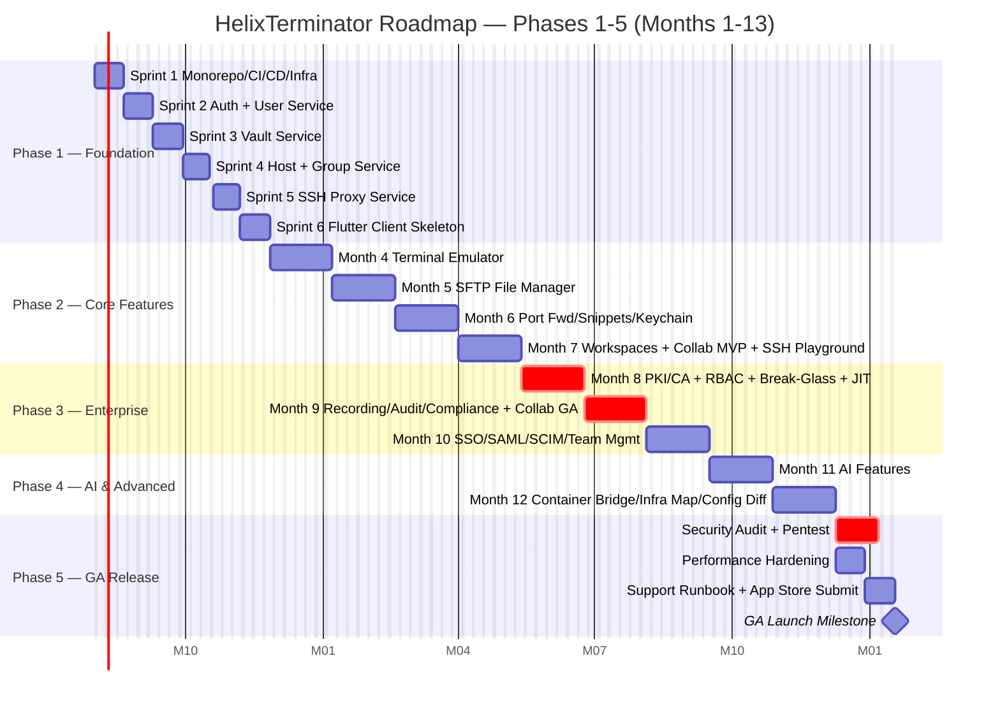
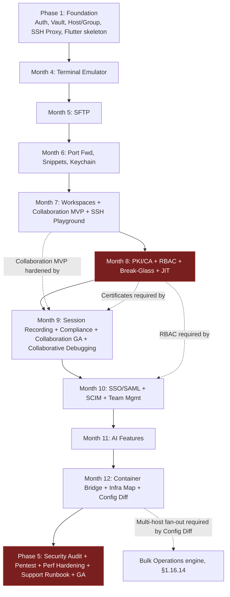

# HelixTerminator — Product Roadmap, Feature Specifications, Use Cases & Edge Cases

**Document version:** 1.0  
**Date:** June 28, 2026  
**Status:** Living Document — Updated Every Sprint  
**Owner:** Product Engineering, HelixTerminator

---

## Table of Contents

1. [Complete Feature Comparison: Termius vs HelixTerminator](#1-complete-feature-comparison-termius-vs-helixterminator)
2. [Development Phases & Sprint Plans](#2-development-phases--sprint-plans)
3. [Complete Use Case Specifications](#3-complete-use-case-specifications)
4. [Edge Cases & Failure Modes](#4-edge-cases--failure-modes)
5. [Performance Benchmarks & Targets](#5-performance-benchmarks--targets)
6. [Monitoring & Alerting Rules](#6-monitoring--alerting-rules)
7. [Innovation Roadmap](#7-innovation-roadmap)

---

## 1. Complete Feature Comparison: Termius vs HelixTerminator

### 1.1 Overview Philosophy

Termius is an established SSH client with a polished cross-platform experience that has earned trust among millions of individual developers. However, it was designed primarily for individual productivity—enterprise requirements, compliance mandates, and the security posture of modern platform engineering teams were retrofitted rather than native. HelixTerminator is architected from the ground up for the complete spectrum: solo developer, startup team, and regulated enterprise. Every feature described below has been benchmarked against Termius's production behavior as of mid-2026.

---

### 1.2 SSH Client

| Dimension | Termius | HelixTerminator | Advantage |
|---|---|---|---|
| Core SSH Protocol | SSHv2 only | SSHv2 + SSHv1 compatibility shim (read-only, for legacy) | HT |
| Password Authentication | Yes | Yes + breach-detection warning via HaveIBeenPwned API | HT |
| Public-Key Authentication | RSA, ECDSA, Ed25519 | RSA, ECDSA, Ed25519, ECDSA-SK, Ed25519-SK | HT |
| SSH Certificate Authentication | Not supported | Full X.509-style SSH certificates, CA-signed, short-lived | HT |
| FIDO2 / Hardware Key | Not supported | YubiKey 5, SoloKey, FIDO2 resident keys, PIN verification | HT |
| Certificate Validity Window | N/A | Configurable: 1 hour – 30 days, default 8 hours | HT |
| SSH Agent Forwarding | Yes | Yes + agent-forwarding audit log, per-hop control | HT |
| Keep-Alive | Configurable | Configurable + adaptive (monitors session activity pattern) | HT |
| Connection Multiplexing | No | Yes (ControlMaster-equivalent, configurable per host) | HT |
| Custom SSH Options | Limited | Full ssh_config key-value pass-through per host/group | HT |
| SSH Banner Display | Yes | Yes + banner policy: warn/block on compliance keywords | HT |
| Host Tagging | No | Yes — tag hosts with environments, teams, custom labels | HT |
| Connection Templates | Limited (groups) | Yes — fully parameterized templates with variable substitution | HT |
| AI Connection Assistant | No | Yes — suggests optimal settings based on latency/OS fingerprint | HT |
| Offline Mode | Partial | Full offline vault + cached host metadata, resync on reconnect | HT |

**HelixTerminator SSH Client — Detailed Specification:**

**SSH Certificate Authentication (P0):**  
HelixTerminator embeds a full SSH Certificate Authority (CA) service. Users request short-lived certificates signed by the team CA. The certificate encodes principals (allowed usernames), validity window, and optional extensions (permit-port-forwarding, permit-pty). Certificates are automatically renewed 15 minutes before expiry. Administrators can revoke individual certificates via a CRL or OCSP endpoint. This eliminates the need to distribute static public keys across all servers — only the CA public key needs to be trusted.

**FIDO2 Hardware Key Support (P0):**  
Registration follows the WebAuthn/FIDO2 standard. The client generates a resident key on the hardware token keyed to the HelixTerminator origin. Authentication uses a challenge-response over the HID/USB/NFC transport. SSH authentication itself uses the ecdsa-sk or ed25519-sk key type. The hardware key is required for all privilege-escalation actions (break-glass, JIT access) regardless of session state.

**AI Connection Assistant (P2):**  
On first connection to a new host, the AI assistant (running locally via HelixLLM) analyzes latency samples, SSH server fingerprint, and banner to suggest: optimal cipher suite, compression setting, keep-alive interval, and whether Mosh would improve the experience. Suggestions are presented as a one-click "Apply recommended settings" dialog.

---

### 1.3 SFTP

| Dimension | Termius | HelixTerminator | Advantage |
|---|---|---|---|
| Basic File Transfer | Yes | Yes | Equal |
| Drag-and-Drop Upload | Yes | Yes | Equal |
| Resume Interrupted Transfer | No | Yes — chunked transfer with byte-range resume | HT |
| Bidirectional Sync | No | Yes — two-way sync with conflict resolution UI | HT |
| Conflict Resolution | N/A | Manual (keep local/remote/both) + auto-rules per folder | HT |
| Compression | No | Yes — zlib on-the-fly, configurable threshold (>1MB default) | HT |
| Transfer Queue | Basic | Priority queue, pause/resume individual items | HT |
| Large File Support | Limited (browser memory) | Streaming chunked I/O, tested to 500GB | HT |
| File Permission Editor | No | Yes — chmod, chown, chgrp with octal and symbolic UI | HT |
| Symbolic Link Handling | Follow only | Follow / expose / skip — configurable per operation | HT |
| File Diff Viewer | No | Yes — built-in text diff (unified diff), binary diff indicator | HT |
| Transfer Logs | Basic | Searchable, exportable CSV, tamper-proof hash chain | HT |
| Scheduled Transfers | No | Yes — cron-expression scheduler with alerting | HT |
| Multi-Hop SFTP | Not supported | Yes — SFTP through jump host chain | HT |

**HelixTerminator SFTP — Bidirectional Sync Specification:**

Sync sessions are defined by a local directory, a remote directory, and a sync policy. Policies include: `mirror-local-to-remote`, `mirror-remote-to-local`, `two-way-with-conflict-resolution`, and `two-way-last-write-wins`. The sync engine computes a Merkle tree of file hashes on both sides before transferring, minimizing unnecessary data movement. Conflict detection uses modified-time + size + content hash (SHA-256). The UI presents conflicts in a three-panel diff view (local, remote, base). Users may resolve conflicts individually or apply a blanket rule. Resolved conflict choices are logged to the transfer audit log.

---

### 1.4 Port Forwarding

| Dimension | Termius | HelixTerminator | Advantage |
|---|---|---|---|
| Local Port Forward | Yes | Yes | Equal |
| Remote Port Forward | Yes | Yes | Equal |
| Dynamic SOCKS5 | Yes | Yes | Equal |
| Visual Tunnel Manager | No | Yes — topology diagram showing all active tunnels | HT |
| Tunnel Groups | No | Yes — launch/stop all tunnels in a group atomically | HT |
| Auto-Restart on Drop | No | Yes — exponential backoff with configurable max retries | HT |
| Tunnel Health Check | No | Yes — periodic connectivity check on forwarded port | HT |
| Named Tunnels | No | Yes — human-readable names, searchable, taggable | HT |
| Tunnel Templates | No | Yes — parameterized templates (e.g., "PostgreSQL via bastion") | HT |
| Audit Log for Tunnels | No | Yes — open/close events with duration in audit trail | HT |
| Traffic Metrics | No | Yes — bytes in/out per tunnel, graphed over time | HT |
| VPN Mode | No | Yes — expose multiple tunnels as a virtual network interface | HT |
| Multi-Hop Forwarding | Basic | Yes — full multi-hop with per-hop ACL | HT |

**Visual Tunnel Manager Specification:**

The tunnel manager renders a real-time topology graph (SVG, GPU-accelerated via Flutter's Impeller engine) showing: client node, jump hosts in the chain, target host, and the forwarded port endpoints. Each tunnel is color-coded by status (active=green, error=red, degraded=amber). Users can drag to reorder jump hosts, click a node to see connection details, and right-click a tunnel to clone, pause, or delete it. The graph auto-layouts using a Sugiyama algorithm to avoid edge crossings. Topology state is persisted to the local vault so that the same setup is available after restart.

---

### 1.5 Vault

| Dimension | Termius | HelixTerminator | Advantage |
|---|---|---|---|
| Encrypted Storage | AES-256 | AES-256-GCM + ChaCha20-Poly1305 (algorithm negotiated) | HT |
| Zero-Knowledge Architecture | No (server can decrypt) | Yes — client-side key derivation (Argon2id), server never sees plaintext | HT |
| Key Derivation | PBKDF2 | Argon2id (memory: 64MB, iterations: 3, parallelism: 4) | HT |
| Team Vault | Yes (limited) | Yes — per-vault, per-group, per-item RBAC | HT |
| Granular RBAC | No | Yes — read / write / share / admin per principal | HT |
| Item-Level Sharing | No | Yes — share individual credentials with expiry | HT |
| Vault Key Rotation | Manual | Yes — zero-downtime online re-encryption with progress UI | HT |
| Offline Access | Limited | Yes — encrypted local replica, conflict-free sync (CRDT) | HT |
| Vault Backup | Manual export | Yes — scheduled encrypted backup to S3/GCS/Azure Blob | HT |
| Emergency Recovery | Recovery code | Recovery code + guardian key (Shamir Secret Sharing, 3-of-5) | HT |
| Breach Detection | No | Yes — password hashes checked against HaveIBeenPwned k-anon API | HT |
| Vault Audit Log | No | Yes — every read/write/share event logged immutably | HT |
| Item History | No | Yes — 90-day version history per credential item | HT |
| Vault Size Limit | 10,000 items (Pro) | Unlimited (Enterprise), 50,000 items (Team), 5,000 (Individual) | HT |

**Zero-Knowledge Vault Architecture:**

1. Master password → Argon2id → 256-bit Master Key (MK)
2. MK + random 256-bit salt → HKDF → Vault Encryption Key (VEK)
3. VEK encrypts each vault item using AES-256-GCM with a random 96-bit nonce
4. VEK itself is encrypted with MK and stored in the user's vault record
5. For team sharing: item is re-encrypted with a Vault Shared Key (VSK) using X25519 Diffie-Hellman. Each team member holds the VSK encrypted with their own public key.
6. The server stores only ciphertext + metadata (item ID, owner, timestamps). The server cannot derive MK, VEK, or VSK.
7. Key rotation: a new VEK is generated, all items are re-encrypted client-side in a background worker, then atomically committed to the server.

---

### 1.6 Workspaces

| Dimension | Termius | HelixTerminator | Advantage |
|---|---|---|---|
| Multi-Pane Layout | Yes (4 panes) | Yes — unlimited panes, saved layouts | HT |
| Session Count Limit | 4 (free), 8 (Pro) | Unlimited sessions per workspace (hardware-limited) | HT |
| GPU Terminal Rendering | No (CPU) | Yes — Flutter Impeller, 60fps smooth scroll, 1M lines/sec | HT |
| Workspace Templates | No | Yes — save/restore full workspace with host assignments | HT |
| Workspace Sharing | No | Yes — share workspace template with team | HT |
| Named Workspaces | Yes | Yes | Equal |
| Tab Groups | No | Yes — logical tab groups within workspace | HT |
| Workspace Scripting | No | Yes — on-open scripts per workspace pane | HT |
| Workspace Lock | No | Yes — lock workspace to prevent accidental tab close | HT |
| Cross-Device Sync | Limited | Yes — full workspace state synced via encrypted vault | HT |
| Hotkey Navigation | Limited | Yes — fully remappable, vim-like navigation option | HT |

---

### 1.7 Terminal Multiplayer (Collaborative Terminal)

| Dimension | Termius | HelixTerminator | Advantage |
|---|---|---|---|
| Session Sharing | Yes (basic) | Yes + RBAC roles per participant | HT |
| Observer Mode | No | Yes — read-only observer, unlimited observers | HT |
| Participant RBAC | No | Yes — owner / editor / observer roles | HT |
| Session Recording | No | Yes — full TTY recording, AsciiCast v2 format | HT |
| Session Replay | No | Yes — in-app replay with speed control (0.25x–10x) | HT |
| Voice Chat Integration | No | Yes — optional WebRTC voice channel per session | HT |
| Pointer Sharing | No | Yes — participant cursors shown (color-coded) | HT |
| Live Chat | No | Yes — in-session text chat overlay | HT |
| Session Invitation | Link | Link + QR code + email invite | HT |
| Permission Change Mid-Session | No | Yes — owner can promote/demote mid-session | HT |
| Session Expiry | No | Yes — time-limited session invitations | HT |
| End-to-End Encryption | No | Yes — WebRTC DTLS, SRTP for voice | HT |
| Compliance Recording Policy | No | Yes — admin-enforced mandatory recording for groups | HT |

---

### 1.8 Snippets

| Dimension | Termius | HelixTerminator | Advantage |
|---|---|---|---|
| Basic Command Snippets | Yes | Yes | Equal |
| Variable Substitution | No | Yes — `{{variable_name}}` with type, default, description | HT |
| Required Parameters | No | Yes — typed parameters with validation (int, string, enum, secret) | HT |
| AI-Generated Snippets | No | Yes — describe in English, AI generates the bash/zsh snippet | HT |
| Snippet Library | No | Yes — curated library of 200+ community snippets | HT |
| Snippet Versioning | No | Yes — git-style history per snippet | HT |
| Snippet Chaining | No | Yes — execute snippets in sequence, pipe output as input | HT |
| Bulk Execution | No | Yes — run on 1000+ hosts simultaneously with live output | HT |
| Output Capture | No | Yes — capture stdout/stderr, store in vault or export | HT |
| Dry Run Mode | No | Yes — render the final command without executing | HT |
| Snippet Scheduling | No | Yes — cron-based snippet execution | HT |
| Access Control | No | Yes — restrict snippet execution to specific groups | HT |
| Import from Runbook | No | Yes — import from Confluence/Notion pages | HT |

**Snippet Variable System Specification:**

Each snippet may declare zero or more input variables in a YAML front-matter block:
```yaml
---
name: Restart Application Service
description: Restarts a named systemd service and tails the log
variables:
  - name: service_name
    type: string
    required: true
    description: "Name of the systemd service (e.g. nginx)"
    validation: "^[a-zA-Z0-9_-]+$"
  - name: tail_lines
    type: integer
    required: false
    default: 50
    description: "Number of log lines to tail after restart"
    min: 1
    max: 1000
  - name: confirm_restart
    type: boolean
    required: false
    default: false
    description: "Add --no-block flag to systemctl"
---
sudo systemctl restart {{service_name}} {{#if confirm_restart}}--no-block{{/if}}
sleep 1
journalctl -u {{service_name}} -n {{tail_lines}} --no-pager
```

When the snippet is executed, a parameter UI is shown pre-execution. Parameters are validated client-side before the rendered command is transmitted to the remote host. Secret-typed parameters are masked in UI and not stored in execution logs.

---

### 1.9 Keychain

| Dimension | Termius | HelixTerminator | Advantage |
|---|---|---|---|
| Key Storage | Local encrypted | Local + vault encrypted (zero-knowledge) | HT |
| Key Types | RSA, ECDSA, Ed25519 | RSA, ECDSA, Ed25519, ECDSA-SK, Ed25519-SK, X.509 certs | HT |
| SSH Certificate Authority | No | Yes — built-in CA, sign keys, manage principals | HT |
| Hardware Key Integration | Limited | Full FIDO2/PKCS#11 hardware key support | HT |
| Key Deployment | Manual | One-click deploy to selected hosts / groups | HT |
| Key Rotation Workflow | No | Yes — generate new key, deploy, verify, retire old | HT |
| Certificate Lifecycle | N/A | Issue, renew, revoke, CRL publication, OCSP | HT |
| Passphrase Management | Yes | Yes + option to store passphrase in vault securely | HT |
| Key Audit | No | Yes — which hosts each key has been used to authenticate | HT |
| Key Expiry Alerts | No | Yes — alert 30/7/1 days before certificate expiry | HT |
| Key Sharing | No | Yes — share public key / CA cert with team (never private key) | HT |
| Bulk Deployment | No | Yes — deploy key to 100+ hosts in parallel | HT |

---

### 1.10 Session Logs

| Dimension | Termius | HelixTerminator | Advantage |
|---|---|---|---|
| Session History | Yes (limited) | Yes — full metadata per session | HT |
| Terminal Recording | No | Yes — AsciiCast v2 + proprietary binary format | HT |
| Searchable Logs | No | Yes — full-text search across all session recordings | HT |
| Exportable Logs | CSV only | CSV, JSON, AsciiCast, PDF (redacted) | HT |
| Tamper-Proof Audit | No | Yes — SHA-256 hash chain, each recording signed | HT |
| Log Retention Policy | Manual | Yes — configurable retention (30d / 90d / 1yr / infinite) | HT |
| Compliance Export | No | Yes — SOC2, ISO27001, HIPAA-formatted exports | HT |
| Log Anonymization | No | Yes — PII scrubbing for GDPR-compliant exports | HT |
| Alert on Keywords | No | Yes — alert when sensitive keywords appear in session | HT |
| Session Forensics | No | Yes — reconstruct exact terminal state at any point in time | HT |

---

### 1.11 AI Autocomplete

| Dimension | Termius | HelixTerminator | Advantage |
|---|---|---|---|
| Basic Autocomplete | Yes (recent commands) | Yes + context-aware completions | HT |
| AI Command Suggestions | Yes (cloud-only) | Yes — cloud + local inference (HelixLLM) | HT |
| Offline Mode | No | Yes — local Llama-3 8B model, quantized GGUF | HT |
| Multi-Model Support | 1 model | GPT-4o, Claude 3.5, Gemini 2.0, HelixLLM (local) | HT |
| Context Window | Command history | Command history + current directory + running processes + OS | HT |
| Command Explainer | No | Yes — explain any command in plain English | HT |
| Error Diagnosis | No | Yes — AI diagnoses stderr output and suggests fix | HT |
| Snippet Generation | No | Yes — generate snippet from natural language description | HT |
| Security Check | No | Yes — warns on dangerous commands (rm -rf, chmod 777) | HT |
| Shell Support | bash | bash, zsh, fish, PowerShell | HT |
| Privacy Mode | No | Yes — local-only inference, nothing sent to cloud | HT |

---

### 1.12 Mosh Support

| Dimension | Termius | HelixTerminator | Advantage |
|---|---|---|---|
| Mosh Protocol | Yes (external binary) | Yes — native Go Mosh implementation embedded | HT |
| Local Mosh Proxy | No | Yes — bundled mosh-server proxy, no server install needed for clients | HT |
| Automatic Fallback | No | Yes — falls back to SSH if Mosh unavailable, transparent | HT |
| Roaming Support | Yes | Yes | Equal |
| UDP Firewall Detection | No | Yes — detects UDP blocking, prompts Mosh-over-TCP fallback | HT |
| Mosh Session Recording | No | Yes — records Mosh sessions same as SSH | HT |

---

### 1.13 Jump Hosts

| Dimension | Termius | HelixTerminator | Advantage |
|---|---|---|---|
| Single Jump Host | Yes | Yes | Equal |
| Multi-Hop Chain | Yes (2 hops) | Yes — unlimited hops, graphically configured | HT |
| Dynamic Proxy | No | Yes — SOCKS5 proxy at any hop in the chain | HT |
| Jump Host Groups | No | Yes — define groups of interchangeable jump hosts (HA) | HT |
| Jump Host Health | No | Yes — monitor jump host availability, auto-failover | HT |
| Per-Hop Authentication | Limited | Yes — different auth method per hop | HT |
| Chain Templates | No | Yes — save and share jump chains | HT |
| Audit Logging | No | Yes — logs each hop traversal separately | HT |

---

### 1.14 Groups

| Dimension | Termius | HelixTerminator | Advantage |
|---|---|---|---|
| Basic Groups | Yes | Yes | Equal |
| Nested Hierarchy | No | Yes — unlimited nesting depth | HT |
| Inheritance | Partial | Yes — settings, auth, snippets inherited down the tree | HT |
| RBAC Per Group | No | Yes — role assignments scoped to individual groups | HT |
| Group Templates | No | Yes — deploy group structure across organizations | HT |
| Dynamic Groups | No | Yes — auto-assign hosts by tag/label rules | HT |
| Group Audit | No | Yes — who accessed what group and when | HT |
| Group Import | No | Yes — import group structure from LDAP/Active Directory | HT |

---

### 1.15 Known Hosts

| Dimension | Termius | HelixTerminator | Advantage |
|---|---|---|---|
| Known Hosts Management | Basic | Yes — UI + CLI management | HT |
| CA-Based Verification | No | Yes — trust CA certificates instead of individual host keys | HT |
| Host Key Rotation Detection | Yes | Yes + diff view of old vs new key | HT |
| Bulk Management | No | Yes — import/export, bulk delete, search | HT |
| Key Pinning | No | Yes — pin a host key and alert on any change | HT |
| Central Management | No | Yes — enterprise-wide known hosts policy pushed to all clients | HT |
| Expiry-Based Trust | No | Yes — CA-issued host certificates with validity window | HT |

---

### 1.16 HelixTerminator-Only Features

#### 1.16.1 Built-in SSH Certificate Authority (CA)

A fully integrated PKI service. The CA private key is stored in an HSM-backed secrets manager (AWS CloudHSM, Azure Dedicated HSM, or on-prem PKCS#11 token). Administrators define principals, validity windows, and certificate extensions via the CA policy editor. Developers request certificates via `helix cert request`, which sends a CSR to the CA service. The CA service validates the requester's identity against the team RBAC, signs the certificate, and returns it to the client. The client caches the certificate and auto-renews 15 minutes before expiry.

#### 1.16.2 HelixTrack Integration

Every SSH session can be linked to a ticket in HelixTrack (the companion project management tool) or external trackers (Jira, GitHub Issues, Linear, ServiceNow). When a developer opens a session to a production host, they are prompted to select a related ticket. The session duration, commands run, and files transferred are attached to the ticket as an activity entry. This creates a full audit trail linking infrastructure actions to business intent. SREs can view "all sessions opened during incident INC-4521" directly from the ticket.

#### 1.16.3 Session Replay

Every recorded session is stored in a proprietary binary format with 1ms-resolution timestamps. The replay player supports: variable speed (0.25x–16x), scrubbing by time or by command, jump-to-command (list of detected commands as chapter markers), search within recording (highlight matches across timeline), snapshot export (capture terminal state as PNG at any moment), and annotation (add timestamped notes visible during replay). Replay is fully accessible: screen reader compatible, color-override for color blindness modes.

#### 1.16.4 Container Terminal Bridge

HelixTerminator can connect directly to containers without requiring SSH inside them. Supported backends: Docker (unix socket or TCP), Kubernetes (API server), AWS ECS (SSM Agent), Google Cloud Run (Cloud Shell API), Podman. The bridge uses the native container exec API, not SSH, so it works on minimal containers that do not have sshd installed. Authentication uses the same RBAC as SSH connections. Sessions through the container bridge are recorded with the same session recording infrastructure as SSH sessions.

#### 1.16.5 AI Command Explainer

The user selects any command or output in the terminal and invokes the explainer (Cmd+E / Ctrl+E). The AI model (cloud or local) receives the selected text plus the preceding 20 lines of context. The response is displayed in a right-side drawer as a structured explanation: command breakdown (each flag/argument explained), expected side effects, potential dangers, related commands, and a safe-to-run assessment. The explainer also handles multi-line scripts, AWK/sed patterns, and complex pipelines.

#### 1.16.6 Collaborative Debugging

An extension of the collaborative terminal that adds structured debugging context: shared environment variables panel, shared watch expressions (monitors output of specific commands), shared notes, and optional WebRTC voice channel. The session initiator can mark specific terminal output as "evidence" which is collected into a shared incident timeline. Collaborators can annotate any portion of the shared terminal output. The full collaborative debugging session can be exported as a Markdown incident report.

#### 1.16.7 Compliance Mode

Administrators can enforce Compliance Mode on specific host groups. In Compliance Mode: all sessions are mandatorily recorded (cannot be disabled by user), recordings are transmitted in real-time to a compliance store (not just at session end), recording integrity is verified with HMAC-SHA256, sensitive command detection alerts are active, sudo usage triggers a real-time notification to the security team, and session termination is blocked until the recording upload completes. Compliance Mode is required for PCI DSS Level 1, HIPAA, FedRAMP Moderate, and SOC 2 Type II environments.

#### 1.16.8 Break-Glass Emergency Access

For production systems where normal access is restricted, Break-Glass Access allows emergency escalation with mandatory dual approval. Flow: requesting engineer submits a break-glass request with justification; two of a pre-configured approval group (on-call manager + security officer) approve via push notification; access is granted for a configurable window (default 1 hour); all activity is recorded; access expires automatically; a post-incident review task is created in HelixTrack. The entire flow is audited with immutable records.

#### 1.16.9 Just-in-Time (JIT) Access

JIT Access provisions temporary elevated access to a server or group, activated by a time-limited policy. Unlike Break-Glass (emergency), JIT is workflow-driven: a developer submits a JIT request with a ticket reference, the policy engine evaluates it against predefined rules (time-of-day, approver tier, host sensitivity), access is granted for exactly the requested window, and SSH certificates issued during this window encode the escalated principal. When the window closes, all active sessions receive a 5-minute warning and are then terminated.

#### 1.16.10 Infrastructure Map

A real-time topology visualization of all known hosts and their relationships. The map shows: servers grouped by environment (dev/staging/prod), network connectivity (which servers can reach which via SSH), active sessions (highlighted edges), recent alerts (red nodes), and resource utilization heatmap. The map is interactive: click a node to see host details, right-click to open a terminal, drag to rearrange, zoom in/out. Data is assembled from host metadata, monitoring agents, and optional Terraform/Pulumi state file import.

#### 1.16.11 Performance Dashboard

An agent-based monitoring system where a lightweight HelixAgent (< 5MB binary, written in Go) runs on each managed server. The agent reports CPU, memory, disk I/O, network I/O, and top processes every 10 seconds via a streaming gRPC connection to the HelixTerminator backend. The Performance Dashboard shows all monitored hosts in a grid or list, sortable by any metric, with sparklines for trend visualization. Alerts are configurable per-host or per-group: CPU > 90% for 5 minutes, free disk < 10%, etc.

#### 1.16.12 Automated Health Checks

A snippet can be marked as a "Health Check" and scheduled to run periodically on one or more host groups. The health check captures exit code and stdout/stderr, compares against expected patterns (regex), and triggers an alert if the check fails. Multiple consecutive failures are required before alerting (configurable, default 3). Alert channels: in-app, email, Slack, PagerDuty, OpsGenie. Health checks are stored in version control-style history, so you can see when a check first started failing.

#### 1.16.13 SSH Playground

An embedded sandboxed SSH environment for learning and practice. The playground provisions an ephemeral container (Alpine Linux or Ubuntu, user choice) accessible via the standard HelixTerminator SSH client. Users can experiment with commands without risk. Guided scenarios are available: "Set up a web server", "Configure SSH keys", "Write your first shell script". The playground session auto-terminates after 2 hours of inactivity or 24 hours absolute. Progress is saved between sessions (the container filesystem is snapshotted).

#### 1.16.14 Bulk Operations

The bulk operations engine allows a snippet to be dispatched to a dynamically selected set of hosts simultaneously. Host selection supports: manual multi-select, group-based selection, tag-based selection, and query-based selection (e.g., "all production hosts in region=us-east-1"). The engine establishes concurrent SSH connections (throttled by configurable concurrency limit, default 200 simultaneous), streams output from each host in real-time, and aggregates results. Each host's output is collapsible. Failed hosts are highlighted. Results can be exported to CSV/JSON.

#### 1.16.15 Config Diff

The Config Diff feature connects to a set of selected hosts, reads a target file (e.g., `/etc/ssh/sshd_config`, `/etc/nginx/nginx.conf`), and renders a multi-host diff showing which hosts have deviations from a baseline. The baseline can be: the first host, a nominated "golden" host, or a committed config file in a Git repository. Diff is presented line-by-line with hosts as columns. One-click remediation: push the baseline config to all deviating hosts as a snippet execution with preview and confirmation.

---
## 2. Development Phases & Sprint Plans

### 2.0 Engineering Principles

All development follows these non-negotiable principles:
- **Test-First:** Every P0 feature has unit tests before implementation begins.
- **Security by Default:** OWASP Top 10 checks in every PR via automated scanner.
- **Observability First:** Every service emits structured logs, metrics (Prometheus), and traces (OpenTelemetry) from day one.
- **Definition of Done (Global):** Code reviewed, unit tests passing, integration tests passing, documentation updated, feature flag added, telemetry instrumented, security checklist passed.
- **Tech Stack:** Go 1.25 (backend microservices), Flutter 3.24 (cross-platform client), PostgreSQL 17.2 (primary store), Redis 8 (cache/pub-sub), Apache Kafka 3.9 (event streaming), Kubernetes 1.31 (orchestration), Istio 1.22 (service mesh), gRPC (inter-service), REST + WebSocket (client-facing API).

---

### 2.1 Phase 1: Foundation (Months 1–3)

**Phase Goal:** Establish a secure, observable, testable monorepo skeleton with user authentication, vault, host management, and a working Flutter client shell.

---

#### Sprint 1 (Week 1–2): Monorepo, CI/CD, Infrastructure Skeleton

**Deliverables:**
1. Monorepo structure established (`/services`, `/client`, `/shared`, `/infra`, `/tools`, `/docs`)
2. Go workspace file (`go.work`) configured for all service modules
3. Flutter project scaffolded under `/client/flutter` with flavor configuration (dev/staging/prod)
4. GitHub Actions CI pipeline: lint (golangci-lint, dart analyze), test (go test, flutter test), build (multi-arch Docker), security scan (gosec, Trivy)
5. Kubernetes base manifests (Kustomize overlays for dev/staging/prod)
6. Helm charts skeleton for all planned services
7. Makefile with standard targets: `make test`, `make build`, `make deploy-dev`
8. Pre-commit hooks: gofmt, goimports, dart format, secret detection (detect-secrets)
9. Dependency management: Renovate bot configured for automated dependency PRs
10. Infrastructure as Code: Terraform modules for VPC, RDS, Redis, Kafka, EKS (AWS primary)
11. GitHub repository with branch protection: require 2 reviewers, require CI pass, no force push to main/develop
12. Developer environment: Docker Compose stack (`docker-compose.dev.yml`) runs all dependencies locally

**Acceptance Criteria:**
- `make test` passes on a fresh checkout in under 5 minutes
- `make build` produces Docker images for linux/amd64 and linux/arm64
- CI pipeline runs on every PR and blocks merge on failure
- `docker-compose up` starts full local stack (all dependencies) in under 2 minutes
- Trivy scan reports zero critical CVEs in base images
- All secrets use environment variables; no hard-coded credentials in any committed file

**Test Requirements:**
- CI pipeline itself tested via workflow dispatch with intentional failures
- Trivy scan threshold set: fail on CRITICAL, warn on HIGH

**Definition of Done:**
- [ ] Monorepo structure documented in `docs/architecture/monorepo.md`
- [ ] All CI stages passing on `main` branch
- [ ] At least 2 engineers have successfully run the local dev stack from scratch

---

#### Sprint 2 (Week 3–4): Auth Service + User Service Core

**Deliverables:**
1. **Auth Service** (`/services/auth`):
   - User registration (email + password)
   - Login with JWT issuance (access token: 15m, refresh token: 30d, rotation on use)
   - Argon2id password hashing (memory=65536, iterations=3, parallelism=4)
   - TOTP MFA enrollment and verification (RFC 6238 compliant)
   - Rate limiting: 15 failed login attempts triggers 30-minute lockout per IP+account
   - Account lockout notification (email)
   - Password reset flow (time-limited signed URL, 1-hour expiry)
   - Audit event emission to Kafka topic `auth.events`
   - gRPC API for inter-service auth validation
   - REST API for client-facing auth endpoints
2. **User Service** (`/services/user`):
   - User profile CRUD (name, email, avatar URL, timezone, preferences)
   - Organization creation and membership (user may belong to multiple orgs)
   - Basic role assignment (owner, admin, member, viewer) per organization
   - User deactivation workflow (sets `deactivated_at`, revokes active tokens)
   - Email verification on signup
   - Soft-delete with 30-day hard-delete scheduled job (GDPR)
3. **Shared auth middleware** for all services: JWT validation, role extraction, request context enrichment
4. **Integration tests** covering all happy paths and 10 key error paths

**Acceptance Criteria:**
- Given a valid email/password, When POST /auth/login is called, Then a 200 response with access_token and refresh_token is returned in under 100ms (p99)
- Given an invalid password, When POST /auth/login is called 15 times in 30 minutes, Then the 16th attempt returns 429 with retry-after header
- Given a valid refresh token, When POST /auth/refresh is called, Then a new token pair is issued and the old refresh token is invalidated
- Given TOTP is enrolled, When login is attempted without TOTP code, Then a 401 with `mfa_required` is returned
- Passwords are stored as Argon2id hashes — verified by inspecting the database record directly

**Test Requirements:**
- Unit tests: 90%+ line coverage on auth and user service handlers
- Integration tests: full login/refresh/logout/lockout flows against real PostgreSQL
- Fuzz testing on token parsing to detect panics

**Definition of Done:**
- [ ] Auth and User services deployed to dev Kubernetes cluster
- [ ] All integration tests passing in CI
- [ ] Security review checklist completed (OWASP A07:2021 – Identification and Authentication Failures)
- [ ] Structured logs for every auth event confirmed in Grafana Loki

---

#### Sprint 3 (Week 5–6): Vault Service (Encryption, CRUD)

**Deliverables:**
1. **Vault Service** (`/services/vault`):
   - Vault creation (personal and team)
   - Zero-knowledge encryption model implemented client-side (client SDK in Dart for Flutter)
   - Item CRUD: hosts, SSH keys, passwords, notes, certificates
   - Item categorization and tagging
   - Vault sharing: generate VSK (Vault Shared Key) encrypted with invitee's public key
   - RBAC on vault items: read / write / share / admin
   - Item version history (store last 90 days of versions)
   - Vault sync API (list changes since timestamp, conflict detection)
   - Offline-capable CRDT-based conflict resolution (LWW-Element-Set for item deletions, per-field LWW for updates)
   - Vault audit log: every access, modification, and share event logged to PostgreSQL + emitted to Kafka `vault.events`
2. **Client-Side Crypto SDK** (`/client/sdk/crypto`):
   - Dart implementation of Argon2id KDF
   - AES-256-GCM encryption/decryption
   - X25519 key exchange for vault sharing
   - HKDF key derivation
   - Unit tests with known-answer test vectors

**Acceptance Criteria:**
- Given a master password, When a vault is created, Then encrypted vault data stored on server cannot be decrypted without the master password (verified by attempting decryption with a different password)
- Given vault data modified on two devices simultaneously, When both sync, Then conflict is detected and both versions preserved with metadata allowing resolution
- Vault item version history stores 90 days of changes; oldest versions are purged by a background job
- A revoked vault member cannot access any vault items via the API (verified with their JWT after revocation)

**Test Requirements:**
- Cryptographic operations tested with NIST and RFC test vectors
- Fuzzing on Vault sync endpoint (malformed payloads must not cause data corruption)
- Load test: 1000 concurrent vault sync operations, p99 latency < 200ms

**Definition of Done:**
- [ ] Zero-knowledge architecture documented and reviewed by 1 external cryptography expert
- [ ] Client-side crypto SDK has 100% unit test coverage
- [ ] Vault service deployed to dev cluster with integration tests green

---

#### Sprint 4 (Week 7–8): Host Service + Group Service

**Deliverables:**
1. **Host Service** (`/services/host`):
   - Host CRUD (hostname/IP, port, username, auth method reference, tags, notes)
   - Host import: parse `~/.ssh/config` format, import hosts in bulk
   - Host export: export to `~/.ssh/config` format
   - Host search: full-text search on hostname, IP, tags, notes (PostgreSQL pg_trgm)
   - Host connection test: verify reachability (ping + TCP connect to SSH port)
   - Host fingerprint storage and change detection
   - Host metadata: OS type (auto-detected), last connected, connection count
2. **Group Service** (`/services/group`):
   - Group CRUD with unlimited nesting (adjacency list model in PostgreSQL)
   - Host assignment to group (many-to-many)
   - Settings inheritance: SSH options, connection timeout, snippet sets, RBAC roles
   - Dynamic groups: define filter rules (tag-based), auto-assign hosts matching rules
   - Group import from LDAP/AD (LDAP query mapped to group hierarchy)
   - RBAC: assign roles to users/teams at the group level

**Acceptance Criteria:**
- A host group with 5 levels of nesting correctly inherits SSH timeout from the root group
- Full-text search on 10,000 hosts returns results in under 100ms
- Importing 500 hosts from a `~/.ssh/config` file completes in under 5 seconds
- Dynamic groups re-evaluate membership rules within 30 seconds of a host's tags changing

**Test Requirements:**
- Property-based tests for group hierarchy logic (no cycles, correct path computation)
- Performance test: host list API with 100,000 hosts, expect p99 < 500ms

**Definition of Done:**
- [ ] Host and Group services deployed to dev cluster
- [ ] Performance tests documented with results stored in `docs/performance/sprint4.md`
- [ ] Integration tests cover all CRUD operations, search, and import/export

---

#### Sprint 5 (Week 9–10): SSH Proxy Service (Basic Connect/Auth)

**Deliverables:**
1. **SSH Proxy Service** (`/services/ssh-proxy`):
   - WebSocket-to-SSH bridge: accept WebSocket connections from Flutter client, establish SSH connections to target hosts
   - Authentication methods: password, public key (RSA, ECDSA, Ed25519)
   - Jump host support: single-hop (direct ProxyJump equivalent)
   - PTY allocation and terminal resize (SIGWINCH propagation)
   - Session metadata tracking: start time, host, user, auth method, client IP
   - Session event emission to Kafka `ssh.sessions` topic
   - Connection pooling: reuse existing SSH connections to the same host for new channels
   - Graceful session termination with cleanup
   - Circuit breaker: if a host fails 5 consecutive connections, temporarily block further attempts with exponential backoff
2. **Terminal Protocol:**
   - Client sends resize events, input (keypresses), and control signals over WebSocket
   - Server streams terminal output (stdout+stderr combined as TTY output) back to client
   - Binary framing protocol: type byte (input/output/resize/control) + length-prefixed payload

**Acceptance Criteria:**
- Given a valid host configuration, When a developer initiates an SSH connection, Then a PTY session is established within 500ms on LAN
- Given a terminal resize event, When the user resizes the app window, Then the remote PTY is resized within 50ms
- Given a network interruption lasting < 30 seconds, When the network recovers, Then the proxy attempts reconnection automatically (with user notification)
- Given a host unreachable, When connection is attempted, Then an informative error message is shown within the connection timeout (default 10s)

**Test Requirements:**
- Integration tests using a locally running OpenSSH server in Docker
- Chaos test: kill the SSH server mid-session, verify clean error propagation
- Load test: 1000 concurrent SSH sessions, verify no resource leaks after 10 minutes

**Definition of Done:**
- [ ] SSH Proxy deployed to dev cluster
- [ ] A developer can connect to a real SSH server via the proxy using password auth
- [ ] Metrics (active sessions, connection attempts, auth failures) visible in Grafana

---

#### Sprint 6 (Week 11–12): Flutter Client Skeleton, Navigation, Auth Screens

**Deliverables:**
1. **Flutter App Architecture:**
   - Feature-first folder structure: `/client/features/{auth,vault,hosts,ssh,...}`
   - State management: Riverpod 2.x (providers, notifiers, async values)
   - Navigation: Go Router with deep linking support
   - HTTP client: Dio with interceptors for JWT refresh, request logging, retry
   - WebSocket client: custom wrapper over `web_socket_channel` with reconnect logic
   - Offline capability: Drift (SQLite) for local data persistence
   - Theme system: Material 3 with dark/light/high-contrast modes, custom HelixTerminator design tokens
2. **Auth Screens:**
   - Login screen (email/password with password visibility toggle)
   - Registration screen with email verification flow
   - TOTP setup and verification screen (QR code scanner, manual entry)
   - Password reset flow screens
   - Biometric login (FaceID/TouchID via `local_auth`)
   - Session expiry dialog (inline, does not navigate away)
3. **Main Navigation:**
   - Adaptive layout: sidebar on desktop (macOS, Windows, Linux), bottom nav on mobile (iOS, Android)
   - Hosts list screen (skeleton, no functionality yet)
   - Vault screen (skeleton)
   - Settings screen (skeleton)
   - Organization switcher
4. **Platform Targets:** iOS 16+, Android 10+, macOS 13+, Windows 11, Linux (GTK3)

**Acceptance Criteria:**
- App builds without warnings on all 5 target platforms
- Login flow completes and stores JWT securely (iOS Keychain, Android Keystore, macOS Keychain, Windows Credential Manager)
- Dark mode and light mode render correctly on all platforms
- Screen reader (VoiceOver / TalkBack) can navigate all auth screens
- App cold start time < 2 seconds on a mid-range device (iPhone 13 / Pixel 6)

**Test Requirements:**
- Widget tests for all auth screens covering happy path and error states
- Golden tests for all screens in dark and light mode (checked on PR)
- Accessibility audit via flutter_a11y package

**Definition of Done:**
- [ ] Flutter app installs and runs on all 5 platforms (verified by each team member on their primary device)
- [ ] Auth flow fully functional end-to-end against dev cluster
- [ ] Design review completed with UX lead

---

### 2.2 Phase 2: Core Features (Months 4–7)

**Phase Goal:** Deliver a fully functional SSH client with terminal emulator, SFTP, port forwarding, snippets, keychain, and workspaces — sufficient for individual developer daily use.

**Entry Criteria** (must all hold before Phase 2 work starts):
- [ ] Phase 1 Definition of Done satisfied for Sprints 1–6 (Auth, Vault, Host/Group, SSH Proxy, Flutter skeleton all deployed to dev cluster).
- [ ] SSH Proxy Service passes the 1,000-concurrent-session load test from Sprint 5 with no resource leak after 10 minutes.
- [ ] Flutter client builds without warnings on all 5 target platforms (iOS, Android, macOS, Windows, Linux).
- [ ] Design system tokens (colors, typography, spacing) frozen and published per `06_ux_design_system`.

**Exit Criteria** (must all hold before Phase 3 starts):
- [ ] Terminal emulator passes vttest and the Section 5.7 rendering SLOs (60fps scroll, <16ms keystroke latency) on all 5 platforms.
- [ ] SFTP, port forwarding, snippets, keychain, and workspaces are usable end-to-end by an individual developer with no server-side enterprise dependency.
- [ ] Terminal Multiplayer MVP (session sharing + observer mode) and SSH Playground are functional in the dev environment (hardening deferred to Phase 3 per the schedule below).
- [ ] Phase 2 Definition of Done (§2.2.6) is 100% checked with captured evidence for every item.
- [ ] Zero open Critical/blocking defects against any Phase 2 deliverable in the workable-items tracker.

**Owners & Effort Estimates (Phase 2, in person-weeks, one person-week = one engineer-week of focused capacity):**

| Month | Epic | Owner (role) | Effort (person-weeks) |
|---|---|---|---|
| 4 | Terminal emulator (Dart/Impeller) | Client Platform Lead + 2× Client Engineer | 10 |
| 4 | SSH key auth + multi-hop jump chains (client) | Client Engineer (SSH focus) | 3 |
| 5 | SFTP file manager + bidirectional sync engine | Client Engineer (Storage focus) + 1× Client Engineer | 7 |
| 6 | Port forwarding UI + tunnel manager | Client Engineer | 3 |
| 6 | Snippets editor/execution/library | Client Engineer + Backend Engineer (Snippet Service) | 5 |
| 6 | Keychain (key gen/import/deploy, vault passphrase storage) | Security Engineer + Client Engineer | 4 |
| 7 | Workspaces save/restore + templates | Client Engineer | 3 |
| 7 | Terminal Multiplayer MVP (session sharing, observer mode) | Backend Engineer (Realtime) + Client Engineer | 6 |
| 7 | SSH Playground (ephemeral sandbox containers) | Backend Engineer (Platform) | 4 |
| 7 | AI autocomplete integration, Mosh support, offline mode, perf pass | Client Platform Lead + 2× Client Engineer | 8 |
| — | **Phase 2 total** | — | **53 person-weeks** (≈ 4–5 engineers sustained across 4 months) |

#### Month 4 — Terminal Emulator & Core SSH UX

**Deliverables:**
- Full VT220/xterm-256color/xterm-kitty terminal emulator implemented in Dart (GPU-rendered via Flutter Impeller's canvas API)
- Scrollback buffer: 100,000 lines, configurable
- Unicode support: full Unicode 15 + combining characters + emoji
- Terminal profiles: font, font size, cursor style, color scheme, background
- SSH key authentication in client (key generation, key selection)
- Multi-hop jump host chains (up to 10 hops)
- Host connection screen with quick-connect bar
- Workspace tabs: open multiple SSH sessions in a tiled layout
- Connection history per host
- SSH agent integration (interact with `ssh-agent` / macOS Keychain agent)

**Acceptance Criteria:**
- Terminal renders 100,000 lines of `cat /dev/urandom | xxd` without UI jank (< 1 dropped frame at 60fps)
- All 256 color codes render correctly (verified against reference screenshot)
- Terminal passes vttest suite (automated)
- Keystroke latency from keydown to SSH server receives input: < 16ms on LAN (measured via instrumentation)
- Given a 10-hop jump chain configuration, When a developer connects, Then the session establishes within the Section 5.3 SSH connection SLO with per-hop auth failures surfaced individually

**Test Requirements:**
- Automated vttest suite run on every PR touching the terminal-rendering package
- Golden-frame regression tests for the 256-color palette and font-rendering across all 5 platforms
- Load test: 100,000-line scrollback buffer scroll benchmark, frame-time histogram captured

**Definition of Done:**
- [ ] Terminal emulator package published with vttest pass recorded in `docs/performance/month4.md`
- [ ] Multi-hop jump chain tested against a real 3-hop Docker Compose topology
- [ ] Owner: Client Platform Lead; effort tracked against the 13 person-week Month 4 estimate above

---

#### Month 5 — SFTP File Manager

**Deliverables:**
- SFTP file browser (directory tree + file list, dual-pane optional)
- Upload and download with progress UI
- Drag-and-drop from OS file manager
- Resume interrupted transfers (byte-range)
- File preview (text, images, PDF)
- File permission editor (chmod/chown)
- Bookmarks / favorites
- Transfer queue manager
- Bidirectional sync (core engine, basic conflict resolution)
- Multi-hop SFTP (through jump chain)

**Acceptance Criteria:**
- Given a 100GB file transfer interrupted at 50%, When the connection recovers, Then the transfer resumes from the last acknowledged byte range without re-transferring completed bytes
- Given two devices editing the same synced file, When both are online again, Then the conflict-resolution UI (EC-VAULT-style manual-merge pattern, §4) surfaces the conflict rather than silently overwriting either version
- File browser lists a 10,000-entry remote directory within 2 seconds (p95)

**Test Requirements:**
- Integration tests against a real SFTP server (OpenSSH `sftp-server`) covering upload/download/resume/permissions
- Chaos test: kill the network mid-transfer at 10 different byte offsets, verify resume correctness via checksum
- Bidirectional sync conflict-injection test suite (concurrent edit on both sides, verify no silent data loss)

**Definition of Done:**
- [ ] SFTP file manager functional on all 5 platforms against a real SFTP server
- [ ] Resume-after-interruption verified with checksum-level integrity proof
- [ ] Owner: Client Engineer (Storage focus); effort tracked against the 7 person-week Month 5 estimate above

---

#### Month 6 — Port Forwarding, Snippets, Keychain

**Deliverables:**
- Port forwarding UI (local, remote, dynamic SOCKS5)
- Visual tunnel manager (topology diagram)
- Auto-restart on tunnel drop
- Tunnel health checks
- Snippet editor with variable system (YAML front-matter)
- Snippet execution UI (parameter form, dry run, live output)
- Snippet library browser (200+ curated snippets)
- Keychain: key generation (RSA 4096, Ed25519), import existing keys
- Key deployment to host via `ssh-copy-id` equivalent
- Passphrase-protected key storage in vault

**Acceptance Criteria:**
- Given a dynamic SOCKS5 tunnel configured on a laptop that sleeps/wakes, When the laptop wakes, Then the tunnel auto-restarts within 10 seconds of network availability
- Given a snippet with a required typed parameter left blank, When the user attempts to execute it, Then client-side validation blocks execution with a field-level error (no round-trip to the server needed)
- Generated Ed25519 keypairs are never transmitted in plaintext; the private key is encrypted client-side before touching the vault sync channel (zero-knowledge posture per CD-10)

**Test Requirements:**
- Tunnel-drop chaos test: kill the underlying TCP connection 50 times in a row, verify auto-restart succeeds every time with no port-leak
- Snippet parameter-validation unit tests covering all 4 typed-parameter kinds (int, string, enum, secret)
- Security test: verify no plaintext private-key bytes appear in any client log, crash report, or network capture during key generation/import

**Definition of Done:**
- [ ] Port forwarding, snippets, and keychain functional end-to-end on all 5 platforms
- [ ] Zero-knowledge key-generation claim independently verified by a Security Engineer with a network-capture review
- [ ] Owner: Client Engineer + Security Engineer; effort tracked against the 12 person-week Month 6 estimate above

---

#### Month 7 — Workspaces, Collaboration MVP, SSH Playground, Polish

> Schedules the previously-orphaned **Terminal Multiplayer (Collaborative Terminal, §1.7)** and **SSH Playground (§1.16.13)** features. Terminal Multiplayer ships here as an MVP (session sharing + observer mode only); the full RBAC-per-participant, session-recording, and voice-channel spec is hardened in Phase 3 Month 9 once the Session Recording Service exists (§2.3, Month 9) — recording and per-participant RBAC cannot be delivered before that dependency lands.

**Deliverables:**
- Full workspace save/restore (layout, host assignments, active tunnels)
- Workspace templates (share with team)
- AI autocomplete integration (GPT-4o cloud, HelixLLM local stub)
- Mosh support (native Go Mosh client integration)
- Known hosts management UI
- Settings deep-dive: SSH connection options, terminal preferences, notification preferences
- Offline mode: all vault data accessible offline, sessions reconnect automatically
- Performance profiling pass: profile Flutter UI and fix any jank in hot paths
- **Terminal Multiplayer MVP** (§1.7): session-sharing link (invite + QR code), observer mode (read-only, unlimited observers), owner/editor/observer participant roles, live text chat overlay, permission promotion/demotion mid-session. Session recording, WebRTC voice, and admin-enforced Compliance Mode recording are explicitly deferred to Month 9.
- **SSH Playground** (§1.16.13): ephemeral sandboxed container provisioning (Alpine/Ubuntu, user choice), guided scenarios ("Set up a web server", "Configure SSH keys", "Write your first shell script"), 2h-inactivity / 24h-absolute auto-termination, filesystem snapshot between sessions

**Acceptance Criteria:**
- Given a workspace with 4 saved sessions and 2 active tunnels, When the developer restores it on a new device, Then all sessions reconnect and tunnels re-establish within 10 seconds
- Given a Terminal Multiplayer session with 1 owner and 3 observers, When the owner types a command, Then all 3 observers see the output within 200ms (p95) over a LAN
- Given an SSH Playground session left inactive for 2 hours, When the inactivity threshold is reached, Then the container is terminated and the filesystem snapshot is preserved for the next session
- App cold-start time remains < 2 seconds on a mid-range device after the Month 7 feature additions (regression guard against Sprint 6's baseline)

**Test Requirements:**
- End-to-end workspace restore test across a simulated device-swap scenario
- Terminal Multiplayer load test: 1 owner + 20 concurrent observers, verify no dropped frames and no output desync
- SSH Playground container-lifecycle test: provision → guided scenario completion → inactivity timeout → snapshot → resume, verified via automated container-state assertions
- Full regression pass of Sprints 1–6 + Months 4–6 test suites (Phase 2 exit gate)

**Definition of Done:**
- [ ] Workspaces, Terminal Multiplayer MVP, and SSH Playground deployed to the dev cluster and demoed end-to-end
- [ ] Terminal Multiplayer MVP explicitly documented as MVP-scope (recording/voice/RBAC deferred to Month 9) in the release notes so support and sales do not over-promise
- [ ] Owner: Client Platform Lead (workspaces/polish) + Backend Engineer/Realtime (collaboration) + Backend Engineer/Platform (playground); effort tracked against the 21 person-week Month 7 estimate above
- [ ] Phase 2 Exit Criteria (above) all checked before Phase 3 kickoff

#### 2.2.6 Phase 2 Definition of Done (Program-Level)

- [ ] All four Month DoD checklists (Months 4–7) above are 100% checked with captured evidence (test logs, demo recordings, performance reports under `docs/performance/`).
- [ ] No Critical or High severity defect remains open against any Phase 2 feature.
- [ ] Phase 2 Exit KPIs (below) are measured on the dev/staging cluster and meet target.
- [ ] Code review gate (Constitution §11.4.125/§11.4.134) has returned a clean GO for the full Phase 2 batch.

#### 2.2.7 Phase 2 Exit KPIs

| KPI | Target | Measurement source |
|---|---|---|
| Terminal render frame drop rate | < 1 dropped frame per 100,000 lines at 60fps | Automated vttest + frame-time instrumentation (Month 4 DoD) |
| SSH connection establishment (LAN, single hop) | p95 < 500ms | Section 5.3 SSH Connection Performance benchmark |
| SFTP resume-after-interruption success rate | 100% (checksum-verified) | Month 5 chaos-test suite |
| Terminal Multiplayer observer fan-out latency | p95 < 200ms for 20 concurrent observers | Month 7 collaboration load test |
| SSH Playground container provision time | < 5 seconds cold-start | Month 7 container-lifecycle test |
| Individual-developer daily-use readiness | 100% of Phase 2 features usable with zero enterprise-tier dependency | Phase 2 Exit Criteria checklist

---

### 2.3 Phase 3: Enterprise (Months 8–10)

**Phase Goal:** Deliver the enterprise feature set required for team sales: PKI/CA, RBAC, audit logging, compliance, session recording, SSO/SAML, and SCIM provisioning.

**Entry Criteria** (must all hold before Phase 3 work starts):
- [ ] Phase 2 Exit Criteria (§2.2) all satisfied and demoed.
- [ ] Terminal Multiplayer MVP (session sharing + observer mode, Month 7) is stable in the dev cluster with zero open Critical defects.
- [ ] Vault Service supports item-level secret storage sufficient to hold CA private-key references and break-glass approval-group configuration.
- [ ] Security Engineer capacity allocated for the full Phase 3 duration (PKI, RBAC, break-glass/JIT, compliance are all security-critical).

**Exit Criteria** (must all hold before Phase 4 starts):
- [ ] SSH CA issues and revokes certificates end-to-end, with FIDO2-backed enrollment functional.
- [ ] Session recording, Compliance Mode, and the immutable audit log are all functional and mutually consistent (a Compliance Mode session cannot terminate before its recording upload completes).
- [ ] Break-Glass and JIT Access both function end-to-end against a real CA-issued short-lived certificate.
- [ ] Terminal Multiplayer is hardened to its full §1.7 spec (per-participant RBAC, recording, WebRTC voice, Compliance Mode integration) and Collaborative Debugging (§1.16.6) is functional.
- [ ] SSO/SAML and SCIM provisioning both verified against at least 2 real IdPs (Okta + one of Azure AD/Google Workspace/JumpCloud).
- [ ] Phase 3 Exit KPIs (§2.3.7) measured and within target; Phase 3 Definition of Done (§2.3.6) 100% checked.

**Owners & Effort Estimates (Phase 3, in person-weeks):**

| Month | Epic | Owner (role) | Effort (person-weeks) |
|---|---|---|---|
| 8 | SSH Certificate Authority service | Security Engineer + Backend Engineer (PKI focus) | 8 |
| 8 | Advanced RBAC engine (resource-based + ABAC) | Backend Engineer (Access Control) | 6 |
| 8 | Break-Glass Emergency Access | Security Engineer + Backend Engineer (Access Control) | 4 |
| 8 | Just-in-Time (JIT) Access | Backend Engineer (Access Control) + Backend Engineer (PKI focus) | 4 |
| 8 | FIDO2 hardware key enrollment | Security Engineer | 3 |
| 9 | Session recording service (capture, AsciiCast v2, replay player) | Backend Engineer (Realtime) + Client Engineer | 8 |
| 9 | Compliance Mode enforcement | Security Engineer + Backend Engineer (Realtime) | 4 |
| 9 | Immutable audit log service | Backend Engineer (Data) | 5 |
| 9 | Terminal Multiplayer full hardening (RBAC, recording, voice, compliance) | Backend Engineer (Realtime) + Client Engineer | 7 |
| 9 | Collaborative Debugging | Client Engineer + Backend Engineer (Realtime) | 4 |
| 10 | SAML 2.0 SSO + SCIM 2.0 provisioning | Backend Engineer (IdM) + Security Engineer | 7 |
| 10 | Team management UI + billing/seat integration | Client Engineer + Backend Engineer (IdM) | 5 |
| — | **Phase 3 total** | — | **65 person-weeks** (≈ 5–6 engineers sustained across 3 months) |

#### Month 8 — PKI/CA + Advanced RBAC + Break-Glass + JIT Access

> Schedules the previously-orphaned **Break-Glass Emergency Access (§1.16.8)** and **Just-in-Time (JIT) Access (§1.16.9)** features. Both are scheduled here — not earlier — because both require the SSH Certificate Authority and Advanced RBAC engine delivered in this same month as a hard dependency: JIT-issued certificates "encode the escalated principal" (§1.16.9) and both flows evaluate against the RBAC policy engine built this month.

**Deliverables:**
- SSH Certificate Authority service (`/services/pki`)
  - CA key generation (Ed25519, stored in HSM or encrypted KMS)
  - Certificate issuance API: accepts public key + principal request, validates against RBAC, returns signed cert
  - Certificate revocation (CRL + OCSP responder)
  - Short-lived cert policy per host group (min 1h, max 30d)
  - Auto-renewal client integration
- Advanced RBAC engine
  - Resource-based access control: org > team > group > host > session
  - Permission inheritance with override
  - Role assignment audit (who assigned which role to whom)
  - Principle of least privilege enforcement (deny by default)
  - ABAC extension: attribute-based conditions (e.g., "allow access only from VPN IP range")
- FIDO2 hardware key enrollment and SSH authentication via sk-ed25519
- **Break-Glass Emergency Access** (§1.16.8): break-glass request submission with mandatory justification; dual-approval workflow (on-call manager + security officer, both required) via push notification; configurable access window (default 1 hour); mandatory session recording during break-glass access; automatic expiry; post-incident review task auto-created in HelixTrack; fully immutable audit trail of the entire flow
- **Just-in-Time (JIT) Access** (§1.16.9): JIT request submission with mandatory ticket reference; policy engine evaluation (time-of-day, approver tier, host sensitivity); certificate issuance scoped to exactly the requested window via the CA service above; 5-minute pre-expiry warning to active sessions; automatic session termination at window close

**Acceptance Criteria:**
- Given a valid CSR and an RBAC-approved principal, When a certificate is requested, Then a short-lived certificate is issued and auto-renews client-side 15 minutes before expiry with zero session interruption
- Given a break-glass request with only one of the two required approvals, When the requester attempts to connect, Then access is denied until both approvals are recorded
- Given a JIT-access window that expires while a session is active, When the window closes, Then the session receives a 5-minute warning and is then forcibly terminated regardless of in-flight commands
- Given a revoked certificate, When a connection is attempted with it, Then the SSH Proxy rejects it via CRL/OCSP check within the connection-timeout SLO

**Test Requirements:**
- Integration tests against a real HSM-backed (or PKCS#11-emulated) CA covering issuance, renewal, and revocation
- Security test: attempt to bypass dual-approval on break-glass via API-level race condition (concurrent approval submission)
- Chaos test: kill the JIT policy engine mid-evaluation, verify fail-closed (deny by default) behavior
- End-to-end test: full break-glass flow from request → dual approval → session → auto-expiry → HelixTrack review task creation

**Definition of Done:**
- [ ] CA, RBAC, Break-Glass, and JIT Access all deployed to the dev cluster and demoed end-to-end against a real host
- [ ] Fail-closed behavior independently verified by a Security Engineer for both Break-Glass and JIT under induced-failure conditions
- [ ] Owner: Security Engineer + Backend Engineer (PKI/Access Control); effort tracked against the 25 person-week Month 8 estimate above

---

#### Month 9 — Session Recording, Audit, Compliance, Collaboration Hardening

> Hardens **Terminal Multiplayer (§1.7)** to its full spec and schedules the previously-orphaned **Collaborative Debugging (§1.16.6)** feature. Both depend on the Session Recording Service delivered in this same month — recording, WebRTC voice, and per-participant RBAC could not be delivered in Phase 2 because the recording infrastructure did not yet exist.

**Deliverables:**
- Session recording service (`/services/recording`)
  - Real-time TTY stream capture (UNIX pipe to recording process inside proxy)
  - AsciiCast v2 format storage + proprietary binary index for fast seeking
  - Recording upload to object storage (S3-compatible) with server-side encryption
  - Tamper-proof hash chain: each recording segment signed with HMAC-SHA256
  - Replay player in Flutter: scrubbing, speed control, command detection
- Compliance Mode enforcement
  - Per-group policy in admin UI
  - Recording cannot be disabled by user in Compliance Mode
  - Real-time streaming (buffer < 5 seconds) for active monitoring use cases
- Immutable audit log service (`/services/audit`)
  - All significant events written to append-only table (PostgreSQL with row-level security)
  - Kafka consumer aggregating events from all services into audit log
  - Audit log export: CSV, JSON, SIEM-compatible CEF/LEEF formats
  - Audit log search: full-text + faceted filtering (user, host, event type, time range)
  - Alert rules on audit events (configurable via admin UI)
- **Terminal Multiplayer — full hardening** (§1.7): full owner/editor/observer RBAC (promoted from the Month 7 MVP's link-based sharing), session recording via the pipeline above, optional WebRTC voice channel (DTLS/SRTP), pointer sharing (color-coded cursors), Compliance Mode integration (admin-enforced mandatory recording for groups), time-limited session invitations
- **Collaborative Debugging** (§1.16.6): shared environment-variables panel, shared watch expressions, shared annotatable notes, "mark as evidence" capture into a shared incident timeline, Markdown incident-report export

**Acceptance Criteria:**
- Given Compliance Mode enabled on a host group, When a user attempts to disable session recording, Then the UI control is unavailable and the server rejects any API-level disable attempt
- Given a Terminal Multiplayer session with Compliance Mode active, When the session ends, Then session termination is blocked until the recording upload to object storage completes and its HMAC-SHA256 hash chain is verified
- Given a Collaborative Debugging session where a participant marks 3 pieces of output as evidence, When the session ends, Then the exported Markdown incident report contains all 3 evidence items in chronological order with participant attribution
- Audit log search over 1,000,000 events returns faceted results within 1 second (p95)

**Test Requirements:**
- Integration test: full Compliance Mode session lifecycle (start → mandatory recording → real-time streaming → end blocked until upload → hash-chain verification)
- Load test: Terminal Multiplayer with 20 concurrent observers + active WebRTC voice channel, measure CPU/bandwidth per participant
- Security test: attempt to disable recording via direct API call while Compliance Mode is active (must be rejected server-side, not just client-side)
- Contract test: Audit service consumes every Kafka event topic emitted by every other Phase 1–3 service (no silent gaps)

**Definition of Done:**
- [ ] Session recording, Compliance Mode, audit log, Terminal Multiplayer hardening, and Collaborative Debugging deployed to the dev cluster
- [ ] Compliance Mode's "cannot be disabled" guarantee independently verified server-side by a Security Engineer (not just a client-side UI check)
- [ ] Owner: Backend Engineer (Realtime) + Security Engineer + Backend Engineer (Data); effort tracked against the 28 person-week Month 9 estimate above

---

#### Month 10 — SSO/SAML, SCIM, Team Management

**Deliverables:**
- SAML 2.0 SP-initiated SSO
  - IdP configuration UI (Okta, Azure AD, Google Workspace templates)
  - JIT user provisioning: create user account on first SSO login (SAML-attribute-driven provisioning — distinct from the §1.16.9 JIT Access-escalation feature delivered in Month 8)
  - Attribute mapping: map SAML attributes to HelixTerminator roles and groups
  - SSO enforcement: admin can require SSO for all org members
- SCIM 2.0 provisioning
  - User create/update/deactivate via SCIM API
  - Group sync: SCIM groups mapped to HelixTerminator groups
  - Tested with Okta, Azure AD, JumpCloud
- Team management UI
  - Invite by email, invite via SSO domain claim
  - Bulk user operations (assign role, remove from org, export user list)
  - Org-level settings: password policy, MFA enforcement, session timeout
  - Billing and seat management integration (with Stripe)

**Acceptance Criteria:**
- Given a SAML assertion from Okta for a first-time user, When the user logs in, Then a HelixTerminator account is JIT-provisioned with roles mapped from the SAML attributes within 2 seconds
- Given a SCIM deactivation request from Azure AD, When the request is processed, Then the user's active sessions are terminated and their access revoked within 30 seconds
- Given an org with SSO enforcement enabled, When a member attempts password-based login, Then the attempt is rejected with a redirect to the configured IdP

**Test Requirements:**
- End-to-end SSO tests against real Okta, Azure AD, and Google Workspace test tenants
- SCIM conformance test suite run against Okta, Azure AD, and JumpCloud SCIM connectors
- Security test: verify SAML assertion signature validation rejects a tampered/replayed assertion

**Definition of Done:**
- [ ] SSO/SAML and SCIM functional against at least 2 real IdPs with recorded evidence (per §11.4.83 QA transcript requirements)
- [ ] Team management UI functional including Stripe billing/seat integration in a sandboxed billing account
- [ ] Owner: Backend Engineer (IdM) + Client Engineer; effort tracked against the 12 person-week Month 10 estimate above
- [ ] Phase 3 Exit Criteria (above) all checked before Phase 4 kickoff

#### 2.3.6 Phase 3 Definition of Done (Program-Level)

- [ ] All three Month DoD checklists (Months 8–10) above are 100% checked with captured evidence.
- [ ] No Critical or High severity defect remains open against any Phase 3 feature, with particular scrutiny on Break-Glass, JIT, and Compliance Mode fail-closed behavior.
- [ ] Phase 3 Exit KPIs (below) are measured on the staging cluster and meet target.
- [ ] External or internal security review of PKI/CA, RBAC, Break-Glass, and JIT completed with all Critical/High findings resolved (feeds the Phase 5 external audit — this is an interim internal pass, not the final Cure53-class review).

#### 2.3.7 Phase 3 Exit KPIs

| KPI | Target | Measurement source |
|---|---|---|
| Certificate issuance latency | p95 < 250ms | Month 8 CA integration test |
| Break-glass dual-approval enforcement | 100% — zero single-approval bypasses across 50 fuzz-test attempts | Month 8 security test suite |
| JIT window-expiry termination accuracy | 100% of sessions terminated within 60s of window close | Month 8 end-to-end test |
| Compliance Mode recording-disable bypass rate | 0% — zero successful client or API-level disable attempts | Month 9 security test |
| Terminal Multiplayer full-spec observer fan-out (with voice) | p95 < 300ms with WebRTC voice active, 20 observers | Month 9 load test |
| SSO/SCIM real-IdP conformance | 100% pass against Okta + 1 additional IdP | Month 10 SSO/SCIM test suite |

---

### 2.4 Phase 4: AI & Advanced Features (Months 11–12)

**Phase Goal:** Deliver the AI-powered features and the advanced platform capabilities that differentiate HelixTerminator from any other SSH client.

**Entry Criteria** (must all hold before Phase 4 work starts):
- [ ] Phase 3 Exit Criteria (§2.3) all satisfied and demoed, including SSO/SCIM against 2 real IdPs.
- [ ] AI provider accounts/keys provisioned for GPT-4o, Claude 3.5 Haiku, and the HelixLLM 8B local-inference stub, each with a cost budget and rate-limit ceiling agreed with Finance/Platform.
- [ ] Bulk Operations engine (concurrent multi-host SSH dispatch, §1.16.14) is available in at least a beta form — Config Diff (Month 12) depends on multi-host connection fan-out.

**Exit Criteria** (must all hold before Phase 5 starts):
- [ ] All 5 AI features (Autocomplete, Explainer, Error Diagnosis, Snippet Generator, Security Guard) function against both a cloud model and the local HelixLLM stub, with privacy mode verified to emit zero telemetry.
- [ ] Container Terminal Bridge, Infrastructure Map, HelixTrack Integration, Performance Dashboard, Automated Health Checks, and Config Diff are all functional end-to-end.
- [ ] Phase 4 Exit KPIs (§2.4.6) measured and within target; Phase 4 Definition of Done (§2.4.5) 100% checked.

**Owners & Effort Estimates (Phase 4, in person-weeks):**

| Month | Epic | Owner (role) | Effort (person-weeks) |
|---|---|---|---|
| 11 | AI Autocomplete (production, multi-model routing) | AI/ML Engineer + Client Engineer | 7 |
| 11 | AI Command Explainer + Error Diagnosis | AI/ML Engineer | 4 |
| 11 | AI Snippet Generator + Security Guard | AI/ML Engineer + Backend Engineer (Snippet Service) | 5 |
| 12 | Container Terminal Bridge (Docker/K8s/ECS) | Backend Engineer (Platform) | 6 |
| 12 | Infrastructure Map (MVP) | Client Engineer + Backend Engineer (Data) | 6 |
| 12 | HelixTrack Integration | Backend Engineer (Integrations) | 3 |
| 12 | Performance Dashboard + HelixAgent | Backend Engineer (Platform) + Client Engineer | 6 |
| 12 | Automated Health Checks | Backend Engineer (Platform) | 3 |
| 12 | Config Diff | Client Engineer + Backend Engineer (Platform) | 4 |
| — | **Phase 4 total** | — | **44 person-weeks** (≈ 4 engineers sustained across 2 months) |

#### Month 11 — AI Features

**Deliverables:**
- AI Autocomplete (production):
  - Real-time command suggestions as user types (< 50ms suggestion latency)
  - Context: current directory, shell history (last 50 commands), running services, OS type
  - Multi-model routing: GPT-4o (default cloud), Claude 3.5 Haiku (fast cloud), HelixLLM 8B (local)
  - Privacy mode: local-only inference with no telemetry
- AI Command Explainer:
  - Select text + Cmd/Ctrl+E → explanation drawer
  - Structured output: command breakdown, side effects, danger assessment
  - Supports bash, zsh, fish, PowerShell, Python one-liners, AWK, sed
- AI Error Diagnosis:
  - Automatic (opt-in): when a command exits with non-zero status, AI analyzes stderr
  - Suggests remediation steps with clickable "Run this fix" button
- AI Snippet Generator:
  - Describe task in English → AI generates parameterized snippet with variable declarations
  - User reviews, edits, and saves to library
- AI Security Guard:
  - Pattern match + AI analysis of commands before execution
  - Warns on: `rm -rf /*`, `chmod 777 /etc`, arbitrary curl | bash, etc.
  - Configurable sensitivity levels

**Acceptance Criteria:**
- Given a partially-typed command, When the user pauses typing for 100ms, Then an autocomplete suggestion appears within 50ms (p95) from the routed model
- Given Privacy Mode enabled, When any AI feature is invoked, Then zero bytes of command content leave the device (verified via network capture) and only the local HelixLLM 8B model is used
- Given a command that matches an AI Security Guard danger pattern (e.g. `rm -rf /*`), When the user attempts to execute it, Then a blocking confirmation dialog appears explaining the specific risk before execution proceeds
- Given a non-zero exit status with AI Error Diagnosis enabled, When the analysis completes, Then a "Run this fix" suggestion is offered only after explicit user review — no remediation command executes automatically

**Test Requirements:**
- Network-capture test proving zero telemetry egress in Privacy Mode across all 5 AI features
- Adversarial test suite for AI Security Guard: 50+ known-dangerous command patterns, verify 100% detection with zero false-negatives on the curated set
- Latency benchmark for autocomplete suggestion round-trip across all 3 routed models (cloud primary, cloud fast, local)
- Multi-shell compatibility test (bash/zsh/fish/PowerShell/Python one-liners/AWK/sed) for AI Command Explainer

**Definition of Done:**
- [ ] All 5 AI features deployed to the dev cluster and functional against both cloud and local model backends
- [ ] Privacy Mode zero-telemetry claim independently verified by a Security Engineer with a network-capture review
- [ ] Owner: AI/ML Engineer; effort tracked against the 16 person-week Month 11 estimate above

---

#### Month 12 — Container Bridge, Infrastructure Map, HelixTrack Integration, Config Diff

> Schedules the previously-orphaned **Config Diff (§1.16.15)** feature. Config Diff is scheduled here — alongside Infrastructure Map and the Container Bridge — because it depends on the same multi-host, concurrent-connection fan-out infrastructure (Bulk Operations engine, §1.16.14) that this month's other admin/ops tooling shares, and because it is lower-risk/lower-priority than the Phase 3 security-critical features that took precedence in Months 8–10.

**Deliverables:**
- Container Terminal Bridge:
  - Docker socket integration (unix socket or TCP)
  - Kubernetes API integration (kubeconfig or in-cluster)
  - AWS ECS via SSM Session Manager
  - Container browser UI: list containers/pods, filter by name/label, exec into selected
  - Same session recording pipeline as SSH
- Infrastructure Map (MVP):
  - Host topology graph (SVG, interactive)
  - Network connectivity overlay (inferred from jump host chains)
  - Active session overlay
  - Resource utilization heatmap (from HelixAgent)
  - Click-to-connect from map node
- HelixTrack Integration:
  - Session-to-ticket linking UI
  - Webhook integration with Jira, GitHub Issues, Linear, ServiceNow
  - Incident timeline reconstruction from linked sessions
- Performance Dashboard:
  - HelixAgent (Go binary, < 5MB) installer and configuration
  - Real-time metrics stream via gRPC streaming
  - Fleet overview grid with sparklines and sortable metrics
  - Alerting rules configuration
- Automated Health Checks:
  - Scheduler UI (cron expression with plain-English preview)
  - Alert channels: in-app, email, Slack, PagerDuty
  - Health check history and trend chart
- **Config Diff** (§1.16.15): connect to a selected host set, read a target file (e.g. `/etc/ssh/sshd_config`, `/etc/nginx/nginx.conf`), render a multi-host diff against a baseline (first host, nominated "golden" host, or a committed Git config file); line-by-line diff with hosts as columns; one-click remediation pushing the baseline to deviating hosts as a previewed, confirmed snippet execution

**Acceptance Criteria:**
- Given a container exec session through the bridge, When the session runs, Then it is recorded through the same pipeline and subject to the same Compliance Mode policy as an SSH session
- Given a 50-host Config Diff run against `/etc/ssh/sshd_config`, When the diff completes, Then every host is classified as matching-baseline or deviating, with the specific deviating lines highlighted per host
- Given a Config Diff remediation action, When the operator confirms it, Then the baseline is pushed only to the explicitly-selected deviating hosts with a preview shown before execution (no silent mass-write)
- Infrastructure Map renders a 500-host topology within 3 seconds and supports click-to-connect from any node

**Test Requirements:**
- Integration test: Container Terminal Bridge exec session against real Docker, Kubernetes (kind cluster), and AWS ECS (via SSM) backends
- Config Diff correctness test: seed 20 hosts with known, deliberately-varied config content, verify the diff engine reports the exact expected deviation set
- Load test: Infrastructure Map with 1,000 simulated hosts, measure render + interaction latency
- HelixTrack webhook integration test against Jira, GitHub Issues, Linear, and ServiceNow sandbox instances

**Definition of Done:**
- [ ] Container Bridge, Infrastructure Map, HelixTrack Integration, Performance Dashboard, Automated Health Checks, and Config Diff all deployed to the dev cluster and demoed end-to-end
- [ ] Config Diff remediation action independently verified to require explicit confirmation before any multi-host write (no accidental mass-config-push path exists)
- [ ] Owner: Backend Engineer (Platform) + Client Engineer + Backend Engineer (Integrations); effort tracked against the 28 person-week Month 12 estimate above
- [ ] Phase 4 Exit Criteria (above) all checked before Phase 5 kickoff

#### 2.4.5 Phase 4 Definition of Done (Program-Level)

- [ ] Both Month DoD checklists (Months 11–12) above are 100% checked with captured evidence.
- [ ] No Critical or High severity defect remains open against any Phase 4 feature.
- [ ] Phase 4 Exit KPIs (below) are measured on the staging cluster and meet target.
- [ ] AI feature cost telemetry (per-request token cost, monthly projection) reviewed against the Finance/Platform budget agreed at Phase 4 entry.

#### 2.4.6 Phase 4 Exit KPIs

| KPI | Target | Measurement source |
|---|---|---|
| AI Autocomplete suggestion latency | p95 < 50ms | Month 11 latency benchmark |
| Privacy Mode telemetry egress | 0 bytes of command content | Month 11 network-capture test |
| AI Security Guard danger-pattern detection | 100% on the curated 50+ pattern set, 0 false-negatives | Month 11 adversarial test suite |
| Container Terminal Bridge session-recording parity | 100% of container sessions recorded identically to SSH sessions | Month 12 integration test |
| Config Diff deviation-detection accuracy | 100% match against seeded known-deviation test set | Month 12 correctness test |
| Infrastructure Map render latency (1,000 hosts) | < 3 seconds | Month 12 load test |

---

### 2.5 Phase 5: GA Release (Month 13)

**Phase Goal:** Achieve production readiness. All features hardened, security audited, penetration tested, and documentation complete.

**Entry Criteria** (must all hold before Phase 5 work starts):
- [ ] Phase 4 Exit Criteria (§2.4) all satisfied and demoed.
- [ ] Every feature scheduled in Phases 1–4 (including the previously-orphaned Terminal Multiplayer, Break-Glass, JIT, SSH Playground, Config Diff, and Collaborative Debugging) is functional in the staging environment with zero open Critical defects.
- [ ] External security-audit vendor (Cure53 or equivalent) contracted and scheduled with a start date inside Month 13.
- [ ] Support/on-call rotation staffed and trained on the product ahead of the Self-Hosted Support Runbook go-live (below).

**Exit Criteria (= GA readiness gate — must all hold before public GA announcement):**
- [ ] External security audit complete; all Critical and High findings resolved, Medium findings triaged with a tracked remediation date.
- [ ] Penetration test complete with no unresolved Critical/High finding.
- [ ] Performance hardening targets (100,000 concurrent SSH sessions, 1M req/s API gateway, 100,000 events/s Kafka) all verified on a staging cluster sized to match the production topology.
- [ ] Documentation set (user guide, admin guide, API reference, architecture reference, security whitepaper, self-hosted deployment guide) complete and cross-linked from the README doc-link section (Constitution §11.4.57).
- [ ] Self-hosted Kubernetes packaging installs cleanly via the one-command Helm install on a clean cluster, verified by an operator who did not author the chart.
- [ ] App store submissions accepted (or in active, non-blocking review) on all 5 platforms' stores.
- [ ] Self-Hosted Support Runbook (§2.5.6) live, staffed, and its first 24h-P0 drill completed with a measured time-to-acknowledge and time-to-mitigate within the SLA target.
- [ ] Beta → GA migration executed on a rehearsal environment with zero data loss.

**Owners & Effort Estimates (Phase 5, in person-weeks):**

| Epic | Owner (role) | Effort (person-weeks) |
|---|---|---|
| External security audit coordination + remediation | Security Engineer + on-call rotation across all backend engineers | 6 (coordination) + remediation capacity reserved |
| Penetration testing coordination + remediation | Security Engineer | 3 |
| Performance hardening (load/throughput verification) | Backend Platform Lead + 2× Backend Engineer | 6 |
| Documentation set | Technical Writer + one engineer per domain (reviewers) | 6 |
| Self-hosted Kubernetes packaging | DevOps/SRE Engineer | 5 |
| App store submissions (5 platforms) | Client Platform Lead | 4 |
| Self-Hosted Support Runbook + on-call readiness | Support Lead + DevOps/SRE Engineer | 3 |
| Beta → GA migration | Backend Engineer (Data) + Support Lead | 3 |
| — **Phase 5 total** | — | **36 person-weeks** (≈ 8–9 people partially allocated across a single intensive month) |

**Deliverables:**
1. **Security Audit:**
   - Full codebase review by external security firm (Cure53 or equivalent)
   - Threat modeling document updated (STRIDE methodology)
   - All critical and high findings resolved; medium findings triaged
2. **Penetration Testing:**
   - Black-box penetration test of all public APIs
   - Authentication bypass attempts
   - IDOR and privilege escalation tests
   - Session recording integrity verification
   - Vault encryption penetration test
3. **Performance Hardening:**
   - Load test: 100,000 concurrent SSH sessions across proxy cluster
   - API gateway: 1,000,000 requests/second throughput verified
   - Kafka event pipeline: 100,000 events/second sustained
   - Database query optimization: all queries with EXPLAIN plan documented
   - CDN configuration for Flutter web assets
4. **Documentation:**
   - User guide (getting started, all features)
   - Administrator guide (deployment, SSO, CA setup, compliance)
   - API reference (OpenAPI 3.1 spec, auto-generated from code)
   - Architecture reference
   - Security whitepaper
   - Self-hosted Kubernetes deployment guide (Helm chart, values reference)
5. **Self-Hosted Kubernetes Packaging:**
   - Helm chart with all services, PostgreSQL, Redis, Kafka (or external connection option)
   - One-command install: `helm install helixterminator helix/helixterminator --values values.yaml`
   - Upgrade path: Helm upgrade with zero-downtime rolling deploys
   - Backup/restore scripts
6. **App Store Submissions:**
   - iOS App Store (App Privacy nutrition label, export compliance)
   - Google Play Store (data safety section)
   - macOS Mac App Store + notarized DMG
   - Windows MSIX installer + Microsoft Store
   - Linux: Snap, Flatpak, AppImage, Debian/Ubuntu .deb, RPM
7. **Beta → GA Migration:**
   - Beta user data migration plan
   - Feature flag cleanup (all shipped flags removed)
   - Pricing tier enforcement
   - Support portal integration (Intercom)
8. **Self-Hosted Support Runbook** (operationalizes the §6.6 SLA — "Enterprise (Self-Hosted): Hotfix within 24h for P0 bugs"):
   - On-call rotation of at least 2 engineers per shift, 24/7/365 coverage for P0 self-hosted incidents, published rotation schedule
   - Severity taxonomy: P0 (production down / data-loss risk / security breach — 24h hotfix SLA), P1 (major feature broken, no workaround — 5 business-day SLA), P2 (minor feature degraded, workaround exists — best-effort), P3 (cosmetic/documentation)
   - Intake channels: support portal (Intercom) ticket auto-tagged `self-hosted`, dedicated PagerDuty-equivalent escalation path, customer-provided diagnostic bundle (`helix-support-bundle` CLI collecting logs/config/version with secrets redacted per §11.4.10)
   - Runbook steps: (1) acknowledge within 1 hour of a P0 report — measured and reported to the customer; (2) triage against the last-known-good release tag (Constitution §11.4.114 regression-isolation discipline) within 4 hours; (3) root-cause + candidate fix within 16 hours; (4) hotfix released as a patch release (project-prefixed per Constitution §11.4.151) + hotfix Helm chart bump within the 24h window; (5) post-incident report delivered to the customer within 48 hours
   - Escalation matrix: on-call engineer → Backend Platform Lead → VP Engineering, with each tier's maximum response-time budget documented
   - Runbook rehearsal: a synthetic P0 drilled at least once per quarter with time-to-acknowledge and time-to-mitigate measured and published internally
   - Runbook lives at `docs/support/SELF_HOSTED_SUPPORT_RUNBOOK.md`, kept in sync with the §6.6 SLA table under Constitution §11.4.45 integration-status-doc discipline

**Acceptance Criteria:**
- Given a P0 self-hosted incident reported through the support portal, When the on-call engineer receives it, Then acknowledgement is sent to the customer within 1 hour and a hotfix (or documented workaround) is delivered within 24 hours
- Given the Helm chart's one-command install run on a clean Kubernetes cluster by an operator who did not author it, When installation completes, Then all services report healthy within 10 minutes with zero manual intervention
- Given the external security audit's Critical/High findings, When remediation is claimed complete, Then each finding is independently re-verified by the auditor (or an equivalent internal reviewer) before being marked resolved
- Given the 100,000-concurrent-SSH-session load test, When it runs for 30 minutes sustained, Then no proxy pod OOMs, no session drops beyond a documented acceptable rate, and p99 latency stays within the Section 5.3 SSH performance targets

**Test Requirements:**
- Full penetration test executed by the external security firm against the staging environment configured identically to production
- Chaos-drill of the Self-Hosted Support Runbook: inject a synthetic P0 (e.g., simulated vault-service outage) and time the full acknowledge → triage → fix → release cycle
- Clean-room Helm install test performed by an operator outside the packaging team, on infrastructure they did not pre-configure
- Full regression pass of every prior phase's test suite (Phases 1–4) as the final pre-GA gate

**Definition of Done:**
- [ ] All 8 Phase 5 deliverables above complete with captured evidence
- [ ] Self-Hosted Support Runbook rehearsed at least once with a documented time-to-acknowledge and time-to-mitigate within SLA
- [ ] GA Exit Criteria (above) 100% satisfied
- [ ] Owner: Security Engineer (audit/pentest) + DevOps/SRE Engineer (packaging/runbook) + Client Platform Lead (app stores) + Support Lead (runbook/migration); effort tracked against the 36 person-week Phase 5 estimate above

#### 2.5.6 Self-Hosted Support Runbook — Summary Table

| Severity | Definition | Acknowledge SLA | Fix/Mitigation SLA | Escalation path |
|---|---|---|---|---|
| P0 | Production down, data-loss risk, or active security breach | 1 hour | 24 hours (hotfix or documented workaround) | On-call → Backend Platform Lead → VP Engineering |
| P1 | Major feature broken, no workaround | 4 hours | 5 business days | On-call → Backend Platform Lead |
| P2 | Minor feature degraded, workaround exists | 1 business day | Best-effort, next scheduled patch | On-call |
| P3 | Cosmetic or documentation defect | 3 business days | Next scheduled minor/major release | Support Lead backlog |

#### 2.5.7 Phase 5 Exit KPIs (GA Readiness Gate)

| KPI | Target | Measurement source |
|---|---|---|
| External audit Critical/High findings open at GA | 0 | Security audit close-out report |
| Penetration test unresolved Critical/High findings | 0 | Penetration test close-out report |
| Sustained concurrent SSH sessions | 100,000 with p99 within Section 5.3 targets | Performance hardening load test |
| API gateway throughput | 1,000,000 requests/second | Performance hardening load test |
| Clean-room Helm install success rate | 100% (zero manual intervention) | Clean-room install test |
| Self-Hosted Support Runbook P0 drill time-to-acknowledge | < 1 hour | Runbook rehearsal drill |
| Self-Hosted Support Runbook P0 drill time-to-mitigate | < 24 hours | Runbook rehearsal drill |
| Beta → GA data migration data-loss incidents | 0 | Migration rehearsal report |

---

### 2.6 Program-Level Risk Register

Top delivery, security, and scaling risks across the full 13-month roadmap. Likelihood and Impact are each rated Low/Medium/High; a risk with both High is a program-level escalation item reviewed at every Phase Entry/Exit gate (§2.2–§2.5).

| # | Risk | Likelihood | Impact | Mitigation | Owner (role) |
|---|---|---|---|---|---|
| R1 | Terminal rendering performance SLOs (60fps, <16ms keystroke latency) are not met on lower-end mobile/Linux hardware, forcing late-stage rework of the Flutter Impeller rendering path. | Medium | High | Front-load the Month 4 performance instrumentation and vttest suite; run the Month 4 acceptance criteria against a deliberately low-spec device matrix, not just reference hardware; reserve 2 buffer weeks in the Month 7 "polish" allocation. | Client Platform Lead |
| R2 | PKI/CA + Break-Glass + JIT Access (Month 8) is the highest-blast-radius security surface in the roadmap; a flaw in fail-closed behavior could grant unauthorized production access. | Low | High | Dedicated Security Engineer allocation for the full Month 8; mandatory adversarial/chaos testing (race-condition and induced-failure tests, §2.3 Month 8 Test Requirements) before Month 8 Definition of Done; independent internal security review ahead of the Phase 5 external audit. | Security Engineer |
| R3 | Real-time collaboration (Terminal Multiplayer, Collaborative Debugging) requires WebRTC + recording + RBAC to compose correctly; cross-feature interaction bugs (e.g., recording missing frames during a permission promotion) are historically undertested. | Medium | Medium | Explicit cross-feature interaction test in Month 9 Test Requirements (Compliance Mode + Terminal Multiplayer lifecycle test); Constitution §11.4.92 multi-pass change evaluation applied to every collaboration-touching commit. | Backend Engineer (Realtime) |
| R4 | AI feature cost (multi-model routing across GPT-4o / Claude 3.5 Haiku / HelixLLM) scales unpredictably with usage, risking a Month 11+ budget overrun or a forced feature-quality downgrade. | Medium | Medium | Per-request token-cost telemetry from day one of Month 11; Phase 4 Definition of Done requires a cost review against the Finance/Platform budget; local HelixLLM 8B inference available as a cost-ceiling fallback. | AI/ML Engineer |
| R5 | 100,000-concurrent-SSH-session and 1,000,000 req/s API gateway performance targets (Phase 5) are discovered to be unachievable on the reference infrastructure only during the final Month 13 load test, with no runway left to redesign. | Low | High | Run an early Month 9 or Month 10 smoke-scale load test (10% of the Phase 5 target) against the same infrastructure topology to surface architectural bottlenecks 2-3 months before the Phase 5 gate, not at it. | Backend Platform Lead |
| R6 | External security audit (Cure53 or equivalent, Month 13) surfaces Critical findings late, with insufficient time in the single-month Phase 5 window to remediate and re-verify before GA. | Medium | High | Schedule the external audit's kickoff for the first week of Month 13 (not mid-month); run an internal security review (Month 8-10 features) ahead of time so the external audit finds fewer net-new Critical issues; reserve explicit remediation capacity across all backend engineers in the Phase 5 owner/effort table (§2.5). | Security Engineer |
| R7 | Cross-platform parity (iOS/Android/macOS/Windows/Linux) drifts as Phases 2-4 features ship, with one or more platforms silently lagging behind by GA (Constitution §11.4.81 cross-platform-parity mandate). | Medium | Medium | Every Month's Definition of Done requires explicit "on all 5 platforms" verification (not just the primary development platform); Phase 2/3/4 Exit Criteria include an explicit parity check before phase advancement. | Client Platform Lead |
| R8 | SSO/SCIM (Month 10) integration is validated against sandbox IdP tenants only; real customer IdP configurations (custom attribute mappings, non-standard claims) surface integration failures post-GA. | Medium | Medium | Recruit at least one design-partner enterprise customer during Phase 3 to validate SSO/SCIM against their real (non-sandbox) IdP configuration before the Month 10 Definition of Done is signed off. | Backend Engineer (IdM) |
| R9 | Self-Hosted Support Runbook's 24h-P0 SLA is contractually promised (§6.6) before the on-call rotation has been operationally rehearsed, risking a missed SLA on the first real customer incident. | Low | High | Mandatory quarterly-cadence runbook drill starting in Phase 5 (§2.5 Deliverable 8); GA Exit Criteria explicitly require at least one completed drill with a measured, in-SLA time-to-acknowledge/time-to-mitigate before public GA announcement. | Support Lead |
| R10 | Orphaned-feature scheduling introduced in this remediation (Terminal Multiplayer, Break-Glass, JIT, SSH Playground, Config Diff, Collaborative Debugging) increases Phase 2-4 person-week totals beyond originally-assumed team capacity, silently compressing other deliverables. | Medium | Medium | Program-Level Owner/Effort Rollup (§2.7) is reviewed against actual staffed headcount at every phase Entry Criteria gate; a capacity shortfall triggers an explicit scope/schedule renegotiation rather than silent feature-cutting. | Backend Platform Lead |

### 2.7 Program-Level Owner & Effort Rollup (Phases 2–5)

Aggregated from the per-phase Owner & Effort Estimate tables in §2.2, §2.3, §2.4, and §2.5. Figures are person-weeks of focused engineering capacity; a "sustained" team size assumes full-time allocation across the phase's full duration.

| Phase | Duration | Total effort (person-weeks) | Implied sustained team size |
|---|---|---|---|
| Phase 2 — Core Features | Months 4–7 (4 months ≈ 17 weeks) | 53 | ≈ 3–4 engineers |
| Phase 3 — Enterprise | Months 8–10 (3 months ≈ 13 weeks) | 65 | ≈ 5 engineers |
| Phase 4 — AI & Advanced Features | Months 11–12 (2 months ≈ 9 weeks) | 44 | ≈ 5 engineers |
| Phase 5 — GA Release | Month 13 (1 month ≈ 4 weeks) | 36 | ≈ 9 people, partially allocated |
| **Total (Phases 2–5)** | **10 months** | **198 person-weeks** | — |

This rollup excludes Phase 1 (Sprints 1–6, already fully specified with its own owner/effort discipline in §2.1) and is the input to the Phase Entry Criteria capacity check in Risk R10 above.

### 2.8 Roadmap Gantt & Dependency Diagram





The dependency graph makes explicit two constraints enforced throughout §2.2–§2.4: (1) Terminal Multiplayer cannot reach its full §1.7 spec (RBAC, recording, voice) until the Session Recording Service exists, so it ships as an MVP in Month 7 and is hardened in Month 9; (2) Break-Glass and JIT Access cannot ship before the SSH Certificate Authority and Advanced RBAC engine exist, so both land in Month 8 rather than earlier.

---
## 3. Complete Use Case Specifications

### Use Case Format

Each use case follows the IEEE 830 / Cockburn use case template:
- **Actor:** Who initiates the interaction
- **Preconditions:** State that must be true before the use case begins
- **Main Flow:** The primary success scenario (numbered steps)
- **Alternative Flows:** Variations from the main flow
- **Postconditions:** State after successful completion
- **Exception Flows:** Failure scenarios and their handling

---

### UC-001: Individual Developer Logs In With Biometrics

**Actor:** Individual Developer  
**Preconditions:**
- HelixTerminator app is installed on the user's device
- User has previously created an account and logged in at least once
- Biometric authentication (FaceID/TouchID/Fingerprint) is enabled on the device
- Biometric login is enabled in HelixTerminator settings

**Main Flow:**
1. Developer opens the HelixTerminator app
2. System displays the biometric login prompt (not the password screen)
3. Developer presents their biometric (face scan / fingerprint)
4. Device OS validates the biometric and releases the HelixTerminator key from the secure enclave
5. System uses the released key to decrypt the locally stored refresh token
6. System silently calls POST /auth/refresh with the decrypted refresh token
7. Server validates the refresh token and issues a new access token and refresh token
8. System stores the new refresh token encrypted in secure storage
9. System navigates to the user's last active screen (or default: Hosts list)

**Alternative Flow A — Biometric Fails (3 attempts):**
3a. Biometric recognition fails  
3b. System shows "Try again" prompt  
3c. If fails 3 consecutive times, system falls back to password + TOTP login  

**Alternative Flow B — Refresh Token Expired:**
6b. Server returns 401 (refresh token expired)  
6c. System clears local credentials  
6d. System navigates to full login screen with message "Session expired, please log in again"  

**Alternative Flow C — No Network Connection:**
6c. Network request fails  
6d. If the last successful sync was within 24 hours AND vault data is cached locally, system grants limited offline access  
6e. System shows "Offline mode — limited functionality" banner  

**Postconditions:**
- User is authenticated
- Valid access token and refresh token stored
- User can access all authorized features

**Exceptions:**
- E1: Device biometric data deleted — system falls back to password login, biometric re-enrollment prompted after login
- E2: Secure enclave corrupted — system requires full re-login and re-enrollment

---

### UC-002: Developer Connects to SSH Server via Password

**Actor:** Individual Developer  
**Preconditions:**
- Developer is logged in to HelixTerminator
- A host entry exists in the vault with hostname, port, and username configured
- SSH password authentication is enabled on the target server

**Main Flow:**
1. Developer selects a host from the Hosts list
2. System shows the host detail panel with a "Connect" button
3. Developer clicks "Connect"
4. System checks if a valid SSH password is stored in the vault for this host
5. If found, system retrieves the password from the vault (prompts biometric/master password if vault is locked)
6. System initiates a WebSocket connection to the SSH Proxy Service
7. SSH Proxy Service establishes a TCP connection to the target host on the configured port
8. SSH Proxy completes the SSH handshake (version exchange, key exchange, service request)
9. SSH Proxy authenticates with the stored password
10. System allocates a PTY with the user's configured terminal dimensions
11. System opens a new terminal tab in the active workspace
12. Developer begins typing commands in the terminal

**Alternative Flow A — No Stored Password:**
4a. No password stored for this host  
4b. System shows password entry dialog  
4c. Developer enters password  
4d. (Optional) System offers "Save password to vault"  
4e. Continue at step 6  

**Alternative Flow B — Host Unreachable:**
7b. TCP connection times out (default 10 seconds)  
7c. System shows "Connection failed: host unreachable (timeout after 10s)"  
7d. System offers retry, test connectivity, and edit host options  

**Alternative Flow C — Authentication Failure:**
9c. SSH server returns authentication failure  
9d. System shows "Authentication failed: incorrect password"  
9e. If vault had a stored password, system offers "Update saved password"  
9f. Developer may re-enter password and retry (up to 3 attempts before showing lockout warning)  

**Postconditions:**
- Active SSH session established in terminal tab
- Session metadata (host, user, start time, auth method) recorded in audit log
- Session event emitted to Kafka `ssh.sessions` topic

**Exceptions:**
- E1: SSH server version < OpenSSH 7.4 — system warns about unsupported ciphers, offers to connect with legacy cipher set (with security warning)
- E2: Host key mismatch — see UC edge case for host key changed

---

### UC-003: Developer Connects via SSH Key

**Actor:** Individual Developer  
**Preconditions:**
- Developer is logged in
- Host entry exists with SSH key authentication configured
- The private key is stored in the HelixTerminator vault
- The corresponding public key is deployed to the target server's `authorized_keys`

**Main Flow:**
1. Developer selects host and clicks "Connect"
2. System retrieves the private key from the vault
3. If the key is passphrase-protected and passphrase not cached, system prompts for passphrase (biometric-unlocked vault passphrase cache preferred)
4. System initiates WebSocket connection to SSH Proxy Service
5. SSH Proxy performs SSH handshake with the target server
6. SSH Proxy sends the public key to the server as an authentication proposal
7. Server sends a challenge signed with the private key
8. SSH Proxy signs the challenge with the private key (private key never leaves the proxy/client — proxy receives signing requests from client if using agent mode)
9. Server validates the signature and grants access
10. PTY allocated, terminal tab opened

**Alternative Flow A — Key Passphrase Required:**
3a. Key is passphrase-protected  
3b. Vault is locked  
3c. System prompts for vault master password or biometric  
3d. Vault unlocked, passphrase retrieved, continue  

**Alternative Flow B — Key Not Authorized on Server:**
9b. Server rejects the key (not in authorized_keys)  
9c. System shows "Public key authentication failed"  
9d. System offers "Deploy this key to server" option (requires another auth method or jump host with sudo access)  

**Postconditions:** Active session established. Session logged with auth_method=pubkey.

---

### UC-004: Developer Connects via SSH Certificate

**Actor:** Individual Developer  
**Preconditions:**
- Developer is logged in
- Team has a configured SSH CA
- Developer has previously enrolled their public key with the CA
- Target server is configured to trust the team CA (`TrustedUserCAKeys /etc/ssh/ca.pub`)

**Main Flow:**
1. Developer selects host and clicks "Connect"
2. System checks for a valid SSH certificate in the vault
3. Certificate is valid (not expired, principals match); system proceeds to authenticate
4. SSH Proxy presents the certificate to the SSH server
5. Server validates the certificate signature against the trusted CA public key
6. Server checks certificate validity window and principals
7. Authentication succeeds; PTY allocated

**Alternative Flow A — Certificate Expired:**
3a. Certificate expiry is within 15 minutes (or already expired)  
3b. System automatically requests a new certificate from the CA service  
3c. CA service validates the user's identity (JWT + team membership)  
3d. CA service signs a new certificate valid for the configured window  
3e. System caches the new certificate in the vault  
3f. Continue at step 4  

**Alternative Flow B — CA Unavailable:**
3b. CA service returns a network error  
3c. If certificate is still valid (not expired), use it  
3d. If certificate is expired, show error: "Unable to renew certificate — CA unreachable. Try connecting via SSH key or password."  

**Postconditions:** Active session established. Session logged with auth_method=certificate, certificate_serial recorded.

---

### UC-005: Developer Uses Jump Host to Reach Internal Server

**Actor:** Individual Developer  
**Preconditions:**
- Developer is logged in
- Internal server is not directly accessible from the developer's location
- A jump host (bastion) is configured in HelixTerminator
- Developer has access to both the jump host and the target server

**Main Flow:**
1. Developer selects the internal server from the Hosts list
2. System reads the jump host chain configured for this host (e.g., bastion.company.com → internal-db-01)
3. System displays the connection path: "Connecting via bastion.company.com"
4. System initiates connection to the first jump host (via SSH Proxy)
5. From the jump host, the SSH Proxy opens a direct-tcpip channel to the internal server
6. Over this channel, a second SSH session is established to the internal server
7. Authentication at each hop uses the configured method (may differ per hop)
8. PTY allocated on the final target; terminal tab opened

**Alternative Flow A — Jump Host Unreachable:**
4a. Connection to jump host times out  
4b. System shows "Jump host unreachable: bastion.company.com (timeout 10s)"  
4c. System offers: retry, try alternate jump host (if configured), edit jump chain  

**Alternative Flow B — 3-Hop Chain:**
5b. If a third hop is configured, the process repeats from the second host  

**Postconditions:** Active session on internal server. Each hop logged separately in audit trail.

---

### UC-006: Developer Transfers File via SFTP

**Actor:** Individual Developer  
**Preconditions:**
- Developer is logged in and has an active or recently active SSH session to a host
- SFTP subsystem is enabled on the target server

**Main Flow:**
1. Developer right-clicks the terminal tab and selects "Open SFTP"
2. System opens the SFTP file browser panel alongside the terminal (split view)
3. System establishes an SFTP subsystem channel on the existing SSH connection
4. File browser loads the remote home directory
5. Developer navigates to the desired remote directory
6. Developer drags a local file into the remote directory panel
7. System adds the file to the transfer queue with status "Uploading"
8. System transfers the file in 4MB chunks over the SFTP channel
9. Progress bar updates in real-time with bytes transferred, rate, ETA
10. Transfer completes; file appears in remote directory listing
11. Transfer event logged in SFTP transfer audit log

**Alternative Flow A — Large File (> 1GB):**
7a. System detects file size > 1GB  
7b. System enables chunked resumable transfer mode  
7c. If transfer is interrupted, system stores the byte offset  
7d. On reconnection, system resumes from stored offset  

**Alternative Flow B — Permission Denied:**
10b. Server returns permission denied error  
10c. System shows "Upload failed: permission denied on /var/app/uploads"  
10d. System keeps the failed transfer in queue with "Failed" status, offers retry  

**Postconditions:** File transferred and visible in remote directory. Transfer recorded in audit log with file size, duration, checksum.

---

### UC-007: Developer Sets Up Local Port Forwarding

**Actor:** Individual Developer  
**Preconditions:**
- Developer is logged in
- A host entry for the remote server exists
- The remote service (e.g., a PostgreSQL database) is running on a non-public port

**Main Flow:**
1. Developer opens the Port Forwarding manager (sidebar icon or menu)
2. Developer clicks "New Tunnel"
3. System shows tunnel creation form: type (local/remote/dynamic), local port, remote host, remote port, target SSH host, name
4. Developer selects type=Local, sets local port=5433, remote host=localhost, remote port=5432, target SSH host=db-bastion
5. Developer gives the tunnel a name: "Production PostgreSQL"
6. Developer clicks "Start Tunnel"
7. System establishes an SSH connection to db-bastion
8. System opens a local TCP listener on 127.0.0.1:5433
9. Tunnel appears in the tunnel manager with status "Active" (green)
10. Developer connects their database client to 127.0.0.1:5433, which is forwarded to the remote PostgreSQL

**Alternative Flow A — Port Already in Use:**
8a. Local port 5433 is already bound by another process  
8b. System shows "Port 5433 already in use — choose a different local port"  
8c. Developer changes to 5434, system retries  

**Postconditions:** Tunnel active. Local traffic on 5433 forwarded to remote PostgreSQL. Tunnel listed in manager with bytes-transferred counter updating.

---

### UC-008: Developer Runs Snippet on Remote Server

**Actor:** Individual Developer  
**Preconditions:**
- Developer is logged in with an active SSH session
- A snippet with or without variables is saved in the developer's library or team library

**Main Flow:**
1. Developer opens the Snippets panel (Cmd/Ctrl+K or sidebar)
2. Developer searches or browses to a snippet (e.g., "Restart nginx")
3. Developer selects the snippet
4. If the snippet has variables, system shows the parameter form: "Service Name: [__________]", filled from defaults
5. Developer fills in variables and clicks "Run" (or "Dry Run" to preview the rendered command)
6. System renders the command template with the supplied variables
7. System sends the rendered command to the active SSH session's input
8. Command executes on the remote server; output streams to the terminal
9. Exit code captured; success/failure recorded in snippet execution history

**Alternative Flow A — Variable Validation Fails:**
6a. A required variable fails its regex validation (e.g., service name contains spaces)  
6b. System shows inline validation error under the offending field  
6c. Developer corrects the value; "Run" button remains disabled until all validations pass  

**Alternative Flow B — No Active Session:**
7b. No SSH session is currently active  
7c. System asks: "Connect to a host to run this snippet — select host:"  
7d. Developer selects a host; system connects and then runs the snippet  

**Postconditions:** Snippet executed. Execution history entry created with: snippet ID, variables used (secrets masked), host, timestamp, exit code, truncated output.

---

### UC-009: Developer Generates New SSH Key Pair

**Actor:** Individual Developer  
**Preconditions:**
- Developer is logged in

**Main Flow:**
1. Developer navigates to Settings → Keys & Certificates → "Generate New Key"
2. System shows key generation dialog: key type (RSA/ECDSA/Ed25519), comment, passphrase (optional)
3. Developer selects Ed25519 (recommended), enters a comment (e.g., "work-laptop-2026"), optionally sets a passphrase
4. Developer clicks "Generate"
5. System generates the key pair in a secure Go crypto/ed25519 context
6. System stores the private key encrypted in the vault (wrapped by the vault encryption key)
7. System shows the public key fingerprint and allows copying the public key
8. Developer copies the public key for deployment to servers

**Alternative Flow A — Hardware Key (FIDO2):**
3a. Developer selects Ed25519-SK (hardware-backed)  
3b. System prompts: "Insert your FIDO2 security key and touch it"  
3c. System generates the key resident on the hardware token  
3d. Private key material never leaves the hardware token  

**Postconditions:** Key pair generated. Private key stored encrypted in vault. Public key displayed for deployment.

---

### UC-010: Developer Deploys SSH Key to Server

**Actor:** Individual Developer  
**Preconditions:**
- Developer is logged in
- Developer has an SSH key pair in the vault
- Developer has another way to authenticate to the target server (password, existing key, or jump host with sudo)

**Main Flow:**
1. Developer navigates to Settings → Keys → selects a key → "Deploy to Server"
2. System shows host selector: developer picks one or more target hosts
3. Developer clicks "Deploy"
4. System connects to each selected host using the currently configured auth method
5. System appends the public key to `~/.ssh/authorized_keys` on each host (creates the file and directory with correct permissions if absent)
6. System verifies deployment by attempting key authentication
7. System shows deployment status per host: "✓ Deployed and verified"

**Alternative Flow A — Bulk Deploy to Group:**
2a. Developer selects a host group instead of individual hosts  
2b. System deploys to all reachable hosts in the group (parallel, throttled to 50 concurrent)  
2c. Results summary: "Deployed to 47/50 hosts. 3 failed: [host list]"  

**Postconditions:** Key deployed and verified on all selected hosts. Deployment event logged in audit trail.

---

### UC-011: Developer Sets Up TOTP MFA

**Actor:** Individual Developer  
**Preconditions:**
- Developer is logged in
- Developer has an authenticator app on their phone (Google Authenticator, Authy, 1Password, etc.)

**Main Flow:**
1. Developer navigates to Settings → Security → "Enable Two-Factor Authentication"
2. System generates a new TOTP secret (RFC 4226, 160-bit random, base32-encoded)
3. System displays a QR code encoding the TOTP provisioning URI
4. Developer scans the QR code with their authenticator app
5. Developer enters the 6-digit code shown in the authenticator app to confirm setup
6. System validates the TOTP code (accepts current window ±1 for clock drift)
7. System shows 10 single-use recovery codes; developer saves them securely
8. TOTP MFA is now active; all future logins require TOTP code after password

**Alternative Flow A — QR Code Not Scannable:**
4a. Developer clicks "Can't scan? Enter code manually"  
4b. System shows the base32 secret and all provisioning parameters  

**Alternative Flow B — TOTP Code Invalid:**
6b. Entered code does not match  
6c. System shows "Invalid code — check your device time is synchronized"  
6d. Developer retries  

**Postconditions:** TOTP enrolled. Recovery codes saved by developer. Subsequent logins require TOTP.

---

### UC-012: Developer Registers FIDO2 Hardware Key

**Actor:** Individual Developer  
**Preconditions:**
- Developer is logged in
- Developer has a FIDO2 hardware security key (YubiKey, SoloKey, etc.)

**Main Flow:**
1. Developer navigates to Settings → Security → "Add Security Key"
2. System generates a WebAuthn registration challenge
3. System prompts: "Insert your security key and touch it"
4. Developer inserts the key and touches the capacitive button
5. Security key generates a new credential (public-private key pair resident on the key)
6. Key returns the public credential and attestation to the system
7. System verifies the attestation and stores the credential public key in the user's account
8. Developer names the security key (e.g., "YubiKey 5C NFC - Work")
9. Registration complete; security key can now be used for login and privileged operations

**Alternative Flow A — Key Already Registered:**
6a. System detects this credential is already registered  
6b. System shows "This key is already registered as [key name]"  

**Postconditions:** FIDO2 key registered. Can be used as second factor or as SSH authentication key.

---

### UC-013: Developer Creates Workspace With 4 Sessions

**Actor:** Individual Developer  
**Preconditions:**
- Developer is logged in
- At least 4 hosts are configured in the vault

**Main Flow:**
1. Developer clicks "New Workspace" in the workspace bar
2. System creates a blank workspace with a single empty pane
3. Developer selects a host and clicks "Connect" — session opens in pane 1
4. Developer right-clicks the workspace and selects "Split Right" — pane 2 created
5. Developer connects to a second host in pane 2
6. Developer splits pane 1 vertically — pane 3 created below pane 1
7. Developer splits pane 2 vertically — pane 4 created
8. All 4 sessions are active
9. Developer clicks "Save Workspace" and names it "Production Investigation"
10. System saves the workspace layout (pane positions, host assignments) to the vault
11. Workspace appears in the workspace list for future instant restoration

**Postconditions:** Workspace saved with 4-pane layout. Can be restored on any device where the vault is synced.

---

### UC-014: Developer Invites Colleague to Share Terminal Session

**Actor:** Developer (session initiator), Colleague (invitee)  
**Preconditions:**
- Initiating developer has an active SSH session
- Both users are in the same HelixTerminator organization

**Main Flow:**
1. Developer right-clicks the active terminal tab and selects "Share Session"
2. System shows the share dialog: set permission (editor/observer), session expiry, invite method
3. Developer selects permission=Editor, expiry=2 hours, and types the colleague's email
4. System generates a session invitation and sends an email/in-app notification
5. Colleague receives the invitation, clicks "Join Session"
6. System validates the invitation (not expired, not revoked)
7. System connects the colleague's client to the same session via the collaboration service
8. Both terminals show the same PTY output in real-time
9. Initiating developer sees a participant indicator: "Colleague joined as Editor"
10. Both developers can now type; input is multiplexed to the shared PTY

**Alternative Flow A — Colleague in Observer Mode:**
3a. Developer selects permission=Observer  
3c. Colleague can view but not type  

**Postconditions:** Shared session active. Collaboration event logged. Session recording includes both participants' input attribution.

---

### UC-015: Team Admin Creates Team Vault

**Actor:** Team Admin  
**Preconditions:**
- Admin is logged in with the Admin role in an organization
- Organization has at least 2 members

**Main Flow:**
1. Admin navigates to Organization → Vaults → "Create Team Vault"
2. System shows vault creation form: name, description, access scope (specific teams or all org members)
3. Admin names it "Production Access" and scopes it to the "SRE Team" group
4. Admin clicks "Create"
5. System creates a new vault with a freshly generated Vault Shared Key (VSK)
6. VSK is encrypted with each SRE team member's public key and stored
7. Admin is set as vault owner
8. System notifies SRE team members of vault access
9. Admin begins adding shared hosts, keys, and credentials to the vault

**Postconditions:** Team vault created. All SRE team members can access vault contents. Vault activity logged separately per team vault.

---

### UC-016: Team Admin Invites Member to Vault

**Actor:** Team Admin  
**Preconditions:**
- Team vault exists
- Target user is a member of the organization (or Admin provides their email for external invite)

**Main Flow:**
1. Admin opens the team vault settings
2. Admin clicks "Add Member" and searches for the target user
3. Admin selects the user and chooses a role: Reader, Writer, or Sharer
4. Admin clicks "Invite"
5. System retrieves the invitee's public key from the key service
6. System re-encrypts the VSK with the invitee's public key
7. Invitee's encrypted VSK shard is stored in the vault membership record
8. Invitee receives notification: "You've been added to the Production Access vault"
9. On invitee's next sync, vault contents become accessible

**Postconditions:** Invitee has vault access at the specified role level. Invitation event logged.

---

### UC-017: Team Admin Sets Granular Permission (Read-Only on Production Group)

**Actor:** Team Admin  
**Preconditions:**
- Production host group exists
- Target user is a member of the organization

**Main Flow:**
1. Admin navigates to Organization → Groups → "Production"
2. Admin clicks "Members & Permissions"
3. Admin clicks "Add Permission Rule"
4. Admin selects the target user and sets role=Viewer (can view host metadata, open terminal read-only/observer sessions, cannot modify anything)
5. Admin enables: "Require recording for all sessions by this user in this group"
6. Admin clicks "Save"
7. System stores the RBAC policy with effective scope: User X → Production Group → Viewer role
8. Policy takes effect immediately (active sessions are notified; new connection requests validated against new policy)

**Postconditions:** User can view production hosts but all their sessions are observer-only and mandatorily recorded.

---

### UC-018: Team Admin Reviews Audit Log for Suspicious Activity

**Actor:** Team Admin  
**Preconditions:**
- Admin is logged in with audit log read access
- Audit events have been generated (normal system usage)

**Main Flow:**
1. Admin navigates to Organization → Audit Log
2. Admin sees the chronological event stream
3. Admin applies filters: event_type=ssh.session.opened, host_group=Production, time_range=Last 24 hours
4. Admin sorts by user to see which users connected to production last night
5. Admin notices an unusual entry: user "john.doe" connected to prod-db-01 at 3:17 AM from an unrecognized IP
6. Admin clicks the event to expand details: source IP, session duration, bytes transferred
7. Admin clicks "View Session Recording" to replay exactly what occurred during that session
8. Admin determines the activity was a legitimate on-call action and adds a note to the audit event
9. Admin exports the filtered log segment to CSV for the security team

**Postconditions:** Audit event reviewed. Note attached. Log exported.

---

### UC-019: Team Admin Revokes User's Access Immediately

**Actor:** Team Admin  
**Preconditions:**
- Target user is a member of the organization
- User may have active SSH sessions at the time of revocation

**Main Flow:**
1. Admin navigates to Organization → Members → selects target user
2. Admin clicks "Revoke Access"
3. System shows confirmation: "This will immediately terminate all active sessions and revoke all credentials. This cannot be undone."
4. Admin confirms
5. System simultaneously:
   a. Marks the user's membership as "revoked" in the database
   b. Adds the user's SSH certificates to the Certificate Revocation List (CRL)
   c. Terminates all active SSH sessions belonging to the user (sends a session termination signal through the proxy)
   d. Invalidates all active JWTs for the user (adds JTI to revocation cache in Redis)
   e. Removes the user's VSK shards from all team vaults
   f. Emits a `user.access_revoked` event to the audit log
6. System shows confirmation: "Access revoked for john.doe. 2 active sessions terminated."

**Postconditions:** User has zero access. Any attempt to reconnect with their credentials is rejected. Revocation event immutably logged.

---

### UC-020: Enterprise Admin Configures SAML SSO

**Actor:** Enterprise Admin  
**Preconditions:**
- Organization is on the Enterprise plan
- Admin has access to both HelixTerminator admin panel and their IdP (Okta/Azure AD/etc.)

**Main Flow:**
1. Admin navigates to Organization → Security → "SAML Single Sign-On"
2. Admin clicks "Configure SAML"
3. System shows the HelixTerminator SP metadata: Entity ID, ACS URL, and downloadable XML metadata
4. Admin copies the ACS URL and Entity ID into their IdP's SAML application configuration
5. Admin downloads the IdP's SAML metadata XML
6. Admin pastes the IdP metadata XML (or the IdP metadata URL) into the HelixTerminator SAML configuration form
7. Admin maps SAML attributes to HelixTerminator fields: email → `email`, groups → `helix_groups`, role → `helix_role`
8. Admin enables "Enforce SSO for all organization members"
9. Admin clicks "Test SSO Configuration" — system attempts an SP-initiated SSO flow and shows success/failure
10. Admin clicks "Save" — SSO is now active
11. Future logins redirect to the configured IdP for authentication

**Alternative Flow A — Test Fails:**
9a. Test SSO flow returns an error (e.g., ACS URL mismatch)  
9b. System shows the SAML error response and a troubleshooting guide  

**Postconditions:** SAML SSO active. Members logging in are redirected to the IdP. New accounts provisioned via JIT on first SSO login.

---

### UC-021: Enterprise Admin Enables Session Recording Policy

**Actor:** Enterprise Admin  
**Preconditions:**
- Organization is on Enterprise plan
- Host groups exist

**Main Flow:**
1. Admin navigates to Organization → Compliance → "Session Recording Policies"
2. Admin clicks "New Policy"
3. Admin names the policy "Mandatory Production Recording" and selects target scope: "Production" host group
4. Admin sets: recording_mode=always, real_time_streaming=true, retention=365 days, alert_on_sudo=true
5. Admin clicks "Save and Activate"
6. System applies the policy to the Production group
7. Any HelixTerminator client connecting to a host in the Production group automatically begins recording; the user sees a "Session recording is active — [org policy]" banner
8. Attempts to disable recording are blocked with message: "Recording required by organization policy"

**Postconditions:** All sessions to Production hosts are recorded, streamed in real-time, and retained for 365 days.

---

### UC-022: Enterprise Admin Exports Audit Log for Compliance

**Actor:** Enterprise Admin / Compliance Officer  
**Preconditions:**
- Admin has audit log export permission
- Audit events covering the required period exist

**Main Flow:**
1. Admin navigates to Audit Log → "Export"
2. Admin sets date range: January 1 – March 31, 2026
3. Admin selects format: CSV (for SIEM import) or JSON (for programmatic processing)
4. Admin optionally applies filters: specific host groups, event types, users
5. Admin selects compliance format overlay: SOC 2 field mapping
6. Admin clicks "Generate Export"
7. System processes the export asynchronously (for large ranges)
8. Admin receives an email with a pre-signed download URL (valid 24 hours, requires re-authentication to download)
9. Admin downloads the export file
10. Each row includes: timestamp (ISO 8601 with microseconds), event_type, actor_id, actor_email, target_resource, source_ip, session_id, outcome

**Postconditions:** Audit log exported. Export event itself logged in the audit log (including who requested it).

---

### UC-023: DevOps Engineer Sets Up SSH CA for Team

**Actor:** DevOps Engineer / Security Admin  
**Preconditions:**
- Organization is on Team or Enterprise plan
- DevOps engineer has CA administrator role

**Main Flow:**
1. Admin navigates to Organization → PKI → Certificate Authority → "Initialize CA"
2. System generates a new CA key pair (Ed25519, stored in encrypted KMS)
3. System shows the CA public key and download option
4. Admin downloads `ca.pub` and distributes it to all managed servers:
   - Adds `TrustedUserCAKeys /etc/ssh/ca.pub` to `/etc/sshd_config`
   - Runs the configuration management tool (Ansible/Chef/Puppet) to apply to all hosts
5. Admin defines CA policy: default cert validity = 8 hours, principals = Linux username matching HelixTerminator username
6. Admin defines host groups that require certificate authentication (all Production hosts)
7. Team members requesting connections to Production hosts automatically receive short-lived certificates
8. Admin enables auto-renewal (15 minutes before expiry)

**Postconditions:** CA initialized. All team members can authenticate to production with short-lived certificates. No static SSH keys required on production servers.

---

### UC-024: DevOps Engineer Manages Known Hosts Centrally

**Actor:** DevOps Engineer  
**Preconditions:**
- Organization has multiple managed hosts
- DevOps engineer has group admin access

**Main Flow:**
1. Admin navigates to Organization → Security → "Known Hosts Management"
2. System shows the centralized known hosts database: host, key type, fingerprint, first seen, last verified
3. Admin scans for new hosts: system connects to all configured hosts and collects current host keys
4. System flags any hosts where the key has changed since last scan
5. Admin reviews flagged hosts and either: approves the new key (server was rebuilt), or marks as suspicious (triggers security alert)
6. Admin exports the central known hosts file and pushes it to all team members via the vault sync
7. All team members' clients trust only the centrally managed host keys

**Postconditions:** Centralized known hosts database updated. Team-wide trust policy enforced.

---

### UC-025: Security Admin Responds to Alert (Unknown Login)

**Actor:** Security Admin  
**Preconditions:**
- Alert system is configured
- A suspicious login event has been detected (e.g., login from a new country)

**Main Flow:**
1. Security admin receives a push notification: "Suspicious login: john.doe logged in from 185.220.101.45 (Russia) — new country"
2. Admin opens the alert in HelixTerminator
3. Admin views the alert context: user, time, IP geolocation, device fingerprint, login method
4. Admin reviews active sessions for this user
5. Admin sees an active SSH session to prod-api-01 from this login
6. Admin clicks "Terminate session and lock user"
7. System terminates the active session immediately and locks the user account
8. System sends the user an email: "Your account was locked due to suspicious activity"
9. Admin reviews the session recording of the suspicious session
10. Admin decides: if legitimate (user traveling), unlocks account; if confirmed breach, initiates incident response workflow

**Postconditions:** Suspicious session terminated. Account locked. Incident documented in audit log.

---

### UC-026: SRE Uses Workspace Template to Restore Investigation Setup

**Actor:** SRE (Site Reliability Engineer)  
**Preconditions:**
- SRE has previously saved a workspace template "Incident Investigation - Production"
- Template includes: 3 SSH sessions (prod-api-01, prod-db-01, prod-cache-01), 1 Kubernetes pod terminal, 2 port forwards (Grafana, Jaeger), and a Snippets panel

**Main Flow:**
1. An incident alert fires at 2:47 AM
2. SRE opens HelixTerminator on their phone (iOS)
3. SRE opens Workspace Templates and selects "Incident Investigation - Production"
4. System restores the workspace: opens all 4 terminal connections simultaneously, activates the port forwards, opens the Snippets panel
5. All terminals authenticate via SSH certificate (auto-renewed)
6. SRE is in their full investigation environment within 15 seconds of opening the app

**Postconditions:** Full investigation environment restored. All sessions active. No manual reconnection steps required.

---

### UC-027: Developer Uses AI to Generate Complex Bash Command

**Actor:** Individual Developer  
**Preconditions:**
- Developer is logged in with an active SSH session
- AI autocomplete is enabled (cloud or local)

**Main Flow:**
1. Developer is in a terminal and presses Cmd/Ctrl+Space to open the AI assistant
2. Developer types: "Find all log files modified in the last 24 hours, filter for ERROR lines, count unique error messages, and display sorted by frequency"
3. AI assistant processes the request with context (current directory, OS type detected as Linux/Ubuntu)
4. AI returns a suggested command: `find /var/log -mtime -1 -name "*.log" -exec grep -h "ERROR" {} \; | sort | uniq -c | sort -rn | head -20`
5. System displays the command with syntax highlighting in the AI panel
6. Developer clicks "Insert to terminal" or presses Enter to accept
7. Command is pasted into the active terminal (not yet executed — developer can review)
8. Developer presses Enter to execute

**Alternative Flow A — AI Explains the Command:**
6a. Developer clicks "Explain this command"  
6b. AI breaks down each component: `find -mtime -1` means "modified in last 24 hours", etc.  

**Postconditions:** Command inserted into terminal. AI interaction logged (input + output) locally for improving suggestions.

---

### UC-028: Developer Uses AI to Explain Unfamiliar Command

**Actor:** Individual Developer  
**Preconditions:**
- Developer has an active terminal session
- There is output or a command in the terminal the developer does not understand

**Main Flow:**
1. Developer selects the text `awk 'NR==FNR{a[$1]=$0; next} $1 in a {print a[$1], $0}' file1 file2` in the terminal
2. Developer presses Cmd/Ctrl+E (Explain)
3. AI Command Explainer opens in a side drawer
4. AI analyzes the command:
   - **Purpose:** Join two files on their first field (like a SQL JOIN)
   - **Breakdown:** `NR==FNR` = "when we're reading the first file", `a[$1]=$0` = "store the whole line indexed by field 1", `next` = "skip to next line", `$1 in a` = "if field 1 of file2 is in our dictionary", `print a[$1], $0` = "print the matched line from file1 and file2"
   - **Side effects:** None (read-only, outputs to stdout)
   - **Related commands:** `join(1)`, `paste(1)`, Python pandas merge
   - **Safe to run:** Yes (read-only)
5. Developer reads the explanation and understands the command

**Postconditions:** Developer understands the command. Explain interaction stored locally for offline use.

---

### UC-029: Two Engineers Debug Production Issue Collaboratively

**Actor:** Engineer A (lead), Engineer B (helper)  
**Preconditions:**
- Both engineers are in the same organization
- Engineer A has an active SSH session to the affected server
- Compliance Mode is active (sessions recorded)

**Main Flow:**
1. Engineer A right-clicks their terminal and selects "Start Collaborative Session"
2. System creates a collaboration session, generates invite link
3. Engineer A sets Engineer B as Editor
4. Engineer A sends the invite link via the in-app message or chat
5. Engineer B clicks the link, which opens HelixTerminator and joins the session
6. Both engineers see the same terminal in real-time
7. Engineer A enables voice chat (WebRTC)
8. Both engineers work together: Engineer B can type commands, Engineer A can see and guide
9. Engineer A marks a specific output block as "Evidence" — it's added to a shared incident timeline
10. Engineer B annotates: "This stack trace indicates the DB connection pool is exhausted"
11. Both engineers add notes; the collaborative session is saved as a structured incident report

**Postconditions:** Issue debugged. Session recording preserves complete history. Incident report generated and linked to HelixTrack ticket.

---

### UC-030: Senior Engineer Guides Junior via Observer Mode

**Actor:** Senior Engineer (guide), Junior Engineer (learner)  
**Preconditions:**
- Junior engineer has an active SSH session (on dev/staging server)
- Both are in the same organization

**Main Flow:**
1. Junior engineer starts a collaboration session and invites the senior as Observer
2. Senior engineer joins in Observer mode — can see everything but cannot type
3. Senior engineer uses the pointer tool to highlight specific lines for the junior
4. Senior engineer uses the in-session chat to type guidance: "Notice the exit code 127 — that means command not found. Check your PATH."
5. Junior engineer learns by doing; senior can escalate to Editor if needed (one click)
6. Session recorded for review

**Postconditions:** Mentoring session recorded. Junior's learning journey documented.

---

### UC-031 to UC-035 (Condensed)

**UC-031: Developer Manages Multiple Organizations**  
Actor: Developer. Flow: Organization switcher in top nav → select org → vault, hosts, settings all switch context → back button returns to previous org. Postconditions: All data correctly scoped to selected organization.

**UC-032: Developer Imports Hosts from SSH Config File**  
Actor: Developer. Flow: Settings → Hosts → Import → select `~/.ssh/config` file → system parses all Host entries including Include directives → shows preview of 47 hosts to import → developer selects all → hosts added to vault with parsed settings. Postconditions: All hosts imported, tags auto-populated from config comments.

**UC-033: Team Admin Bulk-Deletes Deprovisioned User's Sessions**  
Actor: Admin. Flow: Member management → select deprovisioned user → "Clean Up Resources" → system lists all sessions, saved workspaces, shared snippets → admin confirms → all resources deleted → orphaned vault item ownership transferred to admin. Postconditions: User's resources removed. Audit log entry created.

**UC-034: Enterprise Enables JIT (Just-in-Time) Access**  
Actor: Enterprise Admin. Flow: Compliance → JIT Policies → New Policy → select host group (Production), max window=4 hours, require ticket=true, approver group=SRE Leads → save. Developer request flow: developer clicks "Request JIT Access" on a production host, enters ticket ID and justification, approver receives notification, approves → developer gets time-limited certificate valid for requested window → certificate expires automatically → session terminated with 5-minute warning.

**UC-035: Break-Glass Emergency Access Activation**  
Actor: On-call Engineer (requester), Two Approvers  
Flow: Engineer clicks "Break-Glass Access" on critical host → fills justification form → system notifies both approvers via PagerDuty + push notification → both approve within 5 minutes → access granted (1-hour window) → all activity recorded in real-time → access expires → post-incident review task auto-created in HelixTrack. Exceptions: If only 1 approver responds within 10 minutes, system escalates to backup approver group.

---

### UC-036: Developer Uses Offline Mode Without Internet

**Actor:** Individual Developer  
**Preconditions:**
- Developer has previously synced vault data
- Developer's device has no internet access (airplane mode, or network outage)

**Main Flow:**
1. Developer opens HelixTerminator — app detects no network connectivity
2. App shows "Offline Mode" banner
3. Developer can browse all previously synced vault items (hosts, keys, passwords, snippets)
4. Developer can view host metadata but cannot initiate new SSH connections (SSH Proxy is cloud-based)
5. If self-hosted deployment, SSH Proxy may be on the local network — developer can still connect
6. Developer can edit vault items locally; changes are queued for sync when connectivity returns
7. When connectivity returns, system auto-syncs queued changes and shows sync status

**Alternative Flow A — Self-Hosted with Local Network:**
4a. SSH Proxy is on the same network (corporate LAN)  
4b. Developer connects to SSH proxy via LAN address — full functionality  

**Postconditions:** Developer can access vault data offline. Changes synced on reconnect.

---

### UC-037: Mobile User Connects to Server via iOS App

**Actor:** Developer on iPhone  
**Preconditions:**
- HelixTerminator iOS app installed
- Developer logged in and vault synced
- Touch ID or Face ID configured

**Main Flow:**
1. Developer opens the iOS app
2. Face ID authentication prompt appears and succeeds
3. Developer navigates to Hosts and selects a server
4. Developer taps "Connect"
5. SSH connection established through the cloud proxy
6. Terminal opens with a mobile-optimized touch keyboard
7. Developer can swipe left/right to switch between sessions
8. Developer accesses the snippet bar for common commands

**Alternative Flow A — Hardware Bluetooth Keyboard:**
6a. Developer connects a Bluetooth keyboard  
6b. App detects external keyboard and switches to full keyboard mode  
6c. Standard Ctrl sequences (Ctrl+C, Ctrl+Z) work as expected  

**Postconditions:** Session active on iOS. All features (recording, snippets, etc.) fully functional.

---

### UC-038: Developer Uses SFTP Bidirectional Sync

**Actor:** Developer  
**Preconditions:**
- Active connection to a development server
- A sync configuration is set up: local `~/projects/webapp` ↔ remote `/var/www/webapp`

**Main Flow:**
1. Developer opens SFTP panel → "Sync Sessions" tab
2. Developer selects the "WebApp Dev Sync" sync configuration
3. Developer clicks "Start Sync"
4. System computes Merkle tree of both sides (comparing SHA-256 hashes per file)
5. System shows sync preview: 3 files to upload (modified locally), 1 file to download (modified remotely), 1 conflict
6. Developer reviews the conflict: `config.json` modified on both sides
7. Developer clicks the conflict → three-panel diff opens (local / base / remote)
8. Developer chooses to keep the remote version
9. Developer clicks "Apply Sync"
10. System transfers all queued files; progress shown per-file
11. Sync completes; sync summary logged

**Postconditions:** Both directories in sync. Conflict resolved per developer's choice. Sync history recorded.

---

### UC-039: Developer Sets Up Dynamic SOCKS5 Proxy

**Actor:** Developer  
**Preconditions:**
- Developer is logged in
- A remote server accessible via SSH is configured

**Main Flow:**
1. Developer opens Port Forwarding → New Tunnel → Type: Dynamic (SOCKS5)
2. Developer sets local port=1080, target SSH host=jump.company.com
3. Developer clicks Start
4. System establishes SSH connection to jump.company.com
5. System opens a SOCKS5 proxy listener on 127.0.0.1:1080
6. Developer configures their browser to use SOCKS5 proxy: 127.0.0.1:1080
7. All browser traffic now routes through the SSH tunnel via jump.company.com
8. Tunnel manager shows active SOCKS5 proxy with bytes forwarded counter

**Postconditions:** SOCKS5 proxy active. All proxied traffic tunneled through SSH connection.

---

### UC-040 to UC-050 (Complete Specifications)

**UC-040: Compliance Officer Reviews Session Recording**  
Actor: Compliance Officer. Preconditions: Session recording policy active; sessions have been recorded. Flow: Audit → Session Recordings → filter by host group=Production, date range → select a recording → playback controls appear → officer reviews at 2x speed → searches for keyword "sudo" within recording → system highlights timestamp markers for all sudo usages → officer exports a PDF report of the session summary with timestamp markers. Postconditions: Review complete; review event logged in audit trail.

**UC-041: Developer Configures Terminal Theme**  
Actor: Developer. Flow: Settings → Terminal → Appearance → select from 40+ built-in themes (Solarized, Dracula, Nord, Monokai, One Dark) → preview updates live → custom theme editor → adjust foreground, background, cursor color, all 16 ANSI colors → save as "My Custom Theme" → theme synced to vault and applied on all devices.

**UC-042: Developer Sets Custom Keyboard Shortcuts**  
Actor: Developer. Flow: Settings → Keyboard Shortcuts → search or browse all ~150 assignable actions → click an action → press the desired key combination → system checks for conflicts → save. Import/export shortcuts as JSON for team sharing. Vim-mode toggle: activates vim-like navigation for pane switching (hjkl), tab switching (gt/gT).

**UC-043: Team Uses Snippet for Deployment Workflow (With Parameters)**  
Actor: DevOps team. Preconditions: A parameterized "Deploy Application" snippet exists. Flow: Team member opens snippet → parameter form: environment (enum: staging/prod), version (string, semver validation), dry_run (boolean) → fills in: environment=production, version=1.5.2, dry_run=false → clicks "Run on Group: Production App Servers" → bulk execution launches on 12 servers simultaneously → live output shows per-host → 11/12 succeed; 1 fails with "disk full" → team member views failed host's output, takes action. Postconditions: Deployment executed. Execution report saved.

**UC-044: Developer Uses Container Terminal Bridge (kubectl exec)**  
Actor: Developer. Preconditions: Kubernetes cluster configured in HelixTerminator (kubeconfig uploaded to vault). Flow: Navigate to Container Bridge → select cluster "prod-eks-us-east-1" → browse namespaces → select namespace "api" → browse pods → select pod "api-7d9f6b-xkjw2" → select container "api" → click "Exec" → system calls `kubectl exec -it api-7d9f6b-xkjw2 -c api -- /bin/sh` via Kubernetes API → terminal opens inside the container. Session recorded. Postconditions: Container terminal active without requiring SSH.

**UC-045: SRE Views Real-Time Performance Dashboard for Fleet**  
Actor: SRE. Preconditions: HelixAgent installed on monitored hosts. Flow: Dashboard → Performance → Fleet View → system shows grid of 200 hosts with CPU%, RAM%, disk%, network I/O sparklines → SRE notices prod-api-03 at 95% CPU → clicks host → detailed host panel: CPU time-series (5 min), top 5 processes, memory breakdown → SRE drills into processes → right-clicks "api" process → "Open Terminal to this host" → connects and investigates.

**UC-046: Automated Health Check Alerts on Service Degradation**  
Actor: DevOps Engineer (configure), SRE (receive alert). Preconditions: Health check configured: run `curl -s -o /dev/null -w '%{http_code}' https://api.internal/health` on server prod-haproxy-01 every 60s; expect output "200"; alert after 3 failures. Flow: Health check runs every minute → at 14:33, returns "503" (first failure) → 14:34 returns "503" (second failure) → 14:35 returns "503" (third consecutive failure) → system fires alert to Slack #incidents channel, PagerDuty (P2), and in-app notification → SRE acknowledges → SRE investigates → at 14:42 service recovers → health check passes → system sends "Resolved" notification with downtime duration.

**UC-047: DevOps Deploys HelixTerminator to Self-Hosted Kubernetes**  
Actor: DevOps Engineer. Preconditions: Kubernetes cluster available, Helm 3 installed, DNS configured. Flow: `helm repo add helix https://charts.helixterminator.io` → `helm repo update` → copy `values.yaml` template → configure: storage class, ingress host, database credentials, object storage (MinIO or S3), SMTP settings → `helm install helixterminator helix/helixterminator -f values.yaml -n helixterminator --create-namespace` → wait for all pods ready (~3 minutes) → visit https://helix.company.com → admin setup wizard → complete setup. Full HA configuration: 3 replicas per service, PostgreSQL primary+replica, Redis Sentinel, Kafka 3-broker cluster.

**UC-048: Admin Configures Data Residency Region (GDPR)**  
Actor: Enterprise Admin. Preconditions: Organization on Enterprise plan with GDPR requirements. Flow: Organization → Compliance → Data Residency → select region: EU (Frankfurt) → system shows data classification matrix (which data categories are stored where) → admin confirms EU-only requirement → system migrates all data to EU region (in background, status tracked) → system confirms: "All organization data is now stored exclusively in EU (Frankfurt, eu-central-1)" → admin downloads Data Processing Agreement (DPA) from the compliance section.

**UC-049: Developer Requests Data Export (GDPR Right to Portability)**  
Actor: Developer. Flow: Settings → Privacy → "Request My Data Export" → system queues export job → within 24 hours, developer receives email with download link → archive contains: account profile, all saved hosts (JSON), all SSH keys (public keys only, private keys not included), snippet library, session metadata (not recordings), preferences, audit log of own actions → data in machine-readable JSON and human-readable HTML formats.

**UC-050: Admin Triggers Account Deletion (GDPR Right to Erasure)**  
Actor: Developer (self-request) or Admin (on behalf). Preconditions: User account exists; user is not the sole admin of any active organization. Flow: Developer requests account deletion → system checks: user is not sole admin of any org (if so, requires transferring admin role first) → system shows 30-day grace period notice → developer confirms → account marked for deletion → immediate: logout all sessions, revoke all tokens, remove from all team vaults → after 30 days: permanent deletion of all PII, anonymization of audit log entries (replace name/email with anonymized ID), deletion of SSH keys, session recordings anonymized → developer receives confirmation email. Admin can bypass 30-day grace period for immediate deletion on request.

---
## 4. Edge Cases & Failure Modes

### 4.1 SSH Connection Edge Cases

#### EC-SSH-001: Host Unreachable (Timeout)

**Scenario:** The user attempts to connect to a host whose IP is unreachable or has a firewall dropping packets (no RST, just silence).

**Detection:** TCP SYN is sent; no SYN-ACK received within the configured connection timeout (default: 10 seconds).

**System Behavior:**
1. After timeout, SSH Proxy closes the pending socket
2. Client receives a structured error: `{"code": "SSH_HOST_UNREACHABLE", "message": "Connection to host-01.company.com:22 timed out after 10s", "suggestions": ["Check that the host is running", "Verify network connectivity", "Confirm SSH port (22) is correct", "Check firewall rules"]}`
3. A reconnect button is shown with an exponential backoff timer (first retry after 5s, max 60s)
4. The failure event is recorded: `ssh.connection.failed` with reason `timeout` in the audit log
5. If the host had `auto_retry=true` in its configuration, the client retries up to 5 times automatically before showing the permanent error UI

**Edge Within the Edge:** If the target host is a jump host (mid-chain), the error is attributed to the specific hop that failed: "Jump host bastion.company.com unreachable — cannot proceed to internal-db-01"

**Test Case:** Configure a firewall rule to drop (not reject) packets on port 22. Verify error appears within 11 seconds of the configured timeout.

---

#### EC-SSH-002: Host Reachable but SSH Port Blocked

**Scenario:** TCP port 22 is blocked but the host is reachable on other ports (ICMP ping succeeds).

**Detection:** TCP connection to port 22 is rejected (RST received immediately, or connect timeout fires). Host responds to ICMP.

**System Behavior:**
1. System distinguishes between RST (port refused) and timeout (port dropped)
2. Error message: "Connection refused on port 22 — the SSH service may not be running or the port may be firewalled. The host is reachable (ICMP OK)."
3. System suggests: try alternate ports (2222, 22222 are common), check SSH daemon status
4. If alternative ports are configured for this host, system auto-tries them in sequence

---

#### EC-SSH-003: SSH Server Refuses Connection (max_startups Exceeded)

**Scenario:** The SSH server has reached its `MaxStartups` limit (typically 10:30:100) and is refusing new connections at the TCP level (random drops) or sending SSH disconnects.

**Detection:** TCP connects successfully, but the SSH version string is never sent, or an immediate disconnect is received with SSH code 11 (SSH_DISCONNECT_BY_APPLICATION) with text containing "Too many authentication failures" or "Connection closed by [host]".

**System Behavior:**
1. Error: "SSH server at host-01 refused connection — the server may be under high connection load (max_startups limit). This is temporary; retrying automatically."
2. Client enters an intelligent retry loop: exponential backoff starting at 2 seconds
3. After 5 retries (max 120 seconds total), presents a permanent error with advice: "If this persists, SSH into the host via an alternative path and run: `sudo sysctl -w net.ipv4.tcp_syn_retries=5` or increase MaxStartups in sshd_config."
4. The performance monitoring system (HelixAgent if installed) detects this pattern and fires an infrastructure alert: "Host host-01 SSH MaxStartups likely exceeded — >10 failed connection attempts in 60s"

---

#### EC-SSH-004: Authentication Fails — Wrong Password

**Scenario:** Password authentication is rejected by the SSH server.

**System Behavior:**
1. SSH server returns `SSH2_MSG_USERAUTH_FAILURE` with `partial_success=false`
2. Client shows: "Authentication failed: incorrect password for user 'ubuntu' on host-01"
3. If the password was retrieved from the vault, client shows: "The saved password may be outdated. Update it now?"
4. Developer is given 2 more manual entry attempts (SSH server typically allows 3 total)
5. After 3 failures, the server will close the connection. Client shows: "SSH server closed the connection after 3 failed authentication attempts."
6. If the host has a backup auth method configured (e.g., SSH key), client offers: "Try authenticating with your SSH key instead?"

---

#### EC-SSH-005: Authentication Fails — Key Rejected

**Scenario:** The private key offered is not in the server's `authorized_keys`.

**System Behavior:**
1. SSH Proxy receives `SSH2_MSG_USERAUTH_FAILURE` after offering the public key
2. Client shows: "Public key authentication failed — the key 'work-laptop-ed25519' is not authorized on host-01"
3. System checks if the developer has the host's preferred authentication method in their vault — if so, offers that method
4. System offers: "Deploy your SSH key to this host" (requires another authentication path)
5. All key rejection events are logged with the specific key fingerprint attempted, enabling admins to detect misconfigured or stale keys

---

#### EC-SSH-006: Host Key Changed (MITM or Server Rebuilt)

**Scenario:** The host presents an SSH host key different from what was previously stored.

**Detection:** SSH Proxy receives the host's public key during KEX, computes the SHA-256 fingerprint, and compares against the stored known_hosts entry.

**System Behavior:**
1. Connection is immediately aborted before any authentication data is sent
2. A high-severity warning is shown in a modal dialog with no "ignore and proceed" option in standard mode:
   ```
   ⚠️ HOST KEY MISMATCH — POSSIBLE SECURITY RISK
   
   The SSH key for host-01.company.com (203.0.113.45) has changed.
   
   PREVIOUS KEY: SHA256:abc123def456...
   CURRENT KEY:  SHA256:xyz789uvw012...
   
   This could mean:
   • The server was rebuilt or its host key was rotated
   • A man-in-the-middle attack is in progress
   
   DO NOT PROCEED if you did not expect this change.
   
   [Update key and connect] [View raw key] [Report as suspicious] [Cancel]
   ```
3. If the user clicks "Update key and connect", they must enter a one-time security acknowledgement ("I understand this is a security event and have verified the new key out-of-band")
4. The key change event is always logged in the audit trail regardless of user choice
5. If the organization has a key pinning policy for this host, no "Update" option is shown — only "Report as suspicious" and "Cancel"
6. Security admins receive a notification within 5 seconds if key pinning is violated

---

#### EC-SSH-007: Connection Drops Mid-Session (Network Interruption)

**Scenario:** An active SSH session's network connection is interrupted (WiFi drop, cellular handover, VPN reconnect).

**System Behavior:**
1. SSH Proxy detects the WebSocket disconnection from the client
2. SSH Proxy keeps the remote SSH connection alive (by default for 90 seconds)
3. Client shows a reconnection banner: "Connection interrupted — reconnecting... (attempt 1/5)"
4. Client reconnects to the SSH Proxy via a new WebSocket connection, presenting a session resume token
5. SSH Proxy validates the token and reattaches the client to the existing SSH session
6. Client replays the terminal output buffer (last 100KB) to synchronize the terminal state
7. The reconnection is seamless — the remote shell process continues running
8. If Mosh is active, the reconnection is handled by the Mosh protocol's built-in roaming (instant, no session resume needed)
9. If the reconnect fails after 90 seconds, the remote SSH session is cleaned up; a new connection is required

**Mosh Mode:** With Mosh, the UDP session persists through network changes by design. The client reconnects to the same Mosh session using the stored session key.

---

#### EC-SSH-008: Jump Host Unreachable Mid-Chain

**Scenario:** A 3-hop connection (client → bastion-1 → bastion-2 → target) succeeds the first 2 hops but the second bastion cannot reach the target.

**System Behavior:**
1. SSH Proxy traverses the chain one hop at a time
2. When attempting to connect from bastion-2 to target-db, TCP fails
3. Error attributed to the specific failed hop: "Hop 3 failed: bastion-2 cannot reach target-db on port 22 (connection refused). Connection aborted."
4. Client shows the partial chain in the error UI, with the failed hop highlighted in red
5. Jump chain diagnostics tool offered: "Test each hop individually" — runs connectivity tests at each hop to identify the exact failure point

---

#### EC-SSH-009: SSH Server Version Too Old (< OpenSSH 7.4)

**Scenario:** The target runs OpenSSH 6.x or an embedded SSH server (Dropbear) that does not support modern algorithms.

**Detection:** SSH version string in the banner (e.g., "SSH-2.0-OpenSSH_6.6.1")

**System Behavior:**
1. System detects the old version and warns: "This server runs an outdated SSH version (OpenSSH 6.6.1). Modern cipher suites are not available; weaker algorithms will be used."
2. System automatically negotiates a compatible cipher suite (aes128-cbc + hmac-sha1) with a security warning
3. The admin of the organization is alerted: "Host host-01 is running an unsupported SSH server version. Upgrade recommended."
4. Connection is allowed but marked in the audit log as `legacy_ssh=true` with the server version
5. If organization policy prohibits legacy SSH connections, the connection is blocked with: "Organization policy prohibits connecting to SSH servers older than OpenSSH 7.4. Contact your administrator."

---

#### EC-SSH-010: Known Hosts File Conflict

**Scenario:** A host appears in the known_hosts with two different keys (could happen if the host was in multiple groups with different key records).

**Detection:** When building the effective known_hosts for a connection, two conflicting entries are found for the same hostname.

**System Behavior:**
1. System flags the conflict before initiating the connection
2. Error: "Known hosts conflict for host-01.company.com — two different host keys are stored. Please resolve before connecting."
3. Known hosts manager opens automatically showing both entries with metadata (when added, last verified, source)
4. Developer selects which entry to trust; the other is removed or moved to a quarantine list

---

#### EC-SSH-011: SSH Banner Message Handling

**Scenario:** The SSH server sends a banner message (defined in `/etc/issue.net` or `sshd_config Banner`) that contains important legal notice text.

**System Behavior:**
1. Banner is displayed in a dedicated banner overlay before the terminal prompt appears
2. If the banner is longer than 20 lines, it is shown in a scrollable dialog
3. If compliance mode is active, the developer must explicitly acknowledge the banner with a checkbox ("I have read and acknowledged this notice") before the terminal becomes interactive
4. Banner content is stored in the session audit record

---

#### EC-SSH-012: Large PTY Output Causing Backpressure

**Scenario:** A command produces extremely high-volume output (e.g., `cat /dev/urandom | xxd`, a runaway logging process, or `yes`).

**System Behavior:**
1. Terminal emulator maintains a configurable scrollback buffer (default 100,000 lines; max 1,000,000 lines)
2. When output rate exceeds 10MB/s sustained for > 2 seconds, a "High output volume" indicator appears
3. When the scrollback buffer is full, oldest lines are discarded (circular buffer)
4. Backpressure is applied to the SSH channel: the proxy stops reading from the remote PTY to slow the server's write rate (TCP flow control propagation)
5. User can press Ctrl+C in the terminal to terminate the runaway command
6. If session recording is active, the recording buffer uses a separate, larger allocation (configurable up to 10GB per session) with overflow-to-disk

---

#### EC-SSH-013: Terminal Resize During Active Command

**Scenario:** User resizes the application window while a command (e.g., `top`, `vim`, `htop`) that relies on terminal dimensions is running.

**System Behavior:**
1. Flutter detects a window resize event → debounced (50ms) to avoid flooding
2. New terminal dimensions (rows/cols) sent to the SSH Proxy via the WebSocket control channel
3. SSH Proxy sends `SSH2_MSG_CHANNEL_REQUEST` with type `window-change` to the remote host
4. Remote application receives SIGWINCH signal
5. Applications that handle SIGWINCH (vim, htop, top, tmux) redraw correctly
6. Applications that do not handle SIGWINCH may display corruption until next manual refresh
7. The debounce delay prevents the common issue of resize thrashing on drag-resize

---

#### EC-SSH-014: Session Hijack Attempt Detection

**Scenario:** A threat actor attempts to inject data into an active SSH session by compromising the session token.

**Detection Mechanisms:**
1. Session tokens include a cryptographic nonce bound to the client's IP and user agent hash
2. Any WebSocket message not from the authorized client IP triggers an alert
3. Anomalous activity detection: commands not matching the user's behavioral baseline (unusual time, atypical commands for this host)

**System Behavior:**
1. If a session token is used from an unexpected IP: session is immediately suspended, user notified, admin alerted
2. All session activity is streamed to the audit log in real-time — any tampering with the recording (gap > 5 seconds without explicit pause) triggers an integrity alert
3. The HMAC hash chain on session recordings would expose any retroactive tampering

---

### 4.2 Vault Edge Cases

#### EC-VAULT-001: Vault Sync Conflict (Modified on Two Devices Simultaneously)

**Scenario:** Developer edits host "prod-db-01" password on their laptop, while concurrently a team member updates the same item on their desktop. Both save before either has synced.

**Detection:** Server receives two PUT requests for the same vault item with different base versions.

**Resolution Strategy (CRDT + Last-Write-Wins with Conflict UI):**
1. Server accepts both versions and marks the item as "conflicted"
2. When either client syncs, it receives a notification: "Conflict detected on item 'prod-db-01 credentials'"
3. A three-panel diff is shown: Version A (laptop), Version B (desktop), Original (base)
4. User selects which version to keep, or manually merges by editing in the conflict resolver
5. The resolved version is synced to both devices
6. Conflict event logged in vault audit trail with both versions preserved (for recovery)

---

#### EC-VAULT-002: Vault Key Corruption Detection

**Scenario:** The user's encrypted vault key (VEK wrapped by MK) is corrupted on the server (bit flip, partial write, storage error).

**Detection:** When decrypting the VEK, AES-GCM authentication tag verification fails.

**System Behavior:**
1. Client detects GCM tag failure when decrypting vault key
2. Error: "Vault key integrity check failed — your vault key may be corrupted. Do not attempt further logins as this could overwrite the stored key."
3. System automatically attempts to restore from the most recent verified backup (if cloud backup is configured)
4. If backup restoration succeeds, prompt user to re-enter master password to re-derive MK and verify
5. If no backup: present guardian key recovery flow (Shamir Secret Sharing — request key shards from configured guardians)
6. If guardian recovery fails: escalate to HelixTerminator support with anonymized corruption diagnostics (no plaintext data)

---

#### EC-VAULT-003: Partial Sync (Network Interrupted Mid-Sync)

**Scenario:** During a sync operation, the network drops after 60% of items have been updated on the server.

**System Behavior:**
1. Sync uses a transactional model: items are batched (100 items per batch), each batch committed atomically on the server
2. A partially committed sync is flagged: only full batches are committed; incomplete batches are rolled back
3. On reconnection, sync resumes from the last successfully committed batch (using the batch cursor stored client-side)
4. The client never ends up in a state where some items are from the new version and others from the old within the same logical sync

---

#### EC-VAULT-004: Vault Shared with Revoked User

**Scenario:** User A was sharing a vault with User B. User B is revoked from the organization. User B's local app still has a decrypted copy of vault items.

**System Behavior:**
1. On revocation, the server removes User B's VSK shard from all team vaults
2. User B's client, on next sync attempt, receives a 403 for all vault operations
3. The local encrypted copy remains on User B's device (HelixTerminator cannot delete it remotely as the device may be offline)
4. All secrets shared with User B that are security-sensitive (SSH keys, passwords) should be rotated immediately
5. The system alerts the vault admin: "User B was removed from vault. 3 items may need to be rotated: [list]"
6. Rotation assistant guides the admin through changing each affected credential

---

#### EC-VAULT-005: Master Key Rotation with Active Sessions

**Scenario:** An administrator initiates vault key rotation while 5 team members have active SSH sessions whose credentials came from the vault.

**System Behavior:**
1. Key rotation generates a new VEK but does not invalidate the current VEK immediately
2. The old VEK and new VEK are valid simultaneously for a transition window (default 4 hours)
3. All clients receive a rotation notification and begin re-encrypting their local items with the new VEK in the background
4. Active SSH sessions continue to use credentials that were already decrypted (in memory) — they are not disrupted
5. When a client completes re-encryption and syncs, it signals readiness
6. After all known clients signal readiness (or the transition window expires), the old VEK is invalidated
7. Any client that did not complete rotation within the window is locked out with a message: "Vault key rotation expired — please log in again to re-derive your vault key"

---

#### EC-VAULT-006: Zero-Knowledge Backup and Recovery

**Scenario:** User loses their device and recovery codes. Recovery requires guardian key reconstruction.

**Recovery Flow:**
1. User contacts their designated guardian key holders (3 of 5 required in the default Shamir configuration)
2. Each guardian opens their HelixTerminator app, navigates to Settings → Guardian Keys → "Provide Recovery Key Shard"
3. User shares a recovery request code (QR or alphanumeric) with each guardian
4. Each guardian authorizes the shard release (requires their own authentication including MFA)
5. When 3 shards are collected, the system reconstructs the Master Key Encryption Key (MKEK)
6. System presents a new device enrollment flow where the user sets a new master password
7. The MKEK is used to re-encrypt the VEK under the new master password
8. All vault items are now accessible with the new password
9. Recovery event is logged immutably

---

#### EC-VAULT-007: Maximum Vault Size Exceeded

**Scenario:** A team vault grows to the plan limit (e.g., 50,000 items for Team plan).

**Detection:** Server enforces a pre-write size check.

**System Behavior:**
1. Pre-write check: before accepting a new item, server counts current items against plan limit
2. At 90% capacity: warning notification to vault admins: "Vault approaching size limit (45,127/50,000 items)"
3. At 100%: writes are rejected with error: "Vault item limit reached (50,000). Upgrade to Enterprise for unlimited items or archive unused items."
4. Read operations are never blocked by size limits
5. Bulk archive tool provided: identify items not accessed in > 180 days, mark for archive, remove from active vault count

---

### 4.3 SFTP Edge Cases

#### EC-SFTP-001: File Permission Denied on Upload

**Scenario:** Developer attempts to upload a file to a remote directory they do not have write permission to.

**System Behavior:**
1. SFTP server returns `SSH_FX_PERMISSION_DENIED`
2. Client shows: "Upload failed: permission denied on /var/www/html — you may need sudo access or different ownership"
3. Transfer is marked "Failed" in the queue with the error code
4. System offers: "Try with sudo" (requires a pty session with sudo configured)
5. Alternative: "Change destination directory" allows picking a different target

---

#### EC-SFTP-002: Disk Full on Remote Server

**Scenario:** Transfer starts successfully but the remote server's filesystem becomes full mid-transfer.

**System Behavior:**
1. SFTP server returns `SSH_FX_NO_SPACE_ON_DEVICE` during a write operation
2. Client shows: "Transfer stopped: remote disk is full. Partial file left on server."
3. Client offers: "Delete partial file" (sends an SFTP remove for the partial upload)
4. Transfer is marked "Failed — Disk Full" in the queue
5. If HelixAgent is running on the host, the Performance Dashboard is updated to show critical disk usage
6. An alert is fired: "Host prod-api-01: disk full (100% on /dev/sda1)"

---

#### EC-SFTP-003: Large File Transfer (100GB+)

**Scenario:** Developer transfers a 150GB database dump.

**System Behavior:**
1. System detects file size > 1GB at transfer initiation and switches to streaming mode
2. Transfer uses SSH window size of 2MB (increased from default 128KB for throughput)
3. Progress is shown with: bytes transferred, rate (MB/s), elapsed time, ETA
4. A resumable transfer checkpoint is written every 256MB: the server-side byte offset where the upload last confirmed
5. If transfer is interrupted, on retry the system checks for the checkpoint file and resumes from the saved offset using SFTP's `open(SSH_FXF_WRITE | SSH_FXF_APPEND)` with a seek to the checkpoint position
6. Checksum verification: after transfer, SHA-256 is computed on both the local file and the remote file using a remote `sha256sum` command (if available); mismatch triggers an automatic re-transfer

---

#### EC-SFTP-004: Transfer Interrupted — Resume Capability

**Scenario:** A 10GB file transfer is 60% complete when the network drops.

**System Behavior:**
1. WebSocket connection drops; SSH Proxy detects the disconnect
2. For the SFTP transfer, the current byte offset is captured and stored in the transfer queue database
3. On reconnect (within the 90-second session resume window), the transfer queue shows the interrupted item with "Resume" status
4. User clicks "Resume" or system auto-resumes (configurable)
5. System re-opens the SFTP channel, seeks to the stored byte offset on the remote file, and continues writing
6. If the resume window expired and a new SSH session was started, the system checks for a partial file on the server, detects it using file size comparison, and offers to resume from the detected offset

---

#### EC-SFTP-005: Special Characters in File Names

**Scenario:** A remote file is named `report (final) [v2] — 2026–06–28.csv` (contains parentheses, brackets, em-dashes, Unicode).

**System Behavior:**
1. SFTP protocol transmits filenames as raw bytes (UTF-8 in modern implementations)
2. HelixTerminator displays the filename as-is using the UTF-8 string
3. When downloading to macOS/Windows, the filename is sanitized for the OS filesystem (Windows does not allow `<`, `>`, `:`, `"`, `/`, `\`, `|`, `?`, `*` in filenames)
4. If sanitization is needed, user is shown the proposed sanitized name and asked to confirm or edit
5. The original filename is preserved in the transfer log for reference

---

#### EC-SFTP-006: Simultaneous Read/Write on Same File

**Scenario:** Developer A downloads a file while Developer B is uploading a new version of the same file simultaneously.

**System Behavior:**
1. SFTP protocol does not provide atomic lock semantics
2. HelixTerminator adds an advisory locking layer via a coordination API call before each write operation
3. If the file is already being written to (another active SFTP session has an open write handle), the second write is queued with a warning: "File 'config.yaml' is currently being modified by another session. Queued — will proceed when the file is released."
4. Reads during an ongoing write will see the pre-write version (no partial reads)
5. This is a best-effort advisory lock; files being written from external processes (not via HelixTerminator) are not covered

---

### 4.4 Authentication Edge Cases

#### EC-AUTH-001: TOTP Clock Drift (> 1 Minute)

**Scenario:** The user's phone clock is 90 seconds ahead of the server's clock.

**System Behavior:**
1. Server accepts TOTP codes in a window of ±1 step (±30 seconds by default)
2. A 90-second drift means the user's current code is valid on the server 90 seconds later
3. Server detects that the user's codes are consistently from a future window — it adjusts the per-user clock drift offset (stored in the auth service) by measuring the code's time offset
4. If drift exceeds 2 minutes (4 steps), authentication fails with: "Your authenticator app's clock may be out of sync. Please synchronize your device's time and try again."
5. Server logs the drift detection event for security review

---

#### EC-AUTH-002: FIDO2 Key Lost — Recovery Flow

**Scenario:** User's sole FIDO2 key is lost or damaged and FIDO2 is required for login.

**Recovery Flow:**
1. User clicks "Lost your security key?" on the login screen
2. System requires identity verification via backup factor (TOTP or recovery codes)
3. After successful backup factor auth, user is logged in with a "Key Recovery Mode" flag
4. In this mode, the user can add a new FIDO2 key or set up a different MFA factor
5. The lost key is deregistered and all sessions that authenticated via that key are terminated
6. User is prompted to review any recent suspicious activity before the key was reported lost

---

#### EC-AUTH-003: SSO Provider Down — Fallback to Password

**Scenario:** Organization has SSO enforcement enabled but the SAML IdP (Okta) is experiencing an outage.

**System Behavior:**
1. SP-initiated SSO flow is attempted; IdP returns an error or times out
2. HelixTerminator detects the IdP failure after 10 seconds
3. Login page shows: "SSO provider is currently unavailable (Okta). Emergency password login is available for authorized users."
4. Only users who have emergency access specifically enabled (configured per-organization by the admin) can use password fallback
5. Admin can enable/disable the fallback policy without requiring SSO (via an emergency admin backdoor that requires a special one-time token sent to the org's registered admin email)
6. All SSO bypass logins are flagged in the audit log as `auth.sso_bypass` events

---

#### EC-AUTH-004: Rate Limiting Triggered (15 Failed Logins)

**Scenario:** An attacker (or a user with incorrect credentials) attempts 15+ logins.

**System Behavior:**
1. After 15 failed attempts within a 30-minute window from the same IP+account combination, the account enters a lockout state
2. The 16th attempt returns: `HTTP 429 Too Many Requests` with `Retry-After: 1800` header
3. All subsequent login attempts for this account (from any IP) return 429 during the lockout window
4. The legitimate user receives an email: "Your account has been temporarily locked due to too many failed login attempts. If this was not you, please change your password immediately."
5. The lockout is logged as a security event
6. The admin sees this in the security dashboard and can manually unlock if needed
7. IP-level rate limiting is also applied: >100 failed attempts from one IP in 5 minutes triggers an IP block (30-minute ban)

---

#### EC-AUTH-005: Session Expired During Active SSH Session

**Scenario:** A developer has been in an active SSH session for 4 hours. Their JWT access token expired 15 minutes ago and the refresh token just expired.

**System Behavior:**
1. The SSH session itself is not tied to the JWT — it runs through the SSH Proxy which has its own session ticket
2. The client detects the refresh token expiry on the next periodic token check (every 5 minutes)
3. Client shows a non-blocking banner: "Your login session has expired. Please re-authenticate to continue syncing."
4. Active SSH sessions continue to work — they are not terminated by JWT expiry
5. New SSH connections will fail (proxy validates the session ticket, which is derived from the JWT)
6. If the user does nothing for 30 minutes after JWT expiry, active sessions are given a 5-minute warning and then terminated gracefully
7. On re-authentication, the session ticket is renewed and all functionality is restored

---

#### EC-AUTH-006: Concurrent Login from Multiple Devices

**Scenario:** User is logged in on a laptop and their phone simultaneously opens the app with the same account.

**System Behavior:**
1. HelixTerminator allows concurrent sessions from multiple devices by default (configurable per org)
2. Each device receives its own access token + refresh token pair
3. Token rotation is per-device (rotating the phone's refresh token does not affect the laptop's)
4. Security dashboard shows all active devices with their last active time
5. User can see all active sessions and remotely revoke any individual device's session
6. If the organization policy is "single device only", the new login terminates all other device sessions and notifies those devices: "Your session was ended because you logged in on a new device."

---

#### EC-AUTH-007: VPN-Only Access Policy Violation

**Scenario:** An organization requires that connections to production hosts only be made from IP addresses in the corporate VPN range, but a developer attempts to connect from home.

**System Behavior:**
1. When the SSH Proxy receives a connection request for the "Production" host group, it checks the client's source IP against the access policy
2. The developer's home IP is not in the allowed CIDR range
3. Connection is rejected: "Access to this host requires a VPN connection. Your current IP (203.0.113.55) is not in the allowed network range. Please connect to the corporate VPN and try again."
4. Event logged as `access_policy.violation` with: user, target host, source IP, policy that was violated
5. Security admin can configure: warn-only mode (allows but alerts), block mode (denies), or report-only mode (logs)

---

### 4.5 Collaboration Edge Cases

#### EC-COLLAB-001: Observer Joins Session That Ends

**Scenario:** An observer is watching a shared session when the session owner closes their terminal.

**System Behavior:**
1. The session owner closes the terminal tab
2. System sends a "session ending" signal to all participants with a 5-second countdown
3. Observer's terminal shows: "Host session ended by session owner. You will be disconnected in 5 seconds."
4. After 5 seconds, the observer's view is disconnected and the terminal tab is closed
5. The session recording is finalized and made available for playback

---

#### EC-COLLAB-002: Initiator Disconnects During Shared Session

**Scenario:** The session initiator (who has the only write access and the SSH connection) loses network connectivity.

**System Behavior:**
1. SSH Proxy detects the initiator's WebSocket disconnect
2. The remote SSH session (and its PTY) are kept alive for 90 seconds (same as single-user reconnect)
3. All observers see a banner: "Session owner has lost connection. Session paused. Reconnecting..."
4. If the initiator reconnects within 90 seconds, the session resumes seamlessly
5. If the initiator does not reconnect within 90 seconds and no other editor was promoted, the session is terminated; observers are disconnected
6. If the organization has configured a "session handoff" policy: when the initiator disconnects, the most senior observer (by role) is automatically promoted to owner after 90 seconds

---

#### EC-COLLAB-003: Network Partition Between Collaborators

**Scenario:** Two editors in a shared session experience a brief network partition; their inputs to the shared PTY may interleave unpredictably.

**System Behavior:**
1. The SSH Proxy is the single point of truth for the PTY — it serializes all input to the PTY using a mutex-protected channel
2. Input from all participants arrives at the proxy, is queued in FIFO order, and processed sequentially
3. The terminal output reflects the actual server state (serialized), so there is no split-brain for the terminal output
4. If two editors type simultaneously, their inputs are interleaved in arrival order at the proxy — the session recording captures the exact serialized sequence
5. The live terminal view in each participant's client may momentarily show optimistic local echo, which is corrected to the server's authoritative output when it arrives

---

#### EC-COLLAB-004: Permission Change During Active Session

**Scenario:** An admin demotes an active editor to observer role while they are typing a command.

**System Behavior:**
1. The admin changes the participant's role from Editor to Observer in the session management UI
2. The permission change is propagated to all session participants immediately via the real-time collaboration event channel
3. The affected participant receives: "Your session role has been changed to Observer. Further input is not permitted."
4. Any input from the demoted participant after the role change signal was received is ignored at the proxy level
5. If the participant typed a command that was partially submitted before the demotion signal arrived and was processed at the proxy, the proxy may have already sent those characters to the PTY (race condition). The system logs a `permission_change_race_condition` event for audit purposes but cannot retroactively cancel already-submitted keystrokes.

---

#### EC-COLLAB-005: Recording Fails Mid-Session (Disk Full)

**Scenario:** The recording storage (object storage or local disk) becomes full while a mandatory-recorded session is in progress.

**System Behavior (Compliance Mode):**
1. Recording service detects a storage write failure
2. In Compliance Mode, this is a critical error: the session must be terminated
3. Session receives an immediate warning: "Mandatory session recording has failed (storage error). This session will be terminated in 60 seconds per compliance policy."
4. After 60 seconds, the SSH Proxy closes the SSH connection gracefully
5. Security admin and storage admin receive a P1 alert: "Session recording storage failure on [host]. Sessions terminated. Immediate attention required."
6. System retains the in-memory recording buffer (last 60 seconds) and attempts to upload it to a secondary storage target if configured

**System Behavior (Non-Compliance Mode):**
1. Recording service detects write failure
2. Warning notification to the user: "Session recording encountered an error and has been paused."
3. Session continues unrecorded
4. Event logged: `session_recording.failed` with storage error details

---

### 4.6 Break-Glass & JIT Edge Cases

#### EC-JIT-001: JIT Window Expires With Active Session

**Scenario:** A developer's JIT access window (2-hour window) expires while they are mid-command on a privileged server.

**System Behavior:**
1. At T-5 minutes: developer receives an in-app notification and terminal banner: "Your JIT access expires in 5 minutes. Save your work."
2. At T-1 minute: banner intensifies; terminal displays red border
3. At T-0: SSH certificate used for this session is added to the CRL; the session receives a close signal
4. The SSH Proxy closes the channel after sending a final message to the terminal: "JIT access window expired — session terminated."
5. The developer can immediately request a new JIT window if needed (goes through approval flow again)
6. If the developer is mid-destructive-operation at the moment of termination, the remote process continues running (the terminal disconnect does not kill server-side processes)

#### EC-BREAKGLASS-001: Approver Unavailable

**Scenario:** A break-glass request is filed but neither primary approver responds within 10 minutes.

**System Behavior:**
1. At T+10 minutes: system escalates to the secondary approver group (defined in the break-glass policy)
2. At T+20 minutes: system escalates to the organization owner and sends SMS via Twilio (if configured)
3. At T+30 minutes: if still no approval, the request expires. The requesting engineer is notified: "Break-glass request expired without approval. Contact your on-call manager directly."
4. All escalation events are logged immutably

---
## 5. Performance Benchmarks & Targets

### 5.1 Philosophy

All performance targets in this section are **contractual SLOs** — they represent the minimum acceptable performance that must be maintained in production under normal load conditions. Targets are expressed as percentile latencies to avoid the "fastest 99% look great" trap. Each target includes a measurement methodology so it is unambiguous how compliance is assessed.

---

### 5.2 API Gateway Performance

| Metric | Target | Measurement Method | Alert Threshold |
|---|---|---|---|
| API latency (all endpoints) p50 | < 10ms | Prometheus histogram `http_request_duration_seconds` | p50 > 15ms for 5 min |
| API latency p95 | < 50ms | Same | p95 > 100ms for 2 min |
| API latency p99 | < 200ms | Same | p99 > 500ms for 2 min |
| API latency p999 | < 500ms | Same | p999 > 1000ms for 1 min |
| API availability | > 99.99% | Synthetic monitors every 30 seconds from 5 regions | < 99.95% over 1h |
| API throughput (total system) | > 1,000,000 req/s | Load test (k6) across all instances | N/A (capacity planning) |
| Authentication endpoint latency p95 | < 100ms | Separate histogram for `/auth/*` | p95 > 150ms |
| Vault read latency p95 | < 30ms | Histogram for `GET /vault/items/*` | p95 > 50ms |
| Vault write latency p95 | < 80ms | Histogram for `PUT/POST /vault/items/*` | p95 > 150ms |
| Host list (10,000 hosts) p95 | < 500ms | Load test: authenticated user with 10k hosts | > 500ms |
| Search (full-text, 100k hosts) p95 | < 200ms | Load test with pg_trgm index | > 300ms |
| Error rate (5xx) | < 0.1% | `sum(rate(http_requests_total{status=~"5.."})) / sum(rate(http_requests_total))` | > 0.5% for 2 min |

**Load Test Setup (k6):**
```javascript
export const options = {
  stages: [
    { duration: '5m', target: 10000 },   // ramp to 10,000 VUs
    { duration: '30m', target: 100000 }, // hold at 100,000 VUs
    { duration: '5m', target: 0 },       // ramp down
  ],
  thresholds: {
    http_req_duration: ['p(95)<50', 'p(99)<200'],
    http_req_failed: ['rate<0.001'],
  },
};
```

---

### 5.3 SSH Connection Performance

| Metric | Target | Conditions | Measurement Method |
|---|---|---|---|
| SSH connection establishment (LAN) | < 500ms | TCP RTT < 1ms, password auth | End-to-end time: button click → PTY ready |
| SSH connection establishment (WAN) | < 2,000ms | TCP RTT = 100ms, key auth | Same |
| SSH connection establishment (certificate) | < 1,000ms | Certificate already cached | Same |
| SSH connection establishment (certificate renewal) | < 3,000ms | Certificate expired, CA renewal required | Same |
| Terminal keystroke latency (LAN) | < 16ms | Single keypress to screen echo | Instrumented keydown event → terminal render |
| Terminal keystroke latency (WAN, 50ms RTT) | < 80ms | Single keypress to server echo | Same |
| Terminal scroll performance | 60 fps (no dropped frames) | 100,000 lines of text, scroll event | Flutter frame timing |
| Session resume after network drop | < 2,000ms | Drop < 30s, Mosh mode | From WebSocket reconnect to terminal active |
| Session resume after network drop | < 5,000ms | Drop < 90s, SSH mode | Same |
| Concurrent SSH sessions per proxy instance | 10,000 | 10k active sessions, all typing | Load test with simulated SSH clients |
| Concurrent SSH sessions (cluster, 10 nodes) | 100,000 | Auto-scaled cluster | Same |
| SSH proxy memory per session | < 2MB | Idle session with 100KB scrollback | `pprof` heap analysis |
| SSH proxy CPU per session | < 0.1% core (idle) | No output, no input | `pprof` CPU analysis |
| Mosh reconnection after 30s network drop | < 500ms | UDP path, same network | Measured from UDP resume |

**Connection Establishment Measurement Methodology:**
Client instrumentation added to the Flutter app measures:
1. T0: User presses "Connect" button
2. T1: WebSocket connection to SSH Proxy established
3. T2: SSH Proxy begins TCP connection to target
4. T3: SSH handshake completes (after `SSH2_MSG_NEWKEYS`)
5. T4: PTY allocated (after `SSH2_MSG_CHANNEL_REQUEST` pty-req)
6. T5: Shell prompt received (first line of output containing `$` or `#`)

Reported metric: T5 - T0 (total user-perceived time to interactive terminal).

---

### 5.4 Vault Performance

| Metric | Target | Conditions | Measurement Method |
|---|---|---|---|
| Vault encrypt 1,000 items | < 100ms | AES-256-GCM, all items in memory | Benchmark test in Dart |
| Vault decrypt 1,000 items | < 100ms | Same | Same |
| Vault key derivation (Argon2id) | < 3,000ms | Memory=64MB, iterations=3 (by design) | timed |
| Vault sync (1,000 changed items) | < 5,000ms | Network: 100 Mbps, items avg 1KB | End-to-end sync time |
| Vault initial load (5,000 items) | < 2,000ms | After initial download and local cache | Time from login to vault ready |
| Vault search (50,000 items) | < 100ms | Full-text, client-side | Measured in Dart |
| Item add to vault | < 50ms (perceived) | Optimistic local write, background sync | Local write time |
| Vault backup (50,000 items) | < 60,000ms (1 min) | Compressed + encrypted upload to S3 | Total backup job time |

**Argon2id Parameters Rationale:**
The 3-second derivation time is intentional — it makes brute-force attacks extremely expensive. At 3 seconds per attempt, an attacker with 1,000 GPUs can test only ~333 passwords/second (vs millions/second for bcrypt). This is a security-performance tradeoff explicitly chosen by design.

---

### 5.5 SFTP Performance

| Metric | Target | Conditions | Measurement Method |
|---|---|---|---|
| SFTP throughput (LAN) | > 100 MB/s | 1 Gbps LAN, no compression | Transfer 10GB file, measure rate |
| SFTP throughput (LAN, compressed) | > 60 MB/s | 1 Gbps LAN, zlib enabled | Transfer 10GB mixed text files |
| SFTP throughput (WAN, 100ms RTT) | > 10 MB/s | 100ms RTT, AWS to office | Transfer 1GB file |
| SFTP resume accuracy | Byte-perfect | Transfer 5GB, interrupt at 50%, resume | SHA-256 comparison |
| Sync: Merkle tree computation (10,000 files) | < 2,000ms | Mix of sizes | Local benchmark |
| File browser: list 10,000 files | < 500ms | Remote server with 10k files | Time to render list |
| File browser: list 100,000 files | < 3,000ms | Paginated listing | Time to first page render |
| Transfer queue: 1,000 queued items | < 100ms UI update | Queue operations | Flutter frame time |

---

### 5.6 Kafka Event Pipeline Performance

| Metric | Target | Conditions | Measurement Method |
|---|---|---|---|
| End-to-end event latency (produce → consume) | < 100ms (p99) | Kafka with RF=3 | Timestamp at produce, at consume |
| Events processed/second (sustained) | > 100,000 | 3-broker cluster, 10 partitions | Load test |
| Events processed/second (burst) | > 500,000 for 60s | Auto-scaled consumers | Load test |
| Consumer lag (at steady state) | < 1,000 messages | Normal production load | Kafka consumer lag metric |
| Consumer lag (during recovery) | Recover to < 100 in < 5 min | After consumer restart | Measured |
| Session recording event throughput | > 10,000 sessions recording simultaneously | 10k sessions all outputting 1KB/s | Load test |
| Audit log event throughput | > 50,000 events/second | All services emitting audit events | Load test |

---

### 5.7 Terminal Rendering Performance

| Metric | Target | Measurement Method |
|---|---|---|
| Terminal keystroke-to-render latency | < 16ms (1 frame at 60fps) | Frame timing in Flutter DevTools |
| Terminal scroll frame time | < 16ms | Frame timing during fast scroll |
| Terminal: render 1,000,000 lines scrollback init | < 500ms | Time to open terminal with 1M line buffer |
| Terminal: search 1,000,000 lines | < 1,000ms | Full-text search through scrollback |
| Terminal: handle 100,000 chars/second output | No frame drops | Continuous output benchmark |
| GPU memory usage (terminal) | < 64MB | Flutter Impeller profiling |
| Terminal: 256 panes open | < 2GB RAM total | All panes active, idle |
| App cold start time (iOS) | < 2,000ms | iPhone 13, time to interactive |
| App cold start time (macOS) | < 1,000ms | M-series MacBook |
| App cold start time (Windows) | < 2,000ms | Mid-range Windows 11 laptop |
| App resume from background | < 500ms | Bring app to foreground |

---

### 5.8 Database Performance

| Metric | Target | Measurement Method |
|---|---|---|
| PostgreSQL: host list query (100k rows) | < 50ms | EXPLAIN ANALYZE, pg_stat_statements |
| PostgreSQL: full-text search (100k rows) | < 100ms | pg_trgm index, EXPLAIN ANALYZE |
| PostgreSQL: audit log insert throughput | > 50,000 rows/second | pgbench insert test |
| PostgreSQL: session log query (1yr range) | < 500ms | Partitioned table by month |
| Redis: cache hit rate | > 95% | `redis_keyspace_hits / (hits + misses)` |
| Redis: cache get latency | < 1ms (p99) | Redis LATENCY HISTORY |
| Redis: pub/sub message delivery | < 5ms (p99) | Instrumented pub/sub round-trip |
| Database connection pool utilization | < 80% | `pgbouncer_pools_sv_idle` |

**PostgreSQL Configuration for Performance:**
- Partitioned tables: `audit_events` partitioned by `created_at` (monthly), `session_recordings` by `session_date` (daily)
- Indexes: GIN index on `tags` array columns, pg_trgm index on `hostname` and `notes`, BRIN index on `created_at` for time-range queries
- Connection pooling: PgBouncer in transaction mode, max 100 connections per service pod
- Read replicas: audit log reads and reporting queries routed to read replicas

---

### 5.9 Self-Hosted Deployment Resource Requirements

| Component | Minimum (10 users) | Recommended (100 users) | Large (1,000 users) |
|---|---|---|---|
| API Gateway | 1 pod × 0.5 CPU / 512MB | 2 pods × 1 CPU / 1GB | 5 pods × 2 CPU / 2GB |
| Auth Service | 1 pod × 0.25 CPU / 256MB | 2 pods × 0.5 CPU / 512MB | 3 pods × 1 CPU / 1GB |
| SSH Proxy Service | 2 pods × 1 CPU / 1GB | 5 pods × 2 CPU / 2GB | 10 pods × 4 CPU / 4GB |
| Vault Service | 1 pod × 0.5 CPU / 512MB | 2 pods × 1 CPU / 1GB | 4 pods × 2 CPU / 2GB |
| Recording Service | 1 pod × 0.5 CPU / 512MB | 2 pods × 1 CPU / 2GB | 4 pods × 2 CPU / 4GB |
| PostgreSQL | 1 node × 2 CPU / 4GB / 100GB | 2 nodes (primary+replica) × 4 CPU / 8GB / 500GB | 3 nodes × 8 CPU / 32GB / 2TB |
| Redis | 1 node × 0.5 CPU / 1GB | Redis Sentinel (3 nodes) × 1 CPU / 2GB | Redis Cluster (6 nodes) × 2 CPU / 4GB |
| Kafka | N/A | 3 brokers × 2 CPU / 4GB / 100GB | 3 brokers × 4 CPU / 8GB / 500GB |
| Object Storage | MinIO single node | MinIO distributed (4 nodes) | S3/GCS (cloud) or MinIO distributed |
| Total (estimated) | 4 CPU / 8GB / 200GB | 24 CPU / 48GB / 1TB | 80+ CPU / 200GB+ / 5TB+ |

---
## 6. Monitoring & Alerting Rules

### 6.1 Monitoring Architecture

HelixTerminator uses a full observability stack:
- **Metrics:** Prometheus + Grafana (all services expose `/metrics` in Prometheus format)
- **Logs:** Structured JSON logs → Fluent Bit → Elasticsearch/Loki
- **Traces:** OpenTelemetry SDK in all services → Jaeger/Tempo
- **Uptime:** Checkly (external synthetic monitoring from 5 regions)
- **Alerting:** Alertmanager → PagerDuty (P1/P2), Slack (P3/info), Email (digest)
- **Dashboards:** Grafana (operational), Metabase (business metrics)
- **On-Call:** PagerDuty escalation policies — 5 min → primary, 15 min → secondary, 30 min → manager

---

### 6.2 Business & Product Metrics

These metrics drive product decisions and SLA enforcement.

#### Active SSH Sessions

```yaml
# Prometheus recording rule
- record: helix:ssh_sessions:active
  expr: sum(ssh_proxy_active_sessions_total) by (region, instance_type)

# Alert: Unexpected drop in active sessions (might indicate proxy crash)
- alert: SSHSessionsUnexpectedDrop
  expr: |
    (helix:ssh_sessions:active offset 5m) - helix:ssh_sessions:active > 1000
    AND helix:ssh_sessions:active < 100
  for: 2m
  severity: P1
  annotations:
    summary: "Active SSH sessions dropped by >1000 in 5 minutes"
    runbook: "https://runbooks.helixterminator.io/ssh-session-drop"
```

| Metric | Description | Target | Alert Threshold |
|---|---|---|---|
| Active SSH sessions | Count of sessions with PTY allocated and open | Track trend | Drop > 20% in 5 min → P2 |
| New SSH connections/hour | Rate of new connections being established | Track trend | Spike > 5x hourly avg → info |
| SSH connection success rate | `successful connections / total attempts` | > 99% | < 99% over 15 min → P2 |
| SSH connection success rate (severe) | Same metric | > 99% | < 95% over 5 min → P1 |
| Session duration distribution | p50, p95, p99 session length | Track | Sudden change → investigate |
| Concurrent sessions per user | Average concurrent sessions | Track | > 100 from one user → anomaly |

---

#### New Host Connections Per Hour

```yaml
- alert: NewConnectionsAnomaly
  expr: |
    rate(ssh_proxy_connection_attempts_total[1h]) > 
    (avg_over_time(ssh_proxy_connection_attempts_total[7d]) * 3)
  for: 10m
  severity: info
  annotations:
    summary: "Unusually high rate of new host connections"
```

| Metric | Description | Target | Alert Threshold |
|---|---|---|---|
| New host connections/hour | Number of distinct host-user connection pairs established | Track trend | Spike > 3x 7d avg → anomaly |
| First-time connections | Connections to a host+user pair never seen before | Track | High rate of new hosts → audit |
| Failed connection attempts | Connection attempts that did not result in a session | < 5% of total | > 10% over 15 min → P3 |

---

#### Vault Sync Failures

```yaml
- alert: VaultSyncFailureRate
  expr: |
    rate(vault_sync_failures_total[5m]) / rate(vault_sync_attempts_total[5m]) > 0.001
  for: 2m
  severity: P2
  annotations:
    summary: "Vault sync failure rate exceeded 0.1%"
    
- alert: VaultSyncFailureRateCritical
  expr: |
    rate(vault_sync_failures_total[5m]) / rate(vault_sync_attempts_total[5m]) > 0.01
  for: 1m
  severity: P1
  annotations:
    summary: "Vault sync failure rate exceeded 1% — data integrity risk"
```

| Metric | Description | Target | Alert Threshold |
|---|---|---|---|
| Vault sync failure rate | Failed syncs / total sync attempts | < 0.1% | > 0.1% for 2 min → P2 |
| Vault sync failure rate (critical) | Same | < 0.1% | > 1% for 1 min → P1 |
| Vault encryption errors | AES-GCM tag verification failures | 0 | Any → P1 (potential corruption) |
| Vault conflict rate | Percentage of syncs that result in conflicts | Track | > 5% → investigate workflow |
| Vault key rotation success | Rotation job completion status | 100% | Any failure → P1 |
| Vault backup success | Backup job completion | 100% | Any failure → P2 (1 miss), P1 (2 consecutive) |

---

#### Authentication Failures

```yaml
- alert: AuthFailureRateHigh
  expr: |
    rate(auth_login_failures_total[5m]) / rate(auth_login_attempts_total[5m]) > 0.05
  for: 5m
  severity: P2
  annotations:
    summary: "Authentication failure rate > 5% — possible credential stuffing attack"
    
- alert: AuthFailureRateCritical
  expr: |
    rate(auth_login_failures_total[5m]) / rate(auth_login_attempts_total[5m]) > 0.20
  for: 2m
  severity: P1
  annotations:
    summary: "Authentication failure rate > 20% — likely under attack"
    
- alert: AccountLockoutSpike
  expr: |
    rate(auth_account_lockouts_total[5m]) > 10
  for: 2m
  severity: P2
  annotations:
    summary: "More than 10 account lockouts per minute"
```

| Metric | Description | Target | Alert Threshold |
|---|---|---|---|
| Login failure rate | Failed / total login attempts | < 5% | > 5% over 5 min → P2 |
| Login failure rate (critical) | Same | < 5% | > 20% over 2 min → P1 |
| Account lockout rate | Accounts locked per minute | < 1/min | > 10/min → P2 (attack indicator) |
| TOTP failure rate | TOTP codes rejected | < 3% | > 10% → clock drift investigation |
| FIDO2 failure rate | FIDO2 challenges rejected | < 1% | > 5% → hardware issue alert |
| Brute force IP blocks | IPs blocked due to rate limiting | Track | > 100 new blocks/hour → P2 |
| SSO authentication errors | SAML/OIDC errors | < 0.5% | > 1% → IdP health check |

---

#### Session Recording Failures

```yaml
# This is the most critical alert — any recording failure in compliance mode
- alert: SessionRecordingFailedComplianceMode
  expr: |
    sum(session_recording_failures_total{compliance_mode="true"}) > 0
  for: 0m  # Fire immediately
  severity: P1
  annotations:
    summary: "SESSION RECORDING FAILED IN COMPLIANCE MODE — IMMEDIATE ACTION REQUIRED"
    description: "{{ $labels.host }} session {{ $labels.session_id }} failed to record"
    pagerduty_severity: critical
    runbook: "https://runbooks.helixterminator.io/recording-failure-compliance"

- alert: SessionRecordingUploadLag
  expr: |
    session_recording_upload_lag_seconds > 300
  for: 5m
  severity: P2
  annotations:
    summary: "Session recording upload lag > 5 minutes"
```

| Metric | Description | Target | Alert Threshold |
|---|---|---|---|
| Recording failure in Compliance Mode | Any recording that fails in a policy-covered session | 0 | Any → P1 (immediate) |
| Recording failure (non-compliance) | Recording failures in standard sessions | < 0.1% | > 0.5% → P2 |
| Recording upload lag | Time between session end and recording fully uploaded | < 60s | > 5 min → P2, > 30 min → P1 |
| Recording storage utilization | Percentage of allocated recording storage used | Track | > 80% → P2, > 95% → P1 |
| Recording integrity failures | HMAC verification failures on stored recordings | 0 | Any → P1 (tampering suspected) |
| Recording playback errors | Errors when users attempt to replay recordings | < 0.5% | > 2% → P2 |

---

#### API Error Rate

```yaml
- alert: APIErrorRateHigh
  expr: |
    sum(rate(http_requests_total{status=~"5.."}[5m])) 
    / sum(rate(http_requests_total[5m])) > 0.005
  for: 2m
  severity: P2
  labels:
    team: backend
  annotations:
    summary: "API error rate > 0.5%"
    
- alert: APIErrorRateCritical
  expr: |
    sum(rate(http_requests_total{status=~"5.."}[5m])) 
    / sum(rate(http_requests_total[5m])) > 0.05
  for: 1m
  severity: P1
  annotations:
    summary: "API error rate > 5% — service degraded"
    
- alert: APILatencyDegradation
  expr: |
    histogram_quantile(0.95, 
      sum(rate(http_request_duration_seconds_bucket[5m])) by (le)
    ) > 0.1
  for: 2m
  severity: P2
  annotations:
    summary: "API p95 latency > 100ms"
```

| Metric | Description | Target | Alert Threshold |
|---|---|---|---|
| API error rate (5xx) | 5xx errors / total requests | < 0.1% | > 0.5% for 2 min → P2 |
| API error rate (severe) | Same | < 0.1% | > 5% for 1 min → P1 |
| API 4xx rate | 4xx errors / total requests | < 5% | > 20% → investigate (may indicate attack or client bug) |
| API p95 latency | 95th percentile response time | < 50ms | > 100ms for 2 min → P2 |
| API p99 latency | 99th percentile response time | < 200ms | > 500ms for 2 min → P2 |
| API timeout rate | Requests that timed out server-side | < 0.01% | > 0.1% → P2 |
| Upstream dependency errors | Errors calling PostgreSQL/Redis/Kafka | < 0.1% | > 1% → P1 |

---

#### SSH Connection Success Rate

```yaml
- alert: SSHConnectionSuccessRateLow
  expr: |
    sum(rate(ssh_proxy_connection_success_total[5m])) 
    / sum(rate(ssh_proxy_connection_attempts_total[5m])) < 0.99
  for: 5m
  severity: P2
  annotations:
    summary: "SSH connection success rate < 99%"
    
- alert: SSHConnectionSuccessRateCritical
  expr: |
    sum(rate(ssh_proxy_connection_success_total[5m])) 
    / sum(rate(ssh_proxy_connection_attempts_total[5m])) < 0.95
  for: 2m
  severity: P1
  annotations:
    summary: "SSH connection success rate < 95% — service severely degraded"
```

| Metric | Description | Target | Alert Threshold |
|---|---|---|---|
| SSH connection success rate | Successful connections / total attempts | > 99% | < 99% over 5 min → P2 |
| SSH connection success rate (severe) | Same | > 99% | < 95% over 2 min → P1 |
| SSH auth failure rate | Authentication failures / total auth attempts | < 10% | > 20% over 5 min → P2 (mass key rotation or attack) |
| SSH session drops (unexpected) | Sessions that ended without user action | < 1% of active sessions/hour | > 5% → P2 |
| SSH proxy connection time | Time for proxy to establish backend SSH connection | p95 < 2s | p95 > 5s → P2 |
| Jump host chain failure rate | Multi-hop connections that fail | < 5% | > 15% → P2 |

---

### 6.3 Infrastructure Metrics

#### Kubernetes Cluster Health

| Metric | Target | Alert Threshold |
|---|---|---|
| Pod restart rate | < 1 restart per pod per hour | > 5 restarts in 10 min → P2 |
| CrashLoopBackOff pods | 0 | Any → P1 |
| Node CPU utilization | < 70% average | > 85% for 10 min → P2 (scale out) |
| Node memory utilization | < 80% average | > 90% for 5 min → P1 |
| PVC usage | < 80% | > 85% → P2, > 95% → P1 |
| Pending pods (can't schedule) | 0 | Any pending > 5 min → P2 |
| HPA max replicas reached | < 80% of max | At max → scale limit warning |

#### PostgreSQL Health

| Metric | Target | Alert Threshold |
|---|---|---|
| Replication lag (primary → replica) | < 5s | > 30s → P2, > 5 min → P1 |
| Long-running queries | None > 30s | Any > 60s → P2 |
| Table bloat | < 20% | > 40% → schedule VACUUM |
| Connection pool utilization | < 80% | > 90% → P2 |
| Deadlock rate | < 1/minute | > 10/minute → investigate |
| Disk I/O wait | < 20% | > 50% → P2 |
| Checkpoint frequency | < every 5 min | Every minute → P2 (high write load) |

#### Redis Health

| Metric | Target | Alert Threshold |
|---|---|---|
| Memory utilization | < 70% | > 85% → P2, > 95% → P1 |
| Cache hit rate | > 95% | < 90% → P3 (cache warming issue) |
| Eviction rate | 0 (LRU evictions) | > 100/min → memory pressure → P2 |
| Connected clients | Track | Sudden spike or drop → investigate |
| Replication offset lag | < 1MB | > 10MB → P2 |

#### Kafka Health

| Metric | Target | Alert Threshold |
|---|---|---|
| Consumer lag (per consumer group) | < 1,000 messages | > 10,000 → P2, > 100,000 → P1 |
| Under-replicated partitions | 0 | Any → P1 |
| Offline partitions | 0 | Any → P1 |
| Disk usage per broker | < 70% | > 85% → P2 |
| Producer error rate | < 0.01% | > 0.1% → P2 |

---

### 6.4 Security Monitoring

#### Anomaly Detection Rules

| Rule | Description | Action |
|---|---|---|
| Login from new country | User's first login from a previously unseen country | In-app notification + email to user + security team alert |
| Login from TOR exit node | Source IP identified as a TOR exit node | Auto-block + notify security team |
| Unusual access hours | Login outside user's historical active hours (8 PM–6 AM in user's timezone) | Notification to user |
| Bulk data access | User accesses > 500 vault items in 5 minutes | Rate limit + security alert |
| Mass host connection | User connects to > 50 new hosts in 10 minutes | Alert + manual review |
| SSH key deployment to many hosts | Single key deployed to > 20 hosts in 1 hour | Alert (potential privilege escalation) |
| Admin privilege grant surge | > 5 admin role assignments in 1 hour by same admin | Security alert |
| Certificate flood | > 100 cert requests from one user in 1 hour | Rate limit + alert |
| Break-glass in off-hours | Break-glass access outside business hours | Immediate notify all approvers + security team |
| Session recording gap | Session recording has a gap > 5 seconds without explicit pause | Integrity alert (P1) |

---

### 6.5 Business Intelligence Metrics (Metabase Dashboards)

These metrics are for product, sales, and customer success — not operational alerting.

| Metric | Frequency | Dashboard |
|---|---|---|
| Daily/Monthly Active Users | Daily | Product Health |
| New user registrations | Daily | Growth |
| Team plan conversions | Weekly | Revenue |
| Enterprise plan activations | Weekly | Revenue |
| Feature adoption rates | Weekly | Product Health |
| SSH sessions per user per day | Weekly | Engagement |
| Vault items per user | Weekly | Engagement |
| Snippet executions per day | Daily | Engagement |
| AI feature usage rate | Daily | AI Features |
| Session recording coverage | Weekly | Compliance |
| SSO adoption rate | Weekly | Enterprise Health |
| Self-hosted deployment count | Weekly | Enterprise Health |
| Monthly Recurring Revenue (MRR) | Daily | Revenue |
| Churn rate | Monthly | Revenue |
| NPS survey results | Monthly | Customer Success |
| Support ticket volume by category | Weekly | Customer Success |

---

### 6.6 SLA Definitions

| Tier | Availability SLA | Support Response | Compensation |
|---|---|---|---|
| Individual | 99.9% (8.7h downtime/year) | Email, 48h | Service credit |
| Team | 99.95% (4.4h downtime/year) | Email + chat, 24h | Service credit |
| Enterprise (Cloud) | 99.99% (52min downtime/year) | Dedicated + phone, 4h P1 | SLA credits + remediation report |
| Enterprise (Self-Hosted) | N/A (customer-managed) | Dedicated + phone, 4h for critical bugs | Hotfix within 24h for P0 bugs |

**Downtime Definition:** HelixTerminator is considered "down" when the SSH connection success rate drops below 95% sustained for 5+ minutes, OR when the API error rate exceeds 5% sustained for 5+ minutes, as measured by external synthetic monitors.

---
## 7. Innovation Roadmap

### 7.0 Guiding Philosophy for Future Innovation

The features in this section represent HelixTerminator's 18–36 month vision — the capabilities that will not just improve the product but define an entirely new product category: the **Intelligent Infrastructure Terminal**. These are not incremental improvements to existing SSH clients. They are paradigm shifts in how engineers interact with infrastructure. Each innovation is grounded in real user pain points observed in the field, emerging technology readiness, and competitive white space analysis.

---

### 7.1 AI Pair Programmer in Terminal (HelixLLM Integration)

**Target Release:** Month 16–18  
**Priority:** P0 for AI differentiation

**Vision:** A context-aware AI model runs locally on the developer's machine, deeply integrated with the terminal. It does not just suggest commands — it understands the full context of what the engineer is trying to accomplish, tracks state across the session, and functions as a knowledgeable pair programmer who happens to know everything about Linux, Kubernetes, cloud platforms, and the developer's specific infrastructure.

**Core Capabilities:**

*Session Context Awareness:*  
The AI maintains a session context window that includes:
- The last 1,000 commands executed in this session
- The current directory and its contents (via periodic `ls -la`)
- Running processes (`ps aux`)
- Active network connections (`ss -tlnp`)
- Last 50 lines of terminal output
- Environment variables (filtered — secrets excluded)
- Kubernetes context and namespace (if kubectl is configured)
- Git repository state (if in a git directory)

*Multi-Turn Dialogue in Terminal:*  
The developer can ask questions in natural language prefixed with `//` in the terminal:
```
ubuntu@prod-api-01:~$ // Why is port 8080 not responding?
AI: I can see from your ss -tlnp output (2 lines above) that nothing is listening on 8080.
    The service that should be there is 'api-server'. Based on your systemctl history,
    it was last stopped 12 minutes ago. Would you like me to:
    1. Check the service logs: sudo journalctl -u api-server -n 100
    2. Restart it: sudo systemctl start api-server
    3. Check if there's a port conflict: sudo lsof -i :8080
ubuntu@prod-api-01:~$ // 1
```

*Proactive Suggestions:*  
Without being asked, the AI can surface:
- "I notice you've run this command 3 times with different parameters. Would you like me to create a snippet?"
- "The last command failed (exit code 1). The error in stderr suggests the config file is malformed. Here's the likely fix..."
- "You're on a production server and about to run a destructive command. Would you like me to create a backup first?"

**Technical Architecture:**
- Model: Llama 3.1 70B (cloud) or Llama 3.2 8B (local, quantized to Q4_K_M GGUF, ~4.5GB)
- Local inference: llama.cpp server running as a background process, communicating with the Flutter app via Unix socket
- Context management: a sliding window with recency weighting; older context is summarized to save tokens
- Privacy mode: all inference is local; nothing leaves the device
- Latency target: < 200ms for first token (local), < 500ms first token (cloud)

**Key Differentiator from Copilot-style tools:** HelixLLM is infrastructure-specialized. It has been fine-tuned on a curated dataset of Linux administration, cloud operations, Kubernetes, and DevOps patterns. It understands the context of "production server" vs "dev environment" and calibrates its caution accordingly.

---

### 7.2 Predictive Host Health (ML-Based Anomaly Detection)

**Target Release:** Month 18–20  
**Priority:** P1 for enterprise differentiation

**Vision:** Rather than alerting you after a server is down, HelixTerminator predicts failures before they happen by learning the normal behavior patterns of each host and detecting anomalies that precede failures.

**What the ML Model Learns:**
1. Baseline metrics for each host: CPU usage by hour-of-day, typical memory growth rate, disk I/O patterns, network traffic profiles
2. Correlations: which metric changes precede which events (e.g., memory growth > 2% per hour for 3+ hours has historically preceded OOM kills on similar hosts)
3. Seasonal patterns: weekly, daily, and deployment-triggered load cycles
4. Peer baselines: how this host compares to other hosts in its group (autoscaling group, pod replica set)

**Model Architecture:**
- Time-series anomaly detection: Isolation Forest for multivariate anomaly detection across 20+ metrics
- Pattern recognition: LSTM network trained on historical metric sequences with labeled failure events
- Training data: HelixAgent metrics collected over 90 days; model retrained weekly
- Model size: small enough to run inference locally on the HelixTerminator backend server (< 100MB)
- Inference frequency: every 60 seconds per host

**User-Facing Features:**
1. **Health Score:** Each host gets a 0-100 health score in the performance dashboard. Below 70 = warning, below 40 = critical.
2. **Predictive Alerts:** "Host prod-worker-05 health score dropped from 95 to 62 in the last 30 minutes. Pattern matches 7 similar incidents that preceded memory exhaustion. Investigate: `free -h`, `cat /proc/meminfo`, `ps aux --sort=-%mem`"
3. **Anomaly Timeline:** In the host detail view, an anomaly timeline shows detected deviations from baseline, color-coded by severity, with AI explanations.
4. **Incident Correlation:** When an actual incident occurs, the system retroactively highlights which predictive signals were missed or correctly predicted.

**False Positive Management:**
- Alert fatigue prevention: anomaly alerts are batched and deduplicated; max 3 predictive alerts per host per day
- Feedback loop: engineers can mark a predictive alert as "false positive" which trains the model to ignore that pattern for this host
- Confidence thresholds: only fire alerts when model confidence > 85%

---

### 7.3 Natural Language SSH (Type in English, Execute Commands)

**Target Release:** Month 19–21  
**Priority:** P2 for accessibility and onboarding

**Vision:** Remove the barrier of memorizing arcane command syntax. An engineer can describe what they want to accomplish in plain English, and HelixTerminator translates it into correct, safe commands that the engineer reviews before executing.

**Interface:**
- Natural language mode is activated by pressing Cmd/Ctrl+/ in the terminal
- A command bar slides up with a text input: "What would you like to do?"
- Input examples:
  - "Show me the 10 largest files in this directory" → `du -ah . | sort -rh | head -10`
  - "Find all processes using more than 1GB of memory" → `ps aux --sort=-%mem | awk 'NR==1 || $6>1048576' | head -20`
  - "Set up a cron job to clean the logs directory every Sunday at midnight" → generates cron entry and prompts to add to crontab
  - "Create a compressed backup of /etc and save it to /backup" → `tar -czf /backup/etc-backup-$(date +%Y%m%d-%H%M%S).tar.gz /etc`
- The AI shows the generated command with explanation before execution
- Engineer can edit, accept, or reject the command
- Safety: if the AI generates a destructive command (contains `rm`, `truncate`, `dd`, `mkfs`), it is shown with a red warning box and requires explicit confirmation

**Context-Awareness:**
- Natural language commands are context-sensitive to the current directory, OS version, and available tools (the AI first checks what's installed)
- If the requested action requires a tool not installed (`htop`, `jq`, `ripgrep`), AI suggests the install command too

**Multi-Step Workflows:**
For complex tasks ("Set up nginx with a self-signed certificate and configure it to serve /var/www/html on port 443"), the AI generates a step-by-step workflow:
1. Generate the command sequence
2. Show each step with explanation
3. Execute steps one at a time, pausing for review between steps
4. If a step fails, AI analyzes the error and suggests a corrected step

---

### 7.4 Visual Diff for SFTP (Side-by-Side File Comparison)

**Target Release:** Month 17–19  
**Priority:** P1 for developer workflow

**Vision:** A first-class visual file comparison tool integrated into the SFTP browser, making it trivial to compare local and remote files, or files between two servers.

**Comparison Modes:**
1. **Local vs. Remote:** Open any file in the SFTP browser with "Compare to Local Copy" — a side-by-side diff is rendered
2. **Remote vs. Remote:** Select two files on two different hosts (or two paths on the same host) and compare
3. **Host vs. Host:** Select two hosts and compare a specific file path across both (e.g., compare `/etc/nginx/nginx.conf` on prod-web-01 and prod-web-02)
4. **Directory vs. Directory:** Compare entire directory trees — shows files that differ, files only on one side, and files that are identical

**Diff Engine:**
- Text files: character-level diff with word-level highlighting within changed lines (similar to GitHub's diff view)
- Binary files: hex dump diff with byte-level change highlighting
- JSON/YAML: semantic diff — structure-aware, shows key-level changes rather than line-level
- Config files: syntax-highlighted diff with key-value aware comparison
- Large files (> 100MB): streaming diff — only diffs and context loaded into memory, not the full files

**Merge Tool:**
- Beyond viewing diffs, users can merge changes: accept left, accept right, accept both (for additive changes), or edit the merged result manually
- One-click "sync to remote" after merge — saves the merged file to the remote server
- Merge history tracked per file pair

---

### 7.5 Auto-Remediation Snippets (AI Suggests Fix for Common Errors)

**Target Release:** Month 20–22  
**Priority:** P1 for operational excellence

**Vision:** The terminal becomes self-healing. When a command fails, HelixTerminator doesn't just show you the error — it diagnoses the root cause and offers to fix it with a single click.

**Error Pattern Library:**
The system maintains a curated library of common error patterns and their fixes, built from:
- Well-known Unix error patterns (`permission denied`, `command not found`, `disk quota exceeded`)
- Cloud provider error messages (AWS IAM insufficient permissions, GCP quota errors)
- Application framework errors (Node.js EADDRINUSE, Python ImportError, Docker container start failures)
- Kubernetes errors (ImagePullBackOff, CrashLoopBackOff, OOMKilled)

Each pattern entry contains:
- Regex pattern to match the error
- Diagnosis description
- Remediation snippet(s), ranked by likelihood
- Risk level of the remediation (low/medium/high)
- Verification step (how to confirm the fix worked)

**AI Enhancement:**
Beyond the pattern library, the AI model (HelixLLM) analyzes any novel error that doesn't match a known pattern:
1. Reads the failed command, stderr output, and surrounding context
2. Generates a diagnosis and suggested remediation
3. Assigns a confidence score
4. Only surfaces suggestions with > 70% confidence

**Example Interaction:**
```
$ sudo systemctl start postgresql
Failed to start postgresql.service: Unit postgresql.service not found.

[AI Suggests] ✓ PostgreSQL service not found
  Likely cause: The service unit file is not installed or the service name differs.
  
  Suggestions:
  1. Check available PostgreSQL versions: sudo systemctl list-units | grep postgres  [LOW RISK]
  2. Install PostgreSQL: sudo apt-get install postgresql  [MEDIUM RISK]
  3. If you know the service name, search for it: sudo find /lib/systemd -name "*postgres*"  [LOW RISK]
  
  [Run suggestion 1] [Run suggestion 2] [Run suggestion 3] [Dismiss]
```

---

### 7.6 Fleet Management Dashboard (1,000+ Servers)

**Target Release:** Month 22–24  
**Priority:** P0 for enterprise expansion

**Vision:** For organizations with large fleets (hundreds to thousands of servers), HelixTerminator becomes the central command center — a true fleet operations platform, not just an SSH client.

**Fleet Overview:**
- A world map or data-center topology view showing all managed servers by physical/cloud region
- Real-time status overlay: green (healthy), yellow (warning), red (critical), gray (unreachable)
- Filter by: environment, team, region, instance type, cloud provider, health score, last activity
- Grouping: auto-group by tag values (environment=prod shows all production servers as a cluster)
- Mini-sparklines in the server list view for CPU, memory, and network

**Fleet Operations:**
1. **Bulk Command Execution:** Select any subset of hosts → run a command → see results in a live-updating table (host, exit code, stdout summary, elapsed time)
2. **Fleet Config Sync:** Push a configuration file to all hosts in a group, with diff preview and per-host confirmation
3. **Rolling Updates:** Execute a snippet across a fleet in a rolling fashion: `n` hosts at a time, pause between batches, stop-on-failure option
4. **Fleet Health Check Sweep:** Run the full health check suite across all hosts and generate a fleet health report

**Fleet Analytics:**
- Over time: trend charts for fleet-wide CPU, memory, disk utilization
- Anomaly surface: which servers are consistently outliers in the fleet
- Incident correlation: was there a pattern in server state before a major incident?
- Compliance overview: how many servers are running an approved OS version? How many have recording enabled?

**Fleet Inventory:**
- Software inventory: what versions of specific packages are installed across the fleet? (useful for CVE response: "Which servers are running OpenSSL < 3.0.7?")
- Query: `package:openssl version:<3.0.7 environment:prod` → list of affected hosts → one-click upgrade snippet

---

### 7.7 GitOps Integration (SSH Access Governed by Git PRs)

**Target Release:** Month 22–24  
**Priority:** P1 for enterprise security

**Vision:** Apply GitOps principles to SSH access management. Access changes are proposed as Pull Requests, reviewed by the security team, and applied automatically when merged. No more ad-hoc access grants outside the code review process.

**How It Works:**
1. HelixTerminator introduces an "Access as Code" format: a YAML file (`.helix/access.yaml`) that defines who has access to what:

```yaml
# .helix/access.yaml
version: "1"
environments:
  production:
    hosts:
      - group: "production-app-servers"
        principals: 
          - team: sre-team
            access_level: editor
            jit_required: false
          - team: backend-developers  
            access_level: editor
            jit_required: true
            max_window: "4h"
            requires_approval: true
    certificate_policy:
      validity: "8h"
      require_mfa: true
      require_vpn: true
```

2. This file is stored in a Git repository (company's `infrastructure-policies` repo)
3. Access changes are proposed as Pull Requests, automatically annotated with impact assessment
4. PR checks: HelixTerminator bot validates the YAML schema, checks for security policy violations (e.g., no team should have unrestricted production access without JIT), and shows a diff of what access will change
5. When the PR is merged by authorized reviewers, HelixTerminator syncs the new policy within 60 seconds
6. Access grants made outside of Git are automatically flagged as "policy drift" and require PR reconciliation

**GitHub / GitLab / Bitbucket Integration:**
- OAuth app installed in the Git provider
- Webhook on merge → HelixTerminator policy sync
- PR comment bot shows access impact analysis
- CI/CD pipeline check: access policy validation as a required PR status check

---

### 7.8 Blockchain Audit Log (Immutable Tamper-Proof via Distributed Ledger)

**Target Release:** Month 24–30  
**Priority:** P2 for high-security/regulated markets

**Vision:** For organizations where regulatory requirements demand the highest level of audit log integrity assurance — where even the vendor should not be trusted — HelixTerminator offers the option to anchor audit log hashes in a public blockchain, providing mathematically provable tamper evidence to any third party.

**Architecture:**

*Standard Mode (Current):* HMAC-SHA256 hash chain stored in PostgreSQL. The vendor controls the database — audit log integrity is verified by the vendor.

*Blockchain Mode:* The hash of each audit log batch (1000 events per batch) is written to the Ethereum blockchain (or Polygon for lower gas costs) as an immutable transaction. The transaction hash is stored in the audit log record.

*Verification:*
Any third party (auditor, regulator, court) can independently verify that an audit log batch has not been tampered with:
1. Retrieve the Merkle root of the batch from the audit log
2. Look up the transaction hash on Etherscan/Polygonscan
3. Verify that the on-chain hash matches the computed hash of the provided audit log data
4. Cryptographic proof that the data existed at the recorded time and has not been modified

*Implementation Details:*
- Batching: 1,000 events per batch, committed every 5 minutes or when the batch is full
- Smart contract: simple hash registry contract (audited, open-source), deployed by HelixTerminator
- Gas costs: estimated $0.005 per batch (Polygon), factored into Enterprise pricing
- Backup chain: if Polygon is unavailable, batches are queued and committed in order when available
- On-chain data: only the Merkle root hash of the batch — no PII or event content is stored on-chain

*Enterprise Use Case:*
A healthcare company stores patient access logs in HelixTerminator. In a compliance audit, the auditor demands proof that logs were not backdated or deleted. The company provides the audit log CSV + the blockchain transaction hashes. The auditor independently verifies all 12,000 transactions on Polygonscan in 5 minutes. Tamper-proof audit is now verifiable by anyone, not just by trusting the vendor's word.

---

### 7.9 Helix Marketplace (Community Ecosystem)

**Target Release:** Month 24+  
**Priority:** P1 for long-term growth

**Vision:** An open ecosystem where the community can contribute and monetize snippets, workspace templates, health check libraries, integration connectors, and terminal themes.

**Marketplace Components:**
1. **Snippet Library:** Community-contributed parameterized snippets for every use case (deployment workflows, backup scripts, monitoring setups, security checks)
2. **Terminal Themes:** Color schemes, font packs, custom cursor styles
3. **Integration Connectors:** Pre-built integrations with tools like Datadog, New Relic, CloudWatch, Splunk — clicking an alert in these tools opens a HelixTerminator session to the affected host
4. **Workspace Templates:** "Kubernetes Investigation Kit", "LAMP Stack Setup", "Django Deployment" — full workspace templates with pre-configured sessions, snippets, and health checks
5. **Helix Agent Plugins:** Extend the HelixAgent with custom metric collectors (e.g., application-specific metrics from your app's stats endpoint)

**Monetization:**
- Free tier: all community-contributed items free
- Premium tier: vetted, enterprise-quality snippets and templates from verified contributors (revenue share: 70% to creator, 30% to HelixTerminator)
- Enterprise licensing: company can publish private marketplace items accessible only to their employees

---

### 7.10 Helix Copilot for Security Operations

**Target Release:** Month 26–30  
**Priority:** P1 for enterprise security teams

**Vision:** An AI-powered security operations assistant that monitors all HelixTerminator activity across the organization and proactively surfaces security risks, anomalous behavior, and compliance gaps — acting like a security analyst who never sleeps.

**Capabilities:**
1. **Behavioral Baseline:** Learns each user's normal SSH behavior patterns — which hosts they access, at what times, what commands they typically run
2. **Anomaly Detection:** Surfaces deviations: "Engineer john.doe is accessing a production database server for the first time (they usually only access app servers)"
3. **Threat Intelligence Integration:** Cross-references session source IPs against threat intelligence feeds (VirusTotal, Shodan, Emerging Threats)
4. **Command Pattern Analysis:** Detects suspicious command sequences across sessions — not just individual dangerous commands but patterns that in sequence indicate an attack (enumeration → privilege escalation → lateral movement)
5. **Insider Threat Indicators:** Tracks data exfiltration signals: large SFTP downloads, bulk query patterns, access to many hosts outside normal work hours
6. **Compliance Gap Analysis:** Continuously checks the current access state against the organization's compliance policies and highlights gaps with severity scores and remediation guidance
7. **Natural Language Security Q&A:** Security admin can ask: "Has any user accessed the payment processing servers in the last 30 days outside of business hours?" and get an instant answer with clickable evidence links

This feature integrates with SIEM systems (Splunk, Elastic SIEM, Microsoft Sentinel) to provide a unified view of infrastructure access alongside other security signals.

---

### 7.11 Helix Infrastructure Agent Network

**Target Release:** Month 26–30  
**Priority:** P2 for autonomous operations

**Vision:** HelixAgent evolves from a passive metrics collector to an active infrastructure automation engine. Agents running across the fleet can coordinate to execute multi-host automation workflows without requiring a central SSH proxy connection for each action.

**Agent Mesh:**
- Agents communicate peer-to-peer within the same network segment using mTLS-authenticated gRPC channels
- The HelixTerminator backend orchestrates agent actions; agents execute locally and report back
- This enables operations on hosts that are not directly SSH-accessible from the proxy (deep private networks)

**Agent Capabilities Roadmap:**
1. **Auto-Remediation Execution:** When a health check fails, the agent can execute a pre-approved remediation snippet automatically without requiring a human to connect
2. **Self-Healing Cluster:** Agents coordinate to maintain desired state across a cluster (restart failed services, rebalance load)
3. **File Distribution:** Push files to 10,000 agents simultaneously using peer-to-peer distribution (agents pass file chunks to each other, not all from the central server — like BitTorrent but for infrastructure)
4. **Scheduled Operations:** Execute maintenance tasks (log rotation, certificate renewal, package updates) based on fleet-wide scheduling policies

This evolution makes HelixTerminator not just a terminal emulator but a full infrastructure automation platform — competing not just with Termius but with Ansible, Chef, and Puppet in the configuration management space.

---

### 7.12 Summary Innovation Timeline

| Feature | Target Quarter | Primary Persona | Expected Impact |
|---|---|---|---|
| AI Pair Programmer (HelixLLM) | Q1 Year 2 | All developers | Core AI differentiation |
| Visual SFTP Diff | Q1–Q2 Year 2 | DevOps, developers | Developer workflow improvement |
| Session Replay Enhancement (chapters, annotations) | Q1 Year 2 | Compliance, SREs | Compliance team adoption driver |
| Predictive Host Health (ML) | Q2 Year 2 | SREs, platform teams | Operational excellence |
| Natural Language SSH | Q2–Q3 Year 2 | Junior developers, ops | Accessibility + virality |
| Auto-Remediation Snippets | Q3 Year 2 | SREs, on-call engineers | Operational excellence |
| Fleet Management Dashboard | Q3–Q4 Year 2 | Platform engineers, enterprises | Enterprise upsell driver |
| GitOps Integration | Q4 Year 2 | Security, DevOps | Enterprise security compliance |
| Helix Marketplace (beta) | Q4 Year 2 | All users | Ecosystem and virality |
| Blockchain Audit Log | Q1–Q2 Year 3 | Compliance, regulated industries | Premium enterprise feature |
| Helix Copilot for Security | Q2–Q3 Year 3 | Security teams | CISO-level buying decision |
| Helix Agent Network (mesh) | Q3–Q4 Year 3 | Platform/SRE leaders | Platform expansion beyond SSH |

---

*End of HelixTerminator Product Roadmap & Feature Specifications Document*

*This document was last updated: June 28, 2026. It is maintained by the HelixTerminator Product Engineering team and updated at the start of each quarterly planning cycle.*
